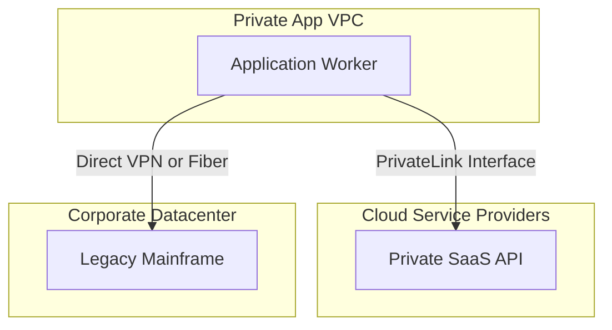
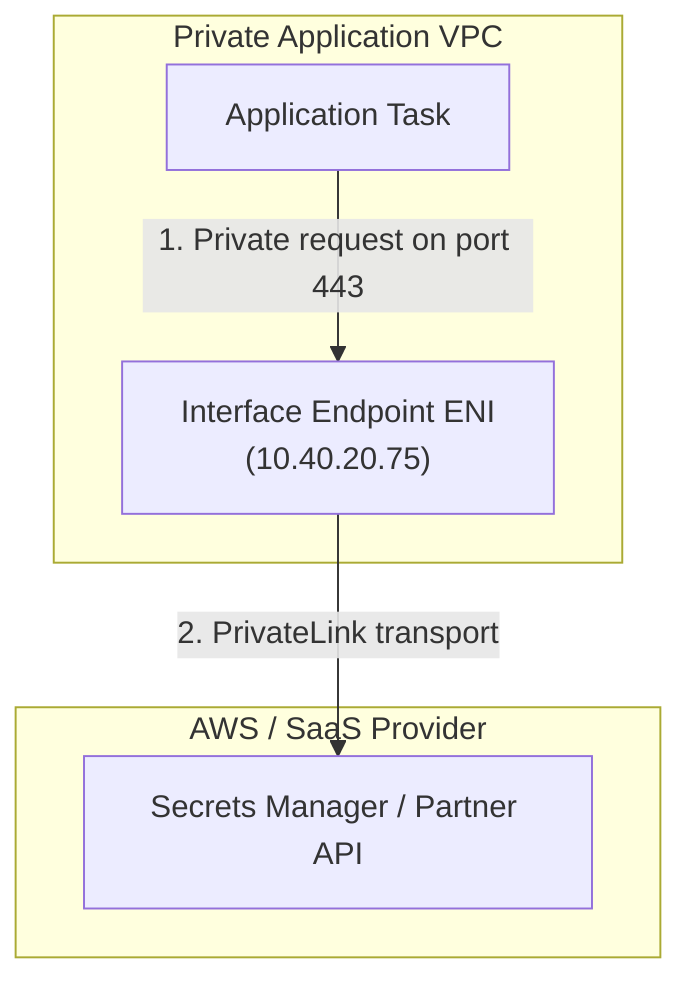
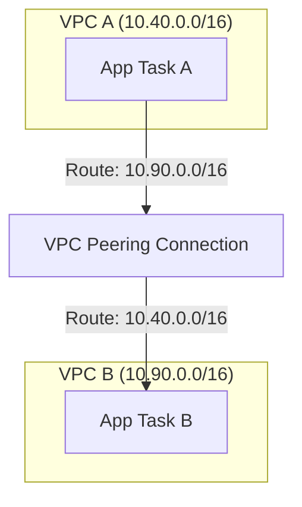
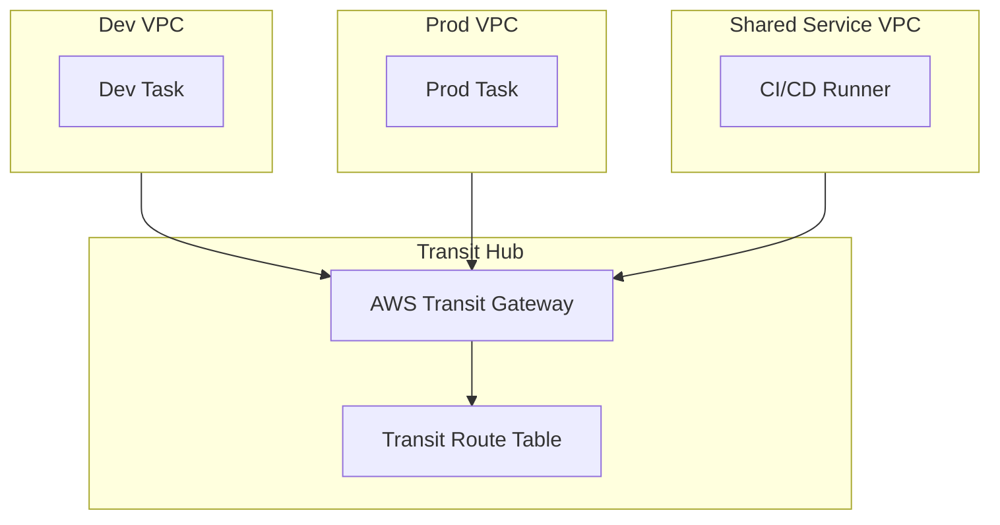
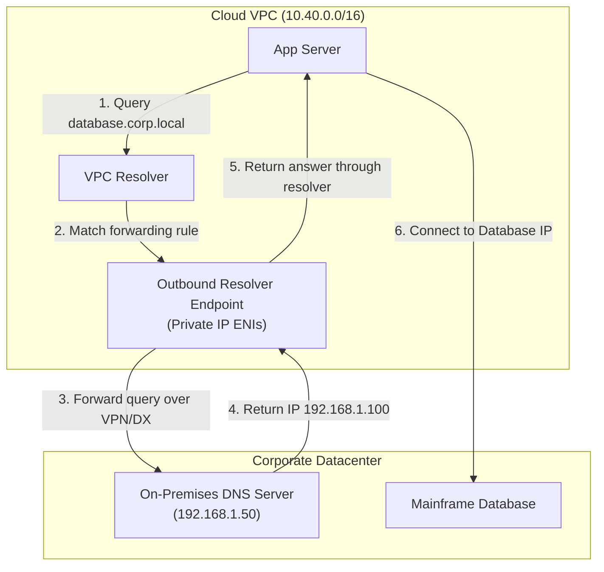

## Table of Contents

1. [Connecting Beyond the Single Network Container](#connecting-beyond-the-single-network-container)
2. [Categorizing the Five Connectivity Workloads](#categorizing-the-five-connectivity-workloads)
3. [Interface Endpoints and AWS PrivateLink](#interface-endpoints-and-aws-privatelink)
4. [The Critical Hinge: Private DNS Support](#the-critical-hinge-private-dns-support)
5. [VPC Peering: Direct One-to-One Connections](#vpc-peering-direct-one-to-one-connections)
6. [AWS Transit Gateway: Organization-Scale Hubs](#aws-transit-gateway-organization-scale-hubs)
7. [Extending to Physical Datacenters: VPN vs. Direct Connect](#extending-to-physical-datacenters-vpn-vs-direct-connect)
8. [Route 53 Resolver: Bridging Cloud and Local DNS](#route-53-resolver-bridging-cloud-and-local-dns)
9. [Solving the Four Silent Connectivity Killers](#solving-the-four-silent-connectivity-killers)
10. [Putting It All Together](#putting-it-all-together)

## Connecting Beyond the Single Network Container

Our regional VPC topology provides private application tiers, isolated databases, and cabled gateways that balance public internet entry with secure, outbound NAT translation. This structure is sufficient for a single application stack. 

However, as a platform grows, your secure VPC cannot remain a closed island.

When you develop an application on your local laptop, reaching out to other APIs is trivial. You call public endpoints over the internet, or connect directly to local servers on your office local area network (LAN) because your computer is cabled directly to them. 

In our secure cloud environment, your application workers reside in private subnets with no direct inbound internet routes, and their outbound NAT egress is strictly monitored.

If your private code needs to read configurations from AWS Secrets Manager, pull container packages from a registry, call a sibling microservice running in a partner account, or extract transactional histories from an on-premises mainframe, you need to decide which paths should stay private, which paths may use encrypted internet tunnels, and which paths need dedicated circuits.

The goal is not one universal product. The goal is a clear model for the name-resolution path, the forward route, the return route, and the security policy that allows the traffic.

The key to mastering cloud connectivity is to stop asking which networking product exists, and start by identifying the exact workload requirements: what needs to talk to what, and does the target look like a service, a sibling VPC, an enterprise hub, or a physical corporate network?

*Private connectivity starts with the target. Use PrivateLink for services, peering for one direct VPC relationship, Transit Gateway for many VPCs, VPN or Direct Connect for physical networks, and Route 53 Resolver when names must cross the boundary.*

## Categorizing the Five Connectivity Workloads

AWS private connectivity becomes manageable once you assign each tool to a specific architectural job.

* **Workload 1: Reach core AWS APIs privately without NAT**
  * **AWS Tool**: Interface VPC Endpoints cabled with AWS PrivateLink.
  * **Network representation**: A private IP address on an Elastic Network Interface in your private subnet.
* **Workload 2: Connect two sibling VPCs directly**
  * **AWS Tool**: VPC Peering.
  * **Network representation**: Private routes mapped between the two VPC CIDR blocks.
* **Workload 3: Connect dozens of VPCs across accounts**
  * **AWS Tool**: AWS Transit Gateway.
  * **Network representation**: A central network hub and transit routing tables.
* **Workload 4: Link your cloud VPC to a physical office over the internet**
  * **AWS Tool**: AWS Site-to-Site VPN.
* **Network representation**: Encrypted IPsec tunnels over the public internet, terminated by virtual private gateways or Transit Gateway.
* **Workload 5: Link your cloud VPC to a datacenter over a dedicated physical line**
  * **AWS Tool**: AWS Direct Connect.
  * **Network representation**: A physical dedicated fiber circuit bypassing the internet.

By aligning these tools with their specific connectivity jobs, you can construct a resilient hybrid network without pretending every private-looking path uses the same transport.

## Interface Endpoints and AWS PrivateLink

Gateway Endpoints solve private access for S3 and DynamoDB by modifying subnet route tables. However, other AWS services, SaaS platforms, and third-party partner applications cannot integrate directly with your route tables in this manner. 

For these services, you deploy Interface Endpoints cabled with AWS PrivateLink.

An Interface Endpoint places an Elastic Network Interface (ENI) directly inside your private subnets. This interface is assigned a private IP address from your subnet's CIDR range. 

When your application worker needs to interact with an external API, it sends its requests directly to the private IP of this interface inside your VPC.

This model provides significant security advantages:
* **No Outbound NAT Gateway Required**: Private workloads can reach AWS APIs (such as Secrets Manager, CloudWatch Logs, and ECR) without requiring any NAT outbound path to the public internet. Interface endpoints have their own hourly and data processing charges, so the cost decision depends on traffic volume, NAT Gateway usage, and the number of endpoints.
* **Granular Network Interfaces**: Interface Endpoints have their own Security Groups. You can lock down the endpoint interface to accept traffic strictly from your application's Security Group, enforcing a zero-trust boundary.
* **Secure Third-Party SaaS Access**: A service provider can host their application in their own VPC, publish it via an endpoint service, and allow your VPC to establish a PrivateLink Interface Endpoint. You see the service as a private IP in your network, while the provider never gains broad access to the rest of your VPC.

## The Critical Hinge: Private DNS Support

When you configure an Interface Endpoint, AWS provides you with a set of service-specific DNS hostnames, such as `vpce-0123456789abcdef-us-east-1.amazonaws.com`. 

If you configure your application code to call these generated hostnames directly, your code becomes highly dependent on AWS-specific configurations, which can make local testing difficult.

AWS solves this through a feature called Private DNS Support. When you enable Private DNS on an Interface Endpoint, AWS registers a private hosted zone in your VPC DNS. 

This hosted zone makes the standard service hostname (such as `secretsmanager.us-east-1.amazonaws.com`) resolve to the private IP addresses of your endpoint interfaces inside your VPC. Your code keeps calling the ordinary AWS service name; the VPC DNS answer changes the packet path.

This Private DNS hinge creates a common diagnostic gotcha. If your VPC does not have the `enableDnsHostnames` and `enableDnsSupport` attributes set to true, or if you are bypassing the default Route 53 Resolver with custom DNS servers, Private DNS cannot function. 

Your application code may resolve the public IP of the AWS service, attempt to route the traffic through NAT or the public internet, and fail if the private subnet lacks that exit path. The same symptom can also appear when custom DNS servers do not forward AWS service names back to the VPC resolver.

## VPC Peering: Direct One-to-One Connections

When you need to establish direct, bidirectional communication between two individual VPCs, the simplest architectural pattern is VPC Peering. A peering connection allows resources in VPC-A to communicate privately with resources in VPC-B using standard private IP routing.

Peering operates purely at the routing layer. Once a peering connection is established, you configure a static route in VPC-A's route tables pointing to VPC-B's CIDR block through the peering connection, and then write the corresponding return route in VPC-B.

While VPC Peering is highly effective for direct connections, it carries three strict constraints that limit its scale:

* **Non-Overlapping CIDRs**: You cannot peer two VPCs if their IP address blocks overlap. If both VPCs use `10.40.0.0/16`, establishing a peering link is impossible because routing engines cannot resolve duplicate paths.
* **Strictly Non-Transitive**: VPC Peering is not transitive. If VPC-A is peered with VPC-B, and VPC-B is peered with VPC-C, resources in VPC-A cannot communicate with VPC-C through the middle VPC. You must establish a direct peering link between VPC-A and VPC-C.
* **No Gateway Sharing**: A peered VPC cannot share its Internet Gateway, NAT Gateway, VPN tunnel, or Direct Connect circuit with its peering partners. Peering is limited strictly to same-VPC-to-VPC traffic.

Because of these limitations, a peering mesh becomes difficult to manage as your organization grows. If you have ten VPCs that all need to communicate, you must manage 45 individual peering links and hundreds of static route updates, which quickly leads to configuration drift.

## AWS Transit Gateway: Organization-Scale Hubs

To simplify multi-account and multi-VPC networking at scale, AWS provides Transit Gateway. Transit Gateway acts as a highly redundant, regional virtual router that centralizes all routing policies. 

Instead of constructing a complex mesh of peering links, you connect VPC attachments and VPN attachments to a single central transit gateway hub. Direct Connect commonly reaches Transit Gateway through a Direct Connect gateway and a transit virtual interface, so the physical circuit and the transit router remain separate pieces in the design.

Transit Gateway manages routing through its own Transit Route Tables. When you attach a VPC to the gateway, you associate it with a Transit Route Table. 

Attachments can dynamically propagate their CIDR ranges into the transit tables, allowing the hub to learn routing paths automatically, rather than requiring you to configure manual static routes.

Operating a Transit Gateway introduces significant platform advantages:
* **Centralized Network Account**: A dedicated network engineering team can own the Transit Gateway inside a central AWS account, sharing attachments with application accounts via AWS Resource Access Manager (RAM).
* **Controlled Traffic Segregation**: You can create separate Transit Route Tables to isolate environments completely. For example, you can configure your Transit Gateway to allow Dev and Prod VPCs to reach your Shared Services VPC, while explicitly blocking all traffic between the Dev and Prod VPCs themselves.
* **Simplified Hybrid Exit Paths**: Instead of establishing individual VPN tunnels or physical fiber circuits for every single VPC, you can establish a single hybrid path to your data center, allowing all attached VPCs to share the connection.

## Extending to Physical Datacenters: VPN vs. Direct Connect

When your cloud workloads need to communicate privately with systems residing outside AWS, such as legacy mainframes, licensing engines, or active directories in a physical corporate office, you must establish a secure hybrid network.

AWS provides two primary pathways for bridging your cloud VPC to an on-premises network:

* **AWS Site-to-Site VPN**: Establishes encrypted IPsec tunnels over the public internet. You configure a virtual private gateway or attach the VPN directly to your Transit Gateway, while a customer gateway device terminates the tunnels on your physical network. Since it leverages your existing internet connectivity, a VPN can be established in minutes, serving as a cost-effective option or as an independent backup path.
* **AWS Direct Connect**: Bypasses the internet entirely by linking your physical network to an AWS Direct Connect location over a dedicated, physical fiber-optic connection. From this location, you configure private virtual interfaces to route traffic directly to your VPCs. Direct Connect provides highly predictable latency, massive bandwidth, and reduced network cost for high-volume enterprise traffic.

Choosing the right hybrid path requires balancing deployment speed against performance demands:

| Metric | AWS Site-to-Site VPN | AWS Direct Connect |
| --- | --- | --- |
| **Transport Medium** | Public Internet (IPsec Encrypted) | Dedicated Physical Fiber Circuit |
| **Deployment Time** | Minutes (Software Configuration) | Weeks to Months (Physical Cabling) |
| **Bandwidth Capacity** | Commonly up to 1.25 Gbps per tunnel, with higher-throughput options depending on configuration | Dedicated connections are available in several capacities, including 1 Gbps, 10 Gbps, 100 Gbps, and higher-capacity options in supported locations |
| **Latency and Jitter** | Variable (Internet congestion dependent) | Exceptionally Stable and Predictable |
| **Primary Use Case** | Fast setup, dev environments, backup paths | Production enterprise hybrid data pipelines |

A resilient enterprise design often deploys a high-bandwidth Direct Connect circuit as the primary data highway, with an AWS Site-to-Site VPN configured in active-standby as a cost-effective, internet-based backup path.

## Route 53 Resolver: Bridging Cloud and Local DNS

Establishing hybrid tunnels or dedicated fiber circuits allows IP packets to travel between your cloud VPC and your physical datacenters. However, network paths are practically useless if servers cannot resolve domain names.

When a virtual instance in AWS attempts to write to a database on-premises, it cannot use public DNS resolvers to resolve `database.corp.local`. 

Conversely, when a physical database administrator on-premises attempts to monitor a private cloud worker, their local system cannot query private AWS Route 53 hosted zones.

AWS resolves this DNS boundary using Route 53 Resolver Endpoints:

* **Inbound Resolver Endpoints**: Place private network interfaces inside your VPC subnets. You configure your physical, on-premises DNS servers to forward all queries for cloud-hosted domains (such as `*.aws.mycompany.internal`) to these inbound interface IPs.
* **Outbound Resolver Endpoints**: Allow the Route 53 Resolver to forward queries outwards. You write a resolver forwarding rule inside the VPC: "If a workload queries a domain matching `*.corp.local`, forward the query through the Outbound Endpoint to the private IP of our physical, on-premises DNS servers."

By configuring hybrid DNS resolution alongside your tunnels or physical circuits, you ensure that name resolution and packet routing follow the same architectural intent.

## Solving the Four Silent Connectivity Killers

When private connectivity fails, the root cause is usually one of four quiet gates that do not leave immediate errors in your application consoles.

* **Killer 1: Overlapping IP Address Spaces**
  * **The Symptom**: A VPC Peering request fails instantly, or a Transit Gateway attachment connects successfully but packets are dropped without a trace.
  * **The Cause**: Two private networks are using the same CIDR range. Routing engines cannot resolve duplicate paths, making private communication impossible.
  * **The Cure**: Always plan non-overlapping CIDR blocks before deploying any network, leaving a buffer for future peerings.
* **Killer 2: Missing Return Path Routes**
  * **The Symptom**: A server can ping a destination, but the application times out waiting for a connection.
  * **The Cause**: The source subnet has a route to the destination, but the destination subnet lacks a return route back to the source's CIDR block.
  * **The Cure**: Audit route tables on both sides of the connection, ensuring that return routes are explicitly registered.
* **Killer 3: Security Policy Mismatch**
  * **The Symptom**: DNS resolves and routes exist, but connection attempts time out or reset.
  * **The Cause**: A security group, network ACL, endpoint policy, resource policy, or on-premises firewall blocks the traffic after routing succeeds.
  * **The Cure**: Check the security policy on every hop, including the endpoint ENI, source workload, target workload, and external firewall.
* **Killer 4: DNS Name Resolution Mismatch**
  * **The Symptom**: Tunnels are up, routing is perfect, but the application fails to connect, throwing a "Host Not Found" error.
  * **The Cause**: Workloads are resolving domain names via the public internet rather than using private interface endpoints or hybrid Route 53 Resolver paths.
  * **The Cure**: Verify that VPC DNS attributes are active, that private DNS is enabled for interface endpoints when intended, and that forwarding rules point through the correct Route 53 Resolver endpoints.

## Putting It All Together

Securing and scaling an AWS network means systematically extending your private boundaries beyond a single VPC.

* **AWS PrivateLink**: Places private interface endpoint ENIs directly inside your subnets, enabling private access to supported AWS APIs and SaaS services without NAT gateways, with endpoint charges that must be compared against NAT and data transfer costs.
* **Private DNS Support**: Intercepts public domain requests inside your VPC, automatically routing traffic to private endpoint interfaces without requiring code changes.
* **VPC Peering**: Provides simple, direct one-to-one private routing between non-overlapping VPCs, though it remains non-transitive and difficult to scale as a mesh.
* **Transit Gateway**: Acts as a centralized regional router, simplifying multi-VPC architectures and allowing you to segregate dev, prod, and shared traffic using transit route tables.
* **Site-to-Site VPN & Direct Connect**: Bridge the gap to physical networks, combining the rapid deployment of encrypted internet VPN tunnels with the stable latency and massive bandwidth of dedicated Direct Connect fiber.
* **Route 53 Resolver Endpoints**: Connect your cloud and on-premises DNS servers, ensuring that domain names resolve cleanly across hybrid networks.

By mastering these connectivity patterns, you transform AWS networking from a collection of isolated servers into a seamless global architecture, cabled with clear traffic lanes, robust packet filters, and private naming.

*Use this as the connectivity checklist: keep service access private with PrivateLink, make DNS resolve to the intended private path, avoid peering sprawl, centralize large networks with Transit Gateway, choose VPN or Direct Connect deliberately, and bridge names with Route 53 Resolver.*

---

**References**

- [AWS PrivateLink concepts](https://docs.aws.amazon.com/vpc/latest/privatelink/concepts.html) - Explains interface endpoints, endpoint services, and private DNS behavior.
- [Route 53 Resolver](https://docs.aws.amazon.com/Route53/latest/DeveloperGuide/resolver.html) - Documents inbound and outbound resolver endpoints and forwarding rules.
- [How transit gateways work](https://docs.aws.amazon.com/vpc/latest/tgw/how-transit-gateways-work.html) - Describes attachments, route tables, propagation, and centralized routing.
- [Direct Connect gateways](https://docs.aws.amazon.com/directconnect/latest/UserGuide/direct-connect-gateways-intro.html) - Explains how Direct Connect gateways connect private and transit virtual interfaces to AWS networks.
- [Site-to-Site VPN quotas](https://docs.aws.amazon.com/vpn/latest/s2svpn/vpn-limits.html) - Lists tunnel and throughput quotas for VPN connectivity.
- [AWS PrivateLink pricing](https://aws.amazon.com/privatelink/pricing/) - Provides endpoint hourly and data processing pricing context.
