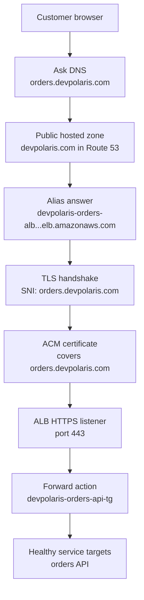

## Table of Contents

1. [The Path From Name To Service](#the-path-from-name-to-service)
2. [Hosted Zones And Records](#hosted-zones-and-records)
3. [The ALB DNS Name Is The Real Entry Point](#the-alb-dns-name-is-the-real-entry-point)
4. [Alias Records Connect The Friendly Name To AWS](#alias-records-connect-the-friendly-name-to-aws)
5. [ACM Certificates Prove The Name Is Yours](#acm-certificates-prove-the-name-is-yours)
6. [HTTPS Listeners Terminate TLS](#https-listeners-terminate-tls)
7. [SNI Explains How One Listener Serves Many Names](#sni-explains-how-one-listener-serves-many-names)
8. [Failure Modes You Will Actually See](#failure-modes-you-will-actually-see)
9. [A Practical Diagnostic Path](#a-practical-diagnostic-path)

## The Path From Name To Service

A browser cannot send a safe request to a service just because the user typed a friendly name.
Several small systems must agree before the request reaches your code.
DNS must turn the name into a reachable entry point.
TLS must prove that the entry point is allowed to speak for that name.
The load balancer must accept the request and forward it to a healthy backend.

That is what this article is about.
DNS (Domain Name System, the internet's naming system) answers "where should this name go?"
A domain is the human-owned name, such as `devpolaris.com`.
A TLS certificate is the signed identity document that lets a browser trust `https://orders.devpolaris.com`.
An entry point is the public AWS resource that receives traffic before it reaches the service, usually an Application Load Balancer for a web API.

The reason these pieces are separate is safety and flexibility.
You want users to remember `orders.devpolaris.com`, not a long AWS-generated name.
You also want to replace a load balancer, rotate certificates, or move targets without asking every customer to change their bookmark.
The friendly name stays stable while the AWS resources behind it can change carefully.

We will use one running example: `devpolaris-orders-api`.
The public URL is `https://orders.devpolaris.com`.
Route 53 hosts DNS for `devpolaris.com`.
An Application Load Balancer named `devpolaris-orders-alb` receives internet traffic.
An ACM certificate covers `orders.devpolaris.com`.
The HTTPS listener on port `443` forwards requests to the `devpolaris-orders-api-tg` target group.

Read the path from top to bottom.
Each box answers one beginner question.



There are two important lessons hiding in this diagram.
First, DNS does not prove safety.
DNS only helps the browser find where to connect.
The certificate proves that the server on the other end is trusted for the hostname.

Second, target health is late in the path.
Your backend can be perfectly healthy while users still fail at DNS or TLS.
That is why debugging a custom domain starts at the name, not at the application logs.

> When a custom domain breaks, ask which promise failed: the name, the certificate, the listener, or the target.

## Hosted Zones And Records

Route 53 is AWS's DNS service.
For this article, the main Route 53 object is a hosted zone.
A hosted zone is a container for DNS records for one domain, such as `devpolaris.com`, and its subdomains, such as `orders.devpolaris.com`.
Think of it like the authoritative address book for that domain.

There are public hosted zones and private hosted zones.
A public hosted zone answers DNS questions from the internet.
A private hosted zone answers DNS questions inside one or more VPCs.
For `orders.devpolaris.com`, we need a public hosted zone because browsers on the internet must resolve the name.

The hosted zone does not automatically send traffic anywhere useful.
It only holds records.
A record is one instruction in DNS.
It says, "for this name and this record type, answer like this."

Here is the small Route 53 shape for the orders API.
The exact hosted zone ID is fake, but the structure is realistic.

| Route 53 Object | Example Value | What It Means |
|-----------------|---------------|---------------|
| Hosted zone | `devpolaris.com` | The DNS container for the domain |
| Record name | `orders.devpolaris.com` | The API name users call |
| Record type | `A` alias | Return IPv4 addresses for an AWS target |
| Alias target | `dualstack.devpolaris-orders-alb-123456789.us-east-1.elb.amazonaws.com` | The ALB DNS name Route 53 follows |
| Evaluate target health | `No` for the first simple setup | DNS does not decide app health yet |

The record name matters more than beginners expect.
If the certificate covers `orders.devpolaris.com`, but the record is `order.devpolaris.com`, the browser is asking for a different name.
If the record exists in a private hosted zone only, your laptop may not resolve it from the public internet.
If the domain registrar still points to old name servers, your beautiful Route 53 record may sit unused.

You can get quick evidence with `dig`.
This command asks DNS for the public answer.

```bash
$ dig +short orders.devpolaris.com
203.0.113.41
203.0.113.92
198.51.100.17
```

Those IP addresses are not addresses you manually typed into the record.
They are the current public addresses behind the load balancer DNS name.
With an alias record to an ALB, Route 53 follows the AWS target and returns useful answers for the record type you asked for.

If DNS returns no answer, do not jump to the app.
The app has not seen the request yet.
Look at the hosted zone, the record name, and the domain's name server delegation first.

```bash
$ dig +short orders.devpolaris.com

$ dig +short NS devpolaris.com
ns-122.awsdns-15.com.
ns-801.awsdns-36.net.
ns-1442.awsdns-52.org.
ns-1808.awsdns-34.co.uk.
```

An empty first answer says the hostname did not resolve.
The `NS` answer shows which name servers are authoritative for `devpolaris.com`.
If your registrar lists different name servers than the hosted zone, public DNS may be asking the wrong address book.

## The ALB DNS Name Is The Real Entry Point

An Application Load Balancer receives a default DNS name when AWS creates it.
It looks long because it is meant for machines, not for customers.
For our example, the ALB name might be:

```text
dualstack.devpolaris-orders-alb-123456789.us-east-1.elb.amazonaws.com
```

That name is the real public entry point.
The custom domain is the friendly label that points to it.
If you remove the custom domain from the story, the load balancer can still receive requests at its AWS-generated name.

This distinction matters during debugging.
If the ALB DNS name works but `orders.devpolaris.com` does not, the load balancer and service path may be fine.
The problem is likely DNS or TLS for the custom name.
If both names fail, the listener, security group, target group, or backend path may be broken.

Here is a quick evidence snapshot.
The first command checks the ALB name directly.
The second command checks the friendly name.

```bash
$ curl -I http://dualstack.devpolaris-orders-alb-123456789.us-east-1.elb.amazonaws.com/health
HTTP/1.1 200 OK
content-type: application/json
content-length: 17

$ curl -I http://orders.devpolaris.com/health
HTTP/1.1 200 OK
content-type: application/json
content-length: 17
```

This only proves plain HTTP on port `80`.
It does not prove HTTPS.
It also does not prove the certificate is correct.
It tells you that DNS and the ALB HTTP listener can reach the health endpoint.

For `devpolaris-orders-api`, the desired production path is not plain HTTP from the browser.
The desired path is:

```text
Customer browser
  -> https://orders.devpolaris.com
  -> Route 53 alias
  -> ALB HTTPS listener on 443
  -> devpolaris-orders-api target group
```

The ALB DNS name is useful as evidence, but you should not teach users to call it directly.
The user-facing contract is the custom domain.
The long AWS name is an implementation detail that helps you diagnose the path.

## Alias Records Connect The Friendly Name To AWS

You might expect a DNS record for `orders.devpolaris.com` to be a CNAME.
A CNAME says "this name is another name."
That is common on the public internet, but Route 53 has a special record behavior called an alias record.

An alias record is Route 53's AWS-aware pointer.
It can point to selected AWS resources, including Elastic Load Balancing load balancers.
For an Application Load Balancer, you usually create an `A` alias record, and sometimes an `AAAA` alias record if your ALB supports IPv6.
The record still behaves like an address answer to clients.

The beginner-friendly reason to prefer an alias for this setup is simple:
you want `orders.devpolaris.com` to follow the load balancer, not store a fixed IP address.
ALB node IP addresses can change as AWS scales and maintains the load balancer.
The ALB DNS name is stable enough to target.
The individual IP addresses behind it are not a thing you should copy into DNS by hand.

Here is the practical Route 53 record.

| Field | Value |
|-------|-------|
| Hosted zone | `devpolaris.com` |
| Record name | `orders` |
| Record type | `A` |
| Alias | `Yes` |
| Route traffic to | `Alias to Application and Classic Load Balancer` |
| Region | `us-east-1` |
| Load balancer | `dualstack.devpolaris-orders-alb-123456789.us-east-1.elb.amazonaws.com` |

Notice the record name is just `orders` in the console when you are already inside the `devpolaris.com` hosted zone.
The full DNS name becomes `orders.devpolaris.com`.
This is a common place to make a doubled-name mistake, such as `orders.devpolaris.com.devpolaris.com`.

`dig` will not usually show the word "alias" in the answer.
That is normal.
Alias is a Route 53 configuration detail.
From the outside, the record answers like the address record you created.

```bash
$ dig orders.devpolaris.com A +short
203.0.113.41
203.0.113.92
198.51.100.17

$ dig orders.devpolaris.com CNAME +short
```

The empty CNAME answer is not a problem.
It means the public DNS response is not a CNAME response.
The Route 53 console or AWS CLI record listing is where you confirm the alias target.

The tradeoff is worth saying out loud.
Alias records are convenient and fit AWS load balancers well.
They are also Route 53 specific behavior, not a plain DNS feature you can move unchanged to every DNS provider.
That is usually fine when Route 53 owns the hosted zone, but it matters during migrations.

## ACM Certificates Prove The Name Is Yours

DNS gets the browser to the entry point.
TLS decides whether the browser should trust that entry point.
For HTTPS, the load balancer presents a certificate.
The certificate must be valid for the hostname the browser requested, and it must chain back to a trusted certificate authority.

AWS Certificate Manager, usually called ACM, is the AWS service that issues, stores, renews, and integrates TLS certificates with services such as Elastic Load Balancing.
For our example, the team requests a public ACM certificate for `orders.devpolaris.com`.
The certificate can cover one name, several names, or a wildcard such as `*.devpolaris.com`.
For a beginner setup, a single-name certificate is easier to reason about.

ACM must verify that you control the domain before it issues a public certificate.
With DNS validation, ACM gives you a CNAME record to place in DNS.
That record is not the user-facing app record.
It is a proof record that says, "the owner of this domain allowed this certificate request."

Here is a realistic ACM status table while the request is waiting for validation.

| ACM Field | Example Value | What To Check |
|-----------|---------------|---------------|
| Certificate domain | `orders.devpolaris.com` | Must match the public hostname |
| Validation method | `DNS` | Best when you can edit DNS |
| Status | `Pending validation` | ACM has not seen the validation CNAME yet |
| CNAME name | `_a1b2c3d4.orders.devpolaris.com` | Add this to public DNS |
| CNAME value | `_f6e7d8c9.acm-validations.aws` | Must be exact |
| Region | `us-east-1` | Must match the ALB Region for this example |

After the validation CNAME exists in public DNS, ACM can issue the certificate.
The status should move to `Issued`.

```bash
$ dig +short _a1b2c3d4.orders.devpolaris.com CNAME
_f6e7d8c9.acm-validations.aws.
```

That output proves the validation CNAME is visible publicly.
If ACM stays in `Pending validation`, check whether the record was created in the public hosted zone, whether the name was doubled, and whether the value has the right trailing domain.

The Region field is not a detail to skip.
ACM certificates are regional resources for Elastic Load Balancing.
If the ALB is in `us-east-1`, the certificate you attach to that ALB listener must also be available in `us-east-1`.
A valid certificate in `us-west-2` can look correct in ACM, but it will not be attachable to an ALB listener in `us-east-1`.

Once the certificate is issued, you can inspect what the browser will see.
The important flag here is `-servername`.
It sends the hostname during the TLS handshake.
We will explain why in the SNI section.

```bash
$ openssl s_client -connect orders.devpolaris.com:443 -servername orders.devpolaris.com </dev/null 2>/dev/null \
  | openssl x509 -noout -subject -issuer -dates
subject=CN = orders.devpolaris.com
issuer=C = US, O = Amazon, CN = Amazon RSA 2048 M03
notBefore=Apr 20 00:00:00 2026 GMT
notAfter=May 19 23:59:59 2027 GMT
```

This proves the server presented a certificate for `orders.devpolaris.com`.
It does not prove the app response is correct.
It proves the identity layer is working.

## HTTPS Listeners Terminate TLS

An Application Load Balancer uses listeners to receive client connections.
A listener is the load balancer process that checks a protocol and port, such as `HTTP:80` or `HTTPS:443`.
Without a listener, the load balancer has no rule for that kind of connection.

For the orders API, the important listener is `HTTPS:443`.
That listener needs at least one server certificate.
It also needs a default action, which is what the listener does when a request matches no more specific rule.
In our simple setup, the default action forwards to `devpolaris-orders-api-tg`.

Here is the listener shape you want the beginner to recognize.

| Listener Field | Example Value | Why It Matters |
|----------------|---------------|----------------|
| Protocol and port | `HTTPS:443` | Browser HTTPS traffic arrives here |
| Default certificate | `orders.devpolaris.com` ACM certificate | ALB proves the hostname during TLS |
| Security policy | Managed ALB TLS policy | Defines allowed TLS versions and ciphers |
| Default action | `Forward to devpolaris-orders-api-tg` | Sends valid requests to the service |
| Target group protocol | `HTTP:8080` | ALB talks to the backend on the app port |
| Target health | `Healthy` | ALB has backends ready to receive traffic |

This setup is called TLS termination at the load balancer.
The browser's encrypted connection ends at the ALB.
The ALB decrypts the request, reads HTTP details like host and path, applies listener rules, then forwards the request to the target group.

That design is common because it keeps certificate handling out of the application.
The `devpolaris-orders-api` service does not need to load private keys, renew certificates, or choose TLS ciphers.
It can focus on handling orders.

The tradeoff is that traffic from the ALB to the target is a separate connection.
In a simple private subnet setup, teams often use HTTP from ALB to target.
If your organization requires encryption all the way to the target, you can configure the target group to use HTTPS too, but then your backend must also serve TLS and manage a certificate it can present to the ALB.

One more practical detail: when TLS terminates at the ALB, the backend may see the request as plain HTTP unless it trusts forwarded headers.
Application code that builds absolute URLs or redirects should look at headers such as `X-Forwarded-Proto`.
If the app ignores those headers, it may accidentally redirect users from HTTPS back to HTTP.

Here is a healthy end-to-end check from outside the system.

```bash
$ curl -I https://orders.devpolaris.com/health
HTTP/2 200
date: Sat, 02 May 2026 10:24:16 GMT
content-type: application/json
content-length: 17
```

The useful evidence is not just `200`.
The `https://` URL proves the TLS path worked.
`HTTP/2` is common on ALB HTTPS listeners.
The response reaching `/health` proves the listener forwarded to a healthy target group.

## SNI Explains How One Listener Serves Many Names

SNI means Server Name Indication.
It is a TLS extension where the client says the hostname it wants before the server chooses a certificate.
The simplest mental model is a hotel front desk.
Many guests arrive at the same address, but each guest says which reservation name they need.
The front desk uses that name to choose the right room key.

An ALB can have one HTTPS listener on port `443` and serve multiple hostnames.
For example, the same ALB could receive:

```text
orders.devpolaris.com
billing.devpolaris.com
admin.devpolaris.com
```

Each hostname can have its own certificate attached to the listener certificate list.
When the browser connects, it sends SNI with the hostname.
The ALB uses that hostname to choose the best matching certificate from the listener's certificate list.
If no certificate matches, the ALB falls back to the default certificate.

That fallback behavior is why certificate bugs can be confusing.
The ALB might present a perfectly valid certificate, but for the wrong name.
Your browser still rejects it because the certificate identity does not match the URL.

Here is the healthy SNI check.

```bash
$ openssl s_client -connect orders.devpolaris.com:443 -servername orders.devpolaris.com </dev/null 2>/dev/null \
  | openssl x509 -noout -subject
subject=CN = orders.devpolaris.com
```

Now compare it with a broken check where the client does not send SNI.
This can happen with old clients or incomplete test commands.

```bash
$ openssl s_client -connect orders.devpolaris.com:443 </dev/null 2>/dev/null \
  | openssl x509 -noout -subject
subject=CN = default.devpolaris.com
```

This does not always mean the browser is broken.
Modern browsers send SNI.
It means your test did not tell the ALB which hostname you wanted, so the ALB returned its default certificate.

When you troubleshoot HTTPS on an ALB, always include `-servername orders.devpolaris.com` in `openssl s_client`.
Without it, you may be debugging the default certificate instead of the certificate your real users receive.

The listener certificate list for our example should look like this:

| Listener Certificate Role | Domain Name | Purpose |
|---------------------------|-------------|---------|
| Default certificate | `orders.devpolaris.com` | Safe default for this single-domain ALB |
| Optional additional certificate | `billing.devpolaris.com` | Only needed if the same listener serves billing |
| Optional wildcard certificate | `*.devpolaris.com` | Useful for many one-level subdomains |

For a single service entry point, keep the certificate story boring.
Attach the exact certificate for `orders.devpolaris.com`.
Add more certificates only when you actually serve more names through the same listener.

## Failure Modes You Will Actually See

The hardest part of custom domains is that each layer can fail with a different symptom.
Your job is to match the symptom to the layer before you change anything.
Changing the app when DNS is wrong only wastes time.
Changing DNS when the certificate is wrong can make the outage wider.

Use this table as the first triage map.

| Symptom | Likely Layer | What It Looks Like | Fix Direction |
|---------|--------------|--------------------|---------------|
| DNS points to the wrong ALB | Route 53 record | `dig` answers, but the alias target is the staging ALB | Update the `orders` alias to the production ALB |
| Certificate is not valid for domain | ACM or listener certificate | Browser shows hostname mismatch | Request or attach a certificate covering `orders.devpolaris.com` |
| HTTP works but HTTPS fails | ALB listener or security group | `http://` returns `200`, `https://` cannot connect | Add `HTTPS:443` listener, attach cert, allow port `443` |
| Certificate is in wrong Region | ACM Region | Cert exists but is not selectable on the listener | Request or import the cert in the ALB's Region |
| Targets are healthy but domain fails | DNS or TLS before target group | Target group shows healthy, browser still errors | Start at `dig` and `openssl`, not app logs |

Here is the wrong-ALB failure.
The service team moved production to a new load balancer, but the alias still points at the old staging ALB.

```text
Route 53 hosted zone: devpolaris.com

Record name                  Type   Alias target
orders.devpolaris.com        A      dualstack.devpolaris-orders-staging-alb-222222.us-east-1.elb.amazonaws.com
```

The symptom can be strange.
DNS resolves.
TLS may even work if staging also has a certificate.
But users hit the wrong environment.
The fix is not in the target group.
The fix is to update the alias target to the production ALB and verify the answer after propagation.

Here is the certificate-mismatch failure.

```bash
$ openssl s_client -connect orders.devpolaris.com:443 -servername orders.devpolaris.com </dev/null 2>/dev/null \
  | openssl x509 -noout -subject
subject=CN = api.devpolaris.com
```

The ALB is presenting a certificate for `api.devpolaris.com`, not `orders.devpolaris.com`.
Browsers reject this because a certificate is not a general "DevPolaris is good" badge.
It must match the hostname the user requested, either exactly or through a valid wildcard such as `*.devpolaris.com`.

Here is the "HTTP works but HTTPS fails" shape.

```bash
$ curl -I http://orders.devpolaris.com/health
HTTP/1.1 200 OK
content-type: application/json

$ curl -I https://orders.devpolaris.com/health
curl: (7) Failed to connect to orders.devpolaris.com port 443 after 3021 ms: Couldn't connect to server
```

This tells you DNS and the HTTP listener can reach the load balancer.
It does not prove the HTTPS listener exists.
Check the ALB listeners for `HTTPS:443`, check that a certificate is attached, and check that the load balancer security group allows inbound `443` from the internet.

Here is the wrong-Region certificate failure.

| Item | Value |
|------|-------|
| ALB | `devpolaris-orders-alb` |
| ALB Region | `us-east-1` |
| Certificate domain | `orders.devpolaris.com` |
| Certificate status | `Issued` |
| Certificate Region | `us-west-2` |
| Listener result | Certificate not available to attach |

Nothing is wrong with the certificate identity.
The problem is placement.
For an ALB, request or import the ACM certificate in the same Region as the load balancer.

Finally, here is the failure that catches many beginners: target health is green, but the custom domain still fails.

```text
Target group: devpolaris-orders-api-tg

Target ID           Port   Health
10.0.42.18          8080   healthy
10.0.58.21          8080   healthy
```

Healthy targets only prove the ALB can reach the backend.
They do not prove public DNS points to this ALB.
They do not prove the browser trusts the certificate.
They do not prove the HTTPS listener is attached to the right certificate.
When users fail before the request reaches the listener, the app logs may be silent.

## A Practical Diagnostic Path

When `https://orders.devpolaris.com` fails, do not start by changing settings.
Collect evidence in path order.
You want the first broken promise, because every later layer depends on it.

Step one is DNS.
Can the name resolve from a normal public network?

```bash
$ dig +short orders.devpolaris.com
203.0.113.41
203.0.113.92
198.51.100.17
```

If this is empty, inspect Route 53.
Check that the `devpolaris.com` public hosted zone has an `orders` record.
Check that your registrar delegates the domain to the Route 53 name servers.
Check that you did not create the record only in a private hosted zone.

Step two is the alias target.
Does the Route 53 record point to the expected ALB?

```text
Expected production ALB:
dualstack.devpolaris-orders-alb-123456789.us-east-1.elb.amazonaws.com

Route 53 alias target:
dualstack.devpolaris-orders-alb-123456789.us-east-1.elb.amazonaws.com
```

If these differ, stop there.
Pointing to the wrong ALB can make every other layer look misleading.
A staging ALB might return `200`, present a valid certificate, and still be the wrong service.

Step three is TLS identity.
Does the listener present a certificate for the requested hostname?

```bash
$ openssl s_client -connect orders.devpolaris.com:443 -servername orders.devpolaris.com </dev/null 2>/dev/null \
  | openssl x509 -noout -subject -issuer
subject=CN = orders.devpolaris.com
issuer=C = US, O = Amazon, CN = Amazon RSA 2048 M03
```

If the subject or Subject Alternative Name does not cover `orders.devpolaris.com`, fix ACM and the listener certificate attachment.
If no certificate appears, check whether the HTTPS listener exists.
If the certificate exists in another Region, request or import the certificate in the ALB Region.

Step four is the listener action.
After TLS works, check where the ALB sends the request.

| Listener | Certificate | Default Action |
|----------|-------------|----------------|
| `HTTPS:443` | `orders.devpolaris.com` | `forward: devpolaris-orders-api-tg` |
| `HTTP:80` | none | `redirect to HTTPS:443` |

This table shows a clean production pattern.
Port `443` serves the API.
Port `80` does not serve the app directly.
It redirects users to HTTPS so plain HTTP is not the normal path.

Step five is target health.
Only after DNS, TLS, and listener routing look right should you inspect the target group.

```text
Target group: devpolaris-orders-api-tg
Health check path: /health

Target ID           Port   Health    Reason
10.0.42.18          8080   healthy   -
10.0.58.21          8080   healthy   -
```

If targets are unhealthy, use the load balancer and target health article to debug backend reachability.
If targets are healthy and the domain still fails, go back to the earlier layers.
The request may not be reaching this target group at all.

Here is the whole diagnostic path as a compact checklist.

| Question | Evidence | Healthy Answer |
|----------|----------|----------------|
| Does the name resolve? | `dig +short orders.devpolaris.com` | Returns ALB node IPs |
| Is it the expected ALB? | Route 53 record details | Alias target is production ALB |
| Does TLS identify the right name? | `openssl s_client -servername` | Certificate covers `orders.devpolaris.com` |
| Is HTTPS attached correctly? | ALB listener table | `HTTPS:443` has cert and forward action |
| Can ALB reach the app? | Target group health | Registered targets are healthy |
| Does the full request work? | `curl -I https://orders.devpolaris.com/health` | `200`, `301`, or expected app response |

The main tradeoff in this design is centralizing the public entry point.
Route 53 alias plus ALB plus ACM gives the team one clean place to manage the public name, TLS certificate, redirects, and forwarding rules.
That makes the application simpler and gives operators clear evidence when something breaks.
The cost is that the entry point becomes its own thing to operate.
You must manage DNS records, listener certificates, Region placement, and redirects with the same care you give the service code.

That tradeoff is usually worth it for a public API.
Users get a stable HTTPS name.
The service team gets a controlled front door.
And when the domain fails, you now have a path that tells you where to look before you touch the app.

---

**References**

- [Working with hosted zones](https://docs.aws.amazon.com/Route53/latest/DeveloperGuide/hosted-zones-working-with.html) - Defines Route 53 hosted zones and the difference between public and private DNS containers.
- [Routing traffic to an ELB load balancer](https://docs.aws.amazon.com/Route53/latest/DeveloperGuide/routing-to-elb-load-balancer.html) - Shows how Route 53 alias records route domain traffic to Elastic Load Balancing load balancers.
- [Application Load Balancer DNS name](https://docs.aws.amazon.com/elasticloadbalancing/latest/application/application-load-balancers.html#dns-name) - Explains the default ALB DNS name and how custom domains resolve to it.
- [SSL certificates for your Application Load Balancer](https://docs.aws.amazon.com/elasticloadbalancing/latest/application/https-listener-certificates.html) - Covers default certificates, certificate lists, and SNI certificate selection on ALB HTTPS listeners.
- [AWS Certificate Manager DNS validation](https://docs.aws.amazon.com/acm/latest/userguide/dns-validation.html) - Explains the DNS CNAME records ACM uses to prove domain ownership and support managed renewal.
- [What is AWS Certificate Manager?](https://docs.aws.amazon.com/acm/latest/userguide/acm-overview.html) - Describes ACM certificate management and the regional nature of ACM certificates for Elastic Load Balancing.
