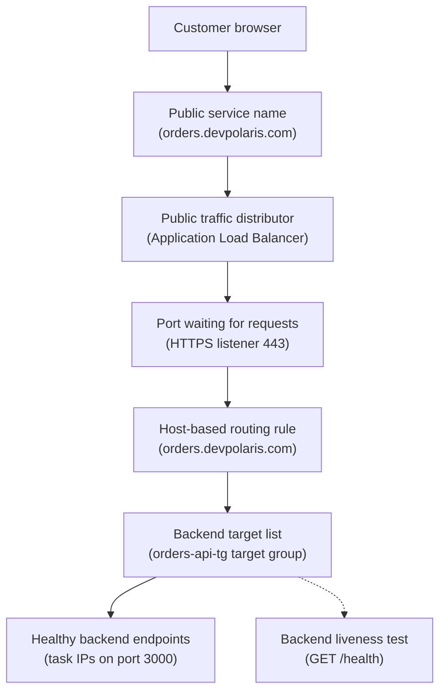

## Table of Contents

1. [The Front Door Problem](#the-front-door-problem)
2. [The Request Path](#the-request-path)
3. [Listeners, Rules, And Target Groups](#listeners-rules-and-target-groups)
4. [What Target Health Really Means](#what-target-health-really-means)
5. [How The App Cooperates With The Load Balancer](#how-the-app-cooperates-with-the-load-balancer)
6. [Reading 502, 503, And Timeout Errors](#reading-502-503-and-timeout-errors)
7. [A Practical Diagnostic Path](#a-practical-diagnostic-path)
8. [Tradeoffs And Safe Defaults](#tradeoffs-and-safe-defaults)

## The Front Door Problem

When you run an API on your laptop, the path is simple.
You start the process, open `http://localhost:3000`, and your browser talks straight to the app.
That direct path is useful while you are building, but it is not enough for a service that real users depend on.

In AWS, you usually do not want public traffic to reach your application task directly.
You want a stable public entry point in front, and you want the running app tasks behind it.
That front entry point can spread requests across tasks, remove broken tasks from rotation, handle HTTPS, and keep the app tasks in private subnets.

An Application Load Balancer, usually shortened to ALB, is that public HTTP and HTTPS front door.
It receives a web request, applies routing rules, chooses a healthy backend target, and forwards the request.
The app target might be an EC2 instance, an IP address, or a Lambda function.
In this article, the target is an ECS task running on Fargate.

The load balancer exists because public traffic and application runtime are different jobs.
The public side needs a stable DNS name, a TLS certificate, and ports that browsers understand.
The app side needs containers, private network access, logs, and a port where the process listens.
If you connect those two sides carefully, users get a reliable public URL while your tasks stay replaceable.

The running example is `devpolaris-orders-api`.
It is a small orders service running as an ECS service on Fargate.
Customers call `https://orders.devpolaris.com`.
The ALB receives HTTPS on port `443`.
The ALB forwards requests to a target group that points at ECS task IPs on container port `3000`.
The health check calls `/health`.

Here is the beginner version of the whole path:

```text
Customer browser
  -> https://orders.devpolaris.com
  -> Application Load Balancer listener on 443
  -> listener rule forwards to orders-api target group
  -> registered ECS task target at 10.0.42.18:3000
  -> container process handles the request
```

The important idea is cooperation.
The load balancer cannot rescue an app that does not listen on the expected port.
The app cannot receive public traffic unless the load balancer can reach it.
The health check is the agreement between them: "Call this path, on this port, and treat this response as proof that I can serve traffic."

> A load balancer is a strict caller with a routing table and a health test.

This article teaches the words you need to read that path:
Application Load Balancer, listener, listener rule, target group, registered target, health check, and target health status.
Then it shows the failures that make those words useful during debugging.

## The Request Path

Start with one real request.
A customer clicks "Place order" in the DevPolaris checkout UI.
The browser sends a request to `https://orders.devpolaris.com/v1/orders`.
DNS has already resolved that name to the public ALB.
The browser does not know where the ECS tasks are, and that is the point.

The ALB receives the request on a listener.
A listener is a process on the load balancer that waits for client connections on a protocol and port, such as `HTTPS:443`.
You can think of it like the load balancer saying, "I accept this kind of traffic here."

The listener then evaluates listener rules.
A listener rule is a routing decision.
It can match a host name, a path, an HTTP header, or other request details, then choose an action.
The simplest action is "forward to this target group."

A target group is a named set of backend destinations plus the settings for how the ALB talks to them.
For `devpolaris-orders-api`, the target group says:
send HTTP traffic to targets on port `3000`, and check `/health` to decide whether a target should receive requests.

A registered target is one actual backend destination inside that target group.
For ECS on Fargate, each task gets its own elastic network interface and private IP address.
That means the target group should use target type `ip`, and the registered target looks like an IP plus port:
`10.0.42.18:3000`.

Here is that path as a diagram:



Read the diagram from top to bottom.
The public path ends at the ALB.
The private path begins when the ALB forwards to task IPs on the target port.
The health check is drawn as a dotted line because it is not a customer request, but it controls whether customer requests are sent.

This split is why load balancers are so useful during deployments.
ECS can start a new task, register it with the target group, wait for it to pass health checks, and then let it receive traffic.
ECS can also stop an old task and deregister it so the load balancer stops sending new requests there.
The app task can come and go, but the public entry point stays the same.

The first beginner trap is mixing up the public port and the target port.
The browser talks to `443`.
The ALB talks to the container on `3000`.
Those can be different because they are different network conversations.
HTTPS can end at the ALB, while the private hop to the container can use HTTP on port `3000`.

That does not mean the private hop is unimportant.
It still needs security group rules, a real listening process, and a correct health endpoint.
The ALB is strict.
If the task does not answer the way the target group expects, the target will not become healthy.

## Listeners, Rules, And Target Groups

The easiest way to understand ALB configuration is to separate the question into three small choices.
What client traffic do we accept?
How do we decide where it goes?
Which backend pool receives it?

For `devpolaris-orders-api`, the answer is intentionally small:

| Piece | Example Value | Plain Meaning |
|-------|---------------|---------------|
| Load balancer | `devpolaris-public-alb` | The public front door |
| Listener | `HTTPS:443` | Accept secure browser traffic |
| Listener rule | Host is `orders.devpolaris.com` | Match requests for the orders API |
| Action | Forward | Send matching requests onward |
| Target group | `orders-api-tg` | Backend pool for the orders service |
| Target port | `3000` | Port the container listens on |
| Health check | `GET /health` | Small endpoint that proves readiness |

This table is a debugging map.
If traffic never reaches the app, you can ask which row is wrong.
Maybe the listener is missing.
Maybe the host rule points at the wrong target group.
Maybe the target group uses port `80` while the container listens on `3000`.

A listener always has a default rule.
That default rule is what happens when no more specific rule matches.
In a small system, the default rule might forward everything to `orders-api-tg`.
In a shared ALB, the default rule might return a fixed `404` response, while host rules route each service to its own target group.

Here is a small listener table like one you might keep in a runbook:

| Priority | Condition | Action | Target Group |
|----------|-----------|--------|--------------|
| 10 | Host `orders.devpolaris.com` | Forward | `orders-api-tg` |
| 20 | Host `admin.devpolaris.com` | Forward | `admin-api-tg` |
| default | Anything else | Fixed response `404` | None |

That default `404` is a deliberate choice.
It prevents random host names from accidentally reaching a real service.
It also makes debugging cleaner because an unknown host fails at the listener layer, not inside the app.

The target group has its own small table of promises:

| Setting | Example Value | Why It Matters |
|---------|---------------|----------------|
| Target type | `ip` | Fargate tasks register by private IP |
| Protocol | `HTTP` | ALB uses HTTP to talk to the container |
| Port | `3000` | Must match the app container listener |
| Health path | `/health` | Must return a successful status when ready |
| Success codes | `200` | Health check expects this response |

Notice that the target group does not say "ECS service" as the target.
The target group receives registered targets.
ECS is the service that registers and deregisters those targets as tasks start and stop.
That is why an ECS service needs a load balancer configuration that names the container and container port.

For this article, the ECS service connection looks like this in plain English:

```text
ECS service: devpolaris-orders-api
Container name: orders-api
Container port: 3000
Target group: orders-api-tg
Target type: ip
Health check path: /health
```

If those names drift apart, traffic breaks in boring but painful ways.
For example, if the task definition exposes `containerPort: 3000` but the ECS service load balancer mapping still says `containerPort: 8080`, ECS cannot correctly connect the service to the target group.
If the target group forwards to `3000` but the application only listens on `127.0.0.1`, the ALB cannot reach it from the task network interface.
If `/health` returns `500`, the target exists but stays unhealthy.

The clean mental model is:
the listener decides which target group should receive a request.
The target group decides which registered target is healthy enough to receive it.
The registered target is the actual task IP and port where the app must answer.

## What Target Health Really Means

Target health is the load balancer's opinion about one registered target.
It means the target answered the health check in a way the target group accepts, which is different from merely having a container process running.

For `devpolaris-orders-api`, the health check is a small HTTP request:

```text
GET http://10.0.42.18:3000/health
Expected status: 200
Timeout: a few seconds
```

The `/health` endpoint should be boring.
It should return quickly.
It should check only what the service needs in order to accept traffic.
If it does a slow database migration, calls a payment provider, or waits for a large cache to warm fully, deployments can become fragile.

A good first `/health` response for this service might look like this:

```text
HTTP/1.1 200 OK
content-type: application/json

{"status":"ok","service":"devpolaris-orders-api","ready":true}
```

The exact JSON shape is not important to the ALB.
The ALB mainly cares about the status code and whether the target responded before the timeout.
The body is for humans and application logs.

Here is a realistic target health snapshot from the AWS CLI:

```bash
$ aws elbv2 describe-target-health \
>   --target-group-arn arn:aws:elasticloadbalancing:eu-west-2:111122223333:targetgroup/orders-api-tg/8f3d2b9a1c0e44aa
{
  "TargetHealthDescriptions": [
    {
      "Target": {
        "Id": "10.0.42.18",
        "Port": 3000,
        "AvailabilityZone": "eu-west-2a"
      },
      "HealthCheckPort": "3000",
      "TargetHealth": {
        "State": "healthy"
      }
    },
    {
      "Target": {
        "Id": "10.0.43.27",
        "Port": 3000,
        "AvailabilityZone": "eu-west-2b"
      },
      "HealthCheckPort": "3000",
      "TargetHealth": {
        "State": "initial",
        "Reason": "Elb.InitialHealthChecking",
        "Description": "Initial health checks in progress"
      }
    }
  ]
}
```

This output tells a small story.
One task is already healthy.
The second task is registered, but the ALB is still checking it.
That is normal during a deployment.
`initial` is normal for a brand new task.

The common states are easier to remember if you translate them:

| Target Health State | Plain Meaning | First Question |
|---------------------|---------------|----------------|
| `initial` | ALB is registering or checking it | Did the task just start? |
| `healthy` | Health checks are passing | Can it serve normal traffic too? |
| `unhealthy` | Health checks failed | Did `/health` fail, time out, or return the wrong code? |
| `unused` | Target is not being used by this load balancer path | Is the target group attached to a listener rule? |
| `draining` | Target is being removed | Is ECS stopping or replacing the task? |

The `unused` state is especially useful for beginners.
It usually means the target exists, but this ALB path is not using it.
A target group can be created and targets can be registered, but if no listener rule forwards to that target group, the ALB has no reason to send traffic there.

Reason codes give the next clue.
`Target.ResponseCodeMismatch` means the app answered, but not with an accepted health status.
For example, `/health` returned `500` while the matcher expected `200`.
`Target.Timeout` means the ALB did not get an answer fast enough.
That can be network blocking, a wrong port, a process that is not listening, or an app that is too slow to start.

Health checks are not a moral judgment on your service.
They are a very small contract.
When that contract is clear, the load balancer and app can cooperate.
When that contract is vague, you get confusing deployments where tasks are "running" in ECS but never receive traffic.

## How The App Cooperates With The Load Balancer

The load balancer and the app need four agreements.
They must agree on network access, port mapping, health behavior, and target registration.
Most ALB problems are one of those agreements failing.

First, security groups must allow the right source and port.
A security group is a stateful firewall attached to a resource, which means it controls allowed inbound and outbound traffic.
For this service, the ALB security group allows public HTTPS from clients.
The task security group allows inbound traffic on port `3000`, but only from the ALB security group.

That relationship is safer than allowing `0.0.0.0/0` to the task.
Customers can reach the ALB.
Only the ALB can reach the task port.

```text
Security group: sg-alb-public
Inbound:
  HTTPS 443 from 0.0.0.0/0
Outbound:
  TCP 3000 to sg-orders-tasks

Security group: sg-orders-tasks
Inbound:
  TCP 3000 from sg-alb-public
Outbound:
  needed app egress, such as database or AWS APIs
```

Second, the port mapping must match the actual process.
Inside the container, `devpolaris-orders-api` listens on port `3000`.
The ECS task definition exposes container port `3000`.
The ECS service load balancer mapping names that container and that port.
The target group health check uses the traffic port, so it also reaches `3000`.

Here is the small mapping table you want to be able to explain during a review:

| Layer | Value | Meaning |
|-------|-------|---------|
| Browser to ALB | `HTTPS:443` | Public secure entry point |
| ALB to target | `HTTP:3000` | Private app hop |
| ECS container | `orders-api:3000` | Process port inside the task |
| Health check | `GET /health` on `3000` | Readiness test for the same target |

Third, the app needs a health endpoint that tells the truth.
If `/health` always returns `200` even when the app cannot handle orders, the ALB sends traffic to a bad task.
If `/health` returns `500` during harmless startup work, the ALB keeps a good task out of service.
Neither extreme helps you.

For a beginner service, a useful `/health` checks that the HTTP server is ready and the app has loaded the configuration it needs to handle requests.
If the orders API cannot work without the database, the health endpoint can include a fast database readiness check.
But be careful with expensive checks.
Health endpoints are called repeatedly by the load balancer.
They should be fast, predictable, and safe.

Fourth, ECS must register the right task targets.
For Fargate with `awsvpc` networking, each task has its own private IP.
That is why the target group uses target type `ip`.
When ECS starts a task, it registers the task IP and port with the target group.
When ECS stops a task, it deregisters the target so the ALB stops sending new requests there.

The ECS service event stream often tells you when this cooperation fails:

```text
2026-05-02T10:14:28Z service devpolaris-orders-api has started 1 tasks: task 8fd1.
2026-05-02T10:14:42Z service devpolaris-orders-api registered 1 targets in target-group orders-api-tg.
2026-05-02T10:15:15Z service devpolaris-orders-api (task 8fd1) failed ELB health checks in target-group orders-api-tg.
2026-05-02T10:15:16Z service devpolaris-orders-api stopped 1 running tasks: task 8fd1.
```

The phrase "failed ELB health checks" is the clue.
It does not yet tell you whether the problem is code, port, security group, or startup time.
It tells you where to look next:
target health reason codes, the app logs around `/health`, and the network rules between the ALB and task.

App logs make the health check visible from the other side:

```text
2026-05-02T10:15:02.814Z INFO  request_id=alb-health path=/health status=500 duration_ms=18
2026-05-02T10:15:02.815Z ERROR health database_migrations="pending" ready=false
2026-05-02T10:15:32.839Z INFO  request_id=alb-health path=/health status=200 duration_ms=11
```

This log says the ALB reached the app.
The failure was not a blocked security group or wrong port.
The app answered `500` because it was not ready yet.
That is a different fix from opening network rules.

Good load balancer work is often this plain:
prove which side of the contract failed before changing anything.

## Reading 502, 503, And Timeout Errors

HTTP `5xx` errors can look similar from a browser, but they point to different parts of the path.
The fastest way to debug is to ask who generated the error and what the load balancer knew at that moment.

For beginners, keep this table nearby:

| Symptom | Plain Meaning | Usual First Check |
|---------|---------------|-------------------|
| `502 Bad Gateway` | ALB tried a target, but the target connection or response was bad | Is the target listening, returning valid HTTP, and keeping the connection open? |
| `503 Service Unavailable` | ALB had no usable target path for the request | Is the listener rule pointing to a target group with registered targets in use? |
| `504 Gateway Timeout` | ALB connected or tried to connect, but waited too long | Is the app slow, blocked, or unreachable on the target port? |
| Health `Target.Timeout` | The health check did not receive an answer fast enough | Check security groups, port, app startup, and CPU or memory pressure |

There is one important AWS detail behind the `503` row.
If a target group has no registered targets, or the targets are in an `unused` state, the ALB can return `503`.
People often describe this as "no healthy targets."
That phrase is useful, but inspect the actual target health state.
If all registered targets are unhealthy, Application Load Balancer can fail open and send traffic to those unhealthy targets.
If the target group is empty or unused, there may be nowhere valid to send the request.

Here is what a `503` from the public URL can look like:

```bash
$ curl -i https://orders.devpolaris.com/health
HTTP/2 503
server: awselb/2.0
date: Sat, 02 May 2026 10:21:04 GMT
content-type: text/html
content-length: 162

<html><body><h1>503 Service Temporarily Unavailable</h1></body></html>
```

The `server: awselb/2.0` header is a clue that the load balancer generated the response.
The app did not return this HTML.
That points you toward listener rules, target group attachment, registered targets, and target health.

Now compare that with an app-generated `500` on the health path:

```bash
$ curl -i http://10.0.42.18:3000/health
HTTP/1.1 500 Internal Server Error
content-type: application/json

{"status":"error","reason":"database migrations pending"}
```

That response proves the network and port are working.
The ALB can reach the app.
The app is choosing to say "not ready."
The fix is in app readiness, database startup order, or the health endpoint logic, not in the ALB listener.

A `502` has a different feel.
The ALB selected a target, but the conversation with that target failed.
Maybe the process reset the connection.
Maybe it returned malformed HTTP.
Maybe the target port is wrong and something else is listening.
The load balancer was able to route, but the backend did not complete the HTTP exchange cleanly.

```text
ALB access log snapshot

type=http
time=2026-05-02T10:25:19.318Z
elb=app/devpolaris-public-alb/50dc6c495c0c9188
client=203.0.113.24:53118
target=10.0.42.18:3000
request="GET https://orders.devpolaris.com:443/v1/orders HTTP/2.0"
elb_status_code=502
target_status_code=-
error_reason=target_connection_error
```

The target status is missing because the target did not return a clean HTTP response.
That pushes you toward the target process, target port, connection handling, and security path.

Timeouts are slower failures.
With a gateway timeout, the ALB waited for the target and gave up.
With a health check timeout, the ALB waited for `/health` and marked the check as failed.
In both cases, the main question is:
did the request reach a process that was too slow, or was the network path blocked before the process could answer?

```text
Target health detail

Target: 10.0.43.27:3000
State: unhealthy
Reason: Target.Timeout
Description: Request timed out
```

That one word, `Timeout`, is not enough to fix the problem by itself.
It narrows the search.
Next you check security groups, NACLs if your team uses restrictive subnet rules, whether the app is listening on `0.0.0.0:3000`, and whether startup is taking longer than the health check grace period allows.

## A Practical Diagnostic Path

When checkout traffic fails, do not start by changing five settings.
Walk the path in order.
Each step should prove one part of the system before you move to the next.

First, ask whether the ALB listener is receiving the request.
If `curl` returns a response with `server: awselb/2.0`, the request reached the ALB.
If the browser cannot connect at all, check DNS, the ALB scheme, public subnets, the ALB security group, and the certificate for HTTPS.

```bash
$ curl -I https://orders.devpolaris.com/health
HTTP/2 503
server: awselb/2.0
date: Sat, 02 May 2026 10:31:12 GMT
```

Second, check the listener rule.
A public ALB can host more than one service.
A typo in a host rule can send traffic to the wrong target group or to the default fixed response.
The rule should match `orders.devpolaris.com` and forward to `orders-api-tg`.

```text
Listener: HTTPS 443

Priority  Condition                         Action
10        host-header orders.devpolaris.com  forward to orders-api-tg
default   any request                        fixed-response 404
```

Third, check whether the target group is in use.
If targets show `unused`, the target group may not be attached to the listener path you are testing.
This is common when someone creates a new target group for a deployment but forgets to update the listener rule.

```text
Target group: orders-api-tg
Load balancer: devpolaris-public-alb
Listener rule: HTTPS 443 priority 10
Target group used by listener: yes
```

Fourth, check registered targets and health.
You want to see task IPs on port `3000`.
If the target port is `80`, `8080`, or missing, stop and compare the target group, ECS service load balancer mapping, and task definition.

```text
Target health snapshot

Target            Port  State       Reason
10.0.42.18        3000  healthy
10.0.43.27        3000  unhealthy   Target.ResponseCodeMismatch
```

This snapshot says one task is healthy and one task is failing the health response.
That means the listener path exists and the target group has at least one usable target.
The failing task needs app log inspection.

Fifth, read the app logs for `/health`.
A log line with status `500` means the app answered but reported not ready.
A missing log line during health checks suggests the request never reached the process.
That difference prevents wasted time.

```text
CloudWatch log group: /ecs/devpolaris-orders-api

2026-05-02T10:35:01.102Z INFO  path=/health status=500 duration_ms=9 reason="db_not_ready"
2026-05-02T10:35:31.124Z INFO  path=/health status=500 duration_ms=8 reason="db_not_ready"
2026-05-02T10:36:01.177Z INFO  path=/health status=200 duration_ms=10
```

Sixth, check the security group path.
The ALB security group must be allowed to send to the task security group on port `3000`.
The task security group should not need to allow the whole internet on `3000`.

```text
Expected rule

Task security group inbound:
  TCP 3000 from sg-alb-public

Common broken rule:
  TCP 3000 from sg-developer-vpn
```

The broken rule might let an engineer test from a VPN, but it does not let the ALB reach the task.
That is why local-looking tests can be misleading.
You need to test from the caller that matters.

Seventh, consider slow startup.
Some tasks are healthy eventually, but not quickly enough for the deployment settings.
The app might start the HTTP server only after loading configuration, connecting to a database, warming a cache, or running migrations.
If the target group begins health checks before the app can answer, ECS may stop the task and start over.

```text
ECS service events

10:41:02 started task 13b7
10:41:18 registered target 10.0.44.92:3000
10:41:48 task 13b7 failed ELB health checks
10:41:49 stopped task 13b7

Application log

10:41:12 loading configuration
10:41:25 connecting to database
10:41:52 HTTP server listening on 0.0.0.0:3000
```

This is a timing problem.
The process starts listening after ECS has already decided the task failed health checks.
The fix might be to start the HTTP server earlier and make `/health` report readiness accurately, reduce slow startup work, tune ECS health check grace period, or adjust target group health thresholds.
Do not simply make `/health` always return `200`.
That hides the symptom and can send real traffic to a task that is not ready.

Here is the compact runbook version:

| Step | Question | Evidence |
|------|----------|----------|
| 1 | Did the request reach ALB? | `curl -I` shows `server: awselb/2.0` |
| 2 | Did the listener match? | Host rule forwards to `orders-api-tg` |
| 3 | Is the target group used? | Target group attached to listener rule |
| 4 | Are targets registered on `3000`? | Target health shows task IPs and port |
| 5 | Did `/health` answer? | App logs show status or no request |
| 6 | Can ALB reach the task? | Task SG allows `3000` from ALB SG |
| 7 | Is startup too slow? | ECS events and app timestamps line up |

That path is deliberately boring.
Good incident debugging often feels boring because you are removing guesses one by one.

## Tradeoffs And Safe Defaults

The main tradeoff with an ALB is that you gain a managed public entry point, but you also gain another contract to operate.
You no longer have one process and one port.
You have a listener, rules, target groups, registered targets, health checks, security groups, ECS service registration, and app readiness.
That is more moving parts, but each part has a clear job.

The gain is worth it for a public service.
The ALB gives you one stable DNS destination while tasks are replaced.
It handles HTTPS at the edge of your service.
It keeps unhealthy or not-ready tasks away from normal traffic when health checks are configured well.
It lets you run more than one task across Availability Zones without asking the client to know about those tasks.

The cost is operational discipline.
Every deployment must keep the same agreement:
the container listens on the expected port, the ECS service registers that port, the task security group trusts the ALB security group, and `/health` tells the truth.
If your team changes one side without the other, the load balancer becomes the place where the mismatch appears.

For a beginner `devpolaris-orders-api` setup, these are reasonable safe defaults:

| Choice | Safe Starting Point | Why |
|--------|---------------------|-----|
| ALB scheme | Internet-facing | Customers need a public HTTPS entry point |
| Listener | `HTTPS:443` | Browser-friendly secure traffic |
| Default rule | Fixed `404` | Unknown hosts do not reach an app by accident |
| Target type | `ip` | Fargate tasks register by private IP |
| Target port | `3000` | Matches the app container listener |
| Health path | `/health` | Small readiness endpoint |
| Task inbound rule | `TCP 3000` from ALB SG | Keeps task private from the internet |

There are also choices you should make intentionally, not by habit.
Do you terminate HTTPS at the ALB and use HTTP to the tasks, or do you also use HTTPS between ALB and task?
For many internal VPC paths, terminating TLS at the ALB is the first simple choice.
For stricter environments, teams may encrypt the backend hop too, but that adds certificate handling on the target side.

Do you share one ALB across several services, or give each service its own ALB?
Sharing can reduce cost and centralize routing.
Separate ALBs can simplify ownership, blast radius, and logs.
For a small learning system, one shared public ALB with clear host rules is fine.
For a growing platform, ownership and failure isolation may matter more than saving one resource.

Do you make `/health` shallow or deep?
A shallow check proves the HTTP process is alive.
A deeper readiness check proves the app can handle real work.
The deeper check catches more problems before traffic arrives, but it can also make the service unavailable because a dependency has a short blip.
The right answer depends on what kind of request failure you are trying to avoid.

For the orders API, the practical middle ground is:
`/health` returns `200` only after the HTTP server has loaded required configuration and can perform the minimum dependency checks needed for order requests.
It returns quickly.
It logs failures clearly.
It does not run migrations, call slow third-party services, or do expensive work.

The final mental model is simple enough to carry into real AWS work:

```text
Public request accepted by listener.
Listener rule chooses target group.
Target group chooses healthy registered target.
Target answers on the expected port.
Health check keeps that agreement honest.
```

When an ALB problem appears, walk that chain.
You will usually find a small mismatch:
wrong listener rule, empty target group, target stuck in `unused`, security group blocking `3000`, app returning `500` on `/health`, wrong target port, or startup slower than the health settings.
Those are fixable problems once you know which part of the chain owns the evidence.

---

**References**

- [What is an Application Load Balancer?](https://docs.aws.amazon.com/elasticloadbalancing/latest/application/introduction.html) - Defines ALB components, listener rule evaluation, target groups, and health checks.
- [Application Load Balancers](https://docs.aws.amazon.com/elasticloadbalancing/latest/application/application-load-balancers.html) - Explains load balancers as the single point of contact and notes the security group rules needed for listener and health check ports.
- [Target groups for your Application Load Balancers](https://docs.aws.amazon.com/elasticloadbalancing/latest/application/load-balancer-target-groups.html) - Covers target groups, target types, registered targets, routing configuration, and per-target-group health checks.
- [Health checks for Application Load Balancer target groups](https://docs.aws.amazon.com/elasticloadbalancing/latest/application/target-group-health-checks.html) - Lists health check settings, target health states, and reason codes such as `Target.Timeout` and `Target.ResponseCodeMismatch`.
- [Troubleshoot your Application Load Balancers](https://docs.aws.amazon.com/elasticloadbalancing/latest/application/load-balancer-troubleshooting.html) - Documents ALB-generated `502`, `503`, and `504` causes and unhealthy target troubleshooting.
- [Use an Application Load Balancer for Amazon ECS](https://docs.aws.amazon.com/AmazonECS/latest/developerguide/alb.html) - Explains how ECS services use ALBs, why Fargate tasks use target type `ip`, and how failed load balancer health checks affect service tasks.
