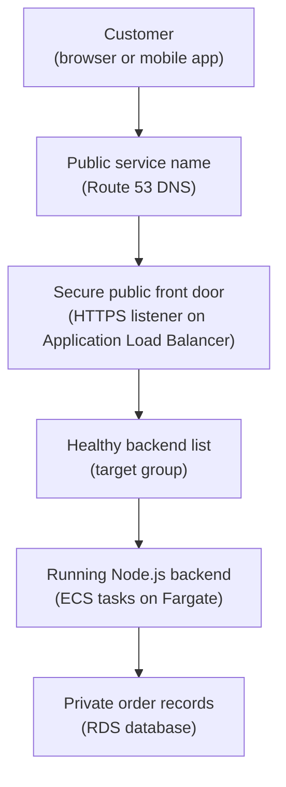

## Table of Contents

1. [Two Questions Before Service Names](#two-questions-before-service-names)
2. [The Orders API Path](#the-orders-api-path)
3. [The Private Map Inside A VPC](#the-private-map-inside-a-vpc)
4. [The Public Front Door](#the-public-front-door)
5. [Private Hops To Tasks And Database](#private-hops-to-tasks-and-database)
6. [IAM Is Not Network Reachability](#iam-is-not-network-reachability)
7. [Outbound Paths For Supporting Services](#outbound-paths-for-supporting-services)
8. [Failure Modes And Diagnosis](#failure-modes-and-diagnosis)
9. [Tradeoffs For A First Design](#tradeoffs-for-a-first-design)

## Two Questions Before Service Names

When a backend leaves your laptop, the network stops being a vague thing that "just works."
Users need a public name.
The app needs a private place to run.
The database needs to stay away from the public internet.
The service still needs to call AWS APIs for secrets, logs, files, and deployments.

AWS networking is the set of names, private networks, routes, entry points, and traffic rules that decide how packets move between those pieces.
That sounds like a lot because it is doing several jobs at once.
It gives customers a stable way in.
It keeps internal resources private.
It decides which subnet sends traffic to which next hop.
It lets you place firewall-style rules close to each resource.

AWS networking exists because:
a production service needs more than "open a port."
You need to choose who can reach the front door, who can reach the app, who can reach the database, and how traffic moves between each hop.
If those questions are mixed together, every outage becomes a foggy sentence like "the network is broken."

Use two questions instead:

1. Who should be able to reach this?
2. Which path does traffic take?

The first question is about exposure.
Should the public internet reach this resource, should only the load balancer reach it, or should only one app security group reach it?
The second question is about routing.
Does traffic go through DNS, a load balancer, a target group, private subnets, a NAT gateway, or a database endpoint?

Those two questions fit inside the larger AWS map from the earlier articles.
The AWS account is the workspace.
The Region is where the resources live.
IAM decides who can call AWS APIs.
Networking decides which network traffic can reach which port.

This article follows one running example:
`devpolaris-orders-api`, a Node.js backend running on AWS.
Customers call it over HTTPS.
Route 53 gives the public name.
An Application Load Balancer receives the request.
ECS on Fargate runs the app tasks.
RDS stores order records.
S3, Secrets Manager, and CloudWatch support the service around the main request path.

You are not trying to memorize every networking noun today.
You are learning how to read a small AWS network like a map.
Once the map is clear, the service names become much less noisy.

> Start with reachability and path. The AWS names are translations of those two questions.

## The Orders API Path

The `devpolaris-orders-api` team owns checkout traffic.
A customer clicks "Place order."
The browser sends a request to `https://orders.devpolaris.com/checkout`.
The request should reach the backend, the backend should write to the orders database, and the customer should receive a response.

The main traffic path looks like this:

```text
customer
  -> orders.devpolaris.com
  -> Route 53 DNS answer
  -> HTTPS listener on Application Load Balancer
  -> target group
  -> ECS/Fargate task running devpolaris-orders-api
  -> RDS database
```

That path is the spine of the article.
Every networking word we introduce should help you understand one hop in that path.
If a word does not help the path, we will keep it light.

Here is the beginner map.
Read the solid arrows as customer traffic.



Now put the side checks back in your head, but do not treat them as extra hops in the customer request:

| Supporting Check | What It Proves |
|------------------|----------------|
| TLS certificate | The HTTPS listener can prove it owns `orders.devpolaris.com`. |
| Security groups | The ALB, task, and database ports allow the right source. |
| Route tables | Each subnet has the next hop it needs. |
| IAM task role | The ECS task can call AWS APIs like Secrets Manager, S3, and CloudWatch Logs. |

This table intentionally keeps IAM off the main customer traffic path.
IAM matters, but it answers a different question.
It decides whether the ECS task role can call AWS APIs like `secretsmanager:GetSecretValue`, `s3:PutObject`, or `logs:PutLogEvents`.
It does not automatically make a database port reachable.

The main path has several kinds of evidence.
DNS evidence says the name points to the load balancer.
Load balancer evidence says it has a listener and healthy targets.
Target group evidence says which tasks can receive traffic.
Security group evidence says which source can reach which port.
Route table evidence says whether subnet traffic has a usable next hop.
App logs say what the Node.js process experienced after traffic arrived.

A healthy snapshot for the service might look like this:

```text
service: devpolaris-orders-api
environment: prod
region: us-east-1

public name:
  orders.devpolaris.com -> orders-prod-alb-148721.us-east-1.elb.amazonaws.com

load balancer:
  listener: HTTPS 443
  target group: orders-api-prod
  healthy targets: 2
  unhealthy targets: 0

ecs service:
  desired tasks: 2
  running tasks: 2
  subnets: private-a, private-b

rds:
  endpoint: orders-prod.cluster-cxample.us-east-1.rds.amazonaws.com
  reachable from: sg-orders-api
```

The snapshot is not a full runbook.
It is a picture of the path.
When a customer request fails, you can walk down that picture one box at a time.

## The Private Map Inside A VPC

Before traffic reaches a task or database, it lives inside a VPC.
A VPC (Virtual Private Cloud) is a private network area in your AWS account.
It gives your resources an IP address space and a boundary for routing and security decisions.

If the AWS account is the workspace, the VPC is the private road system inside that workspace.
You choose the address range, such as `10.20.0.0/16`.
AWS uses that range to place resources on private IP addresses.
Those private addresses are not meant to be reached directly from the public internet.

A subnet is a smaller slice of the VPC address range.
Resources launch into subnets.
For example, an ECS task might receive a private IP address in `10.20.12.0/24`.
An RDS database might live in database subnets such as `10.20.32.0/24` and `10.20.33.0/24`.

Subnets are usually spread across Availability Zones.
That matters because a load balancer and ECS service can keep running when one zone has trouble.
For a first production shape, the orders team might use two public subnets, two private app subnets, and two private database subnets.

The word "public" in public subnet has a precise meaning.
A public subnet has a route table with a route to an internet gateway.
An internet gateway is the VPC component that gives internet-routable traffic a way in or out.

The word "private" also has a precise meaning.
A private subnet does not have a direct route from the public internet through an internet gateway.
Resources inside it can still talk to private resources in the VPC.
They can also make outbound calls through a NAT gateway or VPC endpoints if you configure those paths.

The route table is the traffic sign for a subnet.
It answers:
when traffic is going to this destination range, which target should receive it next?

Here is a simple first layout for `devpolaris-orders-api`:

| Subnet Layer | Example CIDR | Route For Internet Traffic | What Lives There |
|--------------|--------------|----------------------------|------------------|
| Public subnet A | `10.20.1.0/24` | `0.0.0.0/0 -> internet gateway` | ALB node, NAT gateway |
| Public subnet B | `10.20.2.0/24` | `0.0.0.0/0 -> internet gateway` | ALB node, NAT gateway |
| Private app subnet A | `10.20.11.0/24` | `0.0.0.0/0 -> NAT gateway` | ECS/Fargate tasks |
| Private app subnet B | `10.20.12.0/24` | `0.0.0.0/0 -> NAT gateway` | ECS/Fargate tasks |
| Private data subnet A | `10.20.31.0/24` | No general internet route | RDS database |
| Private data subnet B | `10.20.32.0/24` | No general internet route | RDS standby or database placement |

The exact CIDR ranges are examples.
The important part is the intent.
The load balancer can be reached from the internet.
The app tasks cannot be reached directly from the internet.
The database is deeper still.

Route tables do not decide whether a port is allowed.
They decide the next hop for a destination.
Security groups decide whether a resource should accept or send traffic on a port.
Beginners often mix those up because both can break a connection.

Think of it this way:
a route table can get the packet to the correct street.
a security group can decide whether the door opens.

A route table snapshot might look like this:

```text
route table: rtb-private-app-a
associated subnet: subnet-private-app-a

Destination     Target
10.20.0.0/16    local
0.0.0.0/0       nat-0f12ab34cd56ef789
```

The `local` route lets resources inside the VPC talk to each other by private IP.
The `0.0.0.0/0` route sends all other IPv4 destinations to a NAT gateway.
That allows private app tasks to start outbound connections without placing the tasks directly on the public internet.

For the database subnet, the team may choose no general `0.0.0.0/0` route at all.
That is a design choice.
The database does not need to browse the internet to serve checkout traffic.
It needs to receive database connections from the app tasks.

## The Public Front Door

Customers do not know your VPC CIDR range.
They know a name like `orders.devpolaris.com`.
DNS (Domain Name System) turns that name into the network destination a client should use.
In AWS, Route 53 can host the DNS record for the service.

For an Application Load Balancer, Route 53 usually uses an alias record.
The alias points the friendly name at the load balancer's AWS DNS name.
That matters because load balancers can use changing IP addresses behind the scenes.
You should not hardcode one load balancer IP address in DNS.

A Route 53 record snapshot might look like this:

```text
Hosted zone: devpolaris.com

Name                         Type    Value
orders.devpolaris.com.       A       Alias to orders-prod-alb-148721.us-east-1.elb.amazonaws.com
```

DNS only gets the customer to the front door.
The front door still needs to speak the right protocol.
For a public API, the customer should use HTTPS, not plain HTTP.
HTTPS is HTTP over TLS, where TLS is the encryption and identity layer that lets the browser check the server certificate and encrypt the connection.

On an Application Load Balancer, a listener is the thing that waits for client connections on a protocol and port.
For this API, the listener is HTTPS on port `443`.
The listener uses a TLS certificate for `orders.devpolaris.com`.
The certificate proves the load balancer is allowed to present that name to clients.

The load balancer then forwards accepted requests to a target group.
A target group is the list of backend targets that can receive traffic.
For ECS on Fargate, the targets are usually private IP addresses for running tasks.
The target group also runs health checks, often against `/health`.

Here is a small listener and target group snapshot:

```text
load balancer: orders-prod-alb

listener:
  protocol: HTTPS
  port: 443
  certificate: orders.devpolaris.com
  default action: forward to target group orders-api-prod

target group:
  protocol: HTTP
  port: 3000
  health check path: /health
  healthy targets: 2
```

Notice one common pattern:
TLS may end at the load balancer.
The customer uses HTTPS to the load balancer, and the load balancer may use HTTP to the tasks inside the VPC.
That can be a reasonable first design because the public connection is encrypted and certificate management lives at the load balancer.

Some teams also encrypt traffic from the load balancer to the tasks.
That can be useful when policy, compliance, or internal threat models require it.
It adds certificate and app configuration work.
Do not choose it by habit.
Choose it because you understand the risk and the operational cost.

The load balancer also has a security group.
For the orders API, it should allow inbound HTTPS from customers.
The app task security group should allow inbound app traffic only from the load balancer security group.
That source relationship is the clean part.
The tasks do not need to know every customer IP address.
They trust the front door.

| Resource | Security Group | Inbound Rule | Meaning |
|----------|----------------|--------------|---------|
| Application Load Balancer | `sg-orders-alb` | TCP `443` from `0.0.0.0/0` | Public clients can reach HTTPS |
| ECS tasks | `sg-orders-api` | TCP `3000` from `sg-orders-alb` | Only the load balancer can call the app |
| RDS database | `sg-orders-db` | TCP `5432` from `sg-orders-api` | Only app tasks can reach PostgreSQL |

That table is one of the most important shapes in this article.
It says who should reach each layer.
The public internet reaches the load balancer.
The load balancer reaches the app.
The app reaches the database.

## Private Hops To Tasks And Database

After the load balancer accepts the request, the next hop is private.
The customer should not connect directly to a Fargate task.
The customer should not know the database endpoint.
The backend path stays inside the VPC.

ECS on Fargate runs tasks.
A task is one running copy of the container and its side settings.
With Fargate networking, each task gets its own network interface and private IP address in the selected subnet.
That is why a target group can route to task IPs.

For `devpolaris-orders-api`, imagine two healthy tasks:

```text
target group: orders-api-prod

Target IP       Port    Zone        Health
10.20.11.84     3000    us-east-1a  healthy
10.20.12.39     3000    us-east-1b  healthy
```

The load balancer does not forward traffic to "ECS" in a vague way.
It forwards traffic to specific healthy task targets in the target group.
If a task fails health checks, the target group should stop sending customer requests to it.

That is why health checks belong to networking and observability.
The health check decides whether the path is allowed to use a target.
If `/health` returns `500`, the load balancer treats that target as unhealthy even if the process is still running.

The app task then connects to RDS.
RDS exposes a database endpoint such as `orders-prod.cluster-cxample.us-east-1.rds.amazonaws.com`.
The app resolves that name and opens a TCP connection to the database port, such as PostgreSQL on `5432` or MySQL on `3306`.

For the database, the security group rule should use the app security group as the source when possible.
That is better than allowing the whole VPC CIDR range.
It says "resources associated with the app security group may connect to this database port."

The database security group evidence might look like this:

```text
security group: sg-orders-db

Inbound rules:
Protocol  Port   Source          Description
TCP       5432   sg-orders-api   orders api tasks to postgres

Outbound rules:
Protocol  Port   Destination     Description
All       All    0.0.0.0/0       default outbound
```

The important line is the source.
If the source is `0.0.0.0/0`, the database is accepting traffic from anywhere that can route to it.
If the source is `sg-orders-api`, the database is tied to the app layer.

Now connect this back to the two questions.

Who should be able to reach the database?
Only the orders API tasks.

Which path does traffic take?
The task resolves the RDS endpoint, routes locally inside the VPC, then reaches the database security group on the database port.

Those answers are much clearer than "put the DB in a private subnet."
Private subnets help, but the actual connection also needs DNS, route tables, security groups, credentials, and a listening database.

## IAM Is Not Network Reachability

AWS beginners often lose time because two different checks both feel like "access."
IAM access and network reachability are not the same check.
IAM answers whether a principal is allowed to call an AWS API action on an AWS resource.
Network reachability answers whether traffic can move from this source to this destination on this protocol and port.

For `devpolaris-orders-api`, the ECS task role might have permission to read a database secret:

```text
principal: arn:aws:iam::333333333333:role/orders-api-task
action: secretsmanager:GetSecretValue
resource: arn:aws:secretsmanager:us-east-1:333333333333:secret:orders-api/prod/database-AbCdEf
result: allowed
```

That IAM allow does not prove the database is reachable.
It only proves the app can ask Secrets Manager for the secret.
The app might read the password successfully and still fail to open a TCP connection to RDS.

The opposite can also happen.
The app may be able to reach the database port, but fail to read a secret from Secrets Manager.
That is not fixed by opening port `5432`.
It is fixed by inspecting the task role, secret ARN, KMS key access if relevant, and any explicit deny.

Here are two failures that look similar to a stressed beginner but point to different places:

| Symptom | Example Error | First Place To Look |
|---------|---------------|---------------------|
| IAM permission failure | `AccessDeniedException: not authorized to perform secretsmanager:GetSecretValue` | Task role and secret policy |
| Network reachability failure | `connect ETIMEDOUT 10.20.31.18:5432` | Security groups, routes, database endpoint |
| Database auth failure | `password authentication failed for user "orders_app"` | Secret value and database user |
| Target health failure | `Target.ResponseCodeMismatch` | App `/health` response and dependency checks |

That table is worth keeping close.
It stops you from changing random settings.
The error shape tells you which door to inspect first.

A realistic IAM failure in CloudWatch Logs might look like this:

```text
2026-05-02T09:14:22.481Z ERROR orders-api boot failed
service=devpolaris-orders-api env=prod task=3f9d7c
cause="AccessDeniedException: User arn:aws:sts::333333333333:assumed-role/orders-api-task/3f9d7c is not authorized to perform secretsmanager:GetSecretValue"
secret="arn:aws:secretsmanager:us-east-1:333333333333:secret:orders-api/prod/database-AbCdEf"
```

This error got a response from the Secrets Manager API.
That means the app reached enough of AWS to receive an authorization decision.
Start with IAM, not the database route table.

A realistic network failure has a different shape:

```text
2026-05-02T09:22:47.036Z ERROR database connection failed
service=devpolaris-orders-api env=prod task=81ac2e
host=orders-prod.cluster-cxample.us-east-1.rds.amazonaws.com port=5432
cause="connect ETIMEDOUT 10.20.31.18:5432"
```

This error does not say "not authorized."
It says the connection timed out.
Now the useful questions are about path and ports:
which subnet is the task in, which security group is attached, which security group is on RDS, and does the route table support the path?

You can pass IAM and fail networking.
You can pass networking and fail IAM.
Good AWS debugging keeps those checks separate.

## Outbound Paths For Supporting Services

The main customer path ends at RDS, but the app still needs supporting resources.
The orders API may read a database secret from Secrets Manager.
It may write CSV exports to S3.
It may send logs to CloudWatch.
It may pull its container image from ECR when a new task starts.

Those are not all customer requests.
Most are outbound calls from the task to AWS service endpoints.
If the task is in a private subnet, you must decide how those outbound calls work.

A NAT gateway is one common answer.
NAT stands for Network Address Translation.
In this design, private tasks send outbound internet traffic to a NAT gateway that lives in a public subnet.
The NAT gateway then sends the traffic out through the internet gateway.
Responses come back through the same path.

The important beginner point:
a NAT gateway helps private resources start outbound connections.
It does not make those private resources directly reachable from the public internet.

The private app route table we saw earlier uses that idea:

```text
route table: rtb-private-app-a

Destination     Target
10.20.0.0/16    local
0.0.0.0/0       nat-0f12ab34cd56ef789
```

That `0.0.0.0/0` route is not saying customers can reach the task.
It is saying the task has a way out for destinations outside the VPC.
The security group still controls what the task can send.
The load balancer remains the only intended inbound customer path.

Another answer is VPC endpoints.
A VPC endpoint lets private resources reach supported AWS services without sending traffic over the public internet path.
For example, teams often consider endpoints for S3, ECR, Secrets Manager, CloudWatch Logs, or Systems Manager.
That can reduce NAT traffic and keep AWS service calls on private AWS networking paths.

Do not turn this into a team argument on day one.
For a first mental model, learn the question:
how does a private task reach the AWS services it depends on?

Here is the supporting-call checklist for the orders API:

| Supporting Need | Why The App Needs It | Network Path To Think About | IAM Still Needed |
|-----------------|----------------------|-----------------------------|------------------|
| Pull container image | New tasks need the image from ECR | NAT gateway or VPC endpoints | Execution role permissions |
| Read database secret | App needs DB host and password | NAT gateway or VPC endpoint | Task or execution role permissions, depending on injection path |
| Write order export | App stores CSV in S3 | NAT gateway or S3 endpoint | Task role `s3:PutObject` |
| Send application logs | App evidence goes to CloudWatch Logs | NAT gateway or CloudWatch Logs endpoint | Execution role log permissions |

This table brings the two-question model back again.
The network path gets traffic to the AWS service endpoint.
IAM decides whether the AWS service should accept the API action.
You usually need both.

## Failure Modes And Diagnosis

Now let us debug the actual path.
Imagine customers report that checkout is failing for `orders.devpolaris.com`.
The worst first move is to edit random security groups because "networking seems broken."
The better move is to walk the path in order.

Start with the customer-facing symptom:

```text
customer symptom:
  GET https://orders.devpolaris.com/checkout
  response: 503 Service Unavailable
  time: 2026-05-02T10:31:04Z
```

A `503` from the load balancer often means the front door received the request but could not send it to a healthy backend target.
That does not prove the database is broken.
It says the load balancer layer needs evidence.

Check target health next:

```bash
$ aws elbv2 describe-target-health \
  --target-group-arn arn:aws:elasticloadbalancing:us-east-1:333333333333:targetgroup/orders-api-prod/abc123 \
  --query "TargetHealthDescriptions[].{Target:Target.Id,Port:Target.Port,State:TargetHealth.State,Reason:TargetHealth.Reason}"
[
  {
    "Target": "10.20.11.84",
    "Port": 3000,
    "State": "unhealthy",
    "Reason": "Target.ResponseCodeMismatch"
  },
  {
    "Target": "10.20.12.39",
    "Port": 3000,
    "State": "unhealthy",
    "Reason": "Target.ResponseCodeMismatch"
  }
]
```

This output tells you the load balancer can see targets, but the health check response is not what the target group expects.
The next place to inspect is the app log for `/health`, startup, or dependency checks.

CloudWatch Logs shows this:

```text
2026-05-02T10:30:58.744Z ERROR health check failed
service=devpolaris-orders-api env=prod task=10.20.11.84
path=/health
cause="database connection timeout"
db_host=orders-prod.cluster-cxample.us-east-1.rds.amazonaws.com
db_port=5432
```

Now the failure has moved from the public front door to the private database hop.
The app is running, but it cannot complete the database check.
Do not change Route 53.
Do not replace the TLS certificate.
The request reached the load balancer and the load balancer reached the task.

Inspect the database security group:

```text
security group: sg-orders-db

Inbound rules:
Protocol  Port   Source          Description
TCP       5432   sg-admin-bastion admin database access
```

This is a likely cause.
The database allows port `5432` from an admin access group, but not from `sg-orders-api`.
The fix direction is to add the intended source:
TCP `5432` from `sg-orders-api`.

After the rule is fixed, target health changes:

```text
target group: orders-api-prod

Target IP       Port    Health
10.20.11.84     3000    healthy
10.20.12.39     3000    healthy
```

The diagnosis path worked because each check answered one specific question.
It followed the request path:
customer symptom, DNS and front door, target group, task log, database rule.

Here is the same method as a compact checklist:

| Step | Question | Evidence |
|------|----------|----------|
| 1 | Does the name point to the load balancer? | Route 53 record or `dig` result |
| 2 | Is the load balancer listening on HTTPS `443`? | ALB listener config |
| 3 | Does the target group have healthy targets? | `describe-target-health` |
| 4 | Can the load balancer reach the task port? | `sg-orders-alb` to `sg-orders-api` rule |
| 5 | Can the task reach the database port? | `sg-orders-api` to `sg-orders-db` rule |
| 6 | Can the task call supporting AWS APIs? | IAM role, NAT gateway or VPC endpoints, CloudWatch logs |
| 7 | Does the app log show auth or app-level failure? | CloudWatch Logs for the task |

Different symptoms choose different first checks.
If the browser says the certificate name is wrong, start at TLS and DNS.
Let the evidence choose the next hop.
If the load balancer says all targets are unhealthy, start at target health and app logs.
If the app says `AccessDeniedException`, start at IAM.
If the app says `ETIMEDOUT`, start at network reachability.

## Tradeoffs For A First Design

The safest beginner design is not always the simplest design.
A public task with a public IP can be easier to reach during a quick experiment.
A private task behind a load balancer is usually a better shape for a production backend.

For `devpolaris-orders-api`, the recommended first production shape is:
public load balancer, private app tasks, private database.
That keeps the public entry point small and makes the app and database reachable only through intended paths.

This design has tradeoffs:

| Choice | What You Gain | What You Give Up |
|--------|---------------|------------------|
| Public ALB, private tasks | One controlled public front door | More moving parts than a public task |
| Security group references | Rules follow resource groups, not changing IPs | You must keep group ownership clear |
| NAT gateway for private tasks | Simple outbound path for AWS APIs and internet dependencies | Extra cost and another route to monitor |
| VPC endpoints for AWS services | Private AWS service access and less NAT dependence | More endpoint resources and policy decisions |
| TLS at the load balancer | Simpler certificate management for public HTTPS | Internal hop may need separate encryption if required |
| Database only from app SG | Small database exposure | Debug access needs a planned admin path |

The key tradeoff is exposure versus operational complexity.
Opening fewer things to the internet is safer, but each private layer needs a correct path.
If the private app tasks need ECR, Secrets Manager, S3, and CloudWatch, you must provide NAT or endpoints.
If the database is private, you need a planned way for migrations, backups, and emergency diagnosis to reach it safely.

This is why "private" is not a full design by itself.
Private where?
Reachable from whom?
Through which route?
On which port?
With which IAM role for AWS API calls?

A good first design for the orders API can be written as a few plain sentences:

```text
Customers reach only the Application Load Balancer on HTTPS 443.
The load balancer forwards only to healthy ECS tasks on port 3000.
ECS tasks run in private subnets and receive no direct public traffic.
The RDS database accepts PostgreSQL only from the ECS task security group.
Private tasks use NAT or VPC endpoints for ECR, Secrets Manager, S3, and CloudWatch.
IAM roles still decide which AWS API actions the tasks may perform.
```

That is not a glossary.
It is an operating model.
You can deploy against it, review it, and debug it.

When you read any AWS networking diagram after this, ask the same two questions:
who should be able to reach this, and which path does traffic take?
The answer will usually point you to the right AWS service name.

---

**References**

- [Configure route tables](https://docs.aws.amazon.com/vpc/latest/userguide/VPC_Route_Tables.html) - AWS's guide to how VPC route tables choose the next hop for subnet and gateway traffic.
- [NAT gateways](https://docs.aws.amazon.com/vpc/latest/userguide/vpc-nat-gateway.html) - AWS's reference for giving private resources an outbound path without making them directly public.
- [Security group rules](https://docs.aws.amazon.com/vpc/latest/userguide/security-group-rules.html) - AWS's reference for inbound and outbound port rules, including security group references.
- [Amazon ECS task networking options for Fargate](https://docs.aws.amazon.com/AmazonECS/latest/developerguide/fargate-task-networking.html) - AWS's guide to how Fargate tasks receive network interfaces, private IPs, subnets, and security groups.
- [What is an Application Load Balancer?](https://docs.aws.amazon.com/elasticloadbalancing/latest/application/introduction.html) - AWS's overview of ALB listeners, target groups, routing, health checks, and HTTPS entry points.
- [Routing traffic to an ELB load balancer](https://docs.aws.amazon.com/Route53/latest/DeveloperGuide/routing-to-elb-load-balancer.html) - AWS's reference for DNS alias records that point public service names to load balancers.
