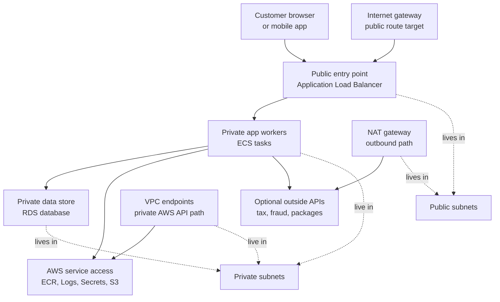
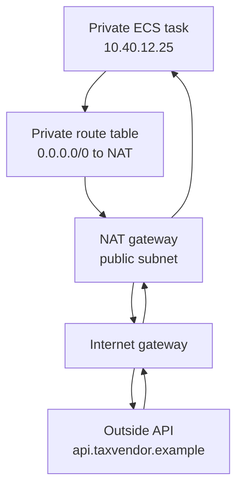

## Table of Contents

1. [Start With The Access Decision](#start-with-the-access-decision)
2. [The Running Example](#the-running-example)
3. [Public And Private Subnets](#public-and-private-subnets)
4. [Internet Gateways And Public Routes](#internet-gateways-and-public-routes)
5. [Private Apps Still Need Outbound Access](#private-apps-still-need-outbound-access)
6. [NAT Gateways And Egress-Only Thinking](#nat-gateways-and-egress-only-thinking)
7. [VPC Endpoints For AWS Service Access](#vpc-endpoints-for-aws-service-access)
8. [Failure Modes And Diagnosis](#failure-modes-and-diagnosis)
9. [Tradeoffs For A First Design](#tradeoffs-for-a-first-design)

## Start With The Access Decision

Most AWS network mistakes begin with a rushed placement decision.
Someone creates a subnet, checks a box that assigns public IP addresses, puts a resource there, and only later asks whether that resource should be reachable from the internet.
The safer order is the opposite.
First ask what the internet should be able to start a connection to.
Then design the path.

Public and private access is not about whether a resource is important.
It is about who can start the network conversation.
A public entry point is meant to receive traffic that begins outside your VPC (Virtual Private Cloud, your private network space in AWS).
A private resource is meant to receive traffic only from trusted places inside that network, or from connected private networks you explicitly choose later.

For a beginner, the clean mental model is this:
public is for front doors, private is for work rooms.
The front door needs a controlled path from users.
The work rooms need paths from the front door and from each other.
They do not need every person on the internet knocking on them directly.

That does not mean private resources are isolated from everything.
A private application may still need to start outbound connections.
It may pull a container image.
It may send logs.
It may call a payment provider.
It may read a secret from Secrets Manager.
It may fetch an object from S3.
Private does not mean "no network."
Private means "the internet cannot start the conversation directly."

Here is the decision in plain English:

| Resource | Should The Internet Start Connections To It? | Usual Placement |
|----------|----------------------------------------------|-----------------|
| Public web load balancer | Yes | Public subnets |
| ECS tasks running app code | No | Private subnets |
| RDS database | No | Private subnets |
| NAT gateway | No direct user traffic, but needs internet path | Public subnet |
| VPC endpoint | No public internet path needed | Private subnets |

This article uses one service throughout: `devpolaris-orders-api`.
The goal is not to memorize every AWS networking option.
The goal is to learn the first judgment call:
which pieces should be internet-reachable, which pieces should stay private, and which private pieces still need a safe way out.

> Public access is a product decision. Private access is a safety decision. Outbound access is an operations decision.

## The Running Example

Imagine `devpolaris-orders-api` is a small backend for checkout.
Customers send HTTPS requests when they place orders.
The app validates the cart, writes order records to a database, reads a few secrets, sends logs, and sometimes calls outside APIs for tax or fraud checks.

The first AWS shape looks like this:



Read the diagram from top to bottom.
The customer reaches the Application Load Balancer, usually shortened to ALB.
The ALB is the public front door.
It accepts HTTPS from the internet and forwards clean, controlled traffic to the ECS tasks.

The ECS tasks are private.
They run the application code, but they do not need public IP addresses.
The ALB can still reach them because the ALB and the tasks live inside the same VPC.
That private path is enough for user requests.

The RDS database is private too.
The customer does not connect to the database.
The ALB does not connect to the database.
Only the application tasks should connect to the database port.
That keeps the most sensitive resource away from direct internet reachability.

The interesting part is the right side of the diagram.
The private ECS tasks may still need access outward.
During startup, the platform may need to pull the container image from ECR.
At runtime, the app may need Secrets Manager, CloudWatch Logs, S3, or an external tax API.
Those are outbound needs.
You handle them with NAT gateways, VPC endpoints, or both.

This design gives you a useful starting rule:
make the ALB public, keep the app and database private, then add only the outbound paths the private app actually needs.

## Public And Private Subnets

A subnet is a smaller network range inside a VPC.
In the previous article, you learned that route tables decide where traffic goes next.
That detail matters here because AWS does not make a subnet public because of its name.
The subnet is public because its route table has a route to an internet gateway for internet-bound traffic.

So a subnet called `orders-public-a` is not public by magic.
It is public if its route table says traffic for the public internet goes to the internet gateway.
Likewise, a subnet called `orders-private-a` is private if it does not have that internet gateway route.
Names help humans, but route tables decide behavior.

Here is a beginner-friendly comparison:

| Question | Public Subnet | Private Subnet |
|----------|---------------|----------------|
| Has a route to an internet gateway? | Usually yes | No |
| Should internet-facing load balancers live here? | Yes | No |
| Should app tasks live here by default? | Usually no | Yes |
| Should databases live here? | No | Yes |
| Can resources here still have security groups? | Yes | Yes |
| Can resources here start outbound traffic? | Yes, if routes allow it | Yes, through NAT or endpoints |

The phrase "public subnet" can make beginners think every resource inside it is automatically open to the world.
That is not quite right.
Public reachability usually needs more than one thing:
a route to an internet gateway, an address the internet can route to, and security rules that allow the traffic.
For IPv4, that usually means a public IPv4 address or Elastic IP address on the resource, or a public load balancer address in front of it.

Private subnets are the safer default for anything that does not need to receive internet-started traffic.
For `devpolaris-orders-api`, the ECS tasks and RDS database belong there.
The tasks need to receive traffic from the ALB, not from the internet directly.
The database needs to receive traffic from the tasks, not from customers, browsers, scanners, or random hosts.

A simple placement plan might look like this:

| Component | Subnet Choice | Reason |
|-----------|---------------|--------|
| `orders-alb` | Public subnets in at least two Availability Zones | Users need a public HTTPS entry point |
| `orders-api` ECS tasks | Private app subnets | Only the ALB should send user traffic to the app |
| `orders-db` RDS | Private database subnets | Only app tasks should reach the database |
| NAT gateways | Public subnets | They need a path to the internet gateway |
| Interface VPC endpoints | Private subnets | Private tasks need AWS APIs without public internet |

This is not the only possible design, but it is a good first design.
It separates the public edge from the private workload.
That one separation prevents many expensive mistakes.

## Internet Gateways And Public Routes

An internet gateway is the VPC component that lets traffic move between your VPC and the internet.
It is not a server you log into.
It is a managed AWS component that becomes a route target in route tables.
When a route table sends `0.0.0.0/0` to an internet gateway, it is saying "send IPv4 traffic for everywhere outside this VPC toward the internet."

For a public ALB, you usually expect a route table like this:

```text
Route table: rtb-orders-public

Destination        Target
10.40.0.0/16       local
0.0.0.0/0          igw-0a12public
::/0               igw-0a12public

Associated subnets
subnet-orders-public-a
subnet-orders-public-b
```

The `local` route is the route inside the VPC.
The `0.0.0.0/0` route sends public IPv4 destinations to the internet gateway.
The `::/0` route does the same idea for IPv6.
This is the shape you expect for subnets that host an internet-facing ALB.

For private app subnets, you do not want that internet gateway route.
You usually expect a route table more like this:

```text
Route table: rtb-orders-private-app-a

Destination        Target
10.40.0.0/16       local
0.0.0.0/0          nat-0b34egressA

Associated subnets
subnet-orders-private-app-a
```

This private route table still has an outbound default route, but it goes to a NAT gateway rather than directly to an internet gateway.
That lets private resources start outbound IPv4 connections without letting the internet start inbound connections to those private resources.
We will come back to NAT in a moment.

For a database subnet, you may choose an even narrower route table:

```text
Route table: rtb-orders-private-db-a

Destination        Target
10.40.0.0/16       local

Associated subnets
subnet-orders-private-db-a
```

This route table only knows how to reach the VPC's own private address range.
That is often enough for a database.
The database should not need to download packages, call APIs, or browse the internet.
Its job is to receive database connections from the app.

This is where a common beginner mistake appears:
a public IP address and a public route are different things.
A resource with a public IPv4 address still needs a route table path to the internet gateway for normal public internet communication.
A subnet with an internet gateway route does not automatically expose every resource if those resources have no public address and their security groups block inbound traffic.
Reachability is the combination, not one checkbox.

You can use this small status check when reviewing a design:

| Check | Public ALB | Private ECS Task | Private RDS |
|-------|------------|------------------|-------------|
| In subnet with IGW route | Yes | No | No |
| Has public DNS name or public address | Yes | No | No |
| Allows inbound from internet | HTTPS only | No | No |
| Allows inbound from private peer | From internet via ALB listener | From ALB security group | From ECS task security group |
| Needs outbound path | Health checks and AWS control plane behavior | Yes | Usually no |

If a design fails this table, stop and ask why.
Sometimes there is a valid reason.
Most of the time, the table catches an accidental exposure before it becomes a production incident.

## Private Apps Still Need Outbound Access

Keeping ECS tasks private is the right default, but the tasks still live in a real operating environment.
They have to start.
They have to report logs.
They may have to call APIs.
That means you need to design outbound access instead of pretending private means silent.

Think about the lifecycle of `devpolaris-orders-api`.
Before the container can serve one request, the ECS platform needs to pull the image.
If the image is in ECR (Elastic Container Registry, AWS's container image registry), that pull needs access to AWS APIs and image layers.
If the task writes logs to CloudWatch Logs, it needs a path to the logging service.
If the app reads a database password from Secrets Manager, it needs a path to that service.

Then the app may have runtime needs:

| Need | Example | Public Internet Needed? | Private AWS Endpoint Possible? |
|------|---------|-------------------------|--------------------------------|
| Pull image from ECR | Start ECS task | Not if ECR endpoints are set up correctly | Yes |
| Send app logs | CloudWatch Logs | Not if logs endpoint is set up | Yes |
| Read secret | Secrets Manager | Not if endpoint is set up | Yes |
| Read or write S3 object | Export order CSV | Not with S3 gateway endpoint | Yes |
| Call tax provider | `api.taxvendor.example` | Usually yes | No |
| Install packages at runtime | `npm install` on startup | Usually yes, but avoid this pattern | No |

That table carries an important lesson.
Some outbound needs are AWS service needs.
Those can often use VPC endpoints.
Some outbound needs are true internet needs.
Those usually need NAT, a proxy, or a different design.

For container workloads, a healthy production habit is to build images before deployment.
The running task should not install packages every time it starts.
Package installation belongs in CI/CD, where the image is built, scanned, and pushed to ECR.
Still, even a well-built image may need outbound access for real runtime calls, such as a tax API or fraud API.

When outbound access is missing, the symptom often looks unrelated to subnets at first.
The ECS service may keep starting and stopping tasks.
The app may never reach its health endpoint.
The ALB may report unhealthy targets.
The root cause may be that a private task cannot pull its image, cannot reach Secrets Manager, or cannot reach an outside API it calls during startup.

Here is a realistic ECS event shape:

```text
service devpolaris-orders-api has started 1 tasks: task 8c6a.
service devpolaris-orders-api stopped task 8c6a.
stopped reason: ResourceInitializationError
detail: unable to pull secrets or registry auth:
connect timeout to ecr.us-east-1.amazonaws.com
```

This is not saying "your app code is broken."
It is saying the task could not finish initialization.
For a private task, the next question is not only "does IAM allow ECR?"
It is also "does this subnet have a route to reach ECR, either through NAT or through the right VPC endpoints?"

That is the shift from simple private placement to real private operations.
Private resources need fewer inbound paths, not zero outbound paths.

## NAT Gateways And Egress-Only Thinking

NAT stands for Network Address Translation.
A NAT gateway lets resources in private subnets start outbound connections while hiding their private addresses from the outside destination.
For a public NAT gateway, you place the NAT gateway in a public subnet, give it an Elastic IP address, route the private subnet's `0.0.0.0/0` traffic to it, and route the NAT gateway's own internet traffic through the internet gateway.

The flow looks like this:



The private task starts the connection.
The NAT gateway translates the source address on the way out.
When the response comes back, the NAT gateway knows which private task started the connection and sends the response back.
An outside host cannot use that NAT gateway to start a brand-new inbound connection to the private task.

That is why NAT is useful for private app subnets.
It gives the app a way out without turning the app into a public server.
For `devpolaris-orders-api`, NAT might be needed if the app calls a third-party tax API over the public internet.
It might also be a quick first step when you have not yet created all the VPC endpoints needed for AWS APIs.

But NAT is not a permission system by itself.
It does not know that `devpolaris-orders-api` should call the tax API but not random hosts.
If you point a private subnet's default route at NAT and the task's security group allows broad outbound traffic, the task can attempt broad outbound connections.
That may be acceptable for a first staging environment, but it should be an explicit tradeoff, not an accident.

Here is the kind of route table you might start with:

```text
Route table: rtb-orders-private-app-a

Destination        Target
10.40.0.0/16       local
0.0.0.0/0          nat-0b34egressA

Reason
Private app tasks need outbound IPv4 access for external APIs.
```

If the app does not need general internet access, do not add NAT just because private subnets "usually" have it.
Use VPC endpoints for AWS APIs.
Keep database subnets without a default internet route.
Make every broad outbound path explain itself.

IPv6 has one extra idea worth knowing early.
NAT is mostly an IPv4 pattern.
For outbound-only IPv6 internet access, AWS provides an egress-only internet gateway.
It lets resources initiate IPv6 connections to the internet and receive responses, but it blocks unsolicited inbound IPv6 connections.
You do not need to master IPv6 routing in this article.
Just remember that "egress-only" is the goal: private resources may need to start traffic out, without becoming public entry points.

NAT also has cost and resilience implications.
A NAT gateway is billed, and cross-Availability Zone traffic can add cost or failure coupling if private subnets in one Availability Zone route to a NAT gateway in another.
A common production pattern is one NAT gateway per Availability Zone for app subnets that need it.
For learning or low-risk staging, teams sometimes accept fewer NAT gateways to save money.
The important part is naming the tradeoff.

## VPC Endpoints For AWS Service Access

Many private apps do not need the whole internet.
They need AWS services.
A VPC endpoint gives your VPC a private path to a supported AWS service without using an internet gateway or NAT gateway for that service traffic.
This is one of the most useful tools for keeping private workloads private while still letting them operate.

There are two endpoint ideas beginners should know:

| Endpoint Type | Common Use | How To Think About It |
|---------------|------------|-----------------------|
| Interface endpoint | Services such as ECR, Secrets Manager, CloudWatch Logs | Private network interfaces for a service inside your subnets |
| Gateway endpoint | S3 and DynamoDB | A route table target for private service access |

An interface endpoint creates elastic network interfaces with private IP addresses in your subnets.
Your private task can resolve a supported AWS service name and reach the service through those private addresses.
Private DNS often lets the app keep using the normal service hostname while AWS resolves it to the private endpoint path inside the VPC.

A gateway endpoint works differently.
For S3 and DynamoDB, the endpoint is added as a route target in selected route tables.
The important beginner point is the same:
private resources can reach the service without a public internet path.

For `devpolaris-orders-api`, a private ECS design may include endpoints like these:

| Service Need | Endpoint To Consider | Why It Matters |
|--------------|----------------------|----------------|
| Pull image metadata and auth | ECR API interface endpoint | ECS needs registry API access |
| Pull image layers | ECR Docker interface endpoint and S3 access | Image pulls use registry and layer storage paths |
| Send logs | CloudWatch Logs interface endpoint | App logs should work without NAT |
| Read database secret | Secrets Manager interface endpoint | App can fetch secrets privately |
| Read or write exports | S3 gateway endpoint | App can use S3 without NAT |

Do not treat that table as a universal checklist for every account.
AWS service behavior can have service-specific details, and your region and runtime choices matter.
Treat it as the reasoning pattern:
list what the private task needs, then decide whether each need should use a VPC endpoint or a controlled internet egress path.

Here is how the route picture changes when you use endpoints:

```text
Private app route table with endpoints

Destination                         Target
10.40.0.0/16                        local
pl-63a5400a (S3 prefix list)         vpce-0s3gateway
0.0.0.0/0                           nat-0b34egressA

Interface endpoints in private subnets
vpce-0ecrapi       com.amazonaws.us-east-1.ecr.api
vpce-0ecrdkr       com.amazonaws.us-east-1.ecr.dkr
vpce-0logs         com.amazonaws.us-east-1.logs
vpce-0secrets      com.amazonaws.us-east-1.secretsmanager
```

The `0.0.0.0/0` route may still exist if the app needs a true outside API.
But AWS service traffic can use private endpoints instead of crossing the public internet through NAT.
That can reduce exposure and, in some designs, reduce NAT data processing cost.

Endpoints have their own controls.
Interface endpoints have security groups.
Some endpoints support endpoint policies, which can narrow what actions or resources may be used through that endpoint.
That means a VPC endpoint is not just a network shortcut.
It can become part of your access boundary.

There is also a tradeoff.
Endpoints add more resources to manage.
Interface endpoints have hourly and data processing costs.
Every endpoint choice should answer a simple question:
which private workload needs this AWS service, and what risk or cost are we reducing by keeping that traffic private?

## Failure Modes And Diagnosis

The fastest way to debug public and private access is to ask which direction the broken traffic is trying to move.
Is an internet user trying to reach your public entry point?
Is the ALB trying to reach a private task?
Is a private task trying to reach AWS APIs?
Is the app trying to reach the database?
Different directions point to different evidence.

Start with a small path map:

| Broken Symptom | Traffic Direction | First Places To Inspect |
|----------------|-------------------|-------------------------|
| Browser cannot reach app | Internet to ALB | DNS, ALB scheme, public subnets, IGW route, listener, security group |
| ALB target is unhealthy | ALB to ECS task | Target group health, task port, task security group, app logs |
| Task stops before running | ECS task to ECR, logs, secrets | Task events, execution role, NAT route, VPC endpoints |
| App times out calling tax API | ECS task to internet | Private route table, NAT gateway, security group egress, DNS |
| App cannot connect to database | ECS task to RDS | RDS subnet placement, RDS security group, task security group, DB endpoint |
| Database appears public | Internet to RDS risk | Public accessibility flag, subnet group, route tables, security group inbound |

Now look at each failure as a short story, because that is how debugging feels in real life.

First, a private task cannot pull its image:

```text
ECS service event

service devpolaris-orders-api has started 1 tasks: task 8c6a.
service devpolaris-orders-api stopped task 8c6a.
stopped reason: ResourceInitializationError
detail: failed to pull image:
dial tcp 54.239.31.88:443: i/o timeout
```

An `i/o timeout` means the task did not get a useful response over the network.
Check the task execution role because image pull needs permissions.
Then check the private subnet route table.
If there is no NAT route and no ECR-related endpoints, the task has no path to the registry.
The fix direction is to add the required VPC endpoints for the private image pull path, add a NAT route, or move the image pull requirement into a subnet design that has one of those paths.

Second, the app runs but cannot reach an outside API:

```text
2026-05-02T11:22:09.314Z ERROR tax quote failed
request: POST https://api.taxvendor.example/v1/quote
cause: ConnectTimeoutError: connect ETIMEDOUT 203.0.113.20:443
```

This is outbound internet traffic.
A Secrets Manager endpoint will not fix it.
An S3 gateway endpoint will not fix it.
Check whether the app subnet has a `0.0.0.0/0` route to a NAT gateway, whether the NAT gateway is in a public subnet with an internet gateway route, whether DNS resolution works, and whether the task security group allows the outbound connection.

Third, the database is accidentally placed where it could be exposed:

```text
RDS review snapshot

DB instance: devpolaris-orders-prod
Publicly accessible: Yes
Subnet group: orders-public-a, orders-public-b
Security group inbound:
  0.0.0.0/0  tcp/5432
```

This is not a small warning.
It means the database has several public exposure signals at once:
public accessibility is enabled, the subnet group uses public subnets, and the security group allows inbound database traffic from anywhere.
The fix direction is to move the database into a private DB subnet group, disable public accessibility, and allow inbound database traffic only from the ECS task security group.

Fourth, NAT exists but is too broad for the workload:

```text
Private app route and security review

Route table:
0.0.0.0/0 -> nat-0b34egressA

Task security group egress:
All traffic, all ports, 0.0.0.0/0

Known app needs:
Secrets Manager, CloudWatch Logs, S3, api.taxvendor.example:443
```

This setup may work, but it is broader than the known need.
The fix direction is not "delete NAT immediately."
The fix direction is to separate AWS service traffic onto VPC endpoints, keep NAT only for true external APIs, and narrow outbound rules or use a controlled egress pattern where the team can review destinations.

Fifth, someone confuses a public IP with a public route:

```text
EC2 review snapshot

Instance public IPv4: 198.51.100.44
Subnet route table:
10.40.0.0/16 -> local

Security group inbound:
tcp/22 from 203.0.113.10/32
```

The instance has a public IPv4 address, but the subnet route table has no route to an internet gateway.
That means the expected public SSH path will not work.
The fix direction depends on the goal.
If the instance is meant to be public, associate the subnet with the correct public route table and keep inbound tightly restricted.
If the instance is meant to be private, remove the public address and use a private access method.

This diagnostic style keeps you from changing random settings.
Name the traffic direction.
Name the expected path.
Check the route table.
Check the address.
Check the security group.
Check the service-specific status.
Then make the smallest change that restores the intended path.

## Tradeoffs For A First Design

The safest beginner design for `devpolaris-orders-api` is not the most minimal design.
It uses a public ALB, private ECS tasks, private RDS, and explicit outbound paths.
That design has more moving parts than putting everything in public subnets, but the extra structure buys you clearer failure boundaries.

Here is the main tradeoff:

| Choice | You Gain | You Give Up |
|--------|----------|-------------|
| Put app tasks in public subnets | Fewer routing pieces at first | Bigger exposure risk and more public surface |
| Put app tasks in private subnets with NAT | Simple outbound internet path | NAT cost and broad egress unless you narrow it |
| Put app tasks in private subnets with endpoints | Private AWS service access and less NAT dependence | More endpoint resources and service-specific setup |
| Put database in private subnets | Strong default safety | You need private admin and migration paths |
| Put database in public subnets | Quick manual connection during testing | High risk if public access and security groups drift |

For a learning project, you might start with NAT for the private app subnet because it is easier to reason about.
That is acceptable if you understand what it means:
the app has broad outbound internet ability unless other controls narrow it.
As the design matures, move AWS service traffic to VPC endpoints and keep NAT only for destinations that truly require the public internet.

For production, the database should be private from the start.
Do not use public database access as a shortcut for local debugging.
If a developer or migration job needs database access, use a private path such as a controlled bastion pattern, a VPN or Direct Connect path, an SSM-based access pattern, or a one-off job running inside the VPC.
Those are separate topics, but the principle is simple:
do not make the database public just because the admin path is inconvenient.

For the ALB, public access is the point.
Make it internet-facing, put it in public subnets across multiple Availability Zones, allow HTTPS from the internet, and forward only to the private task target group.
That gives customers one public door while keeping the application workers and database off the public street.

Before you finish any public/private review, write down the intended access policy in plain English:

```text
devpolaris-orders-api intended access

Internet -> ALB: allow HTTPS
Internet -> ECS tasks: deny direct access
Internet -> RDS: deny direct access
ALB -> ECS tasks: allow app port
ECS tasks -> RDS: allow database port
ECS tasks -> AWS APIs: prefer VPC endpoints
ECS tasks -> external APIs: allow only when the app genuinely needs it
RDS -> internet: no required path
```

That little block is not an AWS feature.
It is an engineering habit.
If the route tables, addresses, security groups, endpoints, and service settings do not match the plain-English policy, the design is drifting.

The beginner lesson is simple and durable:
public subnets are for controlled front doors, private subnets are for application and data work, NAT is for outbound internet from private resources, egress-only thinking keeps private resources from becoming entry points, and VPC endpoints give private workloads a better path to AWS services.

---

**References**

- [Enable internet access for a VPC using an internet gateway](https://docs.aws.amazon.com/vpc/latest/userguide/VPC_Internet_Gateway.html) - AWS explains how internet gateways work with route tables, public addresses, and public subnet access.
- [NAT gateways](https://docs.aws.amazon.com/AmazonVPC/latest/UserGuide/vpc-nat-gateway.html) - AWS describes public and private NAT gateways and how private subnet resources can start outbound connections.
- [Connect to the internet or other networks using NAT devices](https://docs.aws.amazon.com/vpc/latest/userguide/vpc-nat.html) - AWS shows the broader NAT device model, including why private resources can use outbound paths without receiving unsolicited inbound connections.
- [Add egress-only internet access to a subnet](https://docs.aws.amazon.com/vpc/latest/userguide/egress-only-internet-gateway-working-with.html) - AWS documents the IPv6 egress-only internet gateway pattern for outbound-only internet access.
- [Access AWS services through AWS PrivateLink](https://docs.aws.amazon.com/vpc/latest/privatelink/privatelink-access-aws-services.html) - AWS explains how VPC endpoints let private resources reach supported AWS services without using an internet gateway.
- [Amazon ECR interface VPC endpoints](https://docs.aws.amazon.com/AmazonECR/latest/userguide/vpc-endpoints.html) - AWS documents the ECR endpoint pieces that matter when private ECS tasks pull container images.
