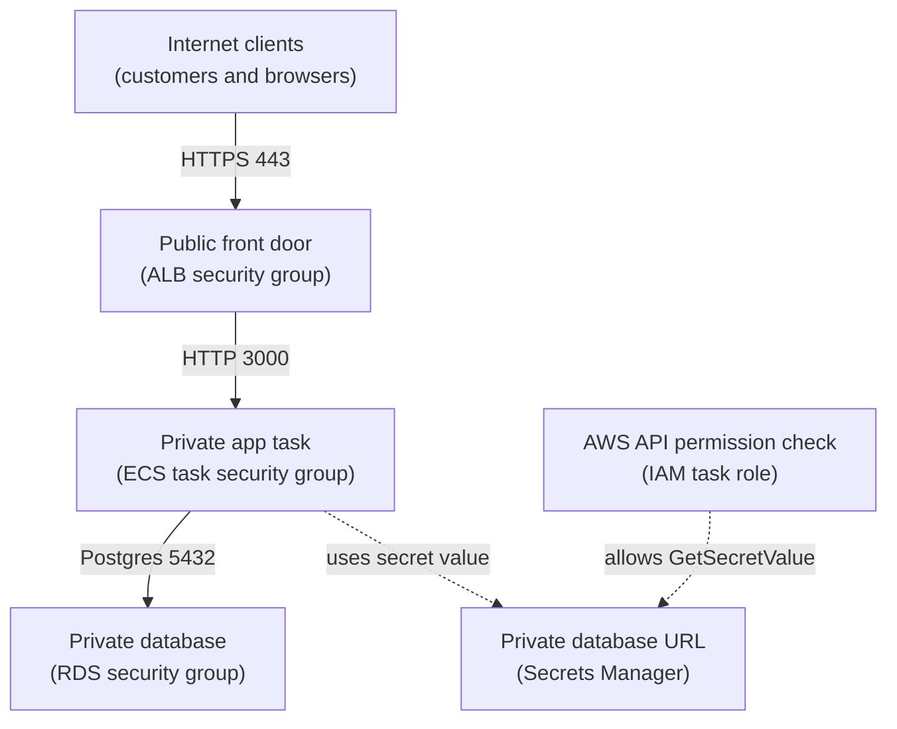

## Table of Contents

1. [The Packet Question IAM Cannot Answer](#the-packet-question-iam-cannot-answer)
2. [The Running Example](#the-running-example)
3. [Security Groups Are Rules Attached To Resources](#security-groups-are-rules-attached-to-resources)
4. [The Orders API Rule Chain](#the-orders-api-rule-chain)
5. [Why Security Group References Beat Broad CIDRs](#why-security-group-references-beat-broad-cidrs)
6. [NACLs Are Subnet Guardrails That Do Not Remember](#nacls-are-subnet-guardrails-that-do-not-remember)
7. [Failure Modes You Will Actually See](#failure-modes-you-will-actually-see)
8. [A Calm Diagnostic Path](#a-calm-diagnostic-path)
9. [The Tradeoff: Layered Rules Without Rule Sprawl](#the-tradeoff-layered-rules-without-rule-sprawl)

## The Packet Question IAM Cannot Answer

A backend can have perfect IAM permissions and still be unreachable.
That surprises many beginners because both problems get called "AWS security" in everyday conversation.
The word is the same, but the checks happen in different layers.
IAM decides whether a caller may use an AWS API.
Network rules decide whether packets may reach a network address and port.

Security groups and network access control lists, usually shortened to NACLs, are AWS network filters inside a VPC.
A VPC (Virtual Private Cloud) is your private network space in AWS.
A security group is a set of allow rules attached to a resource, such as a load balancer, an ECS task network interface, or an RDS database.
A NACL is a set of allow and deny rules attached to a subnet.
A subnet is a smaller slice of the VPC where resources live.

These rules exist because network reachability should be explicit.
Your database should not accept traffic just because it has an address.
Your application task should not accept traffic from every machine that can route to the VPC.
Your public load balancer should have a clear internet-facing rule, while the private resources behind it should have much narrower rules.

The most important split is this:
IAM answers "who may call AWS APIs?"
Security groups and NACLs answer "which packets may cross this network boundary?"
If your ECS task role can read a database secret from Secrets Manager, that is IAM.
If the task can open a TCP connection to Postgres on port `5432`, that is networking.

This article uses one service, `devpolaris-orders-api`, to make that split concrete.
The service receives HTTPS traffic through an Application Load Balancer, runs application containers on ECS, and stores order data in RDS for PostgreSQL.
We will follow the traffic from the internet to the load balancer, from the load balancer to the ECS task, and from the ECS task to the database.
By the end, you should be able to read a rule table and say which hop is allowed, which hop is blocked, and why IAM is not the fix for a packet that cannot arrive.

## The Running Example

Keep this picture in your head:
`devpolaris-orders-api` is a small checkout backend.
Customers send requests to `https://orders.devpolaris.com`.
The public entry point is an Application Load Balancer, often called an ALB.
The ALB sends requests to ECS tasks that listen on app port `3000`.
The ECS tasks connect to an RDS PostgreSQL database on port `5432`.

That path has three main network hops:



The solid arrows are packet paths.
The dotted arrow is an AWS API permission path.
That visual split matters.
The ECS task role may have permission to call `secretsmanager:GetSecretValue`, but that permission does not open the database port.
It only lets the task retrieve the database connection string.

For this article, the intended security group design is simple:

| Resource | Security Group | Inbound Rule | Why |
|----------|----------------|--------------|-----|
| ALB | `sg-orders-alb` | TCP `443` from `0.0.0.0/0` | Customers on the internet can use HTTPS |
| ECS tasks | `sg-orders-task` | TCP `3000` from `sg-orders-alb` | Only the load balancer can reach the app port |
| RDS Postgres | `sg-orders-db` | TCP `5432` from `sg-orders-task` | Only the app tasks can reach the database |

This is the core pattern for many beginner AWS apps.
Open the public front door only on the public port.
Let the load balancer talk to the app on the app port.
Let the app talk to the database on the database port.
Do not let the internet talk directly to the ECS task or the database.

Here is a compact status snapshot from the team inventory:

```text
service: devpolaris-orders-api
environment: staging
vpc: vpc-0f4b1c2d3e4a5b678
public entry point: alb-orders-staging
app target port: 3000
database engine: postgres
database port: 5432
```

Nothing in this snapshot says the app is secure by itself.
It only tells you which path the rules must describe.
Good network rules start from the path you want, not from every port AWS lets you type into a form.

## Security Groups Are Rules Attached To Resources

A security group is like a small allow-list attached to a resource.
It says which inbound traffic may reach that resource and which outbound traffic may leave that resource.
Security groups do not have deny rules.
If traffic does not match an allow rule, it is not allowed.

Security groups are stateful.
Stateful means AWS remembers enough about an allowed conversation to let the reply traffic come back.
If a customer connects to the ALB on HTTPS and the inbound rule allows that request, the response can go back out as part of the same conversation.
You do not need to create a matching inbound rule for the customer's temporary reply port.

That memory is useful because normal TCP traffic is a conversation.
One side opens a connection from a temporary client port to a server port.
The server replies back to that temporary port.
Security groups understand that reply as part of the allowed flow.
You write the rule for the service port you care about, such as `443`, `3000`, or `5432`.

Here is the first ALB security group in plain terms:

| Direction | Protocol | Port | Source or Destination | Meaning |
|-----------|----------|------|-----------------------|---------|
| Inbound | TCP | `443` | `0.0.0.0/0` | Accept public HTTPS requests |
| Outbound | TCP | `3000` | `sg-orders-task` | Send app traffic to ECS tasks |

The inbound rule is broad because the ALB is the public front door.
The port is still narrow.
We are not allowing every port from the internet.
We are allowing HTTPS on port `443`.

Now compare the ECS task security group:

| Direction | Protocol | Port | Source or Destination | Meaning |
|-----------|----------|------|-----------------------|---------|
| Inbound | TCP | `3000` | `sg-orders-alb` | Accept app traffic only from the ALB |
| Outbound | TCP | `5432` | `sg-orders-db` | Connect to Postgres |
| Outbound | TCP | `443` | VPC endpoint or internet egress path | Call AWS APIs if needed |

The inbound ECS rule is the part beginners should stare at for a moment.
The source is not `0.0.0.0/0`.
The source is the ALB security group.
That means the task accepts port `3000` traffic from network interfaces that are associated with the ALB security group.
It does not mean the task trusts every private IP address in the VPC.

The database rule is even narrower:

| Direction | Protocol | Port | Source or Destination | Meaning |
|-----------|----------|------|-----------------------|---------|
| Inbound | TCP | `5432` | `sg-orders-task` | Accept Postgres traffic only from the ECS tasks |
| Outbound | TCP | Ephemeral response traffic | Tracked by the security group | Reply to allowed database clients |

For RDS, the inbound rule is usually the one you care about most.
If the database has no inbound rule from the app task security group, the app cannot connect.
If the database has inbound `5432` from `0.0.0.0/0`, the rule is far wider than the service needs.

## The Orders API Rule Chain

A good way to review network access is to read the path as a chain.
Each hop has one sender, one receiver, one protocol, one port, and one source or destination rule.
If any hop is missing, the request stops there.

For `devpolaris-orders-api`, the desired chain is:

| Hop | Sender | Receiver | Port | Required Rule |
|-----|--------|----------|------|---------------|
| 1 | Internet client | ALB | `443` | ALB SG inbound allows `0.0.0.0/0` to `443` |
| 2 | ALB | ECS task | `3000` | Task SG inbound allows `sg-orders-alb` to `3000` |
| 3 | ECS task | RDS | `5432` | DB SG inbound allows `sg-orders-task` to `5432` |

The table reads from left to right like a request.
A customer does not reach the database directly.
The ALB does not connect to Postgres.
The ECS task does not receive internet traffic directly.
Each component has one job in the path.

The AWS CLI can give you useful evidence without making the article a command manual.
Here is a shortened view of the three security groups:

```bash
$ aws ec2 describe-security-groups \
>   --group-ids sg-orders-alb sg-orders-task sg-orders-db \
>   --query 'SecurityGroups[].{Name:GroupName,Inbound:IpPermissions}'
[
  {
    "Name": "sg-orders-alb",
    "Inbound": [
      {
        "IpProtocol": "tcp",
        "FromPort": 443,
        "ToPort": 443,
        "IpRanges": [{ "CidrIp": "0.0.0.0/0" }]
      }
    ]
  },
  {
    "Name": "sg-orders-task",
    "Inbound": [
      {
        "IpProtocol": "tcp",
        "FromPort": 3000,
        "ToPort": 3000,
        "UserIdGroupPairs": [{ "GroupId": "sg-orders-alb" }]
      }
    ]
  },
  {
    "Name": "sg-orders-db",
    "Inbound": [
      {
        "IpProtocol": "tcp",
        "FromPort": 5432,
        "ToPort": 5432,
        "UserIdGroupPairs": [{ "GroupId": "sg-orders-task" }]
      }
    ]
  }
]
```

The detail to notice is `UserIdGroupPairs`.
That is the CLI shape for a rule that references another security group.
For a beginner, you can read it as "source security group" in the inbound rules.
The source is not a raw IP range.
The source is a named group of resources.

This is also where IAM confusion can sneak back in.
The rule does not say "allow the ECS task role."
It says "allow traffic from resources associated with this security group."
If a task uses the right IAM role but the wrong security group, the network path still fails.
If a task uses the right security group but the wrong IAM role, the network path can work while AWS API calls fail.

## Why Security Group References Beat Broad CIDRs

A CIDR block is a range of IP addresses, such as `10.20.0.0/16` or `0.0.0.0/0`.
CIDR rules are sometimes the right tool.
You need them when the source is a known office network, a partner network, or the public internet.
But inside one AWS app path, referencing another security group is often clearer than allowing a broad CIDR.

The reason is ownership.
An IP range describes addresses.
A security group reference describes a role in the architecture.
`10.20.0.0/16` says "anything in this VPC range might connect."
`sg-orders-alb` says "the load balancer tier may connect."
`sg-orders-task` says "the app task tier may connect."

That difference helps when the service changes.
ECS tasks can stop and start.
Fargate tasks receive elastic network interfaces with private IP addresses that can change as tasks are replaced.
If you allow the whole private subnet, every other resource in that subnet gets the same network chance.
If you allow the task security group, new tasks can join the intended app tier without opening the database to unrelated resources.

Here is the same database rule written two ways:

| Database Inbound Rule | What It Really Allows | Review Quality |
|-----------------------|-----------------------|----------------|
| TCP `5432` from `10.20.0.0/16` | Anything routable from the VPC CIDR can try Postgres | Too broad for an app database |
| TCP `5432` from `sg-orders-task` | Only resources in the app task security group can try Postgres | Clear and tied to the app tier |
| TCP `5432` from `0.0.0.0/0` | Any IPv4 source can try if routing and public exposure allow it | Dangerous for a database |

The last row is the scary one.
If the RDS instance is private and routes do not expose it to the internet, `0.0.0.0/0` may not instantly mean the whole internet can connect.
But it still means the database security group is no longer doing its job.
Any source with a network path, such as a peered VPC, VPN, misrouted public setup, or future change, gets a chance to try the database port.

This is why reviewers get nervous when they see a database rule like this:

```text
security group: sg-orders-db
inbound:
  tcp/5432 source 0.0.0.0/0

review note:
  Replace with source sg-orders-task unless there is a documented break-glass reason.
```

The fix is not to add a louder warning in a runbook.
The fix is to make the rule say what you actually mean.
For this service, the database should accept Postgres traffic from the orders API tasks.
So the source should be `sg-orders-task`.

## NACLs Are Subnet Guardrails That Do Not Remember

A NACL is a network access control list attached to a subnet.
It works at the subnet boundary, before traffic reaches a resource inside that subnet or leaves that subnet.
Unlike security groups, NACLs can have allow rules and deny rules.
They are evaluated by rule number, with lower numbers checked first.

NACLs are stateless.
Stateless means the filter does not remember a conversation.
If you allow a request in one direction, the response is not automatically allowed in the other direction.
You must allow both sides of the traffic yourself.

That is the difference beginners usually trip over:

| Feature | Security Group | NACL |
|---------|----------------|------|
| Where it applies | Resource level | Subnet level |
| Rule type | Allow rules only | Allow and deny rules |
| Memory | Stateful | Stateless |
| Normal role | Primary resource access control | Subnet guardrail or extra boundary |
| Common beginner mistake | Allowing too broad a source | Forgetting return traffic |

For the orders API, you might keep the default NACL permissive at first and use security groups for the real app boundaries.
That is normal.
Security groups are usually the main tool for app-to-app and app-to-database access.
NACLs become useful when you need a subnet-wide guardrail, such as denying a known bad range or ensuring a database subnet cannot receive a class of traffic even if someone attaches a sloppy security group later.

The stateless part creates the famous ephemeral port problem.
An ephemeral port is a temporary client-side port chosen for one connection.
When a client connects to `443`, `3000`, or `5432`, the client side is usually not using that same port.
It uses a high temporary port so the reply can find the right local conversation.

Here is a simplified connection:

```text
client source port: 51642
server destination port: 443

request:
  203.0.113.25:51642 -> alb:443

response:
  alb:443 -> 203.0.113.25:51642
```

A stateful security group understands that response.
A stateless NACL does not.
If the subnet NACL allows inbound `443` but denies outbound traffic to the client's ephemeral port range, the request enters and the response gets blocked.
From the user's point of view, this feels like a timeout.

This is why NACL rules often include ephemeral port ranges.
The exact range depends on the client that starts the connection.
For internet-facing services, a broad ephemeral range like `1024-65535` may be needed on the return path.
For internal Linux clients, a narrower operating-system range may be enough, but only if the team is sure about the clients involved.

## Failure Modes You Will Actually See

Network rule failures rarely announce themselves with a friendly sentence like "the task security group forgot inbound port 3000."
They usually look like timeouts, unhealthy targets, or database connection errors.
Your job is to map the symptom back to the hop.

The first failure is a missing inbound rule on the ECS task security group.
The ALB can receive HTTPS from the internet, but it cannot reach the task on port `3000`.
The target group starts reporting timeouts:

```bash
$ aws elbv2 describe-target-health \
>   --target-group-arn arn:aws:elasticloadbalancing:us-east-1:123456789012:targetgroup/orders-api/abc123 \
>   --query 'TargetHealthDescriptions[].{Target:Target.Id,State:TargetHealth.State,Reason:TargetHealth.Reason}'
[
  {
    "Target": "10.20.12.44",
    "State": "unhealthy",
    "Reason": "Target.Timeout"
  }
]
```

Customers may see a `504 Gateway Timeout` because the load balancer could not get a timely response from a target.
The fix direction is to inspect the ECS task security group inbound rules.
For this service, the task security group should allow TCP `3000` from `sg-orders-alb`.
Opening `3000` from `0.0.0.0/0` would make the timeout disappear, but it would also allow direct app-port attempts from anywhere with a path.

The second failure is the database network path.
The task starts, reads its secret, and then fails when it tries to open a TCP connection to RDS.
An application log might look like this:

```text
2026-05-02T10:14:38Z service=devpolaris-orders-api env=staging
error=database_connect_failed
host=orders-staging.abcxyz.us-east-1.rds.amazonaws.com
port=5432
cause=connect ETIMEDOUT 10.20.41.18:5432
```

This is not an IAM error.
If IAM were the problem, you would expect an AWS API error while reading the secret, such as an access denied response from Secrets Manager.
Here the app has the hostname and port, but the TCP connection does not complete.
The fix direction is to inspect the RDS security group inbound rules and confirm TCP `5432` from `sg-orders-task`.

The third failure is a NACL ephemeral port issue.
Security groups look correct.
The ALB can reach some targets sometimes, but health checks or client responses time out after a subnet NACL change.
A flow log style snapshot may show rejected return traffic:

```text
version account-id interface-id srcaddr dstaddr srcport dstport protocol packets bytes start end action log-status
2 123456789012 eni-0abc123 10.20.12.44 10.20.2.18 3000 51748 6 3 180 1777711120 1777711180 REJECT OK
```

Read the ports carefully.
The source port is `3000`, which is the app target port.
The destination port is `51748`, which is an ephemeral client port.
If a subnet NACL blocks that outbound response, the security group statefulness cannot save the connection.
The fix direction is to adjust the NACL return-path rules, not to add random inbound rules to the task security group.

The fourth failure is not an outage at first.
It is a dangerous database rule that quietly expands the blast radius:

```text
finding:
  sg-orders-db allows tcp/5432 from 0.0.0.0/0

current symptom:
  application still works

risk:
  any IPv4 source with a route to the database can attempt Postgres authentication

better rule:
  sg-orders-db allows tcp/5432 from sg-orders-task
```

This one is easy to ignore because nothing is broken.
That is what makes it important.
Security groups are not only for making the happy path work.
They also make the wrong paths impossible or at least much harder.

## A Calm Diagnostic Path

When traffic fails, resist the urge to edit rules randomly.
Random edits create two problems.
They may not fix the real hop, and they often leave behind broader access than the service needs.
Use the request path as your checklist.

Start by naming the failing hop.
Is the customer unable to reach the ALB?
Is the ALB unable to reach the ECS task?
Is the ECS task unable to reach RDS?
Each answer points to a different security group.

For an ALB-to-task timeout, inspect target health first.
If the reason is `Target.Timeout`, check whether the task security group allows the target port from the ALB security group.
Also check that the target group port matches the port the container actually listens on.
Security groups cannot fix a task that is listening on the wrong port.

For a task-to-database timeout, compare three pieces of evidence:

| Evidence | What You Want To See | What It Means If Missing |
|----------|----------------------|--------------------------|
| Task logs | Database timeout includes host and port | App reached connection code but TCP failed |
| DB SG inbound | TCP `5432` from `sg-orders-task` | RDS rejects the network path |
| Task SG outbound | TCP `5432` to `sg-orders-db` or allowed egress | Task may be blocked from initiating the connection |

Then check NACLs only after the security group path makes sense.
NACLs apply to the whole subnet, so a bad NACL rule can affect many resources at once.
Look for recent subnet NACL changes, denied return traffic, or missing ephemeral port ranges.
If the issue began right after a NACL hardening change, the return path deserves attention.

This short command gives you one useful inventory view:

```bash
$ aws ec2 describe-network-acls \
>   --filters Name=association.subnet-id,Values=subnet-private-orders-a \
>   --query 'NetworkAcls[].Entries[].[RuleNumber,Egress,Protocol,PortRange,RuleAction,CidrBlock]'
[
  [100, false, "6", {"From": 3000, "To": 3000}, "allow", "10.20.0.0/16"],
  [120, true, "6", {"From": 1024, "To": 65535}, "allow", "10.20.0.0/16"],
  [32767, false, "-1", null, "deny", "0.0.0.0/0"],
  [32767, true, "-1", null, "deny", "0.0.0.0/0"]
]
```

The fields are not beautiful, but they answer useful questions.
`Egress: false` means inbound to the subnet.
`Egress: true` means outbound from the subnet.
The final deny is normal for custom NACLs because anything not explicitly allowed is denied.
The important question is whether the allowed rules cover both request and response traffic.

For broad database exposure, use a review question instead of a runtime symptom:
who exactly should be allowed to attempt this database port?
If the answer is "the orders API tasks," the source should be `sg-orders-task`.
If the answer is "my laptop for a short migration," use a narrow temporary IP rule, remove it after the work, and leave a change record.
Do not normalize `0.0.0.0/0` on a database because it was convenient once.

## The Tradeoff: Layered Rules Without Rule Sprawl

The healthy default is simple:
use security groups as the primary way to express app traffic, and use NACLs as subnet-level guardrails when the team has a clear reason.
That gives you readable resource rules without making every subnet a fragile packet puzzle.

Security groups are easier for application teams because they follow the resource.
The orders API task security group describes what can reach the tasks.
The database security group describes what can reach the database.
When tasks scale out, the rule still describes the app tier instead of a changing list of private IPs.

NACLs are useful when you need a broader boundary.
For example, a platform team may want a database subnet NACL that denies a known unwanted source range before packets ever reach database resources.
That can be a helpful defense-in-depth layer.
Defense in depth means one control backs up another control, so a mistake in one place is less likely to become a full incident.

The cost is complexity.
A stateless subnet rule can break traffic that the resource-level security group correctly allows.
NACLs also affect every resource in the subnet, so a change meant for one service can surprise another service sharing the subnet.
That is why NACL changes deserve careful review, a rollback plan, and evidence from the actual traffic path.

For `devpolaris-orders-api`, the clean first design is:

| Layer | Decision | Reason |
|-------|----------|--------|
| ALB security group | Allow `443` from the internet | Public HTTPS entry point |
| ECS task security group | Allow `3000` from the ALB security group | Only the front door reaches app tasks |
| RDS security group | Allow `5432` from the task security group | Only the app tier reaches Postgres |
| NACLs | Keep simple unless a subnet guardrail is needed | Avoid stateless return-path surprises |

That design is not fancy.
It is good because a junior engineer can read it during an incident.
The rule names match the architecture.
The sources match the intended senders.
The database rule does not depend on hope that some other network layer will stay private forever.

> Let the rule say the architecture out loud.

---

**References**

- [Security group rules - Amazon VPC](https://docs.aws.amazon.com/vpc/latest/userguide/security-group-rules.html) - Explains security group allow rules, sources, destinations, and security group referencing.
- [Control subnet traffic with network access control lists - Amazon VPC](https://docs.aws.amazon.com/vpc/latest/userguide/vpc-network-acls.html) - Defines NACLs as subnet-level allow and deny rules and explains their stateless behavior.
- [Custom network ACLs for your VPC - Amazon VPC](https://docs.aws.amazon.com/vpc/latest/userguide/custom-network-acl.html) - Shows practical NACL rule shapes, including return traffic and ephemeral port ranges.
- [Security groups for your Application Load Balancer - Elastic Load Balancing](https://docs.aws.amazon.com/elasticloadbalancing/latest/application/load-balancer-update-security-groups.html) - Documents ALB security group recommendations and restricting target traffic to the load balancer security group.
- [Controlling access with security groups - Amazon RDS](https://docs.aws.amazon.com/AmazonRDS/latest/UserGuide/Overview.RDSSecurityGroups.html) - Shows how RDS security groups allow database access from a source CIDR or another security group.
- [Logging IP traffic using VPC Flow Logs - Amazon VPC](https://docs.aws.amazon.com/vpc/latest/userguide/flow-logs.html) - Describes flow logs as evidence for accepted and rejected IP traffic through VPC networking.
