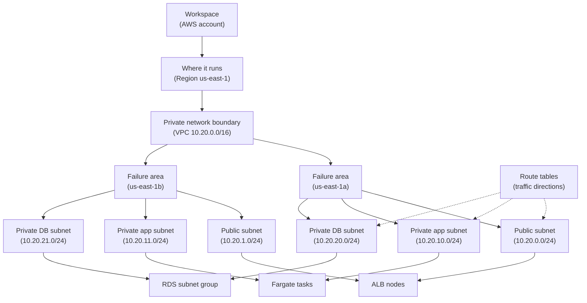

## Table of Contents

1. [The Network Boundary Before The First Deploy](#the-network-boundary-before-the-first-deploy)
2. [CIDR Blocks Give The VPC Its Address Range](#cidr-blocks-give-the-vpc-its-address-range)
3. [Subnets Put Resources In Availability Zones](#subnets-put-resources-in-availability-zones)
4. [Public And Private Subnets Have Different Jobs](#public-and-private-subnets-have-different-jobs)
5. [Route Tables Are The Traffic Directions](#route-tables-are-the-traffic-directions)
6. [Local Routes Make The VPC Feel Connected](#local-routes-make-the-vpc-feel-connected)
7. [What Breaks When Routes Or Subnets Are Wrong](#what-breaks-when-routes-or-subnets-are-wrong)
8. [A Diagnostic Path For A Broken Service](#a-diagnostic-path-for-a-broken-service)
9. [The Tradeoff: Simpler Networks Or Safer Networks](#the-tradeoff-simpler-networks-or-safer-networks)

## The Network Boundary Before The First Deploy

Before a service can run in AWS, it needs a place to live on the network.
That place is not the ECS service, the database, or the load balancer.
Those are the things you put inside the network.
The network boundary itself is the first AWS object you need to understand.

AWS calls that boundary a **VPC**.
VPC stands for Virtual Private Cloud.
It is a private network space inside one AWS account and one Region.
Private here means the address space belongs to your cloud environment, not that every resource inside it is automatically hidden from the internet.
You still decide which parts can face the internet and which parts should stay internal.

The reason a VPC exists is simple: cloud resources need a shared network without being mixed together with every other AWS customer.
Your ECS tasks need private IP addresses.
Your database needs an address the app can reach.
Your load balancer needs a public edge where users can enter.
The VPC is the container that lets all of those resources share a controlled network.

We will use one running example in this article: `devpolaris-orders-api`.
The service runs on ECS with Fargate, which means AWS runs the containers without you managing EC2 instances.
Users reach the API through an Application Load Balancer, usually shortened to ALB.
The API stores order records in Amazon RDS.
That gives us three resource types to place:

| Resource | Example Name | Who Should Reach It |
|----------|--------------|---------------------|
| Application Load Balancer | `orders-api-prod-alb` | Public users on the internet |
| ECS Fargate tasks | `orders-api-prod` | The ALB and internal AWS services |
| RDS database | `orders-api-prod-db` | Only the application tasks and trusted operators |

The beginner mistake is to imagine the VPC as one flat box.
In a real AWS setup, you split that box into smaller areas.
Those smaller areas are called **subnets**.
A subnet is a slice of the VPC address range, and each subnet lives in exactly one Availability Zone.

Route tables are the third piece.
A **route table** is the list of directions attached to a subnet.
It answers a practical question: when traffic leaves this subnet, which target should AWS send it to?
The target might be the local VPC network, an internet gateway, a NAT gateway, a transit gateway, or another AWS networking target.

Here is the whole picture before we zoom in:



Read the solid path from top to bottom.
The account contains the Region.
The Region contains the VPC.
The VPC spans the Availability Zones in that Region.
Each subnet sits inside one Availability Zone.
Resources are placed into subnets.

That last sentence is the mental model to keep.
You do not place an ECS task "in AWS" in a vague way.
You place it in a subnet.
Because the subnet belongs to one Availability Zone, the task also runs in that Availability Zone.
Because the subnet belongs to one VPC, the task also belongs to that VPC network.

> A VPC is the private network boundary. A subnet is the placement area. A route table is the direction sign.

Those three ideas will explain most beginner AWS networking problems.
When something cannot connect, ask which boundary it is in, which subnet it was placed in, and which route table gives directions from that subnet.

## CIDR Blocks Give The VPC Its Address Range

A VPC needs an address range before you can place resources inside it.
AWS uses **CIDR notation** for that range.
CIDR means Classless Inter-Domain Routing.
For a beginner, the useful meaning is simpler: CIDR is a compact way to write a block of IP addresses.

An IP address is like a network street address.
Your laptop might have an address on your home network such as `192.168.1.23`.
An ECS task in AWS might have a private address such as `10.20.10.45`.
CIDR notation writes a whole group of addresses, not just one.

For `devpolaris-orders-api`, a reasonable first VPC range might be:

| Item | Value |
|------|-------|
| VPC CIDR | `10.20.0.0/16` |
| Address range | `10.20.0.0` through `10.20.255.255` |
| Plain meaning | This VPC can use addresses that begin with `10.20` |

The `/16` part is the prefix length.
It says how many bits of the address are fixed as the network part.
You do not need to do binary math on your first pass.
For now, remember this practical rule: a smaller suffix usually means a larger range.
`/16` is larger than `/24`.
`/24` is larger than `/28`.

That matters because the VPC CIDR is the pool you cut subnets from.
If the VPC is `10.20.0.0/16`, you can create smaller subnets inside it.
Each subnet gets its own smaller CIDR block.
Those subnet ranges must not overlap.
Two subnets cannot both claim the same IP addresses.

Here is a simple address plan:

| Layer | CIDR Block | Plain Meaning |
|-------|------------|---------------|
| VPC | `10.20.0.0/16` | The whole private network for the service environment |
| Public subnet A | `10.20.0.0/24` | Public entry resources in AZ A |
| Public subnet B | `10.20.1.0/24` | Public entry resources in AZ B |
| Private app subnet A | `10.20.10.0/24` | Fargate tasks in AZ A |
| Private app subnet B | `10.20.11.0/24` | Fargate tasks in AZ B |
| Private DB subnet A | `10.20.20.0/24` | RDS placement option in AZ A |
| Private DB subnet B | `10.20.21.0/24` | RDS placement option in AZ B |

This table is not the only valid plan.
It is a readable first plan.
The gaps between `1`, `10`, and `20` leave room for future subnets without renumbering everything next week.
Cloud networking becomes easier when your numbers have a pattern.

CIDR planning feels boring until two networks need to talk to each other.
If your office VPN uses `10.20.0.0/16` and your AWS VPC also uses `10.20.0.0/16`, routing becomes painful because both sides claim the same addresses.
The router cannot know whether `10.20.10.45` means the AWS task or a machine in the office.
That is why teams choose VPC CIDR blocks carefully, especially when they expect VPNs, Direct Connect, VPC peering, or shared corporate networks later.

A good first habit is to write the address plan before creating resources:

| Planning Note | Value |
|---------------|-------|
| Environment | production |
| Region | `us-east-1` |
| VPC | `devpolaris-prod-vpc` |
| VPC CIDR | `10.20.0.0/16` |
| Public entry range | `10.20.0.0/20` |
| Application private range | `10.20.16.0/20` |
| Database private range | `10.20.32.0/20` |
| Future internal services | `10.20.48.0/20` |

This is not AWS syntax.
It is an engineering note.
It prevents the future version of you from asking why one subnet starts at `10.20.37.0/24` and another starts at `10.20.88.0/24`.

## Subnets Put Resources In Availability Zones

The previous foundation article introduced Regions and Availability Zones.
Now those ideas become concrete.
A VPC belongs to one Region and spans the Availability Zones in that Region.
A subnet is smaller.
Each subnet lives entirely inside one Availability Zone.

That means a subnet is both an address slice and a placement choice.
When you launch an ECS Fargate task into `subnet-aaa`, you are also placing that task in the Availability Zone that owns `subnet-aaa`.
When you choose a DB subnet group for RDS, you are giving RDS a set of subnet choices across Availability Zones.
When you enable subnets on an ALB, you are telling Elastic Load Balancing where to create load balancer nodes.

For the orders API, the relationship looks like this:

| Availability Zone | Subnet | CIDR | Intended Placement |
|-------------------|--------|------|--------------------|
| `us-east-1a` | `subnet-public-a` | `10.20.0.0/24` | ALB node can live here |
| `us-east-1a` | `subnet-app-a` | `10.20.10.0/24` | ECS task can live here |
| `us-east-1a` | `subnet-db-a` | `10.20.20.0/24` | RDS can use this subnet |
| `us-east-1b` | `subnet-public-b` | `10.20.1.0/24` | ALB node can live here |
| `us-east-1b` | `subnet-app-b` | `10.20.11.0/24` | ECS task can live here |
| `us-east-1b` | `subnet-db-b` | `10.20.21.0/24` | RDS can use this subnet |

This is why beginner diagrams often show two vertical columns.
Each column is one Availability Zone.
Inside each column, you create matching subnets for the same job.
The public subnet in AZ A pairs with the public subnet in AZ B.
The app subnet in AZ A pairs with the app subnet in AZ B.
The DB subnet in AZ A pairs with the DB subnet in AZ B.

The reason for this shape is resilience.
If all of your app tasks live in one subnet, and that subnet belongs to one Availability Zone, then an AZ problem can affect the whole app tier.
If the service places tasks in private app subnets across two AZs, the ALB has healthy targets in more than one local failure area.
That does not make the service magic or immune to every outage.
It gives the architecture a better chance when one AZ has trouble.

Resource placement also explains some confusing AWS console screens.
When you create an ALB, AWS asks for subnets.
It is not asking because the ALB is a single server you put somewhere.
Elastic Load Balancing creates load balancer nodes in the enabled Availability Zones.
Selecting a subnet in each AZ tells AWS where those nodes should attach to your VPC.

When you create an ECS service on Fargate, AWS asks for subnets too.
Each Fargate task receives its own elastic network interface, often called an ENI.
An ENI is a virtual network card.
The task needs that network card so it can have an IP address inside your VPC.
The subnets you give ECS decide which address ranges and AZs those task network cards can use.

RDS uses a DB subnet group.
A DB subnet group is a named set of subnets RDS can use for database placement.
For a normal production database, that group should contain private database subnets in at least two Availability Zones.
Then RDS can place the database and, for Multi-AZ deployments, manage standby placement across AZs.

Here is a status snapshot you might keep during a design review:

| Component | Subnets Selected | Placement Result |
|-----------|------------------|------------------|
| ALB | `public-a`, `public-b` | Public entry in 2 AZs |
| ECS service | `app-private-a`, `app-private-b` | Tasks in 2 AZs |
| RDS subnet group | `db-private-a`, `db-private-b` | Database subnets in 2 AZs |

| Wrong Placement | Risk |
|-----------------|------|
| ALB in app subnets | Users may not reach the service |
| ECS in public subnets | Tasks may receive public addresses by mistake |
| RDS in public subnets | Database can become reachable from the internet if other settings also allow it |

The last line is important.
A subnet is not the only security control.
Security groups, network ACLs, public IP settings, DNS, and service settings also matter.
But subnet placement is the first big shape.
If you place a database in the wrong kind of subnet, every later control has to work harder to protect it.

## Public And Private Subnets Have Different Jobs

A subnet is called public or private because of its routing, not because of its name.
If a subnet has a route that sends internet-bound traffic directly to an internet gateway, it is a public subnet.
If it does not have that direct route, it is private.
The name `public-a` is only a human label.
The route table is what proves the behavior.

An **internet gateway** is the VPC component that lets resources with public addresses communicate with the public internet.
It is attached to the VPC.
Public subnets use a route to the internet gateway for traffic with a destination of `0.0.0.0/0`.
That destination means "any IPv4 address that is not matched by a more specific route."

For `devpolaris-orders-api`, the ALB belongs in public subnets.
Users on the internet need to reach the load balancer.
The ALB listens on HTTPS, checks listener rules, and forwards valid requests to healthy ECS targets.
The ALB is the front door, so it needs a public path.

The ECS tasks usually belong in private app subnets.
Users do not need to connect directly to a task IP.
They should go through the ALB.
The ALB talks to the tasks through private IP addresses inside the VPC.
That keeps the app tier away from direct inbound internet traffic.

The RDS database belongs in private database subnets.
Users should never connect directly to the database.
The API should connect to it over the VPC private network.
Operators should use controlled access paths, not open database ports to the world.
This is one of the simplest ways cloud network design protects data.

The request path should feel like a handoff:
the internet user reaches the public ALB, the ALB forwards to a private ECS task, and the ECS task talks to a private RDS database.

The app still may need outbound internet access.
For example, the task may need to pull an image, call an external payment provider, download a dependency during a one-off job, or reach an AWS public endpoint if no VPC endpoint exists.
If the task is in a private subnet, it cannot use an internet gateway directly.
It usually reaches the internet through a NAT gateway.

A **NAT gateway** lets resources in private subnets start outbound connections to the internet while still blocking unsolicited inbound connections from the internet.
NAT stands for Network Address Translation.
The simple mental model is that private tasks send outbound internet traffic to the NAT gateway, and the NAT gateway sends it out through the public subnet.
The outside service sees the NAT gateway's public address, not the task's private address.

That gives the orders API this common layout:

| Subnet Type | Route To Internet | Typical Resources | Why |
|-------------|-------------------|-------------------|-----|
| Public | `0.0.0.0/0 -> internet gateway` | ALB, NAT gateway | Needs public entry or public egress path |
| Private app | `0.0.0.0/0 -> NAT gateway` | ECS Fargate tasks | Needs outbound internet, not direct inbound internet |
| Private DB | No default internet route, or tightly controlled egress | RDS | Should only serve internal clients |

There is a cost and complexity tradeoff here.
NAT gateways cost money.
Running one NAT gateway per AZ improves availability for outbound traffic, but costs more than one shared NAT gateway.
Skipping NAT and putting tasks in public subnets can look cheaper and simpler, but it expands the public surface of the app tier.

For a production API that handles orders, the safer default is boring:
public ALB, private app tasks, private database.
Then add the smallest outbound paths the app actually needs.
That design lets you debug from a clear expectation.
If a user cannot reach the API, look at the public ALB path.
If the app cannot pull or call outward, look at private app egress.
If the app cannot reach the database, look at internal VPC reachability and database access controls.

## Route Tables Are The Traffic Directions

A route table is attached to one or more subnets.
It contains routes.
Each route has a destination and a target.
The destination is the address range the traffic is trying to reach.
The target is where AWS should send matching traffic next.

Route tables are not firewall rules.
They do not say "allow this user" or "deny that port."
Security groups and network ACLs handle allow and deny behavior.
Route tables answer a different question: if traffic is leaving this subnet, where should it go?

Here is the public route table for the ALB subnets:

```text
Route table: rtb-orders-public
Associated subnets:
  subnet-public-a
  subnet-public-b

Destination      Target
10.20.0.0/16     local
0.0.0.0/0        igw-0abc1111
```

The first route is the local route.
We will spend the next section on it.
For now, read it as "traffic for addresses inside this VPC stays inside this VPC."
The second route says "all other IPv4 destinations go to the internet gateway."
That is what makes these subnets public.

Here is the private app route table:

```text
Route table: rtb-orders-app-private-a
Associated subnets:
  subnet-app-a

Destination      Target
10.20.0.0/16     local
0.0.0.0/0        nat-0aaa2222
```

This route table still has a default route, but the target is a NAT gateway, not an internet gateway.
That means app tasks can start outbound internet connections, but internet users cannot start direct inbound connections to the tasks through this route.
The ALB remains the public entry point.

For better AZ independence, teams often use one app-private route table per AZ:

```text
Route table: rtb-orders-app-private-a
Associated subnets:
  subnet-app-a
Default route:
  0.0.0.0/0 -> nat-a in public-a

Route table: rtb-orders-app-private-b
Associated subnets:
  subnet-app-b
Default route:
  0.0.0.0/0 -> nat-b in public-b
```

This costs more than one NAT gateway, but it avoids sending all private app egress through one AZ.
If `us-east-1a` has trouble and both private subnets depend on `nat-a`, tasks in `us-east-1b` may lose outbound internet even though their own AZ is healthy.
That is a good example of a routing tradeoff, not just a diagram preference.

Here is a stricter DB route table:

```text
Route table: rtb-orders-db-private
Associated subnets:
  subnet-db-a
  subnet-db-b

Destination      Target
10.20.0.0/16     local
```

This table has no default internet route.
That means resources in the DB subnets can still communicate with resources inside the VPC, but they do not have a direct route to the internet.
For many database designs, that is what you want.
The database serves the app.
It should not need to browse the internet.

AWS chooses routes by the most specific matching destination.
For a beginner VPC, you will usually see `10.20.0.0/16` for local VPC traffic and `0.0.0.0/0` for the default path.
If a packet is going to `10.20.10.45`, the local route is more specific than the default route, so the packet stays inside the VPC.
If a packet is going to `8.8.8.8`, it does not match `10.20.0.0/16`, so the default route handles it.

This explains why a private app task can reach the database without a NAT gateway.
The database address is inside the VPC CIDR.
The route table's local route handles it.
NAT is only needed for destinations outside the VPC, such as public internet addresses.

## Local Routes Make The VPC Feel Connected

The local route is easy to ignore because AWS creates it for you.
Do not ignore it.
It is the reason subnets in the same VPC can talk to each other by private IP address.

For the orders API VPC, the local route looks like this:

```text
Destination      Target
10.20.0.0/16     local
```

The destination is the VPC CIDR.
The target is `local`, which means AWS's internal VPC routing.
Traffic from an app task at `10.20.10.45` to a database at `10.20.20.73` matches `10.20.0.0/16`.
The route table sends that traffic through the VPC's local routing.

This is why you do not create one route for every subnet pair.
You do not need a manual route from `subnet-app-a` to `subnet-db-a`.
You do not need another manual route from `subnet-app-a` to `subnet-db-b`.
The local route covers the whole VPC CIDR.
As long as the route table has the local route, routing can find other addresses in the VPC.

Routing is only one part of the connection.
Security groups still decide whether traffic is allowed.
For the database, a common rule is:

`sg-orders-db` allows inbound PostgreSQL traffic on TCP port `5432` from `sg-orders-app`.
In plain English, only resources using the app security group may open database connections.

That rule is not a route.
It is an access rule.
The route table can know how to reach the database, while the security group can still reject a connection.
This distinction saves a lot of debugging time.

Think of a successful app-to-database connection as three checks:

| Check | Question | Orders API Example |
|-------|----------|--------------------|
| Placement | Are both resources in the intended VPC and subnets? | ECS tasks in app subnets, RDS in DB subnet group |
| Routing | Is there a route for the destination? | App subnet route table has `10.20.0.0/16 -> local` |
| Access | Is the port allowed? | DB security group allows `5432` from app security group |

If any one check fails, the app cannot connect.
That is why "they are in the same VPC" is not a complete diagnosis.
Same VPC gives you the local route foundation.
It does not automatically open every port between every resource.

The local route also helps the ALB reach ECS targets.
When the ALB forwards a request to a Fargate task, it uses the target's private IP address.
The ALB node is in a public subnet.
The task is in a private app subnet.
Both subnets are inside `10.20.0.0/16`, so the local route gives them a path.
Then the app task security group must allow inbound traffic from the ALB security group on the app port.

Here is the healthy shape:

| Hop | Private Addresses | Route Match | Access Rule |
|-----|-------------------|-------------|-------------|
| ALB to ECS | `10.20.0.84` to `10.20.10.45` | `10.20.0.0/16 -> local` | App allows traffic from ALB security group |
| ECS to RDS | `10.20.10.45` to `10.20.20.73` | `10.20.0.0/16 -> local` | DB allows traffic from app security group |

When this works, the public internet only sees the ALB.
The app and database use private addresses.
That is the useful part of the VPC layout.

## What Breaks When Routes Or Subnets Are Wrong

Network mistakes often look like application failures at first.
The API times out.
The deploy succeeds but health checks fail.
The database connection hangs.
The ECS service says it is running, but users see `502`.
Before you rewrite code, check the placement and route shape.

The first common failure is an app that exists but cannot reach the internet.
The ECS service is running in private subnets, but the route table has no default route to a NAT gateway.
The task can reach the database through the local route, but it cannot reach public endpoints.

```text
Symptom:
  ECS task starts, then fails while pulling dependencies or calling an external API.

Task log:
  2026-05-02T10:14:22Z orders-api error
  request to https://payments.example.net/token failed:
  connect ETIMEDOUT 203.0.113.50:443

Subnet route table:
  Destination      Target
  10.20.0.0/16     local

Likely fix:
  Add a default route from the private app subnet to a NAT gateway,
  or add the correct VPC endpoints if the app only needs AWS service access.
```

Do not fix this by moving the app to a public subnet without thinking.
That may make the timeout disappear, but it changes the exposure of the app tier.
The safer fix is to give private tasks the outbound path they need.

The second common failure is an ALB that cannot route to targets.
The ALB is public and reachable, but its target group shows unhealthy tasks.
Sometimes the issue is health check path or security groups.
Sometimes the issue is subnet and AZ alignment.
If targets are registered in an Availability Zone that the ALB did not enable, those targets will not receive traffic.

```text
ALB target group snapshot

Target IP       Port   AZ          Health       Detail
10.20.10.45     8080   us-east-1a  healthy      Health checks passed
10.20.11.88     8080   us-east-1b  unused       Target is in an Availability Zone that is not enabled

ALB enabled subnets:
  subnet-public-a  us-east-1a

Likely fix:
  Enable a public subnet for us-east-1b on the ALB,
  then keep at least one healthy target in each enabled AZ.
```

This is not a code bug.
The service may be running perfectly in `us-east-1b`, but the load balancer was not told to use that AZ.
The placement map and the ALB subnet list disagree.

The third common failure is a database in the wrong subnet group.
The team intended the database to use private DB subnets, but the DB subnet group includes public subnets.
The database might still be protected by security groups.
Even so, the placement is wrong because a later change to public accessibility or security rules can expose something that should have started private.

```text
RDS connectivity snapshot

DB instance: orders-api-prod-db
Publicly accessible: No
DB subnet group: orders-prod-db-subnets

Subnets in group:
  subnet-public-a   us-east-1a   route: 0.0.0.0/0 -> igw-0abc1111
  subnet-public-b   us-east-1b   route: 0.0.0.0/0 -> igw-0abc1111

Expected:
  subnet-db-a       us-east-1a   route: local only
  subnet-db-b       us-east-1b   route: local only

Likely fix:
  Create or select a DB subnet group that contains private DB subnets,
  then move or recreate the database according to the RDS change path for your setup.
```

This is the kind of issue you want to catch during design review.
Moving a database between subnet groups later can be more disruptive than placing it correctly at creation time.

The fourth common failure is a default route that points to the wrong gateway.
For example, someone associates the public subnet route table with a private app subnet.
Now private tasks have `0.0.0.0/0 -> internet gateway`, but the tasks do not have public IP addresses.
The route points at a gateway that cannot help them.

```text
Broken private app subnet

Subnet: subnet-app-a
Route table: rtb-orders-public

Destination      Target
10.20.0.0/16     local
0.0.0.0/0        igw-0abc1111

Task setting:
  Assign public IP: DISABLED

Symptom:
  ECS task is running, but outbound calls time out.

Likely fix:
  Associate subnet-app-a with the private app route table,
  where 0.0.0.0/0 points to the NAT gateway for that AZ.
```

The route table name can fool you too.
A table named `private` can still contain a route to an internet gateway.
A table named `public` can be missing the internet gateway route.
AWS follows the route entries and associations, not the human-friendly name.

Here is a compact failure map:

| Symptom | First Place To Check | Common Fix Direction |
|---------|----------------------|----------------------|
| App cannot call the internet | App subnet route table | Add NAT route or VPC endpoints |
| ALB returns `502` or targets unused | ALB enabled subnets and target AZs | Enable matching public subnets and check target health |
| DB is reachable from places it should not be | DB subnet group and security group | Use private DB subnets and narrow DB inbound rules |
| Private subnet uses internet gateway route | Subnet route table association | Reassociate with private route table that points to NAT |
| App cannot reach DB | Local route, security groups, DB endpoint | Confirm same VPC path and allow app security group |

The table is not a replacement for careful debugging.
It is a starting point.
AWS networking becomes less scary when every symptom maps back to a small number of checks.

## A Diagnostic Path For A Broken Service

Imagine the production deploy for `devpolaris-orders-api` finishes, but users see errors.
The ALB URL responds with `502 Bad Gateway`.
The ECS console says the service has running tasks.
The database is available.
This is exactly the kind of moment where a beginner can bounce between consoles for an hour.

Use a steady path instead.
Start from the user entry point and walk inward.
At each step, prove placement, routing, and access before moving deeper.

First, check whether the ALB is enabled in the expected subnets:

```bash
$ aws elbv2 describe-load-balancers \
>   --names orders-api-prod-alb \
>   --query 'LoadBalancers[0].AvailabilityZones[].{zone:ZoneName,subnet:SubnetId}' \
>   --output table
-------------------------------------
|        DescribeLoadBalancers       |
+------------+----------------------+
|   subnet    |        zone          |
+------------+----------------------+
| subnet-0puba| us-east-1a           |
| subnet-0pubb| us-east-1b           |
+------------+----------------------+
```

This output proves the ALB has one enabled subnet in each expected AZ.
If only one AZ appears, compare that with where your ECS tasks are running.
If the ALB is not enabled where targets live, routing will not behave the way the design says it should.

Next, check the target group:

```bash
$ aws elbv2 describe-target-health \
>   --target-group-arn arn:aws:elasticloadbalancing:us-east-1:123456789012:targetgroup/orders-api-prod/abc123 \
>   --query 'TargetHealthDescriptions[].{target:Target.Id,port:Target.Port,az:Target.AvailabilityZone,state:TargetHealth.State,reason:TargetHealth.Reason}' \
>   --output table
--------------------------------------------------------------------------------
|                            DescribeTargetHealth                               |
+-------------+-------+------------+----------+-------------------------------+
|     az      | port  |   reason   |  state   |            target             |
+-------------+-------+------------+----------+-------------------------------+
| us-east-1a  | 8080  |            | healthy  | 10.20.10.45                  |
| us-east-1b  | 8080  | Target.Timeout | unhealthy | 10.20.11.88             |
+-------------+-------+------------+----------+-------------------------------+
```

This output says the ALB can use at least one target, but one target times out.
Now the question is not "is the whole app deployed?"
The question is "what is different about the target in `us-east-1b`?"
That moves you toward subnet, route table, and security group differences.

Check the ECS service network configuration:

```bash
$ aws ecs describe-services \
>   --cluster devpolaris-prod \
>   --services orders-api-prod \
>   --query 'services[0].networkConfiguration.awsvpcConfiguration'
{
  "subnets": [
    "subnet-0appa",
    "subnet-0appb"
  ],
  "securityGroups": [
    "sg-orders-app"
  ],
  "assignPublicIp": "DISABLED"
}
```

This is a good sign.
The app is using private app subnets.
It is not asking for public IP addresses.
Now check whether each subnet is associated with the route table you expect.

```bash
$ aws ec2 describe-route-tables \
>   --filters Name=association.subnet-id,Values=subnet-0appb \
>   --query 'RouteTables[0].Routes[].{destination:DestinationCidrBlock,target:not_null(NatGatewayId,GatewayId),state:State}' \
>   --output table
------------------------------------------------
|                  DescribeRouteTables                  |
+--------------+-----------+------------+
| destination  |   state   |   target   |
+--------------+-----------+------------+
| 10.20.0.0/16 | active    | local      |
| 0.0.0.0/0    | blackhole | nat-0old99 |
+--------------+-----------+------------+
```

The word `blackhole` matters.
It means the route target is unavailable or deleted.
Traffic matching that route cannot be delivered through that target.
If the unhealthy task needs outbound internet during startup or health checks, this can explain the failure.
The fix is to point the private route table to an active NAT gateway in the intended AZ.

Finally, check the database path only after the ALB-to-app path is clear.
If the app logs show database connection timeouts, compare the DB subnet group and security group.

```text
App log:
  2026-05-02T10:42:18Z orders-api database connection failed
  connect ETIMEDOUT orders-api-prod-db.abcxyz.us-east-1.rds.amazonaws.com:5432

DB subnet group:
  subnet-db-a  us-east-1a
  subnet-db-b  us-east-1b

DB security group:
  inbound TCP 5432 from sg-orders-app

Route expectation:
  app subnet -> 10.20.0.0/16 -> local -> DB subnet
```

If the subnet group and security group match the design, you may move deeper into DNS, credentials, database availability, or app configuration.
But you do that after proving the network shape.
That order keeps you from guessing.

The diagnostic path is:

1. Confirm the account and Region.
2. Confirm the ALB has public subnets in the intended AZs.
3. Confirm target health and target AZs.
4. Confirm ECS uses private app subnets and the expected security group.
5. Confirm each subnet has the expected route table association.
6. Confirm the route targets are active, not deleted or blackholed.
7. Confirm RDS uses private DB subnets and allows traffic from the app security group.

That list is not glamorous.
It is useful.
Most networking incidents become smaller when you walk the path in the same direction as the request.

## The Tradeoff: Simpler Networks Or Safer Networks

There is a reason beginner tutorials often put everything in one public subnet.
It works quickly.
You create a resource, give it a public IP address, open a security group, and connect from your laptop.
For a small learning exercise, that can be fine.
For a service that handles orders, it is not the shape you want to keep.

The safer production shape costs more thinking.
You need multiple subnets.
You need route tables.
You need NAT gateways or VPC endpoints for private outbound access.
You need to remember that the ALB, app tasks, and database belong in different placement areas.
You need to check more than one place when something fails.

That cost buys a clear boundary:

| Design Choice | What You Gain | What You Give Up |
|---------------|---------------|------------------|
| One public subnet for everything | Fast learning setup | Weak separation and more public exposure |
| Public ALB, private app, private DB | Stronger default isolation | More subnet and route-table setup |
| One NAT gateway | Lower cost | One AZ can become an outbound dependency |
| NAT gateway per AZ | Better AZ independence | Higher cost |
| Local-only DB subnets | Very small database egress surface | Extra planning for patching, backups, and managed service access |

The right answer depends on the environment.
A throwaway development VPC can be simpler.
A staging VPC should look enough like production that route mistakes show up before release day.
A production VPC should make the safe path the normal path.

For `devpolaris-orders-api`, a good first production decision is:

| Layer | First Production Decision |
|-------|---------------------------|
| Public entry | ALB subnets in at least two AZs |
| Private app | ECS Fargate tasks in at least two AZs |
| Private app egress | Default route to NAT or specific VPC endpoints |
| Private database | RDS subnet group in at least two AZs |
| Database exposure | No direct public entry path |
| Database access | Security group allows only the app security group |

This design is not advanced.
It is the normal shape you will see again and again in AWS.
The hard part is not memorizing service names.
The hard part is keeping the relationships straight:
Region contains the VPC.
The VPC spans Availability Zones.
Each subnet sits in one Availability Zone.
Resources are placed in subnets.
Route tables tell traffic where to go next.
The local route lets private addresses inside the VPC reach each other.

When those relationships are clear, AWS networking stops feeling like a pile of checkboxes.
It becomes a map you can read.

---

**References**

- [Amazon VPC basics](https://docs.aws.amazon.com/en_us/vpc/latest/userguide/vpc-subnet-basics.html) - Defines the relationship between a VPC, its Region, its Availability Zones, and its built-in VPC resources.
- [Subnets for your VPC](https://docs.aws.amazon.com/vpc/latest/userguide/configure-subnets.html) - Explains subnet placement, public and private subnet behavior, and subnet route table associations.
- [VPC CIDR blocks](https://docs.aws.amazon.com/vpc/latest/userguide/vpc-cidr-blocks.html) - Documents how AWS uses CIDR blocks for VPC address ranges and local routing.
- [Configure route tables](https://docs.aws.amazon.com/AmazonVPC/latest/UserGuide/VPC_Route_Tables.html) - Describes route tables, route priority, local routes, and targets such as internet gateways and NAT gateways.
- [Application Load Balancers](https://docs.aws.amazon.com/elasticloadbalancing/latest/application/application-load-balancers.html) - Covers ALB subnet requirements, enabled Availability Zones, and target placement considerations.
- [Working with a DB instance in a VPC](https://docs.aws.amazon.com/AmazonRDS/latest/UserGuide/USER_VPC.WorkingWithRDSInstanceinaVPC.html) - Explains RDS DB subnet groups, private database placement, and VPC requirements for database instances.
