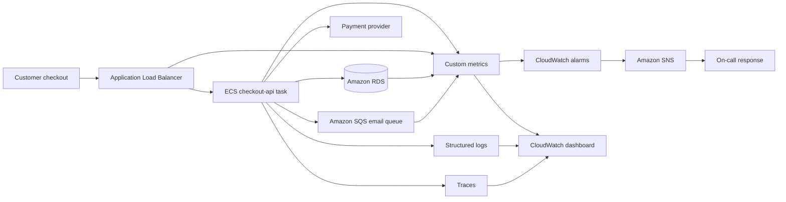

## Table of Contents

1. [The Production Visibility Shift](#the-production-visibility-shift)
2. [What Observability Means](#what-observability-means)
3. [The Signals: Logs, Metrics, and Traces](#the-signals-logs-metrics-and-traces)
4. [Start With KPIs and Service Health](#start-with-kpis-and-service-health)
5. [Instrumentation: How Evidence Gets Emitted](#instrumentation-how-evidence-gets-emitted)
6. [Correlation: How Separate Signals Tell One Story](#correlation-how-separate-signals-tell-one-story)
7. [CloudWatch as the AWS Operating Workspace](#cloudwatch-as-the-aws-operating-workspace)
8. [Dashboards, Alarms, and Response Loops](#dashboards-alarms-and-response-loops)
9. [Multi-Account and OpenTelemetry in Real Teams](#multi-account-and-opentelemetry-in-real-teams)
10. [Putting It All Together](#putting-it-all-together)
11. [What's Next](#whats-next)

## The Production Visibility Shift
<!-- section-summary: Local debugging gives direct access to one process, while AWS production work needs evidence emitted from many services and runtimes. -->

On your laptop, a small application can feel very visible. You start the server in one terminal, click a page in the browser, and watch the logs scroll by. If the checkout route throws an exception, you can add a breakpoint, inspect variables, restart the process, and try the request again. The database, the code, and the error output all sit close together.

Production on AWS has a different shape. A single checkout request might enter through Amazon CloudFront, pass through an Application Load Balancer, reach an Amazon ECS service, call a payment provider, write an order to Amazon RDS, store a receipt in Amazon S3, and put a background email job into Amazon SQS. ECS runs containers. RDS runs managed relational databases. S3 stores objects. SQS stores messages until a worker can process them.

Now imagine a customer says, "I clicked pay and the page spun for ten seconds." That one sentence can mean many things. The load balancer might have sent the request to a slow target. The ECS task might have waited for a database connection. The payment provider might have returned errors. The queue might have grown so large that confirmation email jobs arrived late. A production team needs a way to see the request path, the system pressure, and the exact error details without opening a shell on every runtime.

That is the reason observability matters. AWS workloads run across accounts, Regions, managed services, and short-lived compute. The useful evidence has to be emitted while the workload runs, collected centrally, and shaped so an engineer can answer real questions during an incident.

## What Observability Means
<!-- section-summary: Observability is the practice of emitting enough external evidence to understand a workload's state and make operational decisions. -->

**Observability** is the practice of designing a workload so it emits useful evidence about its behavior. That evidence is called **telemetry**. Telemetry includes the logs, metrics, traces, events, and service health data that tell you what the system did, how much pressure it was under, where time was spent, and which business outcome was affected.

In plain terms, observability means the system explains itself while it runs. A checkout service should emit more than `error happened`. It should tell you the route, service name, deployment version, request ID, trace ID, latency, dependency that failed, and whether the customer reached the business outcome. That turns a vague complaint into a set of facts you can query.

AWS Well-Architected guidance describes observability as a way to understand workload state and make data-driven decisions based on business requirements. That business part matters. A CPU chart can tell you the servers are busy, but it cannot tell you whether customers are completing orders. A strong observability design includes both technical health and business health.

For our checkout example, the first version of the observability map might look like this:

| Question | Signal that helps | Example |
|---|---|---|
| Are customers completing checkout? | Business metric | `CompletedCheckouts` per minute |
| Is the API slow? | Latency metric | `p95` target response time from the load balancer |
| Which request failed? | Structured log | Log event with `requestId`, `orderId`, and `errorType` |
| Which dependency caused the delay? | Distributed trace | Trace showing time spent in RDS or the payment API |
| Who needs to act? | Alarm and notification | CloudWatch alarm routed through an SNS topic |

The flow starts with the customer outcome, then connects that outcome to technical signals. That order keeps observability useful because the team can see whether a technical spike actually matters to users.


*The loop shows why observability is an operating workflow, not a pile of separate tools. A customer signal leads to scope, detail, request path, and action.*

## The Signals: Logs, Metrics, and Traces
<!-- section-summary: Logs explain individual events, metrics summarize behavior over time, and traces connect the path of one request across services. -->

Most AWS observability work starts with three signal types: **logs**, **metrics**, and **traces**. They overlap in useful ways, but each one answers a different kind of question.

**Logs** are event records. A log event usually describes something that happened at a specific time: a request started, a payment provider returned a timeout, a database query failed, or a worker finished a job. Logs are strongest when they are structured as JSON because CloudWatch Logs can discover fields and query them by name.

```json
{
  "timestamp": "2026-06-13T11:41:22.391Z",
  "level": "ERROR",
  "service": "checkout-api",
  "environment": "prod",
  "route": "POST /checkout",
  "requestId": "req-7b91",
  "traceId": "1-684d5b12-7f4c1e46a5b14d1a9d9e1052",
  "orderId": "order-1042",
  "dependency": "payment-provider",
  "durationMs": 2480,
  "message": "Payment authorization timed out"
}
```

This log gives an engineer handles to grab during an incident. They can search by `requestId`, group by `dependency`, filter to `level = ERROR`, or follow the `traceId` into trace details. A plain sentence like `checkout failed` gives much less help because the useful fields are trapped inside unstructured text.

**Metrics** are numeric measurements over time. They compress behavior into values such as request count, error count, latency, CPU utilization, memory utilization, queue depth, and completed orders. Metrics are the first signal many teams look at during an incident because they are fast to graph and alarm on.

For the checkout service, metrics can answer questions like: did latency climb gradually, did errors spike at the exact deployment time, did the queue backlog rise, and did completed checkouts drop? Metrics give the shape of the problem before anyone reads thousands of log events.

**Traces** follow one request across service boundaries. A trace is made from spans or segments that record how long each part of the request took. If checkout calls the payment provider, then RDS, then SQS, a trace can show that the payment call took 2.4 seconds while the rest of the work took 80 milliseconds.

AWS X-Ray groups trace segments that belong to the same request and builds service graphs. CloudWatch also supports OpenTelemetry ingestion, and OpenTelemetry gives teams vendor-neutral APIs and attributes for metrics, logs, and traces. The important beginner idea is simple: traces connect the hops so you can see where one request spent its time.


*This separates the first diagnostic question each signal answers. Logs explain the event, metrics show the trend, and traces connect the route through services.*

## Start With KPIs and Service Health
<!-- section-summary: Good observability starts with the outcomes the workload must protect, then maps those outcomes to technical signals. -->

A **key performance indicator**, or **KPI**, is a measurement that tells the team whether an important business or product outcome is healthy. In an online store, completed checkouts, payment approval rate, and order confirmation delay are KPIs. In a learning platform, successful lesson starts, video startup time, and exercise submission success rate might be KPIs.

This matters because technical telemetry can look busy without saying whether users are being hurt. CPU at 85% may be normal for a batch worker. A single Lambda error may matter a lot if it breaks password reset. A queue with 5,000 messages may be fine for a nightly report job and terrible for a checkout confirmation flow.

AWS Well-Architected guidance recommends identifying KPIs so monitoring stays aligned with business objectives. For our checkout service, a practical first pass could be:

| Layer | Signal | Why the team watches it |
|---|---|---|
| Customer outcome | `CompletedCheckouts` | Shows whether the core flow produces orders |
| Customer experience | `CheckoutLatencyP95` | Shows whether the slowest common customer path is painful |
| API edge | ALB `HTTPCode_Target_5XX_Count` | Shows backend errors behind the load balancer |
| Compute | ECS `CPUUtilization` and `MemoryUtilization` | Shows whether tasks are resource constrained |
| Data | RDS `DatabaseConnections` and write latency | Shows database pressure and connection pool risk |
| Async work | SQS `ApproximateAgeOfOldestMessage` | Shows whether background jobs are falling behind |

The order in this table is intentional. Start with the user and the business outcome, then move down through the request path. During an incident, that lets the on-call engineer ask, "Are customers affected?" before spending time on a noisy infrastructure chart.

Teams often turn KPIs into **service level indicators**, or **SLIs**. An SLI is a measurable health signal for a service, such as availability, latency, or fault rate. A **service level objective**, or **SLO**, gives that signal a target, such as "99.9% of checkout requests should finish successfully over 30 days." CloudWatch Application Signals can help monitor service health and SLOs for supported instrumented applications, but the team still needs to choose the outcomes that matter.

## Instrumentation: How Evidence Gets Emitted
<!-- section-summary: Instrumentation adds the logging, metric, and tracing code or agents that send telemetry from applications and infrastructure. -->

**Instrumentation** means adding the code, libraries, agents, or service configuration that emits telemetry. Some telemetry appears automatically because AWS services publish CloudWatch metrics. For example, Application Load Balancer, Amazon ECS, Amazon RDS, AWS Lambda, and Amazon SQS publish service metrics that you can graph and alarm on.

Your application still needs to emit its own evidence. AWS cannot infer that a payment was declined because the card was invalid, that an order failed a fraud rule, or that a new promotion code path slowed down checkout. The application has to log those facts, publish custom metrics, and propagate trace context.

A practical checkout service emits three layers of evidence:

| Instrumentation point | What it emits | Example |
|---|---|---|
| Application logger | Structured events | `payment_authorization_failed` with `requestId` and `traceId` |
| Metric library or CloudWatch API | Business and technical numbers | `CompletedCheckouts`, `PaymentFailures`, `CheckoutLatency` |
| OpenTelemetry or X-Ray instrumentation | Request path timing | Span for `POST /checkout`, subspan for `payment.authorize` |

On Amazon EC2 instances, on-premises servers, and some container environments, the **CloudWatch agent** can collect system-level metrics, logs, StatsD or collectd custom metrics, and traces from OpenTelemetry or X-Ray client SDKs. A small agent configuration might collect one application log file and memory utilization like this:

```json
{
  "agent": {
    "metrics_collection_interval": 60
  },
  "logs": {
    "logs_collected": {
      "files": {
        "collect_list": [
          {
            "file_path": "/var/log/checkout/app.log",
            "log_group_name": "/aws/ec2/checkout-api",
            "log_stream_name": "{instance_id}"
          }
        ]
      }
    }
  },
  "metrics": {
    "namespace": "CWAgent",
    "metrics_collected": {
      "mem": {
        "measurement": ["mem_used_percent"]
      }
    }
  }
}
```

For new application telemetry, AWS documentation now points teams toward **OpenTelemetry** for publishing custom metrics to CloudWatch. OpenTelemetry is an open-source framework for collecting metrics, logs, and traces with consistent attributes. In real teams, this helps because the same service name, environment, deployment version, and trace context can travel across all three signal types.

## Correlation: How Separate Signals Tell One Story
<!-- section-summary: Correlation joins logs, metrics, and traces with shared fields such as service name, environment, request ID, and trace ID. -->

**Correlation** means joining separate pieces of telemetry so they describe the same production event. A metric might tell you checkout latency rose at 11:40. A dashboard might show the RDS connection count climbed at the same time. A trace might show long waits in the payment authorization call. A log might show the exact timeout error and request ID.

Without shared fields, these signals stay scattered. The application log uses `checkout-service`, the trace uses `orders`, the dashboard chart uses `api-prod`, and the alarm name says `latency-high`. A tired on-call engineer then has to translate between naming schemes during the incident.

A production-ready naming scheme uses stable fields across telemetry:

| Field | Where it appears | Example |
|---|---|---|
| `service` | Logs, traces, metrics, dashboards, alarms | `checkout-api` |
| `environment` | Logs, metrics, traces | `prod` |
| `traceId` | Logs and traces | `1-684d5b12-...` |
| `requestId` | Logs and sometimes response headers | `req-7b91` |
| `deploymentVersion` | Logs, traces, dashboards | `2026.06.13.4` |
| `aws.account_id` or account label | Cross-account telemetry | `111122223333` |

Keep request IDs and customer IDs out of metric dimensions because those values can create huge numbers of unique metric series. Put them in logs and traces where per-request detail belongs. Metrics should use low-cardinality dimensions like service, environment, endpoint, status class, and dependency. Low cardinality means the field has a small, stable set of values.

Now the incident flow makes sense. The alarm fires on `checkout-api` p95 latency in `prod`. The dashboard shows the same service and environment. Metrics show payment latency rose. Traces show `payment.authorize` spans at 2.4 seconds. Logs filtered by the same `traceId` show timeout messages for that dependency. The team can move from alert to evidence without guessing names.

## CloudWatch as the AWS Operating Workspace
<!-- section-summary: CloudWatch brings AWS metrics, logs, dashboards, alarms, traces, Application Signals, and OpenTelemetry ingestion into the main AWS observability workspace. -->

**Amazon CloudWatch** is the main AWS service for monitoring AWS resources and applications in real time. It collects and stores metrics, centralizes logs, evaluates alarms, powers dashboards, supports Application Signals, and can work with traces and OpenTelemetry data. For many teams, CloudWatch is the first operating workspace during an AWS incident.

CloudWatch Metrics stores numeric time-series data. Many AWS services publish metrics automatically, and applications can publish custom metrics. CloudWatch Logs centralizes log events from systems, applications, and AWS services, then lets teams search, filter, query, retain, archive, and protect those logs. CloudWatch dashboards arrange metric and log views so responders can see health in one place.

AWS X-Ray and CloudWatch tracing views handle trace data and service maps. Application Signals can collect application metrics and traces for supported services, show call volume, availability, latency, faults, and errors, and help teams work with SLOs. OpenTelemetry support gives teams a path to send metrics, logs, and traces with consistent attributes, then query or explore them inside CloudWatch.

The beginner trap is treating CloudWatch as one page with many buttons. In production, it works best as a workflow:

1. Metrics and alarms detect a symptom.
2. Dashboards show the blast radius and affected dependency.
3. Logs show exact events and error details.
4. Traces show the request path and slow hop.
5. Runbooks and incident tools guide the response.

That workflow keeps the tool choice tied to the operational question. The team looks at metrics for scope, logs for details, and traces for the path.

## Dashboards, Alarms, and Response Loops
<!-- section-summary: Dashboards help humans triage the current state, while alarms turn important metric changes into notifications or controlled automation. -->

A **dashboard** is a shared visual view of workload health. In CloudWatch, a dashboard can show metrics, alarms, logs, text widgets, and cross-account or cross-Region data. A useful dashboard has an order. For checkout, the top row should show customer impact, the middle rows should show the request path, and the lower rows should show supporting dependencies.

A practical dashboard layout for the checkout service might be:

| Dashboard row | Widgets |
|---|---|
| Customer impact | Completed checkouts, checkout p95 latency, checkout 5xx count |
| Ingress | ALB request count, target response time, healthy host count |
| Compute | ECS running task count, CPU, memory |
| Data | RDS connections, write latency, deadlocks or blocked transactions |
| Async | SQS visible messages, age of oldest message, Lambda worker errors |
| Changes | Recent deployment events, alarm state widgets, runbook links |

An **alarm** is a rule that watches a metric or query and changes state. A CloudWatch alarm can be `OK`, `ALARM`, or `INSUFFICIENT_DATA`. It can notify an Amazon SNS topic, create operational items or incidents through supported integrations, or trigger specific actions such as Auto Scaling actions for metric alarms. SNS is a publish-subscribe notification service, so one alarm state change can route to email, chat, paging, or automation subscribers.

Strong response loops include a human-readable alarm name, clear severity, a link to the dashboard, and a runbook. A runbook is the written response path for a known failure. For example, the `checkout-prod-sqs-age-high` alarm should tell the on-call engineer which queue is backed up, which worker service consumes it, which dashboard shows consumer errors, and which rollback or scaling action is approved.

This is where observability turns into operations. The signal has to reach the person or automation that can act. A dashboard that nobody checks at 03:00 protects no workload. An alarm that pages for harmless one-minute spikes trains the team to ignore it. The response loop needs enough signal quality to earn trust.

## Multi-Account and OpenTelemetry in Real Teams
<!-- section-summary: Production AWS organizations usually centralize observability across accounts and use standard telemetry attributes so teams can operate shared systems. -->

Small AWS environments often start in one account. Production AWS environments usually separate development, staging, production, security, networking, and shared services into multiple accounts. That separation helps security and ownership, but it can make incidents harder if every engineer has to switch accounts and Regions to find telemetry.

CloudWatch cross-account observability solves that operating problem by using a **monitoring account** and **source accounts**. A monitoring account can view and analyze telemetry shared from source accounts. Source accounts generate the telemetry from the workloads they own. AWS recommends using AWS Organizations for this setup so new accounts can be onboarded consistently.

The shared telemetry can include CloudWatch metrics, CloudWatch Logs log groups, AWS X-Ray traces, Application Signals services and SLOs, Application Insights applications, and Internet Monitor data. For our checkout service, the production account can keep owning the ECS service and RDS database while the central monitoring account gives the platform team one place to inspect the health of the whole application.

OpenTelemetry helps with the other half of the problem: consistent naming and instrumentation across languages and teams. A Java checkout API, a Node.js payment worker, and a Python fraud service can all emit telemetry with the same attribute shape, such as `service.name`, `deployment.environment`, and trace context. CloudWatch supports OpenTelemetry across metrics, logs, and traces, and AWS Distro for OpenTelemetry gives AWS-supported OpenTelemetry components for common AWS workloads.

In real production work, the pattern usually looks like this:

| Concern | Practical choice |
|---|---|
| Central AWS operations | CloudWatch monitoring account with linked source accounts |
| Application instrumentation | OpenTelemetry SDKs or ADOT where they fit the runtime |
| AWS service metrics | Native CloudWatch metrics from services such as ALB, ECS, Lambda, RDS, and SQS |
| Host and container telemetry | CloudWatch agent or ADOT collector, depending on runtime and signal needs |
| Incident response | CloudWatch alarms routed through SNS to paging, chat, or incident tools |

This gives each team local ownership while giving responders a shared operating view. The exact tooling can differ by workload, but the design goal stays steady: every important service emits evidence with names and labels that another engineer can understand during an incident.

## Putting It All Together
<!-- section-summary: A useful observability design connects business outcomes, telemetry signals, CloudWatch workflows, and response actions. -->

Let's replay the checkout incident with the pieces connected.



The customer sees checkout latency. The load balancer and application metrics show p95 latency rising. The business metric shows completed checkouts dropping. The alarm routes through SNS to the on-call engineer. The dashboard shows the payment dependency row turning red. The trace shows most of the request time in `payment.authorize`. The structured logs show timeout errors with the affected deployment version.

Good AWS observability connects several pieces of evidence so the team can move from "customers are affected" to "the payment authorization call is timing out after this deployment" with confidence.

The practical checklist is:

- **Define business KPIs first** so the team knows which outcomes matter.
- **Emit structured logs** with request IDs, trace IDs, service names, environments, and useful error fields.
- **Publish metrics** for latency, errors, saturation, throughput, and important business events.
- **Instrument traces** across service and dependency boundaries so one request path can be reconstructed.
- **Use dashboards for triage** with customer impact at the top and dependencies below.
- **Use alarms for action** with clear thresholds, SNS routing, and runbook links.
- **Centralize multi-account visibility** so responders can investigate without account switching.


*The summary image turns the article into one stack: workloads emit evidence, CloudWatch organizes it, and the team uses that evidence to improve the service.*

## What's Next
<!-- section-summary: The next article turns the basics into concrete CloudWatch metric, dashboard, and alarm design. -->

Now that the core pieces are connected, we can zoom in on the signal that usually starts production response: metrics. Metrics give fast health checks, dashboards, and alarms. The next article builds CloudWatch metrics, dashboard layout, Metrics Insights queries, anomaly detection, recommended alarms, and response-friendly alarm rules around the same checkout service.

---

**References**

- [What is Amazon CloudWatch?](https://docs.aws.amazon.com/AmazonCloudWatch/latest/monitoring/WhatIsCloudWatch.html) - Official overview of CloudWatch monitoring, metrics, alarms, dashboards, logs, cross-account monitoring, and OpenTelemetry support.
- [Implement observability - AWS Well-Architected Operational Excellence Pillar](https://docs.aws.amazon.com/wellarchitected/latest/operational-excellence-pillar/implement-observability.html) - AWS guidance on observability, metrics, logs, traces, KPIs, anomalies, and data-driven workload decisions.
- [OPS04-BP01 Identify key performance indicators](https://docs.aws.amazon.com/wellarchitected/latest/operational-excellence-pillar/ops_observability_identify_kpis.html) - AWS guidance to align observability with business objectives and revisit KPIs as workloads evolve.
- [OPS04-BP02 Implement application telemetry](https://docs.aws.amazon.com/wellarchitected/latest/operational-excellence-pillar/ops_observability_application_telemetry.html) - AWS guidance on application telemetry, business KPIs, CloudWatch, X-Ray, and the CloudWatch agent.
- [What is Amazon CloudWatch Logs?](https://docs.aws.amazon.com/AmazonCloudWatch/latest/logs/WhatIsCloudWatchLogs.html) - Documents centralized log storage, querying, field filtering, metric filters, log classes, retention, and data protection.
- [Collect metrics, logs, and traces using the CloudWatch agent](https://docs.aws.amazon.com/AmazonCloudWatch/latest/monitoring/Install-CloudWatch-Agent.html) - Documents CloudWatch agent support for system metrics, logs, StatsD, collectd, OpenTelemetry traces, and X-Ray traces.
- [AWS X-Ray concepts](https://docs.aws.amazon.com/xray/latest/devguide/xray-concepts.html) - Explains traces, segments, subsegments, service graphs, and trace IDs for distributed request paths.
- [OpenTelemetry - Amazon CloudWatch](https://docs.aws.amazon.com/AmazonCloudWatch/latest/monitoring/CloudWatch-OpenTelemetry-Sections.html) - Documents CloudWatch support for OpenTelemetry metrics, logs, traces, PromQL, Logs Insights, and Transaction Search.
- [CloudWatch cross-account observability](https://docs.aws.amazon.com/AmazonCloudWatch/latest/monitoring/CloudWatch-Unified-Cross-Account.html) - Documents monitoring accounts, source accounts, Observability Access Manager, and shared telemetry types.
- [Application Signals - Amazon CloudWatch](https://docs.aws.amazon.com/AmazonCloudWatch/latest/monitoring/CloudWatch-Application-Monitoring-Sections.html) - Documents application health views, SLOs, services, dependencies, key metrics, and cross-account Application Signals.
