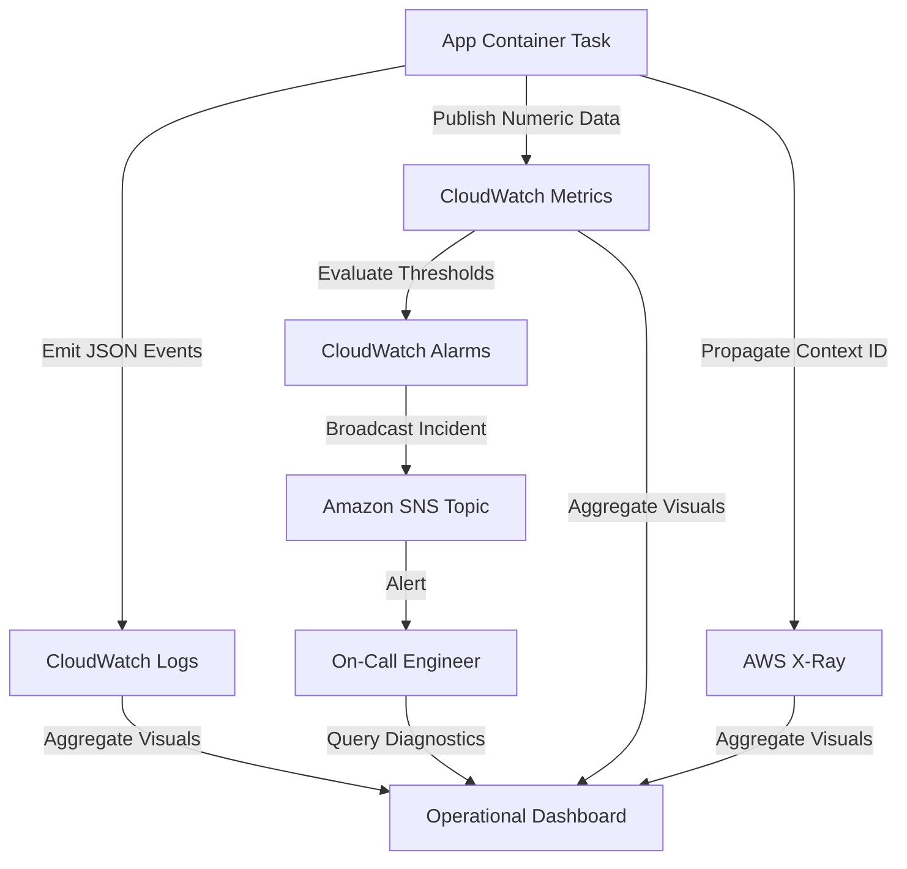

## Table of Contents

1. [The Localhost Visibility Illusion](#the-localhost-visibility-illusion)
2. [What Is Observability](#what-is-observability)
3. [The Three Pillars of Telemetry](#the-three-pillars-of-telemetry)
4. [Logs: Granular Event Histories](#logs-granular-event-histories)
5. [Metrics: Compressed System Trends](#metrics-compressed-system-trends)
6. [Traces: End-to-End Request Pathways](#traces-end-to-end-request-pathways)
7. [The Alerting and Operational Feedback Loop](#the-alerting-and-operational-feedback-loop)
8. [Putting It All Together](#putting-it-all-together)
9. [What's Next](#whats-next)

## The Localhost Visibility Illusion

When you develop and run an application on your local workstation, understanding its runtime execution is immediate. You write code, execute a shell command to start the process, and watch standard output print statements scroll directly across your single terminal viewport in real time. If an endpoint fails, you attach an interactive debugger to set breakpoints, pause execution thread stacks, inspect variables, or view request payloads in browser developer tools. The entire runtime landscape (the application process, database connection pool, filesystem mounts, and configuration environment) is contained within a single machine under your direct physical observation.

Once you deploy that application into a distributed cloud environment like AWS, this localhost visibility illusion breaks down completely. A simple user interaction, such as clicking a checkout button, is no longer handled by a single local process. The transaction traverses multiple isolated networks, serverless container tasks, queues, database subnets, and serverless workers:

* An API Gateway accepts the public HTTPS request, validates authentications, and routes the payload.
* An ECS container task on an isolated private subnet receives the load-balanced request, processes checkout logic, and initiates database transactions.
* An RDS database instance on a dedicated database subnet writes the order record.
* An S3 bucket stores the generated receipt PDF.
* An SQS queue buffers background notification jobs to prevent customer-facing timeouts.
* An isolated AWS Lambda function consumes messages from the queue and triggers external mail gateways.

If a customer encounters a timeout, you cannot attach an interactive debugger to production resources. There is no single console to watch. The application hosts are transient, meaning they scale out, scale in, and heal from underlying hardware failures automatically. If you attempt to diagnose failures by guessing which resource is saturated, you enter an expensive, high-risk troubleshooting cycle. To operate distributed cloud applications successfully, you must transition from local terminal snooping to a structured practice of cloud observability.


*Observability replaces direct local inspection with emitted evidence. In the cloud, the request crosses separate runtimes, so logs, metrics, and traces become the way engineers reconstruct what happened.*

## What Is Observability

Observability is the architectural practice of collecting, organizing, and correlating external outputs, known as telemetry, from a running system so that your engineering team can answer unexpected operational questions about its internal state. Observability means designing a system that leaves enough structured evidence in its wake that you can explain why a production failure occurred without having to reproduce the bug or make assumptions.

Observability is not about installing a vendor dashboard tool and hoping it solves operational problems. It is a deliberate engineering practice of instrumenting your application code and cloud infrastructure to emit high-quality signals. A log line that simply reads `database error` is a weak signal that forces developers to search codebase directories. A high-quality signal is a structured record that names the failing host, the specific query, the latency in milliseconds, the active database connection count, and a unique correlation ID.

To organize these signals, AWS provides Amazon CloudWatch, which stores logs, metrics, alarms, and related telemetry in the AWS control plane. Logs and metrics are regional resources, while CloudWatch dashboards are global and can display data from multiple Regions. AWS X-Ray can receive trace data, and AWS now recommends OpenTelemetry through the AWS Distro for OpenTelemetry (ADOT) for new application instrumentation. By treating these signals not as individual feature checklists, but as a unified map of operational questions, you make production incidents much easier to isolate and resolve.



## The Three Pillars of Telemetry

Every operational question you ask about a running system requires a different level of detail, aggregation, and pathway correlation. To choose the right tool for the job, you must classify your telemetry into the Three Pillars of Observability:

* **Logs (Granular Details)**: Chronological records of discrete events written by your code or AWS services. They are the most granular source of truth, capturing exact error messages, stack traces, transaction payloads, and execution parameters. Logs answer the question: *What exact event happened at this specific millisecond?*
* **Metrics (System-Wide Trends)**: Numeric values aggregated over specific time intervals, such as average latency, CPU utilization, or error counts. Metrics are highly compressed, cheap to store, and instantly queryable at scale, making them the primary source for real-time health dashboards and automated threshold alerts. Metrics answer the question: *How much, how often, and how bad is the performance across the entire fleet?*
* **Traces (Distributed Pathways)**: Correlated timing records that map the end-to-end journey of a single user request as it hops across separate microservices, network interfaces, and database boundaries. Traces answer the question: *Where did this specific transaction spend its execution time, and which downstream hop introduced the bottleneck?*

Choosing the wrong telemetry shape for a query creates massive operational friction. Trying to calculate system latency trends over three months by parsing raw text log lines requires expensive, slow log searches that can cost thousands of dollars in query fees. Conversely, trying to diagnose the root cause of a specific database deadlock using only high-level CPU metric graphs is impossible because metrics compress details away. A mature cloud architecture utilizes all three signals, using each to answer a distinct stage of an incident.

Telemetry Shape Matrix:

| Telemetry Type | Data Structure | Data Volume | Storage Cost | Primary Operational Job | Common Architectural Mistake |
| :--- | :--- | :--- | :--- | :--- | :--- |
| **Logs** | Rich JSON objects | Very High | High | Granular transaction debugging, error stack traces, execution audits. | Storing verbose unstructured text lines without searchable keys. |
| **Metrics** | Aggregated time-series numbers | Low | Very Low | Real-time health monitoring, capacity planning, instant auto-scaling alarms. | Relying on simple fleet averages that hide painful tail latencies. |
| **Traces** | Correlated span dependency trees | Medium | Medium | Isolating bottlenecks and database locks across distributed microservices. | Deploying tracing before defining consistent transaction context headers. |

## Logs: Granular Event Histories

Logs are the foundation of cloud visibility because they preserve the raw, historical truth of individual execution paths. When an application process crashes or an API returns a bad status code, the logs are the exact place where the guest OS, container engine, or application runtime prints the diagnostic evidence.

However, in a scaled cloud environment, traditional unstructured plain-text logs (such as writing `[INFO] user checkout succeeded`) become an operational liability. When ten separate container tasks write unstructured strings to the same destination simultaneously, searching for a specific customer's transaction requires complex regular expressions that are slow to execute and prone to failing on multiline stack traces.

To make logs highly queryable and machine-readable, you must write structured logs. Structured logging is the practice of formatting every log event as a flat JSON object:

```json
{
  "level": "ERROR",
  "timestamp": "2026-05-25T22:53:15.042Z",
  "service": "orders-api",
  "route": "POST /checkout",
  "requestId": "req-7b91",
  "orderId": "order-1042",
  "customerId": "cust-882",
  "durationMs": 2450,
  "dependency": "rds",
  "message": "database transaction failed",
  "error": "connection timeout pool exhausted"
}
```

By outputting this flat JSON block to the standard output stream, your logging libraries bypass the filesystem entirely. The container runtime driver captures the standard output stream, injects host-level metadata (such as task identifier and container image version), and forwards the enriched event securely to a central repository. Responders can then query this JSON database instantly using explicit keys, locating the exact customer's error within milliseconds.

## Metrics: Compressed System Trends

While structured logs are essential for drilling down into specific errors, they are too detailed and expensive to act as your first checkpoint. If your orders API handles 10,000 requests per second, querying logs constantly to check if the application is healthy is highly inefficient. 

Metrics solve this bottleneck by compressing execution behaviors into aggregated, real-time numeric measurements. A metric represents a numerical value (such as CPU consumption, active network socket counts, or total API error volumes) recorded over a specific time window. 

Because metrics store only numbers and timestamps, they occupy a tiny storage footprint. This allows CloudWatch to retain metrics at high frequency, generate instantly updating trend graphs, and evaluate automated threshold rules. 

A metric does not explain why an individual transaction failed. It shows the system-wide pressure and trend. A log event records that request `req-7b91` failed because the RDS connection pool timed out. A metric records that database connection usage rose from 20% to 98% over fifteen minutes, while the cluster-wide error rate rose to 15% during the same window.

## Traces: End-to-End Request Pathways

Even with rich logs and real-time metrics, a major operational gap remains: request correlation. If a customer clicks "Place Order" and experiences an 8-second delay before the browser times out, checking independent logs or metrics is not enough to locate the issue. The load balancer metrics report a successful HTTP handoff, the ECS container logs show checkout processing started, and the RDS database metrics show standard low CPU usage. 

Because the request hopped across separate processes, physical systems, and networks, the execution time was split among them. Every independent team looks at their own charts, declares their service healthy, and blames the adjacent team. 

Distributed tracing bridges this gap. It maps the end-to-end journey of a single request as it crosses network interfaces, measuring the exact execution duration contributed by each microservice, queue, and database database boundary. 

Distributed tracing relies on propagating a unique transaction identifier, known as a trace context header, across every HTTP request, message envelope, and database driver. By passing this context like a relay baton, every downstream service records its own start time, end time, and operational status under the same shared trace identity. Responders can then open a single, unified trace timeline to pinpoint the exact downstream database call or third-party API that introduced the 8-second bottleneck.

## The Alerting and Operational Feedback Loop

Telemetry is only valuable if it drives actions. Collecting logs, metrics, and traces without configuring automated response pathways simply creates high-cost storage volumes that sit idle until an outage occurs. A mature cloud architecture cables telemetry into an automated operational feedback loop.

This loop starts with code instrumentation, where your application developers configure logging frameworks and metric SDKs to emit signals. The regional telemetry database, Amazon CloudWatch, collects these signals and continuously evaluates them against automated CloudWatch Alarms. 

When a metric crosses a defined performance boundary, such as the target response latency exceeding two seconds for three consecutive minutes, the alarm transitions to an active state. The alarm does not contact engineers directly. It publishes a structured message to an Amazon Simple Notification Service (SNS) topic, decoupling the alert trigger from the communication target.

Downstream notification systems, such as PagerDuty or team Slack webhooks, subscribe to this SNS topic to dispatch alerts, paging the on-call engineer with direct links to the relevant cockpit dashboard. In more advanced systems, alarm actions or SNS subscribers can also trigger automation, such as invoking a Lambda runbook or adjusting an approved scaling path. Keep that automation narrow and observable; a self-healing loop that scales the wrong bottleneck can make an incident worse.

## Putting It All Together

Observability is a fundamental architectural discipline that replaces guesswork with empirical evidence:

* **Eliminate Local Host Assumptions**: Design troubleshooting workflows that rely entirely on central, remote telemetry vaults; never assume direct physical access to compute memories or local disks.
* **Format Logs as Structured JSON**: Standardize all application print statements as flat JSON payloads to turn raw text files into searchable databases.
* **Compress Trends with Metrics**: Use low-cost, high-performance time-series metrics to monitor system-wide resource saturation, averages, and tail latencies.
* **Correlate Hops via Distributed Tracing**: Implement context propagation across all network and queue boundaries to trace request execution times across independent services.
* **Cable Alarms into Feedback Loops**: Decouple alert triggers using SNS topics to drive automated PagerDuty escalations and self-healing auto-scaling policies.

By wrapping your cloud applications in structured metrics, real-time dashboards, and automated self-healing loops, you ensure your production environment remains stable, visible, and resilient.

## What's Next

We have established the core mental model of cloud observability, separating the distinct jobs of logs, metrics, and traces. But before we can query these signals, we must configure a durable networking pathway that captures application print streams and ships them securely into CloudWatch Logs. In the next article, we will go deep into CloudWatch Logs, configuring ECS and Lambda drivers, writing structured JSON payloads, and executing high-performance pipe-delimited Logs Insights queries.


*Use this as the observability map: logs preserve exact events, metrics compress trends, traces connect request paths, alarms turn signals into action, dashboards organize response, and correlation joins the evidence.*

---

**References**

* [What Is Amazon CloudWatch](https://docs.aws.amazon.com/AmazonCloudWatch/latest/monitoring/WhatIsCloudWatch.html) - Official AWS overview of the telemetry service.
* [Using Amazon CloudWatch dashboards](https://docs.aws.amazon.com/AmazonCloudWatch/latest/monitoring/CloudWatch_Dashboards.html) - Documents dashboards as global resources that can include metrics from multiple Regions.
* [AWS Distro for OpenTelemetry](https://aws.amazon.com/otel/) - Guide to the production-grade, open-source distribution of the OpenTelemetry standard.
* [AWS X-Ray Developer Guide](https://docs.aws.amazon.com/xray/latest/devguide/aws-xray.html) - Documentation on analyzing request pathways and distributed system timings.
