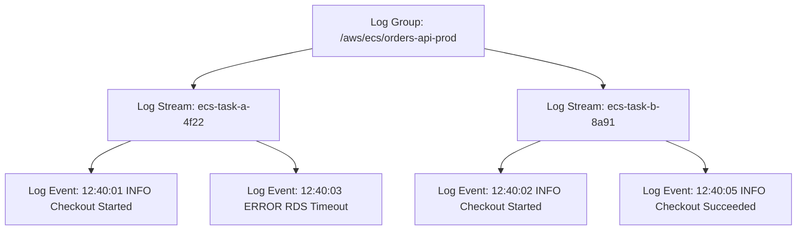

## Table of Contents

1. [The Disappearing Evidence Problem](#the-disappearing-evidence-problem)
2. [What Is CloudWatch Logs](#what-is-cloudwatch-logs)
3. [The Directory Analogy](#the-directory-analogy)
4. [Durable Log Ingestion Paths](#durable-log-ingestion-paths)
5. [The Unified CloudWatch Agent Configuration](#the-unified-cloudwatch-agent-configuration)
6. [The Structured Logging Standard](#the-structured-logging-standard)
7. [Querying Telemetry with Logs Insights](#querying-telemetry-with-logs-insights)
8. [Metric Filters: Non-Intrusive Extraction](#metric-filters-non-intrusive-extraction)
9. [Retention, Governance, and Cost Controls](#retention-governance-and-cost-controls)
10. [Putting It All Together](#putting-it-all-together)
11. [What's Next](#whats-next)

## The Disappearing Evidence Problem

In traditional local application hosting, locating your runtime logs is highly intuitive. The application process writes directly to standard output or appends to a static file on disk, such as `/var/log/nginx/access.log`. If the server experiences an error, you establish a secure shell connection, open the file using command line pagers like `less`, and locate the crash traceback.

In a modern cloud network, this direct approach is impossible. When a distributed application fails under load, the virtual host environments are ephemeral and stateless. The container task that threw the database connection error may have already been terminated by the ECS scheduler and replaced by a fresh container task instance. The serverless Lambda function that failed to execute ran for a brief 100 milliseconds and vanished completely, taking any local filesystem memory with it.

If your application writes its execution history to local server disks, that critical diagnostic evidence vanishes the moment the compute node is replaced. To troubleshoot production incidents, you need a highly durable, centralized logging vault that sits outside the life cycle of your compute servers.

## What Is CloudWatch Logs

Amazon CloudWatch Logs is the serverless regional service designed to store, monitor, index, and query log data from all of your AWS services, applications, and operating systems. Instead of leaving logs trapped on isolated server filesystems, your virtual machines, container tasks, and serverless functions continuously stream their execution lines to CloudWatch over secure, HTTPS API calls.

To organize and secure millions of incoming log lines, CloudWatch enforces a strict, three-tiered structural hierarchy:

* **Log Event**: The fundamental unit of telemetry. A log event is a single chronological record containing a millisecond-precision timestamp and the raw message payload (such as a JSON block or plain-text string).
* **Log Stream**: A sequence of log events originating from a single, specific source instance. In a containerized or serverless cluster, one ECS task replica or one Lambda execution environment writes all of its events into its own unique, dedicated log stream.
* **Log Group**: The logical administrative parent container. A log group is a collection of related log streams that share the same retention policies, encryption keys, IAM access controls, and metric filter rules.



By separating log storage from log execution, your diagnostic evidence is fully preserved. If a virtual host crashes, the logs it streamed to CloudWatch Logs remain fully searchable and secure, ready to be analyzed by your engineering team.

## The Directory Analogy

To build an intuitive mental model of this hierarchy, you can compare CloudWatch Logs to a standard Linux operating system file directory:

* **The Log Group acts as a Folder**: It is the top-level boundary representing a specific application service or environment, such as `/var/log/nginx/` on a local machine. Just as you apply folder-level permissions, you define access control, storage retention timelines, and billing tags at the Log Group boundary.
* **The Log Stream acts as an Individual File**: It is a dedicated document inside that folder holding the chronological print statements of a single compute process, similar to `/var/log/nginx/access.log`.
* **The Log Event acts as a Single Line inside that File**: It is the concrete message printed at one split-second.

When you begin a production investigation, never try to guess the specific Log Stream "file" beforehand. In an autoscaled cluster, searching through thousands of dynamically generated streams is incredibly tedious. 

Instead, your primary diagnostic entrance should always be the Log Group folder. You run search queries and filters against the entire group, letting CloudWatch parse across all nested streams simultaneously to locate the specific transaction context you need.

## Durable Log Ingestion Paths

Before your code can emit useful evidence, you must configure a durable networking path that ships standard print streams into CloudWatch Logs. AWS structures these paths differently depending on the compute runtime:

* **Amazon ECS (Containers)**: Under the Fargate compute model, your container definition in the task blueprint declares the `awslogs` log driver. This driver automatically captures any text written by your application process to standard output (`stdout`) and standard error (`stderr`) streams inside the container, forwarding those lines directly to a configured Log Group (such as `/aws/ecs/orders-api`). This ensures your application code remains completely pure; you simply print to the console, and Fargate handles the cloud shipping in the background.
* **AWS Lambda (Serverless)**: When a serverless Lambda function executes, the runtime environment automatically intercepts all print calls and console logs, streaming them to a dedicated Log Group named `/aws/lambda/<function-name>`. This path is managed entirely by the platform, but it requires that your Lambda function's IAM Execution Role includes explicit policy permissions to create log streams and put log events (`logs:CreateLogStream` and `logs:PutLogEvents`). If these permissions are missing, the function will execute successfully, but you will have zero log visibility in the console.
* **Amazon EC2 (Virtual Servers)**: Unlike managed runtimes, an EC2 instance does not have an automatic print driver. To ship logs, you must install the Unified CloudWatch Agent as a background system daemon on the guest operating system. The agent is configured via a JSON file to monitor specific local files (such as `/var/log/nginx/access.log`), sweep new lines as they are written, and stream them securely to your specified CloudWatch Log Group.

## The Unified CloudWatch Agent Configuration

To monitor and ship local files from a virtual machine into CloudWatch, the Unified CloudWatch Agent daemon reads a local JSON configuration file. Below is a complete, production-ready configuration block for the agent:

```json
{
  "agent": {
    "metrics_collection_interval": 60,
    "run_as_user": "cwagent"
  },
  "logs": {
    "logs_collected": {
      "files": {
        "collect_list": [
          {
            "file_path": "/var/log/nginx/access.log",
            "log_group_name": "/aws/ec2/web-servers/access",
            "log_stream_name": "{hostname}",
            "retention_in_days": 30,
            "timestamp_format": "%d/%b/%Y:%H:%M:%S %z"
          },
          {
            "file_path": "/var/log/nginx/error.log",
            "log_group_name": "/aws/ec2/web-servers/error",
            "log_stream_name": "{hostname}",
            "retention_in_days": 30
          }
        ]
      }
    }
  }
}
```

The configuration is structured explicitly into functional blocks:

* `metrics_collection_interval`: Defines the polling frequency in seconds for system metrics.
* `run_as_user`: The system user account under which the daemon executes, maintaining minimum privilege boundaries.
* `collect_list`: A collection array declaring which files to monitor.
* `file_path`: The absolute path to the local file on the virtual host disk that the agent watches.
* `log_group_name`: The target CloudWatch Log Group folder where the events will be aggregated.
* `log_stream_name`: The target file. Using the `{hostname}` placeholder guarantees that separate servers ship into distinct streams, preventing event collisions.
* `timestamp_format`: The exact parser pattern used to extract the event's chronological index from the text line, preventing CloudWatch from using the ingestion time as the event time during high-volume spikes.

## The Structured Logging Standard

A central database for logs is only useful if the logs themselves are searchable. In a production outage, searching through unstructured plain-text strings (like `"User USR882 clicked place order and got an error"`) forces you to write slow regular expressions that are highly brittle and fail to parse multiline stack traces.

To make logs highly indexable, you must enforce a structured logging standard. This means your application code writes every single log event as a flat, single-line JSON object:

```json
{
  "level": "ERROR",
  "timestamp": "2026-05-25T22:53:15.042Z",
  "service": "orders-api",
  "route": "POST /checkout",
  "requestId": "req-7b91",
  "customerId": "cust-882",
  "durationMs": 2450,
  "message": "database transaction failed",
  "error": "connection timeout pool exhausted"
}
```

By standardizing on this format, CloudWatch automatically parses the JSON fields. You can query `$.level = "ERROR"` or check latency trends on `$.durationMs` directly, transforming raw text files into a fully indexable relational database.

To test ingestion and inspect live events directly from your administrative workstation, you can use the AWS Command Line Interface (`aws cli`). Let us run an interactive query against our application log group:

```bash
$ aws logs filter-log-events \
    --log-group-name "/aws/ecs/orders-api-prod" \
    --filter-pattern '{ $.level = "ERROR" && $.customerId = "cust-882" }' \
    --limit 1
```

Executing this command runs a remote search against the specified Log Group, merging all nested streams. The terminal returns the matching structured payload:

```json
{
  "events": [
    {
      "logStreamName": "ecs-task-a-4f22",
      "timestamp": 1779836395042,
      "message": "{\"level\":\"ERROR\",\"timestamp\":\"2026-05-25T22:53:15.042Z\",\"service\":\"orders-api\",\"route\":\"POST /checkout\",\"requestId\":\"req-7b91\",\"customerId\":\"cust-882\",\"durationMs\":2450,\"message\":\"database transaction failed\",\"error\":\"connection timeout pool exhausted\"}",
      "eventId": "397193639504212345678901234567890",
      "ingestionTime": 1779836396120
    }
  ],
  "searchedLogStreams": [
    {
      "logStreamName": "ecs-task-a-4f22",
      "searchedStartDateTime": 1779830000000,
      "searchedEndDateTime": 1779840000000
    }
  ]
}
```

Every returned coordinate provides critical diagnostic evidence:

* `logStreamName`: The physical container host instance (`ecs-task-a-4f22`) that generated the event, pinpointing host-specific bugs.
* `timestamp`: The millisecond-precision epoch time representing the exact second the application process registered the error.
* `message`: The raw JSON string printed by the application code, containing our custom context keys.
* `eventId`: The globally unique identifier generated by CloudWatch to track the event permanently.
* `ingestionTime`: The exact time the log driver successfully put the event into the remote vault, allowing you to calculate ingestion network lag.

## Querying Telemetry with Logs Insights

When operating at scale, running basic text matches is insufficient to isolate cascading failures. If an application is logging millions of events, you need to aggregate, count, and analyze performance distributions in real time. Amazon CloudWatch Logs Insights provides a high-performance, interactive query engine that processes log groups using a pipe-delimited query language.

Let us execute a complete Logs Insights query designed to analyze our checkout endpoint's latency and error distribution:

```text
fields @timestamp, route, durationMs, error
| filter route = "POST /checkout" and level = "ERROR"
| stats count(*) as ErrorCount, pct(durationMs, 95) as p95Duration, pct(durationMs, 99) as p99Duration by route
| sort p95Duration desc
| limit 10
```

This query parses thousands of events in seconds, structured as a sequence of pipe-delimited pipeline commands:

* `fields`: Specifies which JSON parameters to extract and display in the results table, reducing network transfer sizes.
* `filter`: Restricts the dataset. This matches only events whose `route` key equals `POST /checkout` and whose `level` key matches `ERROR`.
* `stats`: The aggregation command. This counts the total number of errors (`count(*)`) and calculates the p95 and p99 percentile latencies of the `durationMs` field, grouped by route.
* `sort`: Orders the aggregated result rows by the p95 latency in descending order, immediately surfacing the worst performance bottlenecks at the top of the table.
* `limit`: Clamps the result set to the top ten rows, preventing console congestion.

## Metric Filters: Non-Intrusive Extraction

Often in legacy cloud architectures, modifying application source code to publish real-time metrics is impossible or high-risk. CloudWatch Metric Filters solve this bottleneck by parsing incoming log streams in real time, searching for exact text patterns or JSON key values, and automatically incrementing a CloudWatch Metric without modifying your application code.

For example, if you want to monitor payment gateway failures, you define a Metric Filter on your Log Group with the following JSON pattern:

```text
{ $.errorType = "PaymentGatewayError" }
```

When an event arrives containing a key-value matching `"errorType": "PaymentGatewayError"`, CloudWatch intercepts the event and increments a metric named `GatewayFailures` inside a custom namespace `App/PaymentSystem`. You can then cable standard alarms and dashboards directly to this filter-derived metric, establishing immediate operational visibility over legacy applications.

## Under-the-Hood: The Multiline Stack Trace Trap

A major architectural trap when configuring logging pipelines is how systems process application runtime stack tracebacks. By default, runtime frameworks (such as Python, Java, or Node.js) print multi-line error stack traces to standard output as separate, consecutive text lines. 

If a Python process logs an exception, the traceback consists of fifteen separate lines. To a naive container driver or host logging agent, these fifteen lines are processed as fifteen completely independent log events.

```text
Traceback (most recent call last):
  File "app.py", line 42, in checkout
    db.commit()
ConnectionTimeout: pool exhausted
```

When this multi-line block is shipped to CloudWatch Logs, it is fragmented. Searching for the word `ConnectionTimeout` returns a single, isolated log event containing only the final line, stripped of the critical file names and line numbers held in the preceding lines. Even worse, during concurrent request spikes, lines from separate containers interleave inside the remote stream, resulting in a scrambled, unreadable trace.

To prevent this fragmentation, you must enforce structured logging at the framework level. By wrapping the entire exception stack trace inside a single, escaped JSON property (such as `"error": "Traceback...\\n  File...\\n"`), your application ensures that the entire traceback remains bound inside a single chronological Log Event. 

If structured logging cannot be implemented immediately in legacy VM environments, you must configure the Unified CloudWatch Agent's file watcher with explicit `multi_line_start_pattern` rules (utilizing regular expressions like `^[A-Za-z0-9_]`) to force the daemon to buffer subsequent indented lines into a single, cohesive log event before shipping it to the regional vault.


*The stack trace problem is not just messy formatting. If each traceback line becomes a separate log event, the evidence loses its request context; structured JSON keeps the whole failure searchable as one event.*

## Retention, Governance, and Cost Controls

Centralizing logs is a significant cost and compliance vector. A common cloud operations failure is leaving all production and staging Log Groups configured with the default retention setting: `Never Expire`. This causes log volumes to accumulate permanently, resulting in massive, compounding storage fees for telemetry that engineers will never read again.

To build a cost-effective logging architecture, you must enforce strict retention policies:

* **Staging and Development**: Set Log Group retention to 7 days, providing enough history for immediate sprint cycles while eliminating long-term storage fees.
* **Production Standard**: Set Log Group retention to 30 or 90 days, capturing historical evidence for standard incident reviews and performance audits.
* **Compliance Archiving**: If industry regulations require you to retain execution history for years, never store them permanently inside CloudWatch Logs. Set a short retention period (such as 30 days) and configure an automated Kinesis Data Firehose stream to continuously back up log events into cheap Amazon S3 Glacier archive buckets.

Logs Ingest Matrix:

| Log Class | Feature Set | Ingestion Cost | Storage Cost | Primary Use Case |
| :--- | :--- | :--- | :--- | :--- |
| **Standard** | Full CloudWatch Logs feature set, including Logs Insights, metric filters, subscription filters, and direct event retrieval APIs. | Standard | Standard | Active production APIs, real-time security logs, and microservice ingress channels. |
| **Infrequent Access** | Lower-ingestion-cost log class that still supports Logs Insights queries for many investigation workflows, but does not support every feature available to Standard, such as metric filters, subscription filters, `GetLogEvents`, or `FilterLogEvents`. | Lower | Standard | High-volume logs that need occasional investigation but do not drive real-time alarms or subscriptions. |

## Putting It All Together

Operating a resilient centralized logging system requires rigorous design of files, agents, and queries:

* **Never Search Streams Individually**: Run all searches and insights queries against the parent Log Group folder, letting CloudWatch handle the stream merge.
* **Enforce Structured JSON Formats**: Write all application logs as flat, machine-readable JSON payloads, keeping messages rich and indexable.
* **Prevent Stack Trace Fragmentation**: Enforce JSON wrapping or configure agent multi-line start patterns to prevent tracebacks from breaking into isolated text lines.
* **Write Pipeline-Delimited Queries**: Use Logs Insights to aggregate, parse, and analyze latency trends using stats, filters, and percentiles.
* **Enforce Tiered Retention Policies**: Restrict staging retention to seven days, production to thirty or ninety days, and archive compliance trails to S3 Glacier.

## What's Next

Configuring structured logs and Logs Insights queries provides high-resolution evidence for detailed incident investigations. However, logs are too heavy and expensive to monitor constantly in real time. To monitor system-wide trends, aggregate performance onto shared screens, and trigger automated on-call escalations, we need compressed numeric telemetry. In the next article, we will go deep into CloudWatch Metrics and Alarms, percentiles, cockpit dashboard design, and SNS-decoupled alert loops.


*Use this as the CloudWatch Logs checklist: search at the log group level, keep source streams separate, write JSON events, query with Logs Insights, extract metrics carefully, and set retention before storage cost grows unnoticed.*

---

**References**

* [Amazon CloudWatch Logs User Guide](https://docs.aws.amazon.com/AmazonCloudWatch/latest/logs/WhatIsCloudWatchLogs.html) - Documentation on storing, monitoring, and querying application log files.
* [CloudWatch Agent Configuration File](https://docs.aws.amazon.com/AmazonCloudWatch/latest/monitoring/CloudWatch-Agent-Configuration-File-Details.html) - Technical reference for configuring local file collection lists.
* [CloudWatch Logs Insights Query Syntax](https://docs.aws.amazon.com/AmazonCloudWatch/latest/logs/CWL_QuerySyntax.html) - Documentation on the pipe-delimited Logs Insights query language.
* [Amazon CloudWatch Logs Pricing](https://aws.amazon.com/cloudwatch/pricing/) - Reference for logs standard and infrequent access storage costs.
