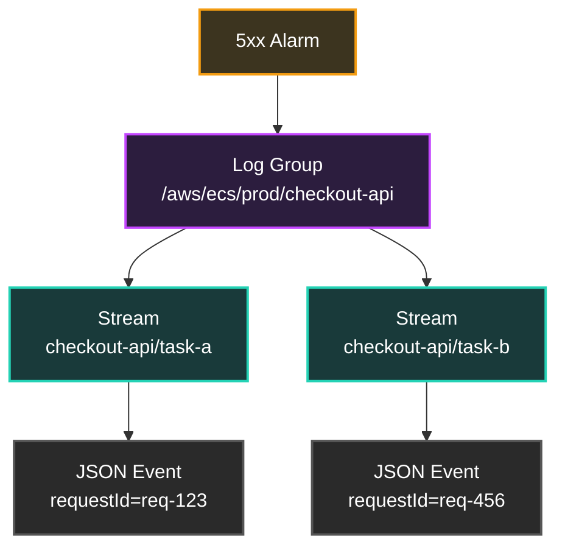
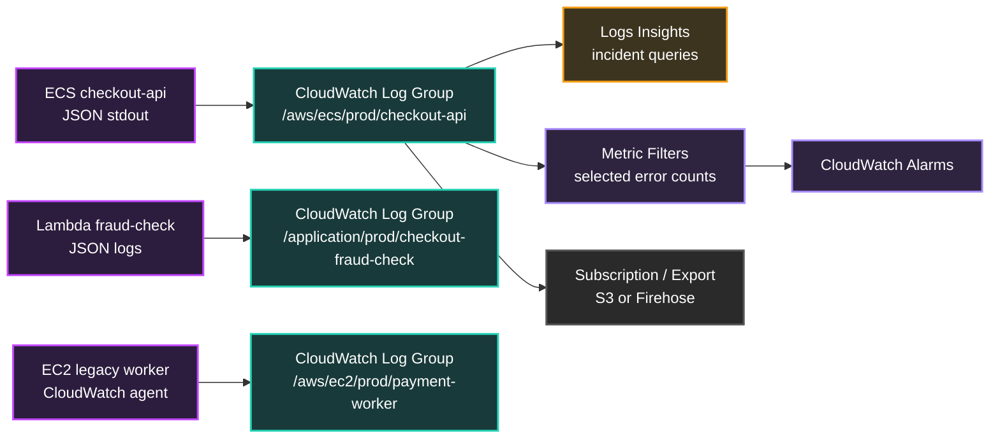

## Table of Contents

1. [The Incident Starts with One Error Line](#the-incident-starts-with-one-error-line)
2. [What CloudWatch Logs Stores](#what-cloudwatch-logs-stores)
3. [Log Groups, Streams, and Events](#log-groups-streams-and-events)
4. [Getting Logs into the Right Group](#getting-logs-into-the-right-group)
5. [JSON Logs and Discovered Fields](#json-logs-and-discovered-fields)
6. [Logs Insights Query Language](#logs-insights-query-language)
7. [Query Cost and Field Indexes](#query-cost-and-field-indexes)
8. [Metric Filters](#metric-filters)
9. [Retention, Log Classes, and Archiving](#retention-log-classes-and-archiving)
10. [Putting It All Together](#putting-it-all-together)
11. [What's Next](#whats-next)

## The Incident Starts with One Error Line
<!-- section-summary: A metric tells the team that checkout is failing, but logs explain the exact request, service, and error that caused the page. -->

Imagine a checkout service running on Amazon ECS. ECS runs containers as tasks, and each task can disappear during deployments, scaling, or recovery. A customer clicks Pay, the browser returns a 502, and the on-call engineer sees a CloudWatch alarm saying the checkout API has a sharp increase in 5xx responses.

The metric tells the team that something is wrong. The request body, customer region, payment provider, exception name, and retry attempt all live somewhere else. That detail usually lives in **logs**, which are timestamped records written by applications, platforms, and services while work is happening.

In a smaller system, a developer might SSH into one server and open `/var/log/app.log`. In AWS, the failed request may have touched an Application Load Balancer, an ECS task, a Lambda fraud-check function, an SQS retry queue, and a database client. The task that wrote the useful line may already be gone by the time someone starts investigating.

That is the job of **Amazon CloudWatch Logs**. It gives AWS workloads a durable place to send operational evidence so the team can search it after the compute environment changes. The rest of this article follows that checkout incident from raw log events to useful queries, metrics, and retention controls.

## What CloudWatch Logs Stores
<!-- section-summary: CloudWatch Logs stores timestamped messages in regional log groups so short-lived workloads can leave durable evidence behind. -->

**Amazon CloudWatch Logs** is a regional AWS service for collecting, storing, searching, and monitoring log data. Regional means a log group in `us-east-1` lives in that Region, and the application must send log data to the Region where the log group exists. For a production workload, this usually means each Region has its own logs, metrics, and alarms for the copy of the system running there.

A **log event** is one record of activity. CloudWatch Logs stores each event with two core pieces: a timestamp for when the activity happened and a UTF-8 message. The message can be plain text, like `payment timeout`, or structured JSON, like `{"level":"ERROR","requestId":"req-123","durationMs":8420}`.

A **log stream** is a sequence of log events from the same source. In practice, a stream often maps to one Lambda execution environment, one ECS task container, one EC2 host log file, or one application instance. A stream keeps the source history separate so you can trace what one runtime wrote.

A **log group** is the container around related log streams. It owns the retention setting, access control, optional KMS encryption, metric filters, subscription filters, and query target. For the checkout API, a common production shape is one log group per service and environment, such as `/aws/ecs/prod/checkout-api`.



This structure matters during incidents. The team normally searches the log group across all streams because the failed request could have landed on any task. The stream remains useful after the first query because it tells you which runtime produced the event.

## Log Groups, Streams, and Events
<!-- section-summary: A good log group design follows service ownership, while streams identify the runtime source and events hold the searchable evidence. -->

The checkout API needs a log shape that matches how the team investigates. A log group named `/aws/ecs/prod/checkout-api` tells responders the environment and service immediately. Separate groups for `/aws/ecs/staging/checkout-api` and `/aws/ecs/prod/payment-worker` keep permissions, retention, and query cost under control.

The most useful split is usually **one log group per service per environment**. That keeps related streams together without mixing every production service into one giant bucket. A platform team may centralize cross-account visibility later, but the source log group still needs a clear owner, a retention policy, and a naming convention.

| Layer | Beginner definition | Production example |
|---|---|---|
| **Log group** | The searchable folder for related streams | `/aws/ecs/prod/checkout-api` |
| **Log stream** | The timeline from one source | `checkout-api/payment/48f0c7c2` |
| **Log event** | One timestamped message | `{"level":"ERROR","requestId":"req-123","errorType":"PaymentGatewayTimeout"}` |
| **Retention policy** | The deletion rule for old events | Keep checkout API logs for 30 days |
| **Metric filter** | A rule that turns matching log events into a metric | Count `PaymentGatewayTimeout` events |

The log group is also the place where governance lives. If the group contains regulated audit logs, the team can use KMS encryption, longer retention, tighter IAM access, and export workflows. If the group contains verbose debug logs, the team can keep a shorter retention window and require developers to raise log level only during active troubleshooting.

For the checkout API, a useful event includes fields that answer the first investigation questions. The team needs request identity, service identity, route, status, duration, error type, and trace identity. The message below is one log event, and CloudWatch Logs Insights can discover the fields because the event is JSON.

```json
{
  "timestamp": "2026-06-13T10:15:22.481Z",
  "level": "ERROR",
  "service": "checkout-api",
  "environment": "prod",
  "requestId": "req-7f3a8c",
  "traceId": "1-666c182a-4f7d9b2e9a1d5c67b8142a10",
  "route": "POST /checkout",
  "statusCode": 502,
  "durationMs": 8420,
  "errorType": "PaymentGatewayTimeout",
  "message": "Payment authorization timed out after provider retry"
}
```

Notice the shape of the event. It has stable names and normal data types, so later queries can filter `level`, group by `errorType`, calculate percentiles from `durationMs`, and join human investigation around `requestId` or `traceId`. This is much more useful than one long sentence that hides those values inside text.


*This hierarchy shows the practical search path. Start at the service log group, then use streams and events only after the query finds the right runtime and request.*

## Getting Logs into the Right Group
<!-- section-summary: Lambda, ECS, EC2, and advanced container routes all need explicit logging paths so every runtime sends evidence to the group the team will query. -->

The next step is ingestion. **Ingestion** means the path that moves log output from the workload into CloudWatch Logs. Each AWS runtime has its own path, so the practical setup depends on where the checkout code runs.

For **AWS Lambda**, Lambda automatically sends function logs to CloudWatch Logs. By default, Lambda creates a log group named `/aws/lambda/<function name>` when the function first writes logs. Lambda can also send multiple functions to a custom log group, and custom streams include the function name and version so the source stays visible.

Lambda also has advanced logging controls. You can choose plain text or JSON log format for supported managed runtimes, set log levels for JSON logs, and choose the CloudWatch log group. For the checkout fraud-check function, JSON logs give the same queryable shape as the ECS API logs.

```bash
aws lambda update-function-configuration \
  --function-name fraud-check-prod \
  --logging-config LogGroup=/application/prod/checkout-fraud-check,LogFormat=JSON,ApplicationLogLevel=INFO,SystemLogLevel=WARN
```

For **Amazon ECS**, the common first path is the `awslogs` log driver. A log driver is the container runtime component that takes stdout and stderr from the container and ships them somewhere else. In Fargate tasks, `awslogs-group`, `awslogs-region`, and `awslogs-stream-prefix` tell ECS where to send each container's output.

```json
{
  "logConfiguration": {
    "logDriver": "awslogs",
    "options": {
      "awslogs-group": "/aws/ecs/prod/checkout-api",
      "awslogs-region": "us-east-1",
      "awslogs-stream-prefix": "checkout-api"
    }
  }
}
```

The stream prefix matters because ECS uses it to build stream names that include the prefix, container name, and task ID. That gives responders a clean path from a failed log event back to the exact task. The ECS task execution role also needs permission to create log streams and put log events.

For **Amazon EC2** and on-premises servers, the **CloudWatch agent** can tail local files and publish them to CloudWatch Logs. The agent is useful for Nginx access logs, application logs on disk, host logs, and older workloads that still write to files. The configuration below tells the agent to read the latest matching file, set a retention period, and combine multiline stack traces by timestamp.

```json
{
  "logs": {
    "logs_collected": {
      "files": {
        "collect_list": [
          {
            "file_path": "/var/log/checkout-api/app.log*",
            "log_group_name": "/aws/ec2/prod/checkout-api",
            "log_stream_name": "{instance_id}/app",
            "timestamp_format": "%Y-%m-%dT%H:%M:%S.%f%z",
            "multi_line_start_pattern": "{timestamp_format}",
            "retention_in_days": 30
          }
        ]
      }
    },
    "service.name": "checkout-api",
    "deployment.environment": "prod"
  }
}
```

For containers that need richer routing, **FireLens** can route ECS logs through Fluent Bit or Fluentd to CloudWatch Logs and other destinations. Teams use it when they need parsing, enrichment, multiple outputs, or different routing per container. The simpler `awslogs` driver is still a good starting point for many services because it is direct and easy to inspect.

## JSON Logs and Discovered Fields
<!-- section-summary: JSON log events let Logs Insights discover fields, which turns raw messages into filters, groups, percentiles, and trace lookups. -->

The checkout team now has log data arriving. The next question is whether those events are easy to query. **Structured logging** means each event uses stable fields instead of hiding everything inside one sentence.

CloudWatch Logs Insights automatically creates system fields that start with `@`, such as `@timestamp`, `@message`, `@logStream`, and `@log`. It can also discover fields from supported log types, including JSON logs. For JSON events, nested values use dot notation, so a field like `user.identity.type` can be queried directly.

This is the difference between hunting and querying. A plain text line might say `payment failed for req-7f3a8c after 8420ms`, which forces the team to parse text every time. A JSON event lets the team ask for `requestId = "req-7f3a8c"` or `durationMs > 8000` without guessing the sentence format.

For Lambda, AWS recommends JSON log format unless existing tooling depends on plain text. Lambda can capture application logs as structured JSON for supported runtimes when you use the built-in logging methods. Python functions can also use the standard `logging` library, and the output can become structured JSON after you enable the JSON log format.

```python
import logging

logger = logging.getLogger()
logger.setLevel(logging.INFO)

def handler(event, context):
    logger.info(
        {
            "service": "checkout-fraud-check",
            "requestId": event["requestId"],
            "decision": "review",
            "riskScore": 82
        }
    )
    return {"decision": "review"}
```

For ECS and EC2 applications, the application usually owns the JSON format. A Node.js service can write one JSON object per line to stdout, and the `awslogs` driver or CloudWatch agent can ship that event without changing the fields. The important habit is keeping field names stable across services.

```javascript
console.log(JSON.stringify({
  timestamp: new Date().toISOString(),
  level: "ERROR",
  service: "checkout-api",
  environment: "prod",
  requestId: "req-7f3a8c",
  traceId: "1-666c182a-4f7d9b2e9a1d5c67b8142a10",
  route: "POST /checkout",
  statusCode: 502,
  durationMs: 8420,
  errorType: "PaymentGatewayTimeout",
  message: "Payment authorization timed out after provider retry"
}));
```

There is one practical trap with JSON logs. CloudWatch Logs Insights can discover fields, but Lambda discovery handles the first embedded JSON fragment in a Lambda event. If a log message contains several JSON fragments inside one line, a query may need the `parse` command. Production teams avoid that by emitting one clean JSON object per event.

## Logs Insights Query Language
<!-- section-summary: Logs Insights uses pipe-style commands to filter, parse, aggregate, and sort log events across one or more log groups. -->

**CloudWatch Logs Insights** is the interactive query engine for CloudWatch Logs. It lets you search one or more log groups over a selected time range and then filter, parse, aggregate, sort, and limit the results. The query language reads like a pipeline, where each command takes the output of the previous command.

During the checkout incident, the first query should find the exact failures. The team selects the checkout API log group, narrows the time picker to the alarm window, and filters for error logs on the checkout route.

```
fields @timestamp, requestId, traceId, route, statusCode, durationMs, errorType, message
| filter service = "checkout-api"
| filter route = "POST /checkout" and level = "ERROR"
| sort @timestamp desc
| limit 50
```

This query gives the incident channel a concrete list of failed requests. `fields` chooses the columns to display, `filter` narrows the event set, `sort` puts the newest evidence first, and `limit` keeps the result readable. The team can copy one `requestId` or `traceId` into the next query.

The next question is scale. One failed request may be a customer-specific issue, while hundreds of similar failures point to a dependency or release problem. The `stats` command turns matching events into counts and percentiles.

```
fields @timestamp, errorType, durationMs, statusCode
| filter service = "checkout-api" and route = "POST /checkout"
| stats count(*) as requests, pct(durationMs, 95) as p95Ms, avg(durationMs) as avgMs by bin(5m), statusCode, errorType
| sort bin(5m) desc
```

This shows whether failures cluster around one error type and whether latency rose before the errors. The `bin(5m)` function groups events into five-minute windows. The percentile gives the team a better view of slow customer experience than an average alone.

Legacy logs may arrive as text. The `parse` command can extract fields from a known pattern so the team can still group and count the data. This is useful during migrations, but it is a bridge toward structured logs rather than the final standard.

```
parse @message "level=* requestId=* provider=* status=* durationMs=*" as level, requestId, provider, status, durationMs
| filter level = "ERROR" and provider = "acme-pay"
| stats count(*) as errors, avg(durationMs) as avgMs by status
| sort errors desc
```

Logs Insights also has commands for pattern analysis, anomaly detection, comparing a period with an earlier period, unmasking protected data when allowed, and using field indexes. The checkout team can start with a small set of reliable queries that answer "which requests failed", "which error grew", and "which deployment or dependency changed near the failure window". More advanced commands fit naturally after the team has the everyday incident queries working.


*The workflow keeps query cost and noise down. A good search narrows the log groups and time window before it starts grouping errors or opening traces.*

## Query Cost and Field Indexes
<!-- section-summary: Logs Insights charges by scanned data, so teams control cost with narrow time ranges, focused log groups, and field indexes for common equality searches. -->

Logs Insights is powerful, and that power has a cost shape. AWS guidance is to select only the needed log groups, use the narrowest possible time range, and cancel console queries before leaving the page so running work stops before completion. Dashboards that contain Logs Insights widgets rerun their queries each time the dashboard refreshes.

For the checkout API, the team should start with the log group and fifteen-minute alarm window, then widen only if the evidence points earlier. Searching every production log group for the last seven days may answer the question eventually, but it scans a much larger amount of data. Query discipline matters because CloudWatch Logs Insights charges based on scanned data.

A **field index** helps equality searches on structured fields. CloudWatch Logs can build indexes for fields in JSON and service logs, and a query that uses an indexed field can attempt to skip events without the target value. Good index candidates are fields that responders search often and fields with high-cardinality values such as `requestId`, `sessionId`, `userId`, or `traceId`.

```bash
aws logs put-index-policy \
  --log-group-identifier /aws/ecs/prod/checkout-api \
  --policy-document '{"Fields":["requestId","traceId","errorType"]}'
```

After the index exists, the team can use normal equality filters for indexed fields, and CloudWatch Logs can attempt to reduce the scan work. For very large searches across many log groups, the `filterIndex` command tells Logs Insights to try to scan only log groups that are indexed on the field and have seen the requested value.

```
fields @timestamp, requestId, traceId, errorType, message
| filterIndex requestId = "req-7f3a8c"
| sort @timestamp asc
```

There are limits to design around. Field indexes apply only to events ingested after the index policy exists, indexed fields are case-sensitive, and field indexes are supported only for the Standard log class. This is one reason teams choose the log class during design instead of trying to change it after the incident.

## Metric Filters
<!-- section-summary: Metric filters turn matching incoming log events into CloudWatch metrics, which helps teams alarm on specific error patterns without rewriting old application code. -->

Logs are detailed, but humans cannot query logs every minute. A **metric filter** watches log events as they are ingested and creates a CloudWatch metric when an event matches a filter pattern. This gives the team a numeric signal that can feed dashboards and alarms.

The checkout team may need an alarm for payment gateway timeouts. The application already logs `errorType`, and the team wants a metric before the next release. A metric filter can count those JSON events without changing application code.

```bash
aws logs put-metric-filter \
  --log-group-name /aws/ecs/prod/checkout-api \
  --filter-name PaymentGatewayTimeouts \
  --filter-pattern '{ $.level = "ERROR" && $.errorType = "PaymentGatewayTimeout" }' \
  --metric-transformations metricName=PaymentGatewayTimeouts,metricNamespace=App/Checkout,metricValue=1,defaultValue=0,unit=Count
```

This filter emits one metric value for each matching event and a default value of `0` for periods where logs are ingested but no matching event appears. That default helps CloudWatch avoid spotty metrics during normal traffic. If no logs arrive during a minute, CloudWatch has no event stream to evaluate, so no default value appears for that minute.

Metric filters also support dimensions for JSON and space-delimited events. A dimension is a name-value label on a metric, and each unique dimension value creates a separate metric series. Dimensions are useful for small stable sets such as `service`, `environment`, or `errorType`.

High-cardinality dimensions can create surprise cost. AWS warns against dimensions such as `requestId` or `IPAddress` because each unique value is a separate custom metric. CloudWatch Logs may disable a metric filter if the configured dimensions generate 1,000 different name-value pairs within one hour.

Metric filters and Logs Insights queries solve different jobs. A query is for investigation after a question appears. A metric filter is for continuous counting and alarming. A healthy production setup uses both: logs hold the detailed evidence, metric filters extract a small number of alarm-worthy signals, and CloudWatch metrics drive the alert loop.

## Retention, Log Classes, and Archiving
<!-- section-summary: Retention and log class choices control how long logs stay queryable, which features work, and how much ingestion costs over time. -->

The checkout API is now sending useful JSON logs, and the team can query them. The final design question is lifecycle. **Retention** is the rule that tells CloudWatch Logs how long to keep events before deleting them.

CloudWatch log groups can keep logs forever if no retention policy is set. That sounds convenient during the first sprint, but production logs grow every day. A practical starting policy might keep active application logs for 30 days, security-sensitive operational logs for 90 or 180 days, and compliance archives in Amazon S3 with lifecycle rules for long-term retention.

```bash
aws logs put-retention-policy \
  --log-group-name /aws/ecs/prod/checkout-api \
  --retention-in-days 30
```

The team can also set retention and log class in infrastructure as code. The class choice is important because the log group class is fixed after the log group is created.

```yaml
CheckoutApiLogGroup:
  Type: AWS::Logs::LogGroup
  Properties:
    LogGroupName: /aws/ecs/prod/checkout-api
    LogGroupClass: STANDARD
    RetentionInDays: 30
    KmsKeyId: arn:aws:kms:us-east-1:123456789012:key/example-key-id
```

**Standard** is the full-featured log class. It supports the full CloudWatch Logs feature set, including metric filters, subscription filters, Live Tail, field indexing, and the full Logs Insights command set. This is the right default for active production application logs that drive incident response.

**Infrequent Access** is for logs that teams query less often. It lowers ingestion cost and keeps storage and Logs Insights query charges aligned with Standard, but it supports a subset of features. For example, field indexing, metric filters, subscription filters, Live Tail, anomaly detection, and some query commands are unavailable in this class.

**Delivery** appears in the CloudWatch Logs APIs for Lambda log delivery to Amazon S3 or Amazon Data Firehose. Delivery keeps events in CloudWatch Logs for one day and omits rich CloudWatch Logs features such as Logs Insights queries. This class fits delivery pipelines, while active incident log groups need Standard or Infrequent Access based on the features the team expects to use.

For long-term pipelines, **subscription filters** send matching log events to services such as Kinesis Data Streams, Amazon Data Firehose, or Lambda soon after ingestion. Teams use subscriptions to centralize logs, enrich them, send them to S3, or feed a security analytics pipeline. Subscription filters are a Standard log class feature, so the class choice affects this architecture.

## Putting It All Together
<!-- section-summary: A production logging setup sends structured events to owned log groups, queries them carefully, extracts a few metrics, and applies retention before cost drifts. -->

Here is the complete logging setup for the checkout service. The ECS API writes one JSON object per line to stdout. The task definition sends stdout and stderr to `/aws/ecs/prod/checkout-api` through the `awslogs` driver. Lambda fraud checks use JSON logging and a custom log group. A legacy EC2 worker uses the CloudWatch agent until the team can move it into the same container pattern.

During an incident, the team starts from the alarm window and the service log group. Logs Insights filters for `level = "ERROR"`, groups by `errorType`, and uses `requestId` or `traceId` to follow the failing transaction. Field indexes help common equality searches on `requestId` and `traceId`, while query discipline keeps scanned data low.

For continuous monitoring, metric filters extract only stable operational signals. `PaymentGatewayTimeouts` is safe because it has one metric series, or at most a few stable dimensions. The team avoids dimensions such as request IDs, customer IDs, and IP addresses because those turn every event into a new custom metric series.

For lifecycle, active service logs stay in Standard with 30 days of retention, security and audit groups use longer retention, and long-term archive copies move to S3 through subscription or export workflows. The team chooses the log class before creation because the class cannot be changed later.



This is the production habit to build. Logs serve as structured evidence, stored under owned log groups, queried with care, converted into a few durable metrics, and retained for the period the business actually needs. Application teams get the most value when every printed event has a clear operational purpose.


*The summary image groups the controls that keep logs useful over time: retention, class, indexes, filters, and subscriptions all belong to the log group design.*

## What's Next
<!-- section-summary: The next article follows a single request across services with X-Ray and OpenTelemetry so logs can connect to a full trace. -->

CloudWatch Logs tells the team what each service wrote. That is enough for many incidents, but distributed systems create a second question: how did one customer request move through every service, queue, function, and dependency?

The next article connects those pieces with AWS X-Ray and OpenTelemetry. We will follow one checkout request through HTTP calls, SQS, Lambda, database spans, sampling, trace headers, and trace-to-log correlation.

---

**References**

- [Amazon CloudWatch Logs concepts](https://docs.aws.amazon.com/AmazonCloudWatch/latest/logs/CloudWatchLogsConcepts.html) - Defines log events, log streams, log groups, metric filters, and retention settings.
- [Log classes](https://docs.aws.amazon.com/AmazonCloudWatch/latest/logs/CloudWatch_Logs_Log_Classes.html) - Documents Standard and Infrequent Access feature support, cost differences, and the rule that log class cannot be changed after creation.
- [CreateLogGroup API](https://docs.aws.amazon.com/AmazonCloudWatchLogs/latest/APIReference/API_CreateLogGroup.html) - Documents `STANDARD`, `INFREQUENT_ACCESS`, and `DELIVERY` log group class values.
- [CloudWatch Logs Insights query syntax](https://docs.aws.amazon.com/AmazonCloudWatch/latest/logs/CWL_QuerySyntax.html) - Covers Logs Insights commands, supported log classes, and query cost best practices.
- [Supported logs and discovered fields](https://docs.aws.amazon.com/AmazonCloudWatch/latest/logs/CWL_AnalyzeLogData-discoverable-fields.html) - Explains discovered `@` fields, JSON dot notation, and Lambda JSON discovery behavior.
- [Create field indexes](https://docs.aws.amazon.com/AmazonCloudWatch/latest/logs/CloudWatchLogs-Field-Indexing.html) - Explains field indexes, `filterIndex`, default indexes, and Standard log class support.
- [Creating metrics from log events using filters](https://docs.aws.amazon.com/AmazonCloudWatch/latest/logs/MonitoringLogData.html) - Documents metric filters, default values, dimensions, and how filters turn logs into metrics.
- [PutMetricFilter API](https://docs.aws.amazon.com/AmazonCloudWatchLogs/latest/APIReference/API_PutMetricFilter.html) - Documents metric filter dimensions, custom metric cost warnings, and high-cardinality disable behavior.
- [Configuring Lambda JSON and plain text log formats](https://docs.aws.amazon.com/lambda/latest/dg/monitoring-cloudwatchlogs-logformat.html) - Documents Lambda structured JSON logging controls and AWS guidance to select JSON unless plain text tooling requires otherwise.
- [Configuring Lambda log groups](https://docs.aws.amazon.com/lambda/latest/dg/monitoring-cloudwatchlogs-loggroups.html) - Documents default Lambda log group naming, custom log groups, stream naming, and execution role permissions.
- [Amazon ECS LogConfiguration](https://docs.aws.amazon.com/AmazonECS/latest/APIReference/API_LogConfiguration.html) - Documents the `awslogs` driver options, stream prefix format, and multiline options.
- [CloudWatch agent configuration file](https://docs.aws.amazon.com/AmazonCloudWatch/latest/monitoring/CloudWatch-Agent-Configuration-File-Details.html) - Documents file collection, log group names, retention, timestamp parsing, and multiline settings.
- [Real-time processing of log data with subscriptions](https://docs.aws.amazon.com/AmazonCloudWatch/latest/logs/Subscriptions.html) - Documents subscription filters, delivery targets, retry behavior, and Standard log class support.
- [Analyzing, optimizing, and reducing CloudWatch costs](https://docs.aws.amazon.com/AmazonCloudWatch/latest/monitoring/cloudwatch_billing.html) - Documents how CloudWatch features generate costs and how to analyze, optimize, and reduce CloudWatch costs.
