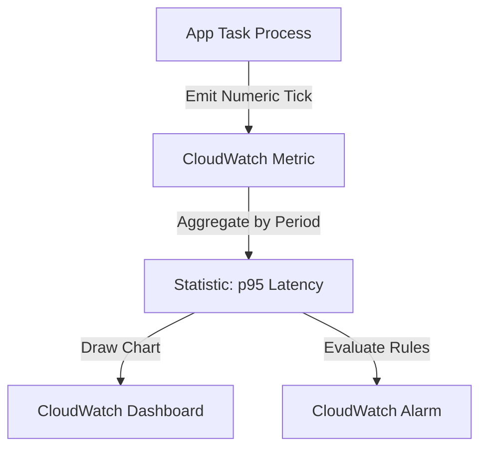
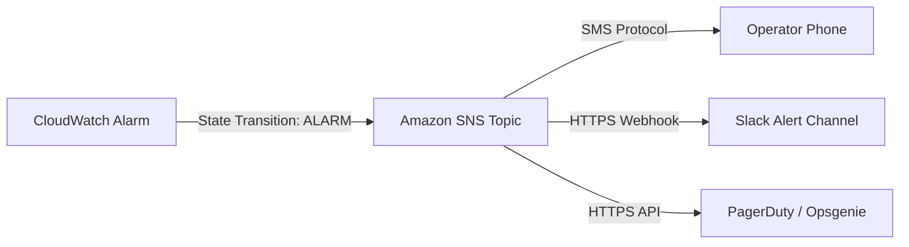

## Table of Contents

1. [The Diagnostic Detail Trap](#the-diagnostic-detail-trap)
2. [What Is a CloudWatch Metric](#what-is-a-cloudwatch-metric)
3. [Namespaces and Dimensions](#namespaces-and-dimensions)
4. [The High-Cardinality Trap](#the-high-cardinality-trap)
5. [Standard vs. High Resolution](#standard-vs-high-resolution)
6. [Percentiles: Exposing the Tail Latency Illusion](#percentiles-exposing-the-tail-latency-illusion)
7. [Publishing Custom Business Metrics](#publishing-custom-business-metrics)
8. [Designing Operational Cockpit Dashboards](#designing-operational-cockpit-dashboards)
9. [Automated Alarms and Evaluation Rules](#automated-alarms-and-evaluation-rules)
10. [The Decoupled Notification Loop](#the-decoupled-notification-loop)
11. [Putting It All Together](#putting-it-all-together)
12. [What's Next](#whats-next)

## The Diagnostic Detail Trap

When a production outage strikes your cloud environment, your immediate instinct is to search log files. If customers complain that checkouts are failing, you immediately query your application log groups to locate the exact transaction errors.

However, searching raw logs is a detailed, resource-heavy operation. If a promotional email or flash sale sends 50,000 active shoppers to your application at the exact same second, your orders API is inundated with requests. Attempting to diagnose a production outage by searching through millions of incoming log lines in real time will crash your search consoles.

Logs are designed to provide rich, granular details, but they are too slow and expensive to act as your first checkpoint. Before you search logs, you must understand the macro health, shape, and scope of the problem:

* Are checkouts failing globally for all users, or is the error isolated to a single container replica?
* Did system latency spike gradually over several hours, or did it jump instantly at the exact second a new deployment rolled out?
* Is your load balancer registering connection timeouts, or are backend application tasks actively returning server errors?
* Is your relational database saturated with active connections, or are your background processing queues backed up?

To answer these high-level questions instantly, you need numeric telemetry. You need a compressed, real-time signal that monitors system performance constantly in the background, aggregates metrics onto shared cockpit dashboards, and alerts your team automatically when performance boundaries are crossed.

## What Is a CloudWatch Metric

Amazon CloudWatch Metrics is the regional high-performance service designed to collect, aggregate, and store numeric time-series data points from all of your AWS resources and custom applications. Unlike logs, which capture rich text strings, a metric stores only raw numbers (such as CPU utilization percentages, active database connection counts, or total API error volumes) recorded over continuous time intervals.

Because metrics are purely numerical, they are cheap to store, fast to query, and highly compressed. This makes them the primary source for drawing real-time trend graphs, configuring automated resource scaling rules, and driving threshold alerts.

A metric does not explain why an individual request failed. It shows the system-wide pressure and trend:

* A log event records: *Request `req-7b91` failed at 12:40:03 because the RDS connection pool timed out.*
* A metric records: *RDS connection usage rose from 20% to 98% over 15 minutes, while the cluster-wide API error rate climbed to 15% during the same window.*



By pairing numeric metrics with raw log files, you establish a powerful diagnostic path: metrics show you *when* and *where* the system broke, while logs reveal the exact *what* and *why* in the underlying code execution.

## Namespaces and Dimensions

To manage thousands of metrics across multiple service tiers without collisions, CloudWatch uses a strict identity schema based on namespaces and dimensions:

* **Namespace**: The top-level grouping container that isolates a family of metrics. AWS-native services automatically publish their metrics under standard, reserved namespaces (such as `AWS/ECS` for container tasks, `AWS/RDS` for database engines, and `AWS/ApplicationELB` for load balancers). Your custom application metrics are kept isolated in their own designated namespaces (such as `Custom/OrdersApp`).
* **Metric Name**: The specific parameter being measured within that namespace, such as `CPUUtilization`, `ActiveConnections`, or `HTTP5xxCount`.
* **Dimensions**: Key-value metadata pairs that uniquely identify and partition the metric (such as `ClusterName=production` and `ServiceName=orders-api`). Dimensions act as the relational coordinates for your telemetry.

A critical gotcha of dimensions is that they form the unique identity of the metric. If you publish a metric with a specific dimension set (e.g., `ClusterName` + `ServiceName`), you cannot query that metric using only `ClusterName` without specifying `ServiceName`, unless you use metric search or metric math to aggregate the series.

## The High-Cardinality Trap

A common cloud operations failure when designing custom telemetry is the high-cardinality trap. Cardinality refers to the uniqueness of a dataset. Low-cardinality fields have a small, stable set of possible values (such as `Environment=Production` or `Region=us-east-1`). High-cardinality fields have a vast, unbounded set of unique values (such as `customerId`, `requestId`, or `orderId`).

If a developer attempts to add a customer ID as a dimension key on a custom metric, every single customer transaction generates a completely new, unique metric series in CloudWatch:

* `Custom/OrdersApp` -> `CompletedCheckouts` -> `CustomerId=cust-001`
* `Custom/OrdersApp` -> `CompletedCheckouts` -> `CustomerId=cust-002`

This multiplies the number of active series. Because AWS bills for every unique metric series active in your account, this cardinality mistake will result in a surprise bill of thousands of dollars within days. Furthermore, aggregating these unbounded streams onto a single dashboard chart is impossible. High-cardinality data belongs strictly inside structured logs or distributed traces, where records are indexed individually. Dimensions must be restricted to low-cardinality, stable operational coordinates.

## Standard vs. High Resolution

When you configure metrics, you must select the appropriate collection resolution based on how rapidly your team needs to detect and respond to performance changes:

* **Standard Resolution (1-Minute Intervals)**: The default option for most AWS resources and custom metrics. AWS aggregates and publishes standard metrics once per minute. This is highly cost-effective and ideal for high-level dashboards, daily trend reviews, and standard database or compute capacity planning.
* **High Resolution (1-Second Intervals)**: Designed for highly dynamic, time-sensitive workloads. High-resolution metrics can be published at sub-minute intervals (down to 1 second). Choose high resolution exclusively for critical auto-scaling triggers that must react instantly to flash sales, or high-frequency business operations (like real-time financial trading gates) where a 1-minute delay in detection is unacceptable.

## Percentiles: Exposing the Tail Latency Illusion

When monitoring application response times, the statistic you choose to measure determines whether you detect real customer pain. A common operational failure is relying on the Average (or Mean) latency statistic. Relying on averages creates a dangerous tail latency illusion that conceals severe outages.

Imagine a microservice that processes 1,000 checkout requests over a 1-minute period:
* 940 requests are processed in a rapid 50 milliseconds.
* 60 requests encounter database lock contention and hang for a painful 10,000 milliseconds (10 seconds) before completing.

If you calculate the mathematical average response time, you sum all durations and divide by 1,000. The average displays as 647 milliseconds. On a loose high-level dashboard, a 647 ms average response time can still look acceptable.

However, in reality, 6% of your customers just experienced a catastrophic 10-second timeout, causing them to abandon their shopping carts. The average statistic has smoothed out and hidden this failure.

Percentile statistics solve this illusion by sorting all data points in order of value:

* **p50 (Median)**: The exact middle value. Half of the requests were faster than this value, and half were slower.
* **p95 (95th Percentile)**: The boundary where roughly 95% of requests were at or below this value, and the slowest 5% were above it. This is a common industry standard for monitoring normal tail latency.
* **p99 (99th Percentile)**: The boundary where 99% of requests were faster, and 1% experienced the worst bottlenecks.

Latency Metric Distribution:

| Metric Statistic | Reported Latency | Operational Conclusion | Actual Customer Experience |
| :--- | :--- | :--- | :--- |
| **Average (Mean)** | 647 ms | Looks acceptable on a loose dashboard. | 60 customers suffered severe 10-second hangs. |
| **p50 (Median)** | 50 ms | Lightning fast for the typical user. | Confirms the core runtime is highly optimized. |
| **p95** | 10,000 ms | Immediate operational failure; queue or lock bottleneck. | Identifies that 5% of the fleet is completely stalled. |
| **p99** | 10,000 ms | Severe outlier saturation; database connection starvation. | Exposes absolute worst-case performance limits. |

To operate a reliable cloud architecture, do not use average latency as your primary customer-experience signal. Latency dashboard charts and automated threshold alarms should evaluate percentile statistics such as `p95` or `p99`, while averages can remain as secondary context.


*Average latency can look healthy while a small group of users waits painfully long. Percentile metrics make that tail visible, which is why latency dashboards and alarms should watch `p95` or `p99`.*

## Publishing Custom Business Metrics

While AWS automatically publishes infrastructure metrics (such as `CPUUtilization` and `NetworkIn`), it cannot measure your application's business correctness. A load balancer can report successful HTTP status codes, but it cannot detect if your checkout logic is writing blank orders to the database.

To bridge this gap, your application code can publish custom business metrics directly using the AWS SDK `PutMetricData` API. Let us execute a terminal session to publish a custom checkout tick:

```bash
$ aws cloudwatch put-metric-data \
    --namespace "Custom/OrdersApp" \
    --metric-data '[{"MetricName": "CompletedCheckouts", "Dimensions": [{"Name": "Environment", "Value": "Production"}, {"Name": "PaymentGateway", "Value": "Stripe"}], "Value": 1.0, "Unit": "Count"}]'
```

Running this command securely ships a single numeric event to CloudWatch over HTTPS. The parameters are defined explicitly:

* `--namespace`: The logical wrapper `Custom/OrdersApp` isolating these records from other applications.
* `--metric-data`: A JSON array containing the actual telemetry payload.
* `MetricName`: The name of the measurement parameter (`CompletedCheckouts`).
* `Dimensions`: Low-cardinality metadata partitioning the series by staging environment and gateway partner, allowing you to isolate payment failures.
* `Value`: The numeric value to record (`1.0`).
* `Unit`: The measurement unit, locking the metric to an integer `Count`.

## Designing Operational Cockpit Dashboards

An operational dashboard is a shared visual interface designed to aggregate related metrics, logs, and alarms to minimize cognitive load during a production outage. A common design failure is dashboard sprawl, which involves creating a massive screen packed with fifty unorganized, flashing charts. During a high-stress incident, operators are blinded by the visual noise and struggle to locate the bottleneck.

You must design dashboards like an aircraft cockpit, arranging charts in a strict, top-down hierarchy:

```text
+-------------------------------------------------------------------+
| ROW 1: USER-FACING HEALTH (Bold Numbers / Latency Percentiles)    |
| [ p95 Checkout Latency ]   [ Completed Checkouts ]  [ ALB 5xx ]   |
+-------------------------------------------------------------------+
| ROW 2: INGRESS GATEWAYS (Network Traffic / Connection Counts)      |
| [ ALB RequestCount ]       [ ALB TargetResponseTime ]              |
+-------------------------------------------------------------------+
| ROW 3: COMPUTE RUNTIME (Resource Saturation / Scale Counts)       |
| [ ECS CPUUtilization ]     [ ECS MemoryUtilization ]               |
+-------------------------------------------------------------------+
| ROW 4: DATA LAYER (Database Pressure / API Latencies)             |
| [ RDS ActiveConnections ]  [ RDS WriteLatency ]                    |
+-------------------------------------------------------------------+
| ROW 5: ASYNCHRONOUS QUEUES (Message Ages / Backlog Lengths)       |
| [ SQS ApproximateAgeOfOldestMessage ]                             |
+-------------------------------------------------------------------+
```

By organizing charts in this order, you guide responders to systematically isolate incidents, moving their focus from customer impact down to the specific database disk or container runtime.

## Automated Alarms and Evaluation Rules

Because engineers cannot watch dashboards constanty, you must configure automated CloudWatch Alarms. An alarm monitors a specific metric over time and transitions between three logical states: `OK` (within boundaries), `ALARM` (violating rules), and `INSUFFICIENT_DATA` (no telemetry received).

To prevent alert fatigue and ignore harmless, temporary spikes, you must configure evaluation periods (the "M out of N" rule). Instead of triggering an alert the single second CPU touches 90%, you configure the alarm to trigger only if the metric exceeds the threshold for three consecutive 1-minute periods.

Let us execute a command to create an automated alarm watching our load balancer's tail latency:

```bash
$ aws cloudwatch put-metric-alarm \
    --alarm-name "HighCheckoutLatency" \
    --metric-name "TargetResponseTime" \
    --namespace "AWS/ApplicationELB" \
    --extended-statistic "p95" \
    --period 60 \
    --threshold 2.0 \
    --comparison-operator "GreaterThanThreshold" \
    --evaluation-periods 3 \
    --datapoints-to-alarm 3 \
    --alarm-actions "arn:aws:sns:us-east-1:123456789012:OperatorAlerts"
```

This CLI execution configures a highly resilient alarm rule:

* `--alarm-name`: The unique, descriptive name (`HighCheckoutLatency`) displayed in notifications.
* `--metric-name` & `--namespace`: The target platform metric to watch (`TargetResponseTime` published by the load balancer).
* `--extended-statistic`: Configures the alarm to evaluate the `p95` latency statistic, ignoring average values.
* `--period`: The aggregation window in seconds (`60` seconds).
* `--threshold`: The trigger boundary (`2.0` seconds).
* `--comparison-operator`: The mathematical rule checking if the metric is strictly greater than the threshold.
* `--evaluation-periods` & `--datapoints-to-alarm`: Configures the "M out of N" rule to `3` out of `3`, requiring a sustained 3-minute latency violation before triggering, eliminating transient blips.
* `--alarm-actions`: The Amazon Resource Name (ARN) of the SNS topic cabled to the alert loop, decoupling the alarm from the communication platform.

## The Decoupled Notification Loop

To prevent hard-coupling your alarm rules to specific paging tools, AWS uses Amazon Simple Notification Service (SNS) to manage notifications:



When an alarm triggers, it publishes a structured JSON payload to the cabled SNS topic. Downstream consumers subscribe to this topic, executing distinct communication flows:

* **High-Severity Paging (PagerDuty/Opsgenie)**: High-severity alarms (like healthy host counts dropping to zero) route to on-call engineering phone lines, triggering dynamic escalations.
* **Low-Severity Chat Ops (Slack/Teams)**: Informational alerts (like high CPU usage in staging) write HTTPS webhooks into group chat channels for review during normal business hours.
* **Automated Self-Healing (Auto Scaling)**: Alarms can route back to ECS Auto Scaling policies, triggering the deployment of new container tasks to absorb CPU saturation without human intervention.

## Putting It All Together

Numeric telemetry is the key to operating cloud environments at scale without manual overhead:

* **Always Measure Percentiles**: Base all SLA alarms, capacity triggers, and cockpit latency charts on `p95` or `p99` statistics; averages conceal customer pain.
* **Keep Dimensions Low-Cardinality**: Restrict dimensions to stable coordinates (like `Environment` and `Service`); pass high-cardinality values to logs or traces.
* **Build Top-Down Cockpit Dashboards**: Arrange charts in a strict vertical grid, starting with high-level user health down to compute, network, and database resources.
* **Configure Sustained Alarm Evaluations**: Enforce the "M out of N" periods rule to filter out transient network blips, avoiding alert fatigue.
* **Decouple Communications via SNS**: Route all alarm actions through central SNS topics to manage alerts, Slack channels, and auto-scaling events.

## What's Next

Metrics and alarms show us when and where a cloud environment is breaking down, but they cannot follow the journey of a single, complex request as it hops across network boundaries. To isolate bottlenecks and track requests across distributed systems, we must establish correlation. In the next article, we will go deep into distributed tracing, request headers propagation, segments, subsegments, and OpenTelemetry standards.


*Use this as the metrics checklist: group measurements by namespace, partition them with stable dimensions, avoid high-cardinality labels, watch tail latency, build top-down dashboards, and route sustained alarms through SNS.*

---

**References**

* [Amazon CloudWatch Metrics Concepts](https://docs.aws.amazon.com/AmazonCloudWatch/latest/monitoring/cloudwatch_concepts.html) - AWS guide to namespaces, dimensions, and datapoints.
* [Statistics definitions in CloudWatch](https://docs.aws.amazon.com/AmazonCloudWatch/latest/monitoring/Statistics-definitions.html) - Explains average, percentile, and extended statistic behavior.
* [Amazon CloudWatch Alarms Guide](https://docs.aws.amazon.com/AmazonCloudWatch/latest/monitoring/AlarmThatSendsEmail.html) - Documentation on configuring alarms, statistics, and evaluation periods.
* [Creating CloudWatch Dashboards](https://docs.aws.amazon.com/AmazonCloudWatch/latest/monitoring/CloudWatch_Dashboards.html) - AWS guide on building cockpit layouts.
* [AWS SDK PutMetricData Reference](https://docs.aws.amazon.com/AmazonCloudWatch/latest/monitoring/publishingMetrics.html) - Guide to publishing custom application metrics.
