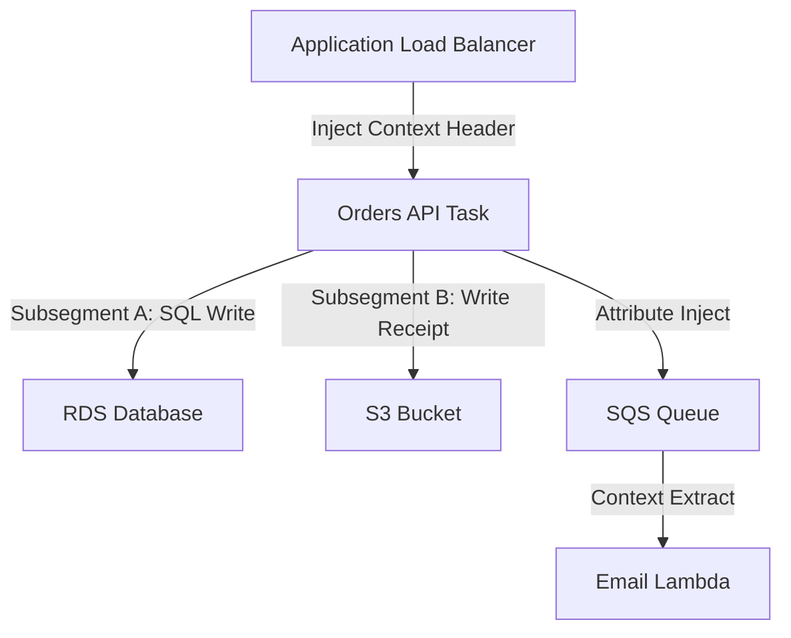

## Table of Contents

1. [The Distributed Silent Wait](#the-distributed-silent-wait)
2. [Correlation IDs vs. Distributed Tracing](#correlation-ids-vs-distributed-tracing)
3. [Trace Context Propagation](#trace-context-propagation)
4. [Spans: Segments and Subsegments](#spans-segments-and-subsegments)
5. [OpenTelemetry: The Industry Standard](#opentelemetry-the-industry-standard)
6. [Tracing Across Asynchronous Queue Boundaries](#tracing-across-asynchronous-queue-boundaries)
7. [Under-the-Hood: Thread-Local State Mechanics](#under-the-hood-thread-local-state-mechanics)
8. [Visualizing Topologies: X-Ray Service Maps](#visualizing-topologies-x-ray-service-maps)
9. [Connecting Traces Directly to Logs](#connecting-traces-directly-to-logs)
10. [Dynamic Trace Sampling and Cost Controls](#dynamic-trace-sampling-and-cost-controls)
11. [Putting It All Together](#putting-it-all-together)

## The Distributed Silent Wait

When an application executes entirely on a local machine, identifying a slow transaction is straightforward. Since every function call, database query, and filesystem operation occurs within a single process on a single workstation, you can run a local debugger or analyze standard timestamp print logs to find the bottleneck.

In a distributed cloud environment, this simplicity is completely lost. Imagine a customer who clicks the checkout button and waits a painful eight seconds before their browser times out with a generic network error. Responders check the telemetry systems, but the independent metrics and log groups report standard operational health:

* The Application Load Balancer metrics show a successful request handoff to the backend API.
* The containerized orders API logs report that checkout processing started, followed eight seconds later by a database write abort.
* The RDS database metrics show a brief, harmless CPU utilization blip, with no record of slow, active queries.
* The SQS queue buffers jobs successfully, and the downstream serverless worker tasks execute without error.

Every isolated team inspects their own charts and text files, declares their system healthy, and blames adjacent services. Because request timing data is siloed behind network boundaries, the source of the 8-second delay remains a mystery. To locate bottlenecks in a distributed cloud environment, you must establish a system that traces the complete, end-to-end journey of a single request as it hops across network borders.

## Correlation IDs vs. Distributed Tracing

To bridge this operational disconnect, you must establish request correlation. Responders use two progressive techniques to track requests:

Request correlation is the practice of carrying one transaction identity across service boundaries. A correlation ID makes logs searchable across components; distributed tracing extends that identity into a timed dependency graph.

* **Correlation ID**: A unique, non-meaningful string (such as a UUID generated at your entry network gateway). This ID is injected into the incoming request context and passed as a header to every downstream service. Standardizing on correlation IDs ensures that an operator can search a centralized log manager for a specific ID and read the entire transaction history chronologically, regardless of which container or task wrote the log lines.
* **Distributed Tracing**: An advanced, standardized extension of correlation IDs. While a correlation ID connects text log lines, distributed tracing records the exact start times, end times, parent-child relationships, and network boundaries crossed by a request. It maps the request path as an active call tree, measuring not just *what* events occurred, but exactly *where* latency was introduced.



By transitioning from simple correlation strings to active distributed tracing, you transform isolated, disjointed log files into a cohesive visual timeline that exposes the exact origin of latency and errors.

## Trace Context Propagation

Distributed tracing is made possible by context propagation. Trace context is a small set of identifiers carried in request headers or message attributes so each downstream service can attach its work to the same transaction graph. If a single service fails to propagate the context header, the tracing chain breaks, resulting in disconnected single-hop fragments instead of a single, continuous end-to-end trace.

In the AWS ecosystem, trace context is propagated using the custom `X-Amzn-Trace-Id` HTTP header. The header contains three key attributes separated by semicolons:

```http
X-Amzn-Trace-Id: Root=1-5759e988-bd862e3fe1be46a994272793;Parent=53995c3f42cd8ad8;Sampled=1
```

Let us break down each parameter value in place:

* `Root`: The globally unique identifier representing the entire distributed transaction. The format consists of a version number (`1`), followed by a 32-bit epoch timestamp in hexadecimal, and a 96-bit unique identifier.
* `Parent`: The unique identifier of the specific segment or service boundary that initiated the current outbound operation.
* `Sampled`: A binary flag (`1` for sampled, `0` for unsampled) indicating whether downstream services must collect and publish timing telemetry for this transaction.

For tracing to succeed across a microservice fleet, every HTTP client and message publisher must be configured to automatically intercept, parse, and inject trace context on outbound boundaries that can carry it. Database calls are slightly different: most SQL protocols do not carry X-Ray headers to the database engine. Instead, tracing libraries create spans or subsegments around the database call so the trace records query timing without pretending the database received an HTTP-style trace header.

## Spans: Segments and Subsegments

A distributed trace is structurally modeled as a directed acyclic graph of spans. A span is a single, named unit of work containing a start time, an end time, parent-child relationships, and metadata attributes. AWS X-Ray categorizes spans into two distinct structural types:

A span is the timing record for one unit of work. Segments and subsegments are AWS X-Ray's names for service-level spans and nested dependency-call spans.

* **Segment**: Represents the overall execution boundary of a single service component (such as the orders API or the email worker). The segment captures the service's internal startup latencies, guest OS overhead, and total network duration.
* **Subsegment**: Represents isolated blocks of work *within* that service segment. You use subsegments to isolate external database queries (e.g., measuring an RDS SQL query duration), S3 bucket API writes, or third-party payment gateway SDK calls.

By wrapping downstream database and storage calls in dedicated subsegments, you can pinpoint the exact block of code causing a delay. If the overall orders API segment took 2.5 seconds, subsegments instantly reveal that 2.2 seconds were spent waiting for a specific S3 object write, while the RDS SQL commit took only 40 milliseconds.

Trace Timing Distribution:

| Component Name | Span Type | Parent Span ID | Start Offset | Duration (ms) | Execution Status |
| :--- | :--- | :--- | :--- | :--- | :--- |
| **Orders API** | Segment | None (Root) | 0 ms | 2,500 ms | Succeeded (HTTP 200) |
| **Postgres Write** | Subsegment | Orders API ID | 10 ms | 40 ms | Succeeded |
| **Receipt S3 PUT** | Subsegment | Orders API ID | 60 ms | 2,200 ms | Succeeded |
| **SQS Publish** | Subsegment | Orders API ID | 2,280 ms | 20 ms | Succeeded |

## OpenTelemetry: The Industry Standard

When instrumenting your applications for distributed tracing, you must select the appropriate SDK and telemetry standard:

OpenTelemetry functions as the common instrumentation API and data model for traces, metrics, and logs. It lets application code produce telemetry once and export it to AWS X-Ray or other compatible backends through collectors and exporters.

* **The Maintenance Stance (Older X-Ray SDKs)**: The legacy AWS X-Ray SDKs and the host X-Ray daemon entered official maintenance mode on February 25, 2026. AWS strongly advises against using these older libraries for new application deployments.
* **The Forward-Looking Standard (OpenTelemetry)**: OpenTelemetry (OTel) is the open-source, vendor-neutral industry standard for instrumenting, collecting, and exporting traces, metrics, and logs. AWS distributes the AWS Distro for OpenTelemetry (ADOT), which is a secure, production-grade distribution of the OTel SDK and collector optimized for AWS systems.

To instrument an application using OpenTelemetry, you import the OTel API and configure the tracer provider. Below is a simplified Node.js initialization block that shows the moving parts. Production services usually add resource attributes, error handling, batching, and deployment-specific collector configuration.

```javascript
import { NodeTracerProvider } from '@opentelemetry/sdk-trace-node';
import { BatchSpanProcessor } from '@opentelemetry/sdk-trace-base';
import { OTLPTraceExporter } from '@opentelemetry/exporter-trace-otlp-grpc';
import { registerInstrumentations } from '@opentelemetry/instrumentation';
import { HttpInstrumentation } from '@opentelemetry/instrumentation-http';
import { AWSXRayPropagator } from '@opentelemetry/propagator-aws-xray';
import { AWSXRayIdGenerator } from '@opentelemetry/id-generator-aws-xray';

const provider = new NodeTracerProvider({
  idGenerator: new AWSXRayIdGenerator(),
});

provider.addSpanProcessor(
  new BatchSpanProcessor(new OTLPTraceExporter({ url: 'http://localhost:4317' }))
);

provider.register({
  propagator: new AWSXRayPropagator(),
});

registerInstrumentations({
  instrumentations: [new HttpInstrumentation()],
  tracerProvider: provider,
});
```

This configuration initializes the tracing environment step-by-step:

* `AWSXRayIdGenerator`: Enforces the strict X-Ray trace ID format, allowing timing data to correlate inside AWS systems.
* `BatchSpanProcessor` & `OTLPTraceExporter`: Batches in-memory timing data and ships it over high-performance gRPC (port 4317) to a local OpenTelemetry Collector daemon.
* `AWSXRayPropagator`: Configures the global propagation runner to parse and inject the `X-Amzn-Trace-Id` HTTP headers.
* `registerInstrumentations`: Automatically hooks into the built-in HTTP module, capturing and propagating context across all incoming and outgoing network calls.

## Tracing Across Asynchronous Queue Boundaries

Asynchronous messaging queues (like SQS) break the synchronous HTTP request-response path. The producer publishes a message and exits immediately; the message may sit in the queue for several seconds or minutes before a worker consumes it.

An asynchronous queue boundary separates producer timing from consumer timing. To keep the trace connected, the producer must write the trace context into message metadata and the consumer must extract it before starting its own span.

To prevent the trace from breaking at these asynchronous boundaries, you must configure trace context injection and extraction:

* **In SQS Messages**: You send the trace header as the SQS system attribute named `AWSTraceHeader`, rather than burying it inside the message body. When the consumer polls the queue, instrumentation can extract the trace ID from the envelope, continue the parent trace, and create a new consumer segment.
* **In EventBridge Events**: EventBridge `PutEvents` entries can carry a trace header for X-Ray-aware flows. For consumers or targets that do not preserve tracing automatically, include a separate application correlation ID in the event detail so logs and workflows can still be joined.

Let us write a Python script demonstrating how to publish a message into an SQS queue with the active trace context attribute:

```python
import boto3
from opentelemetry import trace
from opentelemetry.propagators.aws.xray_propagator import TRACE_HEADER_KEY

sqs = boto3.client('sqs')
tracer = trace.get_tracer(__name__)

with tracer.start_as_current_span("PublishToQueue") as span:
    current_context = trace.get_current_span().get_span_context()
    trace_id = format(current_context.trace_id, '032x')
    span_id = format(current_context.span_id, '016x')
    sampled = "1" if current_context.trace_flags.sampled else "0"
    
    trace_header = f"Root=1-{trace_id[:8]}-{trace_id[8:]};Parent={span_id};Sampled={sampled}"

    sqs.send_message(
        QueueUrl='https://sqs.us-east-1.amazonaws.com/123456789012/NotificationQueue',
        MessageBody='{"orderId": "order-1042"}',
        MessageSystemAttributes={
            'AWSTraceHeader': {
                'DataType': 'String',
                'StringValue': trace_header
            }
        }
    )
```

This script ensures the distributed tracing chain is preserved:

1. `trace.get_current_span().get_span_context()`: Extracts the active tracing identifiers from the runtime memory.
2. `trace_header`: Constructs a valid `X-Amzn-Trace-Id` string, mapping hex-encoded parameters.
3. `AWSTraceHeader`: Ships the trace header explicitly inside the SQS system attributes, allowing background workers to parse the attribute and continue the transaction path.


*A trace survives only when each boundary carries or records the context correctly. HTTP calls pass headers, database calls become timed spans, queues need message attributes, and logs should include the same trace ID.*

## Under-the-Hood: Thread-Local State Mechanics

For distributed tracing to work without requiring developers to pass tracing identifiers through every function signature, OTel SDKs rely on thread-local storage or asynchronous context mechanics in runtime engines.

Thread-local or async-local state is the runtime storage mechanism for the active trace context. It lets instrumentation libraries find the current transaction identity when code makes outbound HTTP calls, SQS publishes, or database queries.

When an application receives an incoming request, the OTel parser intercepts the HTTP headers, extracts the trace context, and mounts it into the thread's execution namespace (such as Python's `threading.local()` or Java's `ThreadLocal`). In single-threaded, asynchronous runtimes like Node.js, the SDK mounts the context into an `AsyncLocalStorage` boundary. 

Whenever the application code makes a downstream HTTP call or publishes an SQS message, the SDK hooks into the runtime libraries. It silently queries the active thread-local storage, retrieves the running trace ID, and injects the proper correlation context into the outgoing request or message metadata. For database queries, the SDK usually records a child span around the call rather than injecting a trace header into the database protocol. If your application code spins up background threads manually without copying this thread-local context, the tracing chain immediately drops, isolating the downstream spans into disconnected traces.

## Visualizing Topologies: X-Ray Service Maps

Once your microservice fleet is instrumented with OpenTelemetry, AWS X-Ray aggregates the span data to generate an interactive, real-time Service Map. The service map automatically renders your entire architecture as a node topology. Each service component (ALB, container task, database, queue) is represented as a node, and request flows are rendered as edges:

An X-Ray service map is a topology view derived from trace spans. It summarizes which services call each other, how often those calls fail, and where latency appears along the dependency graph.

* **Dynamic Traffic Coloring**: Nodes are visually colored to represent execution success (green for `2xx` responses, red for `5xx` errors, yellow for `4xx` client errors, and purple for throttles).
* **Latency Percentiles**: Edges display the latency percentiles (such as p50, p90, and p95) between service calls, allowing you to instantly isolate where network delay is introduced.

During a cascading outage, the service map is an invaluable tool. It allows you to ignore healthy nodes and instantly locate the specific downstream database or third-party API gateway that has turned red and is propagating latency up the call chain.

## Connecting Traces Directly to Logs

Tracing tells you which service is slow, but it cannot replace the granular error stack traces held in your log files. To create a seamless debugging workflow, you must connect your traces directly to your structured JSON logs.

Trace-to-log correlation is a shared identifier strategy. Every log event should include the active trace ID and span ID so a slow trace can lead directly to the exact structured logs for that transaction.

You achieve this by configuring your application logging framework to automatically inject the active X-Ray `TraceId` and `SpanId` into every JSON log line:

```json
{
  "timestamp": "2026-05-25T22:53:15.042Z",
  "level": "ERROR",
  "traceId": "1-5759e988-bd862e3fe1be46a994272793",
  "spanId": "53995c3f42cd8ad8",
  "service": "orders-api",
  "message": "checkout failed due to RDS database connection timeout"
}
```

By linking trace IDs to structured logs, tools like CloudWatch ServiceLens enable trace-to-log mapping. When viewing a slow, failed trace segment in the console, you can click a button to instantly pull the exact stdout log lines written by that specific container task during that specific transaction millisecond, eliminating manual search operations.

## Dynamic Trace Sampling and Cost Controls

Tracing every single request in a high-volume production environment is a major cost and network overhead trap. If your API handles millions of requests daily, collecting trace spans for 100% of successful transactions generates massive telemetry storage fees and consumes excessive network bandwidth.

Trace sampling is the selection policy that decides which request graphs are stored. It preserves the traces most useful for diagnosis, such as errors and high latency, while reducing the cost of routine successful traffic.

To balance visibility against cost, you must implement dynamic sampling rules inside your OpenTelemetry Collector (`collector.yaml`) daemon:

```yaml
processors:
  tail_sampling:
    decision_wait: 10s
    num_traces: 10000
    expected_new_traces_per_sec: 2000
    policies:
      [
        {
          name: filter_errors,
          type: status_code,
          status_code: {status_codes: [ERROR]}
        },
        {
          name: filter_5xx,
          type: numeric_attribute,
          numeric_attribute: {key: "http.status_code", value_condition: {greater_than_or_equal: 500}}
        },
        {
          name: sample_success,
          type: probabilistic,
          probabilistic: {sampling_percentage: 5.0}
        }
      ]
```

This configuration applies tail-based sampling, evaluating the full trace before making a storage decision:

* `decision_wait`: Buffers trace timing spans for ten seconds in memory, allowing all microservice hops to check in before evaluating rules.
* `filter_errors` & `filter_5xx`: Keeps traces that report an error status or an HTTP 5xx response.
* `sample_success`: Discards 95% of healthy, rapid transactions, keeping a small 5% baseline sample to measure operational latencies.

This hybrid sampling approach greatly improves the chance that critical failures are preserved while saving your cloud storage budget by discarding many redundant traces of successful checkouts. It is still not a mathematical guarantee. Instrumentation gaps, collector overload, or unsupported async boundaries can lose trace detail, so logs and metrics must remain part of the incident evidence path.

## Putting It All Together

Request correlation is the final layer that transforms disconnected cloud telemetry into a transparent, self-healing architecture:

* **Generate Context at the Edge**: Ingress gateways must generate a unique trace ID and inject the `X-Amzn-Trace-Id` header at the ingress boundary.
* **Enforce Propagators**: Configure HTTP clients and message queue publishers to parse and propagate trace context across boundaries that support it, and instrument database clients as timed spans.
* **Default to OpenTelemetry Standards**: Use the AWS Distro for OpenTelemetry (ADOT) as your default instrumentation framework, avoiding legacy X-Ray SDK libraries.
* **Isolate Queries via Subsegments**: Map complex database writes and third-party APIs to dedicated subsegments to pinpoint exact bottlenecks.
* **Link Traces to Structured Logs**: Automatically inject active trace IDs into JSON log events to enable instant trace-to-log navigation during incidents.
* **Control Budgets with Sampling Rules**: Default to a conservative 5% baseline sampling rate, and dynamically elevate to 100% for error states and high-latency transactions.


*Use this as the tracing checklist: create one trace identity, propagate it across supported boundaries, model work as spans, preserve async context, write trace IDs into logs, and sample healthy traffic while keeping failures.*

---

**References**

* [AWS X-Ray Concepts](https://docs.aws.amazon.com/xray/latest/devguide/xray-concepts.html) - AWS technical reference for traces, segments, subsegments, and propagation headers.
* [X-Ray to OpenTelemetry Migration Guide](https://docs.aws.amazon.com/xray/latest/devguide/xray-sdk-migration.html) - Official instructions on migrating application instrumentation to portable OpenTelemetry SDKs.
* [AWS Distro for OpenTelemetry (ADOT)](https://docs.aws.amazon.com/AmazonCloudWatch/latest/monitoring/CloudWatch-OpenTelemetry-Sections.html) - Production-grade documentation on deploying OTel collectors on AWS.
* [OpenTelemetry batch span processor](https://opentelemetry.io/docs/specs/otel/trace/sdk/#batching-processor) - Explains why production tracing usually batches spans before export.
* [CloudWatch ServiceLens Integration](https://docs.aws.amazon.com/AmazonCloudWatch/latest/monitoring/ServiceLens.html) - Guide on correlating time-series metrics, trace service maps, and structured JSON logs.
