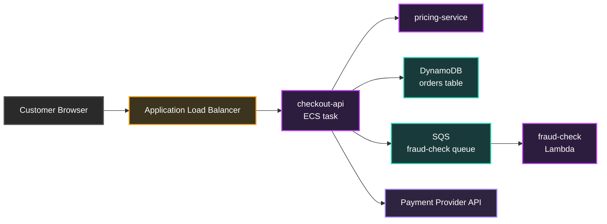
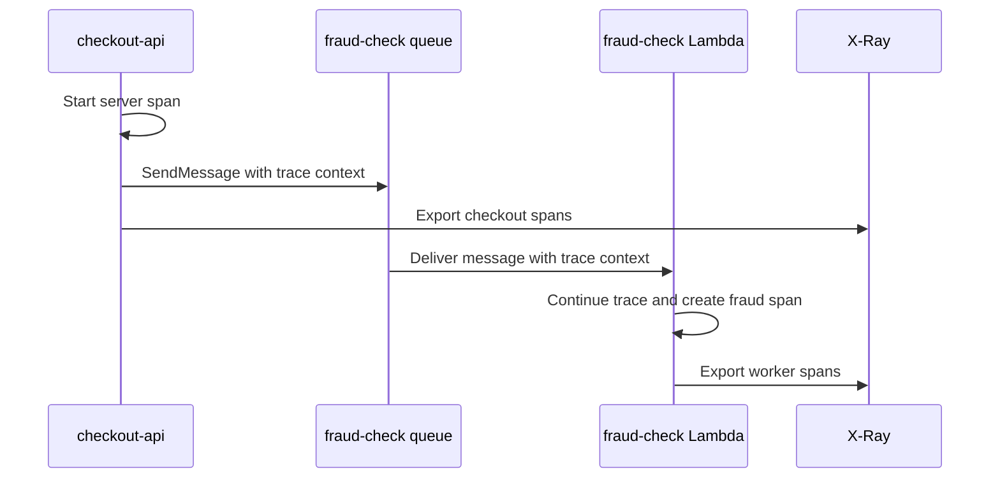
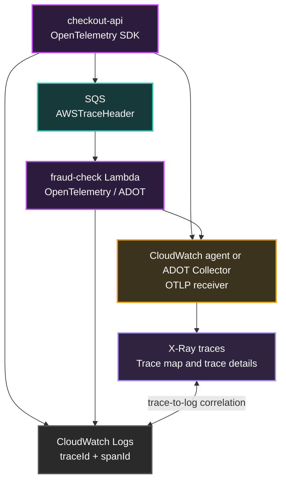

## Table of Contents

1. [The Request That Crosses Too Many Rooms](#the-request-that-crosses-too-many-rooms)
2. [What X-Ray Shows](#what-x-ray-shows)
3. [OpenTelemetry Is the Current Instrumentation Path](#opentelemetry-is-the-current-instrumentation-path)
4. [Trace Context Propagation](#trace-context-propagation)
5. [Spans, Segments, and Subsegments](#spans-segments-and-subsegments)
6. [Sending Traces with ADOT and the CloudWatch Agent](#sending-traces-with-adot-and-the-cloudwatch-agent)
7. [Tracing Queues and Event-Driven Work](#tracing-queues-and-event-driven-work)
8. [Trace-to-Log Correlation](#trace-to-log-correlation)
9. [Sampling and Cost Control](#sampling-and-cost-control)
10. [Migrating Existing X-Ray SDK Code](#migrating-existing-x-ray-sdk-code)
11. [Putting It All Together](#putting-it-all-together)
12. [What's Next](#whats-next)

## The Request That Crosses Too Many Rooms
<!-- section-summary: Logs show what each service wrote, while tracing follows one request across every service that helped serve it. -->

The checkout alarm is still fresh. In the previous article, the team found JSON logs for failed payment requests and learned how to query them in CloudWatch Logs Insights. That answered the first question: which service wrote the error and what did it say?

Now the incident channel asks a larger question. A customer request hit the Application Load Balancer, reached the checkout API, called a pricing service, wrote to DynamoDB, sent a message to SQS, triggered a Lambda fraud-check function, and waited on an external payment provider. Every piece has its own logs, but the customer experienced one slow checkout.

**Distributed tracing** connects those pieces. A trace follows one request as it moves through services and records timed units of work along the way. Instead of opening five log groups and trying to line up timestamps by hand, the team can see the request path, the slow dependency, the service that returned an error, and the logs attached to the trace.

In AWS, the main tracing backend is **AWS X-Ray**, and the current instrumentation direction is **OpenTelemetry**, often through **AWS Distro for OpenTelemetry**, or ADOT. X-Ray stores and visualizes trace data. OpenTelemetry gives the application and collector pipeline a standard way to create and send that trace data.

## What X-Ray Shows
<!-- section-summary: X-Ray receives trace data and turns it into request details, service maps, errors, latency, annotations, and searchable trace summaries. -->

**AWS X-Ray** is a service that collects data about requests served by an application and gives teams tools to view, filter, and investigate that data. For one traced checkout request, X-Ray can show the incoming request, the response, and the downstream calls the application made to AWS services, internal microservices, databases, and web APIs.

A **trace** is the full record for one request. In the checkout example, one trace may start at API Gateway or an Application Load Balancer, pass through the checkout API, include an AWS SDK call to DynamoDB, include an SQS send, and continue into a Lambda consumer. The trace gives responders a single path through the distributed system.

X-Ray builds a **trace map** from those traces. A trace map is a service graph showing clients, services, and downstream dependencies as nodes, with request edges between them. The map helps the team spot services with errors, high latency, throttling, or unusual request paths.



X-Ray also records useful labels. **Annotations** are indexed key-value pairs that you can use for filtering and grouping traces. **Metadata** stores extra key-value data that appears in trace details and stays outside search indexes. For checkout, `tenantTier`, `paymentProvider`, and `route` are good annotation candidates, while a large provider response body belongs in logs or metadata after sensitive fields are removed.

X-Ray categorizes problems in a way that matches HTTP and service behavior. `Error` covers client-side 4xx responses, `Fault` covers server-side 5xx responses, and `Throttle` covers throttling responses such as 429. During the checkout incident, that distinction helps the team separate bad customer input from provider failure or account-level throttling.

A responder can ask X-Ray for trace summaries during the same alarm window:

```bash
aws xray get-trace-summaries \
  --start-time 2026-06-13T10:10:00Z \
  --end-time 2026-06-13T10:20:00Z \
  --filter-expression 'service("checkout-api") { fault = true OR error = true OR responsetime > 2 }' \
  --query 'TraceSummaries[].{Id:Id,Duration:Duration,ResponseTime:ResponseTime,HasFault:HasFault,HasError:HasError}'
```

Example output:

```json
[
  {
    "Id": "1-666c182a-4f7d9b2e9a1d5c67b8142a10",
    "Duration": 8.48,
    "ResponseTime": 8.48,
    "HasFault": true,
    "HasError": false
  },
  {
    "Id": "1-666c1840-9d1f0b6c5e3a2c8a11d7f901",
    "Duration": 7.91,
    "ResponseTime": 7.91,
    "HasFault": true,
    "HasError": false
  }
]
```

The filter asks for checkout traces that had a fault, an error, or a response time above two seconds. `Duration` and `ResponseTime` are seconds in this output, so both traces represent slow customer requests. `HasFault: true` points toward a server-side failure path that deserves log and span inspection.

## OpenTelemetry Is the Current Instrumentation Path
<!-- section-summary: AWS now points new and migrated tracing work toward OpenTelemetry, with ADOT and the CloudWatch agent as AWS-supported implementation paths. -->

**Instrumentation** is the code or runtime setup that creates telemetry. For tracing, instrumentation starts spans for incoming requests, HTTP calls, AWS SDK calls, database calls, queue work, and custom business steps. Without instrumentation, X-Ray has no detailed request path to show.

For years, many AWS applications used the X-Ray SDK and X-Ray daemon. The SDK created X-Ray segments and subsegments inside the application, then sent segment documents to the daemon over UDP. The daemon buffered those documents and uploaded them to X-Ray.

AWS has changed its guidance. The X-Ray SDKs and daemon entered maintenance mode on **February 25, 2026**, and AWS limits those releases to security fixes. AWS recommends migrating to OpenTelemetry solutions for application instrumentation and sending traces to X-Ray.

**OpenTelemetry** is an industry-standard observability framework for traces, metrics, and logs. It gives application teams standard APIs, SDKs, auto-instrumentation agents, and collectors. The same instrumented service can send telemetry to AWS services and, if needed later, to another compatible backend without rewriting every application span.

**AWS Distro for OpenTelemetry**, or **ADOT**, is the AWS-supported distribution of OpenTelemetry components. AWS tests, secures, optimizes, and supports the distribution for AWS use cases. With ADOT, a team can instrument once and send correlated metrics and traces to CloudWatch, X-Ray, Amazon OpenSearch Service, or Amazon Managed Service for Prometheus.

This is the practical default for a new checkout service. Use OpenTelemetry instrumentation in the application, use ADOT or the CloudWatch agent to receive and export the spans, and view the resulting traces in CloudWatch and X-Ray experiences. Existing X-Ray SDK applications can migrate in phases, which we will cover later in the article.

For a beginner, separate the tracing pipeline into jobs:

| Piece | Job in the checkout service |
|---|---|
| OpenTelemetry API | Gives application code a standard way to create spans |
| OpenTelemetry SDK or auto-instrumentation | Starts spans for HTTP, AWS SDK, database, and custom work |
| Propagator | Reads and writes trace context in headers or messages |
| Collector, ADOT, or CloudWatch agent | Receives spans from the app and exports them to AWS |
| X-Ray-backed CloudWatch views | Store, filter, and visualize the request path |

The SDK runs with the application and knows what the code is doing. The collector or agent runs beside the application or on the host and moves telemetry to the backend. Keeping those roles separate helps during troubleshooting because a missing trace can come from code instrumentation, context propagation, collector reachability, IAM permission, sampling, or backend ingestion.

## Trace Context Propagation
<!-- section-summary: Trace context is the request identity that travels across HTTP, AWS SDK calls, queues, and function boundaries so separate spans join one trace. -->

**Trace context** is the small identity package that travels with a request. It carries the trace ID, the current parent span or segment ID, and the sampling decision. Each service reads the incoming context, records its own work, and passes updated context to the next service.

AWS X-Ray uses the `X-Amzn-Trace-Id` HTTP header. A header can include a root trace ID, a parent ID, and a sampled flag. The root ID keeps all services on the same trace, the parent ID connects one service's work to the caller, and `Sampled=1` tells downstream services that this request is being recorded.

```http
X-Amzn-Trace-Id: Root=1-666c182a-4f7d9b2e9a1d5c67b8142a10;Parent=53995c3f42cd8ad8;Sampled=1
```

OpenTelemetry commonly uses W3C Trace Context, and AWS also supports X-Ray trace context propagation. AWS migration guidance says OpenTelemetry can use multiple propagation formats, including W3C and the X-Ray trace header. For AWS-integrated services, the AWS X-Ray propagator helps keep trace context compatible with services that understand X-Ray headers.

Here is the boundary behavior in the checkout flow. The load balancer or first instrumented service creates or receives trace context. The checkout API reads it, records the server span, and injects context into outbound HTTP calls. The AWS SDK instrumentation carries context into supported AWS service calls where available, and SQS can carry the X-Ray trace header in the `AWSTraceHeader` system attribute.

There is also a security habit here. AWS documentation notes that a trace header can come from a client request, an AWS service, or an SDK. Applications at public trust boundaries can remove or replace incoming `X-Amzn-Trace-Id` values so outside callers cannot force confusing trace IDs or sampling decisions into the internal system.


*The trace header acts like the request identity. Each service keeps the same story going by reading the incoming context and sending context to the next hop.*


## Spans, Segments, and Subsegments
<!-- section-summary: OpenTelemetry records spans, and X-Ray displays those records as segments and subsegments that show service work and dependency calls. -->

A **span** is one timed unit of work in a trace. It has a name, a start time, an end time, a parent relationship, a status, and attributes. In checkout, `POST /checkout`, `DynamoDB PutItem`, `SQS SendMessage`, and `PaymentProvider Authorize` can each be spans.

X-Ray uses older terms that map to the same shape. A **segment** is the service-level record for work done by one application or resource. A **subsegment** is nested work inside that segment, such as an HTTP client call, an AWS SDK call, or a database query. AWS migration docs map both segment and subsegment to OpenTelemetry spans.

| Production question | OpenTelemetry term | X-Ray term | Checkout example |
|---|---|---|---|
| Which service handled the request? | Server span | Segment | `checkout-api POST /checkout` |
| Which dependency was slow? | Client span | Subsegment | `PaymentProvider Authorize` |
| Which AWS call happened? | Instrumented span | Subsegment | `DynamoDB PutItem` |
| Which field should be searchable? | Span attribute selected as annotation | Annotation | `paymentProvider=acme-pay` |
| Which extra detail helps in one trace view? | Span attribute or event | Metadata | Provider retry details |

This is where naming discipline matters. Span names should describe stable operations, such as `POST /checkout` or `DynamoDB PutItem`, rather than unique customer IDs or full URLs with IDs inside them. High-cardinality operation names create noisy maps and make latency trends harder to compare.

Attributes need the same care. A few searchable business labels can help a lot, such as `environment=prod`, `service.name=checkout-api`, `paymentProvider=acme-pay`, and `tenantTier=enterprise`. Sensitive data, full tokens, card data, and raw customer identifiers should stay out of trace attributes because traces are shared across observability workflows.

## Sending Traces with ADOT and the CloudWatch Agent
<!-- section-summary: A current AWS tracing pipeline uses OpenTelemetry instrumentation in the app and either the CloudWatch agent or an OpenTelemetry collector to send spans to CloudWatch and X-Ray. -->

The production pipeline has two moving parts. The application creates spans through an OpenTelemetry SDK or auto-instrumentation agent. A local or sidecar collector receives those spans over OTLP and exports them to AWS.

**OTLP**, the OpenTelemetry Protocol, is the standard protocol for sending telemetry from instrumented applications to a collector or backend. The CloudWatch agent can listen for OTLP metrics and traces. For traces, the agent can receive OTLP on default local endpoints and send the data to X-Ray.

```json
{
  "traces": {
    "traces_collected": {
      "otlp": {
        "grpc_endpoint": "127.0.0.1:4317",
        "http_endpoint": "127.0.0.1:4318"
      }
    }
  }
}
```

This config tells the agent to receive OTLP traces over gRPC on port `4317` and HTTP on port `4318`. For containerized environments, the endpoint often needs to be reachable from another container or task. AWS documentation notes that `0.0.0.0` is appropriate when telemetry comes from outside the agent container's network namespace. That detail prevents a quiet failure where the app sends spans to a port the agent listens on only inside its own container.

AWS also documents a newer CloudWatch agent path built on the OpenTelemetry Collector. In that model, you append OpenTelemetry YAML to the CloudWatch agent configuration and send telemetry to CloudWatch OTLP endpoints with SigV4 authentication. AWS describes the CloudWatch agent as the recommended path for most customers sending OpenTelemetry telemetry to CloudWatch because one agent can also power curated CloudWatch experiences such as Application Signals and Enhanced Container Insights.

For a Node.js service migrating from X-Ray SDK instrumentation, AWS migration docs show a setup with an OTLP trace exporter, an AWS X-Ray propagator, and AWS resource detectors. The app starts with the instrumentation file loaded before application code so HTTP and AWS SDK libraries can be hooked early.

```bash
npm install --save \
  @opentelemetry/api \
  @opentelemetry/sdk-node \
  @opentelemetry/exporter-trace-otlp-proto \
  @opentelemetry/propagator-aws-xray \
  @opentelemetry/resource-detector-aws
```

`npm install --save` adds these packages to the application dependency list. This installs the OpenTelemetry API, the Node SDK, an OTLP trace exporter, X-Ray trace propagation, and AWS resource detectors. The important operational detail is startup order: load the instrumentation file before the main app so HTTP clients, servers, and AWS SDK calls can be wrapped before they start handling requests.

```javascript
const { NodeSDK } = require("@opentelemetry/sdk-node");
const { OTLPTraceExporter } = require("@opentelemetry/exporter-trace-otlp-proto");
const { AWSXRayPropagator } = require("@opentelemetry/propagator-aws-xray");
const { detectResources } = require("@opentelemetry/resources");
const { awsEc2Detector } = require("@opentelemetry/resource-detector-aws");

const resource = detectResources({
  detectors: [awsEc2Detector]
});

const traceExporter = new OTLPTraceExporter({
  url: "http://localhost:4318/v1/traces"
});

const sdk = new NodeSDK({
  resource,
  textMapPropagator: new AWSXRayPropagator(),
  traceExporter
});

sdk.start();
```

```bash
node --require ./instrumentation.js app.js
```

`--require ./instrumentation.js` loads instrumentation before `app.js`, which lets the SDK patch libraries before the service starts handling traffic.

The same shape applies in other languages. The names change, but the pieces stay familiar: OpenTelemetry SDK, resource detection, propagation, exporter, and collector or CloudWatch agent. The team verifies success in CloudWatch by checking trace maps, trace details, and the service views that use X-Ray trace data.


*The pipeline shows the modern AWS tracing path. Applications emit OpenTelemetry data, and AWS-supported agents or collectors deliver it into CloudWatch and X-Ray views.*


## Tracing Queues and Event-Driven Work
<!-- section-summary: Async systems need explicit context handoff because the request leaves HTTP and waits in a queue before another service continues the work. -->

HTTP request tracing is direct because headers travel with the request. Event-driven systems need more attention because the work pauses in a queue, topic, or event bus before another runtime continues it. The trace still needs a way to carry context from producer to consumer.

Amazon SQS integrates with X-Ray tracing through the `AWSTraceHeader` message system attribute. When a traced producer sends a message, SQS can carry the X-Ray trace header so the consumer can continue the same trace. AWS documentation also states that Lambda downstream consumers can receive trace context automatically, while other consumers may need manual instrumentation to recover and continue the context.

Here is the checkout flow. The checkout API receives the customer request and sends a fraud-check message to SQS. The message includes trace context. A Lambda function consumes the message, creates a new span for the fraud decision, and the trace map can show the queue and consumer instead of treating the worker as a separate mystery.



For EventBridge and SNS flows, the same principle applies. AWS services have different levels of X-Ray integration, and some can propagate trace headers while others require application-level correlation. A durable business correlation ID, such as `checkoutId`, still helps humans join logs and events even if a downstream system cannot carry trace context perfectly.

The practical rule is simple to implement during design. Every async boundary should answer two questions: where does trace context travel, and what stable business ID appears in logs and events? The trace gives timing and topology, while the business ID gives a fallback path for messages that fan out or cross systems with different tracing support.

## Trace-to-Log Correlation
<!-- section-summary: Trace-to-log correlation puts trace IDs and span IDs into application logs so a slow span can open the exact log lines written during the same request. -->

Tracing and logging work best together. A trace can show that `PaymentProvider Authorize` took eight seconds and returned a fault. Logs can show the provider error code, retry attempt, feature flag, and sanitized response details.

**Trace-to-log correlation** means application logs include trace identity, usually a trace ID and span ID. CloudWatch Application Signals can enable trace-to-log correlation and automatically inject trace IDs and span IDs into relevant application logs when the required OpenTelemetry logging instrumentation is configured. Then a trace detail page can show matching log entries near the trace.

For the checkout API, the log line should carry both the operational fields from the previous article and the active trace fields from the current span. That gives responders two directions of travel: from a trace to logs, and from a log query back to the trace.

```json
{
  "timestamp": "2026-06-13T10:15:22.481Z",
  "level": "ERROR",
  "service": "checkout-api",
  "environment": "prod",
  "requestId": "req-7f3a8c",
  "traceId": "1-666c182a-4f7d9b2e9a1d5c67b8142a10",
  "spanId": "53995c3f42cd8ad8",
  "route": "POST /checkout",
  "errorType": "PaymentGatewayTimeout",
  "message": "Payment authorization timed out after provider retry"
}
```

The logs stay in CloudWatch Logs, and the traces stay in X-Ray-backed CloudWatch views. The shared IDs are the bridge. A Logs Insights query can find `traceId`, while a trace detail page can point back to logs from the same request.

When a responder starts from a log line, they can use the trace ID to ask X-Ray for the trace document:

```bash
aws xray batch-get-traces \
  --trace-ids 1-666c182a-4f7d9b2e9a1d5c67b8142a10 \
  --query 'Traces[].{TraceId:Id,Duration:Duration,SegmentCount:length(Segments)}'
```

Example output:

```json
[
  {
    "TraceId": "1-666c182a-4f7d9b2e9a1d5c67b8142a10",
    "Duration": 8.48,
    "SegmentCount": 5
  }
]
```

This readback confirms the trace exists and has five segment documents attached. If the count is lower than expected, the team checks instrumentation and context propagation on the missing service boundary. To inspect raw segment documents, remove the `--query` filter or change it to return `Segments[].Document`. Those documents are verbose, but they help when the console view hides a detail the team needs, such as a downstream fault flag, annotation, or service name. In normal incidents, the console trace map and trace detail page are easier to read. The CLI is useful for automation, evidence capture, and comparing one trace with another.

This also improves incident communication. Instead of pasting five unrelated screenshots into a chat channel, one responder can share a trace ID and a Logs Insights query. The team gets one request story with service timing, downstream calls, and exact log evidence.

## Sampling and Cost Control
<!-- section-summary: Sampling records a representative set of traces, with higher coverage for important paths and lower coverage for high-volume routine traffic. -->

**Sampling** is the decision to record some traces and skip others. A production system may handle thousands of requests per second, and recording every span for every request can increase cost and noise. Sampling keeps enough evidence to understand behavior while controlling volume.

X-Ray sampling rules use two important knobs. The **reservoir** records a fixed number of matching requests per second before applying the rate. The **fixed rate** records a percentage of additional matching requests. AWS documents the default behavior as the first request each second plus five percent of additional requests.

For checkout, the team may want different sampling for different paths. Health checks and high-volume catalog reads can use a low rate. Checkout writes, failed payment attempts, and enterprise customer flows may need a higher rate because each trace has more incident value.

Application Signals uses X-Ray centralized sampling by default with `reservoir=1/s` and `fixed_rate=5%`. AWS also documents local OpenTelemetry sampling with environment variables such as `OTEL_TRACES_SAMPLER=parentbased_traceidratio` and `OTEL_TRACES_SAMPLER_ARG=0.05` for a five percent local rate.

```bash
export OTEL_TRACES_SAMPLER=parentbased_traceidratio
export OTEL_TRACES_SAMPLER_ARG=0.05
```

Parent-based sampling is important in distributed systems. If the first service records a request, downstream services should respect that decision so the trace stays complete. A sampled parent with unsampled children gives responders a broken story, and a complete lower-rate trace set is usually more useful than random fragments.

AWS also documents adaptive sampling for ADOT use cases where sampling can temporarily increase during anomalies. That is useful for services where rare failures deserve more detail than normal traffic. The team still needs clear ownership for sampling rules, because the rule set affects cost, visibility, and the chance that a particular failed request has a trace.

## Migrating Existing X-Ray SDK Code
<!-- section-summary: Migration replaces X-Ray SDK instrumentation with OpenTelemetry and replaces the X-Ray daemon with the CloudWatch agent or an OpenTelemetry collector. -->

Many AWS systems already have X-Ray SDK instrumentation. A migration should preserve visibility while moving the instrumentation path toward OpenTelemetry. AWS migration guidance describes two required changes: replace X-Ray SDK usage with an OpenTelemetry solution, and replace the X-Ray daemon with the CloudWatch agent or an OpenTelemetry collector with an X-Ray exporter.

The first migration step is an inventory. List each service, language, runtime, X-Ray SDK package, daemon deployment, sampling rule, plugin, custom segment, annotation, and metadata field. The inventory shows which services can use auto-instrumentation, which need manual spans, and which depend on X-Ray-specific behavior.

The second step is collector placement. ECS services may use a sidecar or task-level agent. EC2 services may use the CloudWatch agent on the host. EKS services may use a DaemonSet or sidecar pattern. Lambda functions may use Application Signals, an ADOT layer, or manual OpenTelemetry setup depending on runtime and latency requirements.

The third step is code migration. X-Ray segments and subsegments map to OpenTelemetry spans. X-Ray annotations and metadata map to span attributes, with selected attributes configured as X-Ray annotations if the team needs searchable trace filters. AWS SDK, HTTP client, web framework, and database instrumentation should move to OpenTelemetry library instrumentation where available.

The fourth step is propagation. The service should use W3C propagation where that is the platform standard and the AWS X-Ray propagator where AWS-integrated services need X-Ray-compatible context. Mixed environments can support multiple propagation formats during migration so new OpenTelemetry services and old X-Ray SDK services can still join traces.

The fifth step is validation. Compare service maps before and after the change, check a known checkout trace, verify SQS and Lambda continuity, confirm logs include trace IDs, and confirm sampling rules create the expected volume. After the new path is healthy, the team removes the old X-Ray daemon deployment and the old SDK dependency from that service.

## Putting It All Together
<!-- section-summary: The finished setup uses OpenTelemetry instrumentation, AWS-supported collection, compatible propagation, correlated logs, and sampling rules that match business risk. -->

Here is the completed tracing setup for the checkout system. The browser request enters through an AWS edge or load balancer, the checkout API starts or continues a trace, and OpenTelemetry instrumentation records HTTP, AWS SDK, queue, Lambda, and external provider spans. The CloudWatch agent or ADOT collector receives OTLP data and sends traces to X-Ray-backed CloudWatch views.

Every service logs structured JSON with `requestId`, `traceId`, and `spanId`. Logs Insights can search the exact error line, and the trace detail page can show the surrounding request path. The same trace can reveal that the checkout API waited 8.4 seconds on `PaymentProvider Authorize`, while the logs show the sanitized provider timeout message.

Sampling rules keep the system affordable. Routine paths use a low rate, checkout writes use stronger coverage, and anomaly-aware or centralized rules can increase detail during unusual failures. The team reviews sampling along with alarms because both decide what evidence exists during the next incident.



This is the end state the observability section has been building toward. Metrics tell the team a customer-facing behavior changed. Logs explain the concrete error. Traces connect the services, queues, and dependencies into one request path. With all three signals connected, incident response has a real story instead of a pile of disconnected clues.


*The summary connects the tracing controls that matter during incidents: enough sampled traces, trace-linked logs, and a clear trace map for the failing checkout path.*


## What's Next
<!-- section-summary: The next article rolls telemetry into service health, service level indicators, and reliability targets. -->

You now have the request-level view. A trace can show the checkout API, payment provider, queue, and worker as one connected path. That helps during diagnosis, especially when logs and metrics point toward the same trace ID.

The next article moves one level higher. Instead of asking responders to inspect traces one by one, CloudWatch Application Signals groups telemetry into services, operations, dependencies, service level indicators, and service level objectives. That gives the team a clearer daily operating view of whether the checkout service is meeting the promise users actually care about.

---

**References**

- [What is AWS X-Ray](https://docs.aws.amazon.com/xray/latest/devguide/aws-xray.html) - Defines X-Ray, trace data, downstream calls, trace maps, and the X-Ray daemon model.
- [AWS X-Ray concepts](https://docs.aws.amazon.com/xray/latest/devguide/xray-concepts.html) - Documents segments, subsegments, traces, sampling, tracing headers, annotations, metadata, errors, faults, and throttles.
- [Instrumenting your application for AWS X-Ray](https://docs.aws.amazon.com/xray/latest/devguide/xray-instrumenting-your-app.html) - Documents ADOT, CloudWatch agent trace collection, W3C trace ID support, SDK choices, and the February 25, 2026 maintenance notice.
- [X-Ray SDK and Daemon support timeline](https://docs.aws.amazon.com/xray/latest/devguide/xray-sdk-daemon-timeline.html) - Documents maintenance mode and AWS guidance to migrate to OpenTelemetry.
- [Migrating from X-Ray instrumentation to OpenTelemetry instrumentation](https://docs.aws.amazon.com/xray/latest/devguide/xray-sdk-migration.html) - Documents migration concepts, mappings, propagation, exporters, collectors, and required migration steps.
- [AWS Distro for OpenTelemetry and AWS X-Ray](https://docs.aws.amazon.com/xray/latest/devguide/xray-services-adot.html) - Explains ADOT as AWS-supported OpenTelemetry components for metrics and traces sent to X-Ray and other AWS monitoring services.
- [OpenTelemetry in Amazon CloudWatch](https://docs.aws.amazon.com/AmazonCloudWatch/latest/monitoring/CloudWatch-OpenTelemetry-Sections.html) - Documents CloudWatch native support for OpenTelemetry metrics, logs, traces, Application Signals, and Transaction Search.
- [Collect metrics and traces with OpenTelemetry](https://docs.aws.amazon.com/AmazonCloudWatch/latest/monitoring/CloudWatch-Agent-OpenTelemetry-metrics.html) - Documents CloudWatch agent OTLP settings for metrics and traces.
- [Amazon CloudWatch agent for OpenTelemetry](https://docs.aws.amazon.com/AmazonCloudWatch/latest/monitoring/CloudWatch-OTLPCloudWatchAgent.html) - Documents the CloudWatch agent as an OpenTelemetry Collector-based path and includes OTLP endpoint configuration.
- [Migrate to OpenTelemetry Node.js](https://docs.aws.amazon.com/xray/latest/devguide/migrate-xray-to-opentelemetry-nodejs.html) - Provides AWS migration examples using OTLP exporters, AWS X-Ray propagation, and AWS resource detection.
- [Amazon SQS and AWS X-Ray](https://docs.aws.amazon.com/xray/latest/devguide/xray-services-sqs.html) - Documents `AWSTraceHeader`, SQS trace continuity, and consumer context recovery.
- [Enable trace to log correlation](https://docs.aws.amazon.com/AmazonCloudWatch/latest/monitoring/Application-Signals-TraceLogCorrelation.html) - Documents trace ID and span ID injection into application logs for CloudWatch Application Signals.
- [Configuring sampling rules](https://docs.aws.amazon.com/xray/latest/devguide/xray-console-sampling.html) - Documents X-Ray reservoir and fixed-rate sampling behavior.
- [Trace sampling rate](https://docs.aws.amazon.com/AmazonCloudWatch/latest/monitoring/Application-Signals-SampleRate.html) - Documents Application Signals default X-Ray centralized sampling and local OpenTelemetry sampling variables.
- [Using X-Ray adaptive sampling with AWS Distro for OpenTelemetry](https://docs.aws.amazon.com/xray/latest/devguide/xray-adaptive-sampling.html) - Documents adaptive sampling concepts and ADOT collector support.
- [OPS04-BP05 Implement distributed tracing](https://docs.aws.amazon.com/wellarchitected/latest/framework/ops_observability_dist_trace.html) - AWS Well-Architected guidance for instrumenting services, using the CloudWatch agent, analyzing traces, and improving tracing coverage over time.
