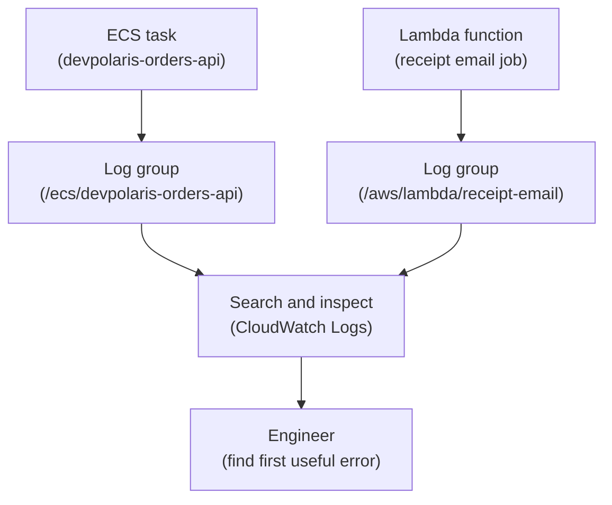

## Table of Contents

1. [Why Logs Need A Home](#why-logs-need-a-home)
2. [Log Groups, Streams, And Events](#log-groups-streams-and-events)
3. [Structured Logs From The Orders API](#structured-logs-from-the-orders-api)
4. [ECS Task Logs](#ecs-task-logs)
5. [Lambda Logs](#lambda-logs)
6. [Searching For The First Useful Error](#searching-for-the-first-useful-error)
7. [Access, Retention, And Cost Habits](#access-retention-and-cost-habits)
8. [Failure Modes](#failure-modes)
9. [What Good Logs Feel Like](#what-good-logs-feel-like)

## Why Logs Need A Home

A backend can fail in a way the user only sees as "checkout did not work."
That sentence is not enough for the team.
The team needs to know what the app tried to do, which request failed, which downstream service complained, and whether the failure happened once or many times.

On your laptop, logs appear in the terminal that started the process.
In AWS, the process may be running inside an ECS task that is replaced during deployment.
A Lambda function may run for one event and then disappear.
An EC2 instance may rotate files or be replaced.
If logs only live inside those runtimes, the evidence disappears or becomes hard to reach.

CloudWatch Logs gives those runtime messages a shared AWS home.
It does not make bad logs good.
It gives logs a place to land, a way to search, and a retention setting so the team can decide how long evidence should remain.

For `devpolaris-orders-api`, CloudWatch Logs helps answer questions like:
did the app start, did the request reach the service, which request ID failed, what did RDS return, did the S3 receipt upload work, and did the Lambda email job run?

The goal is not to log every thought the program has.
The goal is to leave enough useful evidence for the next person who has to debug production.



Read the diagram as an evidence path.
Runtime output should travel away from the short-lived compute environment and into a place the team can inspect later.

## Log Groups, Streams, And Events

CloudWatch Logs has three beginner nouns.
A log event is one timestamped message.
A log stream is a sequence of events from one source.
A log group is the named container that holds related streams.

For an ECS service, the log group might be `/ecs/devpolaris-orders-api`.
Each ECS task may produce its own log stream.
That means one deploy with three running tasks can produce several streams under the same group.

For Lambda, the log group is commonly named around the function.
Each runtime environment can write to a stream under that group.
You do not need to memorize the exact stream naming pattern.
You need the mental model:
group for the workload, stream for one runtime source, event for one message.

Here is a simple view:

| CloudWatch Logs Piece | Plain Meaning | Example |
|-----------------------|---------------|---------|
| Log group | Home for related logs | `/ecs/devpolaris-orders-api` |
| Log stream | Logs from one runtime source | one ECS task stream |
| Log event | One timestamped message | one JSON app log |

For checkout debugging, the log group is usually your first destination.
If you know the service name, you should know the log group name.
That naming discipline saves time when something is already broken.

A team might write this into the service runbook:

```text
service:
  devpolaris-orders-api

main log group:
  /ecs/devpolaris-orders-api

side job log group:
  /aws/lambda/devpolaris-receipt-email

first search terms:
  request_id
  order_id
  ERROR
  AccessDenied
  ConnectionTimeout
```

This is not fancy.
It is useful because the first few minutes of debugging should not be spent remembering where logs live.

## Structured Logs From The Orders API

Unstructured logs are written mostly for human eyes.
Structured logs are written so humans and tools can search fields reliably.
For a Node.js backend, a structured log is often one JSON object per line.

The important part is not the JSON itself.
The important part is choosing fields that make production questions easier.

For `devpolaris-orders-api`, useful fields include:

| Field | Why It Helps |
|-------|--------------|
| `service` | Confirms which app wrote the log |
| `env` | Separates prod from staging |
| `request_id` | Connects all logs for one request |
| `route` | Shows which API path was involved |
| `step` | Names the operation inside the request |
| `order_id` | Connects support tickets to backend evidence |
| `error_name` | Makes failure searches easier |

A healthy checkout might write:

```json
{
  "level": "info",
  "time": "2026-05-02T09:12:33.119Z",
  "service": "devpolaris-orders-api",
  "env": "prod",
  "request_id": "req_01J8K2M6TK7S1E9R0Y6Q",
  "route": "POST /v1/orders",
  "step": "checkout.complete",
  "order_id": "ord_8x7k2n",
  "status": 201,
  "duration_ms": 184
}
```

A failed dependency call might write:

```json
{
  "level": "error",
  "time": "2026-05-02T09:42:18.411Z",
  "service": "devpolaris-orders-api",
  "env": "prod",
  "request_id": "req_01J8K2M6TK7S1E9R0Y6Q",
  "route": "POST /v1/orders",
  "step": "rds.insert_order",
  "error_name": "ConnectionTimeout",
  "message": "database connection timed out"
}
```

The second log tells you the first useful next step.
The failing step is `rds.insert_order`.
You should inspect database connectivity, connection pressure, or a recent migration.
You should not start by searching S3 lifecycle rules.

Good structured logs avoid two extremes.
They should not be so small that they say only `failed`.
They should not include sensitive values like access tokens, full payment details, or database passwords.
Logs are evidence, but they are also data your team must protect.

## ECS Task Logs

For ECS, the simplest beginner model is this:
your container writes to stdout and stderr, and the task's log configuration sends that output to CloudWatch Logs.
The application should not need to know the CloudWatch API just to write ordinary app logs.

The ECS task definition is where the log route is declared.
The exact task definition can contain many fields, so focus on the logging part:

```json
{
  "containerDefinitions": [
    {
      "name": "orders-api",
      "image": "111122223333.dkr.ecr.us-east-1.amazonaws.com/devpolaris-orders-api:2026-05-02.4",
      "logConfiguration": {
        "logDriver": "awslogs",
        "options": {
          "awslogs-group": "/ecs/devpolaris-orders-api",
          "awslogs-region": "us-east-1",
          "awslogs-stream-prefix": "orders-api"
        }
      }
    }
  ]
}
```

Read this as a route for evidence.
The task starts.
The Node.js app writes logs.
The log driver sends those logs to `/ecs/devpolaris-orders-api`.

When ECS logs are missing, avoid guessing.
Ask which part of the route failed:
did the app write anything, did the container start, does the task definition name the right log group, does the execution role have permission to write logs, and are you looking in the right Region?

A startup log is one of the most valuable app logs:

```json
{
  "level": "info",
  "time": "2026-05-02T09:00:04.218Z",
  "service": "devpolaris-orders-api",
  "env": "prod",
  "release": "2026-05-02.4",
  "port": 3000,
  "health_path": "/health",
  "message": "service ready"
}
```

That log proves several things at once.
The container started.
The app loaded runtime config.
The release value is visible.
The app believes it is ready to serve traffic.

If the ALB says the target is unhealthy but this log never appears, the app may not be starting.
If this log appears but health checks fail, the problem may be the port, health path, security group, or readiness logic.

## Lambda Logs

Lambda logs are different because the runtime is event-shaped.
There may be no long-running server to inspect.
One invocation receives one event, does bounded work, and writes logs for that invocation.

For the DevPolaris system, imagine a Lambda function named `devpolaris-receipt-email`.
It reads a receipt event after an order is created and sends an email.
Checkout may succeed even if the email job fails later, so Lambda logs need enough context to connect the side job back to the order.

A useful Lambda log might look like this:

```json
{
  "level": "error",
  "time": "2026-05-02T09:13:02.441Z",
  "service": "devpolaris-receipt-email",
  "request_id": "req_01J8K2M6TK7S1E9R0Y6Q",
  "order_id": "ord_8x7k2n",
  "step": "email.send",
  "error_name": "TemplateNotFound",
  "message": "receipt template missing for locale"
}
```

The key fields are `request_id` and `order_id`.
They let you connect the Lambda failure back to the checkout request.
Without those fields, the Lambda log may tell you an email failed, but not which customer order it affected.

Lambda also writes platform-style lines around invocations.
Those can show duration, memory-related information, and invocation request identifiers.
They are useful, but app logs should still carry the business context.

For beginners, the habit is simple:
every asynchronous side job should log the ID that connects it back to the original work.
For orders, that usually means `request_id`, `order_id`, or both.

## Searching For The First Useful Error

When production is noisy, do not start with the biggest search.
Start with a narrow question.
If a user reports failed checkout for `ord_8x7k2n`, search the order ID.
If an alarm points to a time window, search errors in that window.
If the API returned a request ID, search that ID first.

Here is a practical AWS CLI search:

```bash
$ aws logs filter-log-events \
>   --log-group-name /ecs/devpolaris-orders-api \
>   --start-time 1777714800000 \
>   --filter-pattern 'ERROR "req_01J8K2M6TK7S1E9R0Y6Q"' \
>   --query 'events[].message'
[
  "{\"level\":\"error\",\"service\":\"devpolaris-orders-api\",\"request_id\":\"req_01J8K2M6TK7S1E9R0Y6Q\",\"step\":\"rds.insert_order\",\"error_name\":\"ConnectionTimeout\",\"message\":\"database connection timed out\"}"
]
```

Do not worry about memorizing every flag right now.
Notice the shape:
choose the log group, choose the time window, choose the search terms, and read the message.

If you use CloudWatch Logs Insights, the same idea becomes a query over fields:

```text
fields @timestamp, service, request_id, route, step, error_name, message
| filter service = "devpolaris-orders-api"
| filter request_id = "req_01J8K2M6TK7S1E9R0Y6Q"
| sort @timestamp asc
```

The query is useful because structured logs turn log lines into searchable fields.
If the app writes plain text with no request ID, the query becomes much weaker.

The first useful error is not always the first error by time.
Sometimes one bad request triggers many secondary failures.
Look for the first log that names a failing dependency or a wrong assumption.
Examples:

| Log Clue | Likely Next Check |
|----------|-------------------|
| `AccessDenied` | IAM role, action, resource ARN |
| `ConnectionTimeout` | network path, RDS health, connection pool |
| `ConditionalCheckFailedException` | duplicate request or DynamoDB condition |
| `NoSuchKey` | S3 bucket, key, Region, lifecycle, versioning |
| `TargetHealthCheckFailed` | port, path, app readiness, security group |

This habit keeps the team from reading logs as a flood of text.
You are looking for the first clue that changes where you inspect next.

## Access, Retention, And Cost Habits

Logs need access rules.
Developers may need to read application logs.
The running ECS task needs permission to write logs.
A finance user probably should not read raw checkout logs if those logs include customer-related context.

Logs also need retention.
Retention means how long CloudWatch keeps log events before deleting them.
Keeping logs forever may sound safe, but logs cost money and may contain sensitive operational data.
Keeping logs for too short a time can hurt incident review or customer support.

The right setting depends on the team and data type.
For a beginner article, the important habit is not a specific number.
The important habit is to decide intentionally.

Ask:

| Question | Why It Matters |
|----------|----------------|
| Who can read this log group? | Logs may include sensitive context |
| How long do we need these logs? | Support and incident review need history |
| Are we logging secrets by accident? | Logs can leak values if the app is careless |
| Can we search by request ID? | Debugging needs correlation |
| Is the log volume useful? | Too much noise makes search slower and cost higher |

One simple cleanup is to avoid logging entire request bodies.
For checkout, log the request ID, order ID, route, status, and failure reason.
Do not log full payment payloads or secrets.

Good logs are useful and restrained.
They tell the story without spilling private data everywhere.

## Failure Modes

Log systems fail in ordinary ways.
The first failure mode is "there are no logs."
That can mean the app never started, the task cannot write logs, the log group name is wrong, the runtime is in another Region, or the engineer is looking at the wrong environment.

The second failure mode is "the logs are there, but useless."
A log line like `error happened` may technically exist, but it does not help a tired engineer decide what to inspect.
That is an application logging problem, not a CloudWatch problem.

The third failure mode is "the logs are too noisy."
If every request writes dozens of unimportant lines, the useful error gets buried.
High log volume also creates cost and retention pressure.

Here is a realistic missing-log investigation:

```text
symptom:
  ALB target is unhealthy after deploy

expected log group:
  /ecs/devpolaris-orders-api

what we see:
  no startup log for release 2026-05-02.4

next checks:
  ECS task stopped reason
  task execution role log permissions
  task definition log group name
  container command and app startup failure
```

The key is to treat missing logs as evidence too.
If a release should write a startup log and does not, the absence narrows the search.

Here is a useless-log investigation:

```text
symptom:
  checkout returned 500

log line:
  "failed"

missing:
  request_id
  route
  step
  dependency name
  error name
```

The fix is not a new dashboard.
The fix is better application logging.
Add the fields that let a future engineer connect the error to a request and a failing step.

## What Good Logs Feel Like

Good logs make the next question obvious.
They do not make you decode a mystery.
They let you move from user complaint to request ID, from request ID to failing step, and from failing step to the AWS service that needs inspection.

For `devpolaris-orders-api`, the basic logging standard is:
every request gets a request ID, every important downstream call names its step, errors include an error name, and side jobs carry the order ID or request ID forward.

That standard is small, but it changes production debugging.
Instead of "checkout failed somewhere," the team sees:
`request req_01J8K2M6TK7S1E9R0Y6Q failed at rds.insert_order with ConnectionTimeout`.

That sentence is enough to start calmly.
You know the request.
You know the step.
You know the dependency.
You know where to look next.

CloudWatch Logs is the place where that evidence can live.
The application still has to write useful evidence.
Both pieces matter.

---

**References**

- [Working with log groups and log streams](https://docs.aws.amazon.com/AmazonCloudWatch/latest/logs/Working-with-log-groups-and-streams.html) - Explains the CloudWatch Logs containers used by AWS workloads.
- [Analyze log data with CloudWatch Logs Insights](https://docs.aws.amazon.com/AmazonCloudWatch/latest/logs/AnalyzingLogData.html) - Shows how CloudWatch Logs Insights queries log events and fields.
- [Send Amazon ECS logs to CloudWatch](https://docs.aws.amazon.com/AmazonECS/latest/developerguide/using_awslogs.html) - Documents the ECS `awslogs` driver used to route container logs to CloudWatch.
- [Sending Lambda function logs to CloudWatch Logs](https://docs.aws.amazon.com/lambda/latest/dg/monitoring-cloudwatchlogs.html) - Explains how Lambda sends function logs to CloudWatch Logs.
- [CloudWatch Logs permissions reference](https://docs.aws.amazon.com/AmazonCloudWatch/latest/logs/permissions-reference-cwl.html) - Lists CloudWatch Logs API actions used in IAM policies.
