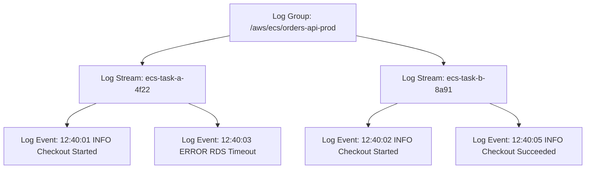

## Table of Contents

1. [The Disappearing Evidence Problem](#the-disappearing-evidence-problem)
2. [What Is CloudWatch Logs](#what-is-cloudwatch-logs)
3. [The Log Directory Analogy](#the-log-directory-analogy)
4. [Durable Log Ingestion Paths](#durable-log-ingestion-paths)
5. [The Structured Logging Standard](#the-structured-logging-standard)
6. [Metric Filters: Extracting Telemetry from Text](#metric-filters-extracting-telemetry-from-text)
7. [CloudWatch Logs Insights Queries](#cloudwatch-logs-insights-queries)
8. [The "First Useful Error" Diagnostic Habit](#the-first-useful-error-diagnostic-habit)
9. [Retention, Governance, and Cost Controls](#retention-governance-and-cost-controls)
10. [Putting It All Together](#putting-it-all-together)
11. [What's Next](#whats-next)

## The Disappearing Evidence Problem

In traditional local application hosting, finding your runtime logs is highly intuitive. The application process writes directly to local standard output, or prints to a specific, static file on disk like `/var/log/app.log`. If the server experiences an error, you establish a terminal shell connection, scroll through the log file, and locate the problem. 

However, in a modern cloud network, this direct approach is impossible. When a distributed application fails under load, the virtual host environments are ephemeral and stateless. The container task that threw the database connection error may have already been terminated by the ECS service scheduler and replaced by a fresh, blank task instance. The serverless Lambda function that failed to send an email executed for a brief 100 milliseconds and then disappeared completely, taking any local memory state with it. 

If your application writes its execution history to local server disks, that critical diagnostic evidence vanishes the moment the compute node is replaced. To troubleshoot production incidents, you need a highly durable, centralized logging vault that sits outside the life cycle of your compute servers.

## What Is CloudWatch Logs

Amazon CloudWatch Logs is the serverless, regional service designed to store, monitor, index, and query log data from all of your AWS services, applications, and operating systems. Instead of leaving logs trapped on isolated server filesystems, your virtual machines, container tasks, and serverless functions continuously stream their execution lines to CloudWatch over secure, HTTPS API calls.

To organize and secure millions of incoming log lines, CloudWatch enforces a strict, three-tiered structural hierarchy:

* **Log Event**: The fundamental unit of telemetry. A log event is a single chronological record containing a millisecond-precision timestamp and the raw message payload (such as a JSON block or plain-text string).
* **Log Stream**: A sequence of log events originating from a single, specific source instance. In a containerized or serverless cluster, one ECS task replica or one Lambda execution environment writes all of its events into its own unique, dedicated log stream.
* **Log Group**: The logical administrative parent container. A log group is a collection of related log streams that share the same retention policies, encryption keys, IAM access controls, and metric filter rules.



By separating log storage from log execution, your diagnostic evidence is fully preserved. If a virtual host crashes, the logs it streamed to CloudWatch Logs remain fully searchable and secure, ready to be analyzed by your engineering team.

## The Log Directory Analogy

To build an intuitive mental model of this hierarchy, you can compare CloudWatch Logs to a standard operating system file directory:

* **The Log Group acts as a Folder**: It is the top-level boundary representing a specific application service or environment. Just as you apply folder-level permissions, you define access control, storage retention timelines, and billing tags at the Log Group boundary.
* **The Log Stream acts as an Individual File**: It is a dedicated document inside that folder holding the chronological print statements of a single compute process.
* **The Log Event acts as a Single Line inside that File**: It is the concrete message printed at one split-second.

When you begin a production investigation, never try to guess the specific Log Stream "file" beforehand. In an autoscaled cluster, searching through thousands of dynamically generated streams is incredibly tedious. 

Instead, your primary diagnostic entrance should always be the Log Group folder. You run search queries and filters against the entire group, letting CloudWatch parse across all nested streams simultaneously to locate the specific transaction context you need.

## Durable Log Ingestion Paths

Before your code can emit useful evidence, you must configure a durable networking path that ships standard print streams into CloudWatch Logs. AWS structures these paths differently depending on the compute runtime:

### 1. Amazon ECS (Containers)
Under the Fargate compute model, your container definition in the task blueprint declares the `awslogs` log driver. This driver automatically captures any text written by your application process to standard output (`stdout`) and standard error (`stderr`) streams inside the container, forwarding those lines directly to a configured Log Group (such as `/aws/ecs/orders-api`). This ensures your application code remains completely pure; you simply print to the console, and Fargate handles the cloud shipping in the background.

### 2. AWS Lambda (Serverless)
When a serverless Lambda function executes, the runtime environment automatically intercepts all print calls and console logs, streaming them to a dedicated Log Group named `/aws/lambda/<function-name>`. This path is managed entirely by the platform, but it requires that your Lambda function's IAM Execution Role includes explicit policy permissions to create log streams and put log events (`logs:CreateLogStream` and `logs:PutLogEvents`). If these permissions are missing, the function will execute successfully, but you will have zero log visibility in the console.

### 3. Amazon EC2 (Virtual Servers)
Unlike managed runtimes, an EC2 instance does not have an automatic print driver. To ship logs, you must install the Unified CloudWatch Agent as a background system daemon on the guest operating system. The agent is configured via a JSON file to monitor specific local files (such as `/var/log/nginx/access.log`), sweep new lines as they are written, and stream them securely to your specified CloudWatch Log Group.

## The Structured Logging Standard

A central database for logs is only useful if the logs themselves are searchable. In a production outage, searching through unstructured plain-text strings (like `"User USR882 clicked place order and got an error"`) forces you to write slow regular expressions that are highly brittle and fail to parse multiline stack traces.

To make logs highly indexable, you must enforce a structured logging standard. This means your application code writes every single log event as a flat, single-line JSON object:

```json
{
  "level": "ERROR",
  "timestamp": "2026-05-25T22:53:15.042Z",
  "service": "orders-api",
  "route": "POST /checkout",
  "requestId": "req-7b91",
  "orderId": "order-1042",
  "customerId": "cust-882",
  "durationMs": 2450,
  "dependency": "rds",
  "message": "database transaction failed",
  "error": "connection timeout pool exhausted"
}
```

Standardizing on structured JSON logs delivers three critical architectural benefits:
* **Automated Indexing**: CloudWatch Logs automatically parses the JSON structure upon ingestion, indexing every single key (like `level`, `durationMs`, and `orderId`) as a first-class queryable attribute.
* **No Regular Expressions**: You can search for precise parameters directly (e.g., locating errors where `durationMs > 2000`) without writing a single regex line.
* **Safe Context Preservation**: You can include rich business and transaction context (like `requestId` and `customerId`) safely within searchable keys, without cluttering the human-readable `message` string.

## Metric Filters: Extracting Telemetry from Text

Sometime you must operate legacy application binaries that you cannot rewrite to output structured JSON. If a legacy payment service only prints unstructured text lines like `"Authentication failed for user admin"`, you can extract numerical telemetry from these text streams using CloudWatch Metric Filters.

A Metric Filter continuously scans incoming log events in a Log Group for a specific text pattern (such as `[level, timestamp, msg = "Authentication failed", ...]`). When the pattern matches an incoming log line, the filter increments a custom CloudWatch Metric (such as `FailedLogins`) in real-time. 

This enables you to create performance metrics, draw time-series dashboards, and trigger automated alerts from raw text logs without changing a single line of legacy application code.

## CloudWatch Logs Insights Queries

To query structured JSON logs across terabytes of data quickly during an active incident, you use CloudWatch Logs Insights. Logs Insights is a high-performance, serverless query engine that features a dedicated, pipe-delimited syntax to filter, aggregate, and inspect log events.

Below are three highly practical Logs Insights query templates cabled to standard structured fields:

### 1. Locate Slow Checkout Transactions
Find the slowest 50 checkout requests, listing their timestamp, request ID, duration, and error messages:

```sql
fields @timestamp, requestId, durationMs, error
| filter route = "POST /checkout"
| sort durationMs desc
| limit 50
```

### 2. Count Error Rates by Service
Aggregate the volume of `ERROR` logs across a 5-minute window to identify which service component is experiencing a spike:

```sql
fields @timestamp, service, message
| filter level = "ERROR"
| stats count() by service, bin(5m)
| sort count() desc
```

### 3. Parse and Filter Unstructured Text Logs
Extract variables from unstructured web server logs (like Apache/Nginx access logs) to identify which client IPs are generating `500` status codes:

```sql
filter @message like / 500 /
| parse @message "* - * [*] \"*\" * *" as ip, user, time, request, status, bytes
| stats count() by ip, request
| sort count() desc
```

By leveraging these queries, you eliminate the need to download large log files or scroll blindly through thousands of lines in the AWS Console, reducing your mean-time-to-detection (MTTD) to seconds.

## The "First Useful Error" Diagnostic Habit

During a major production incident, logs can quickly become overwhelmed with cascading error messages. When a database becomes unreachable, the database driver throws an error, the repository layer throws a transaction exception, the API controller logs a checkout failure, and the load balancer writes a `502 Bad Gateway` log.

When an engineer starts debugging, the loudest and most frequent logs are usually the user-facing symptoms. However, treating these late-stage errors as the cause leads to false troubleshooting paths. You must practice the diagnostic habit of locating the **First Useful Error**:

1. **Sort Chronologically**: Run your log search and sort the events in strict ascending order (`sort @timestamp asc`) to follow the cause-and-effect timeline.
2. **Scan Inward**: Bypass the generic, outer-edge errors (like `502 Gateway Timeout` or `Checkout failed`).
3. **Locate the Origin**: Find the very first event that deviated from normal behavior, such as the database pool warning that read `rds connection pool exhausted`.

Identifying the First Useful Error instantly isolates the core bottleneck, directing your team to fix the database connection capacity instead of wasting time debugging API gateway routing configurations or container restart scripts.

## Retention, Governance, and Cost Controls

Logging is an ongoing cost and security responsibility. If you do not configure strict policies, your logs can quickly become a massive cost driver and a security liability. You must implement the following three governance controls:

### 1. Log Retention Policies
By default, every newly created CloudWatch Log Group has its retention setting set to "Never Expire". This is a dangerous cost trap, as you pay a monthly fee to store verbose development debug logs that are useless after 24 hours. You must configure explicit retention policies:
* **Development/Staging**: 7 days or less.
* **Production Application Logs**: 30 to 90 days (sufficient for post-mortems and capacity planning).
* **Security Audits & Compliance**: Configure CloudWatch to stream logs to Amazon S3 Glacier for cheap, multi-year cold storage, rather than keeping them active in CloudWatch.

### 2. Log Level Discipline
Enforce strict logging level discipline in your application code. Use `DEBUG` logs exclusively for local development, configure your production containers to run at the `INFO` or `WARN` level, and elevate to `DEBUG` dynamically only during active troubleshooting windows to avoid saturating storage budgets.

### 3. Log Redaction (Data Privacy)
Logs must never contain personally identifiable information (PII) or security credentials. Ensure that your application logging frameworks automatically redact sensitive keys, including `password`, `creditCard`, `authorizationToken`, and `ssn`, before the JSON block is written to standard output. 

## Putting It All Together

Centralizing your application logs in CloudWatch is the first step toward achieving operational control in the cloud:

* **Eliminate Local Disk Logs**: Configure container tasks via the `awslogs` driver and install the CloudWatch Agent on EC2 to stream all logs immediately to centralized regional endpoints.
* **Adopt JSON as Your Logging Standard**: Always write structured JSON logs to enable automated indexing, rich metadata searching, and fast query execution.
* **Master Logs Insights Queries**: Use structured, pipe-delimited queries to filter, aggregate, and analyze logs instantly during incidents, bypassing console scrolling.
* **Practice the First Useful Error Habit**: Always sort log events ascending to identify the origin failure rather than chasing the loudest user-facing symptoms.
* **Govern Your Storage Costs**: Never leave retention set to "Never Expire". Set explicit prunings and use log level gates to manage ingestion budgets.

By treating logging as a structured, searchable data layer, you build a system that is transparent, predictable, and simple to debug under production pressure.

## What's Next

Logs are highly effective for deconstructing the details of a single request, but querying raw text lines is too slow and expensive for real-time alerting and high-level health monitoring. To watch your entire system's health constantly in the background, we must transition to numeric telemetry. In the next article, we will explore CloudWatch Metrics, dashboards, and automated alarm alerting loops cabled to SNS.

---

**References**

- [What is Amazon CloudWatch Logs?](https://docs.aws.amazon.com/AmazonCloudWatch/latest/logs/WhatIsCloudWatchLogs.html) - Official AWS guide to centralizing, storing, and managing system logs.
- [CloudWatch Logs Insights Query Syntax](https://docs.aws.amazon.com/AmazonCloudWatch/latest/logs/CWL_QuerySyntax.html) - Technical reference for writing high-performance Log Insights queries.
- [Using the awslogs Log Driver](https://docs.aws.amazon.com/AmazonECS/latest/developerguide/using_awslogs.html) - Guide on configuring container tasks to stream stdout to CloudWatch.
- [Monitoring Lambda Functions with CloudWatch Logs](https://docs.aws.amazon.com/lambda/latest/dg/monitoring-functions-logs.html) - Technical reference for Lambda automatic log creation and IAM permissions.
