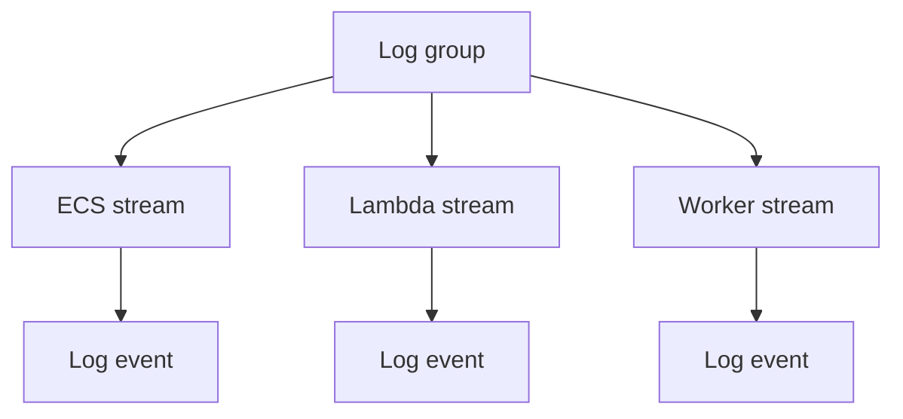

## Table of Contents

1. [The Problem](#the-problem)
2. [What Is CloudWatch Logs](#what-is-cloudwatch-logs)
3. [Log Groups](#log-groups)
4. [Log Streams](#log-streams)
5. [Log Events](#log-events)
6. [Structured Logs](#structured-logs)
7. [Workload Logs](#workload-logs)
8. [Searching Logs](#searching-logs)
9. [First Useful Error](#first-useful-error)
10. [Retention And Cost](#retention-and-cost)
11. [Putting It All Together](#putting-it-all-together)
12. [What's Next](#whats-next)

## The Problem

The previous article introduced logs, metrics, traces, and alarms. Logs are the signal most developers already understand. The hard part is that production logs are not sitting in the terminal that started the app.

The orders system fails during checkout:

- The ECS task that handled the request has already been replaced by the service scheduler.
- The email Lambda function ran for one invocation and then ended.
- A worker wrote several repeated error lines, but only one line names the real dependency failure.
- The team needs the evidence tomorrow too, not only while the container exists.
- The logs must not expose secrets, tokens, payment details, or raw customer data.

CloudWatch Logs gives AWS workloads a shared place to leave runtime evidence. It does not make weak log messages strong. It gives good log messages somewhere durable, searchable, and governable to live.

## What Is CloudWatch Logs

Amazon CloudWatch Logs stores, monitors, searches, and retains log data from AWS services, applications, and systems. The service gives log events a home outside the runtime that produced them.

The beginner mental model has three levels:

| Level | Plain meaning |
| --- | --- |
| Log group | The home for related logs and shared settings |
| Log stream | The sequence of events from one source or runtime |
| Log event | One timestamped log record |

For `devpolaris-orders-api`, the log group might represent the service. One ECS task may write to one stream. A Lambda function may have streams for execution environments. Each application log line becomes an event.



That shape matters because the group is where teams usually reason about retention, access, search scope, and ownership. The stream is where one runtime wrote. The event is the evidence itself.

## Log Groups

A log group is a collection of log streams that share the same retention, monitoring, and access-control settings. In practice, it is the first boundary an engineer chooses when they search logs.

Good log group design follows operational ownership. A log group such as `/aws/ecs/devpolaris-orders-api` tells the team that this is the runtime evidence for the orders API. A log group such as `/aws/lambda/devpolaris-receipt-email` tells the team that the evidence belongs to one function.

The gotcha is that log group names can look tidy while ownership is messy. If five unrelated services dump into one group, searching becomes noisy and access control becomes blunt. If every tiny helper creates its own mysterious group, the team spends too much time finding the right home.

Use log groups to match how humans investigate:

| Boundary | Good fit |
| --- | --- |
| One API service | App request and runtime logs |
| One Lambda function | Invocation logs for that function |
| One worker family | Background job processing logs |
| One shared platform component | Load balancer, proxy, or agent logs |

The group should make the first search easier: "which service owned this evidence?"

## Log Streams

A log stream is a sequence of log events from the same source. For containers and functions, the stream often maps to a specific runtime instance, task, container, or execution environment.

This is why streams can multiply quickly. If ECS replaces tasks during a deploy, new streams appear. If Lambda scales out, each execution environment can have its own stream. That is normal.

The stream helps when you need local sequence. It can show what one task or function instance did over time. But most production investigations should start at the log group and narrow by time, fields, request ID, or message content. Starting by guessing the stream is often too brittle.

The practical habit is:

| Search need | Start here |
| --- | --- |
| One service around an incident window | Log group |
| One request ID or order ID | Log group query/filter |
| One runtime after you know it handled the request | Log stream |
| One Lambda invocation | Function log group, then stream or request ID |

Streams are useful context. They should not be the only way to find evidence.

## Log Events

A log event is one timestamped record. It may be a plain text line, a JSON object, a stack trace fragment, or a service-generated message.

The event is where usefulness is won or lost. CloudWatch Logs can store and search the event, but the application decides whether the event contains enough context.

A weak event says:

```text
ERROR failed
```

A useful event says:

```json
{
  "timestamp": "2026-05-14T12:40:03Z",
  "level": "ERROR",
  "service": "orders-api",
  "route": "POST /checkout",
  "requestId": "req-7b91",
  "orderId": "order-1042",
  "dependency": "rds",
  "message": "failed to commit order",
  "errorType": "connection_timeout"
}
```

The second event gives the next engineer handles. It names the service, operation, request, safe business identifier, dependency, and failure shape. It does not include a password, card number, authorization token, full address, or raw request body.

The gotcha is repeated symptoms. If a worker retries the same bad message five times, the loudest log line may be the retry failure. The first useful event is the one that changes what you check next.

## Structured Logs

Structured logs use predictable fields instead of only human sentences. JSON is common because fields can be searched and parsed reliably.

For the orders system, the team should standardize a small set of fields:

| Field | Why it helps |
| --- | --- |
| `service` | Identifies the application component |
| `env` | Separates prod, staging, and dev |
| `level` | Filters warnings and errors |
| `requestId` | Connects logs for one request |
| `traceId` | Connects logs to traces when available |
| `route` or `operation` | Shows what the user or worker was doing |
| `dependency` | Names the downstream service or database |
| `status` or `errorType` | Makes failure shape searchable |

Do not make every field a dumping ground. A good log event is specific enough to search and safe enough to keep. Private data should stay out of logs unless there is a carefully reviewed reason, masking behavior, and retention policy.

Structured logs also help later articles. Metrics can be created from log filters. Traces can be easier to connect when logs include trace IDs. Alarms can point responders to the right log group and fields.

## Workload Logs

Different AWS runtimes send logs differently.

ECS tasks commonly send container output to CloudWatch Logs through the `awslogs` log driver or through FireLens. That usually captures the container's `stdout` and `stderr`. If the application writes useful structured logs to standard output, the container log path can preserve them.

Lambda sends function logs to CloudWatch Logs by default when the execution role has the needed permissions. The default log group shape is `/aws/lambda/<function-name>`, though functions can use custom log groups.

EC2 instances need an agent or another shipping path if application files should reach CloudWatch Logs. The local file itself is not enough if the instance is replaced or the disk rotates.

The workload path matters because a missing log can have several meanings:

| Missing evidence | Possible explanation |
| --- | --- |
| No ECS app logs | Task definition did not configure the log driver, or app did not write to captured streams |
| No Lambda logs | Execution role lacks log permissions, function did not run, or logs have not arrived yet |
| No EC2 file logs | Agent is not installed, configured, or able to reach the Logs API |
| Logs in wrong group | Runtime uses a different log group than the responder expected |

Before debugging the application, confirm that the runtime has a path to send logs.

## Searching Logs

Search should narrow the evidence before it reads deeply.

CloudWatch Logs supports filtering and Logs Insights queries. For beginner investigations, the first search usually combines time window, log group, level, and request or correlation field.

For a failed checkout request with ID `req-7b91`, a small Logs Insights query might be:

```sql
fields @timestamp, level, service, route, requestId, dependency, message
| filter requestId = "req-7b91"
| sort @timestamp asc
| limit 50
```

The query is not magic. It is just a way to make the story visible in order. The important part is that the logs have a `requestId` field to search.

For a wider incident, start with a narrow time window and a known service group. Large broad searches can cost more and return noise. If you add a Logs Insights widget to a dashboard, remember that refreshes run queries again.

The search habit is simple:

| Step | Reason |
| --- | --- |
| Choose the log group | Avoid scanning unrelated evidence |
| Set the incident time window | Reduce noise and cost |
| Filter by request, route, or level | Find the relevant story |
| Sort by time | See cause before symptom |
| Keep output small | Read evidence, not a dump |

Good log search is guided reading, not panic scrolling.

## First Useful Error

In a noisy incident, the first useful error is the earliest error that changes the investigation.

Suppose the logs show this sequence:

```text
12:40:01 INFO checkout started requestId=req-7b91
12:40:02 WARN retrying database connection requestId=req-7b91
12:40:03 ERROR failed to commit order dependency=rds errorType=connection_timeout requestId=req-7b91
12:40:04 ERROR checkout failed requestId=req-7b91
12:40:05 ERROR response 500 requestId=req-7b91
```

The last two lines are loud, but they are symptoms. The first useful error is the RDS timeout because it points to the next layer to check.

This habit prevents a common production mistake: treating the final user-facing failure as the cause. Logs often record the same failure at several layers. The best log line names the dependency, operation, and failure type that first made the work impossible.

For background work, the same idea applies. A DLQ message may be the final evidence. The first useful error may be the worker log that says the email provider returned `429` or the message payload was missing a required field.

## Retention And Cost

Logs need a retention plan. Keeping everything forever is rarely the right default. Deleting everything quickly can leave the team blind after a delayed report.

Retention should match the use of the evidence:

| Log type | Retention thinking |
| --- | --- |
| High-volume debug logs | Short retention, lower level in production |
| Application errors | Long enough for incident review and support |
| Security-sensitive events | Follow compliance and audit requirements |
| Access or request logs | Balance investigation value, privacy, and volume |
| Temporary migration logs | Remove or shorten after migration completes |

Cost is not only storage. Ingestion volume, queries, dashboard refreshes, subscriptions, and downstream destinations can matter. The safest habit is to log the right facts once, at the right level, with a retention setting the owner understands.

Access also matters. Logs can contain operationally sensitive details. The team that needs to debug checkout may need read access to the orders log group. That does not mean every engineer needs access to every application log in every account.

## Putting It All Together

The opening problem was disappearing runtime evidence. ECS tasks are replaced. Lambda invocations end. Workers retry. Local terminals do not hold the production story.

CloudWatch Logs gives that story a durable home. Log groups organize related logs and shared settings. Log streams preserve source-specific sequences. Log events carry the actual evidence. Structured fields make searches useful. Workload logging paths explain how ECS, Lambda, and EC2 evidence arrives. Logs Insights helps narrow by time, request, route, level, and dependency. Retention and access keep evidence useful without turning it into a security or cost problem.

The design is healthy when a responder can find the right log home, search by stable fields, and identify the first useful error without reading every line the system ever wrote.

## What's Next

Logs explain details. The next article covers metrics, dashboards, and alarms: the signals that show shape, trends, customer impact, and when a human should look.

---

**References**

- [What is Amazon CloudWatch Logs?](https://docs.aws.amazon.com/AmazonCloudWatch/latest/logs/WhatIsCloudWatchLogs.html). Supports the CloudWatch Logs role for centralizing, storing, searching, filtering, and retaining logs.
- [Working with log groups and log streams](https://docs.aws.amazon.com/AmazonCloudWatch/latest/logs/Working-with-log-groups-and-streams.html). Supports the definitions of log groups, log streams, retention, monitoring, and access-control settings.
- [CloudWatch Logs Insights language query syntax](https://docs.aws.amazon.com/AmazonCloudWatch/latest/logs/CWL_QuerySyntax.html). Supports the Logs Insights query examples and query-scope/cost guidance.
- [Send Amazon ECS logs to CloudWatch](https://docs.aws.amazon.com/AmazonECS/latest/developerguide/using_awslogs.html). Supports the ECS `awslogs` log-driver explanation and container output behavior.
- [Sending Lambda function logs to CloudWatch Logs](https://docs.aws.amazon.com/lambda/latest/dg/monitoring-functions-logs.html). Supports the Lambda default CloudWatch Logs behavior and execution-role permission notes.
