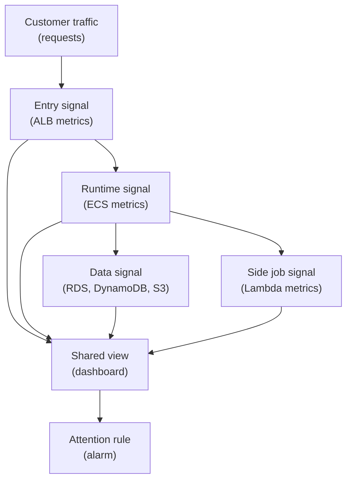

## Table of Contents

1. [When Logs Are Too Many](#when-logs-are-too-many)
2. [Metrics, Namespaces, And Dimensions](#metrics-namespaces-and-dimensions)
3. [The Checkout Dashboard](#the-checkout-dashboard)
4. [Load Balancer Metrics](#load-balancer-metrics)
5. [ECS Runtime Metrics](#ecs-runtime-metrics)
6. [Data Service Metrics](#data-service-metrics)
7. [Lambda And S3 Signals](#lambda-and-s3-signals)
8. [Dashboards Turn Numbers Into Context](#dashboards-turn-numbers-into-context)
9. [Alarms Turn Signals Into Action](#alarms-turn-signals-into-action)
10. [Failure Modes And Tradeoffs](#failure-modes-and-tradeoffs)

## When Logs Are Too Many

Logs are good for details, but details do not always answer the first production question.
If checkout feels broken, you do not want to read thousands of log lines before learning whether the whole service is failing.
You first want shape.

Metrics give you that shape.
A metric is a number recorded over time.
It can count requests, errors, latency, CPU use, database connections, Lambda failures, or DynamoDB throttling signals.

CloudWatch Metrics is AWS's main place for many service metrics.
AWS services publish their own metrics there.
Your application can also publish custom metrics, but many beginner dashboards start with the service metrics AWS already provides.

For `devpolaris-orders-api`, metrics answer questions like:
how many checkout requests are arriving, how many return errors, how long targets take to respond, whether ECS tasks are under pressure, whether RDS connections are rising, and whether Lambda side jobs are failing.

Metrics do not replace logs.
They tell you where to look.
If a graph shows 5xx errors rising after a deploy, logs can show the first useful error.
If a graph shows latency rising while RDS connections rise, logs and traces can help confirm the database path.

The beginner skill is to read metrics as a map, not as a verdict.



The dashboard gathers context.
The alarm watches a specific signal.
The human still interprets the story.

## Metrics, Namespaces, And Dimensions

CloudWatch metrics have names, namespaces, and dimensions.
The words sound abstract at first, so translate them into plain English.

A namespace is a family or category of metrics.
AWS services use namespaces such as `AWS/ApplicationELB`, `AWS/ECS`, `AWS/RDS`, `AWS/DynamoDB`, and `AWS/Lambda`.
You can think of a namespace as the shelf where a service's metrics live.

A metric name is the thing being measured.
Examples include request count, target response time, CPU utilization, database connections, or Lambda errors.

A dimension is a label that narrows the metric to one resource or group.
For example, an ALB metric may be tied to one load balancer or one target group.
An RDS metric may be tied to one database instance.

The beginner pattern looks like this:

| Piece | Plain Meaning | Example |
|-------|---------------|---------|
| Namespace | Service family | `AWS/ApplicationELB` |
| Metric name | Number being measured | `HTTPCode_Target_5XX_Count` |
| Dimension | Which resource | one target group |
| Period | Time bucket | one minute or five minutes |
| Statistic | How values combine | sum, average, maximum |

Do not memorize every metric name in the beginning.
Learn how to ask the service what it knows.
When debugging checkout, you usually start from the path:
ALB receives the request, ECS runs the app, RDS or DynamoDB stores data, S3 stores objects, Lambda runs side jobs.
Each of those services has signals.

The metric name should match the question.
If the question is "are customers getting errors?", start near HTTP response metrics.
If the question is "is the app under resource pressure?", inspect ECS CPU and memory.
If the question is "is the database being pushed too hard?", inspect RDS and app connection behavior.

## The Checkout Dashboard

A dashboard is a shared view of metrics and sometimes text.
It helps the team look at related signals together.
The feature works because the service records and evaluates metrics over time.
It is a carefully arranged set of questions.

For `devpolaris-orders-api`, a useful first dashboard might have these sections:

| Section | Signals |
|---------|---------|
| Customer impact | request count, 4xx, 5xx, target response time |
| App runtime | ECS CPU, memory, running task count, task restarts |
| Data path | RDS connections, database load signals, DynamoDB errors |
| Side jobs | Lambda invocations, errors, duration |
| Object writes | S3 error signals from app logs or custom metrics |

The dashboard should tell a short story.
Start with the customer-facing symptom.
Then show the runtime.
Then show the dependencies.
If the first chart on the dashboard is an obscure internal metric, beginners will struggle to connect it to user impact.

A small status snapshot might look like this:

```text
devpolaris-orders-api dashboard, last 15 minutes

ALB request count:
  normal

ALB target 5xx:
  increased after 09:40

Target response time:
  elevated after 09:41

ECS CPU and memory:
  normal

RDS connections:
  rising

Lambda receipt errors:
  normal
```

This snapshot does not prove the root cause.
It narrows the investigation.
The customer-facing errors are real.
The app runtime is not obviously CPU or memory starved.
RDS connections moved in the same time window.
The next useful check is app logs and database-related signals.

## Load Balancer Metrics

The Application Load Balancer is often the best first metric source for an HTTP service.
It sees traffic before the app does.
It can tell you whether requests arrived, whether targets were healthy, how targets responded, and how long responses took.

For checkout, important ALB questions include:

| Question | Metric Direction |
|----------|------------------|
| Is traffic reaching the entry point? | Request count |
| Are customers seeing server errors? | HTTP 5xx response counts |
| Are targets responding slowly? | Target response time |
| Are targets healthy? | Healthy host count |
| Is the load balancer itself failing? | Load balancer error signals |

Imagine an alarm fires for checkout 5xx.
The ALB view shows:

```text
time       requests/min   target_5xx   target_response_time
09:35      118             0            normal
09:40      121             4            higher
09:45      126             39           high
09:50      119             44           high
```

That tells you the problem is visible at the front door.
Customers are likely affected.
The error count and response time moved together.

Now compare that with healthy target count:

```text
healthy targets:
  orders-api-blue: 3
  orders-api-green: 0
```

If healthy targets dropped, you may investigate health checks and deployment.
If healthy targets stayed stable but 5xx increased, you may inspect app logs and dependencies.
The metric shape changes the next question.

## ECS Runtime Metrics

ECS metrics help you understand whether the app runtime is under pressure.
For Fargate tasks, common beginner questions are about CPU, memory, running task count, and deployment behavior.

If CPU is high, the app may be doing more work than expected or not have enough task capacity.
If memory is high, the process may be leaking memory or receiving larger payloads.
If running task count drops, the service may be failing to keep the desired count healthy.

For `devpolaris-orders-api`, an ECS snapshot might look like:

```text
ECS service: devpolaris-orders-api-prod

desired tasks:
  3

running tasks:
  3

CPU:
  normal

memory:
  normal

deployment:
  new revision reached steady state
```

This points away from obvious runtime resource exhaustion.
It does not clear the app completely.
The app can still have a bad database query or a missing permission.
But it tells you not to spend the first ten minutes blaming CPU.

Now imagine a different snapshot:

```text
desired tasks:
  3

running tasks:
  1

recent service event:
  task stopped after failing container health check
```

That is a very different story.
The ALB may show 5xx because there are not enough healthy targets.
The next check is ECS service events and task logs.

Metrics give shape.
Service events and logs give detail.

## Data Service Metrics

Checkout depends on data services.
If RDS, DynamoDB, or S3 has trouble, the app may look broken even when ECS tasks are healthy.

RDS metrics help you see database pressure.
Beginner-friendly signals include connections, CPU-related pressure, storage-related pressure, and read/write latency shapes.
You do not need to diagnose a database like a specialist on day one.
You need to notice when database behavior changed in the same window as customer errors.

DynamoDB metrics help you see request behavior and rejected work.
If conditional writes fail, that may be normal duplicate-request protection.
If errors or throttling-related signals rise, the table or access pattern may need attention.

S3 does not usually look like a database dashboard for checkout.
For app-level S3 issues, logs often carry the first useful clue: `AccessDenied`, `NoSuchKey`, wrong bucket, wrong key, or lifecycle surprise.
You may also use S3 request metrics when you intentionally enable and watch them for a bucket or prefix, but the beginner path should start with app logs and the feature's expected object path.

Here is a data-path review table:

| Service | Signal To Watch | What It Suggests |
|---------|-----------------|------------------|
| RDS | connections rise with checkout errors | app or database connection pressure |
| RDS | latency rises with slow requests | database work may be slow |
| DynamoDB | conditional failures rise | duplicate requests or condition logic |
| DynamoDB | rejected request signals rise | table access pattern or capacity issue |
| S3 | app logs show `AccessDenied` | IAM, bucket, key, or encryption path |
| S3 | app logs show `NoSuchKey` | wrong key, missing object, lifecycle, versioning |

The key is to line up time windows.
If checkout errors start at 09:42 and RDS connections rise at 09:41, that is interesting.
If Lambda errors start two hours later, they may be a separate problem.

## Lambda And S3 Signals

Lambda is often used for side jobs around the main API.
For DevPolaris, a Lambda might send receipt emails, process export manifests, or clean temporary files.
Lambda metrics answer basic questions:
did the function run, did it fail, how long did it take, and did it get invoked more than expected?

A side-job snapshot might look like:

```text
Lambda: devpolaris-receipt-email

invocations:
  normal

errors:
  increased after release 2026-05-02.4

duration:
  normal

app log clue:
  TemplateNotFound for locale en-GB
```

The metric tells you the side job is failing.
The log tells you why.
The main checkout path may still be healthy, but customers may not receive receipt emails.
That is a different impact than failed checkout.

S3 signals often begin in the app.
If the app cannot write a receipt, the useful first evidence may be an app error log:

```text
2026-05-02T09:18:22.611Z ERROR service=devpolaris-orders-api
request_id=req_01J8K2M6TK7S1E9R0Y6Q
step=s3.write_receipt
bucket=devpolaris-orders-prod-objects
key=receipts/2026/05/02/order_ord_8x7k2n/devpolaris-orders-receipt.pdf
error_name=AccessDenied
```

If the team wants a metric for receipt write failures, the app can publish a custom metric or count structured logs in a log-based workflow.
Do not start there on day one.
Start by making the log clear.

Then, if the failure matters often enough, turn it into a metric and possibly an alarm.

## Dashboards Turn Numbers Into Context

A dashboard should show the signals an operator needs to make the next decision.
It should help a teammate make the next decision faster.

For `devpolaris-orders-api`, a dashboard should start from customer impact:
traffic, errors, latency.
Then it should show the app runtime:
ECS task health, CPU, memory.
Then it should show dependencies:
RDS, DynamoDB, Lambda side jobs, and important object-write failures.

One useful layout is:

| Row | What It Shows | Why It Comes There |
|-----|---------------|--------------------|
| 1 | requests, 4xx, 5xx, latency | user-facing health first |
| 2 | healthy targets and ECS tasks | whether traffic has healthy app copies |
| 3 | CPU, memory, restarts | whether runtime pressure is obvious |
| 4 | RDS and DynamoDB signals | whether data dependencies changed |
| 5 | Lambda side jobs and export signals | whether background work is failing |

A dashboard should also include labels that match the service language.
If the team says "checkout," the dashboard should not be only resource IDs.
Use names like `checkout 5xx`, `orders API latency`, `RDS connections`, and `receipt email errors`.

The best dashboards reduce translation work.
During an incident, a junior engineer should not have to decode five AWS resource names before understanding whether customers are affected.

## Alarms Turn Signals Into Action

An alarm should be connected to action.
If nobody knows what to do when it fires, the alarm is not ready.

CloudWatch alarms watch metrics or metric math and change state.
They can notify people through other AWS services or team tooling.
The important design choice is the signal.

A useful first alarm set for the orders API might be:

| Alarm | What It Means | First Human Check |
|-------|---------------|-------------------|
| Checkout 5xx high | customers may fail checkout | ALB dashboard and app error logs |
| No healthy targets | traffic has no safe backend | ECS service events and health logs |
| ECS task restarts high | app may be crashing | task stopped reasons and startup logs |
| RDS connection pressure | database path may be at risk | app pool, database metrics, recent deploy |
| Receipt Lambda errors high | email side job may be failing | Lambda logs by order ID |

Avoid alarms that only say "something is a little unusual."
That may belong on a dashboard first.
An alarm should tell someone to look because user impact or operational risk is plausible.

Every alarm should have a short owner habit:
who receives it, what dashboard opens first, what log group matters, and what action is safe.
That does not need to be a giant process document.
It can be a few lines in the runbook.

```text
alarm:
  devpolaris-orders-api-checkout-5xx

first view:
  orders API CloudWatch dashboard

first logs:
  /ecs/devpolaris-orders-api

first search:
  level=error route="POST /v1/orders"
```

The alarm gets a person to the right door.
The dashboard and logs help that person walk through it.

## Failure Modes And Tradeoffs

Metrics can mislead when you read them without context.
A single spike may be harmless if it does not last or affect users.
An average may hide a small group of very slow requests.
A missing metric may mean the service is down, or it may mean the resource name changed.
An alarm may be quiet because the threshold is wrong, not because the service is healthy.

Dashboards can fail by becoming too crowded.
If every AWS service metric appears on one screen, the dashboard stops answering questions.
It becomes another thing to search.

Alarms can fail by being too sensitive or too vague.
If an alarm fires for harmless noise, people stop trusting it.
If an alarm fires with no runbook, the first minutes are spent asking what it means.

There is also a cost and attention tradeoff.
More custom metrics, more dashboards, and more alarms can help a team see more.
They can also create more maintenance, more cost, and more noise.

A practical beginner standard is:

| Question | Keep The Signal If |
|----------|--------------------|
| Does it show customer impact? | yes, put it near the top |
| Does it show a known dependency risk? | yes, add context |
| Does it fire an alarm? | only if someone should act |
| Does nobody use it during incidents? | remove or move it |
| Does it duplicate another chart? | simplify |

Good metrics help you see the shape of production.
Good dashboards arrange those metrics into a story.
Good alarms interrupt humans only when the story needs attention.

That is the balance you are aiming for.

---

**References**

- [Using Amazon CloudWatch metrics](https://docs.aws.amazon.com/AmazonCloudWatch/latest/monitoring/working_with_metrics.html) - Explains namespaces, metrics, dimensions, statistics, and periods.
- [Using Amazon CloudWatch dashboards](https://docs.aws.amazon.com/AmazonCloudWatch/latest/monitoring/CloudWatch_Dashboards.html) - Documents dashboards as shared CloudWatch views.
- [Using Amazon CloudWatch alarms](https://docs.aws.amazon.com/AmazonCloudWatch/latest/monitoring/AlarmThatSendsEmail.html) - Explains how alarms watch metrics and change state.
- [Application Load Balancer CloudWatch metrics](https://docs.aws.amazon.com/elasticloadbalancing/latest/application/load-balancer-cloudwatch-metrics.html) - Lists ALB metrics for request count, response codes, target response time, and target health.
- [Amazon ECS CloudWatch metrics](https://docs.aws.amazon.com/AmazonECS/latest/developerguide/available-metrics.html) - Documents ECS metrics used to understand service resource behavior.
- [Monitoring Amazon RDS metrics with CloudWatch](https://docs.aws.amazon.com/AmazonRDS/latest/UserGuide/MonitoringOverview.html) - Explains RDS monitoring through CloudWatch metrics and events.
