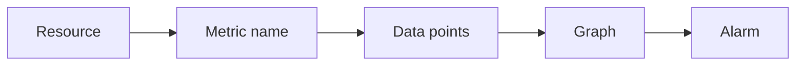
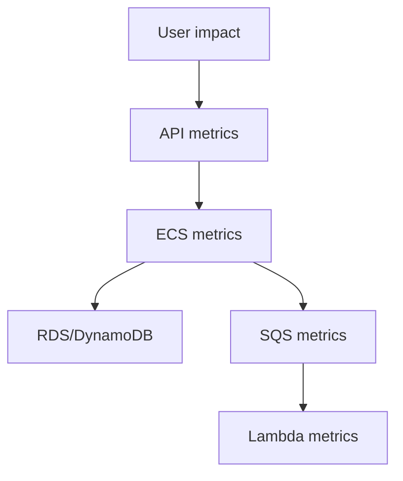

## Table of Contents

1. [The Problem](#the-problem)
2. [What Is a Metric](#what-is-a-metric)
3. [Namespaces And Dimensions](#namespaces-and-dimensions)
4. [Statistics And Periods](#statistics-and-periods)
5. [Service Metrics](#service-metrics)
6. [Dashboards](#dashboards)
7. [Alarms](#alarms)
8. [Noisy Signals](#noisy-signals)
9. [Putting It All Together](#putting-it-all-together)
10. [What's Next](#whats-next)

## The Problem

The previous article used logs to find concrete runtime evidence. But logs are too detailed for the first production question.

At 12:40, support says checkout feels broken. The team has thousands of log events. Before reading them, the team needs the shape of the problem:

- Are many customers failing, or one unlucky request?
- Did latency rise before errors appeared?
- Is API Gateway rejecting requests, or is the backend returning 5xx?
- Are ECS tasks saturated, or is RDS under connection pressure?
- Is the email queue falling behind while checkout itself stays healthy?
- Should this page a human now, or can it wait for normal review?

Metrics answer those shape questions. Dashboards put related metrics together. Alarms turn selected metrics into attention.

## What Is a Metric

A metric is a number recorded over time. It might count requests, measure latency, report CPU utilization, show queue age, or count failed Lambda invocations.

CloudWatch collects many AWS service metrics automatically. Applications can also publish custom metrics through the CloudWatch API or OpenTelemetry. But the beginner path usually starts with the AWS service metrics already available.

The useful mental model is a time series:



Each point says: at this time, for this metric identity, the value was this number.

A metric is not a log line. It does not explain one exact failure by itself. It shows trend, pressure, and scale. A log might say one checkout request failed because RDS timed out. A metric can show that RDS connections climbed for 15 minutes and checkout errors rose at the same time.

## Namespaces And Dimensions

CloudWatch metrics have identity. The identity decides which numbers are grouped together and which resource or slice you are looking at.

| Concept | Plain meaning | Example |
| --- | --- | --- |
| Namespace | A metric family | `AWS/Lambda`, `AWS/RDS`, `AWS/ApplicationELB` |
| Metric name | The measured thing | `Errors`, `CPUUtilization`, `TargetResponseTime` |
| Dimension | A name/value slice | `FunctionName=receipt-email` |
| Data point | One value at one timestamp | `Errors=3 at 12:40` |

Dimensions are powerful because they let you filter by resource. They are also a gotcha. A dimension is part of the unique metric identity. Adding many unique dimension values can create many metric series, especially for custom metrics.

Good dimensions describe stable operational slices: service, environment, route, dependency, queue name, function name, DB instance, or target group. Dangerous dimensions describe unbounded data: raw user ID, order ID, request ID, or session ID. Those belong in logs or traces, not as metric dimensions.

For the orders API, useful metric identities might be:

| Question | Metric shape |
| --- | --- |
| Are checkout requests failing? | API or load balancer 5xx by route/service |
| Are targets slow? | ALB target response time by target group |
| Are workers behind? | SQS age of oldest message by queue |
| Is the database pressured? | RDS connections and CPU by DB instance |
| Is receipt email failing? | Lambda errors by function name |

The habit is to make metrics answer stable operating questions.

## Statistics And Periods

CloudWatch stores data points and summarizes them over periods. A period is the time bucket, such as 1 minute or 5 minutes. A statistic is how the values in that bucket are summarized.

Common statistics include average, sum, minimum, maximum, and percentiles. The choice changes what you see.

Average can hide pain. If most checkout requests finish in 80 ms but a smaller group waits 4 seconds, average latency may look acceptable. A percentile such as p95 can reveal that slow tail. Maximum can show spikes, but it may overreact to one outlier. Sum is useful for counts such as total errors or invocations.

| Need | Better statistic |
| --- | --- |
| Count requests or errors | Sum |
| Track typical CPU use | Average |
| Catch worst resource pressure | Maximum |
| Understand user-facing slow tail | p95 or p99 |
| See whether any target is unhealthy | Minimum or maximum depending on metric meaning |

Period length matters too. A 1 minute graph can show sharp incident timing. A 1 hour graph can show daily trend. An alarm period should match how quickly the team needs to respond and how noisy the metric is.

The gotcha is false confidence. A smooth graph can be hiding the wrong statistic, period, or dimension. Always ask what the graph is grouping and summarizing before trusting the shape.

## Service Metrics

The orders system spans many AWS services. Each service gives a different view of the same customer experience.

Start with user impact, then move inward.

| Layer | Useful first metrics |
| --- | --- |
| API Gateway or ALB | Request count, 4xx, 5xx, latency |
| ECS service | CPU, memory, running task count, deployment stability |
| Lambda | Invocations, errors, duration, throttles |
| SQS | Visible messages, age of oldest message, messages received/deleted |
| EventBridge | Matched events, failed invocations, throttled rules |
| RDS | CPU, connections, storage, read/write latency |
| DynamoDB | Throttled requests, consumed capacity, latency |
| S3 | Request errors, latency, object count or storage where enabled |

Do not start by graphing every metric. Start with the path the user or work item takes. For checkout, the first dashboard row should show whether the customer path is healthy. Deeper rows can show the runtime, database, queue, and function layers.



This ordering prevents a common mistake: scaling the layer you know best before checking whether it is the bottleneck. High API latency does not automatically mean ECS needs more tasks. It might mean RDS is slow, a queue is backed up, or a downstream dependency is retrying.

## Dashboards

A dashboard is a shared view of related metrics and logs. It should reduce translation work during an incident.

A good dashboard tells a story from outside to inside:

| Dashboard row | What it answers |
| --- | --- |
| User impact | Are requests failing or slow? |
| Entry point | Is API Gateway or ALB seeing errors? |
| Runtime | Are ECS or Lambda resources pressured? |
| Data | Are RDS, DynamoDB, or S3 signals abnormal? |
| Async work | Are queues, events, or workflows behind? |
| Alarms and notes | What already thinks this is urgent? |

Dashboards are not just wall art. During an incident, a dashboard should help the team decide the next check. During normal operation, it should show whether the service is inside expected behavior.

The gotcha is dashboard sprawl. A dashboard with forty unrelated graphs creates work. A dashboard that starts with user impact and moves toward dependencies creates context.

CloudWatch dashboards can include metrics and alarms, and teams can create custom views for resources across Regions. That does not mean every metric belongs there. A dashboard should be a practiced operating view, not a metric museum.

## Alarms

An alarm watches a metric, metric math expression, query, or related alarm state and changes state when the condition is met over configured periods. Its job is attention.

The best alarm design starts with the sentence a responder needs:

```text
Checkout 5xx rate is above the agreed threshold for 5 minutes.
Check API errors, target health, and orders-api logs.
```

That sentence tells the human what changed, why it matters, and where to start. The alarm threshold and period should match the risk. A single brief spike may belong on a dashboard. Sustained customer-facing failure may deserve a page.

| Alarm target | Better when |
| --- | --- |
| API 5xx rate | Customer requests are failing |
| p95 latency | Customers are waiting too long |
| No healthy targets | Traffic cannot reach trusted tasks |
| SQS age | Background work is delayed |
| Lambda errors | Side jobs are failing |
| RDS connections | Database capacity risk is rising |

CloudWatch also supports composite alarms, which can reduce noise by combining alarm states. For example, a team may page only when high latency and high 5xx are both present, while still showing each underlying metric on the dashboard.

The gotcha is that an alarm action is not wisdom. If the alarm is based on the wrong metric, wrong statistic, wrong threshold, or wrong period, it can either miss impact or wake people for noise.

## Noisy Signals

Noise is not harmless. Noise teaches people to distrust the system.

A noisy metric jumps around without changing operational decisions. A noisy dashboard has so many graphs that responders cannot find the first question. A noisy alarm fires often, resolves on its own, and has no clear owner or action.

Improve signal quality before adding more signal:

| Symptom | Better move |
| --- | --- |
| CPU alarm pages but customers are fine | Move to dashboard or combine with user-impact alarm |
| Average latency looks fine during complaints | Add p95/p99 latency view |
| Queue depth grows during normal batches | Alarm on age or sustained backlog instead |
| One custom metric creates thousands of series | Remove unbounded dimensions |
| Dashboard is unreadable during incidents | Reorder by user impact and dependency path |

Good observability is selective. It gives the team enough information to act without burying the useful signal.

## Putting It All Together

The opening team had logs, but logs were too detailed for the first question. They needed to know whether checkout was broadly failing, where pressure appeared, and whether a human needed to respond.

Metrics show production shape over time. Namespaces, metric names, dimensions, periods, and statistics decide what the graph really means. Service metrics let the team move from user impact into API, runtime, queue, function, and database layers. Dashboards arrange those metrics into an operating story. Alarms turn selected conditions into human attention.

The design is healthy when dashboards answer "what is happening?" and alarms answer "does someone need to act now?"

## What's Next

Metrics show shape, but they do not follow one request through every hop. The next article covers tracing and correlation: how one unit of work keeps a shared identity across API calls, containers, queues, events, functions, and databases.

---

**References**

- [Metrics concepts](https://docs.aws.amazon.com/AmazonCloudWatch/latest/monitoring/cloudwatch_concepts.html). Supports the CloudWatch model of namespaces, metrics, dimensions, periods, statistics, percentiles, and alarms.
- [Metrics in Amazon CloudWatch](https://docs.aws.amazon.com/AmazonCloudWatch/latest/monitoring/working_with_metrics.html). Supports the distinction between AWS vended metrics, custom metrics, OpenTelemetry metrics, graphing, dashboards, and alarms.
- [Using Amazon CloudWatch dashboards](https://docs.aws.amazon.com/AmazonCloudWatch/latest/monitoring/CloudWatch_Dashboards.html). Supports the dashboard explanation and custom shared views for AWS telemetry.
- [Using Amazon CloudWatch alarms](https://docs.aws.amazon.com/AmazonCloudWatch/latest/monitoring/CloudWatch_Alarms.html). Supports metric alarms, PromQL alarms, composite alarms, alarm actions, state changes, and noise-reduction guidance.
