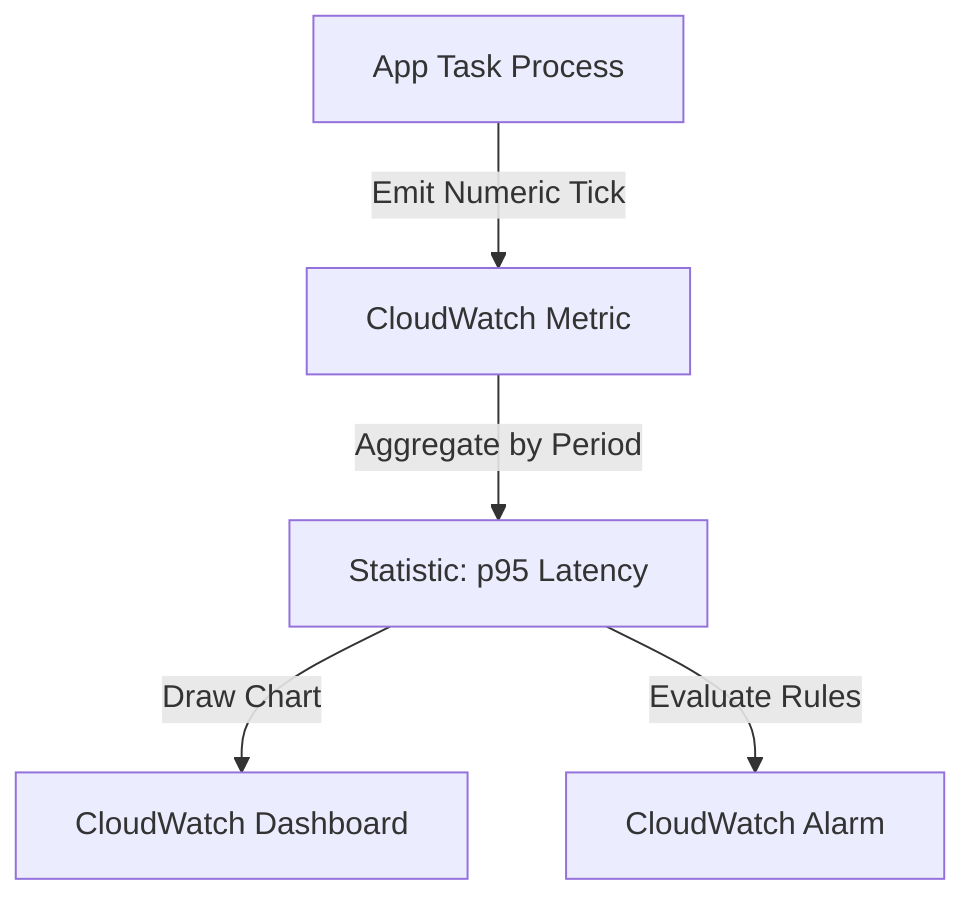
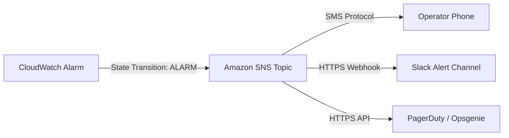

## Table of Contents

1. [The Diagnostic Detail Trap](#the-diagnostic-detail-trap)
2. [What Is a CloudWatch Metric](#what-is-a-cloudwatch-metric)
3. [Namespaces and Dimensions](#namespaces-and-dimensions)
4. [Resolution: Standard vs. High Resolution](#resolution-standard-vs-high-resolution)
5. [Custom Business Metrics](#custom-business-metrics)
6. [Designing Operational Dashboards](#designing-operational-dashboards)
7. [Automated Alarms: States and Thresholds](#automated-alarms-states-and-thresholds)
8. [The Notification Loop: SNS and Escalations](#the-notification-loop-sns-and-escalations)
9. [Putting It All Together](#putting-it-all-together)
10. [What's Next](#whats-next)

## The Diagnostic Detail Trap

When a production outage strikes your cloud environment, an engineer's first instinct is to open log files. If customers complain that checkouts are failing, you immediately query your application log groups to scan for connection errors. 

However, searching raw logs is a detailed, heavy operation. If your orders API is handling 10,000 requests per second, searching through millions of log lines during a high-severity incident is highly inefficient. 

Logs are designed to give you rich, granular details, but they are too slow and expensive to act as your first operational checkpoint. Before you search logs, you must understand the macro shape and scope of the problem:

* Are checkouts failing globally for all users, or is it isolated to a single container instance?
* Did latency spike gradually over an hour, or did it jump instantly at the exact second a new deployment was rolled out?
* Is your load balancer seeing connection errors, or are backend applications actively returning `500` status codes?
* Is your database under high connection pressure, or are your background queues backed up?

To answer these high-level questions instantly, you need numeric telemetry. You need a highly compressed, real-time signal that monitors system performance constantly in the background, aggregates metrics onto operational dashboards, and alerts your team automatically when performance boundaries are crossed.

## What Is a CloudWatch Metric

Amazon CloudWatch Metrics is the regional, high-performance service designed to collect, aggregate, and store numeric time-series data points from all of your AWS resources and custom applications. Unlike logs, which capture rich text strings, a metric stores only raw numbers (such as CPU percentages, active database connection counts, or total API error volumes) recorded over continuous time intervals.

Because metrics are purely numerical, they are incredibly cheap to store, fast to query, and highly compressed. This makes them the primary source for drawing real-time trend graphs, configuring automated resource scaling rules, and driving threshold alerts.

A metric does not explain *why* an individual request failed. It shows the system-wide pressure and trend:
* A log event records: *Request `req-7b91` failed at 12:40:03 because the RDS connection pool timed out.*
* A metric records: *RDS connection usage rose from 20% to 98% over 15 minutes, while the cluster-wide API error rate climbed to 15% during the same window.*



By pairing numeric metrics with raw log files, you establish a powerful diagnostic path: metrics show you *when* and *where* the system broke, while logs reveal the exact *what* and *why* in the underlying code execution.

## Namespaces and Dimensions

To manage thousands of metrics across multiple service tiers without collisions, CloudWatch uses a strict identity schema based on namespaces and dimensions:

### 1. Namespace
A Namespace is the top-level grouping container that isolates a family of metrics. AWS-native services automatically publish their metrics under standard, reserved namespaces (such as `AWS/ECS` for container tasks, `AWS/RDS` for database engines, and `AWS/ApplicationELB` for load balancers). Your custom application metrics are kept isolated in their own designated namespaces (such as `Custom/OrdersApp`).

### 2. Metric Name
The specific parameter being measured within that namespace, such as `CPUUtilization`, `ActiveConnections`, or `HTTP5xxCount`.

### 3. Dimensions
Dimensions are key-value metadata pairs that uniquely identify and partition the metric (such as `ClusterName=production` and `ServiceName=orders-api`). Dimensions act as the relational coordinates for your telemetry. 

A critical gotcha of dimensions is that they form the unique identity of the metric. If you publish a metric with a specific dimension set (e.g., `ClusterName` + `ServiceName`), you cannot query that metric using only `ClusterName` without specifying `ServiceName`, unless you use metric search or metric math to aggregate the series.

Furthermore, dimensions must never contain high-cardinality, unbounded data like user IDs, request IDs, or order IDs. Storing unbounded values creates millions of unique metric series, resulting in massive metric creation fees and unreadable charts. Unbounded data belongs strictly in logs or traces; dimensions must only describe stable operational coordinates.

## Resolution: Standard vs. High Resolution

When you configure metrics, you must select the appropriate collection resolution based on how rapidly your team needs to detect and respond to performance changes:

* **Standard Resolution (1-Minute Intervals)**: The default option for most AWS resources and custom metrics. AWS aggregates and publishes standard metrics once per minute. This is highly cost-effective and ideal for high-level dashboards, daily trend reviews, and standard database or compute capacity planning.
* **High Resolution (1-Second Intervals)**: Designed for highly dynamic, time-sensitive workloads. High-resolution metrics can be published at sub-minute intervals (down to 1 second). Choose high resolution exclusively for critical auto-scaling triggers that must react instantly to flash sales, or high-frequency business operations (like real-time financial trading gates) where a 1-minute delay in detection is unacceptable.

## Custom Business Metrics

While AWS-native metrics are excellent for monitoring infrastructure health (like CPU and network packets), they cannot measure your application's business correctness. A load balancer can report successful HTTP status codes, but it cannot detect if your checkout logic is writing blank orders to the database.

To bridge this gap, you must write custom metrics. Application code can publish numeric custom metrics directly using the AWS SDK `PutMetricData` API.

Below is the standard configuration shape for publishing a custom business metric:

```json
{
  "Namespace": "Custom/OrdersApp",
  "MetricData": [
    {
      "MetricName": "CompletedCheckouts",
      "Timestamp": "2026-05-25T22:53:15Z",
      "Value": 1.0,
      "Unit": "Count",
      "Dimensions": [
        {
          "Name": "Environment",
          "Value": "Production"
        },
        {
          "Name": "PaymentGateway",
          "Value": "Stripe"
        }
      ]
    }
  ]
}
```

By publishing this data points on every checkout, you can track transaction volumes in real time, build dashboards showing payment gateway success rates, and trigger alarms if order volumes suddenly drop to zero during peak operational hours.

## Designing Operational Dashboards

A dashboard is a shared visual interface that aggregates related metrics, logs, and alarms to reduce cognitive load during a production incident. 

A common architectural trap is dashboard sprawl, which involves building a massive screen packed with fifty identical, flashing charts with no clear hierarchy. During a high-stress incident, operators are blinded by the noise and struggle to locate the bottleneck.

You must design dashboards like an aircraft cockpit, organizing charts in a strict, top-down hierarchy:

* **Row 1: High-Level User Impact**: Place the most critical business KPIs at the top in large, bold numbers. This row answers: *Are customers experiencing errors or slow checkouts right now?* (e.g., `CompletedCheckouts`, `ALB 5xx Rate`, `p95 Checkout Latency`).
* **Row 2: Entry Ingress**: Chart the entry network interfaces. This row answers: *Is the entry gateway or load balancer accepting and routing packets correctly?* (e.g., `ALB RequestCount`, `TargetResponseTime`, `HealthyHostCount`).
* **Row 3: Compute Runtime**: Chart the resource pressure of your application servers. This row answers: *Are containers or virtual machines saturated?* (e.g., `ECS CPUUtilization`, `ECS MemoryUtilization`, `Lambda Throttles`).
* **Row 4: Data Layer**: Chart database and object storage performance. This row answers: *Are databases locking or S3 API limits choked?* (e.g., `RDS ActiveConnections`, `RDS WriteLatency`, `DynamoDB ThrottledRequests`).
* **Row 5: Asynchronous queues**: Chart background jobs. This row answers: *Are background workers falling behind?* (e.g., `SQS ApproximateAgeOfOldestMessage`).

By enforcing this logical top-down layout, you guide responders to systematically isolate incident pathways, moving their focus from customer impact down to the specific, saturated database or compute instance.

## Automated Alarms: States and Thresholds

Because your engineering team cannot watch dashboards 24 hours a day, you must configure automated CloudWatch Alarms. An alarm watches a specific metric over time and transitions between three logical states:

* **OK**: The metric is operating within healthy, defined parameters.
* **ALARM**: The metric has violated the threshold rules.
* **INSUFFICIENT_DATA**: Telemetry is not being received, indicating a potential agent failure or lack of request traffic.

To prevent alert fatigue and ignore harmless, temporary spikes, you must configure evaluation periods (the "M out of N" rule). For example, instead of triggering an alarm the single second CPU touches 90%, you define: *Trigger only if the metric exceeds 90% for 3 out of 3 consecutive 1-minute periods.* This filters out brief garbage collection cycles or short CPU bursts while ensuring sustained resource saturation triggers a response.

CloudWatch Alarm Configuration Matrix:

| Operational Metric | Statistic | Recommended Alarm Rule | Rationale |
| :--- | :--- | :--- | :--- |
| **ALB 5xx Rate** | Sum | > 1% for 2 out of 2 periods | Customers are experiencing immediate server errors. |
| **TargetResponseTime** | p95 | > 2000ms for 3 out of 3 periods | The slow tail latency is degrading the customer checkout experience. |
| **HealthyHostCount** | Minimum | < 2 hosts for 1 period | Immediate high-availability risk; the cluster is down to a single task. |
| **SQS Oldest Message Age** | Maximum | > 300 seconds for 5 periods | Asynchronous processing queue is severely delayed. |
| **RDS Connection Count** | Maximum | > 85% of pool capacity for 3 periods | The database is approaching its connection limit; subsequent tasks will fail. |

## The Notification Loop: SNS and Escalations

A CloudWatch alarm does not send an email or Slack message directly. To decouple alerting logic from communication platforms, AWS uses Amazon Simple Notification Service (SNS):



When an alarm transitions to the `ALARM` state, it publishes a structured JSON message to a designated Amazon SNS Topic. Downstream communication channels subscribe to this topic to process and dispatch the alert:

* **Immediate Paging (PagerDuty/Opsgenie)**: High-severity alarms (like `NoHealthyHosts` or `ALB 5xx Rate`) are sent to specialized paging gateways, triggering phone calls and on-call engineer escalations.
* **Informational Alerts (Slack/MS Teams)**: Mid-severity alerts (like `High CPU` or `Queue Backlog`) are sent via HTTPS webhooks directly to team Slack channels for review during business hours.
* **Self-Healing Actions (Auto Scaling)**: Alarms can be cabled directly to Auto Scaling policies, automatically triggering the deployment of new container tasks to resolve CPU saturation without human intervention.

By decoupling the alert trigger from the communication target, you ensure that you can easily route, filter, and adapt notifications to match your team's escalation workflows.

## Putting It All Together

Numeric telemetry is the key to operating cloud environments at scale without manual overhead:

* **Monitor Percentiles, Not Averages**: Always use `p95` or `p99` statistics to watch the slow tail latency of your systems; averages conceal customer pain.
* **Isolate Identities via Dimensions**: Standardize your custom metric namespaces and apply stable dimensions (like `Environment` and `Service`) while keeping high-cardinality user IDs out of metrics.
* **Structure Your Cockpit Dashboards**: Arrange charts in a logical top-down grid from business KPIs and ingress gateways down to compute tasks and database engines.
* **Enforce Conservative Alarm Rules**: Configure evaluation periods (e.g., M out of N data points) to filter out temporary network blips, avoiding alert fatigue.
* **Decouple Alerts via SNS**: Stream all alarm actions through central SNS topics to manage escalations, team notifications, and auto-scaling events.

By wrapping your cloud applications in structured metrics, real-time dashboards, and automated self-healing loops, you ensure your production environment remains stable, visible, and resilient.

## What's Next

Metrics show us the high-level performance trends across our entire system, but they cannot follow the journey of a single, complex request as it hops between isolated servers and databases. To isolate bottlenecks and track requests across distributed boundaries, we must establish correlation. In the next article, we will go deep into distributed tracing, request headers propagation, segments, and AWS X-Ray service maps.

---

**References**

- [Amazon CloudWatch Metrics Concepts](https://docs.aws.amazon.com/AmazonCloudWatch/latest/monitoring/cloudwatch_concepts.html) - AWS guide to metrics, namespaces, dimensions, and timestamps.
- [Using Amazon CloudWatch Dashboards](https://docs.aws.amazon.com/AmazonCloudWatch/latest/monitoring/CloudWatch_Dashboards.html) - Documentation on building shared operational visual dashboards.
- [Amazon CloudWatch Alarm States](https://docs.aws.amazon.com/AmazonCloudWatch/latest/monitoring/AlarmThatSendsEmail.html) - Guide on configuring metric alarms, thresholds, and evaluation periods.
- [AWS SDK PutMetricData API](https://docs.aws.amazon.com/AmazonCloudWatch/latest/monitoring/publishingMetrics.html) - Guide to publishing custom time-series metrics from application code.
