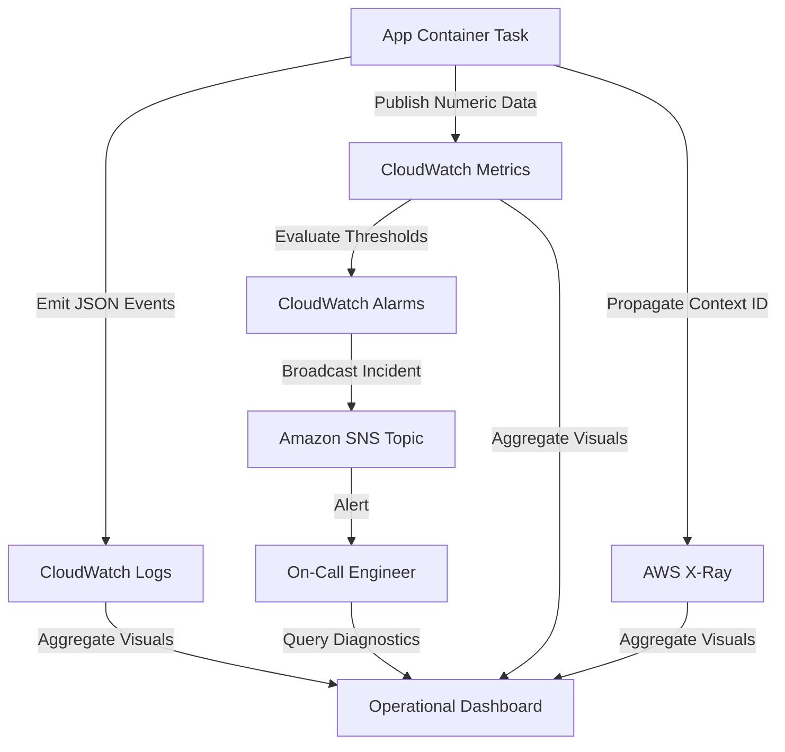
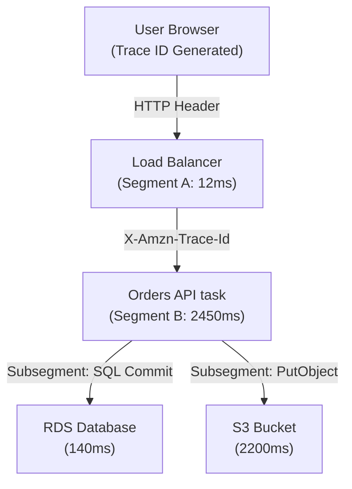

## Table of Contents

1. [The Localhost Visibility Illusion](#the-localhost-visibility-illusion)
2. [What Is Observability](#what-is-observability)
3. [The Three Pillars of Telemetry](#the-three-pillars-of-telemetry)
4. [Logs: Granular Event Details](#logs-granular-event-details)
5. [Metrics: System-Wide Trends](#metrics-system-wide-trends)
6. [Traces: Distributed Request Pathways](#traces-distributed-request-pathways)
7. [The Alerting Loop: Alarms and Auditing](#the-alerting-loop-alarms-and-auditing)
8. [Putting It All Together](#putting-it-all-together)
9. [What's Next](#whats-next)

## The Localhost Visibility Illusion

When you develop and run an application on your local laptop, understanding its runtime behavior is straightforward and immediate. You write code, execute a startup command, and watch standard output logs print directly into your terminal screen in real time. If a route returns an error, you open your browser's developer tools network tab to inspect the payload, attach an active debugger to pause execution at a specific breakpoint, or print variables directly to the terminal. The application process, database connection, configuration environment, and output destination are all contained within a single, unified machine under your direct physical observation.

However, once you deploy that application to a distributed cloud environment on AWS, this localhost visibility illusion disappears. The single user action of placing an order is no longer handled by a single local process. The transaction traverses multiple isolated private networks, serverless container tasks, queueing networks, databases, and event buses:

* An API Gateway accepts the public request, processes authentication, and routes the payload.
* An ECS container task polls the queue or receives the load-balanced HTTP request, processes checkout logic, and writes data.
* A private RDS database instance handles the transactional SQL commit.
* An S3 bucket stores the generated receipt PDF.
* An SQS queue buffers background email notification jobs.
* An isolated AWS Lambda function consumes messages from the queue and integrates with an external mail gateway.

When a customer clicks "Place Order" and faces an infinite loading screen or receives a generic `500 Internal Server Error`, you cannot attach a local debugger to production systems. There is no unified terminal screen to watch. The virtual container hosts are private, ephemeral, and frequently replaced during deployments, meaning any logs written to the server's local disk vanish forever. If you try to diagnose failures by guessing which AWS service is broken, you enter a high-risk cycle of blind troubleshooting. To operate distributed cloud applications successfully, you must transition from local terminal snooping to a structured practice of cloud observability.

## What Is Observability

Observability is the architectural practice of collecting, organizing, and correlating external outputs, also known as telemetry, from a running system so that your engineering team can answer unexpected operational questions about its internal state. In plain English, observability means building a system that leaves enough structured evidence in the background so that you can explain *why* a production failure happened without having to reproduce the bug or make guesses.

Observability is not about installing a vendor dashboard tool and hoping it solves your problems. It is a deliberate engineering practice of instrumenting your application code and cloud infrastructure to emit meaningful signals. A log line that simply reads `database error` is a weak signal that forces an engineer to search codebases. A high-quality signal is a structured record that names the failing host, the specific query, the latency in milliseconds, the active database connection count, and a unique correlation ID.

To organize these signals, AWS provides Amazon CloudWatch, which acts as the central cloud vault for logs, metrics, dashboards, and automated alarms. AWS also provides AWS X-Ray to handle distributed trace correlation. By treating these signals not as individual feature checklists, but as a unified map of operational questions, you ensure that every production incident can be systematically deconstructed and resolved.



## The Three Pillars of Telemetry

Every operational question you ask about a running system requires a different level of detail, aggregation, and pathway correlation. To choose the right tool for the job, you must classify your telemetry into the Three Pillars of Observability:

* **Logs (Granular Details)**: Chronological records of discrete events written by your code or AWS services. They are the most granular source of truth, capturing exact error messages, stack traces, transaction payloads, and execution parameters. Logs answer: *What exact event happened at this specific millisecond?*
* **Metrics (System-Wide Trends)**: Numeric values aggregated over specific time intervals, such as average latency, CPU utilization, or error counts. Metrics are highly compressed, cheap to store, and instantly queryable at scale, making them the primary source for real-time health dashboards and automated threshold alerts. Metrics answer: *How much, how often, and how bad is the performance across the entire fleet?*
* **Traces (Distributed Pathways)**: Correlated timing records that map the end-to-end journey of a single user request as it hops across separate microservices, network interfaces, and database boundaries. Traces answer: *Where did this specific transaction spend its execution time, and which downstream hop introduced the bottleneck?*

Choosing the wrong telemetry shape for a query creates massive operational friction. Trying to calculate system latency trends over three months by parsing raw text log lines requires expensive, slow log searches that can cost thousands of dollars in query fees. Conversely, trying to diagnose the root cause of a specific database deadlock using only high-level CPU metric graphs is impossible because metrics compress details away. A mature cloud architecture utilizes all three signals, using each to answer a distinct stage of an incident.

Telemetry Shape Matrix:

| Telemetry Type | Data Structure | Data Volume | Storage Cost | Primary Operational Job | Common Architectural Mistake |
| :--- | :--- | :--- | :--- | :--- | :--- |
| **Logs** | Rich JSON objects | Very High | High | Granular transaction debugging, error stack traces, execution audits. | Storing verbose unstructured text lines without searchable keys. |
| **Metrics** | Aggregated time-series numbers | Low | Very Low | Real-time health monitoring, capacity planning, instant auto-scaling alarms. | Relying on simple fleet averages that hide painful tail latencies. |
| **Traces** | Correlated span dependency trees | Medium | Medium | Isolating bottlenecks and database locks across distributed microservices. | Deploying tracing before defining consistent transaction context headers. |

## Logs: Granular Event Details

Logs are the foundation of cloud visibility because they preserve the raw, historical truth of individual execution paths. When an application process crashes or an API returns a bad status code, the logs are the exact place where the guest OS, container engine, or application runtime prints the diagnostic evidence.

However, in a scaled cloud environment, traditional unstructured plain-text logs (such as writing `[INFO] user checkout succeeded`) become an operational liability. When ten separate container tasks write unstructured strings to the same destination simultaneously, searching for a specific customer's transaction requires complex regular expressions that are slow to execute and prone to failing on multiline stack traces.

To make logs highly queryable and machine-readable, you must write structured logs. Structured logging is the practice of formatting every log event as a flat JSON object:

```json
{
  "level": "ERROR",
  "timestamp": "2026-05-25T22:53:15.042Z",
  "service": "orders-api",
  "route": "POST /checkout",
  "requestId": "req-7b91",
  "orderId": "order-1042",
  "customerId": "cust-882",
  "durationMs": 2450,
  "dependency": "rds",
  "message": "database transaction failed",
  "error": "connection timeout pool exhausted"
}
```

By packaging log events as structured JSON, Amazon CloudWatch Logs automatically indexes every key-value pair. During a production outage, an engineer does not have to scan text lines manually. They can use CloudWatch Logs Insights to execute high-performance queries instantly filtering by specific attributes, such as locating all `ERROR` logs where `durationMs > 2000` cabled to the `orders-api` service. This transforms logs from passive text storage into a searchable, relational database of active system evidence.

## Metrics: System-Wide Trends

While logs are invaluable for debugging a specific transaction, they are too heavy and expensive to use for real-time, high-level health monitoring across thousands of concurrent users. To watch the overall health of your fleet constantly, you use metrics.

Metrics compress raw system events into time-series numeric values published under a specific Namespace (such as `AWS/ECS` or `Custom/Application`). A metric is uniquely identified by three variables:

* **Metric Name**: The specific telemetry item being measured (such as `CPUUtilization`, `HTTP5xxCount`, or `OrdersProcessed`).
* **Dimensions**: Key-value metadata pairs that partition and categorize the metric data (such as `Environment=Production` and `ServiceName=orders-api`). Dimensions allow you to slice and isolate your metrics (e.g., viewing CPU usage for a single container task vs. the average across the entire cluster).
* **Timestamp & Value**: The numeric measurement recorded at a specific interval.

When evaluating metrics, a common beginner trap is relying entirely on average statistics (such as average latency). In a production environment, if 95% of your users experience a sub-millisecond response time but 5% face a painful 10-second hang, the average metric will look perfectly healthy. 

To detect these hidden failures, you must monitor percentiles. Percentile metrics (such as the 95th percentile, or **p95**, and 99th percentile, or **p99**) show the worst-performing tail latencies. If the average latency stays at 100ms but the p95 latency spikes to 8000ms, you instantly know that a significant group of your customers is experiencing severe performance degradation.

## Traces: Distributed Request Pathways

In a distributed cloud architecture, a single user click can trigger a cascading series of network requests across separate systems. If a customer places an order and the transaction takes a painful 8 seconds, looking at independent log files or metric charts for each service will show that every individual component is healthy, but the collective user experience is broken.

Distributed tracing solves this diagnostic blindspot by establishing request correlation. Tracing follows the path of a request through the network using a shared identity:

1. **Trace ID Generation**: The public entry point (such as an Application Load Balancer or API Gateway) generates a unique trace ID and injects it into the request headers.
2. **Context Propagation**: As the request hops across microservices, network queues (like SQS), and databases, each service parses the incoming trace header, appends its own execution metadata, and propagates the trace header in every outgoing HTTP call.
3. **Span Collection**: Each service sends its local timing block (a span representing a specific segment of work, such as a database query or file upload) to a central tracer like AWS X-Ray.
4. **Service Map Compilation**: The tracing platform correlates all spans sharing the same trace ID into a single visual dependency tree and interactive service map.



This request correlation transforms distributed blindspots into a clear timeline. If the checkout process slows down, a trace instantly reveals that the orders API was held up for 2.2 seconds because it was waiting for the S3 receipt PDF write, rather than being delayed by database execution or network routing.

## The Alerting Loop: Alarms and Auditing

Observability is useless if your engineering team must watch graphs and query logs 24 hours a day. The final layer of a resilient observability architecture is the automated alerting loop, which consists of two distinct components: runtime alarms and audit trails.

### CloudWatch Alarms: Actionable Alerts
Alarms watch a specific metric or mathematical expression and automatically transition between three states:
* **OK**: The metric is within healthy, expected thresholds.
* **ALARM**: The metric has violated the configured threshold for a defined number of evaluation periods (e.g., the p95 latency exceeds 2000ms for 3 consecutive 1-minute periods).
* **INSUFFICIENT_DATA**: The metric is not publishing data points, indicating a potential telemetry collection failure.

To prevent alert fatigue, alarms must only trigger on actionable, user-impacting thresholds. Setting an alarm to page an engineer at 3:00 AM because an EC2 instance's CPU briefly touched 90% for a single second creates noise that leads to operators ignoring alerts. 

Instead, alarms should alert on sustained, user-facing anomalies (such as a sustained spike in `HTTP5xx` counts or target group health failures) and route notifications through an Amazon Simple Notification Service (SNS) topic to paging systems like PagerDuty or Slack channels.

### AWS CloudTrail: The Audit Trail
While CloudWatch tracks the runtime behavior of your application code and virtual resources (what the system is *doing*), AWS CloudTrail tracks the administrative API activity within your AWS account (who changed *what*).

If your application database suddenly becomes unreachable, CloudWatch logs and metrics will show connection failures and timeout errors. However, to discover *why* the connection dropped, you check CloudTrail. CloudTrail records every API call made by developers, IAM users, or automated deployment scripts, detailing the caller identity, source IP, time, and target resource. 

If CloudTrail reveals that an automated deploy script modified the database security group rules at the exact millisecond the timeouts began, you have located the root cause of the incident.

## Putting It All Together

Observability is the architectural practice that bridges the massive physical distance between your laptop during development and your distributed systems running in the cloud:

* **Acknowledge the Ephemeral Nature of Cloud Compute**: Never save application logs to local server disks. Treat all compute as temporary and ship telemetry immediately to external regional endpoints.
* **Isolate Telemetry by Its Primary Job**: Use logs for granular event details, metrics for system-wide performance trends, and traces for distributed transaction timelines.
* **Embrace Structured Logging**: Format all application outputs as flat JSON to make them instantly searchable and queryable via high-performance engines like Logs Insights.
* **Alert on User Impact, Not Noise**: Monitor tail latencies (p95/p99 percentiles) rather than simple averages, configure conservative evaluation periods, and pair alarms with audit trails like CloudTrail to locate root causes.

By systematically instrumenting your cloud resources, propagating transaction context across network hops, and routing alerts to actionable endpoints, you construct a production environment that is highly transparent, predictable, and simple to debug under pressure.

## What's Next

We now have a clean mental model for classifying cloud telemetry across logs, metrics, and traces. However, to implement this model effectively, we must master the primary source of granular engineering truth: logs. In the next article, we will go deep into CloudWatch Logs, deconstructing log groups, log streams, agent collection daemons, metric filters, and high-performance CloudWatch Logs Insights queries.

---

**References**

- [What is Amazon CloudWatch?](https://docs.aws.amazon.com/AmazonCloudWatch/latest/monitoring/WhatIsCloudWatch.html) - Central overview of AWS-native logs, metrics, dashboards, and system-wide visibility.
- [CloudWatch Metrics Concepts](https://docs.aws.amazon.com/AmazonCloudWatch/latest/monitoring/cloudwatch_concepts.html) - AWS documentation on namespaces, dimensions, statistics, periods, percentiles, and alarm thresholds.
- [AWS X-Ray Concepts](https://docs.aws.amazon.com/xray/latest/devguide/xray-concepts.html) - Technical guide to tracing, segments, subsegments, context propagation, and service topologies.
- [AWS CloudTrail Overview](https://docs.aws.amazon.com/awscloudtrail/latest/userguide/cloudtrail-user-guide.html) - Guide on logging and auditing AWS administrative account API calls and credential activities.
