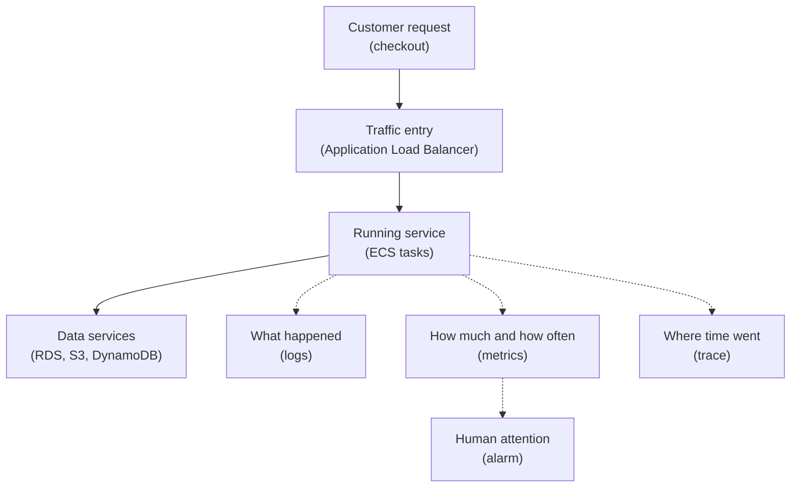

## Table of Contents

1. [When Production Stops Being Your Laptop](#when-production-stops-being-your-laptop)
2. [The Four Signals](#the-four-signals)
3. [The Running Example](#the-running-example)
4. [Logs Tell You What Happened](#logs-tell-you-what-happened)
5. [Metrics Tell You How Much](#metrics-tell-you-how-much)
6. [Traces Tell You Where Time Went](#traces-tell-you-where-time-went)
7. [Alarms Tell Humans When To Look](#alarms-tell-humans-when-to-look)
8. [Reading A Checkout Failure](#reading-a-checkout-failure)
9. [Tradeoffs And Signal Quality](#tradeoffs-and-signal-quality)

## When Production Stops Being Your Laptop

On your laptop, debugging feels close to the code.
You run `npm start`, reproduce the bug, add a `console.log`, refresh the browser, and watch the terminal.
The app, terminal, database, and request are all near you.

AWS changes that feeling.
The same backend may run as ECS tasks behind an Application Load Balancer.
It may read secrets from Secrets Manager, write records to RDS, put exports in S3, and store idempotency keys in DynamoDB.
No single terminal shows the whole story.

Observability is the practice of leaving useful signals behind so the team can understand a running system.
It exists because production systems are separated into many pieces.
When the checkout API fails, you need to know whether the problem is the app, the load balancer, the database, the queue, the function, or the permission boundary.

In AWS, many of those signals land in CloudWatch.
CloudWatch is AWS's main place for logs, metrics, alarms, and dashboards.
You will also see tracing through AWS X-Ray or OpenTelemetry, but the beginner mental model comes first.

This article follows `devpolaris-orders-api`, a Node.js checkout backend.
The service receives checkout requests, writes order records to RDS, writes receipt and export objects to S3, uses DynamoDB for idempotency and job status, and sometimes invokes Lambda side jobs.
The goal is not to memorize every AWS screen.
The goal is to know which kind of signal answers which kind of question.

> Observability is not about collecting everything. It is about collecting the signals you need to answer the next calm question.

Here is the first map.
Read it from top to bottom.
The request path is solid.
The signal path is dotted because it is evidence about the request, not the request itself.



The diagram is small on purpose.
A beginner does not need a huge observability platform diagram yet.
A beginner needs four reliable questions:
what happened, how much did it happen, where did the time go, and should a human look now?

## The Four Signals

Logs are timestamped events.
They say what happened at a particular moment.
An app log might say the checkout request started, the database insert failed, or the receipt upload succeeded.
Logs are good when you need details.

Metrics are numbers over time.
They say how much, how often, how fast, or how full something is.
An ALB metric might show a spike in HTTP 500 responses.
An ECS metric might show high CPU.
An RDS metric might show rising database connections.

Traces follow one request through multiple steps.
They show where time was spent and which downstream call slowed the request.
A trace for checkout might show the app received the request, called RDS, wrote an S3 receipt, and updated DynamoDB.

Alarms watch a metric or expression and change state when the signal crosses a rule.
An alarm is not the problem.
It is the system tapping someone on the shoulder and saying, "This needs attention."

The four signals answer different questions:

| Signal | Beginner Question | Example |
|--------|-------------------|---------|
| Logs | What happened? | `payment authorize failed` |
| Metrics | How much or how often? | `5xx responses increased` |
| Traces | Where did time go? | `RDS insert took most of the request` |
| Alarms | Should someone look now? | `checkout error rate stayed high` |

The mistake is expecting one signal to do every job.
Logs can show the exact error, but they are awkward for answering "is the whole service getting slower?"
Metrics are good for trends, but they often lack the request detail.
Traces are good for following one request, but they are usually sampled and are not a replacement for logs.
Alarms are useful for attention, but too many noisy alarms train people to ignore them.

You will use all four, but not all at the same moment.
During an incident, a common path is:
an alarm points at the symptom, a dashboard shows the shape, logs show the first useful error, and a trace shows which step was slow or failing.

## The Running Example

The `devpolaris-orders-api` service handles a checkout request like this:

1. The customer sends `POST /v1/orders`.
2. The Application Load Balancer forwards the request to an ECS task.
3. The Node.js app validates the cart and payment result.
4. The app writes the order to RDS.
5. The app stores an idempotency record in DynamoDB.
6. The app writes a receipt object to S3.
7. A Lambda side job may send a receipt email.

That is a small enough system to understand, but it already has several places where a request can fail.
The app can throw.
The database can reject a connection.
DynamoDB can reject a conditional write.
S3 can return `AccessDenied`.
Lambda can time out.
The load balancer can see an unhealthy target.

A healthy checkout should leave signals like these:

```text
request_id=req_01J8K2M6TK7S1E9R0Y6Q
route=POST /v1/orders
status=201
duration_ms=184
order_id=ord_8x7k2n
payment_status=authorized
rds_write_ms=42
dynamodb_write_ms=11
s3_receipt_ms=27
```

This is a log-shaped view.
It gives detail for one request.
It is useful because the request ID appears with the important steps.

The same request also contributes to metric-shaped signals:

| Metric Idea | What It Helps You See |
|-------------|-----------------------|
| Request count | Is traffic normal or unusual? |
| Error count | Are requests failing more often? |
| Latency | Are customers waiting longer? |
| Database connections | Is the app pressuring RDS? |
| Task CPU and memory | Are ECS tasks near resource pressure? |

The same request can also have trace-shaped evidence:

```text
trace checkout req_01J8K2M6TK7S1E9R0Y6Q

POST /v1/orders              184 ms
  validate cart                8 ms
  authorize payment           51 ms
  insert order in RDS         42 ms
  write idempotency item      11 ms
  write receipt to S3         27 ms
  build response               4 ms
```

This kind of view is valuable because it keeps the team from arguing from memory.
If checkout is slow, the trace gives a starting point.
Maybe the app is slow.
Maybe RDS is slow.
Maybe the S3 write is slow.
The trace gives you a map for one request.

## Logs Tell You What Happened

Logs are usually the first signal a developer understands.
You have seen `console.log`, stack traces, test output, and terminal errors.
Cloud logs are the same idea, but they need structure and a home.

In AWS, application logs often go to CloudWatch Logs.
An ECS task can send container output to a log group.
A Lambda function sends invocation logs to a log group.
The log group is the named container for related logs.
The log stream is usually one runtime source, such as one ECS task or one Lambda execution environment.

Good logs are not essays.
They are small facts written at useful moments.
For checkout, the team wants to know when the request started, which request ID it used, what downstream call failed, and what the app decided next.

Here is a useful error log:

```text
2026-05-02T09:42:18.411Z ERROR service=devpolaris-orders-api
request_id=req_01J8K2M6TK7S1E9R0Y6Q
route=POST /v1/orders
step=rds.insert_order
error_name=ConnectionTimeout
message="database connection timed out"
```

The important detail is not just the error message.
The log gives you the request, route, step, and failing dependency.
That means the next place to inspect is RDS connectivity and database pressure, not S3, Lambda, or the frontend.

A less useful log would say only this:

```text
checkout failed
```

That log is true, but it is too small.
It forces the next engineer to guess.
During a real incident, guessing is expensive because every minute can create more failed checkouts and more confused customers.

Good logs are written for the person who will read them later.
That person might be you, tired after a release, trying to find the first meaningful error.

## Metrics Tell You How Much

Metrics are numbers that change over time.
They help you see shape.
One error log tells you what happened once.
A metric tells you whether the error happened one time, one hundred times, or only for one target.

AWS services publish many metrics to CloudWatch.
An Application Load Balancer can show request count, target response time, and HTTP response categories.
ECS can show CPU and memory use.
RDS can show connections and database resource pressure.
DynamoDB can show request behavior and throttling signals.
Lambda can show errors, duration, and invocation counts.

The beginner habit is to connect metrics to questions:

| Question | Metric Direction |
|----------|------------------|
| Are customers failing checkout? | ALB 5xx responses and app error count |
| Is the app overloaded? | ECS CPU and memory |
| Is the database under pressure? | RDS connections and latency-related signals |
| Did a side job fail? | Lambda errors and duration |
| Is a table rejecting work? | DynamoDB error or throttle signals |

Metrics are strongest when they show change over time.
For example:

```text
checkout dashboard, last 15 minutes

request count:
  normal traffic

HTTP 5xx:
  increased at 09:40

target response time:
  rose from normal to slow at 09:41

RDS connections:
  rising before the 5xx spike
```

This does not prove the database is the root cause.
It gives you a direction.
The shape says checkout errors and database pressure moved together.
The next step is to read app logs around that time and check whether the database call failed or slowed down.

Metrics are also how many alarms work.
An alarm does not read your whole system like a human.
It watches a metric rule.
That is why choosing the right metric matters more than creating many alarms.

## Traces Tell You Where Time Went

A trace follows one request through its work.
For beginners, think of a trace as a timeline with named steps.
Each step is often called a span.
A span is one measured piece of work, such as "insert order in RDS" or "write receipt to S3."

You can learn the idea before learning a tracing tool.
Imagine one checkout request:

```text
request_id=req_01J8K2M6TK7S1E9R0Y6Q

POST /v1/orders                         184 ms
  validate cart                           8 ms
  call payment provider                  51 ms
  insert order in RDS                    42 ms
  write idempotency item in DynamoDB     11 ms
  write receipt object to S3             27 ms
  send response                           4 ms
```

If the whole request takes 184 ms, the trace helps you see where that time went.
Without it, the team may argue from guesses:
"It feels like the database."
"Maybe S3 is slow."
"Maybe the app is doing too much JSON work."

The trace does not replace logs.
It points you toward the slow or failing step.
Then logs explain the details inside that step.

In AWS, you may see AWS X-Ray for tracing, or you may use OpenTelemetry to create and export traces.
The tool matters, but the beginner idea is simpler:
give one request a way to be followed across services.

The most useful bridge between logs and traces is a shared request ID or trace ID.
If the same ID appears in app logs, Lambda logs, and trace data, the team can move from one view to another without losing the story.

## Alarms Tell Humans When To Look

An alarm is a rule that watches a signal and changes state when the signal looks unhealthy.
In CloudWatch, alarms commonly watch metrics.
For example, an alarm might watch checkout 5xx responses, Lambda errors, or RDS connection pressure.

Alarms exist because humans cannot stare at dashboards all day.
A dashboard is useful when you are already looking.
An alarm is useful when nobody is looking yet.

Good alarms are tied to user impact or real operational risk.
For `devpolaris-orders-api`, useful first alarms might be:

| Alarm | Why It Matters |
|-------|----------------|
| Checkout 5xx rate increased | Customers may be unable to place orders |
| ALB has no healthy targets | Traffic has nowhere safe to go |
| ECS tasks restart repeatedly | The app may be crashing after start |
| RDS connections stay high | Checkout may soon fail or slow down |
| Receipt Lambda errors increase | Orders may succeed but emails may not send |

Notice what is not on the list:
"CPU was briefly weird for one minute."
That may be worth seeing on a dashboard, but it may not deserve waking a person unless it connects to user impact or sustained risk.

Noisy alarms are dangerous in a quiet way.
If an alarm fires every day for harmless reasons, people stop trusting it.
Then, when the real incident arrives, the alarm looks like more noise.

A good alarm should make the first human question easier:
what changed, who is affected, and where should I look first?

## Reading A Checkout Failure

Now put the signals together.
The team sees checkout failures after a release.
The first sign is a CloudWatch alarm:

```text
ALARM: devpolaris-orders-api-checkout-5xx
state: ALARM
reason: HTTP 5xx responses increased for POST /v1/orders
time: 2026-05-02T09:42:00Z
```

The alarm tells you to look.
It does not tell you the root cause.

The dashboard gives the shape:

```text
09:38  deploy started
09:40  new ECS tasks became healthy
09:41  target response time rose
09:42  HTTP 5xx increased
09:42  RDS connections rose
```

The log gives the first useful error:

```text
2026-05-02T09:42:18.411Z ERROR service=devpolaris-orders-api
request_id=req_01J8K2M6TK7S1E9R0Y6Q
step=rds.insert_order
error_name=ConnectionTimeout
message="database connection timed out"
```

The trace shows where the request waited:

```text
POST /v1/orders              5020 ms
  validate cart                 6 ms
  authorize payment            44 ms
  insert order in RDS        4930 ms
  build error response          4 ms
```

Now the story is much clearer.
The alarm showed impact.
The metrics showed timing and system shape.
The log named the failing step.
The trace showed that most of the request time was spent waiting on RDS.

The next fix direction might be checking connection pool settings, database security group changes, database events, or a migration that changed query behavior.
The important part is that the team is no longer guessing.

## Tradeoffs And Signal Quality

More signals are not automatically better.
A service can log so much that useful errors become hard to find.
A dashboard can show so many charts that nobody knows which one matters.
Tracing can add overhead or cost if every tiny detail is captured without purpose.
Alarms can become background noise.

Good observability starts with the questions your team actually asks.
For `devpolaris-orders-api`, those questions are practical:
can customers place orders, are errors increasing, which dependency is failing, how slow is checkout, and which release changed behavior?

That gives you a starting standard:

| Signal | Keep It Useful By Asking |
|--------|--------------------------|
| Logs | Would this help me debug one failed request? |
| Metrics | Would this show service health over time? |
| Traces | Would this show where one request spent time? |
| Alarms | Would this tell a human to look at real risk? |

There is also a cost tradeoff.
Logs are stored.
Metrics are stored.
Traces are stored or sampled.
Dashboards and alarms take human attention.
Retention settings decide how long signals stay available.

The beginner goal is not a perfect observability platform.
The goal is a service that leaves enough evidence for a calm investigation.
When a checkout fails, you should be able to say:
which request failed, which component complained first, whether the problem is isolated or widespread, and what the next check should be.

That is observability doing its job.

---

**References**

- [What is Amazon CloudWatch?](https://docs.aws.amazon.com/AmazonCloudWatch/latest/monitoring/WhatIsCloudWatch.html) - Official AWS overview for CloudWatch metrics, logs, alarms, dashboards, and events.
- [Working with log groups and log streams](https://docs.aws.amazon.com/AmazonCloudWatch/latest/logs/Working-with-log-groups-and-streams.html) - Explains the basic CloudWatch Logs containers that application and service logs use.
- [Using Amazon CloudWatch alarms](https://docs.aws.amazon.com/AmazonCloudWatch/latest/monitoring/AlarmThatSendsEmail.html) - Describes how CloudWatch alarms watch metrics and change state.
- [What is AWS X-Ray?](https://docs.aws.amazon.com/xray/latest/devguide/aws-xray.html) - Introduces AWS tracing concepts for following requests through distributed applications.
