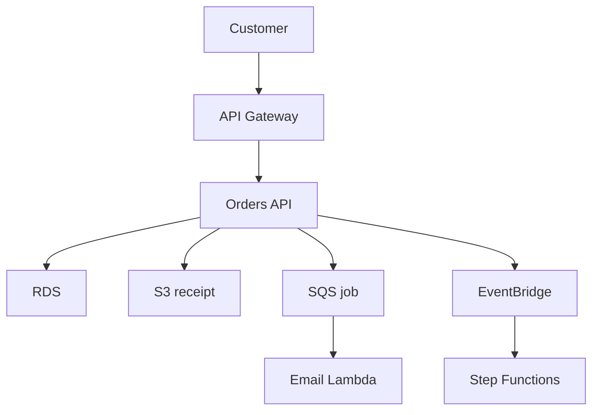
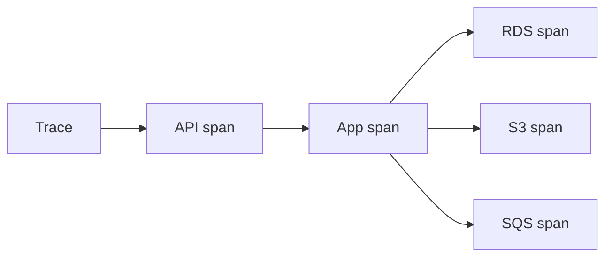

## Table of Contents

1. [The Problem](#the-problem)
2. [What Is Observability](#what-is-observability)
3. [The Four Signals](#the-four-signals)
4. [The Running Example](#the-running-example)
5. [Logs](#logs)
6. [Metrics](#metrics)
7. [Traces](#traces)
8. [Alarms](#alarms)
9. [Runtime And Audit Evidence](#runtime-and-audit-evidence)
10. [Reading A Checkout Failure](#reading-a-checkout-failure)
11. [Tradeoffs And Signal Quality](#tradeoffs-and-signal-quality)
12. [Putting It All Together](#putting-it-all-together)
13. [What's Next](#whats-next)

## The Problem

On your laptop, debugging feels close to the code. You run the server, reproduce the bug, add a log line, refresh the browser, and watch the terminal. The app, request, database, and output are all near you.

AWS changes that feeling. The same checkout request may pass through API Gateway, an ECS task, RDS, S3, DynamoDB, SQS, EventBridge, and a Lambda function. Some work happens while the user waits. Some work happens later. Some work happens in a different service that the original developer did not write.

Then the system fails in ways a browser cannot explain:

- Checkout returns `500`, but the app task was replaced during the deploy.
- The API looks healthy, but customers report slow responses during payment.
- Receipt emails are missing, and the work may be in a queue, Lambda, or an external provider.
- A new alarm fires, but nobody knows whether it represents user impact or harmless noise.
- A role or route changed yesterday, and the team needs to know whether that change belongs to the incident.

Observability is the answer to that distance. It is the habit of leaving useful evidence in the system so a team can explain production behavior without guessing.

## What Is Observability

Observability is the practice of collecting and connecting signals from a running system so engineers can answer operational questions. It is not just "turn on CloudWatch" and it is not collecting every possible event forever.

The useful beginner question is simple: if this system behaves differently in production, what evidence will tell us what happened?

For an AWS application, observability usually starts with CloudWatch because CloudWatch is the AWS service family for many logs, metrics, alarms, dashboards, and application monitoring views. But the service is only the home for evidence. The application still has to create useful evidence. A log that says `error` is weak. A log that names the request, route, dependency, status, and correlation ID gives the next engineer a path.

Think of observability as a map of questions:

| Question | Useful signal |
| --- | --- |
| What exactly happened in this request or worker? | Logs |
| How often is this happening, and how bad is the shape? | Metrics |
| Where did one request spend time across services? | Traces |
| When should a human stop what they are doing? | Alarms |
| Who changed an AWS resource or called an AWS API? | CloudTrail audit events |

The gotcha is that these signals do not replace each other. A metric can show that errors increased. A log can show the first concrete error. A trace can show where one request slowed down. An alarm can bring a person to the problem. CloudTrail can show that a deployment role changed a load balancer or policy. The investigation becomes calmer when each signal has a job.

## The Four Signals

A beginner does not need a huge observability platform diagram yet. Start with four runtime signals.

Logs are timestamped records of things that happened. They are best for details: request IDs, error messages, order IDs, dependency names, status codes, and stack traces. Logs answer "what happened here?"

Metrics are numbers recorded over time. They are best for shape: request count, error rate, latency, CPU, memory, queue age, Lambda errors, RDS connections, and DynamoDB throttling. Metrics answer "how much, how often, and how bad?"

Traces connect steps in one unit of work. They are best for path and timing: API Gateway received the request, ECS handled it, RDS took 40 ms, S3 took 900 ms, and a downstream call failed. Traces answer "where did this request go?"

Alarms watch metrics or expressions and change state when a condition stays true. They are best for attention. Alarms answer "does a human need to look now?"

Those four signals are related, but their first jobs are different:

| Signal | First job | Common mistake |
| --- | --- | --- |
| Logs | Preserve concrete events | Logging too much text with no searchable fields |
| Metrics | Show trends and pressure | Watching averages that hide painful tail latency |
| Traces | Connect one path | Adding tracing before requests have stable names |
| Alarms | Interrupt for action | Alerting on noise nobody can act on |

Good observability starts when the team agrees which signal answers the next question.

## The Running Example

This module follows `devpolaris-orders-api`, a small checkout system.



The customer sees one action: place an order. AWS sees many resources. The application creates a record in RDS, writes a receipt artifact to S3, queues email work, emits an order event, and may start a workflow.

Observability is what lets the team keep that path understandable after the system is running. The team should be able to ask:

| Need | Evidence |
| --- | --- |
| Did the request reach the API? | API and application logs, request count |
| Did customer impact rise? | Error rate, latency, availability metrics |
| Which dependency was slow? | Trace spans or correlated logs |
| Did background work fall behind? | SQS depth and age metrics, worker logs |
| Did a recent change matter? | Deploy records, CloudTrail events, config history |

This article is the map. The next articles go deeper into the main signals.

## Logs

Logs are the most familiar signal because they look like what developers already see in a local terminal. In AWS, the important change is location. The terminal is gone. The container, function, or instance may be replaced. Logs need a durable home outside the runtime.

CloudWatch Logs stores log events inside log streams, and log streams live inside log groups. A log group usually represents an application, function, service, or operational boundary. The log group owns settings such as retention and access control. That means log design is also operational design.

A useful checkout log does not need to be huge:

```json
{
  "level": "ERROR",
  "service": "orders-api",
  "route": "POST /checkout",
  "requestId": "req-7b91",
  "orderId": "order-1042",
  "dependency": "rds",
  "message": "failed to commit order",
  "error": "connection timeout"
}
```

Notice the searchable fields. The next engineer can search by `requestId`, `orderId`, `route`, `dependency`, or `level`. The log names the failing dependency without exposing secrets or payment details.

The gotcha is that logs are not free storage and not a safe place for private data. More logs can help, but logs with no structure become a pile. Logs with secrets become a security problem. Logs with no retention plan become a cost and compliance problem.

## Metrics

Metrics turn behavior into numbers over time. They help you see shape before reading details.

If checkout fails once, logs may be enough. If checkout is failing for many users, the team needs to know the size and direction of the problem. Is request volume rising? Did the 5xx rate jump? Is p95 latency high? Did queue age climb? Are ECS tasks out of CPU? Are database connections near the limit?

CloudWatch metrics use names, namespaces, dimensions, periods, and statistics. That sounds abstract until you treat it like addressable evidence.

| Metric idea | Plain meaning |
| --- | --- |
| Namespace | The metric family, such as `AWS/Lambda` or `AWS/RDS` |
| Metric name | The measured thing, such as `Errors` or `CPUUtilization` |
| Dimension | The resource or slice, such as function name or DB instance |
| Period | The time bucket, such as 1 minute or 5 minutes |
| Statistic | How values are summarized, such as average, sum, max, or p95 |

The statistic choice matters. Average latency can look fine while a small group of users sees painful waits. Percentiles, such as p95, often show the slow tail better than an average.

Metrics are strongest when they start from user impact and then move inward. First ask whether customers are seeing errors or slow responses. Then ask which layer is under pressure.

## Traces

Traces show the path of one unit of work across services. A trace is useful when "the system is slow" needs to become "this request spent most of its time waiting on the receipt upload" or "the Lambda side job retried the email provider."

Tracing depends on identity. One request needs a shared name as it moves through the system. That name may appear as a correlation ID, request ID, or trace ID. Without shared identity, the team gets fragments: one API log, one RDS metric, one Lambda log, and no proof that they belong together.

A trace is usually made of spans. Each span represents one piece of work, such as handling an HTTP route, calling RDS, writing to S3, or publishing an event. Parent-child relationships show how the work fits together.



The gotcha is that traces are sampled and instrumentation-dependent. You may not have every request. You may not have every downstream call. Tracing improves the investigation when the application propagates context consistently and logs still carry useful fields.

## Alarms

Alarms exist because humans cannot stare at dashboards all day. A CloudWatch alarm watches a metric or expression over time and changes state when the condition is met.

The best alarms are tied to user impact or real operational risk. They should tell someone that action may be needed, not merely that a number moved.

For the orders system, useful early alarms might include:

| Alarm | Why it matters |
| --- | --- |
| High API 5xx rate | Customers are seeing failures |
| High p95 checkout latency | Customers are waiting too long |
| No healthy targets | The load balancer cannot trust app tasks |
| High SQS age | Background work is falling behind |
| RDS connection pressure | The database may become the bottleneck |

Noisy alarms are dangerous in a quiet way. If an alarm fires often and rarely requires action, people learn to ignore it. If every small fluctuation becomes a page, the team loses trust in the system.

Good alarms have owners, context, and a first place to look. "5xx high on orders API, check API logs and target health" is better than "CPU above threshold" with no service context.

## Runtime And Audit Evidence

Runtime observability explains what the running application is doing. Audit evidence explains who or what changed AWS resources and called AWS APIs.

CloudWatch and CloudTrail often appear together during incidents, but they answer different questions.

| Evidence | Best question |
| --- | --- |
| CloudWatch Logs | What did the application or service report at runtime? |
| CloudWatch Metrics | How did resource or application behavior change over time? |
| CloudWatch Alarms | Which monitored condition crossed a threshold? |
| CloudTrail | Which identity called which AWS API, against which resource, and when? |

If checkout fails because the app cannot connect to RDS, CloudWatch logs and metrics help explain the runtime symptom. If a security group rule changed before the failure, CloudTrail helps show who or what made that change.

This distinction prevents a common mistake: looking for application stack traces in CloudTrail or looking for IAM API caller history in application logs. Both are evidence. They just belong to different questions.

## Reading A Checkout Failure

Imagine checkout starts failing at 12:40.

The first useful question is not "which AWS service is broken?" It is "what changed for customers?" Start with user-impact metrics: request count, 5xx rate, and latency for the checkout path. If only one request failed, the investigation can be narrow. If failures climbed across many requests, the team needs a wider view.

Next, use logs to find a concrete error. Search the orders API log group around 12:40 for the route and correlation ID if one exists. A log that names `rds connection timeout` moves the investigation toward the database path. A log that names `access denied` moves it toward permissions. A log that names `sqs send failed` moves it toward background work.

Then use traces or correlated logs to connect steps. Did the request spend time in the app before RDS? Did it succeed in RDS but fail writing the receipt to S3? Did it publish a message but the email Lambda failed later?

Finally, check audit evidence when the shape suggests a recent change. CloudTrail can show whether a role, security group, Lambda configuration, or route changed around the failure window.

The goal is not to follow a memorized runbook. The goal is to let each signal answer the next useful question.

## Tradeoffs And Signal Quality

Observability has tradeoffs.

More data can help, but every signal has cost, storage, privacy, and attention consequences. A high-cardinality custom metric can create many unique time series. A verbose log line can leak private data. A trace sampled too lightly can miss rare failures. An alarm with no owner can become background noise.

Signal quality is the habit of asking whether evidence will be useful later:

| Signal choice | Better habit |
| --- | --- |
| Log every object payload | Log identifiers, status, and safe context |
| Graph every metric | Start with user impact, then dependencies |
| Trace only the easy path | Propagate context across queues and events |
| Page on every warning | Alert on sustained impact or real risk |
| Keep logs forever by default | Set retention based on operational and compliance needs |

The best observability is boring in the right way. When something fails, the evidence is already there, safe to search, and connected enough that the team can move calmly.

## Putting It All Together

The opening problem was distance. Production spread one checkout request across managed services, containers, databases, queues, events, and functions. The browser could only say that something went wrong.

Observability gives that distributed system an evidence path. Logs preserve concrete runtime events. Metrics show shape and pressure. Traces connect one unit of work across services. Alarms bring humans to sustained impact. CloudTrail adds audit evidence when the question is who changed what in AWS.

The design is healthy when every important production question has a signal that can answer it, and when those signals are safe, searchable, and connected.

## What's Next

The next article starts with the most familiar signal: logs. It explains CloudWatch Logs, log groups, log streams, structured events, search, retention, and the first useful error.

---

**References**

- [What is Amazon CloudWatch?](https://docs.aws.amazon.com/AmazonCloudWatch/latest/monitoring/WhatIsCloudWatch.html). Supports the CloudWatch role for metrics, logs, alarms, dashboards, and operational visibility.
- [Metrics concepts](https://docs.aws.amazon.com/AmazonCloudWatch/latest/monitoring/cloudwatch_concepts.html). Supports the metric model of namespaces, dimensions, statistics, periods, percentiles, and alarms.
- [What Is AWS CloudTrail?](https://docs.aws.amazon.com/awscloudtrail/latest/userguide/cloudtrail-user-guide.html). Supports the distinction between runtime observability and AWS account/API audit evidence.
- [AWS X-Ray concepts](https://docs.aws.amazon.com/xray/latest/devguide/xray-concepts.html). Supports the trace, segment, subsegment, service graph, and sampling concepts used in the tracing overview.
