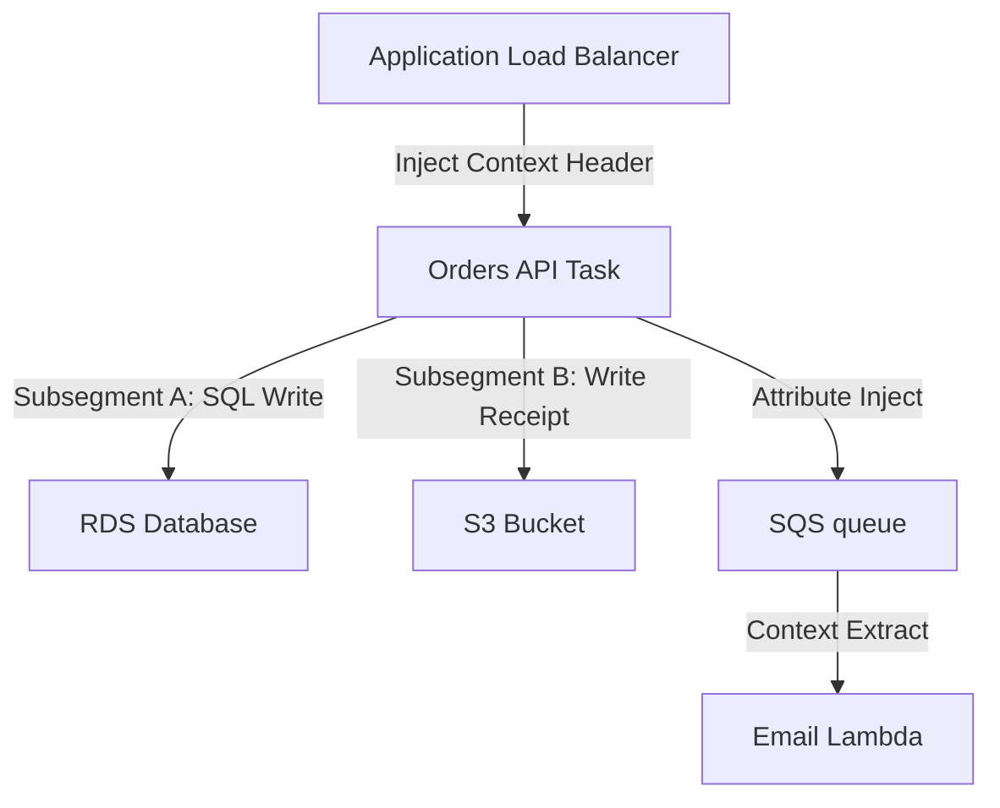

## Table of Contents

1. [The Distributed Silent Wait](#the-distributed-silent-wait)
2. [Correlation IDs vs. Distributed Tracing](#correlation-ids-vs-distributed-tracing)
3. [The Trace Context batons](#the-trace-context-batons)
4. [Spans: Segments and Subsegments](#spans-segments-and-subsegments)
5. [Tracing Across Asynchronous Queue Boundaries](#tracing-across-asynchronous-queue-boundaries)
6. [The OpenTelemetry Portability Standard](#the-opentelemetry-portability-standard)
7. [Visualizing Topologies: X-Ray Service Maps](#visualizing-topologies-x-ray-service-maps)
8. [Connecting Traces Directly to Logs](#connecting-traces-directly-to-logs)
9. [Trace Sampling Rules and Cost Controls](#trace-sampling-rules-and-cost-controls)
10. [Putting It All Together](#putting-it-all-together)

## The Distributed Silent Wait

When an application runs on a local machine, debugging a slow transaction is straightforward. Since every operation executes within a single process on a single database connection, you can trace performance bottlenecks using a local profiler or standard timestamp logs. 

However, in a distributed cloud architecture, this simplicity is completely lost. When a customer places an order and waits a painful 8 seconds before receiving a generic gateway timeout error, your independent telemetry systems fall blind:

* The API Gateway metrics report a successful request transfer to the application layer.
* The ECS backend container logs report that checkout processing started, followed 8 seconds later by a transaction abort.
* The RDS database metrics show a brief connection spike, but no long-running SQL queries.
* The S3 buckets report standard API execution speeds.
* The background SQS queue successfully accepted a receipt notification job.
* The Lambda email function executed successfully in the background.

Every isolated team looks at their own charts and log files, declares their system healthy, and blames the other components. Because you have no way to correlate independent signals across network boundaries, the 8-second delay remains a mystery. 

You need a systematic way to trace the end-to-end journey of a single request through the network, measuring the exact execution duration contributed by each microservice, queue, and database hop.

## Correlation IDs vs. Distributed Tracing

To bridge this operational disconnect, you must establish request correlation. The simplest entry point to request correlation is the Correlation ID:

* **Correlation ID**: A unique, non-meaningful string (such as `req-7b91` generated via UUID) created at the public ingress edge of your network (such as the load balancer or API Gateway). This ID is injected into the incoming request context and passed to every subsequent log line and database call. Standardizing on correlation IDs ensures that a responder can search a centralized log manager for `requestId = "req-7b91"` and instantly read the chronological story of that transaction in order, regardless of which container task wrote the log lines.
* **Distributed Tracing**: An advanced, standardized extension of correlation IDs. While a correlation ID connects text log lines, distributed tracing records the exact timing, parent-child relationships, and network boundaries crossed by the transaction. It maps the request path as an active call tree, measuring not just *what* happened, but *where* latency was introduced.



By transitioning from simple correlation strings to active distributed tracing, you transform isolated, disjointed log files into a cohesive visual timeline that exposes the exact origin of latency and errors.

## The Trace Context batons

Distributed tracing is made possible by context propagation. You can think of trace context like a relay baton passed between runners in a race. If one service drops the baton, the tracing chain breaks, resulting in disconnected single-hop fragments instead of a single, continuous end-to-end trace.

In the AWS ecosystem, trace context is propagated using the `X-Amzn-Trace-Id` HTTP header. The header contains three key attributes separated by semicolons:

* **Root**: The unique trace ID representing the entire distributed transaction (such as `1-5759e988-bd862e3fe1be46a994272793`).
* **Parent**: The ID of the specific span or service boundary that initiated the current operation (such as `53995c3f42cd8ad8`).
* **Sampled**: A binary flag (`1` for sampled, `0` for unsampled) indicating whether downstream services must collect and publish timing telemetry for this transaction.

Structure of the `X-Amzn-Trace-Id` Context Header:

```http
X-Amzn-Trace-Id: Root=1-5759e988-bd862e3fe1be46a994272793;Parent=53995c3f42cd8ad8;Sampled=1
```

For tracing to succeed across a microservice fleet, every HTTP client, gRPC interface, and SDK wrapper must be configured to automatically intercept, parse, and inject this context header on every outbound network call.

## Spans: Segments and Subsegments

A distributed trace is structurally modeled as a directed acyclic graph of spans. A span is a single, named unit of work containing a start time, an end time, parent-child relationships, and metadata attributes (like `http.status_code` or `db.system`). 

AWS X-Ray categorizes spans into two distinct structural types:

* **Segment**: Represents the overall execution boundary of a single service component (such as the orders API or the email worker). The segment captures the service's internal startup latencies, guest OS overhead, and total network duration.
* **Subsegment**: Represents isolated blocks of work *within* that service segment. You use subsegments to isolate external database queries (e.g., measuring an RDS SQL query duration), S3 bucket API writes, or third-party payment gateway SDK calls.

By wrapping downstream database and storage calls in dedicated subsegments, you can pinpoint the exact block of code causing a delay. If the overall orders API segment took 2.5 seconds, subsegments instantly reveal that 2.2 seconds were spent waiting for a specific S3 object write, while the RDS SQL commit took only 40 milliseconds.

## Tracing Across Asynchronous Queue Boundaries

Asynchronous messaging queues (like SQS) and event routers (like SNS or EventBridge) break the synchronous HTTP request-response path. The producer publishes a message and exits immediately; the message may sit in the queue for several seconds or minutes before a worker consumes it.

To prevent the trace from breaking at these asynchronous boundaries, you must configure trace context injection and extraction:

* **In SQS Messages**: You inject the `X-Amzn-Trace-Id` as a Message Attribute in the SQS envelope rather than placing it in the message body. When the consumer polls the queue, the tracer extracts the trace ID from the attributes, continues the parent trace, and creates a new consumer segment.
* **In EventBridge Events**: The trace context is cabled directly into the `detail` envelope of the JSON event payload, ensuring downstream Step Functions or Lambda handlers can reconstruct the initiating event's correlation ID.

By deliberately passing trace context across message queues, you can trace a transaction from a customer's browser click all the way through background asynchronous email delivery, capturing the total end-to-end processing latency.

## The OpenTelemetry Portability Standard

When instrumenting your applications for distributed tracing, you must select the appropriate SDK and telemetry standard:

* **The Maintenance Stance (Older X-Ray SDKs)**: The legacy AWS X-Ray SDKs and the host X-Ray daemon entered official maintenance mode on February 25, 2026. AWS strongly advises against using these older libraries for new application deployments.
* **The Forward-Looking Standard (OpenTelemetry)**: OpenTelemetry (OTel) is the open-source, vendor-neutral industry standard for instrumenting, collecting, and exporting traces, metrics, and logs. AWS distributes the AWS Distro for OpenTelemetry (ADOT), which is a secure, production-grade distribution of the OTel SDK and collector optimized for AWS systems.

By standardizing on OpenTelemetry, you ensure that your application instrumentation remains highly portable. Your code simply calls OTel APIs to emit standard traces, and you can route that data to CloudWatch Logs, AWS X-Ray, or any other telemetry backend without changing a single line of code.

## Visualizing Topologies: X-Ray Service Maps

Once your microservice fleet is instrumented with OpenTelemetry, AWS X-Ray aggregates the span data to generate an interactive, real-time Service Map. 

The service map automatically renders your entire architecture as a node topology. Each service component (ALB, container task, database, queue) is represented as a node, and request flows are rendered as edges:

* **Dynamic Traffic Coloring**: Nodes are visually colored to represent execution success (green for `2xx` responses, red for `5xx` errors, yellow for `4xx` client errors, and purple for throttles).
* **Latency Percentiles**: Edges display the latency percentiles (such as p50, p90, and p95) between service calls, allowing you to instantly isolate where network delay is introduced.

During a cascading outage, the service map is an invaluable tool. It allows you to ignore healthy nodes and instantly locate the specific downstream database or third-party API gateway that has turned red and is propagating latency up the call chain.

## Connecting Traces Directly to Logs

Tracing tells you which service is slow, but it cannot replace the granular error stack traces held in your log files. To create a seamless debugging workflow, you must connect your traces directly to your structured JSON logs.

You achieve this by configuring your application logging framework to automatically inject the active X-Ray `TraceId` and `SpanId` into every JSON log line:

```json
{
  "timestamp": "2026-05-25T22:53:15.042Z",
  "level": "ERROR",
  "traceId": "1-5759e988-bd862e3fe1be46a994272793",
  "spanId": "53995c3f42cd8ad8",
  "service": "orders-api",
  "message": "checkout failed due to RDS database connection timeout"
}
```

By linking trace IDs to structured logs, tools like CloudWatch ServiceLens enable trace-to-log mapping. When viewing a slow, failed trace segment in the console, you can click a button to instantly pull the exact stdout log lines written by that specific container task during that specific transaction millisecond, eliminating manual search operations.

## Trace Sampling Rules and Cost Controls

Tracing every single request in a high-volume production environment is a major cost and network overhead trap. If your API handles millions of requests daily, collecting trace spans for 100% of successful transactions generates massive telemetry storage fees and consumes excessive network bandwidth.

To balance visibility against cost, you must implement dynamic sampling rules:

* **Default Baseline (5% Sampling)**: Capture a small, representative percentage of normal, successful transactions (such as 5% of healthy `POST /checkout` requests) to establish baseline latency and dependency metrics.
* **Error-Aware Sampling (100% Sampling)**: Configure your tracers or OpenTelemetry collectors to capture 100% of traces for requests that return `5xx` status codes or exceed a specific latency threshold (such as taking over 3 seconds).

This hybrid sampling approach guarantees that you preserve critical, granular diagnostic evidence for every single system failure, while saving your cloud storage budget by discarding redundant traces of successful checkouts.

## Putting It All Together

Request correlation is the final layer that transforms disconnected cloud telemetry into a transparent, self-healing architecture:

* **Generate Context at the Edge**: Ingress gateways must generate a unique trace ID and inject the `X-Amzn-Trace-Id` header at the front door.
* **Enforce BATON Propagation**: Configure all HTTP clients and message queue publishers to parse and propagate trace context headers across every network boundary.
* **Default to OpenTelemetry Standards**: Use the AWS Distro for OpenTelemetry (ADOT) as your default instrumentation framework, avoiding legacy X-Ray SDK libraries.
* **Isolate Queries via Subsegments**: Map complex database writes and third-party APIs to dedicated subsegments to pinpoint exact bottlenecks.
* **Link Traces to Structured Logs**: Automatically inject active trace IDs into JSON log events to enable instant trace-to-log navigation during incidents.
* **Control Budgets with Sampling Rules**: Default to a conservative 5% baseline sampling rate, and dynamically elevate to 100% for error states and high-latency transactions.

By connecting your logs, metrics, and traces through a shared transaction identity, you eliminate operational blindspots, enabling your engineering team to operate distributed cloud systems with absolute transparency.

---

**References**

- [AWS X-Ray Concepts](https://docs.aws.amazon.com/xray/latest/devguide/xray-concepts.html) - AWS technical reference for traces, segments, subsegments, and propagation headers.
- [X-Ray to OpenTelemetry Migration Guide](https://docs.aws.amazon.com/xray/latest/devguide/xray-sdk-migration.html) - Official instructions on migrating application instrumentation to portable OpenTelemetry SDKs.
- [AWS Distro for OpenTelemetry (ADOT)](https://docs.aws.amazon.com/AmazonCloudWatch/latest/monitoring/CloudWatch-OpenTelemetry-Sections.html) - Production-grade documentation on deploying OTel collectors on AWS.
- [CloudWatch ServiceLens Integration](https://docs.aws.amazon.com/AmazonCloudWatch/latest/monitoring/ServiceLens.html) - Guide on correlating time-series metrics, trace service maps, and structured JSON logs.
