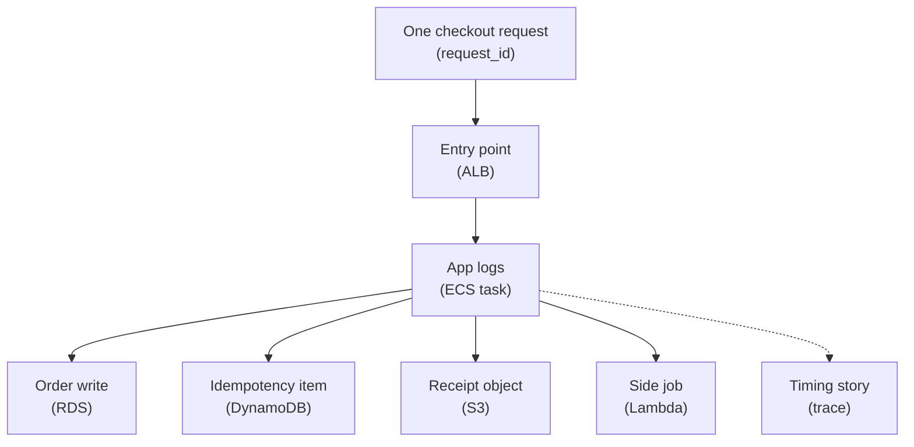

## Table of Contents

1. [Why One Request Needs A Name](#why-one-request-needs-a-name)
2. [Correlation IDs First](#correlation-ids-first)
3. [The Checkout Path](#the-checkout-path)
4. [Logs With Shared IDs](#logs-with-shared-ids)
5. [Traces And Spans](#traces-and-spans)
6. [AWS X-Ray Without Tool Worship](#aws-x-ray-without-tool-worship)
7. [OpenTelemetry In Plain English](#opentelemetry-in-plain-english)
8. [Following A Slow Checkout](#following-a-slow-checkout)
9. [Tradeoffs And Sampling](#tradeoffs-and-sampling)

## Why One Request Needs A Name

One checkout request can touch many pieces.
The customer calls an API endpoint.
The load balancer sends the request to an ECS task.
The Node.js app writes to RDS, stores an idempotency record in DynamoDB, writes a receipt object to S3, and may trigger a Lambda side job.

If every piece logs separately with no shared ID, the team gets fragments.
The app says something failed.
Lambda says an email job failed.
S3 says an object was missing.
RDS metrics say connections rose.
You can suspect they are related, but suspicion is not evidence.

Request correlation is the habit of giving one unit of work a shared name.
That name is often called a correlation ID, request ID, or trace ID.
The exact field name matters less than the discipline:
the same ID should travel with the work.

Tracing is the richer version of this idea.
It connects events with one ID and records timing and parent-child relationships between steps.
But a beginner should learn correlation first.
If your logs cannot follow one request, adding a tracing tool will feel confusing.

For `devpolaris-orders-api`, the practical question is:
when a customer says checkout was slow, can you follow that one checkout from API entry to database write to receipt upload to side job?



The request ID is the thread.
The trace is the timing story built around that thread.

## Correlation IDs First

A correlation ID is a value that lets you connect related work across logs and services.
It should appear in every important log line for the request.
It should also be passed to side jobs and downstream calls when that makes sense.

For a public API, the request may arrive with a header from an upstream system.
If it does not, the app can create an ID at the edge of the service.
The important part is to use one value consistently for the life of the work.

A beginner-friendly request context might look like this:

```text
request_id:
  req_01J8K2M6TK7S1E9R0Y6Q

route:
  POST /v1/orders

order_id:
  ord_8x7k2n

release:
  2026-05-02.4
```

The `request_id` follows the technical request.
The `order_id` follows the business object after the order is created.
Both are useful.

Do not use a customer email or payment token as a correlation ID.
A correlation ID should be safe to write into logs.
It should connect events without exposing private data.

When the app starts a side job, pass the ID forward:

```json
{
  "type": "receipt.email.requested",
  "request_id": "req_01J8K2M6TK7S1E9R0Y6Q",
  "order_id": "ord_8x7k2n",
  "receipt_key": "receipts/2026/05/02/order_ord_8x7k2n/devpolaris-orders-receipt.pdf"
}
```

Now the Lambda that sends the receipt email can log the same request and order IDs.
If the email fails, the team can connect it to the checkout that created the order.

## The Checkout Path

A request path is the route one unit of work takes through the system.
For tracing, it helps to name the path before naming tools.

For DevPolaris checkout, the path is:

| Step | Component | What It Does |
|------|-----------|--------------|
| 1 | ALB | accepts `POST /v1/orders` |
| 2 | ECS task | runs `devpolaris-orders-api` |
| 3 | RDS | stores order and line items |
| 4 | DynamoDB | records idempotency or job status |
| 5 | S3 | stores receipt or export object |
| 6 | Lambda | sends side job output, such as email |

Not every checkout uses every step.
That is fine.
A trace or correlated log story should show the steps that happened for that request.

The request path helps avoid a common mistake:
debugging from the service you personally know best.
If you are comfortable with Node.js, you may stare at app logs.
If you are comfortable with databases, you may stare at RDS.
The request path asks a more specific question:
where did this request actually go, and where did the first bad signal appear?

A healthy path might look like this:

```text
req_01J8K2M6TK7S1E9R0Y6Q

ALB accepted request
ECS task started handler
RDS order insert succeeded
DynamoDB idempotency write succeeded
S3 receipt upload succeeded
Lambda email request queued
API returned 201
```

A failing path might stop earlier:

```text
req_01J8K2M6TK7S1E9R0Y6Q

ALB accepted request
ECS task started handler
RDS order insert timed out
API returned 500
S3 receipt upload did not run
Lambda email request did not run
```

That path already teaches you something.
There is no point debugging Lambda receipt email for this request because the order never reached that step.

## Logs With Shared IDs

Correlation works only if the ID appears in the logs you actually search.
That means every important step should include the same request ID.

Here are three logs from the same checkout:

```json
{
  "level": "info",
  "service": "devpolaris-orders-api",
  "request_id": "req_01J8K2M6TK7S1E9R0Y6Q",
  "route": "POST /v1/orders",
  "step": "checkout.start"
}
```

```json
{
  "level": "info",
  "service": "devpolaris-orders-api",
  "request_id": "req_01J8K2M6TK7S1E9R0Y6Q",
  "order_id": "ord_8x7k2n",
  "step": "rds.insert_order",
  "duration_ms": 43
}
```

```json
{
  "level": "error",
  "service": "devpolaris-receipt-email",
  "request_id": "req_01J8K2M6TK7S1E9R0Y6Q",
  "order_id": "ord_8x7k2n",
  "step": "email.send",
  "error_name": "TemplateNotFound"
}
```

The third log is from a different service, but the request and order IDs connect it to the same business flow.
That is the practical value.

With CloudWatch Logs Insights, a search can follow the request across log groups if you query the relevant groups:

```text
fields @timestamp, service, request_id, order_id, step, error_name, duration_ms
| filter request_id = "req_01J8K2M6TK7S1E9R0Y6Q"
| sort @timestamp asc
```

The query is simple because the logs are structured.
If each service uses a different field name, such as `reqId`, `request`, and `trace`, the query becomes harder.
Consistency is part of the design.

## Traces And Spans

A trace is a record of one request's journey.
A span is one timed piece of work inside that journey.
The whole checkout is a trace.
The RDS insert is a span.
The S3 upload is another span.

The trace adds timing and nesting.
That makes it useful when the request is slow but not clearly failing.

Here is a trace-shaped view:

```text
trace_id=1-6634f87a-9fb2c6d2c5a1b8d31460
request_id=req_01J8K2M6TK7S1E9R0Y6Q

POST /v1/orders                         1260 ms
  validate cart                            7 ms
  authorize payment                       52 ms
  insert order in RDS                   1030 ms
  write idempotency item in DynamoDB      12 ms
  write receipt to S3                     31 ms
  build response                           5 ms
```

The trace points at the slow step.
The request took 1260 ms, and most of that time was the RDS insert.
That does not automatically prove RDS is broken.
It tells you where the time went.

The log then gives detail:

```json
{
  "level": "warn",
  "service": "devpolaris-orders-api",
  "request_id": "req_01J8K2M6TK7S1E9R0Y6Q",
  "step": "rds.insert_order",
  "duration_ms": 1030,
  "message": "slow database write"
}
```

The trace and log support each other.
The trace shows timing.
The log shows context.

## AWS X-Ray Without Tool Worship

AWS X-Ray is AWS's tracing service for collecting and viewing traces.
It can help you see service maps, traces, segments, and timing across supported services and instrumented code.
For a beginner, the tool is less important than the questions it answers.

Use X-Ray when you need to follow a request across components and see where time or errors appear.
Do not use it as a substitute for clear app logs.
If your spans are named badly and your logs lack request IDs, the trace view may still leave you confused.

In an AWS-shaped checkout path, X-Ray might help show:

| Trace Part | What It Could Show |
|------------|--------------------|
| API or ALB edge | request entry timing |
| ECS app segment | app handler timing |
| RDS call annotation | database call duration |
| DynamoDB call | item write timing or error |
| S3 call | receipt upload timing |
| Lambda segment | side job timing |

The exact instrumentation depends on your app, libraries, and runtime setup.
Avoid pretending that tracing appears perfectly by magic.
The app must be instrumented well enough to name useful work.

A good span name is boring and clear:
`rds.insert_order`, `dynamodb.put_idempotency_key`, `s3.write_receipt`.
Those names match the operations your team talks about.

That is better than vague spans like `db`, `aws`, or `handler`.
Vague spans force humans to translate during an incident.

## OpenTelemetry In Plain English

OpenTelemetry is an open standard and toolkit for collecting telemetry such as traces, metrics, and logs.
For this article, think of it as a way to instrument your code without tying every idea to one vendor API.

You may use OpenTelemetry to create spans in your Node.js app.
Those spans can be exported to different backends depending on the team's setup.
AWS also has ways to work with OpenTelemetry in AWS environments.

The first useful tracing skill is to instrument the work in your app, keep names clear, and carry context across boundaries.

For `devpolaris-orders-api`, useful instrumentation points might be:

| Operation | Span Name |
|-----------|-----------|
| HTTP handler | `http.post_orders` |
| Database insert | `rds.insert_order` |
| Idempotency write | `dynamodb.put_idempotency_key` |
| Receipt upload | `s3.write_receipt` |
| Email side job | `lambda.receipt_email` |

Do not start by instrumenting every tiny helper function.
Start with boundaries that explain request time:
incoming request, database call, object storage call, key-value write, and side job.

The tracing tool should make the story easier to read.
If the tool creates a thousand tiny spans that nobody understands, simplify.

## Following A Slow Checkout

Imagine support reports that checkout was slow for one customer.
The user-facing response eventually succeeded, but it took several seconds.
You have the request ID from the response header:
`req_01J8K2M6TK7S1E9R0Y6Q`.

Start with logs:

```text
fields @timestamp, service, request_id, step, duration_ms, error_name
| filter request_id = "req_01J8K2M6TK7S1E9R0Y6Q"
| sort @timestamp asc
```

The result shows:

```text
09:42:17.101 devpolaris-orders-api checkout.start
09:42:17.157 devpolaris-orders-api payment.authorize duration_ms=51
09:42:18.192 devpolaris-orders-api rds.insert_order duration_ms=1030
09:42:18.206 devpolaris-orders-api dynamodb.put_idempotency_key duration_ms=12
09:42:18.238 devpolaris-orders-api s3.write_receipt duration_ms=31
09:42:18.244 devpolaris-orders-api checkout.complete duration_ms=1143
```

The logs already suggest RDS was the slow step.
Now open the trace for the same request or trace ID.
The trace confirms the same shape:

```text
POST /v1/orders              1143 ms
  payment.authorize            51 ms
  rds.insert_order           1030 ms
  dynamodb.put_idempotency      12 ms
  s3.write_receipt             31 ms
```

Now inspect metrics around that time.
If RDS latency or connections also rose, the single request fits a wider pattern.
If RDS metrics look normal, the slow request may be isolated or caused by a specific query shape.

That is the workflow:
request ID to logs, logs to trace, trace to the slow span, metrics to the wider shape.

## Tradeoffs And Sampling

Tracing has costs.
It adds instrumentation work.
It can add runtime overhead.
It creates data to store and review.
If every request is traced in full detail forever, the team may spend too much money and too much attention.

Many tracing systems use sampling.
Sampling means keeping traces for some requests instead of every request.
That can reduce cost and noise.
The tradeoff is that you may not have a trace for one exact request.

That is why correlation IDs in logs still matter.
Even when a trace is not sampled, logs with request IDs can still follow the request.
When a trace is sampled, the shared ID helps you connect the log detail and timing detail.

The beginner standard is:

| Habit | Why It Helps |
|-------|--------------|
| Always create or accept a request ID | every request can be searched |
| Put request ID in logs | logs become connectable |
| Put order ID in business events | support can connect user reports |
| Trace main boundaries first | timing story stays readable |
| Sample intentionally | cost and detail stay balanced |
| Name spans in team language | traces are easier during incidents |

Tracing is not about drawing beautiful graphs.
It is about making one production request understandable.
If the checkout request is slow, the team should be able to follow it without guessing.

Start with correlation.
Then add tracing where timing across boundaries matters.

---

**References**

- [What is AWS X-Ray?](https://docs.aws.amazon.com/xray/latest/devguide/aws-xray.html) - Introduces AWS tracing concepts, traces, segments, and service maps.
- [AWS X-Ray concepts](https://docs.aws.amazon.com/xray/latest/devguide/xray-concepts.html) - Defines core X-Ray terms used when reading trace data.
- [OpenTelemetry overview](https://opentelemetry.io/docs/what-is-opentelemetry/) - Official OpenTelemetry explanation of telemetry signals and instrumentation.
- [AWS Distro for OpenTelemetry](https://aws-otel.github.io/docs/introduction/) - AWS-supported distribution information for OpenTelemetry in AWS environments.
- [Analyze log data with CloudWatch Logs Insights](https://docs.aws.amazon.com/AmazonCloudWatch/latest/logs/AnalyzingLogData.html) - Useful for connecting request IDs across structured logs.
