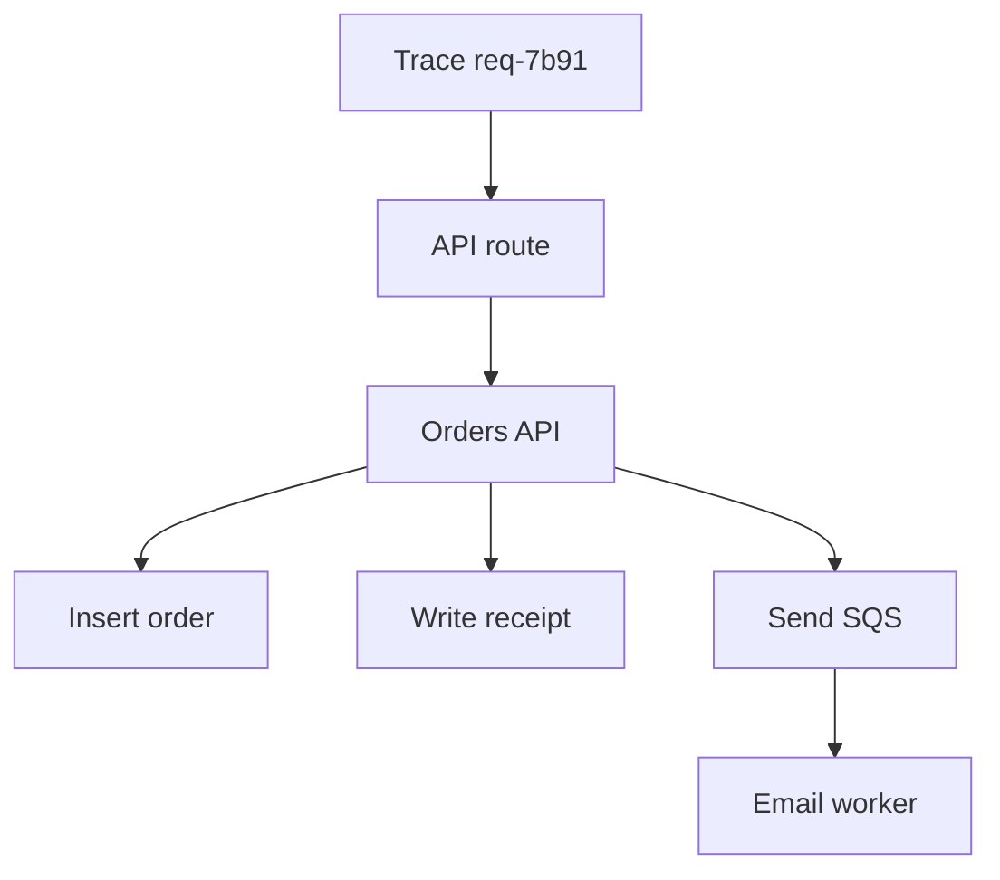
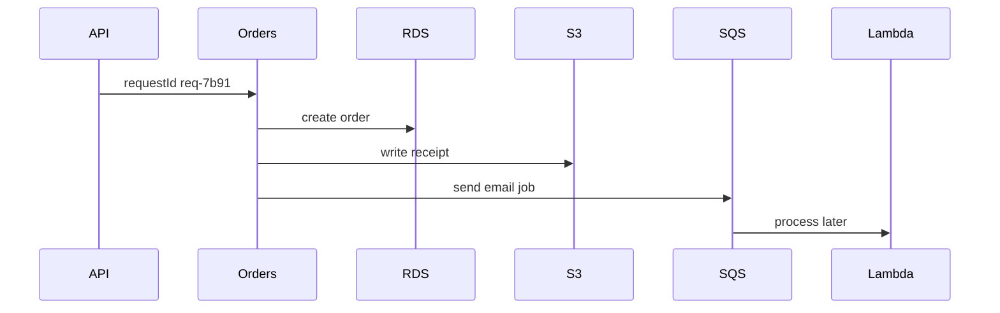

## Table of Contents

1. [The Problem](#the-problem)
2. [Correlation IDs](#correlation-ids)
3. [Trace Context](#trace-context)
4. [Spans](#spans)
5. [The Checkout Path](#the-checkout-path)
6. [Async Boundaries](#async-boundaries)
7. [OpenTelemetry](#opentelemetry)
8. [AWS Tracing Tools](#aws-tracing-tools)
9. [Sampling](#sampling)
10. [Putting It All Together](#putting-it-all-together)
11. [What's Next](#whats-next)

## The Problem

The previous article showed that metrics can reveal a shape: checkout p95 latency rose, 5xx increased, and the receipt queue started aging. The next question is about one unit of work.

A customer says order `order-1042` took 8 seconds and then returned an error. The system has fragments:

- API Gateway saw the request.
- The ECS service logged a checkout start and a checkout failure.
- RDS metrics show connection pressure.
- S3 request latency rose for receipt uploads.
- SQS accepted a receipt job.
- Lambda retried the email provider later.

Those fragments may belong together, or they may be separate symptoms from the same time window. Tracing and correlation give the work a shared identity so the team can follow the path instead of guessing.

## Correlation IDs

A correlation ID is a stable name for one unit of work. It is often created at the edge of the system, then carried through logs, messages, events, and downstream calls.

For checkout, the edge might assign:

```text
requestId=req-7b91
```

Every component that handles the work should include that ID in its logs when it can:

```json
{
  "service": "orders-api",
  "operation": "POST /checkout",
  "requestId": "req-7b91",
  "orderId": "order-1042",
  "message": "receipt job published"
}
```

The ID does not need to be meaningful. In fact, it is often safer when it is meaningless. Do not use raw email addresses, card numbers, tokens, or private customer data as correlation IDs. A generated request ID plus safe business identifiers is usually enough.

Correlation is the beginner foundation for tracing. If logs cannot follow one request by a shared field, a tracing tool will feel like a mysterious extra screen rather than an extension of the request story.

## Trace Context

Trace context is the tracing version of shared identity. It carries information that lets tools connect spans into one trace.

A common shape is:

| Field | Plain meaning |
| --- | --- |
| Trace ID | The whole unit of work |
| Span ID | One operation inside that work |
| Parent span ID | The operation that caused this operation |
| Attributes | Searchable facts about the operation |

The application, libraries, proxies, and SDKs need to propagate this context. For HTTP calls, it may travel in headers. For queues or events, it may travel in message attributes or event payload fields. For function calls, it may arrive through invocation context or headers depending on the path.

The gotcha is that context can be dropped at boundaries. A trace may look complete through API Gateway and ECS, then disappear when the app publishes to SQS. That does not mean the background work did not happen. It means the trace context did not cross the boundary, or the consumer was not instrumented to continue it.

Treat trace context like a relay baton. Every hop that should be part of the story needs a way to receive it and pass it on.

## Spans

A span represents one operation inside a trace. It has a start time, end time, name, parent relationship, and attributes. A trace is the tree or graph of spans that belong to the same unit of work.

For one checkout request, spans might look like this:



The span names should be useful to a human. `POST /checkout`, `rds insert order`, and `s3 put receipt` are clearer than generic names such as `handler` or `call`.

Span attributes should help the team filter without leaking private data:

| Attribute | Good use |
| --- | --- |
| `service.name` | Which service handled the work |
| `http.route` | Which route was called |
| `aws.queue.name` | Which queue was used |
| `db.system` | Which database type was called |
| `error.type` | What kind of failure occurred |
| `order.id` | Safe business identifier when allowed |

The gotcha is over-instrumentation. A trace with hundreds of tiny internal spans can be harder to read than one with clear service and dependency boundaries. Instrument what helps explain time, failure, and ownership.

## The Checkout Path

Tracing becomes useful when it follows a path the team already understands.

For the orders system, the path starts with the customer's API call. The API layer forwards to the orders service. The service writes to RDS, writes a receipt object to S3, stores idempotency state in DynamoDB, sends a receipt job to SQS, and emits an event for later workflows.



If checkout is slow, traces help answer where time went. Did the API wait on the app? Did the app wait on RDS? Did S3 upload latency dominate? Did the synchronous path finish quickly while asynchronous email failed later?

The path also shows what tracing cannot do alone. If the business rule is wrong, the trace may show a fast and successful request that still created the wrong order. Logs, tests, and domain checks still matter.

## Async Boundaries

Queues and events break the simple request-response path. The producer may finish before the consumer starts. A message can wait. A consumer can retry. A scheduled workflow can run long after the original API request.

That is why asynchronous boundaries need explicit design.

For SQS, include safe correlation fields in the message body or attributes. For SNS and EventBridge, include the event ID, trace context if supported by the instrumentation path, and stable business identifiers. For Step Functions, make sure execution names, input fields, logs, and traces can connect the workflow back to the initiating event when needed.

| Boundary | Correlation habit |
| --- | --- |
| HTTP call | Propagate trace headers and request ID |
| SQS message | Include correlation fields in message attributes or body |
| SNS topic | Publish stable event ID and safe business identifiers |
| EventBridge event | Use clear `source`, `detail-type`, and correlation fields in `detail` |
| Step Functions | Preserve initiating IDs in execution input and logs |

The gotcha is duplicate work. Async systems retry. A trace may show one attempt, several attempts, or only the successful path depending on instrumentation and sampling. Correlation IDs help connect the attempts. Idempotency still protects side effects.

## OpenTelemetry

OpenTelemetry is an open standard for instrumenting applications and collecting telemetry such as traces, metrics, and logs. The important beginner idea is portability: the application can use a common telemetry model and send data through collectors or supported backends.

For new tracing work on AWS, OpenTelemetry should be the default mental model. AWS documentation says the X-Ray SDKs and daemon entered maintenance mode on February 25, 2026, and recommends migration to OpenTelemetry-based instrumentation. The X-Ray service and CloudWatch tracing features still matter, but new application instrumentation should avoid building around the older X-Ray SDK/daemon path.

That distinction matters:

| Choice | What it means |
| --- | --- |
| OpenTelemetry instrumentation | Application emits standard telemetry |
| Collector or agent | Receives, processes, and exports telemetry |
| CloudWatch and X-Ray backends | Places where AWS can store, search, and visualize traces |
| Application Signals | CloudWatch application view built from metrics and traces |

OpenTelemetry does not remove the need for good names. A badly named span is still hard to use. A trace without safe attributes is still hard to filter. A collector misconfigured at the network or permission boundary still drops evidence.

## AWS Tracing Tools

AWS gives several ways to use tracing data.

AWS X-Ray receives trace data and groups related segments into traces. It can produce a service graph that shows application components and downstream dependencies. X-Ray terminology includes segments and subsegments. A beginner can think of those as AWS's trace records for work and child work.

CloudWatch Application Signals gives an application-centered view when services are instrumented. It can show services, operations, dependencies, latency, availability, faults, errors, and service-level objectives. It is useful when the team wants a higher-level operating view instead of only raw traces.

CloudWatch Transaction Search can make spans searchable and connects tracing data with CloudWatch analysis. OpenTelemetry and AWS Distro for OpenTelemetry can feed these AWS views depending on the setup.

The tool choice should follow the question:

| Question | Useful AWS view |
| --- | --- |
| Which service or dependency is slow? | Application Signals or trace map |
| What happened inside one request? | Trace details and spans |
| Which spans match a business attribute? | Transaction Search |
| Is this service meeting latency or availability goals? | Application Signals SLOs |
| Which exact log line explains the error? | CloudWatch Logs with trace or request ID |

Do not let tool names replace the request story. The tool is good when it helps answer the next operational question.

## Sampling

Tracing every request can be expensive and noisy. Sampling controls which requests become full traces.

Sampling is useful because normal high-volume traffic may not need every trace. But it creates a practical surprise: the exact failed request a customer reports may not have a sampled trace. That does not mean observability failed completely. Logs should still contain the request ID and useful fields. Metrics should still show the shape. Alarms should still show whether the issue was broad.

Sampling strategy depends on risk:

| Workload | Sampling thought |
| --- | --- |
| Normal high-volume success traffic | Sample a small enough portion to see shape |
| Errors | Prefer keeping more failed traces |
| Rare business-critical operations | Consider higher sampling |
| Background retries | Preserve correlation fields even if not every attempt is traced |

The gotcha is assuming traces are a complete legal record or perfect audit trail. They are operational evidence, not a replacement for logs, CloudTrail, database records, or business state.

## Putting It All Together

The opening problem was fragmented evidence. API Gateway, ECS, RDS, S3, SQS, EventBridge, Lambda, and workflows all held pieces of the same checkout story.

Correlation IDs give one unit of work a shared name. Trace context connects operations into a trace. Spans show the timing and relationship of each meaningful step. Async boundaries require deliberate propagation through messages, events, and workflows. OpenTelemetry is the forward-looking instrumentation model for AWS applications. X-Ray, CloudWatch Application Signals, and Transaction Search are AWS views that can store, connect, and visualize trace data. Sampling controls volume, but logs and metrics still need to carry enough evidence when a trace is missing.

The design is healthy when a responder can start from a request ID or trace, follow the path across services, and know where the story stops because the business process became asynchronous.

## What's Next

Observability shows what production is doing. The next AWS module moves into deployment and runtime operations: how services are updated, configured, scaled, rolled back, and operated safely while those signals are watching.

---

**References**

- [AWS X-Ray concepts](https://docs.aws.amazon.com/xray/latest/devguide/xray-concepts.html). Supports the explanation of traces, segments, subsegments, service graphs, tracing headers, sampling, annotations, and metadata.
- [Migrating from X-Ray instrumentation to OpenTelemetry instrumentation](https://docs.aws.amazon.com/xray/latest/devguide/xray-sdk-migration.html). Supports the OpenTelemetry-first guidance and the February 25, 2026 X-Ray SDK/daemon maintenance notice.
- [OpenTelemetry in Amazon CloudWatch](https://docs.aws.amazon.com/AmazonCloudWatch/latest/monitoring/CloudWatch-OpenTelemetry-Sections.html). Supports the OpenTelemetry telemetry model and CloudWatch support for metrics, logs, traces, PromQL, Logs Insights, and Transaction Search.
- [Application Signals](https://docs.aws.amazon.com/AmazonCloudWatch/latest/monitoring/CloudWatch-Application-Monitoring-Sections.html). Supports the Application Signals explanation for services, dependencies, latency, availability, faults, errors, and SLOs.
- [Transaction Search](https://docs.aws.amazon.com/AmazonCloudWatch/latest/monitoring/CloudWatch-Transaction-Search.html). Supports the span search, `aws/spans` log group, and Application Signals/Transaction Search relationship.
