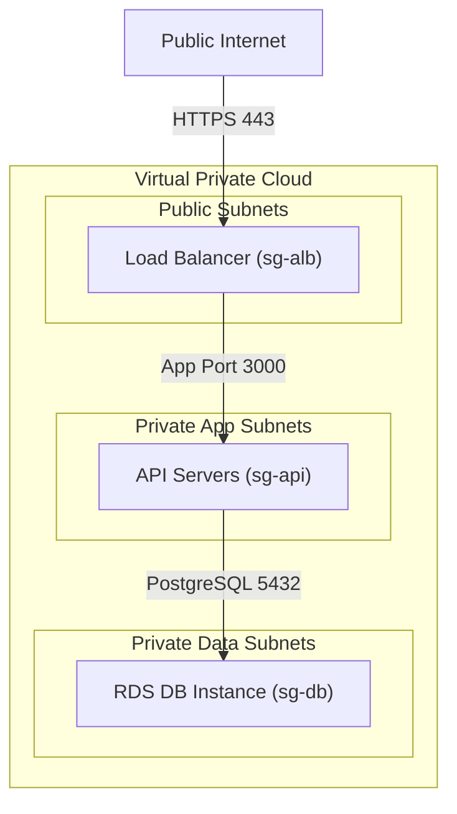
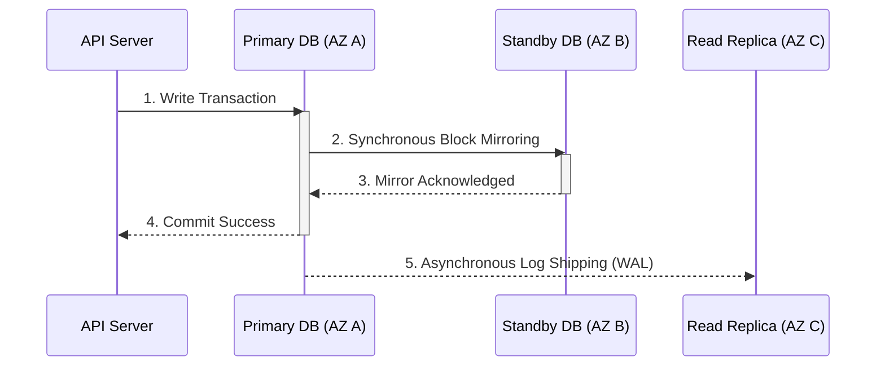

## Table of Contents

1. [From Independent Files to Transactional Tables](#from-independent-files-to-transactional-tables)
2. [What Is RDS](#what-is-rds)
3. [Managed Infrastructure vs. Developer Schema Ownership](#managed-infrastructure-vs-developer-schema-ownership)
4. [Isolating Endpoints in Private Data Subnets](#isolating-endpoints-in-private-data-subnets)
5. [Dynamic Credential Injection via Secrets Manager](#dynamic-credential-injection-via-secrets-manager)
6. [Autoscaling and the DB Connection Exhaustion Limit](#autoscaling-and-the-db-connection-exhaustion-limit)
7. [Resilience through Multi-AZ Standby Replication](#resilience-through-multi-az-standby-replication)
8. [Executing Backward-Compatible Schema Migrations](#executing-backward-compatible-schema-migrations)
9. [Putting It All Together](#putting-it-all-together)
10. [What's Next](#whats-next)

## From Independent Files to Transactional Tables

The previous S3 article detailed object storage, which is the perfect cloud home for complete, standalone files like customer receipt PDFs and nightly financial spreadsheets. S3 acts as a regional object API where each file exists as an isolated object addressed by bucket and key. When your application code simply needs to store and fetch whole files by name, S3 delivers unmatched durability and cost-effectiveness.

However, an e-commerce checkout flow has a fundamentally different data shape. When a customer purchases a product, your application must write an order header, several product line items, a billing address, and a payment transaction record. These facts cannot exist in isolation. A product line item is completely meaningless without an order header, and a customer should not be marked as billed if your system fails to record their shipping details. If you attempt to store these related facts as separate files in S3, you cannot guarantee network and data correctness:

* **Orphaned Records**: A minor network timeout during checkout can cause your code to write the product line item file but fail to write the parent order file, leaving your system with orphaned, untrackable data.
* **Lack of Safe Transactions**: Object storage does not support all-or-nothing transactions across multiple files. You cannot guarantee that an order is only marked as paid if the payment record is successfully written at the exact same millisecond.
* **Search Latency**: To generate a basic sales report showing all orders containing a specific product, your application would have to download, parse, and scan thousands of separate S3 files, leading to severe latency bottlenecks.

To protect data integrity, you must move from independent object files to relational structures and SQL databases. Relational databases enforce strict data correctness using transactions, which ensure a group of changes either succeed completely together or fail safely without corrupting data, along with strict schema constraints and key relationships. Amazon Relational Database Service, commonly referred to as RDS, is the managed cloud service for hosting these databases, providing a resilient, highly available environment for the relational structures your application depends on.

## What Is RDS

RDS stands for Relational Database Service. When you want to store highly structured business facts, such as user profiles, product prices, and checkout orders, you need a database. Setting up a database yourself is a lot of work: you have to buy a physical server, install a server operating system, manually configure the database software, and write custom scripts to handle backups and disk drive expansion. Amazon RDS completely automates all of this operational overhead by providing a preconfigured database server hosted in the cloud.

At a high level, RDS behaves like a managed SQL database endpoint. AWS operates the database host infrastructure, while your team owns the schema, queries, indexes, credentials, and application transaction behavior.

When you launch an RDS instance, you choose a popular database type, such as PostgreSQL or MySQL, and AWS automatically provisions a secure database runtime. AWS handles the physical server maintenance, automated security updates, and daily snapshot backups inside your account. This clean boundary allows your engineering team to focus entirely on your business data.

Relational databases organize your data into clean, grid-like spreadsheets called **tables**, consisting of rows and columns. They allow you to relate these tables to each other (such as matching a customer to their specific order), guarantee that database updates either succeed completely or fail safely, and let you use a simple query language called **SQL** to fetch and connect your business facts instantly. By hosting your relational database in RDS, you get a secure, highly reliable home for your transactional records that AWS automatically manages and protects.

## Managed Infrastructure vs. Developer Schema Ownership

Amazon RDS is a managed service, meaning AWS automates a vast portion of the physical database administration work. When you provision an RDS instance, AWS automatically sets up the underlying virtual machine, installs your chosen database engine, configures automated daily snapshots with transaction log archiving for point-in-time recovery, and applies critical operating system security patches during scheduled maintenance windows.

The important anchor is ownership split. RDS manages the database runtime platform, but it does not design your relational model or make bad queries efficient.

However, a managed database is not an automatic system that solves all data correctness and performance problems. While AWS manages the physical database infrastructure, your engineering team still completely owns the logical data model and runtime behavior.

This ownership starts with logical modeling and indexes. You are entirely responsible for designing your tables, defining foreign keys, and writing indexing strategies. RDS will not analyze your query patterns or automatically optimize slow, unindexed queries. Furthermore, you must carefully manage runtime connection capacity. You must calculate how your application code opens and shares connections to avoid exhausting database memory under heavy traffic. Finally, you own schema evolution safety. You must write and run the code migrations that evolve your database tables over time, ensuring that data structures remain compatible with active application versions.

Relational databases enforce mathematical correctness through structural rules. RDS provides a managed, secure runtime for those rules, but the optimization of your SQL queries and the design of your database schemas remain the responsibility of your application developers.

## Isolating Endpoints in Private Data Subnets

Once you provision an RDS instance, your application code needs a network path to connect to the database engine. A common cloud security failure is exposing a database to the public internet by launching it in a public subnet with a public IP address, relying solely on a password to block unauthorized callers. This exposes your database port to continuous brute-force attacks and vulnerability scans.

An RDS endpoint is a private network address for the database service. Treat it like an internal dependency that should be reachable only from approved application subnets and security groups.

In a secure cloud network topology, your relational database must live deep inside isolated private subnets with absolutely no route to the internet. Amazon RDS manages this network isolation using two distinct security controls.

First, you configure DB Subnet Groups. A DB Subnet Group is a collection of subnets across multiple Availability Zones in your VPC. For production databases, choose private subnets and set the database to **not publicly accessible**. The subnet group places the database network interfaces in the selected subnets, while the public accessibility setting controls whether the DB instance receives a public IP address. Both choices matter. A private subnet group plus `PubliclyAccessible=false` keeps the database reachable only through private VPC paths.

Second, you restrict inbound traffic using security group whitelisting. Instead of opening database ports like TCP 5432 or 3306 to broad IP ranges, you write a stateful rule in the database security group (`sg-db`) that allows inbound traffic exclusively from the security group of your application servers (`sg-api`).



This layered isolation means that even if an attacker discovers your database password, they still need a private network path and an allowed security group source before packets can reach the database port. Network isolation does not replace password rotation or least-privilege users, but it prevents a leaked password from becoming a direct internet login path.

## Dynamic Credential Injection via Secrets Manager

With your database isolated inside private data subnets, your application servers need credentials, consisting of a host endpoint, a username, and a password, to authenticate and open connections. Hardcoding these credentials in application files, committing them to Git repositories, or baking them into container images are severe security violations that risk exposing your entire database if a developer's laptop or workstation is compromised.

To secure database credentials, you must manage them dynamically using **AWS Secrets Manager**.

This process relies on decoupled encryption. Database endpoints, usernames, and passwords are stored as encrypted payloads inside Secrets Manager within your AWS account. When your application server boots up, it executes a just-in-time retrieval. The server makes an API call to Secrets Manager, fetching the latest database credentials directly into its volatile memory.

You can verify and test this retrieval sequence from the command line using the AWS CLI:

```bash
$ aws secretsmanager get-secret-value --secret-id production/db/credentials
{
    "ARN": "arn:aws:secretsmanager:us-east-1:123456789012:secret:production/db/credentials-a1b2c3",
    "Name": "production/db/credentials",
    "VersionId": "98765432-1234-abcd-ef01-234567890abc",
    "SecretString": "{\"username\":\"db_admin\",\"password\":\"p@ssword123\",\"host\":\"production-db.c7a9b8c7d6e5.us-east-1.rds.amazonaws.com\",\"port\":5432}",
    "CreatedDate": "2026-05-26T18:00:00Z"
}
```

The server parses the `SecretString` JSON payload at runtime, retrieving the host address, username, and password into process memory or a carefully controlled runtime configuration object. This design ensures the password never touches local disk or environment files. Furthermore, Secrets Manager can coordinate with supported RDS engines to rotate your database password on a recurring schedule, updating the credentials inside the database engine and the secret payload without requiring a code redeploy. Rotation still needs application coordination: connection pools must refresh credentials, and the rotation function must match the engine, user, and network path.

## Autoscaling and the DB Connection Exhaustion Limit

Securing your network and credentials allows your application to start processing transactions. In local development, your application typically maintains a single, steady connection to the database. In a production cloud environment, however, your application auto-scales dynamically, launching dozens of concurrent tasks or serverless functions to handle sudden traffic spikes.

Database connections are finite engine sessions, not free HTTP requests. Each connection consumes memory, process slots, and locking resources inside the database engine.

Because relational databases allocate memory and process resources for open connections, they have a strict limit on maximum concurrent connections. If your connection limit is exceeded, RDS may reject or queue new connection attempts, causing application servers to throw errors, slow down, or time out under load.

To prevent connection failures, you must understand the connection multiplication equation. The total number of open database connections is calculated as:

$$\text{Total Connections} = (\text{Application Tasks} \times \text{Database Pool Size}) + \text{Background Jobs}$$

| Application Tasks | Connection Pool Size | Background Workers | Total Database Connections |
| --- | --- | --- | --- |
| 1 (Local Dev) | 10 | 1 | 11 |
| 10 (Normal Load) | 10 | 2 | 102 |
| 50 (Traffic Peak) | 10 | 2 | 502 |
| 100 (Autoscaled) | 15 | 4 | 1,504 |

This multiplier explains why scaling app instances can quickly choke a database. You can prevent this connection exhaustion by optimizing connection pooling. Configure database clients to close idle connections quickly and set conservative maximum pool limits. For highly concurrent workloads, such as serverless Lambda functions that scale rapidly to thousands of short-lived executions, deploy **Amazon RDS Proxy**. RDS Proxy sits between your application and the database, pooling and sharing database connections globally to prevent connection starvation.

## Resilience through Multi-AZ Standby Replication

Your database is now isolated, secure, and performant. However, datacenters can suffer physical failures, including power grid collapses, cooling failures, or hardware corruption. If your database runs on a single server inside a single datacenter, a hardware issue in that datacenter will instantly knock your application offline and risk permanent data loss.

Multi-AZ RDS works as a managed standby pattern. AWS maintains another database copy in a separate Availability Zone and can promote it when the primary database infrastructure fails.

To improve high availability, deploy RDS using a **Multi-AZ** (Multi-Availability Zone) configuration when the database supports your uptime requirements and budget.

The classic Multi-AZ DB instance deployment provisions and maintains a synchronous standby replica of your database in a separate Availability Zone. When your application writes data, RDS ensures the changes are successfully written to both the primary and standby before returning a success signal to your application code. Multi-AZ DB clusters are a newer shape for supported engines such as MySQL and PostgreSQL: they use one writer and two readable standby instances across three Availability Zones, providing high availability plus read capacity from the reader endpoints.

If the primary database instance suffers a hardware failure, RDS automatically triggers an automated failover. The system detects the failure and updates the database's DNS endpoint to point to the healthy standby instance. Many failovers complete in roughly 60 to 120 seconds, though the exact duration depends on engine, workload, and recovery state. Your application usually does not need to change endpoint names, but it must handle dropped connections and reconnect cleanly.



The sequence shows why Multi-AZ standby replication is primarily used for high availability, while Read Replicas are commonly used for scaling reads. Multi-AZ mirror transactions block application commits until the standby path acknowledges the write, greatly reducing data-loss risk during failovers. Conversely, Read Replicas rely on asynchronous Write-Ahead Log (WAL) shipping. They can scale read-heavy loads and, for many engines, can be promoted during a recovery event, but they may lag behind the writer and are not the same as a synchronous standby.


*A production RDS path is a private network path plus a capacity boundary. Application tasks retrieve credentials, pool connections through a proxy, reach the database only inside private data subnets, and rely on Multi-AZ standby failover when the primary instance fails.*

## Executing Backward-Compatible Schema Migrations

Relational databases make data structure explicit through schemas. As your application evolves, you must execute database migrations to add columns, alter tables, or create indexes. If you execute a database migration carelessly during peak traffic, you risk locking critical tables, causing active user checkouts to time out and crash.

To release schema changes safely without downtime, you must write and deploy backward-compatible, multi-phase migrations. Let us walk through the SQL sequence required to add a new `delivery_instructions` column to an active `orders` table without locking active checkout checkouts:

```sql
-- Phase 1: Add the column as nullable (non-blocking)
ALTER TABLE orders ADD COLUMN delivery_instructions VARCHAR(500);

-- Phase 2: Deploy app version 2 (reads old paths, writes to old and new columns)
-- [Application deployment executes here]

-- Phase 3: Backfill historical records in small, controlled batches
UPDATE orders 
SET delivery_instructions = 'None' 
WHERE id IN (
    SELECT id FROM orders 
    WHERE delivery_instructions IS NULL 
    LIMIT 1000
);

-- Phase 4: Deploy app version 3 (reads and writes exclusively to new column)
-- [Application deployment executes here]

-- Phase 5: Apply strict integrity constraints (if required)
ALTER TABLE orders ALTER COLUMN delivery_instructions SET NOT NULL;
```

Adding a nullable column is usually a lighter metadata change than rewriting every row, though the exact lock behavior depends on the database engine and version. In contrast, adding a required column with a default can be much more disruptive on some engines because the database may need to validate or rewrite existing rows while holding stronger locks. Using this multi-phase migration workflow ensures that your database and application code remain compatible at every step of a release, reducing the chance that active checkouts are blocked by schema changes.

## Putting It All Together

Amazon RDS transforms relational database administration from a manual hardware chore into an automated cloud service. Relational correctness requires transactional integrity, which RDS secures through isolated subnets, access gates, and automated failover recovery:

* **Layered Network Defense**: Isolate database endpoints deep in private Data Subnets and restrict network traffic via security group whitelisting.
* **Securing Secrets**: Fetch database credentials dynamically from Secrets Manager and automate password rotations to prevent credential leakage.
* **Managing Scaled Connections**: Calculate connection pressure and utilize RDS Proxy to pool connections, preventing database memory exhaustion during auto-scaling events.
* **Physical Resilience**: Deploy Multi-AZ standby replication to automate disaster recovery failovers across separate physical datacenters.
* **Release Discipline**: Evolve database structures using backward-compatible, multi-phase migrations to avoid locking tables and causing application downtime.

RDS is the premier cloud container for structured SQL data. By treating the database as both a structured data model and a highly secured network service, you ensure your application's state remains accurate, performant, and durably protected.

One operational cost gotcha is engine lifecycle. Open-source database major versions eventually leave standard support. Amazon RDS Extended Support can keep eligible MySQL and PostgreSQL databases receiving critical updates for an additional cost after standard support ends, but it should be treated as a temporary bridge, not a long-term plan. Schedule major-version upgrades before the support date whenever possible.

## What's Next

RDS is the ideal starting point when application correctness depends on database transactions and structured tables. However, when application data is key-shaped and requires predictable low-latency lookups at massive scale without the limits of database connections, such as active session states or idempotency tokens, NoSQL key-value databases are often a better fit. In the next article, we will cover serverless NoSQL design in DynamoDB.


*Use this as the RDS checklist: keep endpoints private, own the schema and indexes, fetch credentials dynamically, control connection pressure, design for failover, and migrate schemas in backward-compatible phases.*

---

**References**

- [Amazon RDS user guide](https://docs.aws.amazon.com/AmazonRDS/latest/UserGuide/Welcome.html) - Compiles all RDS features, database engines, and backup rules.
- [Working with a DB instance in a VPC](https://docs.aws.amazon.com/AmazonRDS/latest/UserGuide/USER_VPC.WorkingWithRDSInstanceinaVPC.html) - Details DB subnet groups, private subnetting, and network interfaces.
- [Setting up public or private access in Amazon RDS](https://docs.aws.amazon.com/AmazonRDS/latest/gettingstartedguide/security-public-private.html) - Explains public accessibility, public IP behavior, and private database access patterns.
- [Controlling DB access with security groups](https://docs.aws.amazon.com/AmazonRDS/latest/UserGuide/Overview.RDSSecurityGroups.html) - Explains database security group configurations and source group whitelisting.
- [AWS Secrets Manager integration](https://docs.aws.amazon.com/secretsmanager/latest/userguide/integration_rds.html) - Outlines dynamic credential retrieval and automated password rotation.
- [Managing connections with RDS Proxy](https://docs.aws.amazon.com/AmazonRDS/latest/UserGuide/rds-proxy.html) - Details connection pooling, serverless scaling, and max connection limits.
- [Multi-AZ DB deployments](https://docs.aws.amazon.com/AmazonRDS/latest/UserGuide/Concepts.MultiAZ.html) - Explains synchronous replica mirroring, failover DNS updates, and read replicas.
- [Multi-AZ DB clusters](https://docs.aws.amazon.com/AmazonRDS/latest/UserGuide/multi-az-db-clusters-concepts.html) - Explains one-writer, two-readable-standby cluster architecture for supported engines.
- [Amazon RDS Extended Support](https://docs.aws.amazon.com/AmazonRDS/latest/UserGuide/extended-support.html) - Documents paid support after open-source engine major versions leave standard support.
