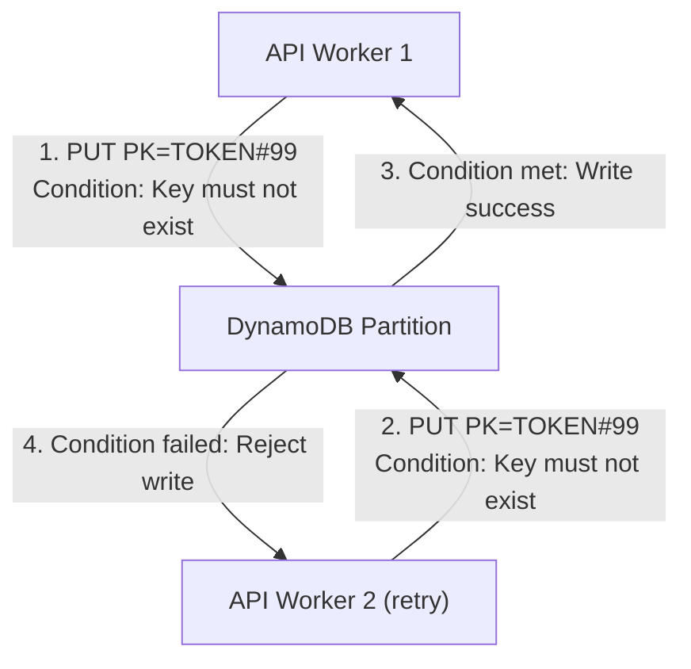

## Table of Contents

1. [Relational Scaling Limits to NoSQL](#relational-scaling-limits-to-nosql)
2. [What Is DynamoDB](#what-is-dynamodb)
3. [Physical Partitioning and the Hashing Key](#physical-partitioning-and-the-hashing-key)
4. [Composite Primary Keys and Item Modeling](#composite-primary-keys-and-item-modeling)
5. [Designing for Access Patterns Instead of Normalization](#designing-for-access-patterns-instead-of-normalization)
6. [Conditional Writes as Concurrency Barriers](#conditional-writes-as-concurrency-barriers)
7. [Alternative Access Paths with Global Secondary Indexes](#alternative-access-paths-with-global-secondary-indexes)
8. [On-Demand vs. Provisioned Capacity Planning](#on-demand-vs-provisioned-capacity-planning)
9. [Putting It All Together](#putting-it-all-together)
10. [What's Next](#whats-next)

## Relational Scaling Limits to NoSQL

The previous RDS article detailed relational databases, which excel at managing structured tables and running flexible SQL search queries. In a standard relational database, your application splits data into separate, specialized tables and queries them dynamically, relying on the database engine to parse your search requests and connect related records on the fly.

However, as your application's volume scales to thousands of requests per second, this relational model encounters severe architectural bottlenecks:

* **Connection Exhaustion**: Relational databases allocate dedicated memory and CPU threads for every open connection. Under sudden traffic spikes, horizontal scaling can quickly exhaust database connection limits.
* **Row Locking and Latency**: High-velocity write queries (such as checking security tokens or updating active shopping carts) can lock database rows, causing concurrent queries to wait and driving up response times.
* **Vertical Scaling Limits**: Relational engines are designed to scale vertically on a single server. Scaling a SQL database horizontally across multiple servers introduces complex synchronization delays, distributed locking overhead, and physical single-point failures.

To bypass these relational scaling limits, you must move high-frequency, key-based application state out of SQL and into serverless NoSQL databases. Amazon DynamoDB is cabled specifically to solve this high-volume scale, discarding database servers and complex SQL query parsers in favor of an HTTP-based service cabled directly to the regional AWS network. To unlock DynamoDB's predictable, sub-10ms performance, however, you must throw away relational database habits and design your storage around your application's exact access patterns.

## What Is DynamoDB

DynamoDB is a serverless, non-relational (NoSQL) database service. While relational database engines like RDS PostgreSQL organize data into normalized tables cabled together dynamically using complex SQL joins, DynamoDB takes a completely different path. It is built explicitly for high-velocity, single-digit millisecond performance at a traffic scale that would exhaust traditional SQL database connection and CPU pools.

The easiest way to visualize DynamoDB is as a massive spreadsheet cabled directly to the cloud network. Instead of managing rows with uniform column schemas, DynamoDB stores independent items. Every item in your table must be identified and written using a unique primary row key (the Partition Key). Outside of this Partition Key, the items in the same table can hold entirely different attributes without any structural checks or schema validations.

Because DynamoDB is completely serverless, you do not manage virtual servers, provision disk sizes, or configure connection pools. Instead, your application communicates with the database over secure HTTP APIs, and AWS handles all backend capacity scaling, physical hardware replication, and server maintenance automatically. By trading the dynamic query flexibility of SQL joins for infinite horizontal scale, DynamoDB guarantees constant sub-10ms response times at any scale. While it is not designed for unpredictable business analytics, it represents the premier AWS home for high-velocity, key-based application state like customer sessions, API idempotency tokens, and active shopping carts.

## Physical Partitioning and the Hashing Key

A standard database searches for records by scanning tables or indexes, meaning that searching a table containing 10 million rows is fundamentally slower than searching a table with 100 rows. DynamoDB guarantees predictable, high-speed query performance by utilizing physical storage partitions.

When your application writes a record (called an item) to a DynamoDB table, you must provide a unique primary Partition Key (abbreviated as PK). When the write request arrives, DynamoDB runs the partition key value through an internal MD5-like hashing algorithm to generate a 128-bit hash address. This address immediately maps to a specific physical storage partition cabled within the AWS regional network. DynamoDB routes the write request straight to that partition, bypassing table scans. When your application queries the item by its Partition Key, DynamoDB runs the exact same hashing function to find the physical partition holding the item and retrieves the bytes directly.

Because DynamoDB reads and writes directly to the designated partition, the search time remains identical whether your table holds ten items or ten billion items. Query latency is entirely decoupled from the overall size of the table.

## Composite Primary Keys and Item Modeling

Partition key hashing delivers high-speed lookups for simple key-value states, like retrieving a user session token. However, e-commerce applications require relational context, meaning you must be able to retrieve an order header and all its associated product line items. Since DynamoDB does not support database joins, storing orders and items as independent tables would force your application to make multiple expensive network round-trips.

To model relationships within a flat NoSQL database, you must deploy **Composite Primary Keys**. The Partition Key (PK) determines the physical partition where a related group of items resides, acting as the primary container ID for the collection. The Sort Key (SK) controls how items are sorted and cabled within that physical partition, enabling range queries (such as begins_with, between, or logical comparisons).

Using a composite key structure, you can group and sort related entities together in a single table, constructing a layout known as an item collection:

| Partition Key (PK) | Sort Key (SK) | Attribute Name | Attribute Value |
| --- | --- | --- | --- |
| `ORDER#1042` | `METADATA` | `CreatedTime` | `2026-05-26T18:00:00Z` |
| `ORDER#1042` | `ITEM#PRODUCT-88` | `Quantity` | `2` |
| `ORDER#1042` | `ITEM#PRODUCT-99` | `Quantity` | `1` |

Using composite keys lets your application retrieve the order header and all associated line items with a single range query to a single partition key (`PK = ORDER#1042`), bypassing the need for expensive SQL joins and executing the transaction in under 10 milliseconds.

## Designing for Access Patterns Instead of Normalization

Item collections allow you to represent relationships inside a single table. To implement this successfully, you must completely invert your database modeling habits. In relational design, you normalize your schema by separating data into multiple distinct tables to eliminate duplicate fields, designing your SQL queries later. In NoSQL DynamoDB design, you must design your table schema strictly around a predefined list of the exact queries your application needs to answer.

First, you identify access patterns before writing any table schema, listing every operational query your application will execute (such as finding order metadata by OrderID, listing all items for an order, or checking if an API token is claimed). Second, you denormalize your data. Instead of splitting data across multiple tables, store related data together in a single table, duplicating metadata like a product's name or price directly within items if doing so prevents the application from making secondary round-trip queries. Third, you accept schema flexibility. DynamoDB is schema-flexible; outside of the primary PK and SK attributes, items in the same table can have entirely different attributes. A metadata item can hold timestamp fields, while a product item beside it holds quantity and price fields.

Designing around access patterns requires careful foresight. If your application needs to run unpredictable, ad-hoc analytical queries (like "Find the average order value for customers in London who bought a red shirt"), DynamoDB is the wrong tool. Use DynamoDB for predictable, high-speed transactional workflows, and stream table changes to an RDS database or data warehouse for ad-hoc business reporting.

## Conditional Writes as Concurrency Barriers

With your denormalized table cabled, your application can process high-velocity transactions. However, high-velocity workloads introduce concurrency threats. If a customer double-clicks a checkout button, or a transient network timeout triggers a rapid API retry, two separate application workers will attempt to write the checkout transaction at the exact same millisecond, risking duplicate credit card charges.

To construct a reliable concurrency barrier without relational row locks, you must deploy **Conditional Writes**.

When your application executes a write query (such as PUT, UPDATE, or DELETE), it attaches a logical assertion, such as requiring that the key does not already exist. DynamoDB checks this condition at the physical storage partition immediately before executing the write. If the condition is met, the write succeeds. If the condition is violated, DynamoDB rejects the write instantly, throwing a conditional check failure.

You can observe this transaction behavior by running a PUT command with a condition expression on any terminal with the AWS CLI:

```bash
$ aws dynamodb put-item \
    --table-name StoreOrders \
    --item '{"PK": {"S": "ORDER#1042"}, "SK": {"S": "METADATA"}}' \
    --condition-expression "attribute_not_exists(PK)"

$ aws dynamodb put-item \
    --table-name StoreOrders \
    --item '{"PK": {"S": "ORDER#1042"}, "SK": {"S": "METADATA"}}' \
    --condition-expression "attribute_not_exists(PK)"

An error occurred (ConditionalCheckFailedException) when calling the PutItem operation: The conditional request failed
```

The first command executes successfully, saving the item to the database. The second command fails immediately because the Partition Key `ORDER#1042` already exists, causing DynamoDB to abort the write and throw a `ConditionalCheckFailedException`. This optimistic concurrency control provides an atomic blockade: the first worker processes the payment, while the concurrent retry fails the condition check and is blocked, ensuring that the checkout side-effect runs exactly once.



## Alternative Access Paths with Global Secondary Indexes

A composite primary key structure forces you to query data by its primary Partition Key. However, application access patterns often require alternative query paths. An e-commerce system might routinely query an order by its unique `OrderID` (the table's PK), but support staff also need to list orders by a customer's `EmailAddress`.

To query by attributes other than your primary key without running slow, cost-prohibitive full-table scans, you must deploy **Global Secondary Indexes (GSIs)**.

A GSI is a secondary partition layout of your table's data, cabled with its own custom Partition Key and Sort Key, such as using an email address as the index partition key. When you define a GSI, you choose which attributes from the main table are projected (copied) into the index. When your application writes an item to the main table, DynamoDB automatically and asynchronously copies the item to the GSI partition layout. Your application can then query the GSI directly, locating items by the secondary key. Note that GSIs are read-only; you cannot write directly to a GSI.

Global Secondary Indexes are powerful tools that provide alternative query paths. However, because they replicate data, they incur additional write costs and consume extra storage. Use GSIs deliberately to satisfy core access patterns, and keep index projections as slim as possible to minimize costs.

## On-Demand vs. Provisioned Capacity Planning

Unlike managed RDS instances where you pay for continuous running virtual servers and disk allocation, DynamoDB is serverless. You do not manage database servers. Instead, you pay strictly for the database throughput your application consumes, measured in Read Capacity Units (RCUs) and Write Capacity Units (WCUs).

* **Read Capacity Units (RCU)**: Represents one strongly consistent read per second, or two eventually consistent reads per second, for an item up to 4 kilobytes in size.
* **Write Capacity Units (WCU)**: Represents one write per second for an item up to 1 kilobyte in size.

| Capacity Mode | Scaling Latency | Billing Basis | Ideal Workload Profile |
| --- | --- | --- | --- |
| **On-Demand** | Zero (scales instantly) | Per-request fee (RCUs/WCUs read/written) | Unpredictable spikes, development sandboxes, low-traffic apps |
| **Provisioned** | Minutes (scaling rules) | Flat hourly rate per pre-allocated capacity | Steady production traffic, predictable loads, high-volume workloads |

Starting with On-Demand capacity during development allows your table to handle testing spikes without throttling. Once your production traffic profiles stabilize and display a steady baseline load, switching to Provisioned Capacity with Auto Scaling lowers throughput costs while keeping connection gates fully open.

## Putting It All Together

Amazon DynamoDB replaces relational database constraints and connection limits with high-velocity, serverless NoSQL partitions. DynamoDB guarantees constant sub-10ms response times at any scale by hashing partition keys to physical storage hosts:

* **Constant Velocity**: Leverage partition key hashing to route queries directly to storage partitions, maintaining constant latency regardless of table scale.
* **Access-Driven Design**: Denormalize your data model and design composite PK/SK item structures around your application's exact query patterns, bypassing SQL joins.
* **Atomic Protection**: Deploy conditional writes to construct concurrency barriers, preventing duplicate API charges and race conditions under heavy traffic.
* **Secondary Lookups**: Create Global Secondary Indexes to establish alternative, read-only query paths for different lookup attributes.
* **Capacity Control**: Start with On-Demand capacity during development and transition to Provisioned capacity once production workloads display steady scaling profiles.

DynamoDB is the premier cloud database for high-velocity key-value state. By modeling your data around clear access patterns and conditional operations, you construct a database layer that scales infinitely, securely, and predictably.

## What's Next

DynamoDB, RDS, and S3 cover all API, database, and object storage requirements. However, certain cloud workloads expect storage to integrate directly with the server's operating system as a mounted disk volume or a shared network directory. In the next article, we will cover attached block and file storage in EBS and EFS.

---

**References**

- [Amazon DynamoDB developer guide](https://docs.aws.amazon.com/amazondynamodb/latest/developerguide/Introduction.html) - Compiles all DynamoDB NoSQL guidelines, performance limits, and API structures.
- [How DynamoDB partitions data](https://docs.aws.amazon.com/amazondynamodb/latest/developerguide/HowItWorks.Partitions.html) - Details physical partition storage, partition limits, and consistent-speed query mechanics.
- [Primary key design guidelines](https://docs.aws.amazon.com/amazondynamodb/latest/developerguide/HowItWorks.NamingRulesDataTypes.html) - Explains simple keys, composite PK/SK keys, and item collection boundaries.
- [Best practices for DynamoDB design](https://docs.aws.amazon.com/amazondynamodb/latest/developerguide/best-practices.html) - Focuses on NoSQL denormalization, access pattern mapping, and single-table modeling.
- [Working with conditional writes](https://docs.aws.amazon.com/amazondynamodb/latest/developerguide/WorkingWithItems.html#WorkingWithItems.ConditionalWrites) - Details atomic condition assertions, evaluation logic, and concurrency controls.
- [Global secondary indexes](https://docs.aws.amazon.com/amazondynamodb/latest/developerguide/GSI.html) - Outlines asynchronous replication, projection sets, and secondary lookup query paths.
- [DynamoDB capacity modes](https://docs.aws.amazon.com/amazondynamodb/latest/developerguide/HowItWorks.ReadWriteCapacityMode.html) - Explains Read and Write Capacity Units, On-Demand per-request billing, and Provisioned Auto Scaling.
