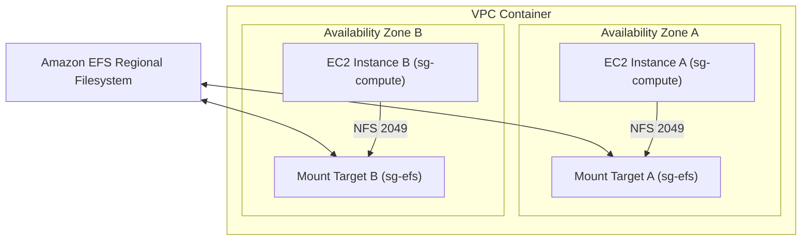

## Table of Contents

1. [Bridging Cloud State to the Host Operating System](#bridging-cloud-state-to-the-host-operating-system)
2. [What Is Compute-Attached Storage](#what-is-compute-attached-storage)
3. [Dedicated Virtual Disks vs. Shared Folders](#dedicated-virtual-disks-vs-shared-folders)
4. [Amazon EBS and the Single-Zone Placement Rule](#amazon-ebs-and-the-single-zone-placement-rule)
5. [Formatting, Mounting, and Persisting Volumes](#formatting-mounting-and-persisting-volumes)
6. [EBS Snapshots and Crash-Consistent Backups](#ebs-snapshots-and-crash-consistent-backups)
7. [Amazon EFS and Multi-AZ Shared Network Filesystems](#amazon-efs-and-multi-az-shared-network-filesystems)
8. [Configuring Mount Targets and NFS Security Groups](#configuring-mount-targets-and-nfs-security-groups)
9. [Putting It All Together](#putting-it-all-together)
10. [What's Next](#whats-next)

## Bridging Cloud State to the Host Operating System

The previous articles in this module detailed regional cloud state engines. S3 buckets store unstructured files accessed by HTTP keys; RDS instances run managed relational databases; and DynamoDB tables partition high-velocity key-value items. All of these systems are accessed over network interfaces using standard web APIs or database drivers.

However, certain software workloads cannot communicate with decoupled network APIs. They require standard Linux operating system filesystem operations:

* **Legacy Workloads**: Many off-the-shelf commercial applications are built to read and write relative directories on local disk paths (like `/var/lib/app/data`), completely lacking the code libraries to make S3 HTTP requests or SQL queries.
* **Low-Latency Index Engines**: Search indexes, build agents, and continuous integration compilation pipelines execute millions of rapid directory walking, file appends, and lock operations. For these workloads, database network round-trip latency is a major bottleneck.
* **Direct OS Boot Volumes**: Compute servers require a reliable, high-performance root volume containing the operating system, system libraries, and configuration files.

To run these workloads safely in the cloud, you cannot save files directly to a virtual machine's local root disk, as any host replacement during an automated scaling or deployment cycle will permanently erase your data. Instead, you must bridge regional cloud state directly to the host operating system using compute-attached storage: Amazon EBS and Amazon EFS.

## What Is Compute-Attached Storage

While S3, RDS, and DynamoDB provide regional data endpoints through external network APIs, certain programs require storage to behave like a local physical hard drive or a directory folder. They expect the host operating system to handle all reads and writes dynamically using standard filesystem commands, without any network API logic. Compute-attached storage bridges the gap between network-isolated cloud storage and local operating system mount paths.

Compute-attached storage functions as storage presented through the operating system filesystem interface. The application reads and writes paths, while AWS provides either a virtual block volume or a managed network filesystem underneath.

To support these workloads, AWS offers two primary attached storage shapes. Amazon Elastic Block Store (EBS) provides raw, unformatted virtual disk volumes that attach to EC2 instances inside one Availability Zone and appear to the operating system like local block devices. EBS is network-attached under the hood, but the instance sees it as a disk, making it a strong fit for boot drives, databases, and low-latency block I/O.

Amazon Elastic File System (EFS), conversely, provides a serverless network directory tree over the standard Network File System (NFS) protocol. A Regional EFS filesystem can be mounted simultaneously by hundreds of virtual machines and container tasks across multiple Availability Zones, coordinating concurrent file reads and writes in real time. EFS One Zone keeps the filesystem in one Availability Zone for lower cost when the workload does not need Multi-AZ resilience. Using attached storage allows you to deploy legacy applications, high-performance local search indexes, and collaborative document pipelines in the cloud without modifying their source code. The cloud volumes mount directly into the directory tree, providing the exact path-based interface (`/mnt/app/data`) that traditional operating system kernels expect.

## Dedicated Virtual Disks vs. Shared Folders

To select the correct attached storage service, you must understand the distinction between dedicated virtual hard drives and shared folders exposed across the network:

The anchor is attachment scope. EBS is a dedicated block device for one primary compute attachment, while EFS is a shared file service that many compute clients can mount over NFS.

* **Dedicated Virtual Disks (EBS)**: Presents a raw, unformatted virtual hard drive to a virtual server. The operating system formats the drive, mounts it to a local folder, and reads or writes data through normal block-device operations. EBS is still an AWS-managed network-attached service, but it is optimized for low-latency block access for database directories, operating system boot drives, and local application caches.
* **Shared Folders (EFS)**: Presents a pre-formatted, shared folder tree over the network using standard file sharing protocols. Instead of managing a raw virtual disk, your virtual server simply communicates using normal file and folder commands. The underlying storage is managed entirely by AWS. Multiple separate servers located in different Availability Zones can mount this exact same folder simultaneously, sharing files in real-time.

Choosing the incorrect type of storage introduces severe performance and operational penalties. Trying to run a database over a shared network folder like EFS will often cause write delays due to network file coordination overhead. Conversely, a standard EBS volume is designed for one attached instance at a time. EBS Multi-Attach exists for specific high-performance volume types and clustered filesystems, but it is not the normal answer for sharing application files. If many hosts need the same directory tree, use EFS or redesign around S3.


*EBS and EFS solve different filesystem problems. EBS behaves like a single-zone disk mounted by one host, while EFS behaves like a regional shared folder reached through mount targets in each zone.*

## Amazon EBS and the Single-Zone Placement Rule

Amazon Elastic Block Store, commonly referred to as EBS, provides high-performance virtual block storage volumes designed to attach exclusively to a single running EC2 instance. When you provision an EBS volume, you choose its size (in gigabytes) and its volume type, which dictates its physical performance characteristics (measured in Input/Output Operations Per Second, or IOPS).

An EBS volume behaves like a zonal virtual disk. It is created inside one Availability Zone and must attach to compute capacity in that same zone.

EBS enforces a critical architectural constraint: **The Single-Zone Placement Rule**. An EBS volume is created in one Availability Zone and can attach only to an EC2 instance in that same Availability Zone. Therefore, both the EC2 instance and the EBS volume must live in the same AZ.

This constraint significantly impacts high-availability architecture. First, this rule prevents cross-AZ attachment. An EC2 instance running in Availability Zone A cannot mount an EBS volume located in Availability Zone B. Second, it places limits on horizontal replication. If you need to scale your application horizontally across multiple Availability Zones, you cannot share a standard single EBS volume across those zones; instead, you launch separate, independent EBS volumes in each zone or use a different storage shape. Third, it gives you durable persistence that is separate from the instance lifecycle when the volume is configured to remain after termination. Many root volumes are deleted by default when the instance terminates, while separately attached data volumes commonly persist unless `DeleteOnTermination` is enabled. A preserved volume can be attached to a new instance in the same zone.

## Formatting, Mounting, and Persisting Volumes

When you attach a new EBS volume to an EC2 instance, the operating system sees it as a raw, unformatted block device (such as `/dev/nvme1n1`). The raw device is completely unusable by your application until you format, mount, and configure it within the Linux system.

Formatting and mounting are the Linux steps that turn a raw cloud block device into a usable directory path. The disk exists before this step, but the filesystem interface does not.

Let us walk through the exact terminal sequence required to discover, format, and mount a newly attached block volume on a Linux server:

```bash
$ lsblk
NAME        MAJ:MIN RM  SIZE RO TYPE MOUNTPOINTS
loop0         7:0    0 63.3M  1 loop /snap/core20/1822
nvme0n1     259:0    0    8G  0 disk 
├─nvme0n1p1 259:1    0  7.9G  0 part /
└─nvme0n1p15 259:2    0   99M  0 part /boot/efi
nvme1n1     259:3    0   20G  0 disk 

$ sudo mkfs -t ext4 /dev/nvme1n1
mke2fs 1.46.5 (30-Dec-2021)
Creating filesystem with 5242880 4k blocks and 1310720 inodes
Filesystem UUID: a1b2c3d4-e5f6-7890-abcd-ef1234567890

$ sudo mkdir -p /var/lib/orders-cache

$ sudo mount /dev/nvme1n1 /var/lib/orders-cache

$ sudo blkid /dev/nvme1n1
/dev/nvme1n1: UUID="a1b2c3d4-e5f6-7890-abcd-ef1234567890" BLOCK_SIZE="4096" TYPE="ext4"
```

The `lsblk` command lists all block devices, revealing the unformatted `nvme1n1` disk. Running `mkfs` formats the raw volume sectors with the `ext4` filesystem and assigns it a Universally Unique Identifier (UUID). We then create a local directory mount target and execute the `mount` command to wire the path `/var/lib/orders-cache` to the physical block disk.

A standard mount command is temporary; if the EC2 server reboots, the mount disappears. To make the mount persistent, you must add an entry to the system's filesystem table file: `/etc/fstab`.

```bash
$ cat /etc/fstab
# <file system>                            <mount point>             <type>  <options>          <dump>  <pass>
UUID=a1b2c3d4-e5f6-7890-abcd-ef1234567890  /var/lib/orders-cache     ext4    defaults,nofail    0       2
```

Writing a persistent entry in `/etc/fstab` requires six strict columns, detailed in the reference table below:

| Column | Name | Purpose | Example |
| --- | --- | --- | --- |
| 1 | `fs_spec` | The device identifier (always use the immutable partition UUID) | `UUID=a1b2c3d4-e5f6-7890-abcd-ef1234567890` |
| 2 | `fs_file` | The local directory path acting as the mount target | `/var/lib/orders-cache` |
| 3 | `fs_vfstype` | The formatted filesystem type | `ext4` |
| 4 | `fs_mntops` | Mount options (always include `nofail` to prevent server boot hangs if the disk is missing) | `defaults,nofail` |
| 5 | `fs_freq` | Dump command backup setting (normally disabled in modern cloud systems) | `0` |
| 6 | `fs_passno` | Filesystem check order during boot (`1` for root disk, `2` for data disks, `0` to bypass) | `2` |

## EBS Snapshots and Crash-Consistent Backups

To protect data stored on EBS volumes, you must take regular backups using **EBS Snapshots**. An EBS snapshot is a point-in-time copy of the volume's sectors, saved directly to S3-backed storage.

An EBS snapshot functions as a block-level recovery point for the volume. It captures disk contents from the storage layer, but the application may still need filesystem or database flushing for fully application-consistent recovery.

EBS snapshots utilize incremental backups. The first snapshot of a volume copies all written blocks, but later snapshots are incremental, meaning the snapshot system only stores blocks that have changed since the previous snapshot. This design significantly saves storage costs and reduces backup times. Furthermore, snapshots facilitate rebuilding volumes. You can restore an EBS snapshot into a completely new EBS volume in any Availability Zone within the Region, allowing you to migrate data across zones.

However, snapshotting a running system introduces a critical **Crash-Consistency** gotcha. When a snapshot is requested, the operating system and your active applications may have unwritten data cached in system memory. If you take a snapshot during active writes, the restored volume will represent a crash-consistent state equivalent to abrupt server power loss.

To improve database and file consistency beyond a basic crash-consistent snapshot, follow these three steps immediately before initiating an EBS snapshot:

1. **Quiesce the App**: Instruct your database or writing application to temporarily freeze active writes to the disk.
2. **Flush the OS Cache**: Run the Linux flush command to force the operating system kernel to write all cached blocks from memory onto the disk:
   ```bash
   sync
   ```
3. **Trigger the Snapshot**: Request the EBS snapshot through the AWS CLI or automated backup plans.

## Amazon EFS and Multi-AZ Shared Network Filesystems

When your cloud application scales horizontally across multiple Availability Zones, standalone EBS volumes cannot solve shared data needs. If multiple container tasks running on separate hosts must read and write to the same file path simultaneously, such as a content management system catalog or a shared incoming vendor directory, you must deploy **Amazon Elastic File System (EFS)**.

Amazon EFS behaves like a managed NFS filesystem exposed through mount targets in your VPC. Multiple EC2 instances or container tasks can mount the same filesystem path and coordinate file operations through the network filesystem protocol.

Amazon EFS provides a fully managed, elastic, and serverless network filesystem connected to your VPC. Unlike EBS, EFS can be either Regional or One Zone:

* **Regional Multi-AZ Access**: Regional EFS file systems store data across multiple Availability Zones, allowing a single filesystem to be mounted simultaneously by hundreds of virtual machines, container tasks, and serverless functions across your entire Region.
* **One Zone Cost Boundary**: EFS One Zone stores data inside one Availability Zone and supports a single mount target in that zone. It can be a useful lower-cost choice for reproducible or non-critical shared files, but it is not a Multi-AZ resilience design.
* **Elastic Scaling**: You do not provision disk size in advance; the filesystem grows and shrinks automatically as your application adds or deletes files, ensuring you only pay for active storage.
* **Standard Folder Semantics**: Supports standard file folder operations, including directory locking, file appends, and user permissions, making it fully compatible with traditional legacy applications.

EFS charges a premium for storage compared to EBS and S3. Therefore, you should use EFS strictly when your application genuinely requires a POSIX-compliant filesystem mounted by multiple concurrent hosts.

## Configuring Mount Targets and NFS Security Groups

Because Amazon EFS is a regional network service reached over your VPC, mounting it to your compute hosts requires careful network and security group engineering.

An EFS mount target acts as the zonal network entry point for the filesystem. Each mount target has a private IP address in a subnet, and clients connect to it over NFS on TCP port 2049.

To make EFS accessible inside your private network, you create mount targets. For Regional file systems, create one mount target in each Availability Zone where compute will mount the filesystem. If an Availability Zone has multiple subnets, EFS allows only one mount target for that filesystem in that Availability Zone, and instances in other subnets in the same zone can use it. For One Zone file systems, create the single mount target in the same Availability Zone as the filesystem. The mount target acts as a private network interface (ENI) assigned a private IP address within that subnet. Compute hosts resolve the EFS filesystem ID to the private IP of their local Availability Zone's mount target when one exists, keeping network latency and cross-AZ transfer costs lower.

Finally, you secure the connection using security group permissions. EFS communicates over TCP port 2049. To authorize access, you must configure a dedicated security group for your EFS mount targets (`sg-efs`) that allows inbound port 2049 traffic exclusively from your compute workload's security group (`sg-compute`).

```bash
$ sudo mount -t efs -o tls fs-12345678:/ /var/lib/shared-data
```

The mount command above uses the Amazon EFS mount helper from `amazon-efs-utils` and requests TLS in transit. The mount helper hides much of the raw NFS option complexity, monitors TLS mounts, and can be used from `/etc/fstab` for boot-time mounts. Raw NFSv4.1 mounting still exists, but for most Linux hosts the EFS mount helper is the beginner-friendly and security-friendly default.



Locking down mount target security groups prevents rogue network interfaces in other subnets from attempting to mount or tamper with your shared network directories.

## Putting It All Together

Amazon EBS and EFS bridge the gap between regional cloud networks and traditional server operating systems. Attached storage translates raw sectors and NFS protocols into local mount points that your application code can query using standard file paths:

* **Block Disk Delivery**: Deploy EBS volumes inside your EC2 server's Availability Zone to provide high-performance block storage for databases and caches.
* **Persistent OS Integration**: Format attached block disks and establish reboot-safe mount points by writing UUID entries with the `nofail` flag to `/etc/fstab`.
* **Crash-Safe Snapshots**: Flush operating system caches and freeze active application writes before triggering EBS snapshots when you need stronger application-level consistency.
* **Shared Network Filesystems**: Deploy regional EFS filesystems with multi-AZ mount targets to share directory trees across hundreds of separate hosts.
* **Securing Mount Paths**: Restrict EFS network traffic by whitelisting your compute security groups on TCP port 2049 inside your mount target security groups.

EBS and EFS are the primary cloud containers for operating-system-attached state. By aligning their deployment boundaries with correct network paths and security groups, you build a durable, high-performance local filesystem layer.

## What's Next

We have now established managed storage surfaces for all object, relational, key-value, and attached filesystem shapes in AWS. However, our data remains vulnerable to application bugs, bad database migrations, compromised root credentials, and accidental deletes. In the final article of this module, we will unify these stateful layers into a complete disaster recovery strategy using backups, point-in-time recovery logs, vault locks, and restore validation drills.


*Use this as the attached-storage checklist: keep EBS in the same zone as its instance, format and mount volumes intentionally, persist mounts by UUID, flush writes before snapshots, use EFS for multi-zone shared folders, and restrict NFS access through security groups.*

---

**References**

- [Amazon EBS volumes](https://docs.aws.amazon.com/AWSEC2/latest/UserGuide/EBSVolumes.html) - Details block-level virtual volumes, single-zone attachment rules, and SSD performance characteristics.
- [Amazon EFS features](https://docs.aws.amazon.com/efs/latest/ug/whatisefs.html) - Explains EFS elastic filesystems, NFSv4 protocol support, and multi-client regional mounting.
- [Availability and durability of EFS file systems](https://docs.aws.amazon.com/efs/latest/ug/features.html) - Explains Regional and One Zone EFS file system types.
- [Formatting and mounting EBS volumes](https://docs.aws.amazon.com/AWSEC2/latest/UserGuide/ebs-using-volumes.html) - Outlines command sequences, filesystem types, and /etc/fstab persistence setups.
- [Creating EBS snapshots](https://docs.aws.amazon.com/AWSEC2/latest/UserGuide/ebs-creating-snapshot.html) - Details crash-consistent backup procedures and OS memory flushing.
- [EFS mount target management](https://docs.aws.amazon.com/efs/latest/ug/accessing-fs.html) - Focuses on subnet groups, port 2049 security whitelists, and private network interfaces.
- [Mounting EFS file systems using the EFS mount helper](https://docs.aws.amazon.com/efs/latest/ug/efs-mount-helper.html) - Documents `amazon-efs-utils`, TLS mounts, and boot-time mount support.
