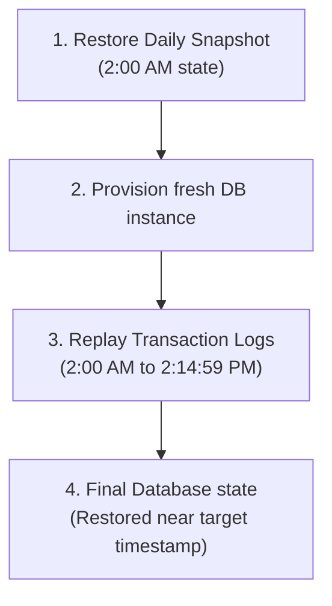

## Table of Contents

1. [The Illusion of Durability](#the-illusion-of-durability)
2. [Replicas vs. Backups: The Disaster Recovery Divide](#replicas-vs-backups-the-disaster-recovery-divide)
3. [Database Point-in-Time Recovery via Transaction Logs](#database-point-in-time-recovery-via-transaction-logs)
4. [Centralizing Schedules and Policies with AWS Backup](#centralizing-schedules-and-policies-with-aws-backup)
5. [Recovery Models: S3 Object Versioning vs. Block Snapshots](#recovery-models-s3-object-versioning-vs-block-snapshots)
6. [Deletion Blockades: Vault Lock and Object Lock](#deletion-blockades-vault-lock-and-object-lock)
7. [Balancing Compliance Retention against Deletion Obligations](#balancing-compliance-retention-against-deletion-obligations)
8. [Auditing Data Protection with Restore Drills](#auditing-data-protection-with-restore-drills)
9. [Putting It All Together](#putting-it-all-together)

## The Illusion of Durability

When you deploy all your application data shapes to highly durable cloud services in AWS, it is easy to fall into the illusion that your data is completely safe. S3 guarantees regional replication across multiple datacenters; RDS runs synchronous standby replicas; DynamoDB tables partition items across independent storage drives; and EBS block volumes persist independently from your server instances.

However, data durability is not the same as data safety. A highly durable storage service is designed to faithfully preserve and replicate whatever bytes you send it, including corrupted ones. If a buggy application migration script executes in production and accidentally nulls out 50,000 order header rows, your database will synchronously replicate those empty values across all Availability Zones in under a second. If a developer accidentally executes a recursive deletion command against a public asset prefix, S3 will durably and permanently erase those files from its storage nodes.

A robust cloud data architecture must prepare for human errors, application bugs, malicious actors, and catastrophic datacenter failures by constructing a deliberate, cross-service recovery strategy. You must know exactly what historical copies exist, how far back they go, who is allowed to delete them, and how you prove they can actually be restored in an emergency.

## Replicas vs. Backups: The Disaster Recovery Divide

A critical cloud engineering mistake is treating high-availability replication (such as Multi-AZ database standbys) as a substitute for database backups. While both maintain copies of your data, they serve fundamentally different operational purposes.

Replication is a live availability mechanism, while backups are historical recovery points. Replicas keep the current system online during infrastructure failure; backups let you return to an earlier state after bad writes, deletes, or compromise.

Standby replicas protect against physical hardware failures or datacenter outages. This replication is synchronous and immediate. If a primary database instance loses power, RDS triggers an automated DNS failover to the standby in another zone, ensuring your application remains online. However, because replication is an active mirror, any bad database writes, schema corruptions, or record deletions are instantly mirrored to the standby, destroying the data in both zones.

Historical backups, conversely, protect against data corruption, user errors, and software bugs. Backups are frozen, point-in-time representations of your data stored independently from the active database engine. If a bad script corrupts production tables, a backup allows you to restore the database state back to a healthy timestamp before the script ran.

Multi-AZ replicas keep your systems highly available, but only historical backups can keep your data safe. A secure cloud architecture requires both layers to be designed together.

## Database Point-in-Time Recovery via Transaction Logs

Once you establish the need for historical backups, a secondary recovery challenge emerges. If your backup strategy relies solely on taking a daily database snapshot at 2:00 AM, and a corrupted schema migration runs at 2:15 PM, restoring from the daily snapshot means losing over 12 hours of active customer transactions and completed checkouts.

Point-in-time recovery behaves like replaying a database to a chosen timestamp. A base snapshot provides the starting volume image, and transaction logs replay accepted writes up to the recovery target.

Amazon RDS reduces this data loss window using **Point-in-Time Recovery (PITR)**.

First, this process relies on the log pipeline. RDS relational databases continuously write transactional modifications to database logs that RDS archives for recovery. Second, it involves replaying the timeline. When you execute a point-in-time restore, RDS provisions a completely new database instance. It first restores the daily baseline snapshot taken before your target time, and then automatically replays the archived logs up to the restore time you specify, subject to the engine's latest restorable time.

This process can be executed directly from your terminal using the AWS CLI:

```bash
$ aws rds restore-db-instance-to-point-in-time \
    --source-db-instance-identifier production-db \
    --target-db-instance-identifier restored-staging-db \
    --restore-time 2026-05-26T14:14:59Z
{
    "DBInstance": {
        "DBInstanceIdentifier": "restored-staging-db",
        "DBInstanceStatus": "creating",
        "Engine": "postgres",
        "EngineVersion": "15.4",
        "DBSubnetGroup": {
            "DBSubnetGroupName": "production-subnet-group"
        }
    }
}
```

The command initiates the provisioning of a fresh database instance (`restored-staging-db`) inside your subnet group, restoring the baseline and replaying logs up to the timestamp before the bad script ran (`14:14:59Z`). This fine-grained restore path sharply reduces transactional data loss compared with daily snapshots alone, though the most recent restorable time can lag behind current production by a few minutes.



## Centralizing Schedules and Policies with AWS Backup

Rebuilding relational databases via transaction logs secures your structured records. However, a production cloud application depends on multiple different stateful resources, including EBS block volumes for EC2 local caches, EFS shared directories for CMS files, and DynamoDB serverless tables for key-value tokens. DynamoDB also has native point-in-time recovery for table state, and AWS Backup can help centralize protection policies across supported services. Managing isolated backup scripts and cron schedulers across all of these separate services quickly becomes an operational and compliance nightmare.

AWS Backup acts as a central policy engine for supported backup schedules, vaults, lifecycle rules, and restore points. It does not replace service-specific recovery behavior, but it gives operators one place to coordinate many supported resources.

To centralize data protection, you must deploy **AWS Backup**.

AWS Backup relies on Backup Plans. A Backup Plan is a formal policy that defines your organization's backup SLA (Service Level Agreement), dictating snapshot frequency, retention limits, and lifecycle transitions to cheaper storage. Instead of manually assigning backup schedules to individual databases or volumes, you configure tag-based resource assignment. For example, any stateful resource tagged with production rules is automatically discovered and backed up according to the plan's SLA.

You can verify vault and backup configurations directly from the CLI:

```bash
$ aws backup list-backup-plans
{
    "BackupPlansList": [
        {
            "BackupPlanArn": "arn:aws:backup:us-east-1:123456789012:backup-plan:a1b2c3d4",
            "BackupPlanId": "a1b2c3d4-e5f6-7890-abcd-ef1234567890",
            "CreationDate": "2026-05-26T18:00:00Z",
            "VersionId": "version-1",
            "BackupPlanName": "Production-Critical-SLA"
        }
    ]
}
```

Centralizing schedules through AWS Backup reduces custom scripting overhead and gives supported, assigned resources a single backup policy and audit trail. It does not protect a resource merely because the resource exists. The resource must be supported, included through tags or explicit assignment, and successfully backed up according to the plan. Operators should monitor backup job failures just like production application failures.

## Recovery Models: S3 Object Versioning vs. Block Snapshots

Centralizing your schedules ensures backups occur, but you must match your recovery model to the data shape of each service. Choosing the incorrect model can make restoring individual files slow and expensive, or leave raw disk drives inconsistent.

The recovery model must match the storage interface. Object versioning restores named objects and keys, while block snapshots restore volume-level disk state.

S3 Object Versioning operates a fine-grained, file-level recovery model. Because every file has its own independent version history, you can recover a single corrupted file simply by fetching its previous version ID. You do not need to pause other file operations or restore the entire bucket to recover a single key name.

EBS Block Snapshots, conversely, operate a coarse, disk-level recovery model. A disk snapshot captures the raw layout of a virtual disk at a single moment, and restoring it creates a completely new virtual disk volume. This is ideal for rebuilding a broken server's boot drive or database data directory, but it is highly inefficient if you only need to retrieve a single configuration file that was accidentally deleted from the disk.

By matching the recovery model to the data shape, you optimize your operational recovery time. Use S3 versioning for high-volume, individual document assets, and use EBS block snapshots for raw operating-system disks and database volumes.

## Deletion Blockades: Vault Lock and Object Lock

With S3 versioning and EBS snapshots centralizing your historical data protection, you have a solid recovery path. However, a major security threat remains: administrative compromise. If a malicious actor or ransomware script compromises your administrative cloud credentials, their first action will be to delete all your historical backups, snapshots, and version stacks before encrypting your active databases, leaving you with absolutely no path to recover.

Vault Lock and Object Lock are retention enforcement controls. They make selected backup or object versions undeletable for a configured period, even when an administrator account tries to remove them.

To defend against administrative compromise, you must implement secure cloud deletion blockades:

* **AWS Backup Vault Lock**: Vault Lock applies a strict write-once policy to your backup vaults that prevents any backup from being deleted or modified during the retention period. Once locked in compliance mode, the policy cannot be deleted, altered, or bypassed by anyone, including the AWS root account. Even an administrator cannot delete a backup until its configured retention window has naturally expired.
* **S3 Object Lock**: Enforces write-once-read-many protection directly at the S3 bucket level, preventing protected object versions from being deleted or overwritten for a specified retention period. Object Lock requires bucket versioning, and a normal delete request can still add a delete marker that hides the current object from ordinary reads. The protected version remains recoverable until its retention period expires.

For ransomware planning, AWS Backup also supports logically air-gapped vaults. These vaults add extra backup isolation, come equipped with Vault Lock compliance mode, and can be shared for restore access across accounts. They are useful when the recovery plan assumes the primary account may be impaired during an incident.

```bash
$ aws backup put-backup-vault-lock-configuration \
    --backup-vault-name production-critical-vault \
    --min-retention-days 35 \
    --max-retention-days 2555 \
    --changeable-for-days 7

$ aws backup describe-backup-vault \
    --backup-vault-name production-critical-vault
{
    "BackupVaultName": "production-critical-vault",
    "Locked": true,
    "MinRetentionDays": 35,
    "MaxRetentionDays": 2555,
    "LockDate": "2026-06-02T18:00:00Z"
}
```

The CLI sequence above configures Vault Lock with minimum and maximum retention rules and a short changeable window. During the changeable period, you can still remove or adjust the lock if you made a mistake. After that compliance lock becomes immutable, even the AWS root account cannot delete protected recovery points until their retention window has expired, preventing accidental or malicious data destruction.

| Feature | S3 Object Lock (Compliance Mode) | AWS Backup Vault Lock (Compliance Mode) |
| --- | --- | --- |
| **Protected Resource** | S3 Objects & Version Stacks | Backups, snapshots, and recovery points |
| **Who Can Bypass** | Nobody (including Root account) | Nobody (including Root account) |
| **Configuration Scope** | Individual S3 Buckets | Centralized AWS Backup Vaults |
| **Override Mechanism** | Impossible after lock window closes | Impossible after lock window closes |

## Balancing Compliance Retention against Deletion Obligations

Locking your backups inside compliance vaults strengthens data safety, but it introduces a major compliance conflict. While financial regulations require you to retain transaction ledgers and customer invoices for multiple years, privacy regulations (such as GDPR and CCPA "Right to Be Forgotten") grant users the legal right to request the permanent deletion of their personal data.

To manage this balance, you must write automated lifecycle and database rules:

First, configure production deletion rules. When a user requests deletion, their records must be permanently erased from your active production databases within the legally mandated window.

Second, define backup deletion grace windows. You do not need to immediately modify historical snapshots to remove a single user's record, as doing so would corrupt the block integrity of your backups. Instead, document a clear grace window and ensure that if a backup is restored, a post-restore script immediately re-applies any pending user deletion requests before the restored database is connected back to active traffic.

Third, manage compliance archiving. Group files that require long-term compliance retention under dedicated, long-term prefixes, and use automated lifecycle rules to transition old copies to cold archive storage to keep costs as low as possible. Automating these rules through lifecycle policies and database schemas prevents your company from storing massive volumes of mystery data, protecting your budget and making regulatory compliance easier to prove.

## Auditing Data Protection with Restore Drills

Your backup plans are now centralized, protected by compliance vaults, and aligned with privacy laws. However, a backup configuration is merely a setting; a backup that has never been restored is nothing more than an unverified assumption. You do not actually have a disaster recovery plan until you have proved, documented, and timed a full database and volume restoration.

A restore drill is a controlled recovery test. It proves that the backup artifact, permissions, network placement, secrets, migrations, and application validation path can produce a working environment.

To guarantee your recovery pipeline is operational, your engineering team must conduct regular **Restore Drills**.

First, you provision the target environment. Restore your database snapshots and disk volumes into a secure, isolated staging VPC subnet, fully separated from production traffic.

Second, you verify schemas and data. Connect to the restored database, execute queries to locate specific historical records (such as verifying that a specific customer order exists with all its items), and check that file permissions are accurate.

Third, you audit key access. Verify that the restored database has access to the correct encryption keys. If the keys were deleted or rotated incorrectly, the restore will fail.

Fourth, you log the metrics, documenting the drill, the duration of the restore, any issues encountered, and the steps taken to resolve them.

Finally, you clean up the staging area. Terminate all restored staging databases and volumes immediately after verification to avoid orphaned billing charges. Conducting monthly or quarterly restore drills reveals missing permissions, slow restore times, and broken operational runbooks, giving your team practiced evidence before a real production emergency.


*Replicas keep the system online, but backups create historical escape points. A usable recovery plan stores frozen copies, replays logs toward a chosen restore point, protects archives from deletion, and proves the path through restore drills.*

## Putting It All Together

A storage architecture is incomplete until the data recovery path is fully designed. Data safety and durability are coordinated across all cloud resource types through centralized backup vaults:

* **Disaster Divide**: Standby replicas protect against physical datacenter failures, while backups protect against data corruption, user errors, and software bugs.
* **Point-in-Time Timeline**: Use database transaction logs and native PITR features to restore near a chosen timestamp, minimizing database transactional data loss compared with daily snapshots alone.
* **Unified Backup Vaults**: Tag stateful assets to inherit automated AWS Backup plans, eliminating custom backup scripts across your cloud network.
* **Granular Recovery Models**: Rebuild individual files using S3 version stack history, and reconstruct system boot drives via block EBS snapshots.
* **Compliance Locks**: Secure S3 Object Lock and AWS Backup Vault Lock to defend historical snapshots against compromised administrative credentials.
* **Isolated Backup Copies**: Use cross-account copy or logically air-gapped vaults when recovery must survive compromise of the primary account.
* **GDPR vs. Backups**: Coordinate database deletions with post-restore grace window scripts to satisfy CCPA/GDPR obligations across backup archives.
* **Audited Drills**: Run regular, documented restore drills in isolated staging subnets to verify that KMS keys, schemas, and credentials function perfectly.

Durable, reliable cloud systems are constructed around the assumption of failure. By centralizing schedules, protecting archives, and drilling restorations, you establish a resilient data layer that remains secure, compliant, and restorable under any operational conditions.


*Use this as the backup checklist: separate replicas from backups, keep point-in-time restore available, centralize schedules with AWS Backup, match versioning or snapshots to the data shape, lock protected copies, and rehearse restoration before an emergency.*

---

**References**

- [AWS Backup concepts](https://docs.aws.amazon.com/aws-backup/latest/devguide/whatisbackup.html) - Focuses on centralized backup schedules, backup plans, recovery points, and protected vaults.
- [AWS Backup Vault Lock](https://docs.aws.amazon.com/aws-backup/latest/devguide/vault-lock.html) - Outlines vault policies, compliance locks, and write-once backup blockades.
- [Logically air-gapped vaults in AWS Backup](https://docs.aws.amazon.com/aws-backup/latest/devguide/logicallyairgappedvault.html) - Explains isolated backup vaults, built-in compliance mode, and cross-account restore sharing.
- [Amazon RDS backups](https://docs.aws.amazon.com/AmazonRDS/latest/UserGuide/USER_WorkingWithAutomatedBackups.html) - Explains automated snapshots, transaction log archiving, and point-in-time recovery pipelines.
- [S3 Object Lock](https://docs.aws.amazon.com/AmazonS3/latest/userguide/object-lock.html) - Details bucket-level retention modes, compliance scopes, and legal hold locks.
- [S3 Versioning concepts](https://docs.aws.amazon.com/AmazonS3/latest/userguide/Versioning.html) - Focuses on version IDs, delete marker behaviors, and historical file recovery.
- [CCPA/GDPR cloud guidelines](https://aws.amazon.com/compliance/gdpr-center/) - Details compliance strategies for data retention and user deletion obligations.
