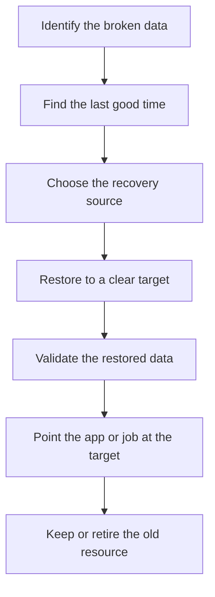

## Table of Contents

1. [The Data Safety Job](#the-data-safety-job)
2. [The Recovery Map for Orders](#the-recovery-map-for-orders)
3. [S3 Versioning and Lifecycle for Exports](#s3-versioning-and-lifecycle-for-exports)
4. [RDS Snapshots and Point-in-Time Recovery](#rds-snapshots-and-point-in-time-recovery)
5. [DynamoDB Recovery for Checkout State](#dynamodb-recovery-for-checkout-state)
6. [EBS and EFS Backups for Worker Files](#ebs-and-efs-backups-for-worker-files)
7. [Safe Deletion Is a Review, Not a Command](#safe-deletion-is-a-review-not-a-command)
8. [Failure Modes and Diagnosis](#failure-modes-and-diagnosis)
9. [The Retention Tradeoff](#the-retention-tradeoff)

## The Data Safety Job

Every backend has data that people expect to survive mistakes. A customer expects their order to stay visible after checkout. Finance expects yesterday's export to still download after a deploy.

A support engineer expects a receipt PDF to exist when a customer asks for it. A background worker expects its job-status records to stay long enough for retries and debugging. Backups, retention, and safe deletion are the operating habits that protect those expectations.

A backup is a recoverable copy or recovery point. It exists so you can return data to an earlier state after deletion, corruption, or a bad write. A restore is the act of using that backup or recovery point to create usable data again.

That sounds obvious, but the word "usable" matters. A backup that exists only in a console screenshot is not enough. The application must know where the restored data lives.

The team must know which time to restore to. The restored resource must have the right network, IAM, tags, secrets, and app configuration around it. Retention means how long you keep data or backups before they can expire.

Retention is a business decision written into AWS resources. If finance needs to correct monthly reports, daily order exports must survive long enough for that work.

If privacy rules say old temporary data should go away, the cleanup process must actually remove it. Versioning means keeping older versions of a changed object. In Amazon S3, versioning can preserve earlier versions when the same object key is overwritten or deleted.

That is different from a scheduled backup. Versioning protects the object key itself from normal overwrite and delete mistakes. Lifecycle means rules that move or expire data over time.

In S3, lifecycle rules can expire current objects, noncurrent versions, or delete markers. Lifecycle is useful because humans are bad at remembering to clean up old files by hand. It is also dangerous because a bad lifecycle rule can remove data at machine speed.

Deletion protection means a service-level guard that blocks deleting an important resource until someone deliberately turns the guard off. Amazon RDS and DynamoDB both have deletion protection features for database resources. Deletion protection does not stop every harmful write inside the database.

It helps with one specific class of mistake: deleting the whole database or table resource through AWS management actions. This article follows `devpolaris-orders-api`, a Node.js backend for checkout and orders. The service uses AWS data services in a normal small production shape:

| Data | AWS home | Why it matters |
|------|----------|----------------|
| Final orders and payments | RDS PostgreSQL | Business record and SQL queries |
| Receipt PDFs and exports | S3 | Generated files for customers and finance |
| Idempotency and job status | DynamoDB | Fast key-based checkout state |
| Worker scratch files | EBS or EFS | Files used by batch and export workers |

The operational story is simple. The DevPolaris team needs to recover from accidental deletion, bad deploy writes, and cleanup jobs that remove too much. That gives us a better question than "did we enable backups?"

The useful question is:

> If this data disappears or becomes wrong, how do we prove what happened, choose the right recovery point, and point the app at the recovered data safely?

Keep that question in your head. It turns backup settings into operational decisions.

## The Recovery Map for Orders

Before you choose AWS settings, you need to map the data. Many teams skip this step because backups feel like infrastructure work. Then an incident happens, and everyone discovers that "the orders system" is really five different data shapes.

For `devpolaris-orders-api`, those shapes are not equal. An order row is not the same kind of data as a temporary worker file. A receipt PDF is not the same kind of data as an idempotency key.

A daily export may be replaceable from the database, but only if the database still has the right records and the export code still works. That is why the first recovery artifact should be a plain map. It can live in a runbook, architecture note, or ticket checklist.

Here is the kind of map a reviewer can understand quickly:

| Data set | Example | Recover from | Restore target |
|----------|---------|--------------|----------------|
| Orders database | `orders-prod` RDS instance | Bad writes, accidental table changes, DB deletion | New RDS instance or selected logical repair |
| Receipt objects | `receipts/2026/05/02/order_ord_8x7k2n/...` | Object overwrite or delete | Earlier S3 object version |
| Finance exports | `exports/daily/2026/05/02/...` | Cleanup job deleted current export | Earlier S3 version or regenerated export |
| Idempotency records | `IDEMPOTENCY#checkout_...` | Bad deploy writes wrong status | Restored DynamoDB table or app-level repair |
| Job status records | `JOB#job_...` | Worker retry state lost | Restored DynamoDB table or accepted expiration |
| Worker files | `/mnt/orders-worker/tmp/export.csv` | Worker host loss, bad cleanup | EBS snapshot, EFS backup, or regeneration |

This table does two useful things. First, it separates "recoverable from backup" from "regenerate from source." Those are different promises.

If an export can be regenerated from RDS, the real recovery dependency is RDS plus the export code. If a receipt PDF contains signed document content that cannot be rebuilt exactly, S3 versioning and retention matter more. Second, it forces the team to name the restore target.

A restore target is where the recovered data will land. For many AWS services, restore does not overwrite the original resource in place. RDS point-in-time recovery creates a new DB instance.

DynamoDB point-in-time recovery restores to a new table. EBS snapshots restore to volumes. EFS backups can restore file system data through AWS Backup.

That means the recovery is not finished when AWS says "restore complete." The application still needs configuration that points to the correct resource. For `devpolaris-orders-api`, a production environment file might show the dependency clearly:

```text
service: devpolaris-orders-api
environment: prod

DATABASE_HOST=orders-prod.cluster-c8r2.example.us-east-1.rds.amazonaws.com
ORDERS_OBJECT_BUCKET=devpolaris-orders-prod-objects
CHECKOUT_STATE_TABLE=devpolaris-checkout-state-prod
WORKER_SHARED_PATH=/mnt/orders-worker
```

During a real restore, one of those values may need to change. That is where many recoveries fail. The backup is healthy.

The restore exists. But the app still points at the old database endpoint, old table name, or old bucket prefix. The DevPolaris team treats recovery as a short flow, not a single button:



Read this from top to bottom. The most important step is not the restore itself. It is choosing the last good time and proving the restored target is the one the application should use.

## S3 Versioning and Lifecycle for Exports

S3 is the easiest place to see the difference between delete, recover, and retain. `devpolaris-orders-api` writes receipt PDFs and daily finance exports into this bucket:

```text
bucket: devpolaris-orders-prod-objects
prefixes:
  receipts/
  exports/daily/
  manifests/
  tmp/releases/
```

The risky operation is not always a person clicking Delete in the console. It is often a cleanup job. For example, a release may generate temporary export files under `tmp/releases/2026-05-02.4/`.

After the release, a scheduled job deletes old temporary files. That is fine if the job is scoped to `tmp/releases/`. It is dangerous if a bad variable expands to `exports/` or to an empty prefix.

Here is a small log that should make an engineer pause:

```text
2026-05-02T09:42:18Z cleanup job=orders-export-cleanup env=prod
bucket=devpolaris-orders-prod-objects
configuredPrefix=exports/
expectedPrefix=tmp/releases/
action=DeleteObjects
objectCount=1842
status=started
```

The log gives you the diagnosis path. The configured prefix does not match the expected prefix. That means the job may delete current finance exports as well as release scratch files.

S3 Versioning helps with this class of mistake. When versioning is enabled on a bucket, S3 can keep multiple versions of the same object key. If the app overwrites `exports/daily/2026/05/02/devpolaris-orders-export-2026-05-02.csv`, the older version can still exist as a noncurrent version.

If a simple delete request deletes the object without naming a specific version ID, S3 places a delete marker. A delete marker makes the current object look deleted, while previous versions can still be retrieved by version ID. That is a very beginner-friendly recovery shape.

The key looks missing. But the older data may still be there behind the key's version history. You can prove the state with an AWS CLI listing like this:

```bash
$ aws s3api list-object-versions \
    --bucket devpolaris-orders-prod-objects \
    --prefix exports/daily/2026/05/02/devpolaris-orders-export-2026-05-02.csv
{
  "Versions": [
    {
      "Key": "exports/daily/2026/05/02/devpolaris-orders-export-2026-05-02.csv",
      "VersionId": "3HL4kqtJlcpXroDTDmJ+rmSpXd3dIbrH",
      "IsLatest": false,
      "LastModified": "2026-05-02T08:05:21+00:00",
      "Size": 481923
    }
  ],
  "DeleteMarkers": [
    {
      "Key": "exports/daily/2026/05/02/devpolaris-orders-export-2026-05-02.csv",
      "VersionId": "mF9pZs0exampleDeleteMarker",
      "IsLatest": true,
      "LastModified": "2026-05-02T09:42:19+00:00"
    }
  ]
}
```

Look at two fields. `IsLatest: true` on the delete marker explains why a normal read looks like the file is gone. The older version has a `VersionId`, which gives the team something specific to restore or copy.

Versioning keeps earlier versions available, but each stored version is still stored data. If an export is overwritten every day, old versions collect.

That is where lifecycle rules enter the story. A lifecycle rule can expire objects or old versions after the retention period your team chooses. For the orders bucket, the rule should be split by prefix.

Temporary release files should expire sooner than receipts or finance exports. The exact durations belong to DevPolaris business and privacy decisions, so this article will not invent numbers. The shape matters more than the specific value:

```json
{
  "Rules": [
    {
      "ID": "expire-release-temp-files",
      "Status": "Enabled",
      "Filter": {
        "Prefix": "tmp/releases/"
      },
      "Expiration": {
        "Days": 7
      }
    },
    {
      "ID": "expire-old-export-versions-after-reviewed-retention",
      "Status": "Enabled",
      "Filter": {
        "Prefix": "exports/daily/"
      },
      "NoncurrentVersionExpiration": {
        "NoncurrentDays": 90
      }
    }
  ]
}
```

Treat the numbers above as example policy values, not AWS defaults. The important design is that `tmp/releases/` and `exports/daily/` are separate rules. That separation makes review possible.

A reviewer can ask, "does this rule only touch temporary release files?" A reviewer can also ask, "does the export retention match the finance correction window?" S3 also has Object Lock for cases where object versions must not be overwritten or deleted for a fixed retention period or while a legal hold is present.

That is a stronger tool than ordinary versioning. You do not turn it on casually for every app bucket. You use it when the data has a real write-once or legal-retention requirement.

For a beginner, the main mental model is enough:

| S3 feature | What it protects against | What it does not decide |
|------------|--------------------------|-------------------------|
| Versioning | Accidental overwrite or simple delete of object keys | How long versions should stay |
| Lifecycle | Forgotten cleanup and storage growth | Whether a prefix is safe to expire |
| Object Lock | Deletion or overwrite of protected object versions | Which data legally needs that level of protection |

The tool helps only after the team names the recovery need.

## RDS Snapshots and Point-in-Time Recovery

RDS is where `devpolaris-orders-api` keeps final order records. This is the data the business treats as the source of truth for checkout. If a cleanup job deletes S3 exports, the team may be able to regenerate them from RDS.

If a bad deploy writes wrong order statuses into RDS, the situation is more serious. There are two beginner concepts to separate. A DB snapshot is a backup of the DB instance at a known point.

It is useful when you want a named recovery point, such as before a risky migration or before a large cleanup. Point-in-time recovery means restoring the DB instance to a specific time inside the available backup window. RDS uses backups and database transaction logs to make that possible.

The key beginner detail is that RDS point-in-time restore creates a new DB instance. It does not rewind the existing production instance in place. That is a safety feature because the source database remains available for investigation while the restored database is built.

It also creates an operational job for you. You must decide what to do with the restored instance. Imagine a bad deploy at 09:36 UTC.

The new version of `devpolaris-orders-api` accidentally marks pending orders as `cancelled` when a payment provider timeout happens. The first clue is an application log:

```text
2026-05-02T09:37:11Z service=devpolaris-orders-api env=prod
level=warn event=order_status_update
orderId=ord_01HVZK8W93S6 statusBefore=pending statusAfter=cancelled
reason=payment_provider_timeout release=2026-05-02.5
```

One log line does not prove database corruption. It gives you a lead. The next step is to compare expected write volume with actual changed rows.

A database query or application admin report might show this:

```text
orders status changes
window: 2026-05-02T09:30:00Z to 2026-05-02T09:45:00Z

status      count
----------  -----
paid        128
cancelled   947
refunded      3
```

The suspicious signal is not "cancelled exists." Orders can be cancelled normally. The suspicious signal is a sudden count that does not match checkout behavior.

Now the recovery question becomes precise: What was the last good time before the bad release started writing wrong statuses? If the team chooses 09:35:00 UTC, the restore target should carry that time in its name:

```bash
$ aws rds restore-db-instance-to-point-in-time \
    --source-db-instance-identifier orders-prod \
    --target-db-instance-identifier orders-prod-restore-20260502-093500 \
    --restore-time 2026-05-02T09:35:00Z
```

The command name tells the story. The source is `orders-prod`. The target is a new DB instance named with the restore time.

The restore time is the last good point the team chose. After the restore finishes, the work is still not done. The team must validate the restored data before pointing anything at it.

That validation can be small and focused:

```text
restore target: orders-prod-restore-20260502-093500
check:
  sample order ord_01HVZK8W93S6 has status=pending
  suspicious cancelled spike is absent
  latest expected paid order before restore time exists
  security group allows only review host access
decision:
  use restored DB for repair query, not direct production cutover
```

Sometimes the right fix is not to move the whole application to the restored database. The team may use the restored instance to compare rows and repair only the wrong records in production. Sometimes the right fix is a full cutover to the restored database.

That decision depends on how much bad data was written, how much valid data arrived after the restore time, and whether those later writes can be replayed or reconciled. Deletion protection belongs in this same conversation. For an RDS production database, deletion protection helps stop someone from deleting the DB instance through AWS management actions while the guard is enabled.

It does not stop a bad SQL statement like `update orders set status = 'cancelled'`. Backups help with bad data. Deletion protection helps with accidental resource deletion.

You want both, but you should not confuse them.

## DynamoDB Recovery for Checkout State

DynamoDB holds a different kind of data for `devpolaris-orders-api`. It stores idempotency records and checkout job status. Idempotency means the backend can recognize a repeated checkout request and avoid creating two orders.

Job status lets the frontend ask, "is my checkout still processing?" This data is smaller and more key-shaped than final order records. It is still operationally important.

A bad deploy can write the wrong status. A cleanup task can remove job records too early. A table deletion can remove every idempotency key and make retries dangerous.

DynamoDB has two recovery concepts to learn first. An on-demand backup is a backup you create for a table at a specific moment. Point-in-time recovery, often shortened to PITR, continuously protects table data so you can restore to a chosen time inside the configured recovery period.

DynamoDB restores table data to a new table. That new table detail matters for app configuration. If the current application still reads `devpolaris-checkout-state-prod`, a restored table named `devpolaris-checkout-state-restore-20260502-091500` will not help until something points at it or reads from it for repair.

Here is a realistic item that the orders API might store:

```json
{
  "pk": "IDEMPOTENCY#checkout_01HW2S8RN8Z7",
  "sk": "REQUEST",
  "requestHash": "sha256:18f9b31c",
  "status": "processing",
  "orderId": null,
  "jobId": "JOB#job_01HW2S8T23Q1",
  "createdAt": "2026-05-02T09:11:42Z",
  "expiresAt": 1777713102
}
```

The `expiresAt` field is an application field used for cleanup decisions. If DynamoDB TTL (Time to Live, a feature that deletes expired items based on a timestamp attribute) is enabled for that field, DynamoDB can remove items after they expire. TTL is useful for state that truly stops being useful.

It is dangerous when the timestamp is wrong. Imagine a release that accidentally writes `expiresAt` based on minutes instead of days. The app deploys at 09:10 UTC.

By 09:30 UTC, customers retrying checkout requests no longer have idempotency records. The logs start to look like this:

```text
2026-05-02T09:31:04Z service=devpolaris-orders-api
event=idempotency_lookup key=checkout_01HW2S8RN8Z7 result=MISS
release=2026-05-02.6

2026-05-02T09:31:05Z service=devpolaris-orders-api
event=checkout_started key=checkout_01HW2S8RN8Z7 jobId=job_01HW2W7Z8MP4
```

The bad sign is a miss for a key that should still exist. The diagnosis path is to inspect the table item history if you have streams or logs, then check current items for suspicious expiration values. The recovery decision is not automatically "restore the table and switch production."

For idempotency state, you may restore a table to inspect missing records, then use a controlled repair or temporary read path. For final order records, RDS is still the source of truth. That difference prevents over-recovery.

You do not want to roll the entire checkout state table back and accidentally lose valid job status written after the bad deploy. You want to recover the specific state needed to make retries safe. DynamoDB deletion protection is also useful on production tables.

It helps prevent accidental deletion of the whole table through normal table management operations when enabled. Like RDS deletion protection, it does not protect you from every bad write. It protects the table resource from being deleted.

For `devpolaris-checkout-state-prod`, the beginner checklist is:

| Question | Why it matters |
|----------|----------------|
| Is PITR enabled for the table that holds checkout safety state? | It gives the team a time-based recovery path for bad writes or deletes |
| Is deletion protection enabled on production tables? | It blocks accidental table deletion through table management |
| Is TTL used only for data that can safely expire? | It prevents useful operational state from disappearing too early |
| Does the app table name come from config? | It makes restore testing and controlled cutover possible |

Notice that none of these questions asks whether DynamoDB is "safe." Safety comes from matching the feature to the data's job.

## EBS and EFS Backups for Worker Files

Not all data starts in S3, RDS, or DynamoDB. Export workers often use files while they build output. The DevPolaris worker may write a large CSV to local attached storage before uploading it to S3.

Another worker may use a shared filesystem so several tasks can read the same generated files. In AWS, two beginner storage names appear here. EBS (Amazon Elastic Block Store) is block storage attached to compute, commonly to an EC2 instance.

You can think of it like a virtual disk for one machine. EFS (Amazon Elastic File System) is a managed shared file system that multiple compute environments can mount. You can think of it like a network folder for Linux workloads.

The recovery habit is different for each. EBS snapshots are point-in-time backups of EBS volumes. You restore a snapshot by creating a volume from it, then attaching or using that volume where needed.

EFS integrates with AWS Backup, which can restore file system data. AWS Backup can restore EFS data without doing a destructive overwrite of the source file system. For a beginner, the key is to avoid treating worker files as invisible.

If the worker file is only a temporary intermediate that can be regenerated, it may not need long retention. If the worker file is the only copy of a customer-visible export before upload, it needs a recovery story. Here is a simple worker status record:

```text
worker: devpolaris-orders-export-worker
host: i-0a12example
localPath: /mnt/orders-worker/tmp/exports/2026-05-02/orders.csv
uploadTarget: s3://devpolaris-orders-prod-objects/exports/daily/2026/05/02/orders.csv
status: upload_failed
error: AccessDenied
```

This tells you what to inspect. If the S3 upload failed, the worker file may still be the only copy. Deleting `/mnt/orders-worker/tmp/exports/2026-05-02/orders.csv` before the upload succeeds would turn a permission bug into a data loss problem.

The safe design is to clean up worker files only after the durable target is confirmed. That confirmation can be a simple object check:

```bash
$ aws s3api head-object \
    --bucket devpolaris-orders-prod-objects \
    --key exports/daily/2026/05/02/orders.csv
{
  "ContentLength": 481923,
  "ContentType": "text/csv",
  "Metadata": {
    "generated-by": "devpolaris-orders-export-worker",
    "source-job-id": "job_01HW3A9G7P"
  }
}
```

Only after that check passes should the cleanup job treat the local worker file as replaceable. EBS and EFS backups are not usually the first recovery tool for final order data. They are safety nets for file-based work that exists before or beside the durable service.

That distinction keeps your backup plan simple. RDS protects final relational data. S3 protects generated objects.

DynamoDB protects key-based checkout state. EBS and EFS protect worker file state when those files have not yet become durable somewhere else.

## Safe Deletion Is a Review, Not a Command

The dangerous part of deletion is that the command can be correct while the decision is wrong. `aws s3 rm` can run perfectly. `DeleteTable` can be authorized.

A lifecycle rule can match exactly what it was told to match. The problem is whether the team told it the right thing. Safe deletion starts by naming the data class.

For DevPolaris, these questions should come before any cleanup job runs in production:

| Review question | Good answer shape |
|-----------------|-------------------|
| What exact data will be deleted? | Bucket and prefix, table and key pattern, DB rows, or filesystem path |
| Why is it safe to delete now? | Retention period passed, durable copy exists, or data is truly temporary |
| How do we prove the scope before deleting? | Dry run count, sample keys, query result, or object manifest |
| What recovery exists if the scope is wrong? | S3 versions, RDS restore point, DynamoDB PITR, EBS snapshot, or EFS backup |
| Who owns the business decision? | Backend, finance, support, privacy, or platform owner |

Those questions catch ordinary mistakes, and ordinary mistakes delete data.

Here is a cleanup plan that is too vague:

```text
Delete old exports from S3 after release.
```

It does not say which prefix. It does not say whether current exports are included. It does not say whether finance still needs the files.

It does not say how the job proves its target before deleting. A better plan is still short, but it gives a reviewer evidence:

```text
cleanup: orders release temp files
bucket: devpolaris-orders-prod-objects
prefix: tmp/releases/
delete condition: release temp object is older than reviewed retention
exclude prefixes:
  exports/daily/
  receipts/
  manifests/
proof before delete:
  list first 20 matching keys
  count matching keys
  write manifest to s3://devpolaris-orders-prod-objects/manifests/cleanup/
recovery:
  S3 versioning enabled on bucket
  cleanup manifest retained for review
```

The plan uses concrete names. It also makes the cleanup manifest part of the evidence. A manifest is just a list of what the job planned to delete.

That list is useful when someone asks, "what exactly disappeared?" For database cleanup, the review should be even more careful. Deleting old idempotency records from DynamoDB may be normal.

Deleting unpaid orders from RDS because they look old is a business decision as well as a storage decision. The safer release pattern is to separate the read phase from the delete phase. First, produce evidence.

Then review the evidence. Then delete only the reviewed set. For example:

```text
cleanup candidate report
service: devpolaris-orders-api
table: devpolaris-checkout-state-prod
candidateType: expired job status
candidateCount: 3821
oldestCreatedAt: 2026-04-04T02:18:11Z
newestCreatedAt: 2026-04-25T23:59:02Z
sampleKeys:
  JOB#job_01HV2M7K31
  JOB#job_01HV2M8A44
  JOB#job_01HV2M8Q92
decision: approved for cleanup job 2026-05-02.1
```

This small approval record adds enough friction to make the delete decision visible. Visibility is a safety feature.

## Failure Modes and Diagnosis

Most backup failures are not "AWS had no feature for this." They are mismatches between the data, the restore target, and the application. Here are four failure modes the DevPolaris team should learn to recognize.

The first failure is a bad cleanup deleting current exports. The symptom is a finance download returning not found. The diagnosis starts with S3 object versions:

```bash
$ aws s3api list-object-versions \
    --bucket devpolaris-orders-prod-objects \
    --prefix exports/daily/2026/05/02/
```

If the current keys have fresh delete markers, the cleanup job likely touched the wrong prefix. The fix direction is to stop the cleanup job, recover needed object versions, and change the job so it can only target the reviewed temporary prefix. The second failure is an unclear restore target.

The team says "restore orders" but does not say whether the target is a new RDS instance, a repaired production database, a restored DynamoDB table, or regenerated S3 exports. The symptom is confused work:

```text
incident note:
  "RDS restore is complete, but API still shows bad statuses."

current app config:
  DATABASE_HOST=orders-prod.cluster-c8r2.example.us-east-1.rds.amazonaws.com

restored resource:
  orders-prod-restore-20260502-093500.c9n4.example.us-east-1.rds.amazonaws.com
```

The backup worked. The application still points at the old host. The fix direction is to choose a recovery mode: repair production from the restored database, or deliberately cut over application config after validation.

The third failure is a backup that exists but surrounding configuration is missing. An RDS restore may create a database instance, but the app also needs network access, credentials, parameter choices, and secrets. A DynamoDB restore may create a table, but tags and app config still need review.

An S3 object version may exist, but the current key may still have a delete marker. The diagnosis path is to inspect the restored resource and the app's runtime config together. Do not inspect only the backup page.

Inspect the path from app to data. The fourth failure is retention that is too short for the business need. This one feels unfair because every tool may be working as configured.

Finance asks for an export from a period that the lifecycle rule already expired. Support asks for a receipt after the object versions are gone. The database restore window no longer includes the time before the bad write.

The diagnosis is not a command. It is comparing retention policy to real business workflows. If the business needs a longer correction window, the retention decision must change.

If privacy or cost requires shorter retention, the business process must change so people do their work sooner or rely on a different approved record. Here is a compact incident checklist:

| Signal | First place to inspect | Likely correction |
|--------|------------------------|-------------------|
| S3 object returns not found after cleanup | `list-object-versions` for the key or prefix | Restore previous version or remove delete marker, then fix cleanup scope |
| RDS restore exists but app still shows old data | App config and restored DB endpoint | Validate and repair or cut over intentionally |
| DynamoDB retries create duplicate work | Idempotency item state, TTL values, PITR target | Restore for inspection and repair missing safety records |
| Worker upload failed and local file was removed | Worker logs, EBS snapshot, EFS backup, S3 head check | Restore or regenerate, then require durable upload proof before cleanup |

This table gives you an order of operations when data safety fails. You do not start by clicking every restore button.

You start by naming the missing data, the last good time, the restore target, and the app path back to that target.

## The Retention Tradeoff

Keeping data longer improves recovery. It gives you more time to notice a mistake. It gives support more history.

It gives finance more room to correct reports. It gives engineers a larger window for debugging bad deploys. But longer retention is not free.

It increases storage cost. It increases privacy responsibility. It increases cleanup complexity.

It may keep data that the business no longer has a good reason to hold. That is the central tradeoff:

> Longer retention gives you more recovery options, but it also gives you more data to protect, explain, and eventually delete.

The right answer is rarely "keep everything" or "delete as fast as possible." The right answer is different by data class. For DevPolaris, receipt PDFs, finance exports, idempotency records, and worker scratch files should not share one retention rule.

They have different jobs. They deserve different retention decisions. A useful beginner policy table looks like this:

| Data | Recovery value | Deletion pressure | Retention decision owner |
|------|----------------|-------------------|--------------------------|
| Final orders | Very high | High privacy responsibility | Backend plus business owner |
| Receipt PDFs | High | Customer and privacy responsibility | Backend plus support |
| Finance exports | High for reporting periods | Cost and access control | Finance plus backend |
| Idempotency records | High for short retry windows | Should expire when no longer useful | Backend |
| Job status records | Medium for debugging | Should not live forever | Backend |
| Worker scratch files | Low after durable upload | Cost and clutter | Platform plus backend |

The table is not meant to freeze policy forever. It teaches the shape of the decision. Different data earns different retention because different people depend on it in different ways.

When you are new to operations, it is tempting to think backups are the finish line. They are not. A backup is one part of a recovery system.

The full system includes versioning, lifecycle, snapshots, PITR, deletion protection, clear restore targets, app configuration, and careful cleanup review. That is the grown-up habit: do not ask only, "is there a backup?"

Ask, "can we recover the exact data the business needs, before the retention window closes, without pointing the app at the wrong thing?"

---

**References**

- [How S3 Versioning works](https://docs.aws.amazon.com/AmazonS3/latest/userguide/versioning-workflows.html) - Explains S3 object versions, delete markers, and how previous versions can be retrieved.
- [Lifecycle configuration elements](https://docs.aws.amazon.com/AmazonS3/latest/userguide/intro-lifecycle-rules.html) - Shows how S3 lifecycle rules manage current objects, noncurrent versions, and delete markers.
- [Restoring a DB instance to a specified time for Amazon RDS](https://docs.aws.amazon.com/AmazonRDS/latest/UserGuide/USER_PIT.html) - Documents RDS point-in-time restore behavior and the new DB instance restore target.
- [Backup and restore for DynamoDB](https://docs.aws.amazon.com/amazondynamodb/latest/developerguide/Backup-and-Restore.html) - Describes DynamoDB on-demand backups and point-in-time recovery restores.
- [How AWS Backup works with supported AWS services](https://docs.aws.amazon.com/aws-backup/latest/devguide/working-with-supported-services.html) - Shows how AWS Backup works with services such as EBS and EFS.
- [Create Amazon EBS snapshots](https://docs.aws.amazon.com/ebs/latest/userguide/ebs-creating-snapshot.html) - Explains EBS snapshots as point-in-time backups of volumes.
