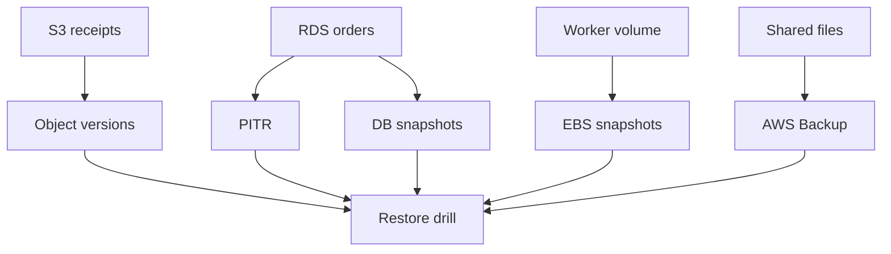

## Table of Contents

1. [The Problem](#the-problem)
2. [What Is A Backup](#what-is-a-backup)
3. [Recovery Points](#recovery-points)
4. [Versioning](#versioning)
5. [Snapshots](#snapshots)
6. [Point-In-Time Recovery](#point-in-time-recovery)
7. [Retention](#retention)
8. [Safe Deletion](#safe-deletion)
9. [Restore Drills](#restore-drills)
10. [Sample Recovery Map](#sample-recovery-map)
11. [Putting It All Together](#putting-it-all-together)
12. [What's Next](#whats-next)

## The Problem

The storage choices are now clear. Receipts live in S3. Orders live in RDS. Idempotency records live in DynamoDB. A worker may use EBS or EFS when it truly needs disk or file behavior.

Then the first real data mistake arrives:

- A release writes bad status values into thousands of order rows.
- A cleanup job deletes export files that finance still needed.
- A support script overwrites receipt PDFs under the same S3 keys.
- An EC2 data volume is corrupted by a job that wrote to the wrong path.
- A developer asks whether old customer data can be deleted safely.

At that moment, "we use durable AWS services" is not enough. The team needs to know which previous copy exists, how far back it goes, whether it can be restored, and who is allowed to delete it.

Backups and retention are the recovery story for storage.

## What Is A Backup

A backup is a recoverable copy of data from a point in time. That sounds obvious until a team tries to use a log, replica, cache, export, or dashboard as if it were a backup.

A useful backup has a job:

| Question | Good answer |
| --- | --- |
| What data does it protect? | A bucket prefix, DB instance, EBS volume, table, or file system |
| What moment does it represent? | A timestamp, version, snapshot, or recovery point |
| How long is it kept? | A retention policy or lifecycle rule |
| Who can delete it? | A controlled role or protected process |
| How is it restored? | A documented and tested restore path |

Backups are not only for cloud outages. Many recovery events are caused by normal application work: bad migrations, mistaken deletes, broken scripts, incorrect lifecycle rules, or overwrites with the wrong key.

The backup question should appear while designing storage, not after the first incident.

## Recovery Points

A recovery point is the point in time or version you can restore from. It is the answer to "how far back can we go?"

Different services create recovery points differently:

| Data shape | Recovery point example |
| --- | --- |
| S3 object | Previous object version |
| RDS database | Automated backup point or manual snapshot |
| EBS volume | EBS snapshot |
| EFS filesystem | AWS Backup recovery point |
| Application export | Object stored under a retained key |

This matters because not every recovery point has the same granularity. Restoring one S3 object version is different from restoring an entire database. Restoring an EBS snapshot creates a volume from a point in time, but application-level consistency depends on what the workload was doing when the snapshot was taken.

The practical habit is to map each important data shape to its recovery point before something breaks.

## Versioning

Versioning keeps earlier versions of an object when the same key changes. In S3, versioning can protect against overwrites and accidental deletes by preserving previous object versions.

For receipt PDFs, versioning is a strong safety layer. If a bug writes blank files over existing receipts, the current object may be wrong, but the previous versions can still exist. That gives the team a way to repair without asking customers to regenerate history.

Versioning also creates retention responsibility. Old versions can accumulate. Delete markers can make an object appear deleted while older versions remain. Lifecycle rules need to say what happens to noncurrent versions, not only current objects.

The lesson is that versioning protects change, while lifecycle controls age. They should be designed together.

## Snapshots

Snapshots capture storage state at a point in time. EBS snapshots protect block volumes. RDS manual snapshots can preserve database state outside normal automated backup windows. Snapshots are useful for before-risk moments: before a migration, before a major cleanup, before an operating system change, or before replacing a storage volume.

EBS snapshots are incremental after the first snapshot, which means later snapshots store changed blocks rather than copying the entire volume again. That helps with cost and speed, but the restore point still represents a whole volume state.

Snapshots have an application-consistency gotcha. A snapshot can capture the storage layer while an application has pending writes or cached data. For some workloads, a crash-consistent snapshot may be acceptable. For others, the app must pause, flush, quiesce, or use a backup-aware workflow.

The snapshot question is not only "does one exist?" It is "what would restoring this snapshot prove?"

## Point-In-Time Recovery

Point-in-time recovery, often shortened to PITR, lets a database restore to a chosen moment within a retention window. RDS automated backups can support this for DB instances when configured.

PITR is valuable for data mistakes because the right restore point may not be a named snapshot. If a bad migration ran at 10:17 and was noticed at 10:43, the team may need a state just before 10:17.

There is still work around the restore. Restoring a database usually creates another database resource or returns a database to a previous state through a controlled process. The team must decide how to compare data, switch application traffic, replay safe changes, or extract only the needed rows.

PITR is a recovery capability. It is not a substitute for knowing when the bad change happened, which app versions wrote to the database, and how to validate the restored state.

## Retention

Retention is the answer to "how long do we keep this copy?" Too short, and the team discovers the mistake after the recovery window closed. Too long, and the team keeps sensitive or expensive data without a reason.

Retention should come from the risk and obligation:

| Data | Retention question |
| --- | --- |
| Receipt PDFs | How long must customers and support retrieve them? |
| Temporary exports | When do they stop being useful? |
| RDS backups | How far back must the team recover from bad writes? |
| EBS snapshots | How long are old volume states useful? |
| Deleted customer data | When must data be removed rather than preserved? |

This is where lifecycle rules, backup plans, and deletion policies meet. Retention is not always "keep more." Sometimes safety means deleting on purpose after the business and legal need ends.

The most important habit is to make retention visible. A bucket full of mystery exports is not safer than a bucket with clear lifecycle rules and documented exceptions.

## Safe Deletion

Safe deletion is a review, not a command. The dangerous part of deletion is rarely the CLI syntax. It is the uncertainty around what depends on the data, whether a recovery copy exists, and whether deletion is actually allowed.

Before deleting storage, ask:

| Question | Why it matters |
| --- | --- |
| What exact resource or prefix is being deleted? | Prevents broad or wrong-target deletes |
| Who owns the data? | Confirms business meaning and approval |
| What reads it today? | Avoids deleting active dependencies |
| What recovery copy exists? | Makes rollback possible when deletion is accidental |
| What retention rule applies? | Confirms whether keeping or deleting is required |

S3 prefixes deserve extra care because they can look like folders while representing many object keys. Databases deserve extra care because one delete can remove related business history. Snapshots deserve extra care because deleting an old recovery point can shrink the recovery window.

Safe deletion creates a paper trail the next engineer can understand.

## Restore Drills

A backup that has never been restored is only partially trusted. Restore drills turn backup configuration into evidence.

A useful restore drill is small and specific. Restore an RDS backup into a staging VPC and confirm a known order exists. Restore an EBS snapshot into a new volume and mount it read-only. Retrieve a previous S3 object version and verify its checksum or content. Restore an EFS recovery point into a safe location and confirm the expected file tree.

The drill should record:

| Drill evidence | Example |
| --- | --- |
| Source | `orders-prod` RDS automated backup |
| Restore target | `orders-restore-drill-2026-05` |
| Expected data | `order-1042` with three line items |
| Validation | App or SQL check passed |
| Time taken | Useful for recovery expectations |
| Cleanup | Restore target removed after review |

Restore drills reveal missing permissions, broken runbooks, slow restores, forgotten encryption keys, and assumptions about app configuration. That is exactly their job.

## Sample Recovery Map

For the orders application, a recovery map might look like this:

The map says which recovery copy belongs to each storage shape. It also shows that restore drills are not separate from backup design. They are how the team proves the copies work.

If a data shape has no arrow to a recovery point, the team should know why. Maybe the data is temporary. Maybe it can be regenerated. Maybe that is a real gap.

## Putting It All Together

The opening incidents were all different: bad rows, deleted exports, overwritten receipts, corrupted volumes, and customer data deletion. They share one question: what copy or rule lets the team recover or delete safely?

Versioning helps with object overwrites. Snapshots help with volume and database point-in-time copies. RDS point-in-time recovery helps restore relational state inside a retention window. Lifecycle and backup retention decide how long copies remain. Safe deletion review prevents the team from turning cleanup into data loss. Restore drills prove the plan works before the incident.

Good storage design does not end when data is written successfully. It ends when the team knows how data is recovered, retained, and deleted.

## What's Next

The next AWS module focuses on observability. After data has a home and a recovery story, teams need signals that show whether the system is healthy: logs, metrics, traces, dashboards, and alarms.

---

**References**

- [Retaining multiple versions of objects with S3 Versioning](https://docs.aws.amazon.com/AmazonS3/latest/userguide/Versioning.html). Supports the S3 versioning explanation for previous object versions and delete behavior.
- [Introduction to backups](https://docs.aws.amazon.com/AmazonRDS/latest/UserGuide/USER_WorkingWithAutomatedBackups.html). Supports RDS automated backups, backup retention, and point-in-time recovery behavior.
- [How Amazon EBS snapshots work](https://docs.aws.amazon.com/ebs/latest/userguide/how_snapshots_work.html). Supports the EBS snapshot explanation, including point-in-time state and incremental snapshots.
- [Create Amazon EBS snapshots](https://docs.aws.amazon.com/ebs/latest/userguide/ebs-creating-snapshot.html). Supports the snapshot consistency guidance around cached data and pausing writes.
- [AWS Backup Documentation](https://aws.amazon.com/documentation-overview/backup/). Supports the backup vault, recovery point, lifecycle, cold storage, and retention framing for centralized backup plans.
