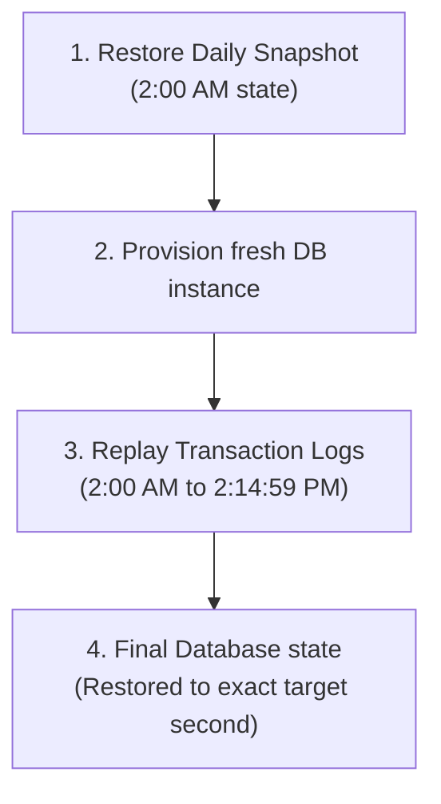

## Table of Contents

1. [The Illusion of Durability](#the-illusion-of-durability)
2. [Replicas vs. Backups: The Disaster Recovery Divide](#replicas-vs-backups-the-disaster-recovery-divide)
3. [Database Point-in-Time Recovery via Transaction Logs](#database-point-in-time-recovery-via-transaction-logs)
4. [Centralizing Schedules and Policies with AWS Backup](#centralizing-schedules-and-policies-with-aws-backup)
5. [Recovery Models: S3 Object Versioning vs. Block Snapshots](#recovery-models-s3-object-versioning-vs-block-snapshots)
6. [Deletion Blockades: Vault Lock, Object Lock, and MFA Delete](#deletion-blockades-vault-lock-object-lock-and-mfa-delete)
7. [Balancing Compliance Retention against Deletion Obligations](#balancing-compliance-retention-against-deletion-obligations)
8. [Auditing Data Protection with Restore Drills](#auditing-data-protection-with-restore-drills)
9. [Putting It All Together](#putting-it-all-together)

## The Illusion of Durability

When you deploy all your application data shapes to highly durable cloud services in AWS, it is easy to fall into the illusion that your data is completely safe. S3 guarantees regional replication across multiple datacenters; RDS runs synchronous standby replicas; DynamoDB tables partition items across independent storage drives; and EBS block volumes persist independently from your server instances.

However, data durability is not the same as data safety. A highly durable storage service is designed to faithfully preserve and replicate whatever bytes you send it, including corrupted ones. If a buggy application migration script executes in production and accidentally nulls out 50,000 order header rows, your database will synchronously replicate those empty values across all Availability Zones in under a second. If a developer accidentally executes a recursive deletion command against a public asset prefix, S3 will durably and permanently erase those files from its storage nodes.

A robust cloud data architecture must prepare for human errors, application bugs, malicious actors, and catastrophic datacenter failures by constructing a deliberate, cross-service recovery strategy. You must know exactly what historical copies exist, how far back they go, who is allowed to delete them, and how you prove they can actually be restored in an emergency.

A critical cloud engineering mistake is treating high-availability replication (such as Multi-AZ database standbys) as a substitute for database backups. While both maintain copies of your data, they serve fundamentally different operational purposes.

Standby replicas protect against physical hardware failures or datacenter outages. This replication is synchronous and immediate. If a primary database instance loses power, RDS triggers an automated DNS failover to the standby in another zone, ensuring your application remains online. However, because replication is an active mirror, any bad database writes, schema corruptions, or record deletions are instantly mirrored to the standby, destroying the data in both zones.

Historical backups, conversely, protect against data corruption, user errors, and software bugs. Backups are frozen, point-in-time representations of your data stored independently from the active database engine. If a bad script corrupts production tables, a backup allows you to restore the database state back to a healthy timestamp before the script ran.

Multi-AZ replicas keep your systems highly available, but only historical backups can keep your data safe. A secure cloud architecture requires both layers cabled together.

Once you establish the need for historical backups, a secondary recovery challenge emerges. If your backup strategy relies solely on taking a daily database snapshot at 2:00 AM, and a corrupted schema migration runs at 2:15 PM, restoring from the daily snapshot means losing over 12 hours of active customer transactions and completed checkouts.

Amazon RDS resolves this data loss window using **Point-in-Time Recovery (PITR)**. 

First, this process relies on the log pipeline. RDS relational databases continuously write all transactional modifications to physical transaction logs cabled to a secure S3-backed log archive. Second, it involves replaying the timeline. When you execute a point-in-time restore, RDS provisions a completely new database instance. It first restores the daily baseline snapshot taken immediately before your target time, and then automatically replays the archived transaction logs up to the exact second you specify. Third, this provides second-level precision. This granularity allows you to restore your database state back to the exact second before a bad migration ran (such as 2:14:59 PM), preserving all customer transactions that completed immediately prior.

Enabling automated backups and archiving transaction logs is the baseline requirement to unlock PITR, ensuring you can recover structured relational state with virtually zero transactional data loss.

Rebuilding relational databases via transaction logs secures your structured records. However, a production cloud application depends on multiple different stateful resources, including EBS block volumes for EC2 local caches, EFS shared directories for CMS files, and DynamoDB serverless tables for key-value tokens. Managing isolated backup scripts and cron schedulers across all of these separate services quickly becomes an operational and compliance nightmare.

To centralize data protection, you must deploy **AWS Backup**. 

AWS Backup relies on Backup Plans. A Backup Plan is a formal policy that defines your organization's backup SLA (Service Level Agreement), dictating snapshot frequency, retention limits, and lifecycle transitions to cheaper storage. Instead of manually assigning backup schedules to individual databases or volumes, you configure tag-based resource assignment. For example, any stateful resource tagged with production rules is automatically discovered and backed up according to the plan's SLA. Finally, the service provides a centralized audit trail. AWS Backup tracks and logs all backup successes, failures, and restore operations in a single console, making it easy to generate compliance reports for security auditors.

Centralizing schedules through AWS Backup eliminates custom scripting overhead and guarantees that every stateful resource in your cloud topology inherits a secure backup plan automatically.

Centralizing your schedules ensures backups occur, but you must match your recovery model to the data shape of each service. Choosing the incorrect model can make restoring individual files slow and expensive, or leave raw disk drives inconsistent.

S3 Object Versioning operates a fine-grained, file-level recovery model. Because every file has its own independent version history, you can recover a single corrupted file simply by fetching its previous version ID. You do not need to pause other file operations or restore the entire bucket to recover a single key name. 

EBS Block Snapshots, conversely, operate a coarse, disk-level recovery model. A disk snapshot captures the raw layout of a virtual disk at a single moment, and restoring it creates a completely new virtual disk volume. This is ideal for rebuilding a broken server's boot drive or database data directory, but it is highly inefficient if you only need to retrieve a single configuration file that was accidentally deleted from the disk.

By matching the recovery model to the data shape, you optimize your operational recovery time. Use S3 versioning for high-volume, individual document assets, and use EBS block snapshots for raw operating-system disks and database volumes.

## Deletion Blockades: Vault Lock, Object Lock, and MFA Delete

With S3 versioning and EBS snapshots centralizing your historical data protection, you have a solid recovery path. However, a major security threat remains: administrative compromise. If a malicious actor or ransomware script compromises your administrative cloud credentials, their first action will be to delete all your historical backups, snapshots, and version stacks before encrypting your active databases, leaving you with absolutely no path to recover.

To defend against administrative compromise, you must implement secure cloud deletion blockades:

* **AWS Backup Vault Lock**: Vault Lock applies a strict write-once policy to your backup vaults that prevents any backup from being deleted or modified during the retention period. Once locked in compliance mode, the policy cannot be deleted, altered, or bypassed by anyone, including the AWS root account. Even an administrator cannot delete a backup until its configured retention window has naturally expired.
* **S3 Object Lock**: Enforces identical deletion protection directly at the S3 bucket level, preventing object versions from being deleted or overwritten for a specified retention period.
* **S3 MFA Delete**: Configures a bucket to require a physical hardware Multi-Factor Authentication (MFA) token to authorize any permanent deletions of object versions or changes to bucket versioning states.

Deploying these deletion blockades ensures that even a compromised administrator credential cannot destroy your historical recovery copies, providing absolute immunity against ransomware deletion threats.

Locking your backups inside compliance vaults guarantees data safety, but it introduces a major compliance conflict. While financial regulations require you to retain transaction ledgers and customer invoices for multiple years, privacy regulations (such as GDPR and CCPA "Right to Be Forgotten") grant users the legal right to request the permanent deletion of their personal data.

To manage this balance, you must write automated lifecycle and database rules. 

First, configure production deletion rules. When a user requests deletion, their records must be permanently erased from your active production databases within the legally mandated window. Second, define backup deletion grace windows. You do not need to immediately modify historical snapshots to remove a single user's record, as doing so would corrupt the block integrity of your backups. Instead, document a clear grace window and ensure that if a backup is restored, a post-restore script immediately re-applies any pending user deletion requests before the restored database is cabled back to active traffic. Third, manage compliance archiving. Group files that require long-term compliance retention under dedicated, long-term prefixes, and use automated lifecycle rules to transition old copies to cold archive storage to keep costs as low as possible.

Automating these rules through lifecycle policies and database schemas prevents your company from storing massive volumes of mystery data, protecting your budget and ensuring absolute regulatory compliance.

Your backup plans are now centralized, cabled to compliance vaults, and aligned with privacy laws. However, a backup configuration is merely a setting; a backup that has never been restored is nothing more than a hope. You do not actually have a disaster recovery plan until you have proved, documented, and timed a full database and volume restoration.

To guarantee your recovery pipeline is operational, your engineering team must conduct regular **Restore Drills**. 

First, you provision the target environment. Restore your database snapshots and disk volumes into a secure, isolated staging VPC subnet, cabled completely apart from production traffic. Second, you verify schemas and data. Connect to the restored database, execute queries to locate specific historical records (such as verifying that a specific customer order exists with all its items), and check that file permissions are accurate. Third, you audit key access. Verify that the restored database has access to the correct encryption keys. If the keys were deleted or rotated incorrectly, the restore will fail. Fourth, you log the metrics, documenting the drill, the duration of the restore, any issues encountered, and the steps taken to resolve them. Finally, you clean up the staging area. Terminate all restored staging databases and volumes immediately after verification to avoid orphaned billing charges.

Conducting monthly or quarterly restore drills reveals missing permissions, slow restore times, and broken operational runbooks, ensuring your team can act with absolute confidence during a real production emergency.

## Putting It All Together

Durable cloud storage services faithfully preserve all writes, making an explicit recovery strategy essential to defend against bugs, user mistakes, and security compromises:

* **Reconciliation of Purpose**: Deploy Multi-AZ standbys to survive physical datacenter failures, and maintain frozen historical backups to recover from data corruption.
* **Centralizing Policies**: Deploy AWS Backup plans to automate Tag-based snapshot schedules and lifecycle policies across all stateful cloud resources.
* **Second-Level Accuracy**: Enable automated backups and transaction log archives on RDS to support precise, second-level Point-in-Time Recovery.
* **WORM Vault Defense**: Lock your backup vaults and S3 buckets with compliance policies to guarantee backups cannot be erased by ransomware.
* **Restore Validation**: Conduct regular restore drills in isolated staging networks to verify encryption keys and prove your recovery runbooks actually work.

Disaster recovery is the absolute final gate of cloud storage architecture. By securing your recovery points and routinely auditing your restore paths, you guarantee your application's state remains highly resilient, immediately recoverable, and permanently protected.

---

**References**

- [AWS Backup developer guide](https://docs.aws.amazon.com/aws-backup/latest/devguide/whatisbackup.html) - Compiles all centralized backup features, policies, and vault architectures.
- [Point-in-Time Recovery for RDS](https://docs.aws.amazon.com/AmazonRDS/latest/UserGuide/USER_PIT.html) - Details transaction log archiving, snapshot replaying, and second-level restores.
- [S3 Object Lock overview](https://docs.aws.amazon.com/AmazonS3/latest/userguide/object-lock.html) - Focuses on S3 WORM compliance policies, retention modes, and legal holds.
- [AWS Backup Vault Lock](https://docs.aws.amazon.com/aws-backup/latest/devguide/vault-lock.html) - Explains compliance vault lock states, WORM overrides, and deletion blockades.
- [EBS snapshot retention and cleanup](https://docs.aws.amazon.com/AWSEC2/latest/UserGuide/clean-up-snapshots.html) - Outlines snapshot lifecycles, deletion rules, and incremental block storage costs.
- [Testing backup recovery with restore drills](https://docs.aws.amazon.com/aws-backup/latest/devguide/restoring-resources.html) - Details validation methodologies, staging VPC setups, and KMS key auditing.
