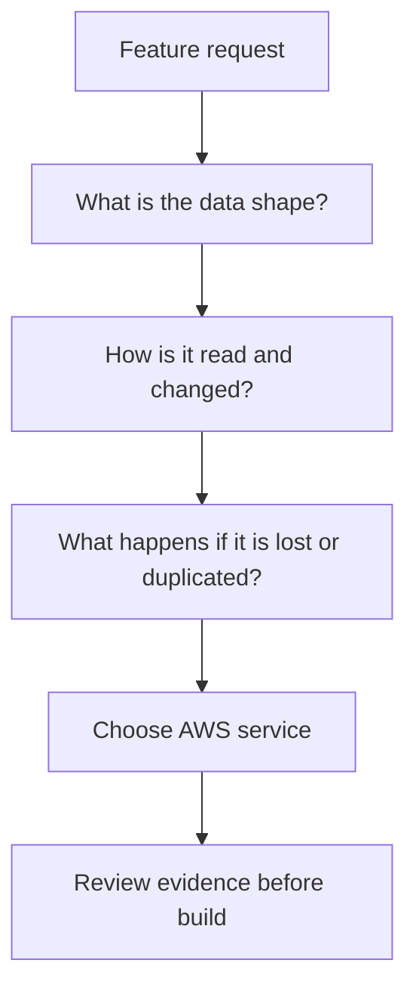
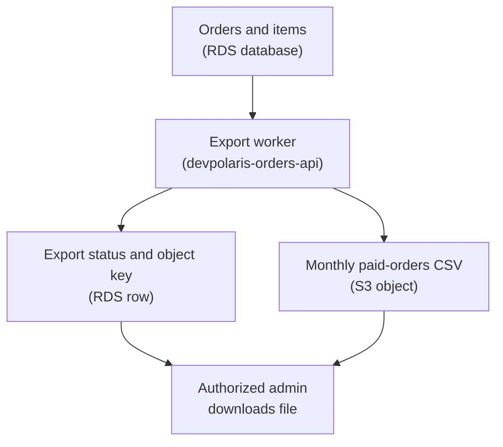

## Table of Contents

1. [The Choice Starts Before The Service Name](#the-choice-starts-before-the-service-name)
2. [Ask What The Data Is Doing](#ask-what-the-data-is-doing)
3. [Decision Table For Everyday AWS Data Choices](#decision-table-for-everyday-aws-data-choices)
4. [Feature Review: Order Records](#feature-review-order-records)
5. [Feature Review: Receipt Files And Export Files](#feature-review-receipt-files-and-export-files)
6. [Feature Review: Idempotency And Job Status](#feature-review-idempotency-and-job-status)
7. [Feature Review: Temporary Reports And Shared Input](#feature-review-temporary-reports-and-shared-input)
8. [Failure Patterns That Tell You The Choice Is Wrong](#failure-patterns-that-tell-you-the-choice-is-wrong)
9. [Tradeoffs You Should Say Out Loud](#tradeoffs-you-should-say-out-loud)
10. [A Practical Review Checklist](#a-practical-review-checklist)

## The Choice Starts Before The Service Name

Choosing an AWS data service means deciding what kind of promise your application needs from storage. That promise might be "keep this checkout record consistent." It might be "store this PDF receipt and let the user download it later."

It might be "let two workers see the same input file." It might be "remember that this payment request already ran." Those are different promises.

They should not all become "put it in the database" or "just upload it to S3." AWS gives you several storage and database services because application data does not all behave the same way. Amazon S3 stores objects, which are file-like pieces of data addressed by bucket and key.

Amazon RDS runs managed relational databases for SQL records, joins, constraints, and transactions. Amazon DynamoDB stores items in tables for key-based reads and writes when you know the access pattern. Amazon EBS gives an EC2 instance block storage, which feels like a disk attached to that machine.

Amazon EFS gives multiple compute instances a shared filesystem, which feels like a network folder mounted by more than one worker. The confusing part is that many features can be forced into more than one service. You can put JSON into S3.

You can put a PDF as bytes inside a SQL table. You can put order state into DynamoDB. You can write a report to local disk and hope another process finds it.

Some of those choices work for a demo and hurt later. In this article, the DevPolaris team is adding features to a Node.js backend called `devpolaris-orders-api`. The service handles checkout and order workflows.

The team needs order records, receipt files, export files, idempotency checks, job status, temporary report generation, and maybe shared file input for workers. We will use those features as review cards. The goal is not to memorize a vendor chart.

The goal is to look at a feature request and ask better questions before you choose.

> Start with the shape of the data, the read path, and the failure you cannot accept. The service name comes after that.

Here is the mental picture for the rest of the article.



That flow looks slow at first. It is actually faster than arguing from service preference. When the team says "this is a transaction record" or "this is a durable file," the right answer becomes much less mysterious.

## Ask What The Data Is Doing

Before you say S3, RDS, DynamoDB, EBS, or EFS, describe the data in plain English. For `devpolaris-orders-api`, a useful first review asks five questions. What is the unit of data?

Is it a row, an object, an item, a block device, or a shared file? An order record is a row-like thing. A receipt PDF is an object-like thing.

A mounted working directory is a filesystem-like thing. Who writes it, and how often? Checkout writes one order at a time.

A nightly export job writes one export file at the end of a batch. A report generator may write many temporary files during one job. How does the app read it back?

Does it read by primary key, filter by customer, join to order lines, download by URL, list a prefix, or scan a directory? This question is where many bad choices reveal themselves. S3 can store a million JSON files, but that does not mean it should become your ad hoc SQL database.

DynamoDB can serve very direct key-based reads, but it is painful if nobody can say the keys and queries before build time. Does the data change in place? Order status changes from `pending` to `paid` to `fulfilled`.

Receipt files usually do not change after creation. Temporary report files may be created, read once, and deleted. Shared input files may be read by several workers but only replaced by a controlled upload path.

What promise matters most? For checkout, you care about correctness. For receipts, you care about durable object storage and controlled access.

For idempotency, you care that duplicate requests do not create duplicate payments. For job status, you care that the UI can poll quickly without making a relational database work harder than needed. For shared input, you care that multiple workers can see the same filesystem path.

Here is a simple feature review note a senior engineer might write before opening a pull request.

```text
Feature: downloadable receipt after checkout
Service: devpolaris-orders-api
Data: PDF receipt file
Write path: generated once after payment succeeds
Read path: user downloads by order id after authorization
Changes: should not be edited after creation
Bad outcome: receipt disappears, or another user can read it
Likely service: S3 for file, RDS row stores receipt key and ownership
```

Notice the split answer. The receipt file itself belongs in S3. The order record that says which customer owns that receipt can stay in RDS.

Many real systems use services together like this. Choosing one service for one piece of data does not force every related piece of data into the same place.

## Decision Table For Everyday AWS Data Choices

This table is a starting point, not a law. Use it when a feature request is still fuzzy and you need to turn the conversation into better questions.

| Data shape and access pattern | Good starting service | Why it fits | Question to ask before you commit |
|---|---|---|---|
| Checkout order with customer, line items, payment state, and joins | RDS | SQL fits records, transactions, constraints, and reporting queries | What must be updated together in one transaction? |
| PDF receipt, CSV export, invoice, image, or generated archive | S3 | Objects fit durable file storage by bucket and key | What key naming and access policy will protect it? |
| Idempotency token read by exact key before creating a payment | DynamoDB | Key-based item lookup fits predictable duplicate checks | What is the partition key and when can the item expire? |
| Job status read often by job id from a worker and UI | DynamoDB | Direct reads by key avoid turning status polling into SQL load | What are the exact reads the UI and worker need? |
| EC2 instance needs a normal local-looking disk for app state or tools | EBS | Block storage attaches to compute and behaves like a drive | What happens if the instance is replaced? |
| Multiple workers need the same directory path at the same time | EFS | Shared NFS filesystem fits multi-instance file access | Do workers really need shared file semantics, or only object storage? |
| Temporary scratch files inside one running task | Local disk or attached ephemeral workspace | Fast scratch can be fine when data is disposable | Is every important result copied somewhere durable before exit? |
| Flexible search, unknown filters, ad hoc reporting across business data | RDS first | SQL handles changing questions better than key-only reads | Are you optimizing too early for scale you do not have yet? |
| Huge immutable export read later by humans or batch jobs | S3 | Large generated objects do not need relational row storage | How will users discover the export and check completion? |

The most important column is the last one. A table can point you toward a service. The review question protects you from choosing too early.

For example, "job status" sounds small. If the UI only asks "what is the state of job `job_123`?", DynamoDB is a clean fit. If support needs to search jobs by customer, time range, failure reason, worker version, and export type next week, RDS may be a better starting point.

The difference is not "DynamoDB good" or "RDS good." The difference is whether the access pattern is predictable. An access pattern is the exact way code reads or writes data.

In SQL, you can often add a new query later. In DynamoDB, you design around known keys and indexes first. That gives you simplicity and speed for known reads, but less freedom when the product asks new questions.

## Feature Review: Order Records

The first feature card is the core checkout record. `devpolaris-orders-api` receives a checkout request, creates an order, records line items, stores payment state, and later shows the order history page. This data is not just a blob of JSON.

It has relationships. One customer has many orders. One order has many order items.

One order has one current payment state. Support may need to find orders by customer email, date range, status, or payment reference. The order record also needs transactional behavior.

A transaction means several database changes succeed or fail together. For checkout, that might mean creating the order row, creating order item rows, and recording an idempotency link as one safe unit. If one part fails and the others still commit, the system can show a paid order with no items, or items with no order.

That is why RDS is the usual starting point for this card. The review does not need a giant schema. It needs enough evidence to show what kind of data this is.

```text
devpolaris-orders-api checkout write

orders
  id: ord_1042
  customer_id: cus_77
  status: pending_payment
  total_cents: 6299

order_items
  order_id: ord_1042
  sku: course-aws-foundations
  quantity: 1
  unit_cents: 6299
```

The useful question is: "Which facts must stay true after every checkout?" For this feature, the team writes these invariants. An invariant is a rule that should stay true even when requests fail, retry, or arrive close together.

| Invariant | Why it matters |
|---|---|
| An order cannot exist without its order items | The user should never see an empty paid order |
| Payment state changes should be recorded in order | Support needs to understand what happened |
| The same payment request should not create two orders | Retries are normal in web systems |
| A receipt key should point to an order owned by the same customer | File access must follow order ownership |

Those rules point toward a relational model. RDS is not chosen because it is more serious. It is chosen because SQL constraints, joins, and transactions match the shape of this part of the product.

The diagnostic path for a wrong choice is easy to imagine. Suppose the team stored each order as a JSON object in S3 and later support asks for "all failed payments for customer `cus_77` this week." The developer might end up with a job like this.

```text
support-export-orders
Step: list objects under s3://devpolaris-orders/orders/
Step: download each JSON object
Step: parse customer_id, status, created_at
Step: filter locally
Result: slow export, partial retry logic, no transaction boundary
```

That is a smell. A smell is not proof that the system is broken, but it tells you to inspect the design. If the app needs to query records like records, the records probably belong in a database.

S3 can still be part of the feature. It can store receipt files, audit exports, or large generated objects. But the order row itself should stay in a system built for records.

## Feature Review: Receipt Files And Export Files

The second feature card starts after checkout succeeds. `devpolaris-orders-api` generates a receipt PDF and lets the signed-in user download it. Later, the operations team asks for a monthly CSV export of paid orders.

Both outputs are files. They have names, bytes, content types, and download paths. They do not need SQL joins inside the file.

That makes S3 the natural home for the file content. The RDS order row can store the S3 key. The S3 object stores the bytes.

```text
RDS order row
  id: ord_1042
  customer_id: cus_77
  receipt_object_key: receipts/2026/05/ord_1042.pdf

S3 object
  bucket: devpolaris-prod-order-artifacts
  key: receipts/2026/05/ord_1042.pdf
  content-type: application/pdf
```

This split is boring in the best way. The database answers "who owns this order?" S3 answers "where are the receipt bytes?"

The API checks authorization before it returns a download link or streams the object. The export feature follows the same pattern. The export job reads from RDS, creates one CSV file, uploads it to S3, and records export metadata.



The key review question is: "Are we storing the file, or are we trying to query inside the file?" If the team wants to download the CSV, S3 is a good fit. If the team wants to filter, group, and join order facts, those facts should be queried before the CSV is generated.

A common mistake is putting blob files into RDS because the order already lives there. A blob is binary large object data, such as a PDF, image, zip file, or generated archive. SQL databases can store bytes, but that does not make them the best place for every file.

Here is the failure shape.

```text
CloudWatch Logs
service=devpolaris-orders-api
route=GET /orders/ord_1042/receipt
message="database query returned receipt_blob"
receipt_bytes=734812
duration_ms=1840
warning="API response waits on database row containing file bytes"
```

The diagnosis is not "RDS is slow." The diagnosis is "we made the database carry file delivery work." The fix direction is to move the receipt bytes to S3, keep the key and ownership metadata in RDS, and let the API authorize access before returning the file.

The opposite mistake also happens. Teams put order records into S3 because the first version only needs "save checkout JSON." Then product asks for search, support asks for filters, and finance asks for monthly totals.

At that point the team has built a slow database out of object listing and JSON parsing. The better habit is to say: S3 stores durable objects; RDS stores transactional business records.

## Feature Review: Idempotency And Job Status

The third feature card is smaller, but it carries a serious checkout risk. Payment APIs and checkout pages retry. A browser can double-submit.

A mobile connection can drop after the backend created the order but before the client received the response. A queue worker can retry after a timeout. Idempotency means the same logical request can run more than once without creating multiple results.

For checkout, the client might send an idempotency key such as `idem_checkout_9d21`. Before creating a new order, `devpolaris-orders-api` checks whether that key already produced an order. The access pattern is very direct.

Read by exact key. Write if missing. Return the existing result if present.

That can fit DynamoDB well because the app knows the primary lookup before it designs the table.

```text
DynamoDB item
table: devpolaris-idempotency
pk: checkout#idem_checkout_9d21
order_id: ord_1042
request_hash: sha256:8b4...
state: completed
created_at: 2026-05-02T10:14:22Z
```

This is not "DynamoDB for all checkout." It is DynamoDB for a narrow, predictable check. The main order can still live in RDS.

The idempotency item can protect the edge of the workflow. The review question is: "Can we name the key and the exact reads?" If the answer is yes, DynamoDB may be a good fit.

If the answer is "we might want to search it lots of ways later," slow down. Job status has a similar shape when it is simple. Imagine an admin clicks "Create monthly export."

The API starts a background job and returns `job_2026_05_paid_orders`. The browser polls the status page. The worker updates the same job item as it moves from `queued` to `running` to `done` or `failed`.

```text
DynamoDB item
table: devpolaris-export-jobs
pk: job#job_2026_05_paid_orders
status: running
progress_label: writing csv
output_key: exports/2026/05/paid-orders.csv
updated_at: 2026-05-02T10:18:11Z
```

This works when the UI asks for one job by id. It gets less clear if product asks for a full reporting dashboard with flexible filters. Then RDS may be better because SQL gives the team room to ask new questions.

The failure mode with DynamoDB is usually not that DynamoDB cannot store the data. It is that the team did not design the reads. You see it in code review as vague helper names.

```text
Pull request note
File: src/orders/jobStatusStore.ts
Concern: listJobs(filters) scans job status table and filters in application code
Diagnosis: no access pattern was designed for admin job search
Fix direction: either design a key/index for this exact query or keep searchable job history in RDS
```

The senior review is gentle but firm. If the feature needs key-based state, DynamoDB can keep the design simple. If the feature needs flexible investigation, do not pretend a table scan is a plan.

## Feature Review: Temporary Reports And Shared Input

The fourth feature card is about files that feel local while work is happening. `devpolaris-orders-api` has a report generator. It reads order data, creates a temporary CSV, compresses it, uploads the final archive to S3, and records the result.

During generation, it may need scratch space. Scratch space is temporary storage used while a job is running. Local disk can be fine for scratch data if losing it only means the job retries.

The danger is when temporary quietly becomes important. Here is the safe shape.

```text
Report job
1. Write temporary chunks under /tmp/devpolaris-report-job_1042/
2. Build final archive
3. Upload final archive to S3
4. Record S3 key and status
5. Delete temporary chunks
```

If the EC2 instance or task stops during step 2, the job can restart. The important result has not been promised yet. If the instance stops after step 3 but before step 4, the diagnosis path checks both the S3 object and the job record.

That is why the status update matters.

```text
CloudWatch Logs
service=devpolaris-orders-api
job=job_1042
message="uploaded report archive"
s3_key=exports/tmp/job_1042/report.zip
next_step="mark job complete"
```

Local disk becomes wrong when the app treats it as durable storage. For example, this is a risky design note.

```text
Design note
Receipt PDFs are generated under /var/app/receipts/
The API serves /var/app/receipts/{orderId}.pdf directly
```

That path only exists on the machine that wrote it. If the instance is replaced, scaled down, or rebuilt from an image, the file may disappear. If another instance receives the download request, it may not have the file.

The fix direction is to move durable receipt files to S3 and keep only temporary work files on local disk. EBS enters the conversation when an EC2 instance needs a persistent disk attached to that instance. For example, a self-managed tool running on one EC2 instance may need a normal filesystem path and durable volume.

EBS behaves like a drive attached to that instance. It is useful for machine-shaped storage, but it does not magically become a shared application storage layer. EFS enters when multiple workers need the same shared filesystem path at the same time.

Suppose the operations team receives large vendor input files over a private transfer process. Several EC2 workers need to read files from `/mnt/devpolaris-input/incoming/`. The code expects normal file operations: open, read, rename, and directory listing.

That is closer to EFS than S3 because the workers need shared filesystem semantics. Filesystem semantics means the behavior programs expect from a mounted directory, such as paths, permissions, file locks, and rename operations. The review question is still important.

Do the workers truly need a shared mounted folder? Or can the producer upload each input object to S3 and send the object key through a queue or database row? S3 is often simpler when the workflow is "put object here, process object by key."

EFS is useful when existing code or tools really need a shared directory.

## Failure Patterns That Tell You The Choice Is Wrong

Bad data choices usually announce themselves before a full outage. They show up as awkward queries, strange retries, slow downloads, and files that exist on one machine but not another. The first failure pattern is trying to query S3 like SQL.

The app stores one JSON object per order in S3. Then support asks for "all pending orders over a certain total for customer `cus_77`." The code starts listing object keys and downloading files just to answer a business question.

```text
CloudWatch Logs
service=devpolaris-orders-api
operation=supportOrderSearch
message="listed objects for query"
prefix=orders/
objects_checked=18420
matches=3
warning="query required object scan"
```

The diagnosis path is to ask what the code had to do to answer the question. If it had to list a large prefix, download many objects, parse JSON, and filter locally, S3 is being used as a database. The fix direction is to put queryable business facts in RDS or design a specific DynamoDB access pattern.

Keep S3 for the durable files attached to those facts. The second failure pattern is using RDS for blob files. The receipt endpoint becomes slow because it pulls large binary values from the database row and sends them through the API.

The database backup, restore, and query paths now include file bytes that do not need SQL behavior. The diagnosis path is to inspect the slow endpoint and ask whether the database is serving records or file content. If the answer is file content, move the object to S3 and store the key in the database.

The third failure pattern is using DynamoDB without an access pattern. The pull request says "DynamoDB will scale better," but the code has functions like `findJobs(filters)` or `searchOrders(params)` with no clear partition key. That is a warning.

DynamoDB is happiest when the table design starts from exact reads and writes. If the team cannot name those reads, SQL may be the safer first choice. The fourth failure pattern is storing important data on local disk.

This one is easy to miss because it works perfectly in a single development environment. The report appears in `/tmp`. The receipt exists under `/var/app`.

The file is visible on the instance where it was created. Then a deploy replaces the instance, or a load balancer sends the user to a different instance.

```text
CloudWatch Logs
service=devpolaris-orders-api
route=GET /orders/ord_1042/receipt
instance=i-0f31devpolarisb
path=/var/app/receipts/ord_1042.pdf
error="ENOENT: no such file or directory"
```

The diagnosis path is to ask: "Where was this file promised to live?" If the answer is a local path on one machine, the design is fragile. Durable user-visible files should move to S3.

Single-machine persistent disk can use EBS when the workload is tied to that instance. Shared filesystem input can use EFS when many workers truly need the same mounted path. The fifth failure pattern is mixing the record of work with the output of work.

An export job writes `paid-orders.csv` but does not record whether the job completed. The UI can see a file in S3, but it cannot tell whether the file is complete, failed, still writing, or from a previous run. The fix is to keep job metadata somewhere queryable, often RDS or DynamoDB depending on the access pattern, and keep the finished file in S3.

## Tradeoffs You Should Say Out Loud

Good engineering reviews do not pretend every choice has only upside. They say the tradeoff clearly so the team knows what they are accepting. The first tradeoff is operational simplicity versus query flexibility.

S3 is simple for files. Put an object at a key. Read it by key.

Protect it with IAM and bucket policies. But S3 is not where you want to invent flexible business search. RDS asks you to operate a database instance and think about connections, migrations, backups, and schema changes.

In return, SQL gives you flexible queries, joins, constraints, and transactions. For `devpolaris-orders-api`, that tradeoff says receipts can be S3, but orders belong in RDS. The second tradeoff is predictable access versus future unknowns.

DynamoDB is attractive when reads are known and direct. Idempotency by key is known. Job status by job id is known.

Those are good candidates. But if the product is still discovering how people will search, filter, and report on the data, RDS can be a kinder starting point. It gives the team room to learn.

The third tradeoff is durable objects versus transactional records. A receipt PDF is a durable object. You want it stored safely and retrieved by key.

An order is a transactional record. You want its state changes to follow rules. Trying to make one service handle both needs often creates pain.

The better design is often a small combination: RDS row plus S3 object key, or DynamoDB job item plus S3 export key. The fourth tradeoff is local performance versus replacement safety. Local disk is convenient and fast for temporary work.

It is a poor place for user-visible results. EBS helps when one EC2 instance needs durable block storage. EFS helps when several workers need shared file paths.

S3 helps when the output is an object that can be stored and fetched by key. The review should say which promise the file needs before choosing the storage shape.

## A Practical Review Checklist

Use this checklist when a DevPolaris feature touches data. It is not meant to slow the team down. It is meant to keep the first version from quietly choosing the wrong promise.

Start by naming the data in normal words. Say "order record," "receipt PDF," "export CSV," "idempotency token," "job status item," "temporary chunk," or "shared vendor input file." If you cannot name it simply, the design is probably still blurry.

Then name the writer. Is it the checkout request, the export worker, an admin action, a scheduled job, or an external upload path? Data with one careful writer behaves differently from data that many workers update at once.

Next, name the read path. Does the app read by order id, customer id, object key, job id, date range, or directory path? This is the question that separates RDS, DynamoDB, S3, and EFS more than almost anything else.

Then ask what changes after creation. If the data is mostly immutable, like a receipt PDF, object storage is usually a better fit than a database blob. If the data changes through business states, like an order, use a service that protects state transitions.

Then ask what must be recovered. If losing the file means a user loses a receipt, it must be durable. If losing the file means a worker retries a report chunk, local scratch may be fine.

Do not let "temporary" become a hiding place for important results. Now check the evidence. For a proposed RDS choice, show the important rows, relationships, and transaction boundary.

For a proposed S3 choice, show the bucket, key pattern, owner metadata, and how the app authorizes access. For a proposed DynamoDB choice, show the partition key, optional sort key, and the exact reads. For a proposed EBS choice, show which EC2 instance owns the volume and what happens during replacement.

For a proposed EFS choice, show which workers mount the filesystem and why a shared directory is needed. Here is the checklist in a compact review table.

| Review question | Good answer sounds like | Warning sign |
|---|---|---|
| What is the data? | "A receipt PDF generated once after payment" | "Some checkout stuff" |
| How is it read? | "By order id after RDS authorization, then S3 key" | "We will search the bucket if needed" |
| What changes? | "Order status changes, receipt does not" | "Everything is JSON so it can change later" |
| What must be atomic? | "Order row and items commit together" | "The worker will clean up if half fails" |
| What is allowed to disappear? | "Only `/tmp` chunks before upload" | "Receipts live on local disk for now" |
| What access pattern is known? | "Get idempotency result by exact token" | "DynamoDB because maybe high traffic" |
| What will support ask? | "Search orders by customer, date, and status" | "They can download files and inspect them" |

The checklist is doing one simple thing. It turns a service debate into a data behavior conversation. That is how senior engineers usually make this decision in real teams.

They do not ask "which AWS service is best?" They ask "what promise does this feature need, and which service makes that promise easiest to keep?" For `devpolaris-orders-api`, the likely design after review looks like this.

| Feature | Likely service choice | Reason |
|---|---|---|
| Order records and line items | RDS | Transactional records with relationships and flexible support queries |
| Receipt PDF files | S3 plus RDS key | Durable object storage with database-owned authorization metadata |
| Monthly export files | S3 plus job metadata | Export output is an object, status belongs in a queryable store |
| Idempotency checks | DynamoDB or RDS unique record | Exact key lookup prevents duplicate checkout results |
| Job status polling | DynamoDB for simple key reads, RDS for flexible history | Choice depends on whether the access pattern is fixed |
| Temporary report chunks | Local scratch, then S3 final output | Scratch can disappear if the job can retry |
| Shared worker input directory | EFS only when shared filesystem behavior is truly needed | Multiple workers need the same mounted path |
| Single EC2 machine disk | EBS | Instance-attached block storage for machine-shaped needs |

This is the practical habit to keep. Records, objects, key-value items, block devices, and shared filesystems are not interchangeable just because they all store bytes. When you describe the data first, the AWS choice becomes much calmer.

---

**References**

- [Amazon S3 User Guide: What is Amazon S3?](https://docs.aws.amazon.com/AmazonS3/latest/userguide/Welcome.html) - Explains buckets, objects, keys, and the object storage model used for receipts and exports.
- [Amazon RDS User Guide: What is Amazon RDS?](https://docs.aws.amazon.com/AmazonRDS/latest/UserGuide/Welcome.html) - Describes RDS DB instances and why managed relational databases fit SQL application records.
- [Amazon DynamoDB Developer Guide: Working with items and attributes](https://docs.aws.amazon.com/amazondynamodb/latest/developerguide/WorkingWithItems.html) - Explains DynamoDB items, attributes, and primary-key based item operations.
- [Amazon DynamoDB Developer Guide: First steps for modeling relational data](https://docs.aws.amazon.com/amazondynamodb/latest/developerguide/bp-modeling-nosql.html) - Shows why DynamoDB modeling starts by documenting access patterns.
- [Amazon EBS User Guide: Amazon EBS volumes](https://docs.aws.amazon.com/ebs/latest/userguide/ebs-volumes.html) - Explains EBS as durable block storage attached to EC2 instances.
- [Amazon EFS User Guide: What is Amazon EFS?](https://docs.aws.amazon.com/efs/latest/ug/whatisefs.html) - Explains EFS shared file storage and when mounted file access matters.
