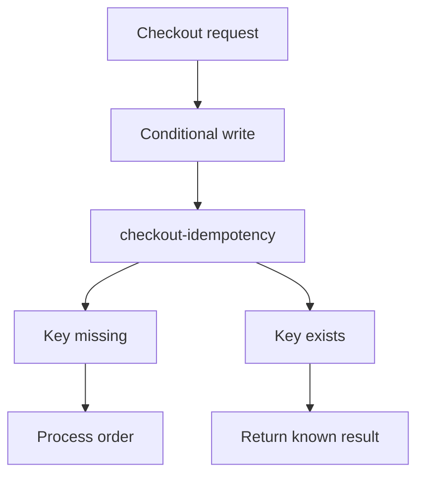

## Table of Contents

1. [The Problem](#the-problem)
2. [What Is DynamoDB](#what-is-dynamodb)
3. [Access Patterns](#access-patterns)
4. [Tables](#tables)
5. [Items](#items)
6. [Partition Keys](#partition-keys)
7. [Sort Keys](#sort-keys)
8. [Conditional Writes](#conditional-writes)
9. [Indexes](#indexes)
10. [Capacity And Pressure](#capacity-and-pressure)
11. [Sample Table Shape](#sample-table-shape)
12. [Putting It All Together](#putting-it-all-together)
13. [What's Next](#whats-next)

## The Problem

The previous article used RDS for relational checkout data. Now the team has a smaller but very important problem: retries.

Checkout calls can be retried by browsers, mobile apps, load balancers, workers, or human support tools. If the same checkout request is processed twice, customers might be charged twice or receive duplicate receipts. The app needs to remember that a request id was already claimed.

That data has a different shape from orders and line items:

- The app already knows the exact idempotency key it wants to check.
- The record is small and does not need joins.
- A write should succeed only if the key does not already exist.
- The record can expire after the retry window.
- High traffic should not require one relational transaction for every duplicate check.

This is a DynamoDB-shaped problem. The app wants fast access by known key and a safe conditional write.

## What Is DynamoDB

Amazon DynamoDB is a managed NoSQL database service built around tables, items, and keys. Instead of modeling around tables and joins first, you model around the questions the app must answer quickly.

For a beginner, the most important sentence is this: DynamoDB works best when the application knows how it will access the data. If you need "get item by this exact key," "list records for this customer in time order," or "claim this idempotency key if it does not exist," DynamoDB can be a strong fit. If you need flexible ad hoc joins across changing relationships, RDS is usually easier to reason about.

DynamoDB has its own design contract:

| DynamoDB concept | Plain-English job |
| --- | --- |
| Table | Holds items with a primary key design |
| Item | One record, stored as attributes |
| Partition key | Decides where an item is distributed and how exact-key reads find it |
| Sort key | Orders related items under the same partition key when used |
| Index | Adds another key-based access path |
| Conditional write | Writes only if a condition is true |

The table design follows the access patterns, not the other way around.

## Access Patterns

An access pattern is a question the app needs the database to answer. DynamoDB design starts by writing those questions down.

For the orders system, useful DynamoDB access patterns might be:

| Access pattern | Example |
| --- | --- |
| Claim one checkout request | Create idempotency key `checkout:req-8f2` only if missing |
| Read current job state | Get export job `job-2026-05-14-001` |
| List order events | Query events for `order-1042` sorted by time |
| Store short-lived session | Get session by token and expire it later |

Notice how specific these are. "Search all orders by every field" is not a DynamoDB access pattern. "Get all events for one order in time order" is. The key design can support that.

This is the main mental shift from RDS. In SQL, you can often start with normalized tables and add queries later. In DynamoDB, the future queries need to be part of the design conversation early.

## Tables

A DynamoDB table stores items. Every item in a table must have the table's primary key attributes. Other attributes can vary by item. That flexibility is useful, but it does not mean the table is unstructured. The structure lives in the key design and access patterns.

Beginners often ask whether every entity needs its own table. Sometimes separate tables are clearer, especially early in a learning path. A table for idempotency keys and a table for job state can be perfectly reasonable if they have different lifecycles and access patterns.

The key is to avoid pretending the table is just a bucket for random JSON. If the table is called `orders-support-state`, a reviewer should still be able to say which keys exist, which access patterns they support, and which writes must be conditional.

Table design should be boring to read:

| Table | Primary access pattern | Retention |
| --- | --- | --- |
| `checkout-idempotency` | Claim or read one request key | Expires after retry window |
| `order-events` | Query events for one order | Kept for support window |
| `export-jobs` | Read and update one job by id | Kept until audit cutoff |

That table tells you why the data exists.

## Items

An item is one DynamoDB record. It is made of attributes, and the primary key attributes identify it in the table.

An idempotency item might look like this:

```json
{
  "idempotencyKey": "checkout:req-8f2",
  "orderId": "order-1042",
  "status": "processing",
  "createdAt": "2026-05-14T12:40:00Z",
  "expiresAt": 1778762400
}
```

The important field is `idempotencyKey` because that is how the app finds the item. The other fields explain what the key means and how long it should remain useful.

Item size and shape matter. DynamoDB is not where you put a giant PDF or a full export file. Store the file in S3 and store a pointer or metadata item in DynamoDB if the app needs fast key-based lookup.

This keeps each service in its natural role: S3 owns object bytes; DynamoDB owns small key-addressed state.

## Partition Keys

The partition key is the primary input DynamoDB uses to distribute and find data. If a table has only a partition key, that key uniquely identifies each item. If a table also has a sort key, the combination of partition key and sort key identifies each item.

For idempotency, a simple partition key works well:

| Partition key | Meaning |
| --- | --- |
| `checkout:req-8f2` | This checkout request has already been claimed or completed |

The gotcha is distribution. If many writes use the same partition key, they create pressure in one place. A table where every active write uses `partitionKey = "today"` is not using DynamoDB's distribution well. A table where keys spread by request id, order id, customer id, or another natural identifier is usually easier to scale.

The partition key is the address and distribution decision.

## Sort Keys

A sort key lets multiple related items share the same partition key while remaining ordered within that partition.

For order events, the partition key might be the order id and the sort key might start with a timestamp:

| Partition key | Sort key | Item |
| --- | --- | --- |
| `order-1042` | `2026-05-14T12:40:01Z#created` | Order created event |
| `order-1042` | `2026-05-14T12:40:03Z#payment` | Payment captured event |
| `order-1042` | `2026-05-14T12:40:05Z#receipt` | Receipt queued event |

That shape supports the access pattern "list events for one order in time order." It does not automatically support "find every payment event across all orders today" unless you design another access path for that question.

Sort keys are powerful because they let one partition hold an ordered collection. They are dangerous when teams assume they can recover every future query from one convenient string.

## Conditional Writes

Conditional writes are one of DynamoDB's most practical features for application correctness. A write can say, in effect, "Create this item only if it does not already exist."

For idempotency, the app can try to claim a request key. If the item is missing, the write succeeds and the request can proceed. If the item already exists, the write fails the condition and the app knows this request has already been seen.

The useful behavior is atomic decision-making around one key. Two retrying callers can race, but only one should claim the missing key.

This prevents a common failure pattern:

| Weak design | Safer design |
| --- | --- |
| Read key, see nothing, then write later | Conditional write claims key in one operation |
| Duplicate request creates duplicate side effect | Duplicate request sees existing claim |
| Retry behavior depends only on app timing | Retry behavior depends on database condition |

RDS can also protect uniqueness with constraints and transactions. DynamoDB's conditional writes are the key-value version of the same safety instinct: make the data store enforce the critical rule.

## Indexes

An index gives DynamoDB another key-based way to read the data. If the base table key answers "get idempotency item by request key," an index might answer a different planned question such as "list active jobs by customer" or "find records by status and creation time."

Indexes should come from real access patterns. Adding an index because a future dashboard might ask something vague can add write cost and operational complexity without making the design clearer.

The beginner habit is to name each index by the question it answers:

| Index question | Possible key idea |
| --- | --- |
| List jobs for one customer | Partition by customer id, sort by created time |
| List failed exports by day | Partition by status and date, sort by job id |
| Find active sessions for one user | Partition by user id, sort by expiration |

If the team cannot state the question, the index is probably premature.

## Capacity And Pressure

DynamoDB can scale, but table design still affects pressure. Hot keys, large items, inefficient scans, and poorly planned indexes can create cost or throttling surprises.

A hot key happens when too much traffic targets the same partition key. For example, if every write during a sale uses the same key prefix as the actual partition key, one partition can become the bottleneck. Good key design spreads work across natural identifiers.

Scans are another warning sign. A scan reads through table data looking for matches. That can be useful for admin or backfill work, but it should not be the steady path for a user-facing request. User requests should usually use `GetItem` or `Query` with known keys.

Operational evidence should connect back to the design:

| Symptom | Design question |
| --- | --- |
| Throttled writes | Is one key or partition taking too much traffic? |
| Expensive reads | Is the app scanning instead of querying by key? |
| Large item errors | Is object-shaped data being stored in DynamoDB? |
| Duplicate side effects | Is the critical write conditional? |

DynamoDB is friendly when the access pattern is honest. It gets awkward when teams use it like a search database or a relational database without joins.

## Sample Table Shape

For checkout idempotency, a small table shape might look like this:



The table stores a marker and helps the app decide whether this request owns the right to perform the side effect.

For order events, the shape changes:

```text
PK = order-1042
SK = 2026-05-14T12:40:03Z#payment
```

That key shape supports a timeline for one order. It is a different access pattern, so it deserves a different key design or table.

## Putting It All Together

The opening retry problem did not need a relational schema or an object store. It needed a small item found by a known key and a safe way to claim that key once.

DynamoDB fits that shape. Access patterns come first. Tables hold items. Partition keys address and distribute data. Sort keys organize related items. Conditional writes protect critical one-time decisions. Indexes add planned access paths. Capacity and pressure signals tell you whether the key design matches real traffic.

The main habit is to write the app's questions before writing the table. If the questions are exact-key or predictable-key questions, DynamoDB can be wonderfully direct. If the questions are open-ended joins and reports, RDS may be the calmer choice.

## What's Next

S3 stores objects, RDS stores relational state, and DynamoDB stores key-shaped application state. The next article covers storage that looks like a disk or shared filesystem to compute: EBS and EFS.

---

**References**

- [Core components of Amazon DynamoDB](https://docs.aws.amazon.com/amazondynamodb/latest/developerguide/HowItWorks.CoreComponents.html). Supports the table, item, partition key, and sort key explanations.
- [Partitions and data distribution in DynamoDB](https://docs.aws.amazon.com/amazondynamodb/latest/developerguide/HowItWorks.Partitions.html). Supports the partition key distribution explanation and the relationship between keys and partitions.
- [Working with items and attributes](https://docs.aws.amazon.com/amazondynamodb/latest/developerguide/WorkingWithItems.html). Supports the item operations, primary key requirements, and conditional write discussion.
- [Best practices for designing and using partition keys effectively](https://docs.aws.amazon.com/amazondynamodb/latest/developerguide/bp-partition-key-design.html). Supports the hot-key and key-distribution design guidance.
