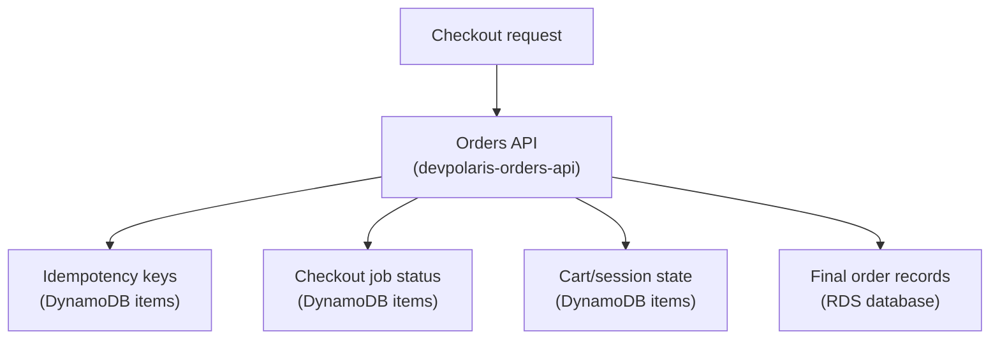

## Table of Contents

1. [The Query Shape Comes First](#the-query-shape-comes-first)
2. [Tables, Items, And Keys](#tables-items-and-keys)
3. [The Running Example: Checkout State Beside RDS](#the-running-example-checkout-state-beside-rds)
4. [Designing Access Patterns Before The Table](#designing-access-patterns-before-the-table)
5. [Conditional Writes For Idempotency](#conditional-writes-for-idempotency)
6. [Sort Keys And Small Item Collections](#sort-keys-and-small-item-collections)
7. [Indexes When The Main Key Is Not Enough](#indexes-when-the-main-key-is-not-enough)
8. [Failure Modes And A Diagnostic Path](#failure-modes-and-a-diagnostic-path)
9. [The DynamoDB Tradeoff](#the-dynamodb-tradeoff)

## The Query Shape Comes First

Some backend data is not asking for a relational database. It is asking for a fast answer to a narrow question. Did this checkout request already start?

What is the current status of this background job? Which temporary cart belongs to this browser session?

DynamoDB is AWS's managed NoSQL database for this kind of key-based access. NoSQL means the data is not stored and queried primarily through SQL tables, joins, and ad hoc relational queries. In DynamoDB, you usually read an item by a key, or read a small group of related items that share part of a key.

That sounds simple, but it changes how you design. In SQL, a junior developer often starts with nouns: orders, users, payments, carts. Then they add columns. Then they add indexes after the application needs faster queries.

In DynamoDB, you start with the questions the application must ask. AWS calls those questions access patterns. An access pattern is a known read or write shape, such as "find checkout by idempotency key" or "read job status by job id."

That is the first mental shift:

> DynamoDB table design begins with how the app reads and writes data, not with an entity relationship diagram.

This article follows `devpolaris-orders-api`, a Node.js backend for checkout and orders. The service still stores final order records in RDS because orders need SQL-friendly behavior: reports, relational constraints, joins with payments, and careful transaction boundaries.

DynamoDB sits beside RDS for smaller operational state: idempotency keys, checkout job status, and cart/session state. That contrast matters. You are not learning "DynamoDB replaces SQL." You are learning where a key-based document-style database fits cleanly, and where SQL is still the better home.

Here is the shape:



Read the diagram from the API outward. The DynamoDB data is operational state the app wants to fetch by a known key. The RDS data is the durable business record the company may query in many different ways later.

That split gives you a practical rule: use DynamoDB when the application can name the key it needs. Use SQL when the application needs flexible relationships, joins, or many question shapes that are not known yet.

## Tables, Items, And Keys

A DynamoDB table is a named collection of items. An item is a JSON-like record made of attributes. An attribute is one named value inside the item, similar to a property on a JS object.

This is an item from a table used by `devpolaris-orders-api`:

```json
{
  "pk": "IDEMPOTENCY#checkout_01HY8F4Z9R7JQ2K6P0",
  "sk": "REQUEST",
  "requestHash": "sha256:7a4c8b0d",
  "status": "processing",
  "jobId": "job_01HY8F54D9Q2B8K7M3",
  "createdAt": "2026-05-02T09:12:44Z",
  "expiresAt": "2026-05-03T09:12:44Z"
}
```

Do not worry about every field yet. Look at the first two attributes: `pk` and `sk`. `pk` is the partition key. The partition key is the first key value DynamoDB uses to place and find an item. Think of it as the main address. If the app knows the partition key, DynamoDB can go directly toward the right part of the table instead of searching the whole table.

`sk` is the sort key. The sort key is optional, but many application tables use one. When a table has both a partition key and a sort key, the two values together identify one item. The sort key also lets you group related items under the same partition key and read them in sorted order.

In plain English:

| Term | Beginner Meaning | In The Example |
|------|------------------|----------------|
| Table | A named collection of records | `devpolaris-checkout-state-prod` |
| Item | One JSON-like record | One idempotency request |
| Attribute | One named field on the item | `status`, `jobId`, `expiresAt` |
| Partition key | Main address for finding data | `IDEMPOTENCY#checkout_...` |
| Sort key | Second address and ordering field | `REQUEST` |
| Access pattern | A known app question | "Find checkout by idempotency key" |

The key design looks strange if you expect a SQL table with columns like `id`, `user_id`, and `created_at`. The prefix in `IDEMPOTENCY#...` is intentional. It gives the item a type inside the key value. That makes logs and debugging easier, and it leaves room for multiple kinds of checkout state to live in the same table later.

This is not the only valid table shape. Some teams use one table per feature. Some teams use a broader single-table design where several item types share one table. As a beginner, do not start by trying to master every single-table design pattern. Start with the key question: what does the application need to read, and what key will it have at that moment?

## The Running Example: Checkout State Beside RDS

`devpolaris-orders-api` accepts checkout requests from the web app. The final order belongs in RDS. That is where the team wants normal SQL behavior: order rows, order line rows, payment references, customer references, and reporting queries.

But a checkout flow has short-lived state around the edges. That state is not the final order. It is the machinery that helps the order get created safely.

Three examples are enough for this article:

| Backend Need | Why It Exists | Better Home |
|--------------|---------------|-------------|
| Idempotency key | Retry the same checkout request without creating two orders | DynamoDB |
| Checkout job status | Let the UI poll progress for one known job | DynamoDB |
| Cart/session state | Load one session quickly by session id | DynamoDB |
| Final order record | Preserve business data and support SQL queries | RDS |

Idempotency means "doing the same operation more than once has the same effect as doing it once." Checkout needs this because networks fail in boring, common ways. A user clicks "Pay." The browser sends the request. The API starts creating the order. The browser loses the response. The frontend retries.

Without idempotency, the retry may create a second order. With an idempotency record, the API can say: "I have already seen this key. I should return the existing result or current status instead of starting a second checkout."

That is a DynamoDB-shaped question. The API already has the idempotency key from the request header. It wants one record by that key. No join is needed. No report is needed.

A simplified request might look like this:

```text
POST /checkout
Idempotency-Key: checkout_01HY8F4Z9R7JQ2K6P0

cartId=cart_91f4
customerId=cus_8ab2
paymentIntentId=pi_2c7d
```

The API writes final order data to RDS only after checkout succeeds. Before that point, DynamoDB tracks the operational state. That separation is healthy. RDS answers business questions later. DynamoDB answers runtime questions now.

## Designing Access Patterns Before The Table

Before creating a DynamoDB table, write down the questions the application must ask. This feels slower than opening the AWS console and clicking "Create table," but it prevents the most common beginner mistake: creating a table that cannot answer the real query. For `devpolaris-orders-api`, the first access patterns are small and direct:

| Access Pattern | Key The App Has | Operation Shape | Result |
|----------------|-----------------|-----------------|--------|
| Find checkout by idempotency key | `idempotencyKey` | Get one item | Existing request state |
| Create checkout lock if key is new | `idempotencyKey` | Conditional put | Start or reject duplicate |
| Read job status by job id | `jobId` | Get one item | Status for UI polling |
| Update job status | `jobId` | Conditional update | Move from queued to processing to done |
| Load cart/session state | `sessionId` | Get one item | Current cart snapshot |

Notice what is missing. There is no "show all processing checkouts for the last hour" in this first table design. There is no "join checkout state to customer records." There is no "search all carts where total is above 100."

Those might be useful operational reports, but they are not part of the hot checkout path. If the team needs them later, they can use logs, metrics, streams, exports, or a purpose-built index. They should not bend the main checkout table around future ad hoc queries.

Here is a first key design:

| Item Type | `pk` | `sk` | Main Access Pattern |
|-----------|------|------|---------------------|
| Idempotency request | `IDEMPOTENCY#{idempotencyKey}` | `REQUEST` | Get or create by idempotency key |
| Checkout job | `JOB#{jobId}` | `STATUS` | Read or update job status |
| Cart session | `SESSION#{sessionId}` | `CART` | Load current cart/session state |

This design is beginner-friendly because each access pattern maps to a direct key lookup. The API builds the key from a value it already has. For example:

```js
const key = {
  pk: `JOB#${jobId}`,
  sk: "STATUS"
};
```

The important part is not the JS syntax. The important part is that the app does not ask DynamoDB to discover the job. It already knows the job id. DynamoDB's job is to fetch the matching item.

That is the everyday DynamoDB posture: know the question, know the key, read the item.

## Conditional Writes For Idempotency

The most useful DynamoDB feature for checkout is not a fancy query. It is a conditional write. A conditional write says: "Only write this item if this condition is true."

For idempotency, the condition is simple: only create the request record if the key does not already exist. That prevents two retrying requests from both thinking they are first. The first request creates the item. The second request tries to create the same item and gets a conditional failure.

The item being written might be small:

```json
{
  "pk": "IDEMPOTENCY#checkout_01HY8F4Z9R7JQ2K6P0",
  "sk": "REQUEST",
  "requestHash": "sha256:7a4c8b0d",
  "status": "processing",
  "jobId": "job_01HY8F54D9Q2B8K7M3",
  "createdAt": "2026-05-02T09:12:44Z",
  "expiresAt": "2026-05-03T09:12:44Z"
}
```

The write condition is the safety line:

```text
ConditionExpression:
  attribute_not_exists(pk)
```

In a table with a partition key and sort key, teams often check that the item does not already exist for that full key. The practical meaning is still easy: "Do not overwrite an existing checkout request." When a duplicate request arrives, the application may log something like this:

```text
2026-05-02T09:12:45.110Z WARN checkout.idempotency_duplicate
service=devpolaris-orders-api
idempotencyKey=checkout_01HY8F4Z9R7JQ2K6P0
table=devpolaris-checkout-state-prod
awsError=ConditionalCheckFailedException
message="The conditional request failed"
```

That log should not automatically be treated as an outage. For checkout idempotency, a conditional check failure can be the correct outcome. It means another request already claimed the key.

The next step is application logic. The API should read the existing idempotency item and decide what to return:

| Existing Item State | API Response Direction |
|---------------------|------------------------|
| `processing` | Return current job id or "still processing" |
| `succeeded` | Return the already-created order id |
| `failed` | Return the stored failure shape or allow a safe retry path |
| Different `requestHash` | Reject because the same key was reused for different input |

The `requestHash` field matters because idempotency keys should not become a way to mix different requests. If the same idempotency key arrives with a different cart or payment intent, the API should treat that as a client error. The key is a promise: "This retry represents the same operation."

This is where DynamoDB is a good fit. The operation is small. The key is known. The write needs an atomic "only if not already there" check.

## Sort Keys And Small Item Collections

So far, each partition key has one item under it. The sort key is still useful because it keeps the table ready for small groups of related items.

Imagine the checkout job needs a short event trail for support debugging. The team does not want this to become the official order history. They only want a compact runtime trail: queued, payment authorized, order written, receipt queued.

You can store those items under the same job partition key:

```json
{
  "pk": "JOB#job_01HY8F54D9Q2B8K7M3",
  "sk": "STATUS",
  "status": "processing",
  "updatedAt": "2026-05-02T09:12:48Z"
}
```

```json
{
  "pk": "JOB#job_01HY8F54D9Q2B8K7M3",
  "sk": "EVENT#2026-05-02T09:12:49Z#payment-authorized",
  "message": "Payment intent authorized",
  "paymentIntentId": "pi_2c7d"
}
```

```json
{
  "pk": "JOB#job_01HY8F54D9Q2B8K7M3",
  "sk": "EVENT#2026-05-02T09:12:51Z#order-written",
  "message": "Order row created in RDS",
  "orderId": "ord_1042"
}
```

Now the app has two useful reads:

| Question | Key Condition |
|----------|---------------|
| What is the current job status? | `pk = JOB#{jobId}` and `sk = STATUS` |
| What happened during this job? | `pk = JOB#{jobId}` and `sk begins_with EVENT#` |

The sort key does two jobs here. It names the item type, and it gives the event items a time-based order. This is not the same as a SQL join. You are not asking DynamoDB to join jobs to events to orders. You are keeping a small item collection together because the app often reads it together.

The phrase "item collection" means all items that share the same partition key in a table with a sort key. That idea is useful, but keep it modest at first. If one partition key gathers too much traffic or too much data, it can become a hot key risk.

A hot key means one key receives a lot more reads or writes than the rest. Imagine using `pk = CHECKOUT` for every checkout request. All checkout writes would target the same partition key value. That removes the natural spread you wanted from DynamoDB.

This is safer:

```text
pk = JOB#job_01HY8F54D9Q2B8K7M3
```

This is risky for a busy checkout path:

```text
pk = JOB
```

The first key spreads work by job id. The second key piles many jobs under one value. Beginner rule: put the thing you look up by in the key, and avoid keys where "everything" shares the same value.

## Indexes When The Main Key Is Not Enough

Sooner or later, someone asks a question your main table key does not answer. For example: "Given an order id, find the checkout job that created it." Your main key may be:

```text
pk = JOB#{jobId}
sk = STATUS
```

That is excellent when the app has the job id. It is not useful when the app only has the order id. This is where a secondary index can help. A secondary index is another key structure DynamoDB maintains for the same table data. It lets you query by a different key than the table's primary key.

The beginner-friendly index to know first is a global secondary index, often shortened to GSI. A GSI can have a partition key and optional sort key that differ from the base table. For the order lookup, the job status item can carry extra attributes:

```json
{
  "pk": "JOB#job_01HY8F54D9Q2B8K7M3",
  "sk": "STATUS",
  "status": "succeeded",
  "orderId": "ord_1042",
  "gsi1pk": "ORDER#ord_1042",
  "gsi1sk": "JOB#job_01HY8F54D9Q2B8K7M3"
}
```

Then the GSI can use:

| Index | Partition Key | Sort Key | Access Pattern |
|-------|---------------|----------|----------------|
| Base table | `pk` | `sk` | Read by job id, idempotency key, or session id |
| `gsi1` | `gsi1pk` | `gsi1sk` | Find job by order id |

This is useful, but it is not free design-wise. Every index is another access path to maintain. The indexed attributes need to exist on the items you want to query. The application now has another key contract to protect.

The mistake is to create indexes as a replacement for thinking. If the query is important and frequent, an index may be right. If the query is occasional debugging, logs or an admin report may be enough. If the query wants many flexible filters, RDS may be the better database.

Use this question before adding an index:

> Is this a known application access pattern, or am I trying to make DynamoDB behave like SQL?

That question saves money, confusion, and future migrations.

## Failure Modes And A Diagnostic Path

DynamoDB failures are easier to debug when you translate them back into access patterns. Most beginner problems are not mysterious database behavior. They are a mismatch between the key the table has and the question the app is asking.

Start with the exact operation. Was the app trying to get one item, query an item collection, write with a condition, or call through an index? Here is a calm diagnostic path for `devpolaris-orders-api`.

| Symptom | Likely Cause | What To Check | Fix Direction |
|---------|--------------|---------------|---------------|
| Lookup returns no item | Wrong key value or missing prefix | Log `pk` and `sk` built by the app | Build the exact key from the access pattern |
| Query cannot run as expected | Query does not match table or index key | Compare the desired question to table keys | Change access pattern, add a justified index, or use RDS |
| `ConditionalCheckFailedException` | Item already exists or condition is false | Check whether this is a safe duplicate | Read existing item and return correct idempotent response |
| Busy key throttles or slows | Too much traffic on one partition key value | Look for many writes to one key like `JOB` | Spread keys by id, tenant, session, or another real lookup value |
| `AccessDeniedException` | IAM role lacks DynamoDB permission | Check caller role, action, table ARN, and index ARN | Update the task role policy with least privilege |

The missing-key case is the most common. The app says "DynamoDB lost my item," but the logs show two different keys:

```text
write checkout state:
  pk=IDEMPOTENCY#checkout_01HY8F4Z9R7JQ2K6P0
  sk=REQUEST

read checkout state:
  pk=checkout_01HY8F4Z9R7JQ2K6P0
  sk=REQUEST
```

DynamoDB did not lose the item. The read forgot the `IDEMPOTENCY#` prefix. This is why key-building code should be boring and shared. For a Node.js service, a tiny helper is usually enough:

```js
export function idempotencyKey(value) {
  return {
    pk: `IDEMPOTENCY#${value}`,
    sk: "REQUEST"
  };
}
```

The next common failure is asking for a query the key cannot answer. Suppose a developer wants this:

```text
Find every checkout job where status = processing
```

But the table key is:

```text
pk = JOB#{jobId}
sk = STATUS
```

That key supports "read this job by job id." It does not support "find all processing jobs" as a direct key query. At that point, do not fight the database. Choose the right correction:

| Need | Better Direction |
|------|------------------|
| UI polls one known job | Keep current key |
| Operations dashboard counts processing jobs | Use metrics or logs |
| Worker needs a queue of jobs | Use a queue-shaped AWS service or a carefully designed access pattern |
| Business report over orders | Use RDS or an analytics pipeline |

`ConditionalCheckFailedException` needs a different mindset. In the idempotency path, it may mean the system is protecting you. The fix is not "remove the condition." The fix is to handle the duplicate request intentionally.

An IAM failure has a different shape:

```text
2026-05-02T09:15:03.771Z ERROR checkout.state_write_failed
service=devpolaris-orders-api
table=devpolaris-checkout-state-prod
awsError=AccessDeniedException
message="User: arn:aws:sts::123456789012:assumed-role/devpolaris-orders-api-prod-task/4f8e is not authorized to perform: dynamodb:PutItem on resource: arn:aws:dynamodb:us-east-1:123456789012:table/devpolaris-checkout-state-prod"
```

Read this like an IAM request story. Who is asking? The ECS task role session for `devpolaris-orders-api`.

What action does it want? `dynamodb:PutItem`. What resource is it touching? The checkout state table ARN.

The correction is not to give the role full DynamoDB access. The correction is to allow the specific table actions the service needs: read, write, update, and query for this table and any indexes the app actually uses.

## The DynamoDB Tradeoff

DynamoDB gives you a very attractive deal when your access patterns are known. You design keys around the questions your app asks, then the app performs predictable key-based reads and writes without managing database servers. That deal has a cost. DynamoDB is less flexible for ad hoc querying than SQL.

If the product manager asks a new question about final orders, RDS can often answer it with a new SQL query, maybe with a new index if the query becomes important. That is one of the reasons final order records stay in RDS for `devpolaris-orders-api`. If the same kind of open-ended question lands on your DynamoDB table, you may discover the table was not designed for that access pattern. You cannot assume DynamoDB will cheaply search every item by any attribute you remember storing.

That does not make DynamoDB worse. It makes it different. Use it when:

1. The app knows the key at read time.
2. The item shape is document-like and self-contained.
3. The access pattern is frequent enough to deserve a designed key.
4. Conditional writes help protect a workflow.
5. The data is operational state, session state, or a lookup record.
Be cautious when:

1. The team needs joins across many entities.
2. The team expects many ad hoc filters.
3. The business record needs relational constraints.
4. The first design sentence is "we may want to search by anything later."
5. One partition key value would receive most of the traffic.
For `devpolaris-orders-api`, the decision is clean: DynamoDB stores checkout state that the API reads by idempotency key, job id, or session id. RDS stores final orders because those records become business data.

That is a good beginner target. You do not need to force every piece of data into one database. You need to know what question each database is supposed to answer.

---

**References**

- [Core components of Amazon DynamoDB](https://docs.aws.amazon.com/amazondynamodb/latest/developerguide/HowItWorks.CoreComponents.html) - Official AWS explanation of tables, items, attributes, partition keys, and sort keys.
- [Querying tables in DynamoDB](https://docs.aws.amazon.com/amazondynamodb/latest/developerguide/Query.html) - Official guide to the key-based `Query` operation and why key conditions matter.
- [DynamoDB condition expression examples](https://docs.aws.amazon.com/amazondynamodb/latest/developerguide/Expressions.ConditionExpressions.html) - Official examples for conditional writes such as preventing overwrites with `attribute_not_exists`.
- [Improving data access with secondary indexes in DynamoDB](https://docs.aws.amazon.com/amazondynamodb/latest/developerguide/SecondaryIndexes.html) - Official guide to global and local secondary indexes as alternate query paths.
- [Best practices for designing and using partition keys effectively](https://docs.aws.amazon.com/amazondynamodb/latest/developerguide/bp-partition-key-design.html) - Official AWS guidance for spreading workload across partition key values and avoiding hot-key designs.
