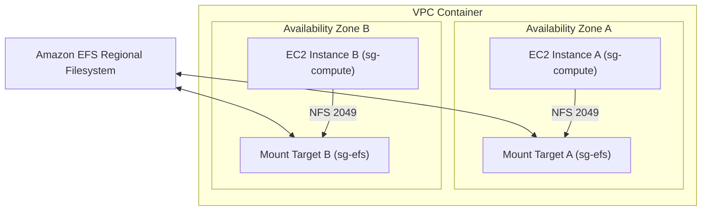

## Table of Contents

1. [Bridging Cloud State to the Host Operating System](#bridging-cloud-state-to-the-host-operating-system)
2. [What Is Compute-Attached Storage](#what-is-compute-attached-storage)
3. [Operating System Block Storage vs. POSIX Filesystems](#operating-system-block-storage-vs-posix-filesystems)
4. [Amazon EBS and the Single-Zone Placement Rule](#amazon-ebs-and-the-single-zone-placement-rule)
5. [Step-by-Step Formatting, Mounting, and Persisting Volumes](#step-by-step-formatting-mounting-and-persisting-volumes)
6. [EBS Snapshots and Crash-Consistent Backups](#ebs-snapshots-and-crash-consistent-backups)
7. [Amazon EFS and Multi-AZ Shared Network Filesystems](#amazon-efs-and-multi-az-shared-network-filesystems)
8. [Configuring Mount Targets and NFS Security Groups](#configuring-mount-targets-and-nfs-security-groups)
9. [Putting It All Together](#putting-it-all-together)
10. [What's Next](#whats-next)

## Bridging Cloud State to the Host Operating System

The previous articles in this module detailed regional cloud state engines. S3 buckets store unstructured objects accessed by HTTP keys; RDS instances run transactional SQL databases; and DynamoDB tables partition high-velocity key-value items. All of these systems are accessed over network interfaces using standard web APIs or database drivers.

However, certain software workloads cannot communicate with decoupled network APIs. They are cabled to require standard Linux operating system filesystem operations:

* **Legacy Vendor Workloads**: Many off-the-shelf commercial applications are built to read and write relative directories on local disk paths (like `/var/lib/app/data`), completely lacking the code libraries to make S3 HTTP requests or SQL queries.
* **Low-Latency Index Engines**: Search indexes, build agents, and continuous integration compilation pipelines execute millions of rapid directory walking, file appends, and lock operations. For these workloads, database network round-trip latency is a major bottleneck.
* **Direct OS Boot Volumes**: Compute servers require a reliable, high-performance root volume containing the operating system kernel, system libraries, and configuration files.

To run these workloads safely in the cloud, you cannot save files directly to an EC2 instance's local root disk, as any host replacement during an automated scaling or deployment cycle will permanently erase your data. Instead, you must bridge regional cloud state directly to the host operating system kernel using compute-attached storage: Amazon EBS and Amazon EFS.

## What Is Compute-Attached Storage

While S3, RDS, and DynamoDB provide regional data endpoints cabled to external network APIs, certain programs require storage to behave like a local physical hard drive or a directory folder. They expect the host operating system kernel to handle all reads and writes dynamically using standard filesystem commands, without any network API logic. Compute-attached storage bridges the gap between network-isolated cloud storage and local operating system mount paths.

To support these workloads, AWS offers two primary attached storage shapes. Amazon Elastic Block Store (EBS) provides raw, unformatted virtual disk volumes cabled to a single EC2 virtual machine, behaving exactly like an SSD plugged into a physical motherboard slot. Because EBS operates with virtually zero network abstraction inside the host operating system, it delivers the ultra-low microsecond latency required by boot drives and databases. Amazon Elastic File System (EFS), conversely, provides a serverless network directory tree cabled to the standard Network File System (NFS) protocol. Unlike EBS block drives, an EFS directory can be mounted simultaneously by hundreds of virtual machines and container tasks across multiple Availability Zones, coordinating concurrent file reads and writes in real-time.

Using attached storage allows you to deploy legacy vendor applications, high-performance local search indexes, and collaborative document pipelines in the cloud without modifying their source code. The cloud volumes mount directly into the EC2 or ECS directory tree, providing the exact path-based interface (`/mnt/app/data`) that traditional operating system kernels expect.

## Dedicated Virtual Disks vs. Shared Folders

To select the correct attached storage service, you must understand the distinction between dedicated virtual hard drives and shared folders cabled across the network:

* **Dedicated Virtual Disks (EBS)**: Presents a raw, unformatted virtual hard drive directly to a single virtual server, behaving exactly like an SSD plugged into a physical motherboard slot. The virtual server completely owns this drive. It formats the drive, mounts it to a local folder, and reads or writes data directly. Because it operates with virtually zero network abstraction overhead, it delivers extremely low latency for database directories, operating system boot drives, and local application caches.
* **Shared Folders (EFS)**: Presents a pre-formatted, shared folder tree cabled over the network using standard file sharing protocols. Instead of managing a raw virtual disk, your virtual server simply communicates using normal file and folder commands. The underlying storage is managed entirely by AWS. Multiple separate servers located in different Availability Zones can mount this exact same folder simultaneously, sharing files in real-time.

Choosing the incorrect type of storage introduces severe performance and operational penalties. Trying to run a database over a shared network folder like EFS will cause write delays due to network file coordination overhead. Conversely, trying to share a single EBS virtual disk among multiple virtual servers is physically impossible because standard block devices are not designed to allow multiple servers to write to them simultaneously.

## Amazon EBS and the Single-Zone Placement Rule

Amazon Elastic Block Store, commonly referred to as EBS, provides high-performance virtual block storage volumes designed to attach exclusively to a single running EC2 instance. When you provision an EBS volume, you choose its size (in gigabytes) and its volume type, which dictates its physical performance characteristics (measured in Input/Output Operations Per Second, or IOPS).

EBS enforces a critical architectural constraint: **The Single-Zone Placement Rule**. Because an EBS volume behaves like a physical hard drive plugged into a server, it must be physically located within the same datacenter building as the EC2 instance it attaches to. Therefore, both the EC2 instance and the EBS volume must live in the exact same Availability Zone.

This constraint significantly impacts high-availability architecture. First, this rule prevents cross-AZ attachment. An EC2 instance running in Availability Zone A cannot mount an EBS volume located in Availability Zone B. Second, it places limits on horizontal replication. If you need to scale your application horizontally across multiple Availability Zones, you cannot share a single EBS volume; instead, you must launch separate, independent EBS volumes in each zone. Third, it guarantees durable persistence. An EBS volume persists independently of the EC2 instance's lifecycle. If the instance is terminated, the EBS volume remains intact in S3-backed storage, ready to be attached to a new instance in the same zone.

To build resilient EBS-backed systems, always automate volume attachments via startup scripts and maintain regular block-level backups using EBS snapshots.

## Step-by-Step Formatting, Mounting, and Persisting Volumes

When you attach a new EBS volume to an EC2 instance, the operating system sees it as a raw, unformatted block device (such as `/dev/nvme1n1`). The raw device is completely unusable by your application until you format, mount, and configure it within the Linux kernel:

* **Step 1: Check the Device**: Run disk listing commands to verify that the virtual disk is physically attached to the server:
  ```bash
  lsblk
  ```
* **Step 2: Create a Filesystem**: If the attached volume is completely new, you must format it with a standard Linux filesystem (such as `ext4` or `xfs`). Never format a volume that already holds data, as doing so will permanently erase all sectors:
  ```bash
  sudo mkfs -t ext4 /dev/nvme1n1
  ```
* **Step 3: Create the Mount Point**: Create an empty directory tree inside your Linux root filesystem to act as the mount target for the disk:
  ```bash
  sudo mkdir -p /var/lib/orders-cache
  ```
* **Step 4: Mount the Volume**: Mount the formatted block device to your newly created directory, making the disk space immediately accessible to your application:
  ```bash
  sudo mount /dev/nvme1n1 /var/lib/orders-cache
  ```
* **Step 5: Persist the Mount**: A standard mount command is temporary; if the EC2 server reboots, the mount disappears, and your application will write data to the empty host root directory instead. To make the mount persistent, you must add an entry to the system's filesystem table file: `/etc/fstab`.

To prevent boot failures if device names change during reboots, always identify the volume in `/etc/fstab` using its unique UUID. A standard persistent entry in `/etc/fstab` is structured as a single, un-bracketed line:

```text
UUID=12345678-abcd-1234-abcd-1234567890ab /var/lib/orders-cache ext4 defaults,nofail 0 2
```

The `nofail` flag is a vital gotcha. If the EBS volume fails to attach during a server reboot, the `nofail` flag allows the Linux operating system to complete its boot sequence anyway, preventing your server from hanging offline.

## EBS Snapshots and Crash-Consistent Backups

To protect data stored on EBS volumes, you must take regular backups using **EBS Snapshots**. An EBS snapshot is a point-in-time copy of the volume's sectors, saved directly to S3-backed storage:

EBS snapshots utilize incremental backups. The first snapshot of a volume copies all written blocks, but later snapshots are incremental, meaning S3 only copies blocks that have changed since the previous snapshot. This design significantly saves storage costs and reduces backup times. Furthermore, snapshots facilitate rebuilding volumes. You can restore an EBS snapshot into a completely new EBS volume in any Availability Zone within the Region, allowing you to easily migrate data across zones.

However, snapshotting a running system introduces a critical **Crash-Consistency** gotcha. When a snapshot is requested, the operating system and your active applications may have unwritten data cached in system memory. If you take a snapshot during active writes, the restored volume will represent a crash-consistent state, which is exactly like a server that had its power cord suddenly pulled.

To guarantee absolute database and file consistency, follow these three steps immediately before initiating an EBS snapshot:

1. **Quiesce the App**: Instruct your database or writing application to temporarily freeze active writes to the disk.
2. **Flush the OS Cache**: Run the Linux flush command to force the operating system kernel to write all cached blocks from memory onto the disk:
   ```bash
   sync
   ```
3. **Trigger the Snapshot**: Request the EBS snapshot through the AWS CLI or automated backup plans.

## Amazon EFS and Multi-AZ Shared Network Filesystems

When your cloud application scales horizontally across multiple Availability Zones, standalone EBS volumes cannot solve shared data needs. If multiple container tasks running on separate hosts must read and write to the same file path simultaneously, such as a content management system catalog or a shared incoming vendor directory, you must deploy **Amazon Elastic File System (EFS)**.

Amazon EFS provides a fully managed, elastic, and serverless network filesystem cabled to the AWS regional network. Unlike EBS, EFS is fundamentally regional:

This regional architecture delivers Multi-AZ access. EFS is not bound to a single Availability Zone, allowing a single filesystem to be mounted simultaneously by hundreds of virtual machines, container tasks, and serverless functions across your entire Region. EFS also provides elastic scaling. You do not provision disk size in advance; the filesystem grows and shrinks automatically as your application adds or deletes files, ensuring you only pay for active storage. Finally, EFS provides standard folder semantics. It supports standard file folder operations, including directory locking, file appends, and user permissions, making it fully compatible with traditional legacy applications.

EFS charges a premium for storage compared to EBS and S3. Therefore, you should use EFS strictly when your application genuinely requires a POSIX-compliant filesystem mounted by multiple concurrent hosts.

## Configuring Mount Targets and NFS Security Groups

Because Amazon EFS is a regional network service reached over your VPC, mounting it to your compute hosts requires careful network and security group engineering:

To achieve this, you must configure Mount Targets. To make EFS accessible inside your private network, you must create a Mount Target in each private application subnet. The mount target acts as a private network interface (ENI) assigned a static private IP address within that subnet. 

You must also enable VPC DNS resolution and hostnames. Compute hosts resolve the EFS filesystem ID to the private IP of their local Availability Zone's mount target, keeping network latency as low as possible. 

Finally, you secure the connection using security group permissions. EFS communicates over TCP port 2049. To authorize access, you must configure a dedicated security group for your EFS mount targets (`sg-efs`) that allows inbound port 2049 traffic exclusively from your compute workload's security group (`sg-compute`).



Locking down mount target security groups prevents rogue network interfaces in other subnets from attempting to mount or tamper with your shared network directories.

## Putting It All Together

Amazon EBS and EFS bridge the gap between regional cloud networks and traditional server operating systems. Attached storage translates raw sectors and NFS protocols into local mount points that your application code can query using standard file paths:

* **Block Disk Delivery**: Deploy EBS volumes inside your EC2 server's Availability Zone to provide high-performance block storage for databases and caches.
* **Persistent OS Integration**: Format attached block disks and establish reboot-safe mount points by writing UUID entries with the `nofail` flag to `/etc/fstab`.
* **Crash-Safe Snapshots**: Flush operating system caches and freeze active application writes before triggering EBS snapshots to guarantee block consistency.
* **Shared Network Filesystems**: Deploy regional EFS filesystems cabled to multi-AZ mount targets to share directory trees across hundreds of separate hosts.
* **Securing Mount Paths**: Restrict EFS network traffic by whitelisting your compute security groups on TCP port 2049 inside your mount target security groups.

EBS and EFS are the primary cloud containers for operating-system-attached state. By aligning their deployment boundaries with correct network paths and security groups, you build a durable, high-performance local filesystem layer.

## What's Next

We have now established secure homes for all object, relational, key-value, and attached filesystem shapes in AWS. However, our data remains vulnerable to application bugs, bad database migrations, compromised root credentials, and accidental deletes. In the final article of this module, we will unify these stateful layers into a complete disaster recovery strategy using backups, point-in-time recovery logs, vault locks, and restore validation drills.

---

**References**

- [Amazon EBS user guide](https://docs.aws.amazon.com/AWSEC2/latest/UserGuide/AmazonEBS.html) - Compiles all EBS features, volume types, and performance caps.
- [Make an EBS volume available for use](https://docs.aws.amazon.com/AWSEC2/latest/UserGuide/ebs-using-volumes.html) - Details step-by-step partition formatting, directory mounting, and persistent fstab entries.
- [EBS snapshot concepts](https://docs.aws.amazon.com/AWSEC2/latest/UserGuide/EBSSnapshots.html) - Explains incremental block copying, snapshot restoration, and block-level consistency.
- [Amazon EFS user guide](https://docs.aws.amazon.com/efs/latest/ug/whatisefs.html) - Compiles all EFS features, elastic scaling limits, and NFSv4 parameters.
- [EFS mount target architecture](https://docs.aws.amazon.com/efs/latest/ug/accessing-fs.html) - Focuses on regional subnets, private ENIs, and mount target security group rules.
- [EFS vs. EBS vs. S3 comparison](https://docs.aws.amazon.com/efs/latest/ug/storage-classes.html) - Outlines performance tradeoffs, cost dynamics, and interface use cases for AWS storage.
