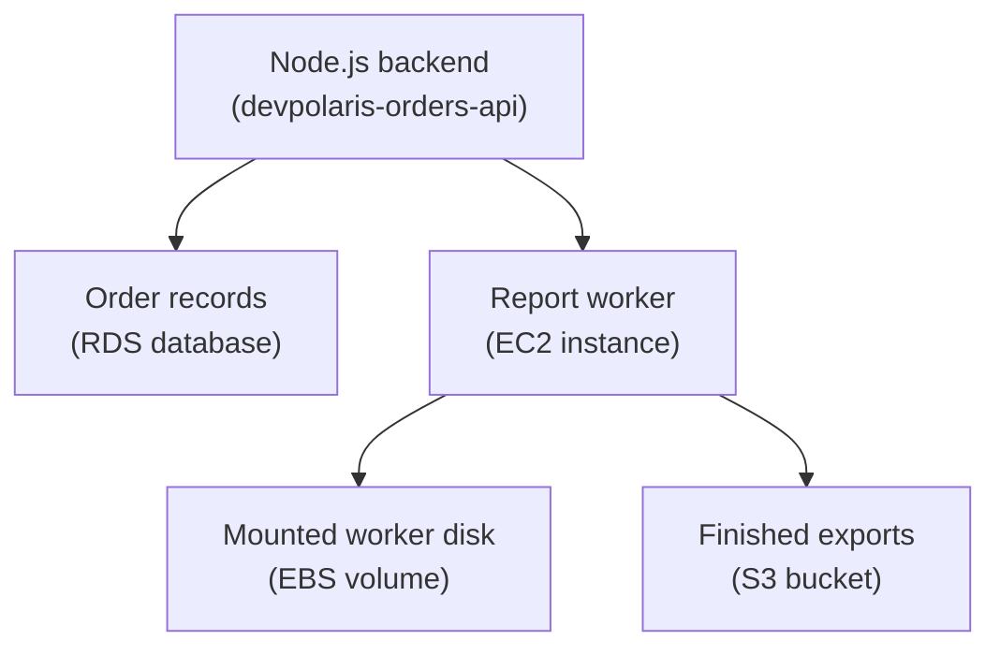
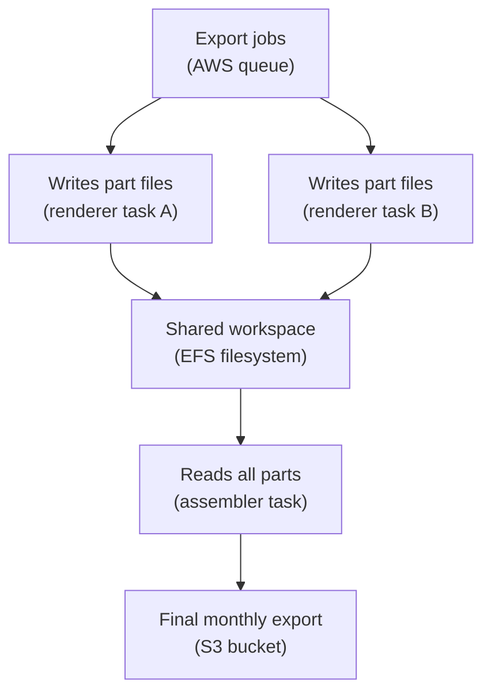

## Table of Contents

1. [Disk-Shaped Storage In AWS](#disk-shaped-storage-in-aws)
2. [Three Storage Shapes: Blocks, Files, And Objects](#three-storage-shapes-blocks-files-and-objects)
3. [Where EBS Fits Around EC2](#where-ebs-fits-around-ec2)
4. [Reading The Evidence On A Mounted EBS Volume](#reading-the-evidence-on-a-mounted-ebs-volume)
5. [Where EFS Fits When More Than One Compute Unit Needs Files](#where-efs-fits-when-more-than-one-compute-unit-needs-files)
6. [Storage Bugs You Will Actually See](#storage-bugs-you-will-actually-see)
7. [Diagnostic Path](#diagnostic-path)
8. [What Still Belongs In S3 Or RDS](#what-still-belongs-in-s3-or-rds)
9. [The Tradeoff: Server-Like Control And Ownership](#the-tradeoff-server-like-control-and-ownership)

## Disk-Shaped Storage In AWS

Most backend developers first meet storage as a database table or a file upload. Orders go into SQL. Product images go into an object store. Logs go to a log system. That mental model is good, but it misses a common operating need: some software still expects a normal path on a machine.

Amazon EBS, short for Elastic Block Store, is AWS storage that behaves like a disk attached to an EC2 instance. Amazon EFS, short for Elastic File System, is AWS storage that behaves like a shared Linux filesystem that more than one compute unit can mount. Both are "attached to compute" storage. That means your application reaches them through the operating system path model, not through a database query or an S3 object key.

These services exist because real systems often sit between pure application logic and pure managed data services. A Node.js worker might need a scratch directory while it generates a report. A legacy image tool might only accept input and output file paths. A batch job might need to resume from a local state file. Another worker pool might need several tasks to read and write the same shared set of generated files.

In AWS, this storage sits beside compute. For EBS, the compute is usually one EC2 instance. For EFS, the compute can be several EC2 instances or AWS container tasks that mount the same filesystem. The key difference is ownership: with S3 and RDS, AWS gives you a higher-level service interface. With EBS and EFS, you get file and disk behavior, so you also own more of the operating details.

This article follows two support components around `devpolaris-orders-api`, a Node.js backend for checkout and order processing. The core order records still belong in a database. Customer exports usually belong in S3 once they are finished. But the support path has two disk-shaped needs: one EC2 worker needs local disk for temporary generated reports and worker state, and another file-processing component needs shared file access across several AWS tasks.

That running example will help you avoid the most expensive beginner mistake: treating every file path as if it means the same kind of durability. A path can point to an EC2 root disk, a separate EBS volume, an EFS mount, a temporary instance store, or a directory that disappears when the instance is replaced. The application only sees `/var/lib/devpolaris-orders-api/reports`. You, as the operator, need to know what is really behind that path.

## Three Storage Shapes: Blocks, Files, And Objects

Before choosing EBS or EFS, slow down and name the shape of the data. Cloud storage names can sound similar, but the shapes are very different. The shape decides how your code reads, writes, shares, backs up, and debugs the data.

Block storage is the lowest shape in this article. It gives the operating system raw chunks of storage called blocks. Linux puts a filesystem on top of those blocks, such as `ext4` or `xfs`, then mounts that filesystem at a path. After that, your app reads and writes normal files. EBS is block storage. It is like adding another disk to a server, even though the disk is provided by AWS.

Filesystem storage is one level higher. It already presents a shared filesystem interface. Your app still uses paths like `/mnt/shared/reports/order-8841.csv`, but multiple compute units can see the same tree. EFS is filesystem storage. It uses NFS, short for Network File System, which is a protocol for accessing files over a network as if they were local files.

Object storage is different again. S3 stores objects in buckets. An object is retrieved by a key, which is like a full object name such as `exports/2026/05/order-8841.csv`. You do not mount S3 as a normal POSIX filesystem for application state. POSIX, short for Portable Operating System Interface, is the family of Unix-like file behaviors developers expect from normal Linux paths: directories, permissions, renames, file locks, and append behavior. S3 is excellent for finished objects, while mounted disks are better for normal filesystem behavior.

Database storage is a fourth shape. RDS stores relational data with SQL, transactions, indexes, constraints, and backups managed at the database layer. An order record has relationships, correctness rules, and concurrent updates. That is why `devpolaris-orders-api` should store orders in RDS or another suitable database, not in JSON files on EBS.

Here is the beginner map:

| Need | AWS service shape | Good example | Bad fit |
|------|-------------------|--------------|---------|
| One server needs a mounted disk | EBS block volume | Worker state for one EC2 instance | Shared writes from many instances |
| Many compute units need the same file tree | EFS shared filesystem | Shared report workspace across tasks | Primary order database |
| Finished files need durable object storage | S3 object storage | Customer export CSV after generation | Appending small state updates like a local file |
| Records need queries and transactions | RDS database | Orders, payments, checkout state | Temporary image scratch files |

Notice the word "need" in the first column. Do not start with the AWS service name. Start with what the application is trying to do. If the code needs SQL transactions, EBS is the wrong answer even if it can technically store bytes. If the code needs a shared POSIX file tree, S3 is the wrong mental model even if the final files may later move there.

## Where EBS Fits Around EC2

EBS is the storage you reach for when one EC2 instance needs disk-like persistence. AWS exposes the volume to the instance as a block device. Linux then formats and mounts it. After that, the Node.js process does not know it is using EBS. It only knows it can write to a path.

For `devpolaris-orders-api`, imagine a support worker named `devpolaris-orders-report-worker`. It runs on EC2 because it uses a native report generation binary and a local queue helper. During checkout spikes, the worker creates temporary report files before uploading the finished CSV to S3. It also keeps a small worker state directory so a restarted process can see which report files were already uploaded.

That is a reasonable EBS use. The worker needs local disk behavior. The data is tied to one machine. The path should survive a process restart and an instance reboot. The final export still moves to S3, because users should download finished reports from durable object storage, not from a private EC2 disk.

The design looks like this:



Read the arrows as responsibility. The API writes order truth to the database. The worker uses EBS while it is doing local file-shaped work. The worker uploads the finished export to S3 when the file is ready to keep.

That separation keeps the architecture honest. EBS is not your order database. S3 is not your local scratch disk. RDS is not a place to store multi-megabyte generated CSV content. Each service has a shape, and the shape should match the job.

EBS also has an important placement rule: an EBS volume attaches to EC2 instances in the same Availability Zone. An Availability Zone is one isolated location inside an AWS Region. If your worker instance lives in `us-east-1a`, the attached volume must be usable from that zone. This matters during recovery because you do not fix an unavailable instance by casually attaching its disk to a server in a different zone.

The operating responsibility is familiar to anyone who has run Linux. You need to know where the volume is mounted. You need enough free space. You need backups if the content matters. You need startup configuration so the mount returns after reboot. You need logs that tell you when writes fail.

That is the price of disk-shaped control. It feels comfortable because your app can use normal paths. It is also easy to forget that normal paths need normal operations.

## Reading The Evidence On A Mounted EBS Volume

When someone says "the EBS volume is attached", do not stop there. Attached to EC2 only means AWS made the block device available to the instance. Linux still needs to see the device, have a filesystem on it, and mount it at the path your app uses. Those are separate facts.

Here is a small evidence snapshot from the `devpolaris-orders-report-worker` instance. It shows what proof looks like before a full mount runbook.

```bash
$ lsblk
NAME          MAJ:MIN RM  SIZE RO TYPE MOUNTPOINTS
nvme0n1       259:0    0   30G  0 disk
|-nvme0n1p1   259:1    0   30G  0 part /
nvme1n1       259:2    0  100G  0 disk /var/lib/devpolaris-orders-api
```

`lsblk` shows block devices. The important line is `nvme1n1`. It has a mount point of `/var/lib/devpolaris-orders-api`. That means Linux sees a second disk and has mounted it where the worker expects to write state and temporary reports.

Now check space at the filesystem layer:

```bash
$ df -h /var/lib/devpolaris-orders-api
Filesystem      Size  Used Avail Use% Mounted on
/dev/nvme1n1     98G   41G   53G  44% /var/lib/devpolaris-orders-api
```

This proves the mounted filesystem has available space. If `Use%` is near `100%`, the app may fail even while the EC2 instance looks healthy in CPU and memory charts. Disk-full failures often look like ordinary application bugs until you run `df -h`.

The mount view gives one more useful fact:

```bash
$ findmnt /var/lib/devpolaris-orders-api
TARGET                             SOURCE       FSTYPE OPTIONS
/var/lib/devpolaris-orders-api     /dev/nvme1n1 xfs    rw,relatime
```

This shows the source device and filesystem type. The app does not usually care whether the filesystem is `xfs` or another Linux filesystem. But operators care because mount state proves whether writes go to the intended EBS volume or to some ordinary directory on the root disk.

AWS has its own view too. The EC2 API can show whether the volume is attached to the expected instance.

```bash
$ aws ec2 describe-volumes \
>   --filters Name=tag:Name,Values=devpolaris-orders-report-worker-state \
>   --query 'Volumes[].{VolumeId:VolumeId,State:State,Az:AvailabilityZone,Instance:Attachments[0].InstanceId,Device:Attachments[0].Device}'
[
  {
    "VolumeId": "vol-0a12b34c56d78e901",
    "State": "in-use",
    "Az": "us-east-1a",
    "Instance": "i-0123456789abcdef0",
    "Device": "/dev/sdf"
  }
]
```

This AWS view and the Linux view answer different questions. AWS says the volume is attached. Linux says the filesystem is mounted. The application logs say whether the process can actually write there. You usually need all three to debug storage.

For example, a healthy write from the worker might show this:

```text
2026-05-02T09:18:21.944Z info report-worker reportId=ordexp_8841 stage=render path=/var/lib/devpolaris-orders-api/reports/ordexp_8841.tmp
2026-05-02T09:18:24.117Z info report-worker reportId=ordexp_8841 stage=upload bucket=devpolaris-order-exports key=exports/2026/05/ordexp_8841.csv
2026-05-02T09:18:24.408Z info report-worker reportId=ordexp_8841 stage=cleanup removed=/var/lib/devpolaris-orders-api/reports/ordexp_8841.tmp
```

This log keeps the storage story visible. Temporary file on EBS. Finished export in S3. Cleanup after upload. If that path changes to `/tmp/reports`, you should immediately ask whether the data can disappear on restart or instance replacement.

## Where EFS Fits When More Than One Compute Unit Needs Files

EBS is usually the wrong shape when several compute units need the same live file tree. One worker's local disk is not a shared workspace. If `worker-a` writes `/var/lib/devpolaris-orders-api/reports/pending.json` on its own EBS volume, `worker-b` cannot see that file automatically. Each instance has its own attached disk.

EFS is the AWS service for shared filesystem storage. It gives Linux clients a shared path through NFS. That makes it useful when more than one EC2 instance or AWS task needs the same directory tree and the application expects normal file operations.

In the orders system, imagine a separate component named `devpolaris-orders-batch-renderer`. It runs several AWS tasks at the same time. Each task receives part of a large monthly export job. The tasks need a shared workspace for intermediate files because the report assembler expects a POSIX directory tree. That is an EFS-shaped need.

Here is the shape:



The shared filesystem is not the final product. It is the workspace. The final export still goes to S3 because S3 is better for durable object access, lifecycle rules, and download links.

EFS needs network plumbing. The filesystem has mount targets in your VPC. A mount target is a network endpoint that compute can connect to for NFS access. Security groups control whether the client can reach that endpoint. If the security group is wrong, the filesystem may exist and the task may be healthy, but the mount still fails.

Here is a compact view of the EFS moving parts:

| Piece | Plain meaning | What to check |
|-------|---------------|---------------|
| EFS filesystem | The shared file tree | Correct filesystem ID and environment tag |
| Mount target | Network endpoint inside a VPC subnet | Exists in the place your compute runs |
| Client security group | Rules on the EC2 instance or task | Allows outbound NFS traffic to the mount target |
| Mount target security group | Rules on the EFS endpoint | Allows inbound NFS traffic from the client security group |
| Mount path | Linux path the app uses | Present in `findmnt` and visible in app logs |

The security group check is easy to miss because EFS feels like storage. But the mount happens over the network. For a production-minded setup, the EFS mount target should allow NFS traffic from the compute security group, not from the whole VPC by habit.

The application evidence should also name the path. If `devpolaris-orders-batch-renderer` writes shared parts under `/mnt/devpolaris-orders-shared/monthly/2026-05`, the log should say that path. When the assembler cannot find a part file, you want to know whether the task wrote to EFS, to local disk, or to a typo path that only existed inside one container.

```text
2026-05-02T10:04:12.052Z info batch-renderer task=part-07 workspace=/mnt/devpolaris-orders-shared/monthly/2026-05 file=part-07.ndjson status=written
2026-05-02T10:05:48.833Z info batch-assembler workspace=/mnt/devpolaris-orders-shared/monthly/2026-05 expectedParts=12 foundParts=12 status=assembling
```

That is the kind of log that saves time. It ties the application behavior back to the mounted filesystem.

## Storage Bugs You Will Actually See

Storage failures often feel strange because the app still runs. The process starts. The health check passes. Then only one feature fails: report generation, export assembly, upload cleanup, or worker resume. That is why storage debugging needs both application evidence and system evidence.

The first common failure is a full disk. The worker writes temporary files to EBS, but old files were not cleaned up after upload. Eventually the filesystem reaches full capacity. Node sees a normal operating system write error.

```text
2026-05-02T11:26:31.119Z error report-worker reportId=ordexp_9012 stage=render code=ENOSPC message="no space left on device, write"
```

The diagnosis starts with `df -h`. If the mounted filesystem is full, the fix direction is to remove safe temporary files, correct cleanup, grow the volume if needed, and add monitoring before the next incident. Do not "fix" this by moving temporary files to `/tmp` unless you are sure they can disappear.

The second common failure is an unmounted EBS volume. The AWS volume may be attached, but Linux did not mount it after reboot. The app writes to the path anyway because the directory exists on the root filesystem. That creates a dangerous illusion: the app appears to work, but writes are landing on the wrong disk.

The evidence often looks like this:

```bash
$ findmnt /var/lib/devpolaris-orders-api
$
$ df -h /var/lib/devpolaris-orders-api
Filesystem      Size  Used Avail Use% Mounted on
/dev/nvme0n1p1   30G   29G  800M  98% /
```

An empty `findmnt` result means there is no mount at that target. The `df -h` output shows the path is actually on `/`, the root filesystem. The fix direction is to restore the mount, check startup mount configuration, and move any files accidentally written to the root disk after you understand what they are.

The third common failure is the wrong EFS network path. The filesystem exists. The task has the right filesystem ID. But the EFS mount target security group does not allow NFS traffic from the task security group. The app never gets a usable shared path.

```text
2026-05-02T10:42:09.331Z error batch-renderer stage=startup workspace=/mnt/devpolaris-orders-shared message="EFS mount unavailable"
mount.nfs4: Connection timed out
```

This failure usually points to a VPC, mount target, route, DNS, or security group problem rather than application code. For EFS, always include the network path in your diagnosis.

The fourth common failure is writing durable-looking data to an ephemeral local path. Ephemeral means temporary. On EC2, some instance types can have instance store volumes, which are temporary block devices physically attached to the host. Also, many teams use `/tmp` or a container writable layer for scratch data. Those paths can be fine for cache or throwaway work, but they are a bad place for state you need after replacement or restart.

Here is the failure shape:

1. `devpolaris-orders-report-worker` writes resume state to `/tmp/orders-worker-state.json`.
2. The instance is replaced during maintenance.
3. The new instance starts with an empty `/tmp`.
4. The worker cannot tell which reports were already uploaded.
5. Some exports are regenerated, and support has to compare S3 objects by hand.
The fix direction is not "never use `/tmp`." The fix is to be honest about the data. Scratch files can live on temporary paths. Worker state that must survive a reboot needs EBS, EFS, S3, or a database depending on the access pattern.

## Diagnostic Path

When storage breaks, start from the application symptom and walk downward. Do not randomly click through every AWS console page. Ask which layer lost the promise the application expected.

Start with the application log. You need the path, operation, and error code.

```text
2026-05-02T11:26:31.119Z error report-worker reportId=ordexp_9012 op=write path=/var/lib/devpolaris-orders-api/reports/ordexp_9012.tmp code=ENOSPC
```

This says the app failed while writing a specific path. The error code `ENOSPC` means no space left on device. Now the next check is not IAM, S3, or the database. The next check is disk space for that path.

```bash
$ df -h /var/lib/devpolaris-orders-api/reports
Filesystem      Size  Used Avail Use% Mounted on
/dev/nvme1n1     98G   98G     0 100% /var/lib/devpolaris-orders-api
```

If the path is full, confirm what is mounted there.

```bash
$ findmnt /var/lib/devpolaris-orders-api
TARGET                             SOURCE       FSTYPE OPTIONS
/var/lib/devpolaris-orders-api     /dev/nvme1n1 xfs    rw,relatime
```

Then check what is consuming the space. Keep this careful. Do not delete unknown directories because a command output looks large.

```bash
$ sudo du -h -d 1 /var/lib/devpolaris-orders-api | sort -h
2.1G    /var/lib/devpolaris-orders-api/state
83G     /var/lib/devpolaris-orders-api/reports
85G     /var/lib/devpolaris-orders-api
```

This points at the report scratch directory. Now the likely fix is cleanup logic, a one-time safe cleanup, or a larger volume. The important point is that the evidence leads the fix.

If the symptom is "path missing" or "not a mount", use the mount view.

```bash
$ mount | grep devpolaris-orders
/dev/nvme1n1 on /var/lib/devpolaris-orders-api type xfs (rw,relatime)
```

No output means the expected mount is absent. Then compare with AWS attachment state.

```bash
$ aws ec2 describe-volumes \
>   --volume-ids vol-0a12b34c56d78e901 \
>   --query 'Volumes[0].Attachments[0].{Instance:InstanceId,State:State,Device:Device}'
{
  "Instance": "i-0123456789abcdef0",
  "State": "attached",
  "Device": "/dev/sdf"
}
```

If AWS says attached but Linux says not mounted, focus on the operating system mount configuration. If AWS says available or attached to a different instance, focus on EC2 volume attachment. For EFS, add network checks to the path. A shared filesystem mount asks two questions: is the storage configured, and can this compute unit reach the mount target?

Check whether the mount exists:

```bash
$ findmnt /mnt/devpolaris-orders-shared
TARGET                         SOURCE                                      FSTYPE OPTIONS
/mnt/devpolaris-orders-shared  fs-0abc1234.efs.us-east-1.amazonaws.com:/  efs    rw,nosuid,nodev,_netdev,tls
```

If the mount does not exist and startup logs show a timeout, inspect the EFS mount target and security group path. The EFS mount target needs to allow NFS traffic from the compute security group. The compute side needs to be allowed to reach the mount target. NFS traffic is the filesystem protocol traffic, not an HTTP request to your app.

Here is the diagnostic map:

| Symptom | First proof | Next proof | Likely fix direction |
|---------|-------------|------------|----------------------|
| `ENOSPC` in logs | `df -h <path>` | `du -h -d 1 <mount>` | Clean files, fix cleanup, add monitoring, resize if needed |
| App writes to wrong disk | `findmnt <path>` | `df -h <path>` | Restore mount, fix boot mount, move accidental writes carefully |
| EBS attached but unavailable | AWS volume attachment | `lsblk` and `findmnt` | Attach to right instance, mount the filesystem |
| EFS mount timeout | App or mount logs | Mount target and security groups | Allow NFS path from compute to EFS |
| Data missing after replacement | Path history in logs | Instance lifecycle and mount config | Move durable state to EBS, EFS, S3, or database |

Use this table as a diagnostic path. Every row starts with the thing the app observed, then asks which layer must prove the promise.

## What Still Belongs In S3 Or RDS

EBS and EFS are useful, but they can tempt beginners into rebuilding services that AWS already gives you at a better level. The easiest way to avoid that trap is to ask what the data means.

Order records are business truth. They need transactions, constraints, query patterns, backups, and controlled schema changes. They belong in a database such as RDS when the data is relational. Storing orders as JSON files on EBS might look simple on day one, but it becomes painful when two requests update the same order, support needs a query, or finance needs a consistent report.

Finished exports are objects. Once `devpolaris-orders-report-worker` has produced `ordexp_8841.csv`, the useful product is a named blob that users or support systems can download. That is S3-shaped data. The file should not live forever on one private EC2 disk. S3 gives you bucket policies, object keys, lifecycle choices, and a clean access model for finished files.

Shared temporary workspaces are file-shaped. When several renderer tasks need to coordinate through a directory tree, EFS can be the right fit. But do not confuse "shared filesystem" with "database." A directory full of files does not give you SQL constraints, transactional updates, or query planning.

Single-server local state is disk-shaped. If one EC2 worker needs local state that survives reboot, EBS can be a good fit. But if the state needs to be read by many workers at the same time, that is no longer a simple EBS problem. You either need a shared filesystem, a database, a queue, or object storage, depending on the state.

Here is the practical decision:

| Question | Better starting point |
|----------|-----------------------|
| Does the app need SQL queries or transactions? | RDS |
| Does the app need to store finished files by key? | S3 |
| Does one EC2 instance need a normal disk path? | EBS |
| Do several compute units need the same Linux file tree? | EFS |
| Can the data disappear after the process ends? | Local temporary path may be enough |

The last row is important. Temporary storage is not bad. It is only bad when the team forgets it is temporary. If the file is cache, scratch, or a re-creatable intermediate, temporary local storage can be fine. If the file is the only copy of something important, use a service that matches the durability and access pattern.

## The Tradeoff: Server-Like Control And Ownership

EBS and EFS are attractive because they let software keep using familiar filesystem behavior. Many tools do not know how to write to S3 or RDS. They know how to open a file, write bytes, rename a temporary file into place, and scan a directory. EBS and EFS let you support that kind of software in AWS without rewriting everything.

That server-like control is the gain. With EBS, your EC2 worker gets a persistent mounted disk for local work. With EFS, several compute units get a shared filesystem path. Your Node.js code can use the normal `fs` module. Your shell tools can use `ls`, `df`, `du`, `findmnt`, and `tail`. Your logs can name real paths that operators understand.

The cost is operational ownership. You need to know whether the path is mounted. You need to watch free space. You need to decide what gets backed up. You need to understand which instance or task can reach the storage. You need to keep temporary files from becoming permanent waste. You need to make sure important state is not hiding in `/tmp` or an unmounted directory on the root disk.

S3 and RDS remove different kinds of work. S3 removes most disk and filesystem operations from finished object storage. RDS removes much of the database server operation from relational data. EBS and EFS give you filesystem behavior, so they bring back filesystem questions.

That does not make them worse. It makes them specific. Use EBS when one EC2 instance needs disk behavior. Use EFS when several AWS compute units need a shared Linux file tree. Use S3 when the result is a durable object. Use RDS when the data is business truth that needs database behavior.

For `devpolaris-orders-api`, the clean design is simple and predictable: orders in the database, finished exports in S3, report worker scratch and state on a mounted EBS volume when tied to one EC2 instance, and shared report workspace on EFS when several tasks need the same file tree. That design gives each piece of data a home that matches how it is used.

---

**References**

- [Amazon EBS persistent block storage for Amazon EC2 instances](https://docs.aws.amazon.com/AWSEC2/latest/UserGuide/storage_ebs.html) - Explains EBS volumes and snapshots as block storage resources attached to EC2.
- [Make an Amazon EBS volume available for use](https://docs.aws.amazon.com/ebs/latest/userguide/ebs-using-volumes.html) - Shows the attach, format, and mount model that sits behind the article's EBS evidence snapshots.
- [What is Amazon Elastic File System?](https://docs.aws.amazon.com/efs/latest/ug/whatisefs.html) - Defines EFS as shared file storage and explains NFS, POSIX behavior, and access controls.
- [Using VPC security groups with Amazon EFS](https://docs.aws.amazon.com/efs/latest/ug/network-access.html) - Documents the security group path for NFS access between compute clients and EFS mount targets.
- [Amazon S3 objects overview](https://docs.aws.amazon.com/AmazonS3/latest/userguide/UsingObjects.html) - Explains the bucket, key, and object model used to contrast S3 with mounted filesystems.
- [Instance store temporary block storage for EC2 instances](https://docs.aws.amazon.com/AWSEC2/latest/UserGuide/InstanceStorage.html) - Clarifies temporary EC2 instance store behavior so learners do not confuse ephemeral paths with durable storage.
