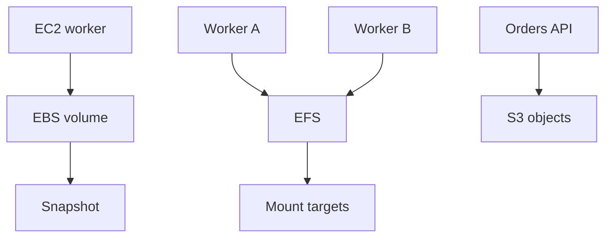

## Table of Contents

1. [The Problem](#the-problem)
2. [Attached Storage](#attached-storage)
3. [EBS](#ebs)
4. [Volumes](#volumes)
5. [Snapshots](#snapshots)
6. [EFS](#efs)
7. [Mount Targets](#mount-targets)
8. [Filesystems](#filesystems)
9. [S3 Comparison](#s3-comparison)
10. [Sample Storage Shape](#sample-storage-shape)
11. [Putting It All Together](#putting-it-all-together)
12. [What's Next](#whats-next)

## The Problem

The module has covered objects, relational rows, and key-value items. Now the team hits a different kind of storage need.

Some workloads do not start by asking for an API. They ask for a path:

- An EC2 worker needs durable local disk space for a search index it rebuilds over several hours.
- A vendor tool expects input files in `/mnt/incoming` and writes result files beside them.
- Several workers need to read and write files in the same directory tree.
- A container can be replaced, but a small piece of disk-shaped state must survive the replacement.

Those are attached-storage questions. The app or tool expects storage to behave like a disk or filesystem, not like an S3 object API or SQL database.

The two AWS services to learn first are Amazon EBS and Amazon EFS.

## Attached Storage

Attached storage is storage presented to compute as something the operating system can mount or use. Instead of calling `PutObject` or running a SQL query, the process reads and writes paths through the filesystem.

That can be exactly what a workload needs. Operating systems, databases, vendor tools, build systems, and legacy applications often expect disk or file behavior. They want directories, permissions, open files, temporary files, and filesystem operations.

But attached storage also ties data closer to compute. You need to know which compute resource can mount it, which Availability Zone it belongs to, how it is backed up, and what happens when the instance, task, or node is replaced.

The first split is simple:

| Need | AWS service |
| --- | --- |
| Disk-like block storage for one compute environment | EBS |
| Shared NFS-style filesystem for many Linux clients | EFS |
| Whole objects by key through an API | S3 |

If the app can work with objects by key, S3 is often simpler. If it truly needs mounted storage, EBS or EFS may be the honest answer.

## EBS

Amazon Elastic Block Store, or EBS, provides block-level storage volumes that can attach to EC2 instances. After a volume is attached, the operating system can format it with a filesystem, mount it, and use it like a disk.

EBS is a natural fit when the storage belongs closely to one server-shaped workload. An EC2 instance might use an EBS root volume to boot and an additional EBS data volume for a local index, application cache, or database directory.

The important placement rule is that an EBS volume lives in one Availability Zone. The instance and volume must be in the same Availability Zone to attach. That makes EBS feel like a durable disk for a local compute shape, not a shared regional filesystem.

EBS also persists independently from the running life of an EC2 instance. Stopping or replacing an instance does not automatically mean the volume's data is gone, though delete-on-termination settings and automation choices matter. This is where many surprises come from: the disk might outlive the server, or the server might vanish with a root volume the team expected to keep.

## Volumes

An EBS volume is the storage device. The instance sees it as a block device. The operating system then decides how to use it: create a filesystem, mount it, put application data there, and remount it after reboot.

That operating-system layer is your team's job. Attaching a volume is not the same as making it useful. A new empty volume usually needs a filesystem. A mounted volume needs a mount point. A reboot-safe mount needs an entry such as `/etc/fstab` or equivalent automation.

The evidence for EBS is often local:

```text
/dev/nvme1n1 mounted on /var/lib/devpolaris
```

That line tells you the app is using a mounted block device. It does not tell you whether backups exist, whether the mount returns after reboot, whether the volume is large enough, or whether the data belongs in local disk at all.

The beginner habit is to name the volume's job. "Data volume for generated search index" is reviewable. "Extra disk because the app needed space" is how mystery state appears.

## Snapshots

EBS snapshots are point-in-time backups of EBS volumes. The first snapshot captures the written blocks at that time, and later snapshots are incremental, storing changed blocks since the previous snapshot.

Snapshots are how an EBS-backed workload gets a recovery story. If the EC2 instance fails, a snapshot can help create a new volume. If a bad job corrupts local state, a snapshot may provide a previous point to restore from.

There is a gotcha with live filesystems. A snapshot captures blocks as they exist when the snapshot is requested. It does not automatically flush application memory or operating-system caches into a perfect application-consistent state. For data that is actively being written, the team may need to pause writes, coordinate with the application, or use a backup tool that understands the workload.

This is why snapshots are powerful but not magical. A snapshot plan should say what consistency is required and how restore is tested.

## EFS

Amazon Elastic File System, or EFS, is managed shared file storage for Linux workloads. It provides an NFS-style filesystem that multiple clients can mount.

EFS is useful when the shared filesystem behavior is the point. Several EC2 instances, ECS tasks, EKS pods, or Lambda functions may need access to the same directory tree. A vendor integration may require files to appear in a shared path. A content processing system may have old assumptions around directories and filenames.

EFS changes the storage shape from "this server has a disk" to "these clients share a filesystem." That makes coordination easier for file-based tools, but it also means you must understand permissions, mount targets, network paths, throughput behavior, and how the application handles concurrent file access.

EFS is not the same as S3 with slashes in the key. S3 keys can look like paths, but EFS gives clients filesystem behavior through mounts.

## Mount Targets

EFS is reached through mount targets in a VPC. A mount target gives clients in an Availability Zone a network path to the file system. Security groups control which clients can connect.

This makes EFS part storage and part networking. If an ECS task cannot mount the file system, the problem might be subnet placement, security group rules, DNS, IAM for the mount helper path, or filesystem policy. The data service is managed, but the access path still has to be designed.

For a multi-AZ application, mount targets should line up with where clients run. A worker in one Availability Zone should not depend casually on a mount target path in another zone because the topology was half-built.

The practical evidence looks like this:

| Evidence | What it tells you |
| --- | --- |
| File system id | Which EFS filesystem is being mounted |
| Mount target subnet | Where clients can reach it in the VPC |
| Security group | Which clients can connect |
| Mount path | Where the app expects the files |

Mounting is the moment storage and networking meet.

## Filesystems

Filesystem semantics are the reason to choose EFS. The app can open files, create directories, read listings, use POSIX-style permissions, and share a path across clients.

That is valuable for tools built around files. It can also hide complexity. If many workers write to the same path, the application still needs a safe coordination model. A shared filesystem does not automatically prevent two workers from clobbering the same output file or reading a half-written result.

The filesystem question should be specific:

| Vague reason | Better reason |
| --- | --- |
| "We need shared storage" | "Three workers need the same mounted input directory because the vendor tool reads relative paths" |
| "S3 has folders, so EFS is similar" | "The app requires filesystem operations that S3 object APIs do not provide" |
| "Containers are stateless, so add EFS" | "This directory must outlive task replacement and be mounted by each task" |

If the workload only needs independent files by key, S3 may be simpler and cheaper to operate. If it needs real shared filesystem behavior, EFS is the better mental model.

## S3 Comparison

EBS, EFS, and S3 overlap in the human phrase "store files," but they behave differently.

| Service | Interface | Best fit |
| --- | --- | --- |
| EBS | Block device mounted by one compute shape | Disk-like state close to EC2 |
| EFS | Shared NFS filesystem | Multiple Linux clients need the same directory tree |
| S3 | Object API with bucket and key | Whole files, uploads, exports, artifacts, static assets |

The interface is the decision. A process that needs to update a local database file wants disk semantics. A tool that walks directories from several workers wants file semantics. A web app that stores generated PDFs wants object semantics.

This is why "files" is not enough detail. The app's access behavior decides the service.

## Sample Storage Shape

For the orders system, attached storage might look like this:



The diagram separates three storage interfaces. The EC2 worker has disk-like state on EBS. Several workers share a filesystem on EFS. The app stores whole objects in S3.

That separation makes operations clearer. EBS needs mount and snapshot care. EFS needs network and filesystem care. S3 needs object access, key, versioning, and lifecycle care.

## Putting It All Together

The opening team had workloads that asked for paths and disks, not just object keys or SQL tables.

EBS fits disk-shaped state attached to EC2 in one Availability Zone. Volumes need formatting, mounting, sizing, and reboot behavior. Snapshots give EBS a recovery path, but application consistency needs thought. EFS fits shared Linux filesystem needs where many clients mount the same directory tree. Mount targets and security groups make EFS access a VPC design question. S3 remains the simpler answer when the application can store and fetch whole objects by key.

The core habit is to choose by interface. Disk, shared filesystem, and object storage are different promises.

## What's Next

Every storage shape now has a home. The final article in this module asks what happens when data is overwritten, corrupted, lost, or deleted. That is the world of backups, retention, versioning, snapshots, restore drills, and safe deletion.

---

**References**

- [Amazon EBS volumes](https://docs.aws.amazon.com/ebs/latest/userguide/ebs-volumes.html). Supports the EBS explanation as block-level storage attached to EC2 instances, same-AZ attachment, persistence, and volume flexibility.
- [Make an Amazon EBS volume available for use](https://docs.aws.amazon.com/ebs/latest/userguide/ebs-using-volumes.html). Supports the formatting, mounting, and reboot persistence discussion.
- [How Amazon EBS snapshots work](https://docs.aws.amazon.com/ebs/latest/userguide/how_snapshots_work.html). Supports the point-in-time and incremental snapshot explanation.
- [Create Amazon EBS snapshots](https://docs.aws.amazon.com/ebs/latest/userguide/ebs-creating-snapshot.html). Supports the consistency warning around cached data and pausing writes for more complete snapshots.
- [Amazon EFS Documentation](https://aws.amazon.com/documentation-overview/efs/). Supports the EFS explanation as managed NFS shared file storage for Linux workloads, with elastic scaling and multi-client access.
- [Use Amazon EFS with Amazon EC2 Linux instances](https://docs.aws.amazon.com/AWSEC2/latest/UserGuide/AmazonEFS.html). Supports the EFS mount and security group access discussion for EC2 clients.
