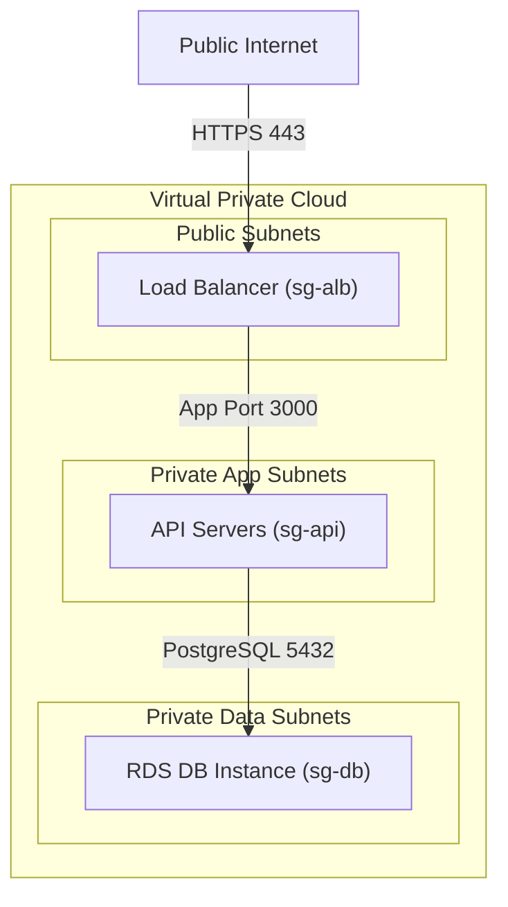

## Table of Contents

1. [From Independent Files to Transactional Schemas](#from-independent-files-to-transactional-schemas)
2. [What Is RDS](#what-is-rds)
3. [Managed Infrastructure vs. Developer Schema Ownership](#managed-infrastructure-vs-developer-schema-ownership)
4. [Isolating Endpoints in Private Data Subnets](#isolating-endpoints-in-private-data-subnets)
5. [Injecting Database Credentials securely via Secrets Manager](#injecting-database-credentials-securely-via-secrets-manager)
6. [Autoscaling and the DB Connection Exhaustion Limit](#autoscaling-and-the-db-connection-exhaustion-limit)
7. [Resilience through Multi-AZ Standby Replication](#resilience-through-multi-az-standby-replication)
8. [Executing Backward-Compatible Schema Migrations](#executing-backward-compatible-schema-migrations)
9. [Putting It All Together](#putting-it-all-together)
10. [What's Next](#whats-next)

## From Independent Files to Transactional Schemas

The previous S3 article detailed object storage, which is the perfect regional home for complete, unstructured files like receipt PDFs and nightly financial CSV reports. S3 operates on a flat namespace where each file exists as an isolated binary object. When your application code simply needs to store and fetch whole objects by name, S3 delivers unmatched durability and cost-effectiveness.

However, an e-commerce checkout flow has a fundamentally different data shape. When a customer purchases a product, your application must write an order header, several product line items, a billing address, and a payment transaction record. These facts cannot exist in isolation. A product line item is completely meaningless without an order header, and a customer should not be marked as billed if your system fails to record their shipping details. If you attempt to store these related facts as separate files in S3, you cannot guarantee relational correctness:

* **Orphaned Records**: A minor network timeout during checkout can cause your code to write the product line item file but fail to write the parent order file, leaving your system with orphaned, untrackable data.
* **Lack of ACID Transactions**: Object APIs do not support transactional boundaries across multiple keys. You cannot guarantee that an order is only marked as paid if the payment record is successfully written at the exact same millisecond.
* **Query Latency**: To generate a basic sales report showing all orders containing a specific product, your application would have to download, parse, and scan thousands of S3 objects, leading to severe latency bottlenecks.

To protect data integrity, you must move from independent object files to relational structures and SQL databases. Relational databases enforce strict data correctness using transactions, which ensure a group of changes either succeed completely together or fail safely without corrupting data, along with strict schema constraints and key relationships. Amazon Relational Database Service, commonly referred to as RDS, is the managed cloud service cabled to host these databases, providing a resilient, highly available environment for the relational structures your application depends on.

## What Is RDS

RDS stands for Relational Database Service. When you want to store highly structured business facts, such as user profiles, product prices, and checkout orders, you need a database. Setting up a database yourself is a lot of work: you have to buy a physical server, install a server operating system, manually configure the database software, and write custom scripts to handle backups and disk drive expansion. Amazon RDS completely automates all of this operational overhead by providing a preconfigured database server hosted in the cloud.

When you launch an RDS instance, you choose a popular database type, such as PostgreSQL or MySQL, and AWS automatically provisions a secure database runtime. AWS handles the physical server maintenance, automated security updates, and daily snapshot backups, cabled securely to your account. This clean boundary allows your engineering team to focus entirely on your business data.

Relational databases organize your data into clean, grid-like spreadsheets called **tables**, consisting of rows and columns. They allow you to relate these tables to each other (such as matching a customer to their specific order), guarantee that database updates either succeed completely or fail safely, and let you use a simple query language called **SQL** to fetch and connect your business facts instantly. By hosting your relational database in RDS, you get a secure, highly reliable home for your transactional records that AWS automatically manages and protects.

## Managed Infrastructure vs. Developer Schema Ownership

Amazon RDS is a managed service, meaning AWS automates a vast portion of the physical database administration work. When you provision an RDS instance, AWS automatically sets up the underlying virtual machine, installs your chosen database engine (such as PostgreSQL, MySQL, or MariaDB), configures automated hourly backup schedules, and applies critical operating system security patches during scheduled maintenance windows.

However, a managed database is not a magic system that automatically solves all data correctness and performance problems. While AWS manages the physical database infrastructure, your engineering team still completely owns the logical data model and runtime behavior. 

This ownership starts with logical modeling and indexes. You are entirely responsible for designing your tables, defining foreign keys, and writing indexing strategies. RDS will not analyze your query patterns or automatically optimize slow, unindexed queries. Furthermore, you must carefully manage runtime connection capacity. You must calculate how your application code opens and shares connections to avoid exhausting database memory under heavy traffic. Finally, you own schema evolution safety. You must write and run the code migrations that evolve your database tables over time, ensuring that data structures remain compatible with active application versions.

Relational databases enforce mathematical correctness through structural rules. RDS provides a highly cabled, secure runtime for those rules, but the optimization of your SQL queries and the design of your database schemas remain the responsibility of your application developers.

## Isolating Endpoints in Private Data Subnets

Once you provision an RDS instance, your application code needs a network path to connect to the database engine. A common cloud security failure is exposing a database to the public internet by launching it in a public subnet with a public IP address, relying solely on a password to block unauthorized callers. This exposes your database port to continuous brute-force attacks and vulnerability scans.

In a secure cloud network topology, your relational database must live deep inside isolated private subnets with absolutely no route to the internet. Amazon RDS manages this network isolation using two distinct security controls. 

First, you configure DB Subnet Groups. A DB Subnet Group is a collection of private subnets across multiple Availability Zones in your VPC. When you launch your database, you assign it to this group. RDS automatically binds the database's network interfaces strictly inside these private subnets, ensuring the database never receives a public IP address and remains unreachable from outside the private network. 

Second, you restrict inbound traffic using security group whitelisting. Instead of opening database ports like TCP 5432 or 3306 to broad IP ranges, you write a stateful rule in the database security group (`sg-db`) that allows inbound traffic exclusively from the security group of your application servers (`sg-api`).

This layered isolation guarantees that even if an attacker discovers your database password, they cannot send packets to the database port because all network access from the public internet is physically blocked by the VPC network topology.

## Injecting Database Credentials securely via Secrets Manager

With your database isolated inside private data subnets, your application servers need credentials, consisting of a host endpoint, a username, and a password, to authenticate and open connections. Hardcoding these credentials in application files, committing them to Git repositories, or baking them into container images are severe security violations that risk exposing your entire database if a developer's laptop or workstation is compromised.

To secure database credentials, you must manage them dynamically using **AWS Secrets Manager**. 

This process relies on decoupled encryption. Database endpoints, usernames, and passwords are stored as encrypted payloads inside Secrets Manager, cabled securely within your AWS account. When your application server boots up, it executes a just-in-time retrieval. The server makes an API call to Secrets Manager, fetching the latest database credentials directly into its volatile memory. This design ensures the password never touches local disk or environment files. 

Furthermore, Secrets Manager coordinates directly with RDS to automatically rotate your database password on a recurring schedule (e.g. every 30 days). It updates the password inside the database engine and immediately updates the secret payload, ensuring your application retrieves the fresh credentials without requiring a code redeploy.

Moving credentials out of static configuration files and into dynamic secrets APIs prevents credential leakage and replaces manual password management with audited, automated cloud controls.

## Autoscaling and the DB Connection Exhaustion Limit

Securing your network and credentials allows your application to start processing transactions. In local development, your application typically maintains a single, steady connection to the database. In a production cloud environment, however, your application auto-scales dynamically, launching dozens of concurrent tasks or serverless functions to handle sudden traffic spikes.

Because relational databases allocate dedicated memory and CPU threads for every single open connection, they have a strict physical limit on maximum concurrent connections. If your connection limit is exceeded, RDS will immediately reject all new connection attempts, causing your application servers to throw critical timeout errors.

To prevent connection failures, you must understand the connection multiplication equation. The total number of open database connections is calculated as the number of application tasks multiplied by each task's pool size, plus any background jobs. For example, if your application scales to 50 tasks and each maintains a pool size of 10, your database will receive 500 concurrent connection requests, which can quickly exhaust the memory capacity of a small database instance. 

You can prevent this exhaustion by optimizing connection pooling. Configure your database clients to close idle connections quickly and set conservative maximum pool limits that align with your database capacity. For highly concurrent workloads, such as serverless Lambda functions that scale rapidly to thousands of short-lived executions, deploy **Amazon RDS Proxy**. RDS Proxy sits between your application and the database, pooling and sharing database connections globally to prevent connection exhaustion.

Relational databases are incredibly performant at executing transactions, but their connection pool is a finite resource. Managing connection pressure is critical to ensuring your database layer remains responsive under sudden auto-scaling loads.

## Resilience through Multi-AZ Standby Replication

Your database is now isolated, secure, and performant. However, datacenters can suffer physical failures, including power grid collapses, cooling failures, or hardware corruption. If your database runs on a single server inside a single datacenter, a hardware issue in that datacenter will instantly knock your application offline and risk permanent data loss.

To guarantee high availability, you must deploy RDS using a **Multi-AZ** (Multi-Availability Zone) configuration.

When you enable Multi-AZ, RDS automatically provisions and maintains a synchronous standby replica of your database in a completely separate physical Availability Zone. When your application writes data, RDS ensures the changes are successfully written to both the primary and standby disks before returning a success signal to your application code. 

If the primary database instance suffers a hardware failure, RDS automatically triggers an automated failover. The system detects the physical failure and updates the database's DNS endpoint to point to the healthy standby instance. This failover process typically completes in under 60 seconds with zero manual intervention and requires no application code changes. 

However, you must balance this with the availability versus scaling tradeoff. A Multi-AZ standby replica is strictly for high availability and disaster recovery; it cannot accept read or write queries from your application. If your application requires horizontal scaling to handle heavy read workloads, you must deploy Read Replicas, which utilize asynchronous replication to offload read-heavy traffic from the primary instance.

Multi-AZ replication ensures your database survives physical zone failures, but it does not protect your data from bad SQL queries, human errors, or application bugs.

## Executing Backward-Compatible Schema Migrations

Relational databases make data structure explicit through schemas. As your application evolves, you must execute database migrations to add columns, alter tables, or create indexes. If you execute a database migration carelessly during peak traffic, you risk locking critical tables, causing active user checkouts to time out and crash.

To release schema changes safely without downtime, you must write and deploy backward-compatible, multi-phase migrations. 

First, you add the new database column as nullable or optional. Relational databases can add a nullable column instantly without locking the table. Second, you deploy a new version of your application code configured to read from the old column, but write data to both the old and the new columns simultaneously. Third, you run a background script to backfill historical records, migrating data from the old column to the new column in small, controlled batches. Fourth, you deploy a final version of your application code that reads exclusively from the new column. Finally, once all active application processes are querying the new column, you run a final database migration to drop the old column from the table. Following this multi-phase migration workflow ensures that your database and application code remain fully compatible at every step of a release, preventing tables from locking and keeping your application completely online.

## Putting It All Together

Amazon RDS transforms relational database administration from a manual hardware chore into an automated cloud service. Relational correctness requires transactional integrity, which RDS secures through isolated subnets, access gates, and automated failover recovery:

* **Layered Network Defense**: Isolate your database endpoints deep in private Data Subnets and restrict network traffic via security group whitelisting.
* **Securing Secrets**: Fetch database credentials dynamically from Secrets Manager and automate password rotations to prevent credential leakage.
* **Managing Scaled Connections**: Calculate your connection pressure and utilize RDS Proxy to pool connections, preventing database memory exhaustion during auto-scaling events.
* **Physical Resilience**: Deploy Multi-AZ standby replication to automate disaster recovery failovers across separate physical datacenters.
* **Release Discipline**: Evolve your database structures using backward-compatible, multi-phase migrations to avoid locking tables and causing application downtime.

RDS is the premier cloud container for structured SQL data. By treating the database as both a structured data model and a highly secured network service, you ensure your application's state remains accurate, performant, and durably protected.

## What's Next

RDS is the ideal starting point when application correctness depends on database transactions and structured tables. However, when application data is key-shaped and requires sub-millisecond lookups at massive scale without the limits of database connections, such as active session states or idempotency tokens, NoSQL key-value databases are superior. In the next article, we will cover serverless NoSQL design in DynamoDB.

---

**References**

- [Amazon RDS user guide](https://docs.aws.amazon.com/AmazonRDS/latest/UserGuide/Welcome.html) - Compiles all RDS features, database engines, and backup rules.
- [Working with a DB instance in a VPC](https://docs.aws.amazon.com/AmazonRDS/latest/UserGuide/USER_VPC.WorkingWithRDSInstanceinaVPC.html) - Details DB subnet groups, private subnetting, and network interfaces.
- [Controlling DB access with security groups](https://docs.aws.amazon.com/AmazonRDS/latest/UserGuide/Overview.RDSSecurityGroups.html) - Explains database security group configurations and source group whitelisting.
- [AWS Secrets Manager integration](https://docs.aws.amazon.com/secretsmanager/latest/userguide/integration_rds.html) - Outlines dynamic credential retrieval and automated password rotation.
- [Managing connections with RDS Proxy](https://docs.aws.amazon.com/AmazonRDS/latest/UserGuide/rds-proxy.html) - Details connection pooling, serverless scaling, and max connection limits.
- [Multi-AZ DB deployments](https://docs.aws.amazon.com/AmazonRDS/latest/UserGuide/Concepts.MultiAZ.html) - Explains synchronous replica mirroring, failover DNS updates, and read replicas.
