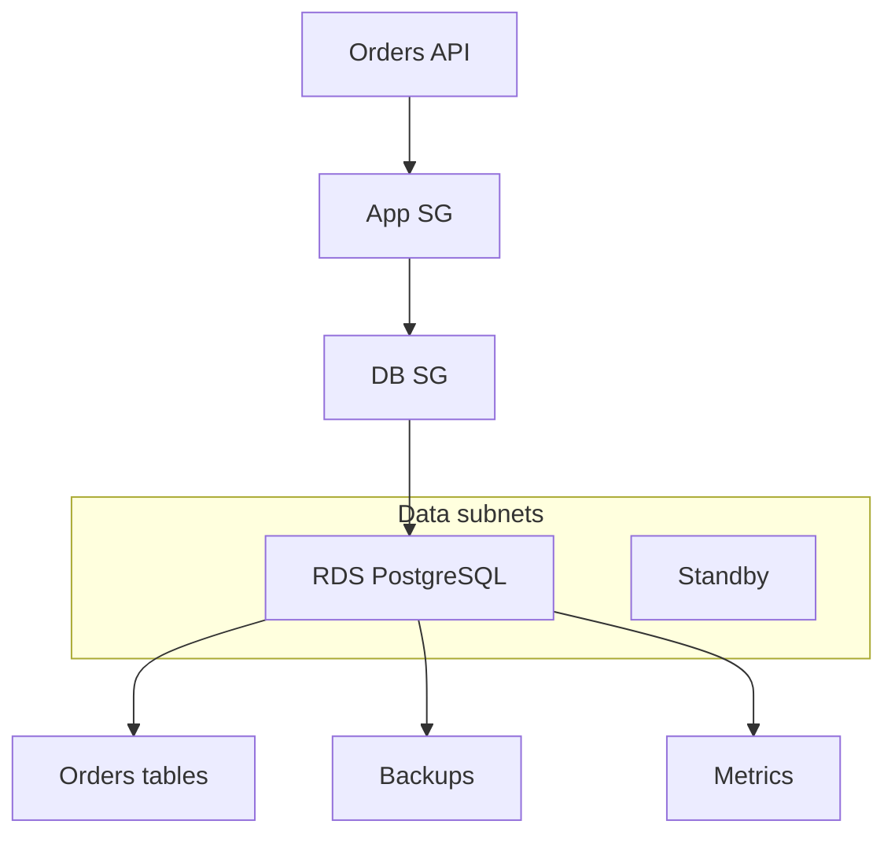

## Table of Contents

1. [The Problem](#the-problem)
2. [What Is RDS](#what-is-rds)
3. [Relational Shape](#relational-shape)
4. [DB Instances](#db-instances)
5. [Subnets And Security Groups](#subnets-and-security-groups)
6. [Credentials](#credentials)
7. [Connections](#connections)
8. [Backups](#backups)
9. [Multi-AZ](#multi-az)
10. [Schema Changes](#schema-changes)
11. [Sample Database Shape](#sample-database-shape)
12. [Putting It All Together](#putting-it-all-together)
13. [What's Next](#whats-next)

## The Problem

The orders application now stores receipt PDFs in S3. That solves file-shaped data, but checkout itself has a different shape.

One checkout creates an order, line items, a payment record, a shipping address, and an audit trail. The app needs these facts to agree with each other:

- A line item should not float around without a real order.
- A payment should not be marked captured if the order insert failed.
- A migration should not silently remove a column the running app still needs.
- A support query may need to join customers, orders, payments, and refunds.
- The database must be reachable from the app but not casually reachable from the internet.

This is relational data. The problem is not just storing bytes. The problem is preserving relationships, constraints, transactions, and query behavior while AWS manages the database infrastructure around it.

## What Is RDS

Amazon Relational Database Service, usually called RDS, is AWS's managed service for relational database engines. Instead of installing PostgreSQL or MySQL on your own EC2 instance, you create an RDS database and AWS manages many infrastructure tasks around the engine.

RDS does not remove database design. Your team still owns schemas, indexes, migrations, query behavior, credentials, connection use, backup expectations, and application compatibility. RDS gives those choices a managed home: database instances, storage, backups, maintenance windows, Multi-AZ options, monitoring, and network placement.

The useful beginner split is this:

| RDS helps manage | Your team still owns |
| --- | --- |
| Database provisioning | Data model and schema |
| Storage allocation and backups | Migration safety |
| Maintenance and patch windows | Query and index design |
| Multi-AZ failover options | Connection behavior |
| VPC placement and endpoints | Credentials and app permissions |

RDS is the right starting point when the application's correctness depends on relational database behavior, not just on a place to put data.

## Relational Shape

Relational data has structure that the database can enforce. Tables have columns. Rows can reference other rows. Constraints can prevent invalid states. Transactions can group several changes so they commit together or roll back together.

For checkout, that matters. If the app writes an `orders` row and three `order_items` rows, the system should not end up with only half the order. If a refund references a payment, the database should help prevent a refund from pointing at nothing. If support needs a report, SQL can join related records without the app manually stitching files together.

A small shape might look like this:

| Table | What it owns | Relationship |
| --- | --- | --- |
| `customers` | Customer profile facts | One customer can have many orders |
| `orders` | Checkout result | Belongs to one customer |
| `order_items` | Products and quantities | Belongs to one order |
| `payments` | Payment attempt and status | Belongs to one order |

This is where RDS differs from S3. A receipt PDF is a whole object. An order system is a set of related facts that must stay coherent as they change.

## DB Instances

An RDS DB instance is the managed database environment your app connects to. You choose an engine, version, instance class, storage configuration, network placement, backup settings, and maintenance preferences. AWS gives the database an endpoint so clients can connect.

That endpoint is not the same as making the database public. The endpoint is the name clients use. Reachability still depends on VPC placement, subnets, route paths, security groups, and whether the DB is publicly accessible.

The instance class and storage shape matter because a relational database is a running service, not just a bucket of rows. CPU, memory, storage throughput, connection count, and query shape all affect behavior. A tiny database can pass a demo and collapse under production checkout because slow queries and too many connections compete for the same resources.

The practical habit is to treat the DB instance as the runtime home for relational state. It needs sizing, maintenance, and observability the same way compute does.

## Subnets And Security Groups

RDS lives in a VPC. When you create a DB instance, it uses a DB subnet group so RDS knows which subnets are available for database placement. Production databases usually belong in private or data subnets, not in public entry-point subnets.

Security groups decide who can connect to the database port. By default, network access is not open. The app's security group should be allowed to connect to the database's security group on the database port. The whole internet should not be the source for a production database rule.

This is the same topology lesson from networking, now applied to data. A database is not private because its name includes `private`. It is private because its subnet placement, public accessibility setting, route paths, and security group rules create that result.

For the orders API, a readable rule is:

| Database rule | Meaning |
| --- | --- |
| Source: `orders-api-sg` | Only workloads using the app security group can initiate connections |
| Port: `5432` | PostgreSQL traffic only |
| Destination: `orders-db-sg` | The rule belongs to the database security group |

That rule is easier to review than a broad CIDR range copied from a wiki.

## Credentials

Database credentials decide who the app is inside the database. Network access can let packets reach the database, but credentials decide whether the connection can log in and what it can do.

In AWS systems, database passwords often belong in Secrets Manager and are delivered to the runtime through a controlled configuration path. The app should not bake credentials into an image, commit them to source control, or paste them into an instance script.

Credentials also have a database-side shape. The app user should have the permissions it needs for normal application work. Migration jobs may need different permissions. Human break-glass access should be rare, audited, and separated from the app's steady runtime identity.

This separation helps during incidents. If packets cannot reach the database, inspect networking and security groups. If login fails, inspect secret value, rotation timing, username, password, and database user permissions. If a query fails after login, inspect schema and SQL permissions.

## Connections

A relational database connection is a real resource. Each connection consumes database memory and coordination. A web service with too many containers, too many threads, or no pooling can exhaust database connections before CPU or storage look like the problem.

This is a common surprise for teams moving from a local database. On a laptop, one developer and one app process may have a handful of connections. In AWS, an autoscaled service can create many copies of the app. If each copy opens a large pool, the database sees the multiplication.

Connection design should match the runtime shape:

| Runtime shape | Connection question |
| --- | --- |
| ECS service | How many tasks can run, and how large is each pool? |
| Lambda | Can bursts create too many concurrent connections? |
| EC2 service | Does the process manager restart in a way that leaks or spikes connections? |
| Migration job | Does it lock or block tables the live app needs? |

RDS is managed, but it is not infinite. Connection count, query duration, locks, indexes, and transaction length still belong to the team.

## Backups

RDS automated backups can provide point-in-time recovery within the configured retention period. RDS also supports manual DB snapshots. These are different from the app merely having another copy of a row somewhere.

A backup answers a recovery question: "Can we restore the database to a known point after deletion, corruption, or a bad migration?" The right retention window depends on the business risk and the failure modes the team wants to survive.

Backups have two gotchas. First, a backup that has never been restored is still partly a hope. The team should practice restore into a safe environment and know what endpoint, credentials, and app changes are needed to validate it. Second, point-in-time restore restores a database state, not one application-level object. If one customer row was changed incorrectly, the team still needs a plan for comparing, extracting, or replaying the right data safely.

Backups protect relational state, but they do not replace migration discipline.

## Multi-AZ

Multi-AZ is an RDS high-availability option. In a common Multi-AZ DB instance deployment, RDS maintains a synchronous standby replica in a different Availability Zone and can fail over if the primary has a problem.

The important beginner gotcha is that a standby in this model is for failover, not read scaling. If the app needs read scaling, that is a different design question involving read replicas or another database shape. Multi-AZ helps availability and maintenance resilience; it does not make every slow query faster.

Multi-AZ can also affect write and commit latency because changes must be replicated. That tradeoff is often worth it for production, but it should be understood as an availability choice, not a free performance switch.

In the data map, Multi-AZ answers "What happens if the database instance or Availability Zone has trouble?" It does not answer "Is my schema right?" or "Can my app handle failover and reconnect?"

## Schema Changes

Schema changes are part of operations. Adding a column, changing an index, renaming a field, or dropping a table can affect running application code. A migration is a release event for the data model.

A safe schema habit is to make changes compatible across deploy steps. Add the new column before the app requires it. Backfill carefully. Deploy the app change. Remove old columns only after no running code needs them. For large tables, understand whether a migration locks writes, rewrites data, or changes query plans.

This section belongs in an RDS article because relational databases make schema explicit. That explicitness is powerful. It lets the database enforce meaning. It also means the schema must evolve deliberately.

The practical evidence is simple: a migration plan should say what changes, which app versions are compatible, how long it might take, how to observe it, and how to recover if it goes wrong.

## Sample Database Shape

For the orders application, the relational path might look like this:

The app reaches the database through security groups, not a public shortcut. The database lives in data subnets. Tables preserve relationships. Backups create recovery points. Metrics show pressure from connections, CPU, storage, and query behavior.

This is the RDS story in one picture: relational state needs a managed database runtime, not just a durable object store.

## Putting It All Together

The opening checkout workflow needed relationships and transactions. Receipt PDFs belonged in S3, but orders, line items, payments, and customers need a relational database shape.

RDS gives that shape a managed AWS home. The DB instance provides the database runtime. Subnets and security groups control reachability. Credentials control login and database permissions. Connections must be managed because every app copy can add pressure. Backups and snapshots protect against loss and bad changes. Multi-AZ improves availability for production databases. Schema changes become part of release safety.

The main habit is to treat RDS as both data model and running service. SQL correctness, network placement, credentials, connection behavior, backups, and migrations all matter together.

## What's Next

RDS is strongest when the data is relational. The next article covers a different shape: key-based data where the application already knows the access pattern and needs fast item reads, conditional writes, and predictable scale. That is where DynamoDB fits.

---

**References**

- [Amazon Relational Database Service Documentation](https://aws.amazon.com/documentation-overview/relational-database-service/). Supports the managed relational database framing, automated backup feature, and Multi-AZ positioning.
- [Working with a DB instance in a VPC](https://docs.aws.amazon.com/AmazonRDS/latest/UserGuide/USER_VPC.WorkingWithRDSInstanceinaVPC.html). Supports the VPC, subnet group, and network-interface placement discussion for RDS.
- [Controlling access with security groups](https://docs.aws.amazon.com/AmazonRDS/latest/UserGuide/Overview.RDSSecurityGroups.html). Supports the database security group explanation and source security group pattern.
- [Introduction to backups](https://docs.aws.amazon.com/AmazonRDS/latest/UserGuide/USER_WorkingWithAutomatedBackups.html). Supports automated backups, backup retention, and point-in-time recovery framing.
- [Multi-AZ DB instance deployments for Amazon RDS](https://docs.aws.amazon.com/AmazonRDS/latest/UserGuide/Concepts.MultiAZSingleStandby.html). Supports the Multi-AZ standby, failover, and non-read-scaling explanation.
