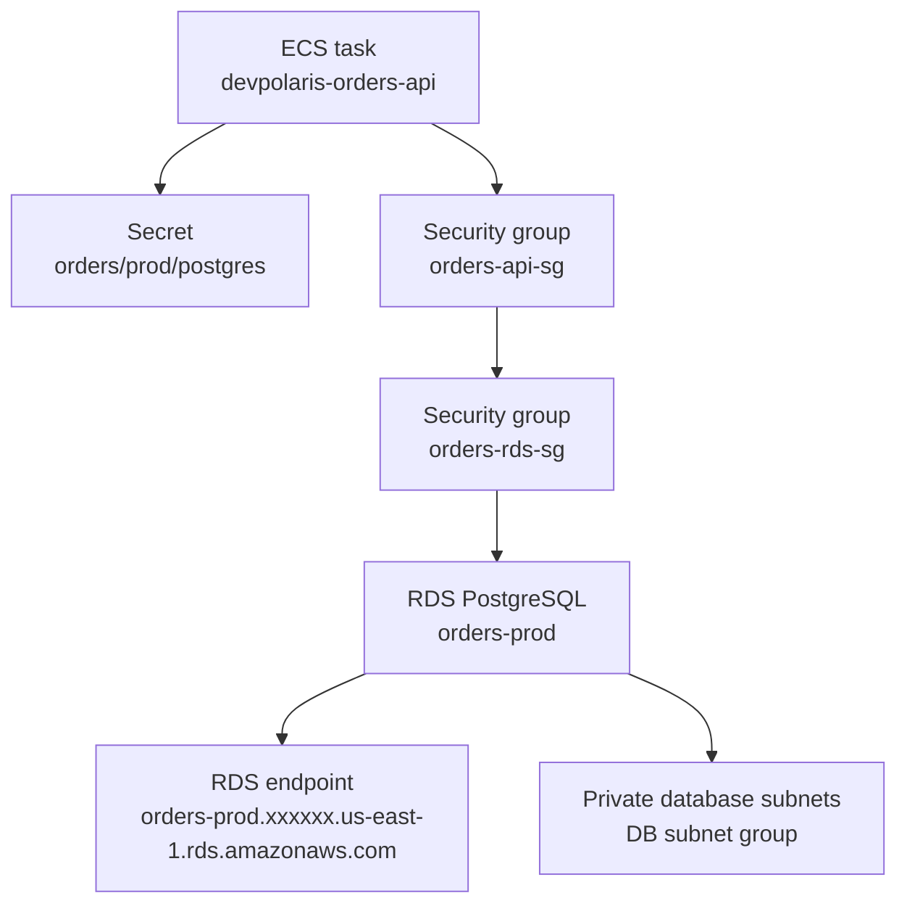

## Table of Contents

1. [Application State That Needs Rules](#application-state-that-needs-rules)
2. [Why Orders Fit a Relational Database](#why-orders-fit-a-relational-database)
3. [The RDS Shape in AWS](#the-rds-shape-in-aws)
4. [The Connection Path From ECS to RDS](#the-connection-path-from-ecs-to-rds)
5. [Schema Changes Are Part of Operations](#schema-changes-are-part-of-operations)
6. [Backups, Restores, and Read Traffic](#backups-restores-and-read-traffic)
7. [When the App Cannot Connect](#when-the-app-cannot-connect)
8. [What RDS Manages and What You Still Own](#what-rds-manages-and-what-you-still-own)

## Application State That Needs Rules

Some application data is just a file. An uploaded invoice PDF can live in object storage. A resized product image can be replaced if the image job runs again.

But checkout data feels different. When a customer places an order, the backend needs to remember facts that must agree with each other. The order belongs to one customer.

The order has line items. Each line item points at a product snapshot and a price. The payment status starts as pending, then moves to paid, failed, refunded, or another state your business accepts.

If one part changes without the others, the user sees a mess. They might be charged without an order. They might see an order with no line items.

They might get a refund while the order still says paid. This is the kind of application state where a relational database makes sense. A relational database stores data in tables, where rows connect to other rows through keys.

A key is a stable value that identifies a row, like `order_id`. SQL (Structured Query Language) is the language you use to ask questions and change data in many relational databases. Amazon RDS (Amazon Relational Database Service) is AWS's managed service for running relational database engines.

Managed means AWS runs the database server machinery for you: provisioning, storage, backups, patching options, and many availability features. It does not mean AWS designs your tables, writes your queries, or knows when a migration is safe. That split is the most important thing to learn early.

RDS takes a lot of server work off your plate. You still own the application behavior that uses the database. In this article, `devpolaris-orders-api` is a Node.js backend that runs on Amazon ECS.

ECS (Amazon Elastic Container Service) starts tasks for the checkout and orders service in private subnets. The service stores orders, line items, and payment status in PostgreSQL on RDS. The app reads its database connection details from AWS Secrets Manager.

Then it connects to the RDS endpoint through security groups inside the VPC (Virtual Private Cloud, your private network space in AWS). That running path gives us a useful question for the whole article:

> When checkout depends on SQL, what has to be correct before a request can safely become an order?

## Why Orders Fit a Relational Database

Relational data is data where the relationships matter as much as the values. An order is not just one JSON blob with a status field. It is a small set of facts that must stay connected.

The order header says who bought something and when. The line items say what was bought. The payment record says whether money was authorized, captured, failed, or refunded.

In a relational database, you normally model those facts as separate tables. That gives the database enough structure to protect you from impossible states. Here is a small version of the `devpolaris-orders-api` model.

It is not the full production schema. It is just enough to show the shape.

```sql
create table orders (
  id uuid primary key,
  customer_id uuid not null,
  status text not null,
  created_at timestamptz not null
);

create table order_items (
  id uuid primary key,
  order_id uuid not null references orders(id),
  sku text not null,
  quantity integer not null,
  unit_price_cents integer not null
);

create table payments (
  id uuid primary key,
  order_id uuid not null references orders(id),
  provider_reference text not null,
  status text not null
);
```

The important part is not the SQL syntax. The important part is the promise. An `order_items.order_id` must point at a real `orders.id`.

That relationship is called a foreign key. It prevents a line item from floating around without an order. That is the database helping the application keep its story straight.

A checkout request often needs a transaction. A transaction is a group of database changes that succeed together or fail together. For `devpolaris-orders-api`, the happy path might create one order, insert three line items, and create one payment row.

If the third line item insert fails, you do not want half an order. You want the whole group to roll back. That is why orders are a good SQL example.

The data has relationships. The writes need consistency. The questions are natural in SQL:

```sql
select o.id, o.status, p.status as payment_status
from orders o
join payments p on p.order_id = o.id
where o.customer_id = '8ed1b0f5-7d48-4e9d-b0ff-9d4d92765b4a'
order by o.created_at desc;
```

You could store an order as one document somewhere else. Sometimes that is fine. But if the team expects joins, constraints, migrations, reporting queries, and transaction boundaries, SQL gives you the right operating model.

The database is not only a storage box. It is also a rule checker. That rule checker is useful only if you design the rules and keep them in sync with the app.

## The RDS Shape in AWS

The first RDS word to learn is DB instance. A DB instance is an isolated database environment that runs a database engine in AWS. For this article, the engine is PostgreSQL.

The same RDS mental model also applies to engines such as MySQL or MariaDB, but your SQL details and operational habits can differ by engine. An RDS DB instance has an endpoint. An endpoint is the DNS name your app uses as the database host.

DNS (Domain Name System) is the naming system that turns a hostname into a network address. Your app should not connect to some hidden machine address. It connects to the endpoint AWS gives the database.

For `devpolaris-orders-api`, the important AWS objects look like this:



The diagram shows a common beginner surprise. The secret does not open the network path. The security group does not provide the password.

The endpoint is not a credential. All three have different jobs. The endpoint tells the app where the database is.

The secret tells the app how to authenticate. The security groups decide whether network traffic is allowed. The subnet placement decides which part of the VPC the database lives in.

A DB subnet group is a set of subnets that RDS can use for database placement. For an application database, you normally place the database in private subnets. Private subnets are subnets that do not expose the database directly to the public internet.

That does not make the database magically secure. It simply removes a large, unnecessary path from the design. The intended path is the app service reaching the database inside the VPC.

RDS also has cluster-shaped options. Amazon Aurora uses a cluster model, where a cluster endpoint can represent the writer and reader endpoints can serve read traffic. Some RDS deployment options also use a Multi-AZ DB cluster model.

Multi-AZ means database resources are placed across multiple Availability Zones, which are separate data center locations inside a Region. You do not need to master every cluster option on day one. For a beginner backend, the main distinction is simple:

| Choice | Beginner mental model | What you decide |
|--------|------------------------|-----------------|
| DB instance | One managed database environment | Engine, size, storage, network, backups |
| Aurora cluster | A managed database cluster with cluster endpoints | Writer and reader paths, cluster settings |
| Read replica | A copy used for read traffic or recovery plans | Which queries can tolerate replication delay |
| RDS Proxy | A managed connection pool in front of RDS | Whether the app needs help with connection spikes |

Start with the application need. `devpolaris-orders-api` needs a reliable PostgreSQL database for checkout writes. That means the first design should focus on correct writes, private connectivity, credentials, backups, and migrations.

Read scaling can come later when real query load proves it is needed.

## The Connection Path From ECS to RDS

A database connection is not one setting. It is a path with several gates. When `devpolaris-orders-api` starts, it needs a connection string or equivalent fields.

The app should not bake the password into the image. The container image should be reusable across environments. The secret should change without rebuilding the image.

For this example, Secrets Manager stores the database details as JSON.

```json
{
  "engine": "postgres",
  "host": "orders-prod.xxxxxx.us-east-1.rds.amazonaws.com",
  "port": 5432,
  "database": "orders",
  "username": "orders_app",
  "password": "redacted"
}
```

The shape matters. If the app expects `host` but the secret stores `hostname`, the network can be perfect and the app still fails before it reaches RDS. If the secret points at the staging endpoint in production, the app may connect successfully and write to the wrong place.

That is worse than a clean failure. The ECS task role needs permission to read the secret. The task role is the IAM (Identity and Access Management) role the running task uses when it calls AWS APIs.

In this case, the app needs permission for `secretsmanager:GetSecretValue` on the specific secret. The connection path is easier to debug when you split it into layers:

| Layer | Example value | What it proves |
|-------|---------------|----------------|
| App config | `DB_SECRET_ID=orders/prod/postgres` | The container knows which secret to request |
| Secret value | JSON with `host`, `port`, `database`, `username`, `password` | The app has the fields it expects |
| DNS endpoint | `orders-prod.xxxxxx.us-east-1.rds.amazonaws.com` | The app can resolve the database name |
| Security group | `orders-rds-sg` allows PostgreSQL from `orders-api-sg` | The network path is allowed from app to database |
| Database auth | `orders_app` can log in to database `orders` | The database accepts the user and password |

That table is the mental checklist. When a connection fails, do not stare at the application code first. Walk the path.

You want to know which gate rejected the request. Here is a small ECS task environment shape. It shows the app reading a secret name, not the password itself.

```json
{
  "name": "devpolaris-orders-api",
  "environment": [
    {
      "name": "DB_SECRET_ID",
      "value": "orders/prod/postgres"
    },
    {
      "name": "NODE_ENV",
      "value": "production"
    }
  ]
}
```

The application can use the AWS SDK in Node.js to retrieve the secret and then build the PostgreSQL connection configuration. You do not need much code to understand the operational dependency:

```text
container starts
  -> reads DB_SECRET_ID
  -> calls Secrets Manager
  -> parses secret JSON
  -> opens PostgreSQL connection to RDS endpoint
  -> runs readiness check
```

A good readiness check does not just prove the Node.js process is alive. It proves the service can do the boring dependency work it needs for checkout. For example, `GET /health/ready` can run a tiny query such as `select 1`.

That does not prove every checkout query is perfect. It proves the app can reach the database with the current secret, endpoint, network path, and user.

## Schema Changes Are Part of Operations

RDS makes the database server easier to operate. It does not make schema changes safe by itself. A schema is the structure of the database: tables, columns, indexes, constraints, and relationships.

A migration is a planned change to that schema. For `devpolaris-orders-api`, a migration might add a `payment_attempts` table or add an index for the order history page. The risk is not that SQL is scary.

The risk is that the app and database must agree on shape. If the new app code expects a `payments.failure_code` column before the migration has run, the request fails. If the migration removes a column while old tasks are still running, the old tasks fail.

If a migration locks a busy table for too long, checkout slows down or times out. A simple migration record gives the team something concrete to inspect. Many migration tools create a table like this:

```text
orders=> select version, name, applied_at
orders-> from schema_migrations
orders-> order by applied_at desc
orders-> limit 3;

 version |              name               |        applied_at
---------+---------------------------------+----------------------------
 202605021030 | add_payment_failure_code   | 2026-05-02 10:31:07+00
 202604281415 | create_order_items         | 2026-04-28 14:16:44+00
 202604201100 | create_orders              | 2026-04-20 11:01:22+00
```

This is not glamorous, but it is exactly the kind of evidence you want during a deploy. If the app logs say a column is missing, the migration table tells you whether the database received the change. A safe beginner pattern is expand, deploy, contract.

Expand means adding a new table or column in a way old code can ignore. Deploy means releasing application code that starts using the new shape. Contract means removing the old shape later, after old tasks are gone.

For example, suppose `devpolaris-orders-api` needs to store a payment failure reason. The safer path is:

1. Add nullable `failure_code` and `failure_message` columns.
2. Deploy code that writes those fields when payment fails.
3. Backfill or verify old rows if needed.
4. Only later add stricter constraints if the data proves it is ready.
This is database operations, even though it happens in application code and migration files. RDS will keep the database process running. It will not tell you that your deploy order is wrong.

That judgment belongs to the team.

## Backups, Restores, and Read Traffic

Beginner teams often treat backups like a checkbox. That is understandable, but risky. A backup is not useful because it exists.

A backup is useful because you know what it can restore and how the application behaves after the restore. RDS supports automated backups for DB instances and Multi-AZ DB clusters. AWS creates backups during the backup window and keeps them according to the retention period you configure.

RDS also supports manual DB snapshots. A snapshot is a backup you create intentionally, often before a risky migration or a large data change. For `devpolaris-orders-api`, useful backup thinking sounds like this:

| Situation | Useful protection | Question to ask |
|-----------|-------------------|-----------------|
| Bad migration changes order rows | Automated backup or manual snapshot before the migration | Can we restore to a safe point? |
| Developer deletes test data in production by mistake | Point-in-time restore within the configured backup window | Which data changed after that point? |
| Reporting query overloads checkout database | Read replica or separate reporting path | Can this read tolerate stale data? |
| Connection spikes from many tasks | App pool tuning or RDS Proxy | Are we opening more connections than the database can handle well? |

Read replicas are useful when read traffic is separate from write traffic. A read replica receives changes from the source database and serves read queries. That can help with dashboards, exports, or order history pages that do not need the newest write instantly.

But a read replica is not a magic speed button. The application must know which queries can read from a replica. Checkout writes still go to the writer.

Payment state decisions should usually read from the writer or use a design that tolerates delay. Replication delay is the gap between the writer and the replica. If a customer pays and immediately refreshes the order page, a replica might not have the update yet.

That does not mean the database is broken. It means the app chose a read path where freshness is not guaranteed. Connection count is another operational habit.

Node.js services often use a connection pool. A connection pool keeps a small set of database connections open and reuses them. That is better than opening a new database connection for every request.

But every ECS task may have its own pool. If you scale from two tasks to many tasks, the total possible connections can jump quickly. RDS Proxy can sit between the app and RDS to pool and share database connections for supported RDS engines.

That can help when applications create many connections or when traffic is bursty. It is still not a substitute for understanding your app's query behavior. A slow query through a proxy is still a slow query.

A transaction that stays open too long still holds database resources. The proxy helps with connection handling. It does not fix careless database use.

## When the App Cannot Connect

Connection failures are common because the path has several gates. The good news is that the error usually tells you which kind of gate to inspect first. Imagine `devpolaris-orders-api` deploys a new task revision.

The task starts, but the readiness check fails. CloudWatch Logs shows this:

```text
2026-05-02T09:42:18.331Z INFO  devpolaris-orders-api starting
2026-05-02T09:42:18.612Z INFO  loading database secret secretId=orders/prod/postgres
2026-05-02T09:42:19.044Z INFO  database endpoint host=orders-prod.xxxxxx.us-east-1.rds.amazonaws.com port=5432 database=orders
2026-05-02T09:42:29.061Z ERROR readiness failed error="connect ETIMEDOUT 10.42.18.91:5432"
2026-05-02T09:42:29.062Z WARN  task will stay out of service until readiness passes
```

`ETIMEDOUT` is a network-shaped failure. The app had a host and port. It tried to connect.

Nothing completed before the timeout. That points you toward routing, subnet placement, security groups, or the database state before you spend time changing the password. The first check is the secret shape.

You do not print passwords into logs. You can inspect the field names and endpoint carefully from a secure shell or controlled admin environment.

```bash
$ aws secretsmanager get-secret-value \
>   --secret-id orders/prod/postgres \
>   --query SecretString \
>   --output text
{"engine":"postgres","host":"orders-prod.xxxxxx.us-east-1.rds.amazonaws.com","port":5432,"database":"orders","username":"orders_app","password":"***"}
```

The value proves the app is reading the intended secret and that the host field points at the production RDS endpoint. If this command fails with an access error, the task role or your operator role may not have permission to read the secret. If the JSON shape is wrong, fix the secret or the app's parser before touching RDS.

The next check is the RDS endpoint and database status. You want to know whether AWS sees the database as available and which security groups are attached.

```bash
$ aws rds describe-db-instances \
>   --db-instance-identifier orders-prod \
>   --query "DBInstances[0].{Status:DBInstanceStatus,Endpoint:Endpoint.Address,Port:Endpoint.Port,SecurityGroups:VpcSecurityGroups[*].VpcSecurityGroupId}"
{
  "Status": "available",
  "Endpoint": "orders-prod.xxxxxx.us-east-1.rds.amazonaws.com",
  "Port": 5432,
  "SecurityGroups": [
    "sg-0rdsorders123"
  ]
}
```

This output does not prove the app can connect. It proves the database exists, is reporting as available, has an endpoint, and has a security group attached. Now compare the security group rule.

The RDS security group should allow inbound PostgreSQL traffic from the ECS service security group, not from the whole internet.

```text
Inbound rule on orders-rds-sg

Type        Protocol  Port   Source
PostgreSQL  TCP       5432   sg-0ordersapi456
```

If the source is missing or points to an old service security group, the app times out. The fix is not to make the database public. The fix is to allow the specific app security group to reach the database port.

Auth failures look different. Here is the same app with a wrong password:

```text
2026-05-02T10:11:03.448Z INFO  database endpoint host=orders-prod.xxxxxx.us-east-1.rds.amazonaws.com port=5432 database=orders
2026-05-02T10:11:03.711Z ERROR readiness failed error="password authentication failed for user \"orders_app\""
```

That proves the network path reached PostgreSQL. The database answered. The user or password was rejected.

Now the next checks are the secret version, the database user, and any recent credential rotation. A migration failure has a different shape again:

```text
2026-05-02T10:31:09.771Z ERROR migration failed name=add_payment_failure_code
2026-05-02T10:31:09.772Z ERROR database error="column \"failure_code\" of relation \"payments\" already exists"
```

That is not a subnet problem. That is a deploy and migration coordination problem. The database is reachable.

The migration is not safe to run in its current form. The diagnostic path for beginner incidents is:

1. Read the app log line and classify the failure: timeout, auth, SQL error, or too many connections.
2. Confirm the secret ID, field names, endpoint, username, and database name.
3. Confirm the RDS endpoint, port, status, and attached security group.
4. Confirm the RDS security group allows inbound traffic from the app security group.
5. Check RDS events and database metrics for availability, connection count, CPU, storage, or maintenance signals.
6. Check migration history if the error mentions tables, columns, locks, or constraints.
This order keeps you from guessing. It also prevents the dangerous habit of opening access wider just to make the error go away.

## What RDS Manages and What You Still Own

RDS is valuable because it removes a lot of undifferentiated database server work. You do not SSH into a database host and install PostgreSQL packages by hand. You do not manage the underlying host filesystem directly.

You can configure automated backups, snapshots, maintenance settings, network placement, monitoring, and availability options through AWS. That is a real operational win. It lets a small team focus more energy on the application.

But beginners sometimes hear "managed" and think "not my problem." That is the wrong lesson. RDS manages the database service boundary.

You still manage the application contract with the database. Here is the practical split:

| RDS helps manage | Your team still owns |
|------------------|----------------------|
| Database provisioning | Choosing the right engine for the app |
| Storage and instance configuration | Table design and indexes |
| Automated backups and snapshots | Restore practice and data recovery decisions |
| Maintenance and patching options | Migration order and deploy coordination |
| Endpoints and database status | Connection strings, secrets, and app pools |
| Multi-AZ and replica features | Which traffic can read from which endpoint |
| Metrics and events | Query behavior and incident diagnosis |

The tradeoff is control for reduced server burden. You get managed operations around the database process. You give up direct host access and some low-level control.

That is usually a good trade for application teams. Most checkout teams do not want to babysit database machines. They want a clear, recoverable, monitored database that follows AWS patterns.

Still, the hardest production problems often live above the managed layer. A missing index can make order history slow. A careless migration can block writes.

A task count change can multiply database connections. A secret rotation can break auth if the app only reads the secret at startup and never restarts. A read replica can serve old payment state if the app uses it for fresh decisions.

RDS does not remove those decisions. It makes the infrastructure base steadier so you can make those decisions with better tools. For `devpolaris-orders-api`, a healthy operating checklist looks like this:

| Check | Healthy signal |
|-------|----------------|
| Secret | `orders/prod/postgres` has the expected JSON fields |
| Network | `orders-rds-sg` allows PostgreSQL from `orders-api-sg` |
| Endpoint | App logs show the intended RDS endpoint and database name |
| Readiness | `/health/ready` proves a small database query succeeds |
| Migrations | `schema_migrations` shows the expected latest version |
| Backups | Automated backups are configured and restores are practiced |
| Connections | App pool size matches task scaling plans |
| Queries | Slow or frequent queries are measured before scaling reads |

That checklist is not fancy. It is the difference between "RDS exists" and "our checkout service can depend on RDS safely." When you learn RDS this way, the AWS console stops feeling like a wall of options.

Each setting connects back to one question: Can the app store and recover important relational state without guessing? For checkout and orders, that is the whole job.

---

**References**

- [Amazon RDS DB instances](https://docs.aws.amazon.com/AmazonRDS/latest/UserGuide/Overview.DBInstance.html) - Explains the DB instance as the basic RDS building block and describes standard SQL client access.
- [Connecting to a DB instance running PostgreSQL](https://docs.aws.amazon.com/AmazonRDS/latest/UserGuide/USER_ConnectToPostgreSQLInstance.html) - Shows where to find the RDS endpoint, port, database name, and public or private accessibility setting.
- [Determining who can connect to your Amazon RDS DB instance](https://docs.aws.amazon.com/AmazonRDS/latest/gettingstartedguide/security-groups.html) - Explains how RDS security groups control inbound database access.
- [Introduction to backups](https://docs.aws.amazon.com/AmazonRDS/latest/UserGuide/USER_WorkingWithAutomatedBackups.html) - Describes automated backups, backup windows, retention, and point-in-time recovery for RDS.
- [Get a secret value using the AWS CLI](https://docs.aws.amazon.com/secretsmanager/latest/userguide/retrieving-secrets_cli.html) - Shows the Secrets Manager CLI path used to inspect the secret value during diagnosis.
- [Amazon RDS Proxy](https://docs.aws.amazon.com/AmazonRDS/latest/UserGuide/rds-proxy.html) - Explains how RDS Proxy pools and reuses database connections for supported engines.
