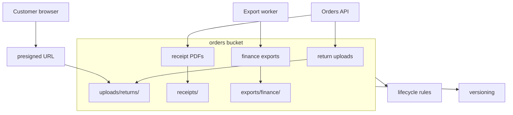

## Table of Contents

1. [The Problem](#the-problem)
2. [What Is S3](#what-is-s3)
3. [Buckets](#buckets)
4. [Keys](#keys)
5. [Objects](#objects)
6. [Access](#access)
7. [Versioning](#versioning)
8. [Lifecycle](#lifecycle)
9. [Multipart Uploads](#multipart-uploads)
10. [Presigned URLs](#presigned-urls)
11. [Sample Object Map](#sample-object-map)
12. [Putting It All Together](#putting-it-all-together)
13. [What's Next](#whats-next)

## The Problem

The previous article separated storage by shape. Now look at the most common object-shaped case: the orders application needs to store files.

The team has several file workflows:

- Customers upload return photos and expect the app to show them later.
- Checkout generates receipt PDFs that should survive app restarts, deploys, and instance replacement.
- A nightly export creates CSV files for finance.
- Support needs a safe link to one file without receiving AWS credentials.
- Some generated files should be kept for years, while temporary exports should disappear after a short window.

None of that wants a database row as the main storage unit. The file itself is the unit. The app wants to put a whole object somewhere durable, name it clearly, control who can read it, and decide what happens when it is replaced or old.

That is the S3-shaped problem.

## What Is S3

Amazon Simple Storage Service, usually called S3, is AWS object storage. It stores objects in buckets. Each object has bytes, a key, metadata, and access controls around it. You retrieve the object by naming the bucket and key.

S3 is not a mounted drive. It does not give the app a normal POSIX filesystem with open file handles, renames, and directory locks. The app uses S3 APIs to put, get, list, copy, tag, and delete objects. That difference is why S3 is excellent for files, exports, uploads, static assets, and artifacts, but awkward for software that expects a shared mounted directory.

The useful mental model is a durable object address:

```text
s3://devpolaris-orders-prod/receipts/2026/05/order-1042.pdf
```

The bucket is `devpolaris-orders-prod`. The key is `receipts/2026/05/order-1042.pdf`. Everything after the bucket name is the object key, even though it looks like folders.

## Buckets

A bucket is the container for S3 objects. Bucket names are part of the object's address and must be chosen deliberately. A bucket also carries important settings: region, access policy, encryption defaults, versioning, lifecycle rules, logging, replication, and public access controls.

Beginners often treat buckets like directories and create too many of them. A better habit is to create buckets around ownership, environment, access boundary, and lifecycle. Production order receipts might belong in a different bucket from temporary export staging because the access rules and retention rules are different.

| Bucket question | Why it matters |
| --- | --- |
| Who owns this data? | The owning team should understand access, retention, and deletion |
| Which environment is it for? | Prod, staging, and dev should not casually share object homes |
| What access boundary applies? | Public assets, private uploads, and internal exports need different policies |
| How long should it live? | Lifecycle rules and retention reviews are easier when data with similar rules is grouped |

The name is not the safety control. A bucket named `private-receipts` is private only if its policy, public access settings, IAM permissions, and object access paths make it private.

## Keys

The object key uniquely identifies an object within a bucket. Keys can contain slashes, so they often look like file paths:

```text
receipts/2026/05/order-1042.pdf
exports/finance/2026-05-14/orders.csv
uploads/returns/customer-991/photo-1.jpg
```

Those slashes are useful. They create prefixes that humans, lifecycle rules, inventory jobs, and application code can use. But they are not real folders in the same way a Linux filesystem has directories. The full key is the object name.

This gotcha matters during deletes and overwrites. Deleting a prefix is really deleting objects whose keys match that prefix. Moving an object is usually copy plus delete. Renaming a "folder" can mean many object operations. A key plan should come from access patterns, not from how tidy the console looks.

For the orders app, useful keys include the stable thing you will search by later. `receipts/2026/05/order-1042.pdf` is easier to reason about than `uploads/final/latest.pdf` because the order id is part of the durable address.

## Objects

An S3 object is the stored unit: bytes plus metadata under one key. The app usually writes the whole object and later reads the whole object or a byte range. If the app writes the same key again, callers see the newer object as the current value.

S3 provides strong read-after-write consistency for object PUT and DELETE requests in all AWS Regions. That means after a successful write or delete, later reads and lists reflect the latest result. Old application workarounds that sleep after writing a new object are usually a sign the design came from an older S3 era or from a cache outside S3.

Consistency does not remove every stale-data problem. A browser, CDN, application cache, or copied URL can still show an older representation. If the app writes a new object and the user sees stale content, ask where the content was cached before blaming S3 consistency.

Object metadata and tags give you useful labels, but they are not a query engine. For large collections, design keys, prefixes, event records, inventory, or a database index around the questions the app needs to ask.

## Access

S3 access is an authorization problem around actions and resources. The app might be allowed to `PutObject` into `uploads/returns/*` but not allowed to delete receipts. Support might be allowed to generate a temporary download path without seeing broad bucket credentials. A public website bucket has a different risk profile from private order documents.

Three layers commonly matter:

| Layer | Question |
| --- | --- |
| IAM identity policy | What is this user, role, Lambda, ECS task, or pod allowed to do? |
| Bucket policy | What does this bucket allow or deny for callers and paths? |
| Public access settings | Could this bucket or object become public in a way the team did not intend? |

Access errors are easier to read when the key plan is clear. `arn:aws:s3:::devpolaris-orders-prod/receipts/2026/05/order-1042.pdf` tells you exactly which object path the caller tried to use. Vague prefixes such as `misc/*` make review harder.

The safety habit is to grant actions by workload and prefix. The receipt writer can write receipts. The finance export worker can write exports. The public web app should not inherit delete access to private customer uploads just because all files live in one bucket.

## Versioning

Versioning lets a bucket preserve multiple versions of an object under the same key. Without versioning, replacing a key can hide the old object from normal reads. With versioning enabled, S3 keeps prior versions so the team can recover from accidental overwrites or deletes.

This is the difference between "the key still exists" and "we can get back what used to be there." If the receipt generator accidentally writes blank PDFs over real receipts, versioning can be the line between a repair and permanent loss.

Versioning also changes deletion behavior. A delete can create a delete marker instead of immediately removing every version. That is helpful for recovery, but it means lifecycle and retention rules need to account for current versions, noncurrent versions, and delete markers. Otherwise a bucket can keep more data than the team realizes.

Versioning is a safety feature, not a substitute for a deletion process. Sensitive data still needs lifecycle, retention, and access review.

## Lifecycle

S3 lifecycle rules move or expire objects based on age, prefix, tags, and version state. They are how the team turns "temporary exports should disappear" into an automated behavior.

For example, the orders app might keep generated receipt PDFs for years, temporary export staging files for 14 days, and incomplete multipart uploads for only a few days. Those are different lifecycle promises and should be visible in bucket rules.

Lifecycle has a cost shape as well as a safety shape. Moving objects to another storage class may reduce storage cost for data that is rarely read, but retrieval behavior and timing matter. Expiring objects can reduce clutter and risk, but a bad expiration rule can delete data the business still needs.

Use lifecycle rules only after the prefix and tag strategy is clear. A broad rule on `exports/` is easy to write and painful if monthly compliance exports and throwaway staging files share the same prefix.

## Multipart Uploads

Large files need a different upload path. A single PUT operation has a size limit, and large uploads can fail late if treated as one giant request. Multipart upload lets the client upload one object as multiple parts, then have S3 assemble those parts into the final object.

Multipart upload changes failure behavior in a useful way. If part 37 fails, the client can retry that part instead of starting the entire file again. That is why large videos, database exports, and big customer uploads usually need multipart behavior.

It also introduces cleanup responsibility. Incomplete multipart uploads can leave parts stored until they are completed, aborted, or cleaned up by lifecycle rules. If a team accepts large uploads, it should also have a rule or process for abandoned uploads.

The beginner rule is simple: small objects can use straightforward uploads; large or unreliable uploads should use multipart-aware tooling and cleanup.

## Presigned URLs

A presigned URL lets the backend grant temporary access to one S3 operation without handing AWS credentials to the browser or another external caller. The backend signs a URL for a specific bucket, key, action, and time window. The caller uses that URL directly with S3.

This is useful for uploads. Instead of routing a 600 MB video through the API server, the API can authorize the request, choose the key, create a presigned upload URL, and let the browser send the bytes to S3.

The key detail is that the URL carries the permission the backend signed. If the key already exists and the signed operation allows upload to that key, the upload can replace the existing object. A safe upload flow chooses keys carefully, limits expiration, validates content expectations, and records the object metadata the app needs after the upload completes.

Presigned URLs are a delegation tool. They do not remove the need for bucket policy, key design, validation, and versioning.

## Sample Object Map

A simple S3 map for the orders app might look like this:



Notice how the prefixes line up with ownership and lifecycle. Receipts, uploads, and exports can have different permissions and retention rules because their keys make the difference visible.

The diagram also keeps the API out of the file-transfer path for browser uploads. The API decides whether the upload is allowed and what the key should be. S3 receives the bytes.

## Putting It All Together

The opening team needed a durable home for uploads, receipt PDFs, and exports. S3 fits because each file is an object with a bucket, key, metadata, access rules, and lifecycle.

Buckets provide the container and policy boundary. Keys provide durable object addresses and useful prefixes. Objects carry bytes and metadata. Access controls decide who can put, get, list, or delete. Versioning protects against overwrites and mistaken deletes. Lifecycle rules clean up or transition data intentionally. Multipart uploads make large files safer to upload. Presigned URLs let browsers and external callers interact with S3 without receiving AWS credentials.

The main design habit is to make the object address meaningful. A clear bucket and key plan makes access review, lifecycle cleanup, support links, and recovery much easier.

## What's Next

S3 is for whole-object data. The next article covers data with relationships: orders, customers, line items, transactions, and schema changes. That is where RDS becomes the better starting point.

---

**References**

- [What is Amazon S3?](https://docs.aws.amazon.com/AmazonS3/latest/userguide/Welcome.html). Supports the S3 overview, object storage framing, and strong read-after-write consistency statement.
- [Naming Amazon S3 objects](https://docs.aws.amazon.com/AmazonS3/latest/userguide/object-keys.html). Supports the explanation of object keys, prefixes, folder-like console behavior, and key naming behavior.
- [Retaining multiple versions of objects with S3 Versioning](https://docs.aws.amazon.com/AmazonS3/latest/userguide/Versioning.html). Supports the versioning explanation and the current/noncurrent version model.
- [Amazon S3 multipart upload limits](https://docs.aws.amazon.com/AmazonS3/latest/userguide/qfacts.html). Supports the multipart upload limits and the guidance to consider multipart upload for larger objects.
- [Uploading and copying objects using multipart upload](https://docs.aws.amazon.com/AmazonS3/latest/userguide/mpuoverview.html). Supports the explanation of uploading independent parts and completing the final object.
- [Uploading objects with presigned URLs](https://docs.aws.amazon.com/AmazonS3/latest/userguide/PresignedUrlUploadObject.html). Supports the presigned upload explanation and the warning that uploading to an existing key replaces the object.
