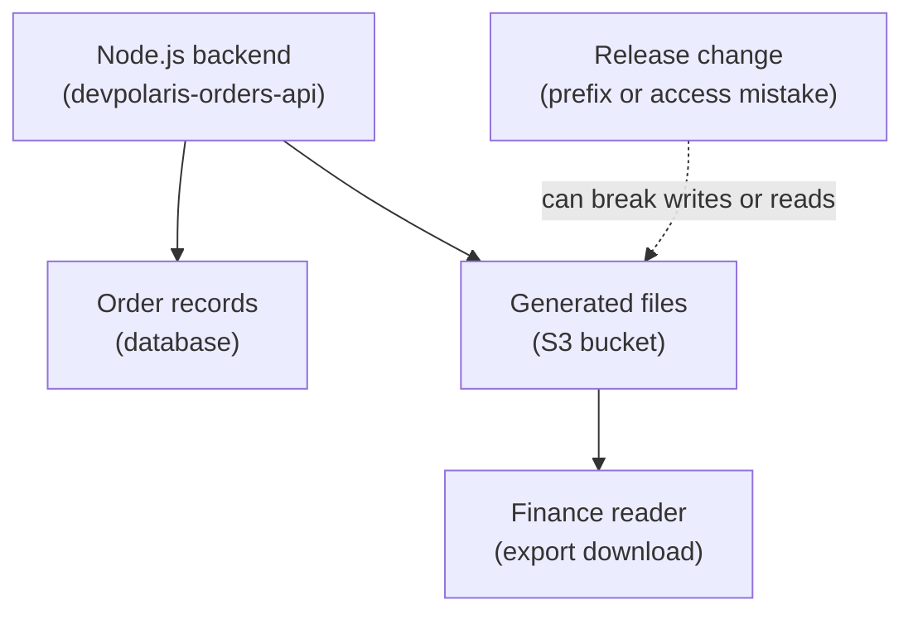

## Table of Contents

1. [The Storage Problem S3 Solves](#the-storage-problem-s3-solves)
2. [Buckets, Keys, and Objects](#buckets-keys-and-objects)
3. [Designing Keys for Orders Exports](#designing-keys-for-orders-exports)
4. [Writing and Reading Objects from the Orders API](#writing-and-reading-objects-from-the-orders-api)
5. [Access, IAM, and Real AccessDenied Errors](#access-iam-and-real-accessdenied-errors)
6. [Versioning, Overwrites, and Safe Deletion](#versioning-overwrites-and-safe-deletion)
7. [Lifecycle Rules, Metadata, and Encryption](#lifecycle-rules-metadata-and-encryption)
8. [Debugging Missing or Unreadable Objects](#debugging-missing-or-unreadable-objects)
9. [S3 Is Not Your Orders Database](#s3-is-not-your-orders-database)

## The Storage Problem S3 Solves

Many backend services produce files that are not really database rows. An order export is a file. A receipt PDF is a file. A generated JSON manifest is a file. A finance download that should stay available after the app container restarts is a file.

You can save those files on the server's local disk while you are learning. That works until the service runs on more than one machine, gets redeployed, or moves to another host. Local disk belongs to one running environment. If that environment disappears, the file can disappear with it.

Amazon S3 is AWS object storage. Object storage means you store whole objects by name, then fetch whole objects by name. An object is the data plus information about the data, such as content type, size, encryption status, and optional metadata. A bucket is the container that holds objects. A key is the object's name inside the bucket.

That gives you the basic sentence: put this object under this key in this bucket.

S3 exists because many systems need a shared place for durable files and generated objects. The app that creates the file may not be the same system that reads it later. The machine that wrote the file may be gone by the time finance downloads it. The file may need to survive deploys, restarts, and routine compute replacement.

In AWS architecture, S3 sits beside your app and your database. It is not where your Node.js process runs. It is not the relational database where checkout transactions update order status. It is the object store where the app places files that other systems or people need later.

This article follows one service: `devpolaris-orders-api`, a Node.js backend for checkout and orders. The service writes daily order export files, stores receipt PDFs, and publishes JSON manifests that finance can read. During one release, the app writes to the wrong prefix and then loses access to the expected location. That gives us a realistic path through bucket names, keys, IAM permissions, versioning, lifecycle rules, encryption, and debugging.



Read the diagram as two different storage jobs. The database keeps the live order state that the checkout flow updates. S3 keeps generated objects that the app or finance can read later.

That separation is the mental model to keep in your head. S3 is excellent when the question is "where should this file live?" It is the wrong first answer when the question is "how do I update one order row safely inside a checkout transaction?"

## Buckets, Keys, and Objects

The easiest beginner mistake is treating S3 like a Linux filesystem. The S3 console may show folder-like paths, but S3 is not storing directories in the normal filesystem sense. It stores objects in buckets. Each object has a key. Slashes in the key are just characters that help humans group names.

For `devpolaris-orders-api`, a production bucket might be:

```text
bucket:
  devpolaris-orders-prod-objects

region:
  us-east-1
```

Inside that bucket, the app might write these object keys:

```text
exports/daily/2026/05/02/devpolaris-orders-export-2026-05-02.json
exports/daily/2026/05/02/devpolaris-orders-export-2026-05-02.csv
receipts/2026/05/02/order_ord_8x7k2n/devpolaris-orders-receipt.pdf
manifests/2026/05/02/devpolaris-orders-manifest.json
```

Those look like folders, and that is useful for humans. But the real lookup is still bucket plus key. If you ask for a key with one character wrong, S3 does not search nearby "folders" for you. It looks for exactly that object name.

Think of S3 like a very large object map in Node.js where the bucket is the container and the key is the property name:

```text
devpolaris-orders-prod-objects[
  "exports/daily/2026/05/02/devpolaris-orders-export-2026-05-02.json"
]
```

That analogy is not perfect, but it helps with the first mental shift. You are not opening a directory and appending bytes to a file. You are putting an object at a name. When you write the same key again, you are asking S3 to store a new object value at that same key. If versioning is off, that can feel like an overwrite. If versioning is on, S3 can keep older versions under the same key.

An object has more than bytes. It can have system metadata, such as size and storage class. It can also have user-defined metadata that your app sets when uploading. For a receipt PDF, metadata can record which order generated it:

```text
key:
  receipts/2026/05/02/order_ord_8x7k2n/devpolaris-orders-receipt.pdf

content-type:
  application/pdf

metadata:
  order-id=ord_8x7k2n
  generated-by=devpolaris-orders-api
  export-kind=customer-receipt
```

Metadata is useful for small labels that describe an object. It is not a replacement for a database index. If finance needs to query "all orders over 500 dollars by customer segment," that belongs in a database or analytics system, not in S3 object metadata.

The key lesson is:

> In S3, the path-looking string is the object name, not proof that real folders exist.

That is why naming becomes an engineering decision. Good keys make objects easy to find, easy to permission, and easy to expire safely. Weak keys make every later diagnostic step harder.

## Designing Keys for Orders Exports

Key design starts with the way humans and programs will read the objects later. For `devpolaris-orders-api`, finance usually cares about dates, file type, and whether the file is a daily export or a receipt. The backend team cares about environment, service owner, and which release wrote the object.

A simple bucket and prefix plan could look like this:

| Need | Bucket or Prefix | Example |
|------|------------------|---------|
| Production object bucket | `devpolaris-orders-prod-objects` | One bucket for prod generated objects |
| Daily exports | `exports/daily/YYYY/MM/DD/` | `exports/daily/2026/05/02/...` |
| Receipt PDFs | `receipts/YYYY/MM/DD/order_ID/` | `receipts/2026/05/02/order_ord_8x7k2n/...` |
| Manifests | `manifests/YYYY/MM/DD/` | `manifests/2026/05/02/...` |
| Temporary staging writes | `tmp/releases/RELEASE_ID/` | `tmp/releases/2026-05-02.4/...` |

The date parts are a naming convention. They make common operations easier: list today's export, review one order's receipt, expire temporary release files, or grant finance read access only to export prefixes.

A daily export object might use `exports/daily/2026/05/02/devpolaris-orders-export-2026-05-02.json`. The manifest for the same export might use `manifests/2026/05/02/devpolaris-orders-manifest.json`. The receipt for one checkout might use `receipts/2026/05/02/order_ord_8x7k2n/devpolaris-orders-receipt.pdf`.

Notice the names include `devpolaris-orders`. That matters when a support ticket, CloudTrail event, or finance note includes only a filename. You want the object name to carry enough context that the team can recognize it without opening five dashboards.

There is also a permission benefit. IAM policies can grant access to a group of objects whose keys start with a prefix. Finance may need read access to `exports/daily/`. The running API may need write access to `exports/daily/`, `receipts/`, and `manifests/`. It probably does not need delete access to the whole bucket.

Here is the shape of that decision:

| Caller | Allowed Prefix | Allowed Job |
|--------|----------------|-------------|
| `devpolaris-orders-api-prod-task-role` | `exports/daily/` | Write generated export objects |
| `devpolaris-orders-api-prod-task-role` | `receipts/` | Write receipt PDFs |
| `devpolaris-finance-export-reader` | `exports/daily/` | Read daily export files |
| Release cleanup job | `tmp/releases/` | Delete temporary release objects |

The prefix is doing real work here. It lets your team describe access in the same shape as the data. That makes a review easier because the reviewer can ask, "does this caller really need this prefix?"

The release mistake in this article comes from a small naming change. A developer changes the export prefix from `exports/daily/` to `export/daily/`. The missing `s` can be easy to miss in code review, but in S3 it creates a totally different key prefix.

The app still writes an object. Finance still looks in the old prefix. Everyone says, "the export is missing." Really, the export exists under the wrong name.

That is why S3 debugging often starts with the exact bucket, exact Region, and exact key. Close is not close enough.

## Writing and Reading Objects from the Orders API

In a Node.js backend, S3 writes usually happen through an AWS SDK call. The important thing is not memorizing the SDK syntax. The important thing is knowing what request the code is making: which bucket, which key, what content type, what metadata, and which AWS identity signs the request.

In `devpolaris-orders-api`, the export worker might log one line before it uploads:

```text
2026-05-02T09:15:03.421Z INFO orders-export
  bucket=devpolaris-orders-prod-objects
  key=exports/daily/2026/05/02/devpolaris-orders-export-2026-05-02.json
  contentType=application/json
  orderCount=1842
  release=2026-05-02.4
```

That log line is more useful than a vague "uploaded export" message. It gives the exact object address. When finance cannot find the file, you can compare what the app wrote with what finance is reading.

The matching code should be small and boring. Here is a shortened example to show the shape:

```js
await s3.send(new PutObjectCommand({
  Bucket: process.env.ORDERS_OBJECT_BUCKET,
  Key: exportKey,
  Body: JSON.stringify(exportDocument),
  ContentType: "application/json",
  Metadata: {
    "generated-by": "devpolaris-orders-api",
    "release": process.env.RELEASE_ID,
    "export-kind": "daily-orders"
  }
}));
```

The code is only evidence. The lesson is the request shape. The app is not asking S3 to "save a folder." It is asking S3 to put one object body at one key in one bucket.

From a terminal, an engineer can prove the object exists with the AWS CLI:

```bash
$ aws s3api head-object \
>   --bucket devpolaris-orders-prod-objects \
>   --key exports/daily/2026/05/02/devpolaris-orders-export-2026-05-02.json \
>   --region us-east-1
{
  "ContentLength": 982144,
  "ContentType": "application/json",
  "Metadata": {
    "generated-by": "devpolaris-orders-api",
    "release": "2026-05-02.4",
    "export-kind": "daily-orders"
  },
  "ServerSideEncryption": "AES256"
}
```

`head-object` is a good diagnostic command because it checks the object without downloading the whole file. It tells you whether S3 can find the key and whether your caller can read the object's metadata. If this command fails, downloading the file will not be the next useful step. First you need to understand whether the failure is missing object, wrong Region, wrong key, or denied access.

A finance reader might use a download command like this:

```bash
$ aws s3 cp \
>   s3://devpolaris-orders-prod-objects/exports/daily/2026/05/02/devpolaris-orders-export-2026-05-02.csv \
>   ./devpolaris-orders-export-2026-05-02.csv \
>   --region us-east-1
download: s3://devpolaris-orders-prod-objects/exports/daily/2026/05/02/devpolaris-orders-export-2026-05-02.csv to ./devpolaris-orders-export-2026-05-02.csv
```

That output proves only one thing: the current AWS caller could read that exact object. It does not prove the Node.js app can write tomorrow's export. It does not prove finance can read receipts. Each S3 action is still checked against the caller, action, bucket, key, and surrounding policies.

This is why good app logs and good CLI checks use the same bucket and key strings. When the strings match, the evidence points to the same object. When they differ, you have found the first suspect.

## Access, IAM, and Real AccessDenied Errors

S3 access is easy to explain badly. "Give the app access to the bucket" sounds simple, but it hides the part that matters. AWS does not approve a vague idea of access. It evaluates a specific request: who is asking, what action they want, which bucket or object they are touching, and whether any policy allows or denies it.

For `devpolaris-orders-api`, the running app should use an IAM role made for the app, such as `arn:aws:sts::123456789012:assumed-role/devpolaris-orders-api-prod-task-role/ecs-task-72af`. That role may need permissions like these:

| App Behavior | S3 Action | Resource Shape |
|--------------|-----------|----------------|
| Upload an export | `s3:PutObject` | `arn:aws:s3:::devpolaris-orders-prod-objects/exports/daily/*` |
| Upload a receipt | `s3:PutObject` | `arn:aws:s3:::devpolaris-orders-prod-objects/receipts/*` |
| Read a manifest back | `s3:GetObject` | `arn:aws:s3:::devpolaris-orders-prod-objects/manifests/*` |
| List a date prefix | `s3:ListBucket` | Bucket ARN with a prefix condition |

The difference between bucket and object ARNs matters. The bucket itself is `arn:aws:s3:::devpolaris-orders-prod-objects`. An object under a prefix is `arn:aws:s3:::devpolaris-orders-prod-objects/exports/daily/2026/05/02/devpolaris-orders-export-2026-05-02.json`.

If you grant `s3:PutObject`, the resource is usually the object ARN pattern. If you grant `s3:ListBucket`, the resource is the bucket ARN, often with a condition limiting which prefix can be listed. Mixing those shapes is a common source of confusing denials.

Here is the kind of error the app might log after a release changes the export prefix:

```text
2026-05-02T09:16:11.087Z ERROR orders-export upload failed
  errorName=AccessDenied
  message="User: arn:aws:sts::123456789012:assumed-role/devpolaris-orders-api-prod-task-role/ecs-task-72af is not authorized to perform: s3:PutObject on resource: arn:aws:s3:::devpolaris-orders-prod-objects/export/daily/2026/05/02/devpolaris-orders-export-2026-05-02.json because no identity-based policy allows the s3:PutObject action"
  bucket=devpolaris-orders-prod-objects
  key=export/daily/2026/05/02/devpolaris-orders-export-2026-05-02.json
```

Read that error slowly. It tells you the caller: `devpolaris-orders-api-prod-task-role`. It tells you the action: `s3:PutObject`. It tells you the resource: an object under `export/daily/`, not `exports/daily/`. It tells you the reason: no identity-based policy allows that action.

That is not a random S3 failure. It is a request story. The role may be correctly allowed to write `exports/daily/*`. The release wrote to `export/daily/*`. The fix may be to correct the app prefix back to `exports/daily/`, not to widen the policy.

This is a small but important senior habit: do not make the permission bigger until you understand the denied request.

A bucket policy can also deny access. A KMS key policy can block access if you use SSE-KMS (server-side encryption with AWS Key Management Service keys). Block Public Access can block public-style access. An organization policy can also affect what is allowed. The beginner path is still the same: find the caller, action, resource, and policy reason in the error.

If the error is generic `AccessDenied`, you may not get every detail. That can happen in some cross-account cases or policy combinations. Even then, do not guess first. Check the current caller, the bucket name, the object key, the Region, and the policy that should allow the request.

```bash
$ aws sts get-caller-identity
{
  "UserId": "AROAXAMPLE:ecs-task-72af",
  "Account": "123456789012",
  "Arn": "arn:aws:sts::123456789012:assumed-role/devpolaris-orders-api-prod-task-role/ecs-task-72af"
}
```

That command answers one quiet question: who am I, from AWS's point of view? When the caller is not the role you expected, changing the bucket policy may not fix the real problem.

## Versioning, Overwrites, and Safe Deletion

S3 can store multiple versions of an object when bucket versioning is enabled. This matters because object keys are often reused. The daily CSV export may always use the same date key. A retry may write the same key again. A release bug may upload a half-empty file over yesterday's successful retry.

Without versioning, a write to the same key behaves like replacing the current object from the reader's point of view. With versioning enabled, S3 assigns version IDs so older versions can still exist behind the same key. That gives you a recovery path for accidental overwrites and some accidental deletes.

Imagine the export worker writes a good file:

```text
key:
  exports/daily/2026/05/02/devpolaris-orders-export-2026-05-02.json

version:
  3Lg7...good

orderCount:
  1842
```

Ten minutes later, a bad retry writes an empty export to the same key:

```text
key:
  exports/daily/2026/05/02/devpolaris-orders-export-2026-05-02.json

version:
  Vp9a...bad

orderCount:
  0
```

Finance downloads the current object and sees an empty report. If versioning is enabled, the previous version may still be available. You can inspect versions instead of assuming the data is gone:

```bash
$ aws s3api list-object-versions \
>   --bucket devpolaris-orders-prod-objects \
>   --prefix exports/daily/2026/05/02/devpolaris-orders-export-2026-05-02.json \
>   --region us-east-1
{
  "Versions": [
    {
      "Key": "exports/daily/2026/05/02/devpolaris-orders-export-2026-05-02.json",
      "VersionId": "Vp9a...bad",
      "IsLatest": true,
      "Size": 92
    },
    {
      "Key": "exports/daily/2026/05/02/devpolaris-orders-export-2026-05-02.json",
      "VersionId": "3Lg7...good",
      "IsLatest": false,
      "Size": 982144
    }
  ]
}
```

The size difference is the clue. The current version is tiny. The older version looks like the real export. That does not automatically solve every problem, but it changes the incident from "we lost the file" to "we need to restore or copy the earlier version."

Deletion is also different with versioning. When versioning is enabled, deleting an object can create a delete marker. A delete marker makes the key look deleted in normal reads, while older versions may still exist. That is useful, but it can surprise beginners. The object seems gone, yet storage and old versions still exist.

Safe deletion in this article means three modest habits:

1. Use prefixes that separate temporary objects from important objects.
2. Use versioning where accidental overwrite or delete would hurt.
3. Use lifecycle rules carefully so old versions and temporary objects do not grow forever.
The later backup article goes deeper into recovery objectives, retention plans, restore testing, and legal holds. Here, the practical point is smaller: S3 deletion and overwrite behavior depends heavily on versioning and lifecycle configuration.

Before adding delete permission to `devpolaris-orders-api`, ask what the app truly needs. Most checkout backends need to write receipts and exports. They rarely need broad deletion over the whole bucket. A narrow cleanup job with a narrow `tmp/releases/` prefix is easier to reason about than an app role that can delete every receipt.

## Lifecycle Rules, Metadata, and Encryption

Once objects start accumulating, somebody will ask how long to keep them. That question affects cost and operations. If temporary release files never expire, listings get noisy. If daily exports disappear too soon, finance loses evidence. If old noncurrent versions stay forever, versioning can surprise the bill.

S3 Lifecycle rules let S3 take actions on objects over time. A rule can target a prefix or tags, then transition objects to another storage class or expire them. For this article, focus on the beginner-safe idea: use lifecycle rules for data with a clear lifecycle, and review the prefix very carefully before enabling expiration.

A cautious lifecycle plan might look like this:

| Prefix | What It Contains | Lifecycle Direction |
|--------|------------------|---------------------|
| `tmp/releases/` | Temporary objects from release checks | Expire after the team no longer needs them |
| `exports/daily/` | Finance exports | Keep according to finance retention needs |
| `receipts/` | Customer receipt PDFs | Keep according to product and legal needs |
| `manifests/` | Export manifests | Keep with the export they describe |

The filter is the dangerous part. If you mean to expire `tmp/releases/` but accidentally configure `exports/`, S3 will apply the rule to real exports. If you enable a rule that applies to existing objects, old matching objects can become eligible too. That is why lifecycle review should include example keys and a rule name.

Metadata helps you keep context close to the object. For exports, the app can attach user-defined metadata:

```text
metadata:
  generated-by=devpolaris-orders-api
  release=2026-05-02.4
  export-kind=daily-orders
  source=checkout-orders
```

Use metadata for small facts about the object. Use object tags when you want labels that lifecycle rules, access rules, or cost views can use. Do not turn metadata into a second database. If you need flexible querying, use a database or a proper analytics path.

Encryption is the other baseline setting to understand. S3 protects data in transit with TLS when you use HTTPS endpoints. For data at rest, current S3 buckets have default encryption, and new objects are encrypted at rest with S3 managed keys unless you choose another encryption option. Some teams choose SSE-KMS when they want AWS KMS key control and audit behavior.

That choice can affect access. With ordinary SSE-S3, callers do not need separate KMS permissions. With SSE-KMS, a caller may have S3 permission and still fail because it lacks permission to use the KMS key.

A KMS-related failure often looks unfair at first:

```text
2026-05-02T10:04:44.119Z ERROR finance-export read failed
  errorName=AccessDenied
  message="Access Denied"
  bucket=devpolaris-orders-prod-objects
  key=exports/daily/2026/05/02/devpolaris-orders-export-2026-05-02.json
  encryption=aws:kms
  kmsKey=arn:aws:kms:us-east-1:123456789012:key/abcd-1234-example
```

The S3 policy may be correct. The missing permission may be on the KMS key. That is why the diagnostic path should include encryption settings when access looks correct but reads still fail.

The storage decision asks more than "can we upload?" It asks: can the right caller upload, can the right reader read, can we explain why the object exists, can we avoid accidental deletion, and can we afford the lifecycle we chose?

## Debugging Missing or Unreadable Objects

When someone says "the S3 file is missing," slow the sentence down. Missing can mean five different things: the object was never written, it was written under a different key, the caller cannot see it, the caller is looking in the wrong Region or bucket, or lifecycle/versioning changed what the current key shows.

Start with the exact address. Ask for the bucket, Region, and key as strings. Not a screenshot of a folder. Not "the May export." The exact values.

For the release mistake, finance says `s3://devpolaris-orders-prod-objects/exports/daily/2026/05/02/devpolaris-orders-export-2026-05-02.csv` is missing. The app log says it wrote to bucket `devpolaris-orders-prod-objects` with key `export/daily/2026/05/02/devpolaris-orders-export-2026-05-02.csv`.

That one-letter difference is the incident. Finance reads `exports/daily/`. The app wrote `export/daily/`. S3 did exactly what the app asked. The team needs to fix the prefix and decide whether to move or copy the misplaced object.

Here is a diagnostic path you can reuse:

| Symptom | First Check | What It Tells You |
|---------|-------------|-------------------|
| Object missing | Compare app log bucket/key to requested bucket/key | Finds wrong prefix or filename |
| `NoSuchKey` | Run `head-object` on the exact key | Confirms the key is not current for that caller |
| `AccessDenied` | Read caller, action, resource, and reason | Separates permission issue from missing object |
| Wrong Region | Include `--region` and check bucket location | Avoids looking in the wrong place |
| Empty or old file | List object versions | Finds overwrite or delete marker clues |
| Surprise deletion | Review lifecycle rules for matching prefix or tags | Finds expiration or transition behavior |
| KMS read failure | Check object encryption and KMS permissions | Finds missing key access |

The CLI checks are small. They are there to prove state, not to turn the article into a runbook. First, check the current AWS identity:

```bash
$ aws sts get-caller-identity
{
  "Account": "123456789012",
  "Arn": "arn:aws:sts::123456789012:assumed-role/devpolaris-finance-export-reader/maya"
}
```

Then check the exact object:

```bash
$ aws s3api head-object \
>   --bucket devpolaris-orders-prod-objects \
>   --key exports/daily/2026/05/02/devpolaris-orders-export-2026-05-02.csv \
>   --region us-east-1

An error occurred (404) when calling the HeadObject operation: Not Found
```

That points toward missing key, wrong key, or wrong location. Now list the nearby date prefix:

```bash
$ aws s3api list-objects-v2 \
>   --bucket devpolaris-orders-prod-objects \
>   --prefix exports/daily/2026/05/02/ \
>   --region us-east-1 \
>   --query 'Contents[].Key'
[
  "exports/daily/2026/05/02/devpolaris-orders-export-2026-05-02.json"
]
```

The CSV is not there. Before assuming the export failed, compare app logs. If the logs show `export/daily/`, check that mistaken prefix:

```bash
$ aws s3api list-objects-v2 \
>   --bucket devpolaris-orders-prod-objects \
>   --prefix export/daily/2026/05/02/ \
>   --region us-east-1 \
>   --query 'Contents[].Key'
[
  "export/daily/2026/05/02/devpolaris-orders-export-2026-05-02.csv"
]
```

Now you know the file exists under the wrong prefix. The fix direction is clear: correct the application prefix, move or copy the misplaced object into the expected prefix if needed, and add a test or config check so `exports/daily/` does not silently become `export/daily/` again. For `AccessDenied`, do not list random policies first. Read the error as a request:

```text
User: arn:aws:sts::123456789012:assumed-role/devpolaris-finance-export-reader/maya
is not authorized to perform: s3:GetObject
on resource: arn:aws:s3:::devpolaris-orders-prod-objects/receipts/2026/05/02/order_ord_8x7k2n/devpolaris-orders-receipt.pdf
because no identity-based policy allows the s3:GetObject action
```

That denial may be correct. Finance was allowed to read `exports/daily/*`, not customer receipts. The fix is not "give finance all S3 read." The fix is to confirm the finance workflow is asking for the right export object, or create a specific approved access path if finance truly needs receipt PDFs.

Debugging S3 gets easier when you refuse vague nouns. There is no "the file" during an incident. There is a bucket, a Region, a key, a caller, an action, and a policy result.

## S3 Is Not Your Orders Database

S3 and a database both store data, so beginners sometimes blur them together. That causes bad designs. The difference is not that one is "cloud" and one is "data." The difference is the job each system is built to do.

S3 is a great fit for generated objects: exports, receipts, uploads, backups, logs, static assets, data files, and manifests. You store an object by key. You fetch it by key. You can give another team or system controlled access to a prefix. You can use versioning and lifecycle rules to handle overwrite and retention behavior.

A relational database is a better fit for live order state: order rows, payment status, customer relationships, refund records, inventory reservations, and transactions. You query by fields. You update rows. You enforce constraints. You use transactions when several changes must succeed or fail together.

For `devpolaris-orders-api`, that means the checkout path should not write the order only as a JSON file in S3. The app needs a database record for the live order because the system must answer questions like: has payment succeeded, has the order shipped, was the refund applied, and which customer owns this order?

S3 can still store a generated receipt or export for the same order. That object is evidence or output. It is not the source of truth for checkout state.

Here is the decision in plain form:

| Data Shape | Better Starting Point | Why |
|------------|-----------------------|-----|
| Daily finance export file | S3 | Whole file downloaded by date and key |
| Receipt PDF | S3 | Generated object read later |
| Order payment status | Database | Needs updates and reliable queries |
| Refund transaction | Database | Needs consistency with order state |
| Export manifest | S3, with database source behind it | Describes generated files |

The tradeoff is practical. S3 gives you durable object storage and simple download patterns. It is excellent when the object itself is the thing you need. But S3 does not replace relational querying or transactional order updates. If you try to make S3 behave like an orders database, you will rebuild weak versions of indexes, constraints, and transactions in application code.

Use S3 when the service produces a file-shaped artifact. Use a database when the service owns changing business state. Many real systems use both. `devpolaris-orders-api` writes order state to a database, then writes exports and receipts to S3 after the order data has a stable source.

That is the clean boundary: database for truth that changes, S3 for objects that need a durable home.

---

**References**

- [What is Amazon S3?](https://docs.aws.amazon.com/AmazonS3/latest/userguide/Welcome.html) - Official AWS overview of buckets, objects, keys, version IDs, bucket policies, and lifecycle features.
- [Amazon S3 objects overview](https://docs.aws.amazon.com/AmazonS3/latest/userguide/UsingObjects.html) - Explains object parts such as keys, metadata, access control information, and tags.
- [Working with object metadata](https://docs.aws.amazon.com/AmazonS3/latest/userguide/UsingMetadata.html) - Clarifies system-defined metadata, user-defined metadata, and when metadata can be changed.
- [Retaining multiple versions of objects with S3 Versioning](https://docs.aws.amazon.com/AmazonS3/latest/userguide/Versioning.html) - Describes how versioning helps recover from accidental deletes and overwrites.
- [Protecting data with encryption](https://docs.aws.amazon.com/AmazonS3/latest/userguide/UsingEncryption.html) - Covers S3 encryption in transit and at rest, including SSE-S3 and SSE-KMS choices.
- [Troubleshoot access denied errors in Amazon S3](https://docs.aws.amazon.com/AmazonS3/latest/userguide/troubleshoot-403-errors.html) - Shows how to read S3 `AccessDenied` messages by caller, action, resource, and policy context.
