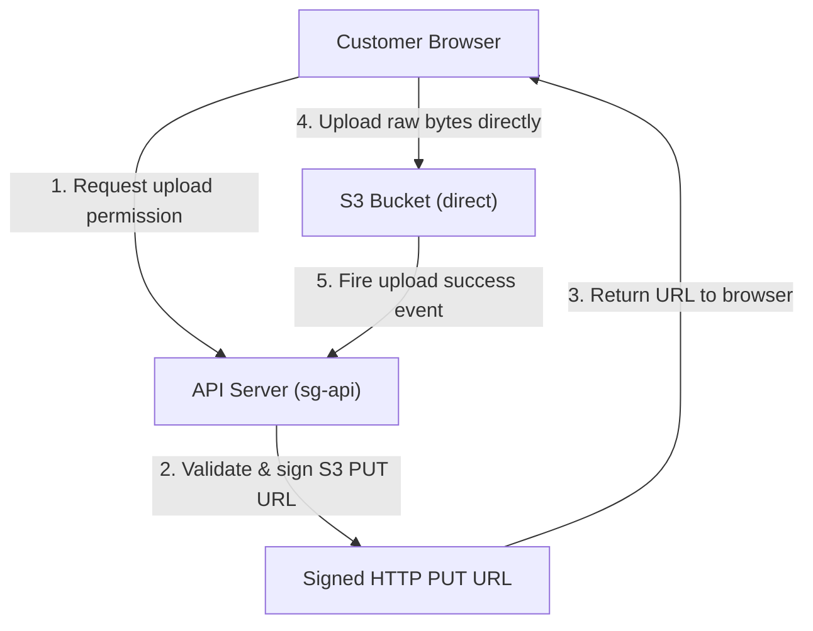

## Table of Contents

1. [Local Disk Limits to Regional Object APIs](#local-disk-limits-to-regional-object-apis)
2. [What Is S3](#what-is-s3)
3. [Buckets as Administrative Boundaries](#buckets-as-administrative-boundaries)
4. [Hashing Keys and the Flat Namespace Gotcha](#hashing-keys-and-the-flat-namespace-gotcha)
5. [Securing Files from Public Leakage](#securing-files-from-public-leakage)
6. [Defending Against Bugs with Object Versioning](#defending-against-bugs-with-object-versioning)
7. [Lifecycle Rules for Cost Containment](#lifecycle-rules-for-cost-containment)
8. [Chunks and Parallel Multipart Uploads](#chunks-and-parallel-multipart-uploads)
9. [Offloading Server Memory via Presigned URLs](#offloading-server-memory-via-presigned-urls)
10. [Putting It All Together](#putting-it-all-together)
11. [What's Next](#whats-next)

## Local Disk Limits to Regional Object APIs

When you build an application on your local machine, saving generated files is as simple as writing to a local folder. If your web API generates a customer receipt PDF or compiles a financial CSV report, your code calls standard filesystem commands to write the bytes directly to a local directory path. Because your application runs on a single, permanent system, those files remain accessible, safe, and immediately readable by your process.

Once you deploy your application to a regional cloud container environment, that simple local disk model breaks down completely. Cloud compute instances are transient. They are designed to scale out, scale in, and heal automatically from hardware crashes. If a container task is terminated during a deployment or replaced due to a host failure, any files written to its local root disk are permanently erased. Furthermore, when your application scales horizontally across multiple servers, a file written to the local disk of server A is completely invisible to server B, leaving users with broken download links.

To support transient compute, you must decouple file storage from server disks and move it to a regional, network-accessible object API. Amazon Simple Storage Service, commonly called S3, provides this decoupled boundary. Instead of executing local directory commands, your application communicates with S3 using standard web HTTP requests. S3 treats files as objects, automatically replicates your bytes across multiple separate datacenters within a Region, and exposes a globally accessible endpoint that ensures files outlive the servers that generated them.

## What Is S3

S3 stands for Simple Storage Service, and it is a massive, highly reliable cloud storage system built by AWS to store your files. The simplest way to understand S3 is as a giant, secure file cabinet hosted on the internet. Unlike your computer's local hard drive, which organizes data into complex partitions and directory paths, S3 treats every file as a single, complete unit. In S3, these files are called **objects**.

To manage your data, S3 relies on three core concepts:
* **Buckets**: You place your files inside named storage boxes called buckets, which act as the outer administrative, cost, and security containers.
* **Objects**: An object is the actual file itself, such as a customer receipt PDF, an image upload, or a CSV document.
* **Keys**: Every object inside a bucket is identified and retrieved by its exact text name, called the key, such as `invoices/order-417.pdf`.

Because S3 is cabled directly to the AWS cloud network, any application server or web browser can securely read or write a file by its exact key URL, provided it has been granted permission. S3 automatically replicates your files across multiple separate datacenter buildings in the Region, ensuring they survive outages and remain instantly available to thousands of concurrent application containers.

## Buckets as Administrative Boundaries

Before your application can write a single file to the regional S3 API, you must provision an administrative container called a bucket. When you create a bucket, you assign it a globally unique name that is registered across the entire AWS cloud network. Because this name forms the base URL for every file address, it cannot be changed after creation and must adhere to strict DNS naming rules.

A common beginner mistake is creating a separate bucket for every application subdirectory. A better operational habit is to define buckets strictly around administrative boundaries:

* **The Ownership Boundary**: You should group files by the engineering team or microservice responsible for managing them. Grouping files by ownership simplifies the application of cost-allocation tags, enables team-specific billing dashboards, and allows security teams to audit high-volume requests to pinpoint which workload generated the traffic.
* **The Environment Boundary**: You must establish a complete separation between production data, staging environments, and development sandboxes by placing them in entirely separate S3 buckets. Enforcing separate buckets prevents developer test scripts, local debugging sessions, or staging pipelines from accidentally overwriting or deleting live customer files.
* **The Access Boundary**: You must isolate static public assets like web images and CSS stylesheets from highly confidential internal documents like customer invoices, tax forms, or database snapshots. Segmenting files by access level allows you to keep S3 Block Public Access enabled globally on all sensitive buckets, completely eliminating the threat of accidental internet exposure.
* **The Lifecycle Boundary**: You should group files that share identical lifespans and retention requirements into their own dedicated buckets. For example, temporary logs that should expire after 14 days belong in a different container than business transaction records that must be retained for seven years. This alignment allows you to write simple, bucket-wide lifecycle rules that automate transitions to cold storage without the risk of accidentally purging critical historical archives.

## Hashing Keys and the Flat Namespace Gotcha

Once your bucket boundary is cabled, your application can write files by assigning each object a unique string identifier called a key. A key like `receipts/2026/05/order-1042.pdf` looks exactly like a traditional folder path to human eyes. In S3, however, directories do not exist. S3 is a flat key-value namespace, where the key is one long, flat string of characters, and the value is the raw binary data.

This flat structure introduces critical engineering gotchas that impact application performance and operational costs:

* **Directory Deletion Overhead**: Because directories are simulated, deleting a simulated folder in the S3 console is actually a massive batch job. The system must run a prefix scan to locate every single key starting with that prefix and issue individual delete API calls. For buckets with millions of objects, this operation can take hours and incur heavy request fees.
* **Rename Penalties**: In a standard local filesystem, renaming a directory is a fast pointer update. In S3, renaming a folder requires copying every single object key to a new key name and then deleting the old key name. This copy-and-delete sequence doubles your storage writes, consumes heavy network request allowances, and introduces eventual consistency delays.
* **Listing Bottlenecks**: S3 restricts list results to 1,000 objects per API call. If your code needs to search or query millions of objects dynamically, treating S3 as a queryable database index will cause your application to lag.

To build clean, performant systems, you must let S3 handle what it does best: storing and fetching raw bytes by exact key. Your application should maintain a primary index of S3 object keys inside a high-speed database like RDS or DynamoDB. When a user requests a file, your code queries the database for the exact key, and then calls S3 to retrieve the binary payload directly, bypassing simulated directory scans entirely.

## Securing Files from Public Leakage

Because S3 is an HTTP-based service cabled to the regional cloud network, securing access to your buckets is paramount. If you fail to configure precise permissions, you risk exposing confidential customer files to the public internet. S3 access is controlled using a double-layered security architecture:

* **IAM Workload Policies**: Define what an individual application server, container task, or developer identity is allowed to do. For example, a background billing server is granted permission to write receipts but is explicitly blocked from deleting them.
* **Bucket Policies**: Define rules attached directly to the bucket itself, governing who can call the bucket, from what network paths, and under what conditions. A robust bucket policy should explicitly deny any HTTP requests that do not utilize secure SSL/TLS connections.

To prevent accidental public exposure, AWS enforces a powerful administrative barrier: **S3 Block Public Access**. When enabled, this blockade overrides all other settings, completely blocking any attempts to apply public access control lists (ACLs) or public bucket policies. In modern cloud architecture, you should keep Block Public Access enabled globally across all buckets, bypassing it only for specific buckets built explicitly to serve static public web assets.

## Defending Against Bugs with Object Versioning

Securing the network path protects your files from external attackers, but it does not protect them from internal software bugs or developer mistakes. If your application code contains a bug that writes blank bytes to an existing S3 key, the old file is instantly overwritten and lost. S3 is designed to persist whatever you send it, meaning it will durably preserve your corrupted files.

To defend against destructive updates, you must enable **Object Versioning** on your bucket. When versioning is active, S3 does not replace existing bytes when a key is modified. Instead, it maintains a historical stack of objects under the same key name, assigning each copy a unique version ID. 

This stack architecture secures your data against common operational failures:

* **Accidental Overwrites**: If a background script writes corrupted data over a customer invoice, the older, clean version remains fully intact and restorable inside the version stack.
* **Accidental Deletions**: When a delete command is issued, S3 does not erase the historical data. Instead, it places a lightweight delete marker as the current version. The file appears deleted in normal listings, but you can recover it simply by deleting the delete marker.
* **Permanent Deletion Control**: To permanently erase a file, your request must specify the exact, immutable version ID. You can restrict this permission to administrator accounts or require hardware multi-factor authentication (MFA Delete) to authorize the request, rendering your historical stack immune to compromised runtime credentials.

## Lifecycle Rules for Cost Containment

While Object Versioning guarantees absolute data safety, it also introduces a significant billing trap. Because S3 preserves every historical version and every deleted file, your storage footprint will grow continuously. If your application overwrites temporary finance exports every hour, you will quickly accumulate thousands of hidden, noncurrent versions that continuously drive up your monthly AWS storage bill.

To prevent unexpected billing growth, you must pair versioning with **S3 Lifecycle Policies**. A lifecycle policy automates the transition and expiration of objects based on prefix paths, file age, and version state. A robust cost containment strategy organizes objects into distinct operational tiers:

* **The Transition Stage**: Automatically migrate objects that are accessed infrequently, such as billing receipts or compliance reports older than 90 days, from high-performance S3 Standard storage into cheaper cold tiers like S3 Glacier Flexible Retrieval or Glacier Deep Archive. While these archive tiers charge a fraction of the S3 Standard price per gigabyte, they introduce rehydration delays (ranging from minutes to hours) and fetch fees. Therefore, this transition stage should only be applied to objects where immediate read latency is no longer a business requirement.
* **The Expiration Stage**: Configure rules to permanently purge temporary, short-lived assets that hold zero business or compliance value after a specified age. For instance, nightly database exports, temporary zip archives, and cached API responses can be scheduled to expire automatically after 14 days. S3 deletes these objects asynchronously behind the scenes, completely removing their bytes from your storage totals and ensuring they no longer contribute to your monthly billing.
* **The Noncurrent Version Stage**: Design rules to clean up historical version stacks to prevent versioning safety features from doubling your storage footprint. While you may want to retain the active version of a customer profile document indefinitely, you can set a noncurrent version rule that automatically transitions older versions to Glacier after 30 days and permanently purges them after 90 days. This ensures that you maintain an emergency safety net without accumulating endless historical clutter.

## Chunks and Parallel Multipart Uploads

As your application grows, you will eventually need to handle large, multi-gigabyte files, such as raw database snapshots or massive media uploads. Sending these large files to S3 in a single HTTP PUT request is highly risky. If your application server is 99% complete with a 5GB upload and a minor network hiccup occurs, the entire connection is severed, forcing the transfer to restart from zero.

S3 resolves this reliability bottleneck by supporting **Multipart Uploads**. When initiated, the upload splits the large file into multiple smaller chunks (ranging from 5 megabytes up to 5 gigabytes) and streams them in parallel:

* **Resilience**: If a network interruption occurs while transferring a massive file, you do not have to restart the entire upload from the beginning. If only one 10MB chunk out of a 1GB file fails, your upload client simply retries that specific chunk. The other successfully uploaded parts remain stored in the S3 staging space, dramatically increasing the reliability of file transfers over unstable mobile or office connections.
* **Performance**: Uploading multiple parts concurrently allows your application to fully utilize its server's network bandwidth. Instead of uploading a large backup file sequentially on a single TCP thread, a multipart client can initiate ten parallel streams, multiplexing chunks across the network card to saturate the connection and cut transfer times by a factor of five.
* **Assembly**: Once all individual chunks are successfully written to S3, your application sends a final complete command. S3 then automatically and transactionally assembles all the parts into a single, cohesive object. This assembly happens instantaneously within the AWS network, and the assembled object immediately becomes available for GET reads.

Operating multipart uploads introduces a critical billing trap: if an upload is initiated but never completed or aborted, the uploaded chunks remain stored in S3 indefinitely, and AWS will charge you for the storage. To prevent this, always place a bucket lifecycle rule that automatically purges incomplete multipart uploads after 7 days.

## Offloading Server Memory via Presigned URLs

Even with parallel multipart uploads cabled, routing large user file transfers directly through your application API servers is a dangerous architectural mistake. When a user uploads a 500 megabyte file to your API server, the server must buffer those incoming bytes in system memory before writing them to S3. This memory buffering consumes valuable CPU cycles, exhausts server network bandwidth, and leaves your API servers highly vulnerable to denial-of-service memory crashes.

To protect your API servers, you must delegate secure upload permissions directly to the client's web browser using **Presigned URLs**:

* **Step 1: Authorization Request**: The client's web browser initiates the sequence by sending a lightweight JSON request to your API server, asking for permission to upload a file. This payload does not contain the file's binary bytes; it simply provides metadata such as the filename, MIME type, and exact file size in bytes, allowing the API server to perform instant validation.
* **Step 2: Sign the URL**: The API server validates the user's active session, verifies that their account is authorized to upload this file size, and generates a secure S3 object key (e.g. `uploads/2026/05/uuid.mp4`). The server then uses its own IAM execution role to sign a temporary HTTP PUT URL. This URL is cabled with a strict cryptographic signature and a short expiration window (such as 15 minutes), ensuring it cannot be tampered with or reused.
* **Step 3: Direct Upload**: The API server returns the generated presigned URL to the client browser. The browser then executes a direct HTTP PUT request, streaming the raw file bytes straight to the S3 bucket's regional endpoint. The entire transfer bypasses your application server completely, preventing large buffers from exhausting your CPU memory and allowing S3 to handle the network scaling.

Delegating the upload leg straight to S3 leverages S3's massive horizontal scale, keeping your application servers lightweight, highly responsive, and protected from memory exhaustion.

## Putting It All Together

Transitioning from local filesystem directories to regional object APIs secures your files against server lifecycle crashes and horizontal scaling errors:

* **S3 Decoupling**: Decouples unstructured file binaries from ephemeral compute nodes, delivering highly durable regional HTTP endpoints.
* **Flat Namespace**: Operates on flat character string keys, requiring a primary database index (RDS or DynamoDB) to coordinate fast file lookups and avoid simulated directory deletions.
* **Layered Permissions**: Secures confidential user files via IAM Workload roles, secure Bucket Policies, and global S3 Block Public Access overrides.
* **Versioning stack**: Safeguards critical data from destructive application overwrites and accidental deletions by maintaining historical version stacks.
* **Lifecycle Automation**: Restricts billing inflation by automating object transitions to cold Glacier tiers and purging noncurrent versions.
* **Egress Delegation**: Generates short-lived, cryptographically signed Presigned URLs to route heavy file streams directly from client browsers to S3, protecting server memory.

S3 is the baseline regional container for all unstructured files in AWS. By planning your keys, securing your network gates, and automating cleanup lifespans, you construct a durable file layer that scales dynamically, securely, and cost-effectively.

## What's Next

S3 is the premier home for complete, unstructured files. However, when application data consists of highly structural, relational records that require database transactions and complex tables, such as orders, line items, and customer accounts, a flat namespace will not suffice. In the next article, we will transition to managed relational databases in RDS.

---

**References**

- [Amazon S3 user guide](https://docs.aws.amazon.com/AmazonS3/latest/userguide/Welcome.html) - Compiles all S3 features, object limits, and durability guidelines.
- [Object key names](https://docs.aws.amazon.com/AmazonS3/latest/userguide/object-keys.html) - Explains flat character namespaces, folder simulations, and S3 prefix structures.
- [S3 Block Public Access](https://docs.aws.amazon.com/AmazonS3/latest/userguide/access-control-block-public-access.html) - Details the Block Public Access barrier and its priority overrides.
- [S3 Versioning concepts](https://docs.aws.amazon.com/AmazonS3/latest/userguide/Versioning.html) - Focuses on version IDs, delete marker behaviors, and historical file recovery.
- [Managing object lifecycles](https://docs.aws.amazon.com/AmazonS3/latest/userguide/object-lifecycle-mgmt.html) - Outlines transition and expiration actions for current and noncurrent versions.
- [Multipart upload overview](https://docs.aws.amazon.com/AmazonS3/latest/userguide/mpuoverview.html) - Details parallel chunk uploads, assembly commands, and incomplete chunk retention.
- [Presigned URLs](https://docs.aws.amazon.com/AmazonS3/latest/userguide/ShareObjectPreSignedURL.html) - Explains temporary credential delegation and direct client upload protocols.
