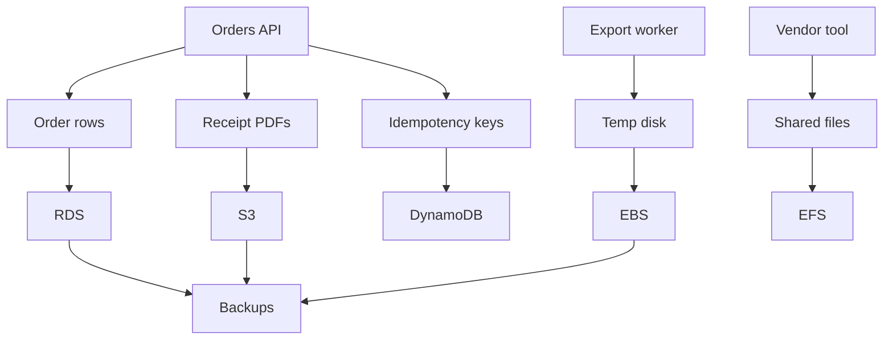

## Table of Contents

1. [The Problem](#the-problem)
2. [What Is Storage](#what-is-storage)
3. [Data Shapes](#data-shapes)
4. [Objects](#objects)
5. [Relational Data](#relational-data)
6. [Key-Value Data](#key-value-data)
7. [Attached Storage](#attached-storage)
8. [Recovery Copies](#recovery-copies)
9. [Sample Data Map](#sample-data-map)
10. [Putting It All Together](#putting-it-all-together)
11. [What's Next](#whats-next)

## The Problem

A team has an orders application that works on a laptop. The app writes rows into a local database, saves receipt PDFs to a folder, keeps temporary export files on disk, and records idempotency keys so a retry does not create the same order twice.

Moving that app to AWS turns "save the data" into several different questions:

- Receipt PDFs need a durable home where the app can store and fetch whole files by name.
- Orders, customers, and line items need relationships and transactions so checkout either commits correctly or does not commit.
- Idempotency keys need fast lookups by exact key and a safe way to claim work once.
- A legacy vendor tool expects a mounted directory, not an object API.
- The team needs recovery copies for mistakes, bad releases, and accidental deletion.

Those are not one storage problem. They are different data shapes. The quickest way to make a bad AWS data decision is to start with service names before you can describe the shape.

The working mental model is simple: describe what the data is doing, then choose the AWS storage service whose behavior matches that shape.

## What Is Storage

Storage is the durable place where application data survives beyond one process, container, instance, or request. It might store a file, a database row, a key-value item, a block device, a shared directory, or a backup copy.

That definition sounds broad because storage is broad. The useful beginner move is to stop asking "Which AWS storage service is best?" and ask a smaller question: what promise does this data need?

A receipt PDF needs object storage. The application usually writes the complete file, then reads it later by a bucket and key. An order needs relational storage because the data has relationships, constraints, and transactions. An idempotency key needs a key-value table because the app already knows the exact key it wants to claim. A mounted vendor directory needs file storage. A database volume or EC2 filesystem needs block storage. A recovery plan needs backups, snapshots, versioning, or retention rules.

AWS service names become much less intimidating when they attach to those promises:

| Data shape | Everyday example | AWS starting point | Main promise |
| --- | --- | --- | --- |
| Object | Receipt PDF, upload, export file | S3 | Store and retrieve whole objects by bucket and key |
| Relational data | Orders, customers, line items | RDS | SQL, transactions, constraints, managed database operations |
| Key-value item | Idempotency key, session, lookup record | DynamoDB | Fast access by known key and predictable access pattern |
| Block storage | EC2 data disk, database volume | EBS | Disk-like storage attached to compute in one Availability Zone |
| Shared file storage | Mounted directory used by many workers | EFS | NFS-style shared filesystem for Linux workloads |
| Recovery copy | Snapshot, version, restore point | Backups and retention | Recover from loss, corruption, or mistaken deletion |

The table is a starting point, not a law. Real systems often use several of these together. The point is to make each piece of data explain its own needs.

## Data Shapes

A data shape is the way the application naturally writes, reads, changes, and recovers the data. Shape matters more than format. A JSON document can belong in S3, DynamoDB, or RDS depending on how the app uses it.

Ask four questions before naming a service:

| Question | Why it matters |
| --- | --- |
| What is the unit? | Whole file, row, item, disk block, directory tree, or recovery point |
| How is it found? | Key, SQL query, path, mounted filesystem, or restore timestamp |
| How does it change? | Replace whole object, update row, conditional write, append file, snapshot |
| What must recovery prove? | Previous version, consistent database point, restorable disk, retained backup |

This prevents a common beginner mistake: treating storage services as interchangeable because they all "hold data." S3 can hold a JSON file, but it will not give you SQL joins. RDS can hold metadata about a file, but it is not where you want to stream large PDFs. DynamoDB can protect an idempotency key, but it will make you design around known access patterns instead of casual ad hoc queries.

The shape is the contract. The service is the implementation.

## Objects

Object storage is for data that the app treats as a whole thing. A profile image, receipt PDF, CSV export, backup artifact, static asset, or uploaded document usually has a name, bytes, metadata, access rules, and a lifecycle. The app does not update byte 482 in place. It writes or replaces an object.

Amazon S3 is the normal AWS home for that shape. An object lives in a bucket and has a key. The key may look like `receipts/2026/05/order-1042.pdf`, but that is still one object key, not a real folder path. Prefixes help humans and tools group objects, but the key is the identity.

Object storage has a gotcha that changes design. If the same key is written again, the current object can be replaced from the caller's point of view. Versioning can preserve prior versions, but it must be part of the bucket's safety design. A path-like key name alone does not protect old data.

S3 is the right first thought when the application says, "I need to store this complete file and fetch it later."

## Relational Data

Relational data is data whose meaning depends on relationships and rules. Orders have line items. Customers have addresses. Payments belong to checkouts. A checkout may need a transaction that writes several rows together or rolls back if one part fails.

Amazon RDS is the normal AWS starting point when that shape is SQL-shaped. RDS runs managed database engines such as PostgreSQL or MySQL so the team can focus on schema, queries, credentials, backups, upgrades, placement, and connection behavior instead of building database infrastructure from scratch.

The important word is not "database." DynamoDB is also a database. The important word is relational. If the app needs joins, constraints, transactions, migrations, and flexible SQL queries over related tables, RDS fits the way the data behaves.

RDS has its own gotcha. A database endpoint can be private and still unreachable if the application subnets, security groups, credentials, or connection limits are wrong. A relational database is both a data model and a networked service.

## Key-Value Data

Some application data is not naturally relational. The app already knows the exact key and wants the item behind it. An idempotency key, session token, user preference record, feature flag assignment, or job state record can often be read and written by a known key.

DynamoDB is the AWS service to consider for that key-shaped work. It stores items in tables and distributes them using primary keys. A partition key decides where data is stored. A sort key, when present, lets related items under the same partition key be ordered and queried together.

The main DynamoDB habit is to design from access patterns. A relational database lets you discover many query shapes later. DynamoDB rewards knowing the important questions early: "Get order by id," "claim idempotency key if missing," "list events for this order," or "find active cart by user id."

The non-obvious win is conditional writes. If checkout retries the same request, the app can attempt to create an idempotency record only if it does not already exist. That makes DynamoDB useful not just for storing state, but for protecting side effects.

## Attached Storage

Not every storage need is a database or object store. Some workloads need something that looks like a disk or filesystem to the operating system.

EBS is block storage for EC2. After an EBS volume is attached to an instance, the operating system can format it, mount it, and use it like a disk. That is useful for boot volumes, data volumes, and workloads that need disk-shaped storage close to one compute instance.

EFS is shared file storage for Linux workloads. Multiple compute resources can mount the same file system using NFS-style behavior. That fits tools that really need file paths, directories, and shared file operations across more than one runtime.

The decision between EBS, EFS, and S3 often comes down to the interface the application expects. A backup file that only needs to be stored and downloaded belongs in S3. A local database directory attached to one EC2 instance may use EBS. A vendor workflow where several workers need the same mounted tree may use EFS.

Attached storage has a gotcha: it can make compute and data lifecycles feel tangled. If the workload can use objects by key, S3 is often simpler than shared files. If the workload truly needs filesystem semantics, attached or shared storage may be honest.

## Recovery Copies

Storage design is incomplete until recovery is visible. The question is not only "Where does the data live?" It is also "What copy lets us recover when the data is changed, corrupted, or deleted?"

Different storage shapes create different recovery tools. S3 can use versioning and lifecycle rules. RDS can use automated backups, snapshots, and point-in-time recovery within its retention window. EBS can use snapshots. AWS Backup can help centralize backup plans and retention for supported resources.

Recovery copies should be planned around risk:

| Risk | Example | Useful protection |
| --- | --- | --- |
| Accidental overwrite | Receipt PDF replaced at same key | S3 versioning |
| Bad data change | Migration corrupts rows | RDS point-in-time recovery or snapshot restore |
| Lost disk | EC2 volume needs rebuild | EBS snapshot |
| Old data kept too long | Exports retained forever | Lifecycle and retention rules |
| Unsafe delete | Bucket or database removed too quickly | Review, retention, and deletion controls |

Backups are not magic if nobody has restored from them. A useful recovery design says what copy exists, how long it is retained, who can delete it, and how the team proves restore works.

## Sample Data Map

For the orders application, the data map might look like this:

The diagram is not trying to use every AWS storage service. It is showing that one application can have several data shapes at the same time. The mistake would be forcing all of them into one service because that feels simpler on day one.

The better habit is to name each data promise. Whole objects go to object storage. Related rows go to a relational database. Key-based state goes to a key-value table. Disk-shaped needs attach to compute. Shared file needs use a shared filesystem. Recovery copies protect the shapes that matter.

## Putting It All Together

The opening team did not have one storage problem. They had receipt PDFs, order rows, idempotency keys, temporary export files, vendor directories, and recovery needs.

S3 answers the whole-object question. RDS answers the relational transaction question. DynamoDB answers the known-key access question. EBS and EFS answer disk-shaped and shared-file questions. Backups, snapshots, versioning, and retention answer the recovery question.

That map also tells the team what to avoid. Do not put large generated files into a relational database just because the order row is there. Do not choose DynamoDB if the team has not described the access patterns. Do not choose EFS when workers can process independent S3 object keys. Do not call data safe until recovery copies and deletion behavior are part of the design.

Good AWS storage design starts with plain English: what is this data, how does it move, who needs it, how does it change, and what must be true when something goes wrong?

## What's Next

The next article starts with the most common object-shaped data service: S3. It explains buckets, keys, objects, access, versioning, lifecycle rules, multipart uploads, and presigned URLs through the everyday work of storing files and generated artifacts.

---

**References**

- [What is Amazon S3?](https://docs.aws.amazon.com/AmazonS3/latest/userguide/Welcome.html). Supports the object storage framing for S3 and its strong read-after-write consistency behavior.
- [Amazon Relational Database Service Documentation](https://aws.amazon.com/documentation-overview/relational-database-service/). Supports the RDS framing as a managed relational database service with automated backups and Multi-AZ options.
- [Core components of Amazon DynamoDB](https://docs.aws.amazon.com/amazondynamodb/latest/developerguide/HowItWorks.CoreComponents.html). Supports the DynamoDB explanation of tables, items, partition keys, and sort keys.
- [Amazon EBS volumes](https://docs.aws.amazon.com/ebs/latest/userguide/ebs-volumes.html). Supports the EBS explanation as block-level storage attached to EC2 instances.
- [Amazon EFS Documentation](https://aws.amazon.com/documentation-overview/efs/). Supports the EFS explanation as managed NFS shared file storage for Linux workloads.
- [AWS Backup Documentation](https://aws.amazon.com/documentation-overview/backup/). Supports the backup vault, retention, lifecycle, and centralized backup framing.
