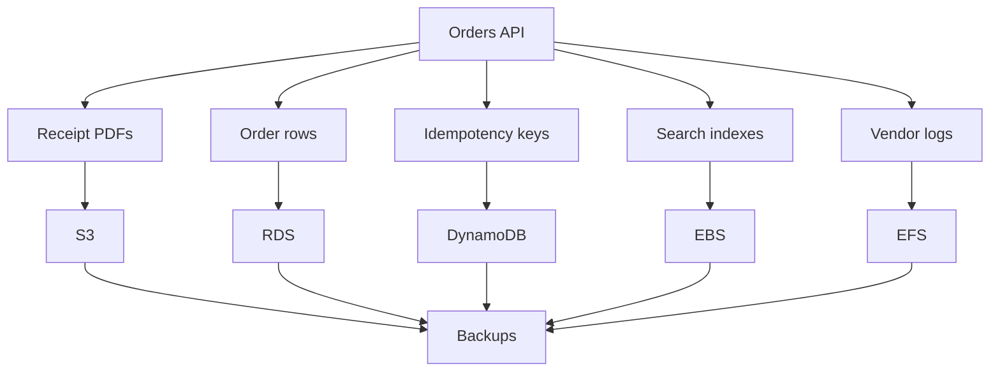

## Table of Contents

1. [Compute vs. Durable State in the Cloud](#compute-vs-durable-state-in-the-cloud)
2. [Data Shapes](#data-shapes)
3. [Objects](#objects)
4. [Relational Data](#relational-data)
5. [Key-Value Data](#key-value-data)
6. [Attached Storage](#attached-storage)
7. [Recovery Copies](#recovery-copies)
8. [Putting It All Together](#putting-it-all-together)
9. [What's Next](#whats-next)

## Compute vs. Durable State in the Cloud

In the previous networking and compute modules, we constructed a secure, regional cloud topology. We deployed application tasks inside private subnets, routed public requests through load balancers, and locked down workload interfaces using security groups. 

However, running application containers in this regional network introduces a fundamental operational conflict: the division between transient compute and durable state. Application servers and container tasks are built to scale and heal automatically. If a container crashes, a security group is modified, or an auto-scaling event occurs, the running task is terminated and instantly replaced by a fresh, blank copy. If your application code writes customer invoices, session lookups, or file uploads to the host's local root disk, that data is permanently lost upon termination. 

Durable storage must exist independently of ephemeral compute hosts as a highly available, networked service. The e-commerce orders application you are designing has multiple data requirements: checkout transactions must commit atomically, receipt PDFs must survive container replacements, session locks must resolve in milliseconds, and disaster recovery copies must remain immune to corrupted writes. To run securely in the cloud, you must stop treating storage as a simple disk path, and start mapping each of your application's data needs to its ideal cloud-native storage shape.

## Data Shapes

Choosing the right AWS home for application data becomes easier when you stop asking which storage service is best and start asking a smaller, more precise question: what is the shape of this data? A data shape is the way an application naturally writes, reads, modifies, and protects a specific set of records. Shape is determined by access behavior rather than file format. For example, a raw configuration file can live in a simple file bucket, a database table column, or a key-value row depending entirely on how your code needs to search and update it.

To identify a data shape before naming an AWS service, evaluate four core operational questions:

* **The Placement Unit**: You must decide whether the application writes and reads data as a whole, complete file, a highly structured table row, or a virtual hard drive. When storing user-generated files like receipt PDFs or images, the operating system treats them as complete, self-contained files. Databases, conversely, break data down into structured rows with strict formats. Application build systems or legacy software require raw virtual disk space plugged directly into the virtual server.
* **The Lookup Method**: You must determine how the application code searches for and retrieves records. If the app only fetches files by their exact name, searching by file path is the most direct path. If the business logic requires searching through columns, matching multiple tables together, or running complex search filters, a relational database is required to parse and execute your search queries. If the workload demands extreme-scale throughput, finding records by a single primary identifier bypasses the overhead of searching multiple related tables.
* **The Modification Style**: You must examine how the data changes over time. When your application updates a file in S3, the system does not alter a few characters in place; it overwrites the entire file at once. Relational databases require secure transactional boundaries, ensuring that updates to multiple tables either succeed completely together or roll back safely if an error occurs. Cache layers utilize fast, individual key updates to claim tokens without locking tables, while virtual servers write changes directly to virtual disks.
* **The Recovery Objective**: You must define what state must be restorable when software bugs, human mistakes, or accidental deletion events occur. File storage handles recovery by keeping a history of older file versions to undo individual deletions. Relational databases require continuous transaction log recording to support point-in-time recovery back to a precise second before an error occurred. Virtual servers rely on block-level incremental disk backups to reconstruct server systems, while compliance environments require locked vaults that prevent any deletion commands.

By answering these questions, you prevent a common cloud mistake: treating storage services as interchangeable because they all ultimately hold bytes. Forcing every data shape into a single service out of familiarity leads to severe scaling limits, high operational costs, and catastrophic security risks. The data shape acts as the contract; the AWS service is the physical implementation.

## Objects

Object storage is designed for data that the application treats as a whole, complete unit. A user profile image, a receipt PDF, a nightly financial spreadsheet export, an application log archive, or a software build artifact has an identity, binary contents, metadata, and access rules. The application does not update individual lines of these files in place. Instead, it writes or replaces the entire file, and later reads it back in full by its exact name.

Amazon Simple Storage Service, commonly called S3, is the default AWS home for this object shape. S3 does not use a traditional local directory interface. Instead of opening file handles, locking directories, or renaming folders, application servers interact with S3 using standard web API requests to write, read, list, and delete files.

Every S3 object is stored inside a named container called a bucket and is addressed using a unique string called an object key. A key like `receipts/2026/05/order-1042.pdf` looks like a directory path to human eyes, but in S3 it remains one flat string. Slashes simulate folders in the AWS console, but under the hood, there are no actual directories, which significantly changes how file search and prefix listings behave.

## Relational Data

Relational data is state whose meaning and correctness depend on strict rules, schemas, and relationships. An e-commerce checkout flow creates an order, several line items, a payment record, and a shipping address. These facts cannot exist in isolation. A line item is meaningless without an order header, and a customer should not be marked as billed if the system failed to record their purchase. The application needs absolute assurance that all these tables agree with each other at all times.

Amazon Relational Database Service, commonly referred to as RDS, is the managed home for this relational shape. RDS deploys and runs traditional databases like PostgreSQL or MySQL within a private cloud network. While RDS automates infrastructure tasks like server provisioning, security updates, and storage scaling, your team remains responsible for defining tables, indexing columns, managing schema migrations, and designing queries.

Relational storage relies on database transactions, ensuring that complex checkout steps either commit completely as a single unit or roll back entirely if a network error occurs. If your data correctness depends on matching keys across tables, strict data rules, and flexible queries that join tables together dynamically, RDS matches the way your data behaves.

## Key-Value Data

Some application data does not require database relationships or complex schema constraints. Instead, the application already knows the exact identity of the record it wants and needs to read or write it with sub-millisecond response times at extreme scale. An API security token, a user session cache, a feature flag setting, or an active shopping cart is key-shaped data. The application simply asks to get or set the value behind a specific key.

Amazon DynamoDB is the serverless AWS database designed for this key-value shape. Unlike relational databases that must parse complex queries and scan multiple tables, DynamoDB routes requests directly to physical storage partitions by matching the unique primary key. This ensures that query speed remains constant, whether your table holds ten rows or ten billion rows.

The core operational habit in key-value design is modeling around known access patterns. You must list every question your application needs to ask before creating the database table, as NoSQL databases do not support dynamic table joins. This model trades query flexibility for infinite horizontal scaling and predictable high-velocity performance.

## Attached Storage

Certain cloud workloads cannot communicate with databases or web APIs. Operating systems, search engines, legacy vendor applications, and build pipelines expect storage to behave like a physical disk drive or a shared network directory. These tools require standard operating system filesystem operations, including file locks, directory walking, file appends, and direct server mount paths.

Attached storage provides this local filesystem interface directly to compute hosts, split into two primary AWS services:
* **Amazon Elastic Block Store (EBS)**: This service provides raw virtual disk volumes that attach directly to a single running virtual server. EBS behaves exactly like a physical hard drive plugged into a server motherboard, delivering low-latency disk access. This makes EBS the ideal home for operating system boot drives, high-speed application caches, and raw database directories. However, EBS volumes are physically bound to a single Availability Zone and cannot be mounted across multiple separate servers or scaled horizontally across zones without manual snapshots.
* **Amazon Elastic File System (EFS)**: This service provides a managed, regional network directory. EFS supports standard operating system folder actions, including concurrent file locking, directory traversal, and raw appends. EFS can be mounted simultaneously by hundreds of virtual machines and container tasks across multiple Availability Zones in the Region. This regional scope makes EFS the correct choice for shared folders, collaborative processing jobs, and legacy vendor applications that expect a common, shared filesystem folder tree.

Choosing between EBS, EFS, and S3 comes down to the interface your application code expects. If the workload can fetch files by name via web APIs, S3 is simpler and cheaper. If it truly needs local disk blocks, use EBS. If multiple workers must read and write to the same shared directory path, use EFS.

## Recovery Copies

A storage architecture is incomplete until the data recovery path is fully designed. Data durability is not the same as data safety; a highly durable storage service will faithfully preserve a corrupted write or an accidental delete command. You must define what recovery copies exist, where they are stored, how long they are retained, and how you prove they actually work.

Different storage shapes require different recovery mechanisms:

* **Object Protection**: S3 manages recovery at the individual file key level. By enabling Object Versioning, the bucket maintains a historical stack of versions whenever a key is modified or overwritten. If a file is accidentally deleted, S3 appends a lightweight delete marker instead of purging data, allowing you to restore the file simply by deleting the marker. This protection must be paired with Lifecycle Policies to automatically purge old versions and contain monthly storage bills.
* **Relational Protection**: RDS Relational databases combine daily baseline backups with continuous transaction log recording. This logging architecture enables Point-in-Time Recovery. If a corrupting database script executes in production, this recovery allows you to provision a fresh database instance, restore the last clean baseline backup, and replay the logs up to the exact second before the corruption occurred, preventing catastrophic data loss.
* **Attached Disk Protection**: EBS virtual disks rely on block-level incremental snapshots. When a snapshot is initiated, only the virtual disk sectors that have changed since the previous backup are copied, minimizing storage fees. To guarantee consistency when backup commands run on active hosts, you must instruct the operating system to write all cached data from memory onto the disk before backups occur.
* **Centralized Coordination**: AWS Backup centralizes data protection policies across multiple distinct AWS resource types (EBS, RDS, EFS, DynamoDB) through a single dashboard. Instead of maintaining custom backup scripts, you define backup plans that automate backups based on resource tags (e.g. `BackupPlan=Production-Critical`). AWS Backup manages lifecycle rules, controls compliance audits, and secures snapshots inside protected vaults that can block accidental administrative deletion commands.

## Putting It All Together

Our e-commerce orders application did not have a single storage problem; it had a collection of distinct data shapes. By describing each shape's unit, access method, modification style, and recovery need, we map them directly to their ideal AWS implementations.

* **Receipt PDFs**: Represent whole, immutable files accessed by name, making S3 object buckets the correct economic and operational choice.
* **Order Transaction Rows**: Require relational schema enforcement and synchronous Multi-AZ ACID transactions, making RDS PostgreSQL or MySQL the natural fit.
* **Idempotency Keys**: Require sub-10ms key lookups and conditional writes to block duplicate API charges under heavy scale, making DynamoDB NoSQL the ideal choice.
* **Local Search Indices**: Require low-latency local disk block storage bound to a single compute server, making EBS block volumes the correct mounting interface.
* **Vendor Directory Trees**: Require a shared NFS directory mounted by multiple concurrent container tasks, making EFS network filesystems the correct choice.
* **Disaster Recovery**: Requires a unified backup plan, vaults, snapshot schedules, and point-in-time recovery points managed through AWS Backup.

The best engineering habit is to let each piece of data explain its own requirements before choosing a service name. Good storage design starts with plain English, mapping data promises to their correct cloud containers.

## What's Next

Now that we have established the overall data shape taxonomy, our next step is to examine the most common regional object container in the cloud: S3. In the next article, we will go deep into bucket architecture, key prefixes, private bucket security policies, lifecycle rules, large file uploads, and browser-safe direct upload delegation.

---

**References**

- [What is Amazon S3?](https://docs.aws.amazon.com/AmazonS3/latest/userguide/Welcome.html) - Details S3 object storage concepts, bucket limits, and regional data durability guarantees.
- [Amazon Relational Database Service](https://aws.amazon.com/rds/) - Outlines managed database engines, DB instance provisioning, and automated patch operations.
- [Amazon DynamoDB core components](https://docs.aws.amazon.com/amazondynamodb/latest/developerguide/HowItWorks.CoreComponents.html) - Explains DynamoDB partitions, key structures, serverless tables, and partition key routing mechanics.
- [Amazon EBS volumes](https://docs.aws.amazon.com/ebs/latest/userguide/ebs-volumes.html) - Details block-level virtual volumes, single-zone attachment rules, and SSD performance characteristics.
- [Amazon EFS features](https://docs.aws.amazon.com/efs/latest/ug/whatisefs.html) - Explains EFS elastic filesystems, NFSv4 protocol support, and multi-client regional mounting.
- [AWS Backup concepts](https://docs.aws.amazon.com/aws-backup/latest/devguide/whatisbackup.html) - Focuses on centralized backup schedules, backup plans, recovery points, and protected vaults.
