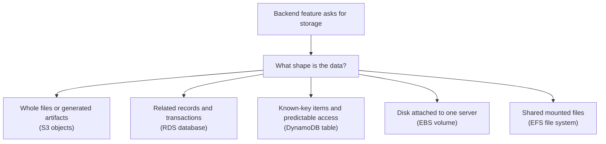

## Table of Contents

1. [Start With The Shape Of The Data](#start-with-the-shape-of-the-data)
2. [The Orders API Needs More Than One Kind Of Storage](#the-orders-api-needs-more-than-one-kind-of-storage)
3. [Files And Objects Point Toward S3](#files-and-objects-point-toward-s3)
4. [Relational Records Point Toward RDS](#relational-records-point-toward-rds)
5. [Key-Based Items Point Toward DynamoDB](#key-based-items-point-toward-dynamodb)
6. [Server Disks And Shared Files Point Toward EBS Or EFS](#server-disks-and-shared-files-point-toward-ebs-or-efs)
7. [The First Decision For A Backend Feature](#the-first-decision-for-a-backend-feature)
8. [When Checkout Fails, Find The Storage Layer](#when-checkout-fails-find-the-storage-layer)
9. [Common Failure Modes And Fix Directions](#common-failure-modes-and-fix-directions)
10. [The Tradeoffs You Are Really Choosing](#the-tradeoffs-you-are-really-choosing)

## Start With The Shape Of The Data

Most beginners meet AWS storage as a list of service names. S3. RDS. DynamoDB. EBS. EFS.

That list is useful later. It is not the best place to start. The better first question is simpler: what shape is the data?

Some data is a file. An invoice PDF is a file. A CSV export is a file. A product image is a file. You usually read or replace the whole thing. You do not ask it complicated questions like "which rows were created last week and have status paid?"

Some data is a set of related records. An order has a customer. An order has line items. A payment attempt belongs to an order. You want joins, transactions, constraints, and flexible queries. That shape points toward a relational database.

Some data is an item you fetch by a known key. An idempotency record says, "this checkout request already happened." A job-status record says, "export job `job_7a1` is still running." You usually know the exact key before you ask for the data. That shape points toward a key-value or document-style table.

Some data is the disk attached to a server. The operating system needs a boot disk. A worker may need scratch space while compressing a file. An EC2 instance may need a mounted filesystem path. That shape points toward block storage or a shared filesystem.

This article teaches the beginner mental model across five AWS families: Amazon S3 for objects, Amazon RDS for relational databases, Amazon DynamoDB for key-based items, Amazon EBS for server-attached block storage, and Amazon EFS for shared filesystems.

We will use one Node.js backend as the running example: `devpolaris-orders-api`. It handles checkout and order history. It stores order records. It writes export files. It may keep idempotency and job-status records. It may run supporting worker tasks.

The important lesson is not "always pick this service." The lesson is how to choose your first direction before the service details get loud.



Read that diagram from top to bottom. The AWS name comes after the plain-English shape. That order matters because service-first thinking makes every problem look like a product comparison. Shape-first thinking keeps you close to the actual backend feature.

Here is the same idea as a table you can keep in your head.

| Data shape | First AWS family to consider | Good fit in `devpolaris-orders-api` |
|------------|------------------------------|-------------------------------------|
| Whole file or generated artifact | S3 | Order exports like CSV or PDF |
| Related records with flexible queries | RDS | Orders, customers, payments, line items |
| Known-key item with predictable access | DynamoDB | Idempotency keys and job-status records |
| Disk for one server or task host | EBS | EC2 boot disk or worker scratch volume |
| Mounted files shared by more than one server | EFS | Shared processing directory for worker tasks |

This table is not a final architecture. It is your first sorting step. After that, you still check cost, access patterns, permissions, backups, recovery needs, and team experience. But you are no longer staring at five service names with no starting point.

## The Orders API Needs More Than One Kind Of Storage

Real backends rarely use one storage type for everything. That is normal. The mistake is forcing one service to do every job because it was the first service you learned.

Imagine the checkout path in `devpolaris-orders-api`. The user clicks "Place order." The API validates the cart, creates an order, records the payment state, and returns an order ID.

A simplified order record might look like this:

```json
{
  "orderId": "ord_2026_05_02_104233_8f2a",
  "customerId": "cus_9138",
  "status": "paid",
  "currency": "USD",
  "totalCents": 7499,
  "lineItems": [
    { "sku": "course-aws-foundations", "quantity": 1, "unitPriceCents": 7499 }
  ],
  "createdAt": "2026-05-02T10:42:33Z"
}
```

This looks like one JSON object, but the business problem behind it is relational. The team may ask: "show all paid orders for this customer." "show revenue by day." "find all orders with failed payment attempts." "make sure the payment and order status update together."

Those questions point toward SQL and a relational database. On AWS, the managed starting point is usually RDS.

Now imagine an admin clicks "Export April orders." The API does not want to store the whole CSV inside the `orders` table. That file may be large. The app may generate it once and let a user download it many times. The meaningful operation is "put this file somewhere durable and later fetch it by name."

That points toward S3. The object keys might look like this:

```text
orders-api/exports/2026/04/orders-2026-04.csv
orders-api/exports/2026/04/orders-2026-04.jsonl
orders-api/invoices/ord_2026_05_02_104233_8f2a/invoice.pdf
```

An S3 key is the object's name inside a bucket. It can contain slashes, which makes it look like a path. S3 still treats the object as one object identified by bucket and key.

Now imagine a customer double-clicks the checkout button or the browser retries the request. The backend needs to avoid creating two paid orders for one intent. The API can store an idempotency record. Idempotency means "repeat the same request safely and get the same result instead of doing the action twice."

That record might be small and key-based:

```json
{
  "pk": "IDEMPOTENCY#checkout_9d9f",
  "requestHash": "sha256:91fd4b...",
  "orderId": "ord_2026_05_02_104233_8f2a",
  "status": "completed",
  "createdAt": "2026-05-02T10:42:33Z"
}
```

The access pattern is predictable. The API knows the idempotency key at the moment the request arrives. It does not need a flexible report across every idempotency record. That can point toward DynamoDB.

Finally, supporting workers may need disk. A worker might download a month of order data, compress it, and upload the result. If that worker runs on EC2, the root disk or attached work disk is EBS. If several workers must see the same mounted directory, EFS enters the conversation.

The point is not that every orders API must use all five services. The point is that one backend can have several data shapes. Each shape deserves its own decision.

## Files And Objects Point Toward S3

S3 is object storage. Object storage means you store bytes as named objects inside buckets. A bucket is the container. A key is the object's name. The value is the object content, such as a CSV, PDF, image, JSON file, or backup artifact.

The reason S3 exists is that normal disks and databases are awkward places for application files. If you put generated exports on one server's local disk, a different server may not see them. If the server is replaced, the files may vanish unless you copied them somewhere else. If you put large files into a relational table, backups, queries, and application code can become harder to reason about.

For `devpolaris-orders-api`, S3 is a good mental fit for generated exports:

```text
Bucket: devpolaris-prod-orders-artifacts

Key: orders-api/exports/2026/05/orders-2026-05-02.csv
Key: orders-api/exports/2026/05/orders-2026-05-02-summary.json
Key: orders-api/invoices/ord_2026_05_02_104233_8f2a/invoice.pdf
```

The API writes the object. The database stores metadata about the export. The user downloads the object later.

That split keeps each system doing its natural job. The database answers questions like "which export belongs to this user?" S3 stores the file bytes.

A small metadata row in SQL could look like this:

```text
export_id: exp_2026_05_02_001
requested_by: admin_17
status: ready
s3_bucket: devpolaris-prod-orders-artifacts
s3_key: orders-api/exports/2026/05/orders-2026-05-02.csv
created_at: 2026-05-02T10:48:12Z
```

Notice what is not in that row. The CSV content is not there. Only the pointer is there.

This is one of the cleanest S3 patterns for backend developers: store the object in S3, store the business meaning in a database. S3 is not a relational database. You should not design a feature that needs flexible SQL-like questions by scattering thousands of tiny records into object keys and hoping the key names become a query language. S3 can list objects by key prefix, but prefix listing is not the same as asking relational questions.

If the feature needs to update one field in one record, S3 is usually the wrong first thought. With S3, you normally replace or write objects. With a database, you update rows or items.

When S3 fails in an app, the error often mentions the bucket, key, region, or permission. Here is a realistic application log:

```text
2026-05-02T10:49:03.221Z ERROR devpolaris-orders-api exportId=exp_2026_05_02_001
S3 PutObject failed bucket=devpolaris-prod-orders-artifacts
key=orders-api/exports/2026/05/orders-2026-05-02.csv
error=AccessDenied message="User is not authorized to perform: s3:PutObject"
```

That log tells you this is not a SQL query problem. The app reached the S3 path and AWS rejected the write. The next check is IAM permissions, bucket policy, encryption permissions if used, and whether the app is writing to the expected bucket.

S3's gift is durable object storage with simple names. The tradeoff is that S3 does not give you database semantics like joins, transactions across rows, or flexible record updates.

## Relational Records Point Toward RDS

RDS is AWS's managed relational database family. Relational means the data is organized into tables with rows and relationships. Managed means AWS handles many database operations around the database environment, while your team still owns schema design, queries, credentials, access, backups policy choices, and application behavior.

Relational databases exist because business data is rarely isolated. An order is connected to a customer. A payment attempt is connected to an order. A refund is connected to a payment. Reports need to ask questions across those relationships.

For `devpolaris-orders-api`, RDS is the natural starting point for the core order data. The shape might become tables like this:

| Table | What it stores | Common question |
|-------|----------------|-----------------|
| `orders` | One row per checkout order | What is the current status of this order? |
| `order_items` | One row per purchased item | Which products were in this order? |
| `payment_attempts` | One row per payment try | Did payment fail before it succeeded? |
| `order_exports` | One row per generated export | Where is the S3 object for this export? |

The important word is "question." SQL databases are good when the questions change over time. Today the product manager asks for paid orders by customer. Tomorrow finance asks for revenue by day. Next week support asks for failed payment attempts by payment provider.

SQL gives the team room to ask new questions without redesigning every primary key first.

A checkout write also needs consistency. Consistency means the database should not leave the app in a half-updated state. If the API marks an order paid but fails to record the payment attempt, support loses the reason. If it records the payment attempt but fails to create the order, the customer may be charged without a clear order record.

A relational transaction lets the app group related writes so they succeed or fail together. That is a strong reason to start with RDS for the core checkout record. A database connection problem looks very different from an S3 write problem. Here is the kind of log you might see from a Node.js API using PostgreSQL on RDS:

```text
2026-05-02T10:52:18.904Z ERROR devpolaris-orders-api requestId=req_7f3a checkout failed
component=orders-db host=devpolaris-prod-orders-db.abc123.eu-west-1.rds.amazonaws.com
error=ECONNREFUSED message="connect ECONNREFUSED 10.42.18.91:5432"
```

This log points to network path, database availability, security group rules, the database endpoint, or whether the app is using the right port. It does not point to S3 object keys. It does not point to DynamoDB conditional writes.

If the app connects but SQL fails, the signal changes:

```text
2026-05-02T10:53:44.118Z ERROR devpolaris-orders-api requestId=req_9c11
query=insert_order status=failed
sqlstate=23505 message="duplicate key value violates unique constraint orders_idempotency_key_key"
```

That is no longer a network problem. The app reached the database and the database protected a rule. Maybe the retry path is working. Maybe the API needs to return the existing order instead of treating the duplicate as a crash.

RDS's gift is query flexibility, relationships, and transaction semantics. The tradeoff is operational weight. You still think about connections, schema migrations, indexes, slow queries, backups, restores, and database access rules. Managed does not mean ownerless.

## Key-Based Items Point Toward DynamoDB

DynamoDB is AWS's managed key-value and document database. For a beginner, the simplest mental model is this: you design the table around the exact questions the app already knows how to ask.

That is different from RDS. With SQL, you can often ask new questions later by adding indexes or writing different queries. With DynamoDB, you get the best result when your access patterns are known and stable. An access pattern is a planned way the app reads or writes data, such as "get idempotency record by key" or "get job status by job ID."

In `devpolaris-orders-api`, idempotency is a good DynamoDB-shaped problem. At checkout time, the API receives an idempotency key. It wants to create a small record only if that key has not been used before. That "only if not already present" check is a conditional write.

The item might look like this:

```json
{
  "pk": "IDEMPOTENCY#checkout_9d9f",
  "requestHash": "sha256:91fd4b...",
  "status": "processing",
  "createdAt": "2026-05-02T10:42:30Z"
}
```

The write intent is simple: "create this item only if `pk` does not already exist." If another request tries to create the same key, a realistic failure can look like this:

```text
2026-05-02T10:42:31.019Z WARN devpolaris-orders-api requestId=req_retry_22
component=idempotency-table table=devpolaris-prod-order-requests
operation=PutItem condition="attribute_not_exists(pk)"
error=ConditionalCheckFailedException message="The conditional request failed"
```

That is not necessarily bad. In this case, the failure may be the safety feature. It means DynamoDB refused to create a second item with the same key because the condition was false. The app should now read the existing item and decide whether to return the existing order, wait for processing, or reject a mismatched request hash.

DynamoDB is also a reasonable fit for export job status. The admin UI may poll for one job ID:

```json
{
  "pk": "EXPORT_JOB#exp_2026_05_02_001",
  "status": "ready",
  "s3Key": "orders-api/exports/2026/05/orders-2026-05-02.csv",
  "updatedAt": "2026-05-02T10:49:30Z"
}
```

The access pattern is direct. Get job by ID. Update status by ID. Maybe list recent jobs for one admin if you model that access path.

The common beginner mistake is treating DynamoDB like "SQL but faster." That leads to pain. If the feature needs many ad hoc filters, joins between different entities, or reports with changing questions, DynamoDB is probably not the first place to reach.

DynamoDB's gift is predictable known-key access with managed scaling characteristics. The tradeoff is that you do more design up front around access patterns. You trade query flexibility for predictable reads and writes.

## Server Disks And Shared Files Point Toward EBS Or EFS

S3, RDS, and DynamoDB are services your app talks to over AWS APIs or database connections. EBS and EFS feel more like filesystems from the server's point of view. That difference matters.

EBS is block storage for EC2 instances. Block storage means the volume behaves like a disk device. After it is attached and mounted, the operating system can format it with a filesystem and use it like a hard drive.

For `devpolaris-orders-api`, EBS might appear even if the team never thinks about it directly. An EC2 instance has a root volume. A worker running on EC2 may have an extra mounted volume for temporary processing. A self-managed database on EC2 would use disks too, although beginners should understand the operational cost before going that route.

A disk check on an EC2 worker might look like this:

```bash
$ df -h /var/tmp/orders-export
Filesystem      Size  Used Avail Use% Mounted on
/dev/nvme1n1     80G   76G  4.0G  95% /var/tmp/orders-export
```

This output points to a disk capacity problem on the instance or attached volume. It does not say the RDS database is full. It does not say S3 rejected a file. It says the worker's mounted filesystem is almost out of room.

EFS is a shared filesystem. Multiple compute hosts can mount it and read or write files through a network filesystem protocol. That can be useful when several workers need the same mounted directory.

For example, suppose two export workers need to share intermediate files before one of them uploads a final result to S3:

```text
/mnt/orders-shared/exports/exp_2026_05_02_001/part-0001.jsonl
/mnt/orders-shared/exports/exp_2026_05_02_001/part-0002.jsonl
/mnt/orders-shared/exports/exp_2026_05_02_001/final.csv
```

That shape is a shared filesystem shape. It is not an object-storage key design yet. It is not a relational query. It is files under paths that more than one worker can see.

This does not mean EFS should be the default for every upload or export. If the file only needs to be stored and downloaded, S3 is often a cleaner first thought. If the app needs a shared POSIX-style filesystem path, EFS becomes more relevant. POSIX means the familiar Unix-like file behavior that programs expect from normal mounted filesystems, such as paths, directories, permissions, reads, and writes.

EBS's gift is server disk control. The tradeoff is that it is tied to compute placement and filesystem operations. EFS's gift is a shared mounted filesystem. The tradeoff is that you now operate around network filesystem behavior instead of simple object API calls.

## The First Decision For A Backend Feature

When a new backend feature asks for storage, do not start by asking, "which AWS service is best?" That question is too wide. Start with the work the data must do.

Here is a practical decision path for `devpolaris-orders-api`.

| Feature request | First question | Likely first direction |
|-----------------|----------------|------------------------|
| Store checkout orders | Do records relate and need transactions? | RDS |
| Generate monthly CSV exports | Is the result a whole file? | S3 |
| Prevent duplicate checkout retries | Do we know the exact key at request time? | DynamoDB or an RDS unique constraint |
| Track export job state | Is it fetched by one job ID? | DynamoDB or RDS |
| Give an EC2 worker scratch space | Does one host need a mounted disk? | EBS |
| Share files across worker hosts | Do several hosts need the same path? | EFS |

Notice two rows say "or." That is not weakness. It is honest engineering.

Idempotency can live in RDS if the checkout transaction already depends on RDS and a unique constraint gives the team the safety it needs. It can live in DynamoDB if the team wants a small known-key store that protects request creation before the SQL transaction begins. Job status can live in RDS if the team already needs relational reporting around exports. It can live in DynamoDB if the access pattern is mostly "get this job by ID" and "update this job by ID."

The question is not "which service is cooler?" The question is "which failure mode do I want to handle?" If the idempotency record is in RDS, a database outage may block both the order write and the duplicate-request check. That may be acceptable because checkout cannot proceed without the order database anyway.

If the idempotency record is in DynamoDB, the app has an extra dependency. That can protect one specific access pattern well, but it also gives checkout another service that can be misconfigured or unavailable. For a beginner, the safest starting rule is:

> Put core business records where you can query and protect relationships. Put files where objects belong. Put known-key control records where predictable access is enough.

That rule will not design every system. It will stop many early wrong turns.

## When Checkout Fails, Find The Storage Layer

When checkout fails, the fastest path is to identify which storage layer produced the first meaningful error. Do not start by changing random environment variables. Do not start by switching services. Read the signal.

Use the user-visible symptom to narrow the area:

| Symptom | First storage suspicion | What to inspect |
|---------|-------------------------|-----------------|
| Checkout cannot create an order | RDS or idempotency store | API logs, database connection errors, duplicate-key errors, DynamoDB condition failures |
| Checkout succeeds but invoice download fails | S3 | Object key, bucket permissions, object existence, signed URL creation |
| Admin export never leaves "processing" | DynamoDB, RDS, worker disk, or S3 | Job-status record, worker logs, local disk space, final object write |
| Worker crashes during export | EBS or EFS | `df -h`, mount state, filesystem permissions, worker logs |
| Only one task cannot read shared files | EFS or permissions | Mount target path, security group path, Linux user permissions |

The log line usually gives you the first branch. If you see this:

```text
error=AccessDenied action=s3:PutObject bucket=devpolaris-prod-orders-artifacts
```

Think S3 permissions or bucket policy. The app is trying to write an object and AWS is saying no. If you see this:

```text
error=ECONNREFUSED host=devpolaris-prod-orders-db.abc123.eu-west-1.rds.amazonaws.com port=5432
```

Think database network path, endpoint, port, database state, or security group. The app is trying to open a database connection and cannot. If you see this:

```text
error=ConditionalCheckFailedException condition="attribute_not_exists(pk)"
```

Think DynamoDB conditional write. Maybe the app is correctly blocking a duplicate request. The next move is to read the existing item, not to loosen permissions.

If you see this:

```text
error=ENOSPC syscall=write path=/var/tmp/orders-export/exp_2026_05_02_001/part-0042.jsonl
```

Think disk space on the mounted filesystem. `ENOSPC` means no space left on device. The next check is the worker host's filesystem, not the S3 bucket.

If you see this:

```text
error=EACCES syscall=open path=/mnt/orders-shared/exports/exp_2026_05_02_001/final.csv
```

Think filesystem permissions or mount configuration. The path begins with a mounted directory. The app cannot open the file with its current OS user permissions.

Good diagnosis is mostly translation. Translate the error into the data shape. Then inspect the matching service family.

## Common Failure Modes And Fix Directions

Storage failures are easier to handle when you can name the shape. Here are common beginner failure modes around the orders API and the direction of the fix.

| Failure signal | Likely layer | What it usually means | Fix direction |
|----------------|--------------|-----------------------|---------------|
| `AccessDenied` on `s3:PutObject` | S3 | App role cannot write that key or bucket | Fix IAM policy, bucket policy, or encryption permission |
| `NoSuchKey` when downloading invoice | S3 | Database points to an object key that is missing or wrong | Check object creation, key naming, and metadata write order |
| `ECONNREFUSED` to RDS endpoint | RDS | App cannot connect to database listener | Check endpoint, port, database state, subnet path, and security group |
| SQL duplicate-key error | RDS | A uniqueness rule blocked a second write | Treat as retry/idempotency case or fix key generation |
| Slow checkout during order write | RDS | Query, index, lock, or connection pool issue | Inspect slow query logs, indexes, locks, and pool settings |
| `ConditionalCheckFailedException` | DynamoDB | A conditional write did not pass | Read existing item and handle duplicate or stale state |
| Job status not found by ID | DynamoDB or RDS | Wrong key, wrong table, wrong environment, or missing write | Check key construction and environment config |
| `ENOSPC` on worker path | EBS or EFS | Mounted filesystem is full | Clean scratch files, resize storage, or stream work to S3 |
| `permission denied` on mounted path | EBS or EFS | OS user cannot read or write the path | Fix ownership, mode bits, mount options, or task user |

Two failure modes deserve extra attention. The first is a split write. That happens when the app writes to one storage system but fails before it updates the pointer in another. For example, the export worker uploads a CSV to S3 but crashes before updating the `order_exports` row in RDS. The file exists, but the UI still says the export is processing.

The fix direction is to make the state transition explicit. The worker should write the S3 object, verify the write result, then update the database status. If the database update fails, the worker should retry or a repair job should find ready objects without matching metadata.

The second is a wrong environment pointer. The app in production may point at the staging bucket, staging table, or staging database endpoint. The failure may not look like a clean crash. It may look like missing exports, missing job records, or data appearing in the wrong place.

The fix direction is boring but valuable: log the bucket, key, database host, table name, and AWS account or environment label at startup. Do not log secrets. Log names that help humans see where the app is pointed.

For example:

```text
2026-05-02T10:40:01.003Z INFO devpolaris-orders-api storage configuration
env=production
ordersDbHost=devpolaris-prod-orders-db.abc123.eu-west-1.rds.amazonaws.com
exportsBucket=devpolaris-prod-orders-artifacts
idempotencyTable=devpolaris-prod-order-requests
sharedWorkDir=/mnt/orders-shared
```

That startup log is not decoration. During an incident, it tells the engineer which storage systems the process believes it is using.

## The Tradeoffs You Are Really Choosing

Storage decisions are tradeoff decisions. You are not choosing a winner. You are choosing the set of problems you want to handle.

The first tradeoff is query flexibility versus predictable access. RDS gives you flexible SQL queries and relationship modeling. That helps when product questions change. The cost is that you must operate schema changes, indexes, connection pools, and query behavior carefully.

DynamoDB rewards predictable access. If the app knows the key, reads and writes can be simple to reason about. The cost is that unclear future queries are harder. You should design around access patterns instead of assuming you can ask any question later.

The second tradeoff is object durability versus database semantics. S3 is a natural home for generated files and artifacts. It gives the app a place to put bytes under a key. The cost is that an object is not a row in a transaction with your order table. If you need business state, store that state in a database and point to the object.

The third tradeoff is server disk control versus managed service operations. EBS gives an EC2 host disk-like storage. That is useful when software expects a mounted local filesystem. The cost is that you think about attachment, mounting, filesystem space, snapshots, and host placement.

EFS gives more than one host a shared filesystem path. That can simplify software that expects shared files. The cost is that a shared network filesystem has its own permissions, mount, latency, and throughput questions.

The fourth tradeoff is fewer dependencies versus sharper fit. Keeping orders, idempotency, export metadata, and job status in one RDS database may be easier for a small team. There are fewer services to configure and fewer places to check during an incident. But as access patterns become clearer, moving some known-key control records to DynamoDB or large artifacts to S3 can make the design cleaner.

For `devpolaris-orders-api`, a sensible first architecture might be:

| Data | First home | Why |
|------|------------|-----|
| Orders and payment attempts | RDS | Relationships, transactions, and reporting |
| Export CSV and invoice PDF files | S3 | Whole objects addressed by bucket and key |
| Export metadata | RDS | Business state and user-facing history |
| Idempotency records | RDS at first, DynamoDB when access pattern deserves it | Safety can start near the order transaction |
| Worker scratch files | EBS for one EC2 worker, EFS if shared paths are required | Depends on whether files are local or shared |

That is practical enough for a beginner team. It does not pretend one service solves every problem. It also does not split every small record into a separate managed service on day one.

When you design a backend feature, ask four questions before naming the AWS service:

1. Is this a whole file, a related record, a known-key item, a server disk, or a shared path?
2. Who reads it, and do they know the key or need flexible queries?
3. How does it change: replace the whole object, update one item, or commit several records together?
4. What failure would hurt most: lost file, duplicate order, slow query, full disk, or missing permission?
Those questions turn AWS storage from a product list into a design conversation. That is the mental model you need before the deeper service articles.

---

**References**

- [Amazon S3 objects overview](https://docs.aws.amazon.com/AmazonS3/latest/userguide/UsingObjects.html) - Explains buckets, object keys, object values, and version IDs, which are the core S3 mental model.
- [Amazon RDS DB instances](https://docs.aws.amazon.com/AmazonRDS/latest/UserGuide/Overview.DBInstance.html) - Defines an RDS DB instance and shows how RDS relates to normal SQL client access.
- [Using expressions in DynamoDB](https://docs.aws.amazon.com/amazondynamodb/latest/developerguide/Expressions.html) - Explains condition expressions, key condition expressions, and update expressions used for item-level logic.
- [DynamoDB condition expression CLI example](https://docs.aws.amazon.com/amazondynamodb/latest/developerguide/Expressions.ConditionExpressions.html) - Shows conditional writes and the `ConditionalCheckFailedException` pattern.
- [Amazon EBS volumes](https://docs.aws.amazon.com/ebs/latest/userguide/ebs-volumes.html) - Describes EBS as block-level storage attached to instances and explains where it fits.
- [How Amazon EFS works](https://docs.aws.amazon.com/efs/latest/ug/how-it-works.html) - Explains EFS as a shared file system that compute instances can mount through NFS.
