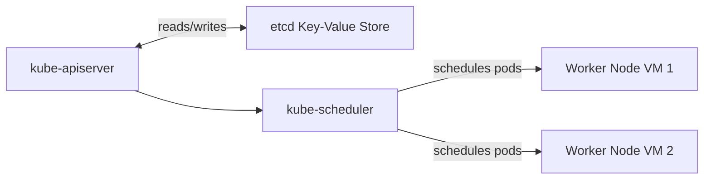
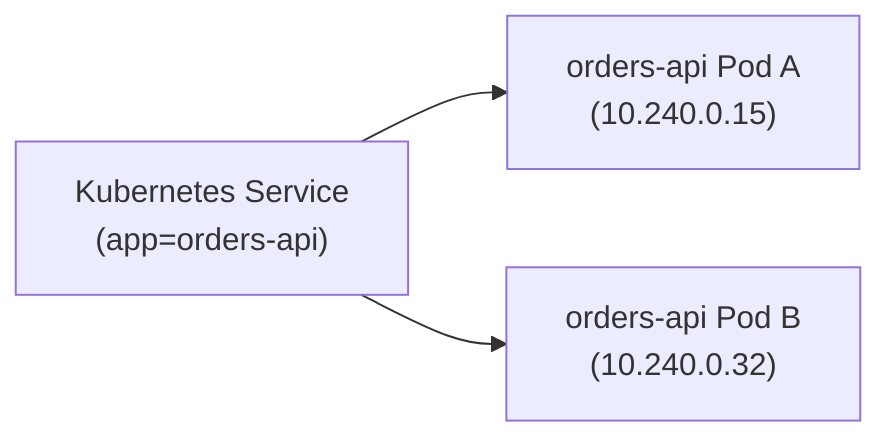
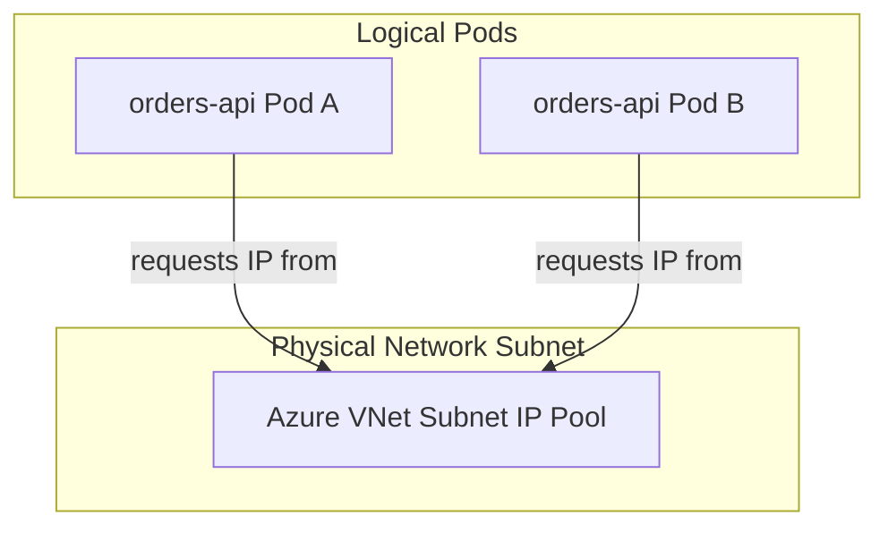

## Table of Contents

1. [What Is Azure Kubernetes Service](#what-is-azure-kubernetes-service)
2. [Control Plane](#control-plane)
3. [Node Pools](#node-pools)
4. [Pods](#pods)
5. [Deployments](#deployments)
6. [Services](#services)
7. [Ingress](#ingress)
8. [Identity](#identity)
9. [When AKS Fits](#when-aks-fits)
10. [Sample Cluster Shape](#sample-cluster-shape)
11. [Putting It All Together](#putting-it-all-together)

## What Is Azure Kubernetes Service

Azure Kubernetes Service (AKS) is a managed container orchestration platform that coordinates versioned container clusters in Azure. While Kubernetes provides a declarative API that describes how containers connect, scale, and update, operating a cluster introduces significant infrastructure overhead. AKS addresses this by separating the cluster management into a hosted control plane and dedicated worker node virtual machine pools.

:::expand[Under the Hood: Control Plane Management and Workload Identity Token Exchanges]{kind="design"}
Azure hosts and manages the control plane components (`kube-apiserver`, scheduler, `kube-controller-manager`, and the backing state store) in Azure-managed infrastructure. AKS pricing and support behavior depends on the cluster tier you choose, such as Free, Standard, or Premium. Production clusters should be designed with the tier, SLA requirement, region, and availability zone support in mind rather than assuming every control plane has the same availability promise.

Worker nodes run inside your own subscription, grouped in Virtual Machine Scale Sets (VMSS) managed by the AKS resource provider. They boot with customized Azure-Linux or Ubuntu VM images pre-configured with `containerd` (container runtime), `kubelet` (node agent), and `kube-proxy` (network router).

Workload Identity utilizes OpenID Connect (OIDC) federation between your cluster and Microsoft Entra ID. The OIDC token exchange sequence is described in detail in the Identity section below.
:::

If you run Kubernetes on AWS, AKS is cabled directly to Amazon EKS. Both provide a managed control plane and delegate worker VM node pools to your subscription. However, their networking and identity configurations reflect their respective clouds. While AWS EKS relies on the AWS VPC CNI (allocating native AWS private IPs to all pods) and IAM Roles for Service Accounts (IRSA), AKS supports Azure CNI (Overlay or native modes) and leverages Microsoft Entra Workload Identity federated OIDC trusts.

The platform executes your declarative YAML manifests. If a deployment fails because of resource constraints, a service selector mismatches, or an ingress controller cannot route packets, your primary troubleshooting path is querying the Kubernetes API using `kubectl` commands and inspecting cluster events.

| Primitive Name | Functional Role inside AKS |
| --- | --- |
| Control Plane | Hosted Kubernetes management APIs (`kube-apiserver`, scheduler, `etcd` database) |
| Node Pool | A VMSS VM group hosting application pods, sharing the same VM size and network subnet |
| Namespace | A logical virtual cluster boundary within the physical cluster, enabling team isolation |
| Pod | The smallest deployable runtime unit, wrapping one or more co-located application containers |
| Deployment | The declarative state engine defining pod replica counts and rolling update patterns |
| Service | A stable network endpoint selector providing load-balanced internal DNS to dynamic pods |
| Ingress Resource | The HTTP/HTTPS path routing rules handled by a designated ingress controller proxy |
| Workload Identity | Cryptographic pod-level Entra ID token exchanges utilizing OIDC federation |

## Control Plane

The managed control plane is the coordination layer that isolates your cluster operations. When you interact with AKS using administrative tools, you call the API server endpoint exposed by Azure. The control plane processes your request, validates authorization rules, writes the updated state to the `etcd` database, and triggers control loops to schedule workloads.

Because the control plane is hosted by Azure, your team is completely relieved of manual `etcd` administration, API server backup configurations, and control plane certificate rotation. However, you must still configure control plane security boundaries. Production clusters must restrict API server access by enabling private cluster modes (which hide the API endpoint from the public internet) or establishing authorized IP address ranges.

You must also manage cluster upgrades. Kubernetes regularly deprecates old API versions and rolls out security updates. While AKS simplifies updates by providing single-command node pool upgrades, your team must verify manifest compatibility and plan progressive node recycles to ensure zero downtime during cluster upgrades.

## Node Pools

Node Pools represent the worker VM capacity where your pods run. Every node pool maps directly to an Azure Virtual Machine Scale Set (VMSS) running in a specialized infrastructure resource group.


*Node pools are the capacity lanes where Kubernetes places pods, so pool sizing affects cost, scale, and scheduling.*

AKS divides pools into two functional roles:
* **System Node Pools**: Dedicated to hosting critical cluster system pods, such as CoreDNS and other required cluster add-ons. System node pools must run Linux and must maintain enough healthy capacity to keep the cluster operational. Ingress controllers can run on system or user pools depending on how your platform team designs scheduling, taints, and isolation.
* **User Node Pools**: Dedicated to hosting your application workloads. You can provision multiple user node pools with specialized VM SKUs (such as GPU-enabled VMs for machine learning, memory-optimized VMs for caches, or Windows Server VMs for legacy legacy code).

Workload scheduling is governed by CPU and memory requests defined in your pod manifests. When a pod is deployed, the control plane scheduler checks the node pools to locate a VM with sufficient unreserved RAM and CPU. If no node has enough capacity, the pod remains in a `Pending` state. To prevent this, enable the AKS Cluster Autoscaler, which automatically monitors pending pods and asks Azure to add new VM nodes to the backing scale set when capacity is needed.

:::expand[Pending Pods from Undersized Node Pool SKU]{kind="pitfall"}
A common Kubernetes scheduling failure occurs when a pod specifies a CPU or memory request that exceeds the physically allocatable capacity of every available VM SKU in your node pool. The pod will sit in a `Pending` state indefinitely. The Cluster Autoscaler detects the pending status and attempts to help, but it can only provision more nodes of the same VM SKU. Since the new nodes are identical in size to the existing ones, they also cannot satisfy the pod's resource request, leaving the autoscaler stuck in a loop of spinning up useless VMs.

This matches the behavior of **Amazon EKS**, where setting resource requests larger than the EC2 instance's allocatable size leaves Pods `Pending` and triggers the AWS Auto Scaling Group (ASG) or Cluster Autoscaler to repeatedly provision identical, useless instances. This waste of compute continues until you upgrade the node group SKU or leverage Karpenter to dynamically provision a larger instance size.

To diagnose this in AKS, run `kubectl get pods` to identify the `Pending` state, then run:
```bash
kubectl describe pod <pod-name>
```
Look for `FailedScheduling` with an event message like: `0/3 nodes are available: 3 Insufficient memory.`

Consider this resource manifest correction:

*   **Before (The Undersized Request):** Requesting 14 GiB memory on a pool using `Standard_D4s_v3` VMs (which have 16 GB total RAM, but only ~12.8 GB allocatable after OS, kubelet, and system reservations):
    ```yaml
    resources:
      requests:
        memory: "14Gi" # Exceeds the 12.8 GiB allocatable ceiling
    ```
*   **After (Right-Sized Request):** Lower the pod request to fit within the node's allocatable boundary, or provision a new user node pool using `Standard_D8s_v3` VMs (32 GB RAM):
    ```yaml
    resources:
      requests:
        memory: "10Gi" # Fits comfortably within the allocatable limit
    ```

**Rule of thumb:** Never set a pod's resource requests based on a VM SKU's total advertised RAM. Run `kubectl describe node` to inspect the actual `Allocatable` CPU and memory values—which are typically 1–2 GB less than physical RAM due to system reservations—before committing pod limits.
:::

## Pods

A pod is the atomic scheduling unit in Kubernetes. A pod hosts one or more containers that share the exact same network namespace, loopback interface, IP address, port range, and local storage volumes.

Inside the worker node VM, the host container runtime (`containerd`) allocates a single network namespace block for the pod. Any container running inside that pod can communicate with other containers in the same pod over `localhost`. However, this co-location means that containers in the same pod must not attempt to bind to the same network port, as this creates port collisions inside the pod's namespace.

Pods are fully ephemeral and replaceable. If a physical VM node loses network connectivity, or if the hypervisor deallocates the host blade, the control plane scheduler immediately marks the node degraded. It terminates the active pods on the failing node and schedules identical replacement pods on healthy nodes. Because pods are constantly created and destroyed with changing private IP addresses, never store durable files inside a pod and never rely on a pod's temporary IP as a stable connection address.

## Deployments

A Deployment is the controller resource that manages the lifecycle of your pods. It describes your desired state (such as running 5 replicas of the checkout API using image version `v2`) and instructs the control plane's deployment controller to enforce that state.

When you deploy an updated configuration, the controller executes a rolling update. It does not terminate all running pods simultaneously, which would cause immediate downtime. Instead, it creates a new ReplicaSet pointing to the new container image, spins up new pods, and waits for their readiness probes to return success. Once a new pod is warm and healthy, the controller terminates one old pod, shifting traffic progressively until the entire pool runs the new version.







To ensure this rolling update is safe, you must configure robust Liveness and Readiness probes in your deployment manifest. The Liveness probe tells the `kubelet` when to restart a crashed container. The Readiness probe tells the deployment controller when the container is ready to accept HTTP traffic. If you omit the readiness probe, Kubernetes will immediately route public traffic to new pods before they parse configuration or initialize database connection pools, causing immediate request failures.

## Services

A Service is the network abstraction that provides a stable, long-lived network interface for a dynamic, changing set of pods. Because pods are constantly replaced during rolling updates and autoscaling events, their IP addresses are volatile. A Service maps a stable virtual IP and internal DNS name (such as `http://orders-api.production.svc.cluster.local`) to your pods.

Under the hood, a Service uses selectors to target pods with specific labels (such as `app: orders-api`). The control plane constantly monitors active pod IPs matching this selector and writes them to an internal resource called Endpoints.

The actual packet routing is executed at the node level by `kube-proxy`. Every time the Endpoints list changes, `kube-proxy` updates the local `iptables` or IPVS routing tables in the node's Linux kernel. When an application pod calls the service's virtual IP, the node kernel intercepts the packet at the socket layer and redirects it directly to one of the healthy pod IPs, bypassing high-overhead application proxies and ensuring fast, kernel-level load balancing.

## Ingress

Ingress is the API layer that manages external HTTP/HTTPS routing into your cluster. While a Service load-balances traffic internally, an Ingress resource defines the public routing rules (such as mapping `api.devpolaris.com/orders` to the `orders-service` on port `80`).


*AKS traffic reaches pods through stable service routing instead of relying on changing pod IPs directly.*

To execute these rules, you must run an Ingress Controller (such as the NGINX Ingress Controller or Azure Application Gateway Ingress Controller) in your cluster. The Ingress Controller runs as a reverse-proxy deployment in your User Node Pool. When you create an Ingress resource, the controller parses the host and path rules and dynamically updates its configuration tables.

The public path depends on the ingress controller you choose. With an in-cluster controller such as NGINX Ingress, an Azure Load Balancer can forward traffic to ingress controller pods, and those pods route requests to Kubernetes Services. With Application Gateway Ingress Controller, Application Gateway becomes the regional Layer 7 entry point and is configured from Kubernetes resources. In both designs, the important operational habit is to trace the request through the Azure public entry, the ingress controller, the Kubernetes Service, and the selected pod endpoints.

## Identity

AKS handles security authorization at multiple layers. Workloads running inside pods frequently need to access Azure PaaS resources (such as Key Vault, Storage Accounts, or Cosmos DB). To secure this access without using static passwords, configure Microsoft Entra Workload Identity.

Workload Identity utilizes OpenID Connect (OIDC) federation between your AKS cluster and Microsoft Entra ID. The step-by-step cryptographic exchange operates as follows:
1. When a pod is scheduled, the AKS control plane mounts a local Kubernetes Service Account token (which is a cryptographically signed JSON Web Token) into the pod's file system and injects specialized environment variables.
2. When the application code utilizes the Azure SDK (e.g., `DefaultAzureCredential`), the SDK reads the local token from the mount path and sends it to the Entra ID security token service (STS).
3. Entra ID receives the token and calls the OIDC issuer endpoint of your AKS cluster to fetch the cluster's public cryptographic keys.
4. Entra ID validates the cluster's signature on the token. It then checks the configured federated credential trust to verify that the target namespace and service account name are authorized.
5. Entra ID returns a valid Entra access token to the pod, which the application code uses to query protected Azure PaaS services, ensuring passwordless security.

## When AKS Fits

Azure Kubernetes Service is a highly powerful hosting platform, but it is not a default solution for all workloads. It is a complex ecosystem that requires dedicated engineering time to secure, patch, and monitor.

AKS is the correct choice when your organization fits these criteria:
* You manage dozens of microservices that must scale independently and require complex, inter-service network communication rules.
* Your engineering pipelines are standardized on Kubernetes tooling (such as Helm, ArgoCD, or Prometheus) to maintain multi-cloud compatibility.
* You have a dedicated platform engineering team capable of managing cluster upgrades, network policies, node configurations, and workspace security boundaries.

If your primary goal is to deploy a few containerized web APIs, Azure Container Apps (ACA) or App Service provides the benefits of managed container hosting, scaling, and private networking without the significant administrative overhead of managing Kubernetes nodes, namespaces, and ingress controllers.

## Sample Cluster Shape

To organize your cluster configurations during architectural reviews, document a stable profile of your cluster topography. This profile maps logical Kubernetes resources to physical Azure infrastructure resources.

| Cluster Layer | Current Configuration | Physical Resource |
| --- | --- | --- |
| AKS Cluster | `aks-orders-prod-eus` | Managed Control Plane |
| System Node Pool | `system-d4s` (2 Nodes) | VMSS running `Standard_D4s_v5` VMs |
| User Node Pool | `apps-d8s` (3 Nodes, autoscale to 10) | VMSS running `Standard_D8s_v5` VMs |
| Namespace | `orders-prod` | Logical virtual boundary |
| Deployment | `orders-api` (5 replicas) | containerd pods scheduled on User VMs |
| Service | `orders-api-service` (Internal ClusterIP) | iptables kernel updates managed by kube-proxy |
| Ingress Edge | `api.devpolaris.com` | Azure Load Balancer cabled to Ingress VMSS |
| Workload Identity | `orders-api-sa` (OIDC federated) | Entra ID Trust Principal |

This profile helps systems engineers trace the path of a request from the public edge load balancer down to the container runtime socket executing on a physical VMSS worker node in your virtual network subnet.

## Putting It All Together

Azure Kubernetes Service provides enterprise-scale container orchestration by dividing administrative layers systematically.

* **Managed Control Plane**: Azure hosts the core API server and control plane components, with availability and support characteristics tied to the selected AKS tier and regional design.
* **Worker Node VMSS**: Application containers run on physical VM worker nodes grouped in scale sets. Runtimes are orchestrated by the local `kubelet` communicating with `containerd`.
* **Stable Service Routing**: Kubernetes Services provide stable IP endpoints for volatile, changing pods, utilizing `kube-proxy` to configure high-speed kernel routing tables at the socket level.
* **OIDC Workload Identity**: Secure Entra ID access is managed via OIDC token federation. Pod service account tokens are cryptographically verified by Entra ID, ensuring passwordless connections.

By deploying your workloads inside organized namespaces and managing deployments, services, and workload identities systematically, you can build resilient, highly available container platforms.


*Use this as the AKS layer map: Azure manages the control plane, platform teams manage node pools and cluster integrations, and applications arrive as pods, deployments, services, and ingress rules.*


---

**References**

- [Azure Kubernetes Service (AKS) Introduction](https://learn.microsoft.com/en-us/aks/intro-kubernetes) - Official overview of AKS cluster structures.
- [AKS Core Concepts](https://learn.microsoft.com/en-us/aks/concepts-clusters-workloads) - Technical guide to Kubernetes nodes, pods, and deployments.
- [Microsoft Entra Workload Identity](https://learn.microsoft.com/en-us/aks/workload-identity-overview) - Documentation covering OIDC token federation and passwordless Entra ID setups.
- [AKS Network Routing Options](https://learn.microsoft.com/en-us/aks/concepts-network) - Technical comparison of Kubenet, Azure CNI, and Azure CNI Overlay networks.
