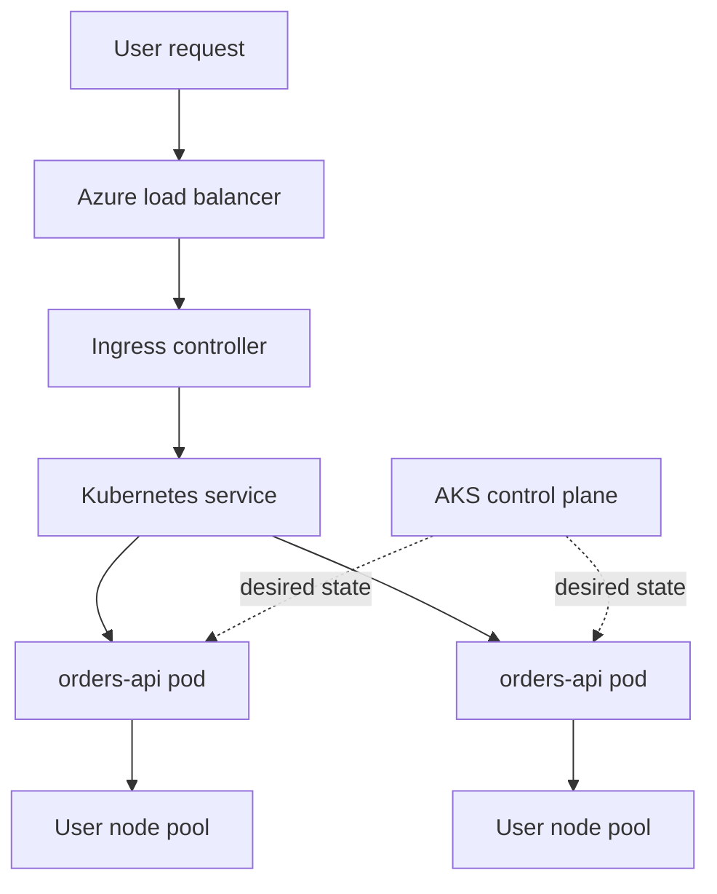

## Table of Contents

1. [The Problem](#the-problem)
2. [What Is AKS](#what-is-aks)
3. [Control Plane](#control-plane)
4. [Node Pools](#node-pools)
5. [Pods](#pods)
6. [Deployments](#deployments)
7. [Services](#services)
8. [Ingress](#ingress)
9. [Identity](#identity)
10. [When AKS Fits](#when-aks-fits)
11. [Sample Cluster Shape](#sample-cluster-shape)
12. [Putting It All Together](#putting-it-all-together)

## The Problem

The checkout team can run one containerized API in Container Apps. That does not automatically mean it needs Kubernetes. A single service with simple ingress and a few scale rules can be happier on a smaller managed runtime.

The question changes when the organization already has a Kubernetes platform:

- Ten services deploy through Helm charts and shared rollout rules.
- Platform engineers own ingress controllers, certificate automation, policy, and observability add-ons.
- Some workloads need different node sizes, operating systems, or isolation boundaries.
- Developers already describe services as pods, deployments, services, config maps, secrets, and ingress resources.
- The team wants the Kubernetes API to be the common control plane across environments.

At that point, AKS may be the right Azure compute choice. Not because Kubernetes is more advanced, but because Kubernetes is the operating model the team is choosing.

## What Is AKS

Azure Kubernetes Service, or AKS, is Azure's managed Kubernetes service. Kubernetes is an open-source platform for deploying, scaling, and managing containerized applications. AKS gives you a Kubernetes cluster on Azure and manages much of the control plane so your team can focus more on workloads and cluster operations.

The key phrase is "managed Kubernetes," not "managed application." AKS reduces the burden of running the Kubernetes control plane, but your team still works with Kubernetes objects, worker nodes, networking, identity, upgrades, security, logs, and add-ons.

If you know AWS, AKS belongs in the same broad mental bucket as EKS. Both give you managed Kubernetes control planes in their cloud. The useful comparison stops there. Azure networking, identity, node images, add-ons, and operational defaults are their own system.

The beginner map looks like this:

| AKS noun | What it means |
| --- | --- |
| Cluster | The Kubernetes environment where workloads are scheduled and managed. |
| Control plane | The Kubernetes brain that stores desired state and coordinates the cluster. |
| Node pool | A group of worker VMs with the same configuration. |
| Pod | The smallest deployable workload unit. |
| Deployment | The desired version and replica count for pods. |
| Service | A stable network name for pods that change over time. |
| Ingress | HTTP entry that routes outside traffic to services. |
| Identity | The way cluster components and workloads call Azure APIs safely. |

AKS is a good choice only when these nouns are a benefit. If they are just new words around one simple container, the team is probably adding an operating layer it does not need yet.

## Control Plane

The Kubernetes control plane is the coordination layer. It exposes the Kubernetes API, stores cluster state, schedules pods, and runs controllers that move the real world toward the desired state you describe.

In AKS, Azure manages the control plane components. That is a major operational reduction compared with building Kubernetes from raw VMs. Your team does not normally SSH into a control plane VM and repair `etcd` by hand.

But a managed control plane still needs operational choices. You choose cluster mode and configuration, supported Kubernetes versions, upgrade timing, API access, networking model, and which add-ons or controllers the cluster uses. You also need to understand the difference between "the control plane accepted my manifest" and "the workload is healthy." Kubernetes can store desired state even while pods fail to start.

## Node Pools

Nodes are the worker machines where application pods run. In AKS, nodes are Azure VMs. Node pools group nodes with the same configuration, such as VM size, operating system, labels, taints, and scaling behavior.

Node pools are where Kubernetes meets Azure compute cost and capacity. A pod asks for CPU and memory. The scheduler places it on a node that has room and satisfies its constraints. If the node pool is too small, the pod may wait. If the node pool is too large, the cluster costs more than it needs to.

Many clusters use at least two kinds of pools. A system node pool hosts critical system pods. User node pools host application workloads. More advanced clusters add specialized pools for GPU jobs, memory-heavy services, Windows containers, or isolated workloads.

The practical question asks which kind of worker machines the pods should use and who pays for idle capacity.

## Pods

A pod is the smallest deployable unit in Kubernetes. It usually contains one application container, though it can contain multiple tightly coupled containers that share networking and storage.

The pod matters because Kubernetes does not schedule a naked container. It schedules pods. A pod has resource requests and limits, environment variables, mounted secrets, health probes, and a lifecycle. When a pod dies, Kubernetes can create another pod to match the desired state.

Pods are replaceable. That is the mental shift. Do not store important local state inside a pod and expect it to survive. Do not depend on a pod name as a stable address. Design the application so a new pod can replace an old one.

## Deployments

A deployment describes the desired state for a set of pods. It says which container image should run, how many replicas should exist, and how Kubernetes should roll from one version to another.

This gives AKS a different release model than a single VM. You do not log into a server and replace a process manually. You update the deployment, and Kubernetes creates new pods, checks health probes, shifts replicas, and removes old pods according to the rollout settings.

The power is real, and so is the responsibility. A bad readiness probe can send traffic to pods that are not ready. Missing resource requests can pack too many pods onto a node. A mutable image tag can make it unclear what a deployment actually ran. Kubernetes gives you a control loop. The team must give it good desired state.

## Services

A service gives a stable network identity to a changing set of pods. Pods come and go. Their IP addresses change. A service selects the right pods and gives other workloads a reliable name or virtual address to call.

For the checkout API, backend pods may be replaced during a deployment. The frontend or ingress should not need to know every pod IP. It should call the service. Kubernetes then routes to healthy matching pods.

This is one of the places Kubernetes earns its complexity. In a small single-container host, the app and the endpoint can feel like one thing. In Kubernetes, the workload and the stable network name are separate objects. That separation makes rollouts and scaling possible, but it is one more concept the team must operate.

## Ingress

Ingress is the HTTP entry pattern for routing outside traffic into services. In Kubernetes, ingress usually needs an ingress controller that watches ingress resources and configures the actual proxy or load balancer behavior.

This is different from simply turning on public ingress in Container Apps. In AKS, you are choosing or operating the ingress layer: controller, certificates, paths, hostnames, health behavior, and sometimes cloud load balancer integration. Platform teams often standardize this so application teams do not invent a new edge pattern for every service.

If a request fails in AKS, the path has more layers to read: external load balancer, ingress controller, ingress rule, Kubernetes service, endpoint selection, pod readiness, and application logs. That power is helpful when the organization needs shared traffic policy. It is heavy when one small API just needs an HTTPS endpoint.

## Identity

AKS has identity at several layers. The cluster and its components need to call Azure APIs. Nodes need permissions for infrastructure actions. Workloads may need to call Key Vault, Storage, databases, or other Azure services.

The beginner mistake is to treat the cluster as one giant identity boundary. A better model separates platform identity from workload identity. The ingress controller, autoscaler, and application pod should not all have the same broad permissions just because they run in one cluster.

For application code, the goal is similar to App Service and Container Apps: avoid long-lived cloud credentials inside the container. Use Azure-supported workload identity patterns so the pod can call Azure services as a specific identity with specific permissions.

## When AKS Fits

AKS fits when Kubernetes gives the team more leverage than burden. Common signals include many containerized services, shared platform tooling, standard Kubernetes manifests or Helm charts, complex traffic policy, workload isolation needs, custom controllers, or a team that already knows how to operate clusters.

AKS is usually too much when the problem is only "run this one container." Container Apps can run many containerized APIs and workers without requiring the team to manage Kubernetes primitives. App Service can run a normal web app with even fewer container-specific concerns. Functions can run event-shaped jobs with no cluster at all.

The decision is not "Kubernetes good or bad." The decision is whether Kubernetes is the platform you intend to own. If yes, AKS gives that platform an Azure-managed foundation. If no, choose the smaller compute shape that solves the workload.

## Sample Cluster Shape

A simple production AKS shape might look like this:

| Layer | Example | What to inspect |
| --- | --- | --- |
| Cluster | `aks-orders-prod-eus` | Kubernetes version, API access, networking, add-ons, upgrade posture |
| System node pool | `system-d4s` | Critical system pods, health, reserved capacity |
| User node pool | `apps-d8s` | Application pods, autoscaling, resource pressure |
| Namespace | `orders-prod` | Workload boundary, RBAC, quotas, policies |
| Deployment | `orders-api` | Image, replicas, probes, rollout status |
| Service | `orders-api` | Selector, ports, endpoints |
| Ingress | `orders.devpolaris.com` | Host, path, TLS, controller status |
| Identity | `orders-api-prod` workload identity | Azure permissions needed by the app |

Read the table from infrastructure to request path. The cluster and node pools provide capacity. The namespace organizes the workload. The deployment creates pods. The service gives them a stable internal address. Ingress brings HTTP traffic in. Identity lets the app call Azure safely.

The diagram has more boxes than Container Apps because AKS exposes more of the platform. That is the point. Use it when those boxes help your team operate the system.

## Putting It All Together

The opener asked whether the checkout API should move to Kubernetes. The answer is now less vague.

If the team has one container and wants a managed runtime, Container Apps is probably simpler. If the team has a broad Kubernetes platform with shared ingress, policy, deployment tooling, node pool strategy, and workload identity, AKS can be the right Azure compute layer.

AKS manages the Kubernetes control plane, but the team still owns the Kubernetes model. Node pools decide where pods can run. Pods are replaceable workload units. Deployments describe desired state. Services provide stable internal networking. Ingress brings HTTP traffic into the cluster. Identity controls how workloads call Azure. Logs, probes, resources, and upgrades remain operational work.

That is the clean AKS mental model: choose it when Kubernetes itself is part of the architecture, not when a container merely needs a place to run.

---

**References**

- [What is Azure Kubernetes Service (AKS)?](https://learn.microsoft.com/en-us/azure/aks/what-is-aks)
- [Core concepts for Azure Kubernetes Service (AKS)](https://learn.microsoft.com/en-us/azure/aks/core-aks-concepts)
